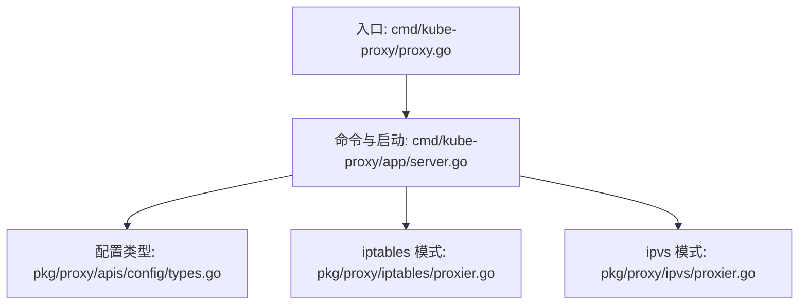
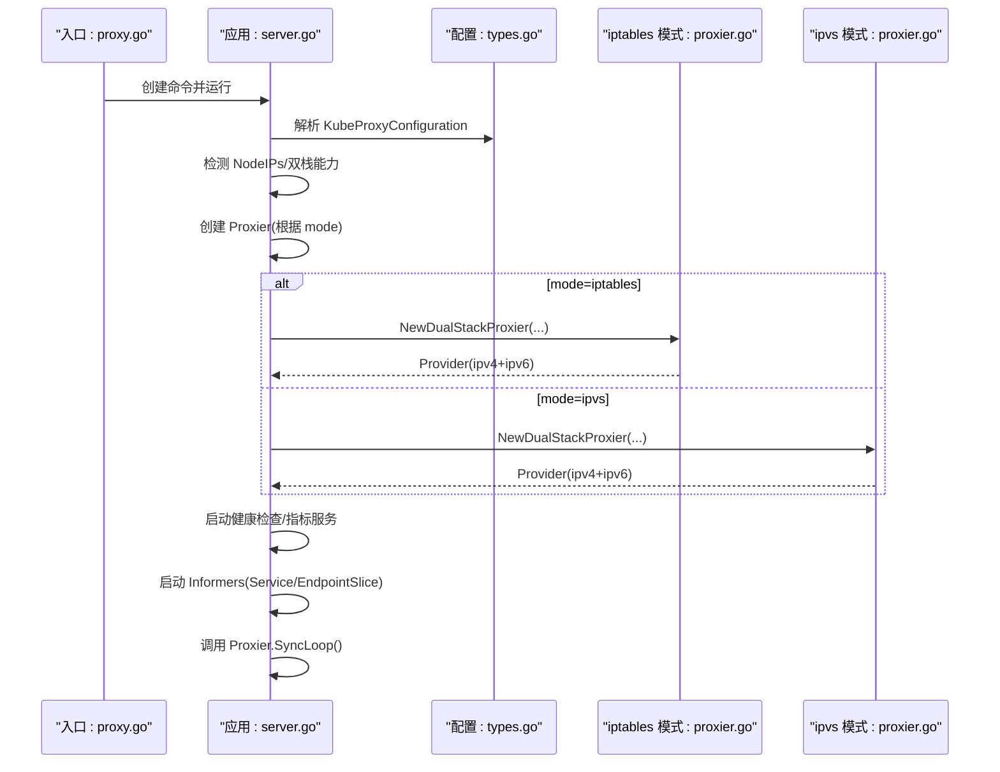
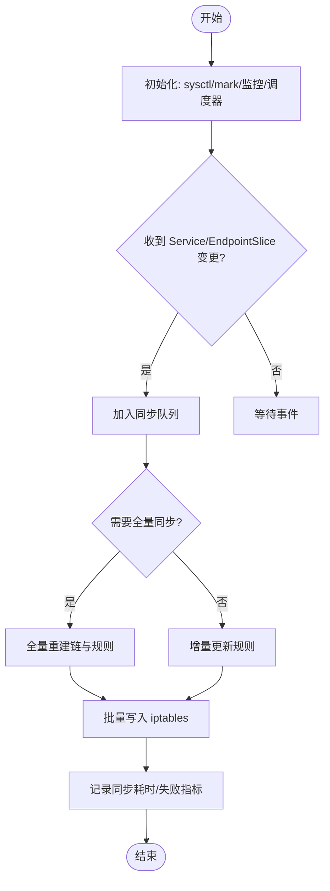
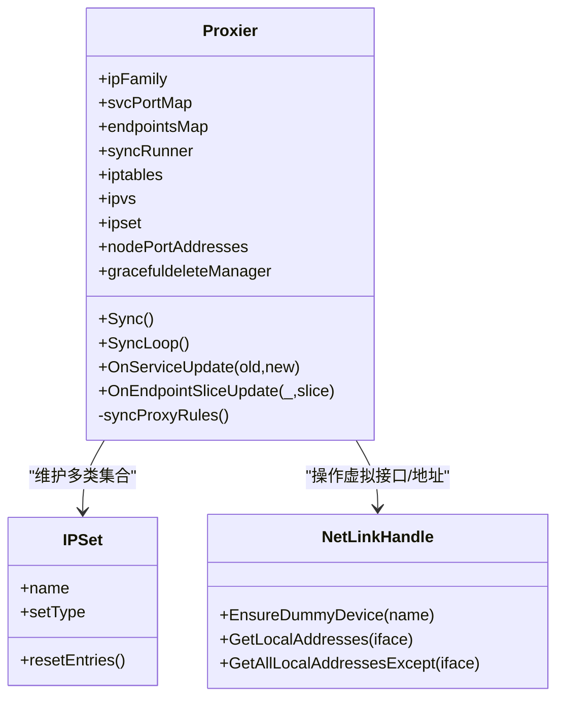
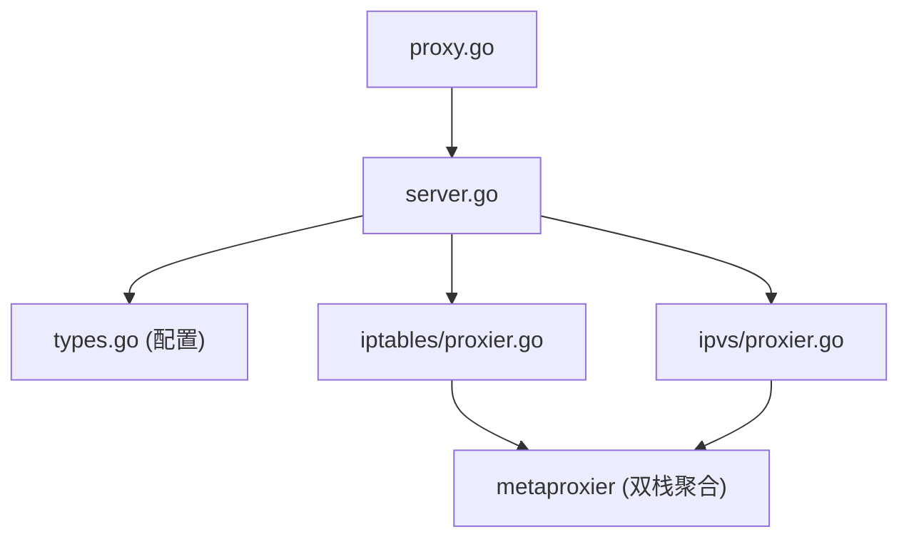

# 代理模式对比与选择

<cite>
**本文引用的文件**   
- [cmd/kube-proxy/proxy.go](file://cmd/kube-proxy/proxy.go)
- [cmd/kube-proxy/app/server.go](file://cmd/kube-proxy/app/server.go)
- [pkg/proxy/apis/config/types.go](file://pkg/proxy/apis/config/types.go)
- [pkg/proxy/iptables/proxier.go](file://pkg/proxy/iptables/proxier.go)
- [pkg/proxy/ipvs/proxier.go](file://pkg/proxy/ipvs/proxier.go)
</cite>

## 目录
1. [简介](#简介)
2. [项目结构](#项目结构)
3. [核心组件](#核心组件)
4. [架构总览](#架构总览)
5. [详细组件分析](#详细组件分析)
6. [依赖关系分析](#依赖关系分析)
7. [性能考量](#性能考量)
8. [故障排查指南](#故障排查指南)
9. [结论](#结论)
10. [附录](#附录)

## 简介
本文件聚焦于 Kube Proxy 的三种代理模式：iptables、ipvs 与 userspace（内核空间）。文档深入比较其实现原理、性能特点与适用场景，说明各模式的工作原理、配置参数、启动选项、IPv6/外部流量/会话保持支持情况，并提供模式选择的决策指南、故障排查方法与性能优化建议。

- iptables 模式：基于 Linux netfilter 框架，通过 iptables 规则实现四层转发，具备广泛兼容性与可观测性。
- ipvs 模式：基于内核 IPVS 负载均衡器，提供高性能的四层负载均衡能力，适合大规模集群。
- userspace 模式：在用户态处理请求，灵活性高但性能较低；当前代码库中未包含该模式的实现，仅保留模式常量用于历史兼容。

## 项目结构
Kube Proxy 入口位于 cmd/kube-proxy，应用初始化与运行逻辑集中在 app/server.go；配置类型定义在 pkg/proxy/apis/config/types.go；具体代理模式实现在 pkg/proxy/{iptables,ipvs} 等子包中。

**图表来源** 
- [cmd/kube-proxy/proxy.go:29-33](file://cmd/kube-proxy/proxy.go#L29-L33)
- [cmd/kube-proxy/app/server.go:184-293](file://cmd/kube-proxy/app/server.go#L184-L293)
- [pkg/proxy/apis/config/types.go:241-257](file://pkg/proxy/apis/config/types.go#L241-L257)
- [pkg/proxy/iptables/proxier.go:94-124](file://pkg/proxy/iptables/proxier.go#L94-L124)
- [pkg/proxy/ipvs/proxier.go:110-145](file://pkg/proxy/ipvs/proxier.go#L110-L145)

**章节来源**
- [cmd/kube-proxy/proxy.go:29-33](file://cmd/kube-proxy/proxy.go#L29-L33)
- [cmd/kube-proxy/app/server.go:184-293](file://cmd/kube-proxy/app/server.go#L184-L293)
- [pkg/proxy/apis/config/types.go:241-257](file://pkg/proxy/apis/config/types.go#L241-L257)

## 核心组件
- 进程入口与命令构建：创建并运行 kube-proxy 主命令。
- 服务器初始化：解析配置、建立 API Server 客户端、检测节点信息、平台能力检查、创建 Proxier 实例、启动健康检查与指标服务、启动 Informers 监听 Service/EndpointSlice 变更、进入同步循环。
- 配置模型：定义 ProxyMode、IPTables/IPVS/NFTables 等配置项，以及 conntrack、NodePortAddresses、DetectLocal 等通用设置。
- 代理模式实现：iptables 与 ipvs 两种模式分别实现 Provider 接口，负责将 Service/EndpointSlice 状态同步到内核转发表或 IPVS 服务。

**章节来源**
- [cmd/kube-proxy/proxy.go:29-33](file://cmd/kube-proxy/proxy.go#L29-L33)
- [cmd/kube-proxy/app/server.go:184-293](file://cmd/kube-proxy/app/server.go#L184-L293)
- [pkg/proxy/apis/config/types.go:158-239](file://pkg/proxy/apis/config/types.go#L158-L239)

## 架构总览
下图展示了从进程入口到不同代理模式的数据与控制流，包括配置加载、平台能力检查、Proxier 创建与同步循环。

**图表来源** 
- [cmd/kube-proxy/proxy.go:29-33](file://cmd/kube-proxy/proxy.go#L29-L33)
- [cmd/kube-proxy/app/server.go:184-293](file://cmd/kube-proxy/app/server.go#L184-L293)
- [pkg/proxy/apis/config/types.go:241-257](file://pkg/proxy/apis/config/types.go#L241-L257)
- [pkg/proxy/iptables/proxier.go:94-124](file://pkg/proxy/iptables/proxier.go#L94-L124)
- [pkg/proxy/ipvs/proxier.go:110-145](file://pkg/proxy/ipvs/proxier.go#L110-L145)

## 详细组件分析

### iptables 模式
- 工作原理
  - 基于 netfilter 的 NAT/Filter 表，维护 KUBE-SERVICES、KUBE-NODEPORTS、KUBE-FORWARD、KUBE-MARK-MASQ 等链，按 Service/EndpointSlice 增量或全量同步生成规则。
  - 支持大集群优化（减少注释、批量写入）、本地回环访问控制、nfacct 计数器等。
- 关键流程
  - 初始化时设置 sysctl（如 route_localnet），计算 masquerade mark，注册监控与同步调度器。
  - 事件驱动：Service/EndpointSlice 变更触发 Sync，内部使用 BoundedFrequencyRunner 控制最小/最大同步周期。
  - 全量/增量同步策略：根据 needFullSync 与时间阈值决定全量重建或增量更新。
- IPv6 支持
  - 通过 DualStackProxier 同时管理 IPv4/IPv6 单栈实例，统一对外暴露 Provider。
- 外部流量与会话保持
  - 通过 LoadBalancerSourceRanges 与防火墙链实现源地址过滤；会话保持由连接跟踪（conntrack）保证。
- 性能特性
  - 规则数量随 Service/Endpoint 规模线性增长，大集群下采用优化路径降低规则体积与同步开销。

**图表来源** 
- [pkg/proxy/iptables/proxier.go:209-311](file://pkg/proxy/iptables/proxier.go#L209-L311)
- [pkg/proxy/iptables/proxier.go:412-432](file://pkg/proxy/iptables/proxier.go#L412-L432)
- [pkg/proxy/iptables/proxier.go:625-713](file://pkg/proxy/iptables/proxier.go#L625-L713)

**章节来源**
- [pkg/proxy/iptables/proxier.go:94-124](file://pkg/proxy/iptables/proxier.go#L94-L124)
- [pkg/proxy/iptables/proxier.go:209-311](file://pkg/proxy/iptables/proxier.go#L209-L311)
- [pkg/proxy/iptables/proxier.go:412-432](file://pkg/proxy/iptables/proxier.go#L412-L432)
- [pkg/proxy/iptables/proxier.go:625-713](file://pkg/proxy/iptables/proxier.go#L625-L713)

### ipvs 模式
- 工作原理
  - 基于内核 IPVS 实现四层负载均衡，通过 ipset 加速匹配，结合少量 iptables 跳转链完成入口分流与 SNAT。
  - 初始化阶段设置 IPVS 相关 sysctl（如 conntrack、conn_reuse_mode、expire_nodest_conn、arp_ignore/announce 等），并可配置超时参数。
- 关键流程
  - 创建 dummy 设备（kube-ipvs0）绑定 VIP，维护多个 ipset（如 NodePort、LoadBalancer、ClusterIP 等），为每个 Service 创建 IPVS 服务与后端 RealServer。
  - 事件驱动与同步机制与 iptables 类似，使用 BoundedFrequencyRunner 控制同步频率。
- IPv6 支持
  - 同样通过 DualStackProxier 管理 IPv4/IPv6 两个单栈实例。
- 外部流量与会话保持
  - 通过 iptables 链与 ipset 组合实现 LB 源地址过滤；会话保持由 IPVS 与 conntrack 共同保障。
- 性能特性
  - 内核态转发，规则复杂度低，适合大规模高吞吐场景；ipset 提升匹配效率。

**图表来源** 
- [pkg/proxy/ipvs/proxier.go:147-236](file://pkg/proxy/ipvs/proxier.go#L147-L236)
- [pkg/proxy/ipvs/proxier.go:242-391](file://pkg/proxy/ipvs/proxier.go#L242-L391)
- [pkg/proxy/ipvs/proxier.go:457-508](file://pkg/proxy/ipvs/proxier.go#L457-L508)

**章节来源**
- [pkg/proxy/ipvs/proxier.go:110-145](file://pkg/proxy/ipvs/proxier.go#L110-L145)
- [pkg/proxy/ipvs/proxier.go:242-391](file://pkg/proxy/ipvs/proxier.go#L242-L391)
- [pkg/proxy/ipvs/proxier.go:457-508](file://pkg/proxy/ipvs/proxier.go#L457-L508)

### userspace 模式（内核空间）
- 现状说明
  - 配置类型中包含 ProxyModeKernelspace 常量，但仓库中未发现对应的 userspace 模式实现代码。该模式主要用于历史兼容或未来扩展。
- 影响与建议
  - 若选择该模式，需确保运行时存在对应实现；否则启动时将报错退出。

**章节来源**
- [pkg/proxy/apis/config/types.go:241-257](file://pkg/proxy/apis/config/types.go#L241-L257)

## 依赖关系分析
- 入口与启动
  - 入口程序创建命令，app/server.go 负责完整生命周期管理。
- 配置与模式选择
  - 配置类型集中定义模式与各项参数；server.go 根据配置创建对应 Proxier。
- 模式实现
  - iptables 与 ipvs 均实现 Provider 接口，并通过 MetaProxier 聚合双栈实例。

**图表来源** 
- [cmd/kube-proxy/proxy.go:29-33](file://cmd/kube-proxy/proxy.go#L29-L33)
- [cmd/kube-proxy/app/server.go:184-293](file://cmd/kube-proxy/app/server.go#L184-L293)
- [pkg/proxy/apis/config/types.go:241-257](file://pkg/proxy/apis/config/types.go#L241-L257)
- [pkg/proxy/iptables/proxier.go:94-124](file://pkg/proxy/iptables/proxier.go#L94-L124)
- [pkg/proxy/ipvs/proxier.go:110-145](file://pkg/proxy/ipvs/proxier.go#L110-L145)

**章节来源**
- [cmd/kube-proxy/proxy.go:29-33](file://cmd/kube-proxy/proxy.go#L29-L33)
- [cmd/kube-proxy/app/server.go:184-293](file://cmd/kube-proxy/app/server.go#L184-L293)
- [pkg/proxy/apis/config/types.go:241-257](file://pkg/proxy/apis/config/types.go#L241-L257)

## 性能考量
- iptables 模式
  - 优点：规则可观测性强，兼容性好；大集群优化减少规则体积与同步开销。
  - 缺点：规则数量随规模增长，全量同步成本较高。
  - 优化建议：合理设置 MinSyncPeriod/SyncPeriod；关注 large cluster 模式开关；避免不必要的注释与冗余规则。
- ipvs 模式
  - 优点：内核态转发，吞吐与延迟表现更优；ipset 加速匹配；适合大规模高并发。
  - 缺点：对内核版本与模块有要求；调试相对复杂。
  - 优化建议：启用 conn_reuse_mode（满足内核版本条件）；调整 IPVS 超时参数；合理使用 StrictARP 与 excludeCIDRs。
- userspace 模式
  - 优点：灵活可扩展。
  - 缺点：用户态拷贝与上下文切换带来额外开销，性能较低。
  - 适用场景：需要深度定制转发逻辑且对性能不敏感的环境。

[本节为通用指导，无需特定文件引用]

## 故障排查指南
- 启动与模式选择
  - 确认 mode 配置与实际内核支持一致；若不支持所选模式，进程会退出。
  - 检查 bindAddress、healthz/metrics 端口绑定是否冲突。
- iptables 模式
  - 观察同步失败指标与日志，必要时强制全量同步；检查 iptables 链是否存在被外部清理的情况。
  - 验证 route_localnet 与 nf_conntrack_tcp_be_liberal 等 sysctl 设置是否符合预期。
- ipvs 模式
  - 检查 IPVS 相关 sysctl 是否成功设置；确认 dummy 设备 kube-ipvs0 是否存在及地址绑定正确。
  - 核对 ipset 集合是否创建成功，LB/NodePort 相关集合条目是否正确。
- 双栈与 IPv6
  - 确认 PrimaryIPFamily 与 NodeIPs 配置一致；当非双栈时，注意 healthz/metrics/bind 地址族匹配。
- 外部流量与源地址过滤
  - 检查 LoadBalancerSourceRanges 与防火墙链、ipset 条目是否生效。

**章节来源**
- [cmd/kube-proxy/app/server.go:268-293](file://cmd/kube-proxy/app/server.go#L268-L293)
- [cmd/kube-proxy/app/server.go:329-385](file://cmd/kube-proxy/app/server.go#L329-L385)
- [pkg/proxy/iptables/proxier.go:209-311](file://pkg/proxy/iptables/proxier.go#L209-L311)
- [pkg/proxy/ipvs/proxier.go:242-391](file://pkg/proxy/ipvs/proxier.go#L242-L391)

## 结论
- 对于大多数生产环境，推荐优先选择 ipvs 模式以获得更好的性能与可扩展性；在需要强可观测性或兼容性优先的场景，可选择 iptables 模式。
- userspace 模式在当前仓库中无实现，不建议在生产中使用；如需高度定制化转发逻辑，应评估其他方案或自行实现。
- 双栈与 IPv6 方面，iptables 与 ipvs 均通过 DualStackProxier 提供良好支持；需注意 bindAddress、NodePortAddresses 等配置的族一致性。

[本节为总结性内容，无需特定文件引用]

## 附录

### 配置参数与启动选项要点
- 模式选择
  - mode: iptables / ipvs / nftables / kernelspace（userspace 对应内核空间模式，当前无实现）
- iptables 相关
  - masqueradeBit、localhostNodePorts
- ipvs 相关
  - scheduler、excludeCIDRs、strictARP、tcpTimeout/tcpFinTimeout/udpTimeout
- 通用
  - syncPeriod/minSyncPeriod、nodePortAddresses、detectLocalMode/detectLocal、healthzBindAddress/metricsBindAddress

**章节来源**
- [pkg/proxy/apis/config/types.go:45-78](file://pkg/proxy/apis/config/types.go#L45-L78)
- [pkg/proxy/apis/config/types.go:158-239](file://pkg/proxy/apis/config/types.go#L158-L239)
- [pkg/proxy/apis/config/types.go:241-257](file://pkg/proxy/apis/config/types.go#L241-L257)

### 模式选择决策指南
- 集群规模与性能
  - 大规模/高吞吐：优先 ipvs
  - 中小规模/强调可观测性：iptables
- 功能需求
  - 需要严格源地址过滤与 LB 行为：两者均支持，ipvs 更高效
  - 需要深度自定义转发：考虑 userspace（需自行实现）
- 平台与内核
  - 确保内核支持相应模块（IPVS、iptables/nftables）
- 双栈/IPv6
  - 两者均支持双栈；注意配置族一致性

[本节为通用指导，无需特定文件引用]