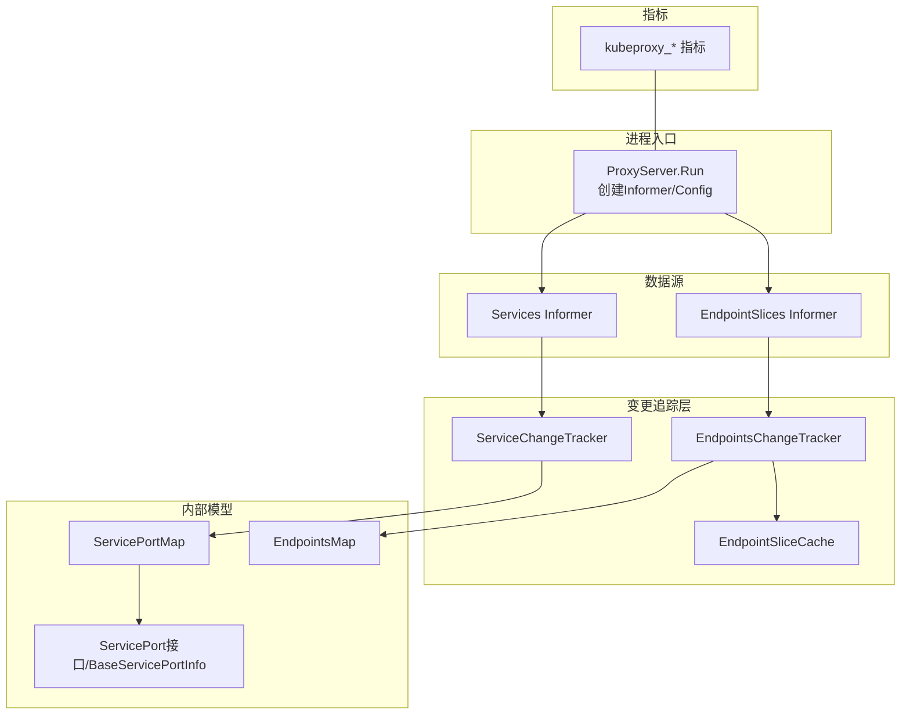
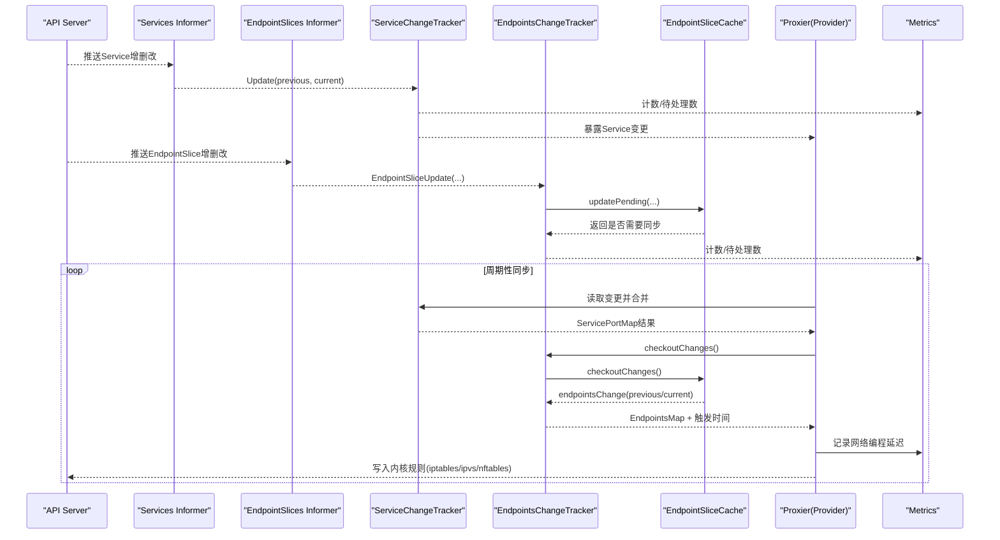
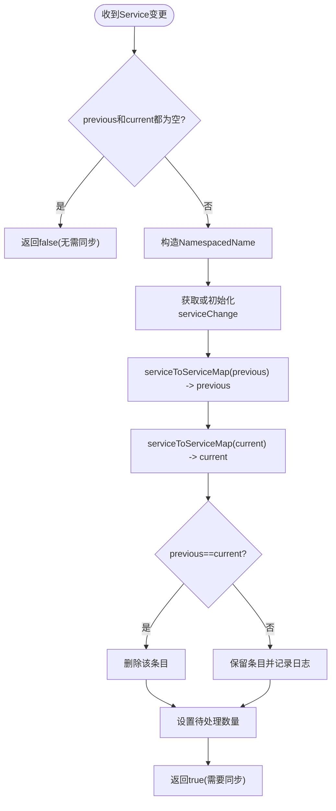
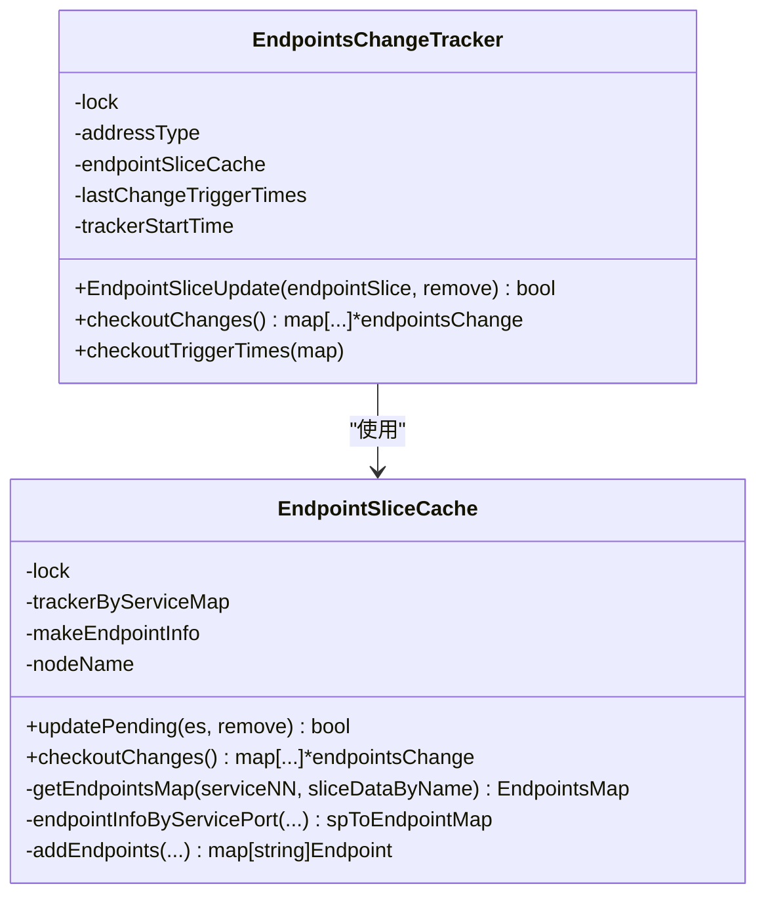
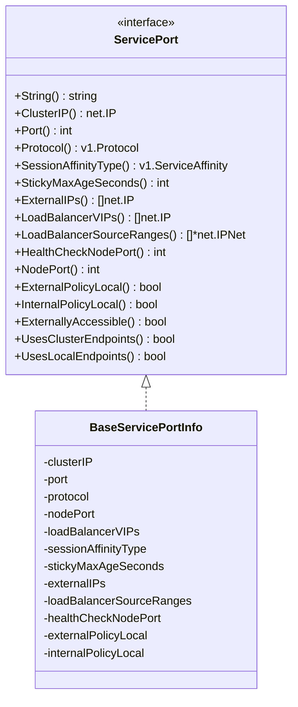
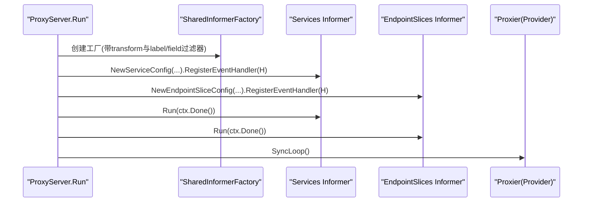
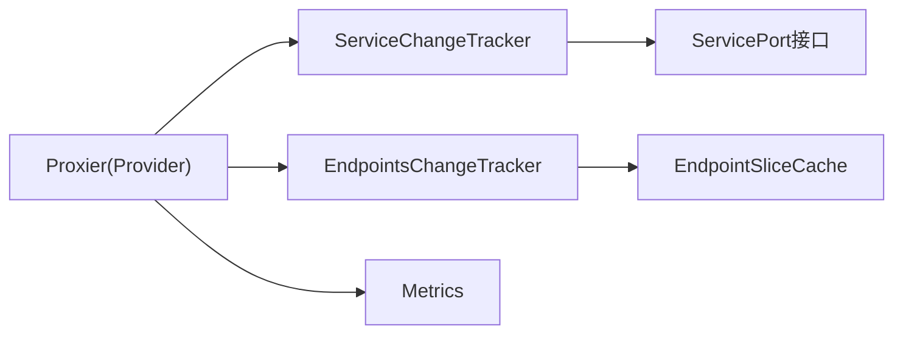

# 服务发现机制

<cite>
**本文引用的文件**   
- [server.go](file://cmd/kube-proxy/app/server.go)
- [servicechangetracker.go](file://pkg/proxy/servicechangetracker.go)
- [endpointschangetracker.go](file://pkg/proxy/endpointschangetracker.go)
- [endpointslicecache.go](file://pkg/proxy/endpointslicecache.go)
- [types.go](file://pkg/proxy/types.go)
- [serviceport.go](file://pkg/proxy/serviceport.go)
- [metrics.go](file://pkg/proxy/metrics/metrics.go)
</cite>

## 目录
1. [简介](#简介)
2. [项目结构](#项目结构)
3. [核心组件](#核心组件)
4. [架构总览](#架构总览)
5. [详细组件分析](#详细组件分析)
6. [依赖关系分析](#依赖关系分析)
7. [性能考量](#性能考量)
8. [故障诊断指南](#故障诊断指南)
9. [结论](#结论)
10. [附录](#附录)

## 简介
本文件面向Kube Proxy的服务发现机制，系统性阐述从API Server获取Service与EndpointSlice、监听变化、本地缓存更新到规则同步的完整流程。重点覆盖：
- Service到Endpoint的映射维护过程
- ServiceChangeTracker与EndpointsChangeTracker的工作机制（事件监听、增量更新、状态同步）
- EndpointSlice的使用与大规模集群优化
- 容错机制（网络分区、一致性、重试策略）
- 不同Service类型处理逻辑（ClusterIP、NodePort、LoadBalancer、ExternalName）
- 性能监控指标、调试工具与故障诊断方法
- IPv6支持、DNS集成与网络策略交互等高级特性

## 项目结构
Kube Proxy在服务发现侧的关键代码位于以下模块：
- 启动与Informer配置：cmd/kube-proxy/app/server.go
- 变更追踪器与服务端口抽象：pkg/proxy/servicechangetracker.go、pkg/proxy/serviceport.go、pkg/proxy/types.go
- EndpointSlice缓存与端点聚合：pkg/proxy/endpointslicecache.go、pkg/proxy/endpointschangetracker.go
- 指标定义与注册：pkg/proxy/metrics/metrics.go

图表来源
- [server.go:595-635](file://cmd/kube-proxy/app/server.go#L595-L635)
- [servicechangetracker.go:31-69](file://pkg/proxy/servicechangetracker.go#L31-L69)
- [endpointschangetracker.go:31-75](file://pkg/proxy/endpointschangetracker.go#L31-L75)
- [endpointslicecache.go:34-79](file://pkg/proxy/endpointslicecache.go#L34-L79)
- [serviceport.go:73-92](file://pkg/proxy/serviceport.go#L73-L92)
- [metrics.go:346-406](file://pkg/proxy/metrics/metrics.go#L346-L406)

章节来源
- [server.go:595-635](file://cmd/kube-proxy/app/server.go#L595-L635)

## 核心组件
- ServiceChangeTracker：累积并合并Service变更，生成ServicePortMap，供上层计算差异并触发清理或重建。
- EndpointsChangeTracker：基于EndpointSlice的增量变更，结合EndpointSliceCache产出EndpointsMap，并记录触发时间用于网络编程延迟度量。
- EndpointSliceCache：按Service维度维护已应用与待处理的EndpointSlice集合，去重、排序与聚合为EndpointsMap。
- ServicePort接口与BaseServicePortInfo：抽象服务端口属性（ClusterIP、NodePort、LB VIP、外部访问策略、会话亲和等），支撑不同代理后端实现。
- Provider接口：Proxier实现需满足的事件处理器与Sync/SyncLoop生命周期。

章节来源
- [servicechangetracker.go:31-69](file://pkg/proxy/servicechangetracker.go#L31-L69)
- [endpointschangetracker.go:31-75](file://pkg/proxy/endpointschangetracker.go#L31-L75)
- [endpointslicecache.go:34-79](file://pkg/proxy/endpointslicecache.go#L34-L79)
- [serviceport.go:34-92](file://pkg/proxy/serviceport.go#L34-L92)
- [types.go:27-40](file://pkg/proxy/types.go#L27-L40)

## 架构总览
下图展示了从API Server到本地规则同步的整体数据流与控制流。

图表来源
- [server.go:618-635](file://cmd/kube-proxy/app/server.go#L618-L635)
- [servicechangetracker.go:71-107](file://pkg/proxy/servicechangetracker.go#L71-L107)
- [endpointschangetracker.go:77-116](file://pkg/proxy/endpointschangetracker.go#L77-L116)
- [endpointslicecache.go:94-118](file://pkg/proxy/endpointslicecache.go#L94-L118)
- [metrics.go:82-103](file://pkg/proxy/metrics/metrics.go#L82-L103)

## 详细组件分析

### ServiceChangeTracker工作机制
- 事件接收：通过Update(previous, current)接收Service对象对，若两者均为nil则直接返回无变更。
- 增量累积：以NamespacedName为键，维护serviceChange{previous,current}；当前后一致时删除条目，避免无效同步。
- 服务过滤：跳过Headless服务与不符合当前IP族ClusterIP的服务，减少无关负载。
- 合并与清理：调用ServicePortMap.Update(sct)时，先回调processServiceMapChange进行清理，再merge(current)、unmerge(previous)，最后清空items并重置待处理指标。

图表来源
- [servicechangetracker.go:71-107](file://pkg/proxy/servicechangetracker.go#L71-L107)
- [servicechangetracker.go:133-163](file://pkg/proxy/servicechangetracker.go#L133-L163)
- [servicechangetracker.go:165-193](file://pkg/proxy/servicechangetracker.go#L165-L193)

章节来源
- [servicechangetracker.go:71-107](file://pkg/proxy/servicechangetracker.go#L71-L107)
- [servicechangetracker.go:133-163](file://pkg/proxy/servicechangetracker.go#L133-L163)
- [servicechangetracker.go:165-193](file://pkg/proxy/servicechangetracker.go#L165-L193)

### EndpointsChangeTracker与EndpointSliceCache
- 地址族过滤：仅处理与当前IP族匹配的EndpointSlice（IPv4/IPv6）。
- 增量更新：updatePending将新增/更新/删除的EndpointSlice放入pending队列，并通过esDataChanged去重。
- 批量结算：checkoutChanges将pending应用到applied，计算previous/current的EndpointsMap，并清空pending。
- 端点聚合：endpointInfoByServicePort按ServicePortName分组，addEndpoints构建唯一端点集，优先非terminating端点，保证顺序稳定便于diff。
- 触发时间：记录EndpointsLastChangeTriggerTime，用于计算网络编程延迟。

图表来源
- [endpointschangetracker.go:31-75](file://pkg/proxy/endpointschangetracker.go#L31-L75)
- [endpointschangetracker.go:77-116](file://pkg/proxy/endpointschangetracker.go#L77-L116)
- [endpointschangetracker.go:120-141](file://pkg/proxy/endpointschangetracker.go#L120-L141)
- [endpointslicecache.go:34-79](file://pkg/proxy/endpointslicecache.go#L34-L79)
- [endpointslicecache.go:94-118](file://pkg/proxy/endpointslicecache.go#L94-L118)
- [endpointslicecache.go:162-253](file://pkg/proxy/endpointslicecache.go#L162-L253)

章节来源
- [endpointschangetracker.go:77-116](file://pkg/proxy/endpointschangetracker.go#L77-L116)
- [endpointschangetracker.go:120-141](file://pkg/proxy/endpointschangetracker.go#L120-L141)
- [endpointslicecache.go:94-118](file://pkg/proxy/endpointslicecache.go#L94-L118)
- [endpointslicecache.go:162-253](file://pkg/proxy/endpointslicecache.go#L162-L253)

### ServicePort抽象与多类型Service处理
- BaseServicePortInfo实现了ServicePort接口，封装ClusterIP、NodePort、LB VIP、ExternalIPs、SourceRanges、会话亲和、健康检查端口、内外流量策略等。
- 外部可访问性：当存在NodePort/LB VIP/ExternalIPs时，ExternallyAccessible为真。
- 端点使用策略：UsesClusterEndpoints/UsesLocalEndpoints根据Internal/External Policy Local与是否外部可访问决定。
- 不同Service类型的要点：
  - ClusterIP：常规转发，依据策略选择Cluster或Local端点。
  - NodePort：对外暴露节点端口，需关注NodePortAddresses与IP族匹配。
  - LoadBalancer：VIP模式由kube-proxy处理，需关注LoadBalancerSourceRanges与IP族。
  - ExternalName：不产生ClusterIP，通常被DNS解析，不在kube-proxy转发范围内。

图表来源
- [serviceport.go:34-92](file://pkg/proxy/serviceport.go#L34-L92)
- [serviceport.go:181-247](file://pkg/proxy/serviceport.go#L181-L247)

章节来源
- [serviceport.go:34-92](file://pkg/proxy/serviceport.go#L34-L92)
- [serviceport.go:181-247](file://pkg/proxy/serviceport.go#L181-L247)

### 启动与Informer配置（事件订阅）
- 创建SharedInformerFactory，分别监听Services与EndpointSlices，并过滤Headless服务与非代理Service。
- 注册事件处理器至Proxier，随后启动Informer与SyncLoop。
- 健康检查与指标服务在独立goroutine中运行。

图表来源
- [server.go:595-635](file://cmd/kube-proxy/app/server.go#L595-L635)

章节来源
- [server.go:595-635](file://cmd/kube-proxy/app/server.go#L595-L635)

## 依赖关系分析
- 组件耦合：
  - Proxier依赖ServiceChangeTracker与EndpointsChangeTracker提供的增量变更视图。
  - EndpointsChangeTracker强依赖EndpointSliceCache进行端点聚合与去重。
  - ServiceChangeTracker依赖ServicePort接口抽象，屏蔽不同代理后端差异。
- 外部依赖：
  - Informer从API Server拉取资源，受网络与配额影响。
  - 指标系统通过legacyregistry统一暴露。

图表来源
- [types.go:27-40](file://pkg/proxy/types.go#L27-L40)
- [servicechangetracker.go:31-69](file://pkg/proxy/servicechangetracker.go#L31-L69)
- [endpointschangetracker.go:31-75](file://pkg/proxy/endpointschangetracker.go#L31-L75)
- [endpointslicecache.go:34-79](file://pkg/proxy/endpointslicecache.go#L34-L79)
- [metrics.go:346-406](file://pkg/proxy/metrics/metrics.go#L346-L406)

章节来源
- [types.go:27-40](file://pkg/proxy/types.go#L27-L40)

## 性能考量
- 增量更新与去重：
  - ServiceChangeTracker仅在previous!=current时保留条目，避免重复同步。
  - EndpointSliceCache通过esDataChanged比较pending/applied，避免冗余更新。
- 端点排序与稳定性：
  - endpointsMapFromEndpointInfo对端点列表排序，降低diff抖动，提升规则增量效率。
- UDP连接跟踪：
  - EndpointsMap.Update检测UDP端口变更，必要时触发conntrack清理，避免脏连接。
- 大规模集群优化：
  - EndpointSlice按Service分片，减少单对象体积；按AddressType隔离IPv4/IPv6，避免跨族干扰。
  - 过滤Headless服务与非代理Service，降低无用事件。
- 指标观测：
  - 使用NetworkProgrammingLatency、EndpointChangesPending、ServiceChangesPending等指标评估端到端延迟与积压。

章节来源
- [endpointslicecache.go:289-308](file://pkg/proxy/endpointslicecache.go#L289-L308)
- [endpointschangetracker.go:193-235](file://pkg/proxy/endpointschangetracker.go#L193-L235)
- [metrics.go:82-147](file://pkg/proxy/metrics/metrics.go#L82-L147)

## 故障诊断指南
- 关键指标
  - kubeproxy_sync_proxy_rules_endpoint_changes_pending：端点变更积压
  - kubeproxy_sync_proxy_rules_service_changes_pending：服务变更积压
  - kubeproxy_network_programming_duration_seconds：网络编程延迟
  - kubeproxy_sync_proxy_rules_iptables_restore_failures_total / nftables_sync_failures_total：底层规则写入失败
  - kubeproxy_sync_proxy_rules_last_queued_timestamp_seconds vs last_timestamp_seconds：判断是否卡住
- 常见症状与定位
  - 端点不生效：检查EndpointSlice是否正确分发、AddressType是否匹配、端点Ready/Serving/Terminating状态。
  - 高延迟：观察NetworkProgrammingLatency分布，排查底层iptables/ipvs/nftables恢复失败。
  - UDP异常：确认ConntrackCleanupRequired标志与conntrack清理耗时。
- 调试手段
  - 启用Profiling与zpages（通过Metrics服务器暴露），抓取CPU/内存profile。
  - 查看健康检查与livez状态，确认服务可用性。
  - 核对NodePortAddresses与IP族配置，避免绑定错误导致不可达。

章节来源
- [metrics.go:346-406](file://pkg/proxy/metrics/metrics.go#L346-L406)
- [server.go:469-532](file://cmd/kube-proxy/app/server.go#L469-L532)

## 结论
Kube Proxy的服务发现机制以ServiceChangeTracker与EndpointsChangeTracker为核心，配合EndpointSliceCache完成高效增量更新与聚合。通过严格的IP族过滤、端点去重与排序、以及完善的指标体系，系统在大规模集群下具备良好的可扩展性与可观测性。合理配置NodePortAddresses、LB SourceRanges与IP族策略，并结合健康检查与指标监控，可有效保障服务发现的稳定性与性能。

## 附录

### 不同类型Service的处理要点
- ClusterIP：常规转发，遵循Internal/External Traffic Policy与IP族策略。
- NodePort：需确保NodePortAddresses包含对应IP族，避免绑定到回环或不存在的地址。
- LoadBalancer：VIP模式下由kube-proxy处理，注意SourceRanges与IP族匹配。
- ExternalName：由DNS解析，不进入kube-proxy转发路径。

章节来源
- [serviceport.go:163-179](file://pkg/proxy/serviceport.go#L163-L179)
- [server.go:612-617](file://cmd/kube-proxy/app/server.go#L612-L617)

### IPv6支持与双栈
- 通过PrimaryIPFamily与NodeIPs检测平台能力，自动选择IPv4/IPv6主族。
- EndpointSlice按AddressType区分IPv4/IPv6，避免跨族污染。
- 配置校验：checkBadIPConfig检查CIDR与BindAddress族一致性，防止误配。

章节来源
- [server.go:268-285](file://cmd/kube-proxy/app/server.go#L268-L285)
- [server.go:329-385](file://cmd/kube-proxy/app/server.go#L329-L385)
- [endpointschangetracker.go:62-75](file://pkg/proxy/endpointschangetracker.go#L62-L75)

### DNS集成与网络策略交互
- Headless服务由DNS解析，kube-proxy默认不监听其Endpoints，避免重复转发。
- 网络策略（NetworkPolicy）与Service转发链路相互独立，但需注意NodePort/ExternalIP的路径可能受策略影响。

章节来源
- [server.go:578-585](file://cmd/kube-proxy/app/server.go#L578-L585)
- [server.go:612-617](file://cmd/kube-proxy/app/server.go#L612-L617)