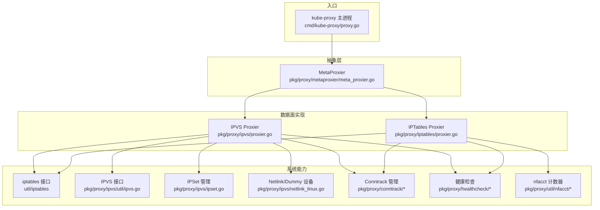
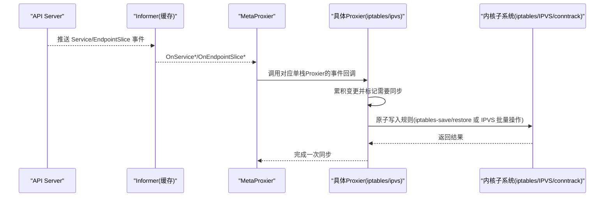
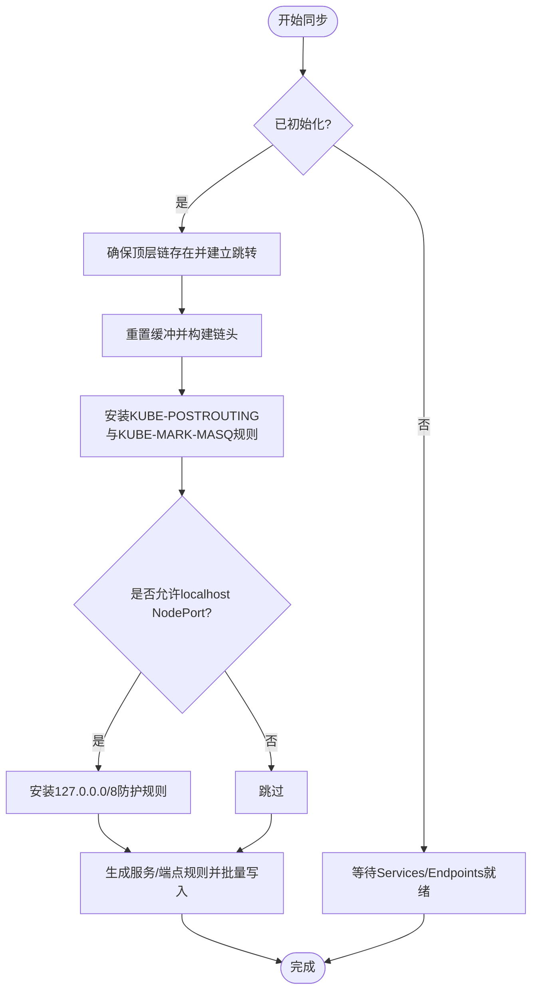
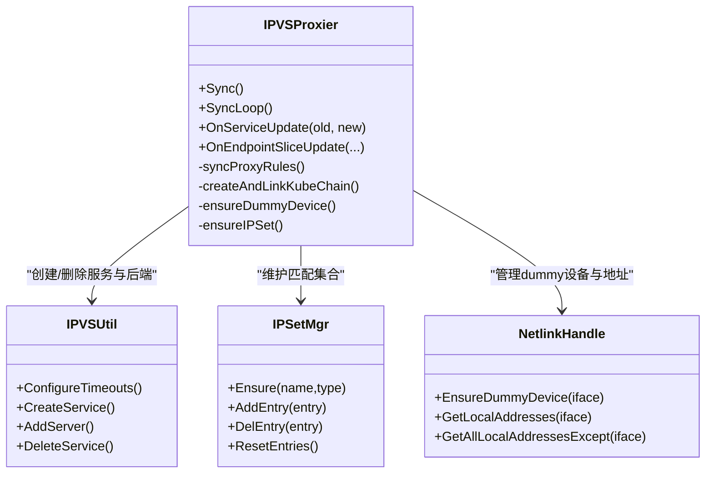
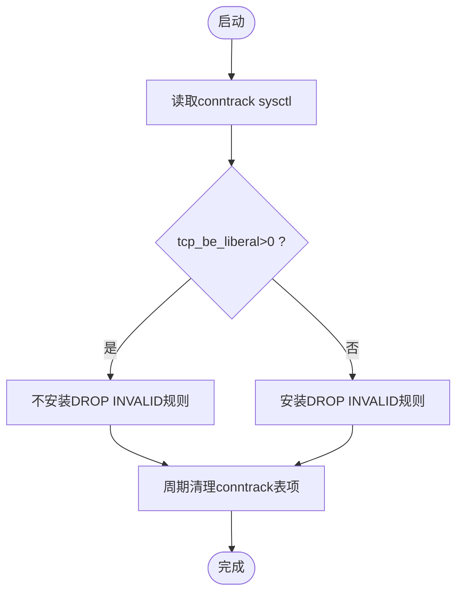
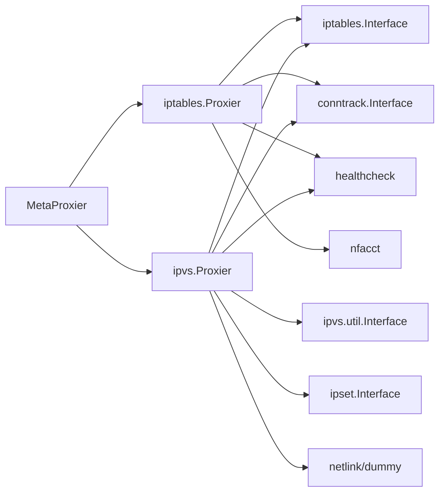

# 网络规则管理

<cite>
**本文引用的文件**
- [proxy.go](file://cmd/kube-proxy/proxy.go)
- [proxier.go（iptables）](file://pkg/proxy/iptables/proxier.go)
- [proxier.go（ipvs）](file://pkg/proxy/ipvs/proxier.go)
- [cleanup.go（iptables）](file://pkg/proxy/iptables/cleanup.go)
- [cleanup.go（ipvs）](file://pkg/proxy/ipvs/cleanup.go)
- [conntrack.go](file://pkg/proxy/conntrack/conntrack.go)
- [cleanup.go（conntrack）](file://pkg/proxy/conntrack/cleanup.go)
- [sysctls.go（conntrack）](file://pkg/proxy/conntrack/sysctls.go)
- [service_health.go](file://pkg/proxy/healthcheck/service_health.go)
- [proxy_health.go](file://pkg/proxy/healthcheck/proxy_health.go)
- [meta_proxier.go](file://pkg/proxy/metaproxier/meta_proxier.go)
- [supported.go（ipvs）](file://pkg/proxy/ipvs/supported.go)
- [netlink_linux.go（ipvs）](file://pkg/proxy/ipvs/netlink_linux.go)
- [ipset.go（ipvs）](file://pkg/proxy/ipvs/ipset.go)
- [ipvs.go（ipvs util）](file://pkg/proxy/ipvs/util/ipvs.go)
- [nfacct_linux.go](file://pkg/proxy/util/nfacct/nfacct_linux.go)
</cite>

## 目录
1. [简介](#简介)
2. [项目结构](#项目结构)
3. [核心组件](#核心组件)
4. [架构总览](#架构总览)
5. [详细组件分析](#详细组件分析)
6. [依赖关系分析](#依赖关系分析)
7. [性能考虑](#性能考虑)
8. [故障排查指南](#故障排查指南)
9. [结论](#结论)
10. [附录](#附录)

## 简介
本文件面向Kube Proxy的网络规则管理，聚焦以下主题：
- 网络规则的生成、配置与管理机制（端口转发、流量分发、连接跟踪等）
- iptables模式下的链结构设计及PREROUTING、OUTPUT、POSTROUTING等链的规则配置
- ipvs模式下虚拟服务的创建与管理（调度算法、健康检查、会话保持等）
- 连接跟踪（conntrack）的管理与优化（清理、内存、性能调优）
- 一致性保证（原子更新、回滚策略、冲突解决）
- 外部流量处理、反向代理、TLS终止等特殊场景
- 监控指标、调试工具与性能分析方法
- 防火墙兼容性、安全策略集成与网络隔离

## 项目结构
Kube Proxy在Linux平台提供两种数据面实现：iptables与ipvs。两者均通过统一的接口对外暴露，并由双栈MetaProxier进行编排。

图表来源
- [proxy.go:1-34](file://cmd/kube-proxy/proxy.go#L1-L34)
- [meta_proxier.go](file://pkg/proxy/metaproxier/meta_proxier.go)
- [proxier.go（iptables）:1-120](file://pkg/proxy/iptables/proxier.go#L1-L120)
- [proxier.go（ipvs）:1-145](file://pkg/proxy/ipvs/proxier.go#L1-L145)
- [ipvs.go（ipvs util）](file://pkg/proxy/ipvs/util/ipvs.go)
- [ipset.go（ipvs）](file://pkg/proxy/ipvs/ipset.go)
- [netlink_linux.go（ipvs）](file://pkg/proxy/ipvs/netlink_linux.go)
- [conntrack.go](file://pkg/proxy/conntrack/conntrack.go)
- [proxy_health.go](file://pkg/proxy/healthcheck/proxy_health.go)
- [service_health.go](file://pkg/proxy/healthcheck/service_health.go)
- [nfacct_linux.go](file://pkg/proxy/util/nfacct/nfacct_linux.go)

章节来源
- [proxy.go:1-34](file://cmd/kube-proxy/proxy.go#L1-L34)
- [proxier.go（iptables）:1-120](file://pkg/proxy/iptables/proxier.go#L1-L120)
- [proxier.go（ipvs）:1-145](file://pkg/proxy/ipvs/proxier.go#L1-L145)

## 核心组件
- 统一入口与命令装配：主进程加载应用命令并启动。
- 双栈编排：MetaProxier将IPv4/IPv6单栈实例组合，统一对外提供Provider接口。
- iptables数据面：基于内核netfilter的NAT/FILTER表，维护KUBE-SERVICES、KUBE-NODEPORTS、KUBE-FORWARD、KUBE-POSTROUTING等链。
- ipvs数据面：基于内核IPVS的负载均衡，结合iptables做少量跳转与SNAT，使用IPSet加速匹配。
- 连接跟踪：负责conntrack表项清理、相关sysctl设置与统计。
- 健康检查：服务级与代理级健康探针，支持NodePort与ClusterIP访问路径。
- nfacct计数：用于更精确的丢包/接受计数指标。

章节来源
- [proxy.go:1-34](file://cmd/kube-proxy/proxy.go#L1-L34)
- [meta_proxier.go](file://pkg/proxy/metaproxier/meta_proxier.go)
- [proxier.go（iptables）:120-312](file://pkg/proxy/iptables/proxier.go#L120-L312)
- [proxier.go（ipvs）:147-391](file://pkg/proxy/ipvs/proxier.go#L147-L391)
- [conntrack.go](file://pkg/proxy/conntrack/conntrack.go)
- [proxy_health.go](file://pkg/proxy/healthcheck/proxy_health.go)
- [service_health.go](file://pkg/proxy/healthcheck/service_health.go)
- [nfacct_linux.go](file://pkg/proxy/util/nfacct/nfacct_linux.go)

## 架构总览
Kube Proxy以事件驱动方式监听Service与EndpointSlice变更，聚合变化后周期性或触发式同步到数据面。iptables与ipvs两种模式共享一致的API与生命周期模型。

图表来源
- [proxier.go（iptables）:446-523](file://pkg/proxy/iptables/proxier.go#L446-L523)
- [proxier.go（ipvs）:580-655](file://pkg/proxy/ipvs/proxier.go#L580-L655)
- [meta_proxier.go](file://pkg/proxy/metaproxier/meta_proxier.go)

## 详细组件分析

### iptables模式：链结构与规则生成
- 关键链
  - KUBE-SERVICES：服务入口，从PREROUTING/INPUT/OUTPUT跳转至该链，按协议+端口分发到各服务子链。
  - KUBE-EXTERNAL-SERVICES：外部可见服务入口，仅匹配NEW连接。
  - KUBE-NODEPORTS：NodePort入口，支持本地回环访问控制与SNAT标记。
  - KUBE-FORWARD：转发策略与允许规则。
  - KUBE-POSTROUTING：对需要SNAT的流量打标记并执行MASQUERADE。
  - KUBE-MARK-MASQ：为后续SNAT打标记。
  - KUBE-PROXY-FIREWALL：LB源地址范围过滤等。
- 跳转安装
  - 全量同步时确保上述链存在，并在PREROUTING/INPUT/OUTPUT/FORWARD/Postrouting中建立跳转规则。
- 大集群优化
  - 当端点数量超过阈值时进入“大集群模式”，减少注释以降低规则体积，提升性能。
- 本地回环NodePort安全
  - 启用route_localnet时，安装额外规则阻止非本地源访问127.0.0.0/8，避免安全漏洞。
- 概率预计算
  - 针对随机权重分发，预计算1/n形式的概率字符串，降低CPU开销。

图表来源
- [proxier.go（iptables）:54-88](file://pkg/proxy/iptables/proxier.go#L54-L88)
- [proxier.go（iptables）:364-388](file://pkg/proxy/iptables/proxier.go#L364-L388)
- [proxier.go（iptables）:625-713](file://pkg/proxy/iptables/proxier.go#L625-L713)
- [proxier.go（iptables）:766-788](file://pkg/proxy/iptables/proxier.go#L766-L788)
- [proxier.go（iptables）:390-410](file://pkg/proxy/iptables/proxier.go#L390-L410)

章节来源
- [proxier.go（iptables）:54-88](file://pkg/proxy/iptables/proxier.go#L54-L88)
- [proxier.go（iptables）:364-388](file://pkg/proxy/iptables/proxier.go#L364-L388)
- [proxier.go（iptables）:625-713](file://pkg/proxy/iptables/proxier.go#L625-L713)
- [proxier.go（iptables）:766-788](file://pkg/proxy/iptables/proxier.go#L766-L788)
- [proxier.go（iptables）:390-410](file://pkg/proxy/iptables/proxier.go#L390-L410)

### ipvs模式：虚拟服务创建与管理
- 系统参数
  - 开启IPVS conntrack、连接复用、无目的连接过期、静默模板过期、IP转发；可选StrictARP模式调整arp_ignore/arp_announce。
  - 可配置TCP/TCPFIN/UDP超时时间。
- 虚拟服务与后端
  - 为每个ServicePort创建IPVS虚拟服务，选择调度算法（默认rr），添加真实服务器（端点）。
  - 使用IPSet加速匹配（如NodePort、LoadBalancer、SourceRanges等）。
  - 通过dummy设备kube-ipvs0绑定VIP，便于本机访问与SNAT。
- iptables配合
  - 在NAT/Filter表中建立少量跳转链，将特定流量导向IPVS或进行SNAT标记。
- 优雅终止
  - 提供优雅删除管理器，协调IPVS后端下线时的连接平滑过渡。

图表来源
- [proxier.go（ipvs）:241-391](file://pkg/proxy/ipvs/proxier.go#L241-L391)
- [proxier.go（ipvs）:406-508](file://pkg/proxy/ipvs/proxier.go#L406-L508)
- [ipvs.go（ipvs util）](file://pkg/proxy/ipvs/util/ipvs.go)
- [ipset.go（ipvs）](file://pkg/proxy/ipvs/ipset.go)
- [netlink_linux.go（ipvs）](file://pkg/proxy/ipvs/netlink_linux.go)

章节来源
- [proxier.go（ipvs）:98-107](file://pkg/proxy/ipvs/proxier.go#L98-L107)
- [proxier.go（ipvs）:241-391](file://pkg/proxy/ipvs/proxier.go#L241-L391)
- [proxier.go（ipvs）:406-508](file://pkg/proxy/ipvs/proxier.go#L406-L508)

### 连接跟踪（conntrack）管理
- 清理策略
  - 定期扫描并清理孤儿/过期条目，释放内存。
- sysctl调优
  - 根据运行环境设置nf_conntrack相关参数，例如tcp_be_liberal放宽无效包判定。
- 与数据面联动
  - iptables/ipvs在规则中利用conntrack状态进行匹配与放行。

图表来源
- [proxier.go（iptables）:237-245](file://pkg/proxy/iptables/proxier.go#L237-L245)
- [cleanup.go（conntrack）](file://pkg/proxy/conntrack/cleanup.go)
- [sysctls.go（conntrack）](file://pkg/proxy/conntrack/sysctls.go)

章节来源
- [proxier.go（iptables）:237-245](file://pkg/proxy/iptables/proxier.go#L237-L245)
- [cleanup.go（conntrack）](file://pkg/proxy/conntrack/cleanup.go)
- [sysctls.go（conntrack）](file://pkg/proxy/conntrack/sysctls.go)

### 健康检查与服务可达性
- 服务级健康检查：对Service的ClusterIP/NodePort进行探测，记录健康状态。
- 代理级健康检查：暴露kube-proxy自身健康端点，反映同步队列与最近更新时间。

章节来源
- [service_health.go](file://pkg/proxy/healthcheck/service_health.go)
- [proxy_health.go](file://pkg/proxy/healthcheck/proxy_health.go)

### 一致性保证与原子更新
- iptables模式
  - 采用iptables-save/restore进行批量原子写入；若失败则标记需要全量重同步，避免部分规则导致的不一致。
  - Monitor检测iptables被flush后强制全量同步，重建跳转链。
- ipvs模式
  - 先准备所有目标状态（IPVS服务、后端、IPSet、dummy设备），再批量应用；失败时回退到上一轮稳定状态。
- 冲突解决
  - 通过命名空间化的链名与IPSet名称避免冲突；对重复/缺失资源进行幂等处理。

章节来源
- [proxier.go（iptables）:625-713](file://pkg/proxy/iptables/proxier.go#L625-L713)
- [proxier.go（ipvs）:657-746](file://pkg/proxy/ipvs/proxier.go#L657-L746)

### 外部流量处理、反向代理与TLS终止
- 外部流量
  - LoadBalancer类型：通过IPSet匹配LB VIP，结合iptables跳转到IPVS或SNAT。
  - NodePort：在NAT链中匹配端口集，必要时打SNAT标记。
- 反向代理
  - kube-proxy本身不做HTTP反向代理，但可通过Service/Endpoint指向外部代理Pod实现。
- TLS终止
  - 由上游Ingress控制器或Sidecar在Pod内完成，kube-proxy仅负责四层转发。

章节来源
- [proxier.go（ipvs）:406-508](file://pkg/proxy/ipvs/proxier.go#L406-L508)
- [proxier.go（iptables）:364-388](file://pkg/proxy/iptables/proxier.go#L364-L388)

### 监控指标与调试
- 指标
  - 同步延迟（全量/部分）、失败计数、最近排队时间等。
  - nfacct计数器用于更细粒度的丢弃/接受统计。
- 调试
  - 查看iptables规则与IPVS状态；观察dummy设备与IPSet内容；检查conntrack表大小与清理效果。

章节来源
- [proxier.go（iptables）:635-672](file://pkg/proxy/iptables/proxier.go#L635-L672)
- [proxier.go（ipvs）:674-679](file://pkg/proxy/ipvs/proxier.go#L674-L679)
- [nfacct_linux.go](file://pkg/proxy/util/nfacct/nfacct_linux.go)

## 依赖关系分析
- 组件耦合
  - MetaProxier解耦IPv4/IPv6单栈实现，屏蔽差异。
  - iptables/ipvs共用Service/EndpointSlice变更追踪器，降低重复逻辑。
- 外部依赖
  - iptables命令行接口、IPVS netlink接口、IPSet、conntrack、sysctl、nfacct。
- 潜在循环
  - 通过事件总线单向传播，避免循环依赖。

图表来源
- [meta_proxier.go](file://pkg/proxy/metaproxier/meta_proxier.go)
- [proxier.go（iptables）:120-312](file://pkg/proxy/iptables/proxier.go#L120-L312)
- [proxier.go（ipvs）:147-391](file://pkg/proxy/ipvs/proxier.go#L147-L391)
- [conntrack.go](file://pkg/proxy/conntrack/conntrack.go)
- [proxy_health.go](file://pkg/proxy/healthcheck/proxy_health.go)
- [nfacct_linux.go](file://pkg/proxy/util/nfacct/nfacct_linux.go)

章节来源
- [proxier.go（iptables）:120-312](file://pkg/proxy/iptables/proxier.go#L120-L312)
- [proxier.go（ipvs）:147-391](file://pkg/proxy/ipvs/proxier.go#L147-L391)

## 性能考虑
- 规则规模
  - 大集群模式减少注释、合并规则，降低iptables-save/restore耗时。
- 批量写入
  - 使用一次性restore或IPVS批量操作，减少系统调用次数。
- 预计算
  - 概率值预计算避免频繁浮点转字符串。
- 内存复用
  - 重用LineBuffer与bytes.Buffer，减少GC压力。
- 内核参数
  - 合理设置conntrack与IPVS超时，避免表膨胀与连接抖动。

[本节为通用指导，无需源码引用]

## 故障排查指南
- 规则未生效
  - 检查iptables/ipvs链是否存在、跳转是否正确；确认Monitor是否检测到flush并触发全量同步。
- 连接异常
  - 查看conntrack表大小与清理情况；核对tcp_be_liberal等sysctl设置。
- NodePort不可达
  - 校验nodeport地址选择与本地回环策略；确认KUBE-NODEPORTS链命中。
- LB访问受限
  - 检查KUBE-PROXY-FIREWALL与源地址范围匹配；确认IPSet成员正确。
- 优雅终止问题
  - 关注IPVS后端下线顺序与连接迁移日志。

章节来源
- [proxier.go（iptables）:625-713](file://pkg/proxy/iptables/proxier.go#L625-L713)
- [proxier.go（ipvs）:657-746](file://pkg/proxy/ipvs/proxier.go#L657-L746)
- [cleanup.go（iptables）](file://pkg/proxy/iptables/cleanup.go)
- [cleanup.go（ipvs）](file://pkg/proxy/ipvs/cleanup.go)
- [cleanup.go（conntrack）](file://pkg/proxy/conntrack/cleanup.go)

## 结论
Kube Proxy通过统一的抽象层与双栈编排，在iptables与ipvs两种数据面间提供一致的服务发现与流量转发能力。iptables模式适合中小规模与强兼容场景，ipvs模式在高吞吐与大规模下更具优势。通过原子更新、健康检查、连接跟踪与精细化指标，系统在稳定性与可观测性方面具备良好保障。

[本节为总结，无需源码引用]

## 附录
- 术语
  - PREROUTING/INPUT/OUTPUT/POSTROUTING：内核netfilter钩子链。
  - IPVS：内核级四层负载均衡。
  - IPSet：高效IP/端口集合匹配数据结构。
  - conntrack：内核连接跟踪子系统。
- 参考
  - 内核文档关于nf_conntrack与IPVS的参数说明。

[本节为概念性补充，无需源码引用]