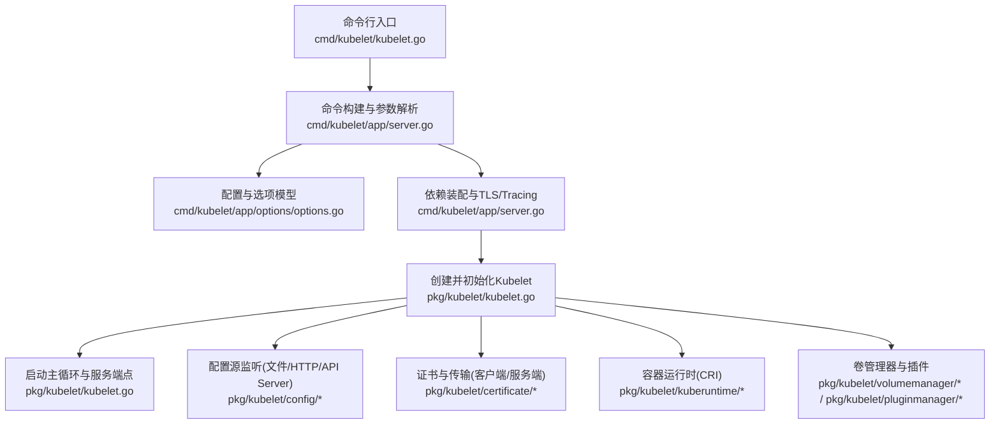
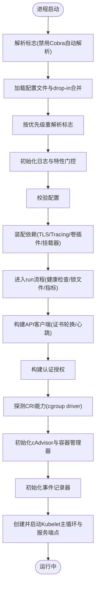
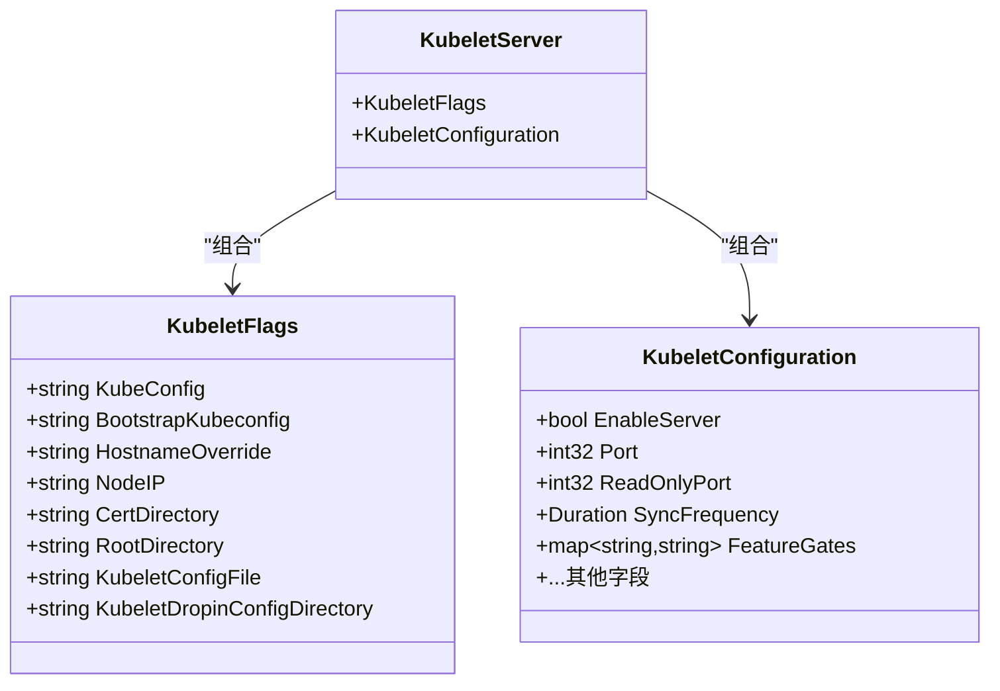
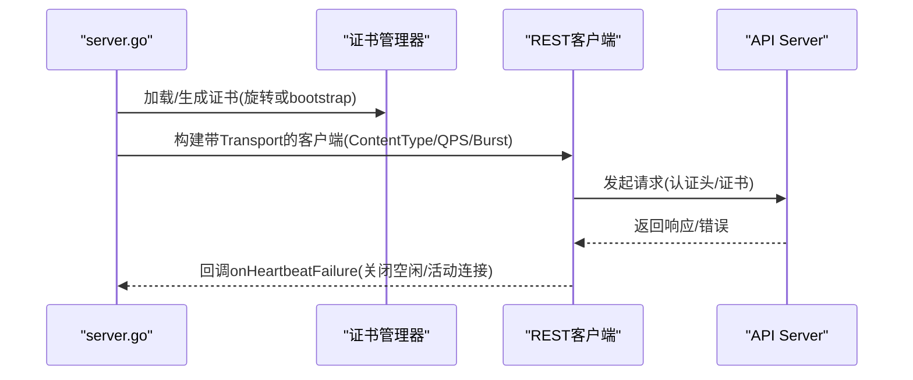
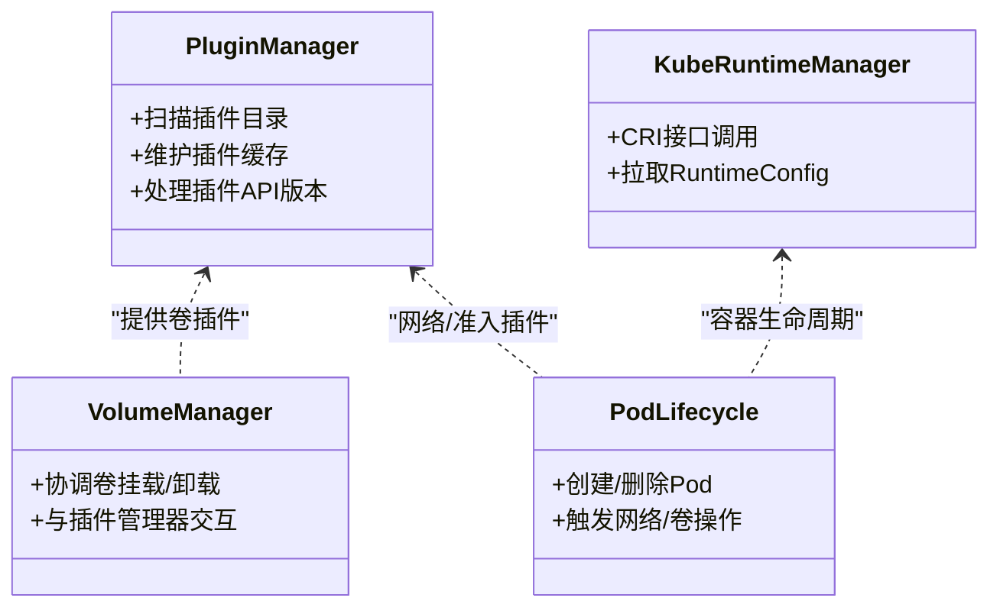
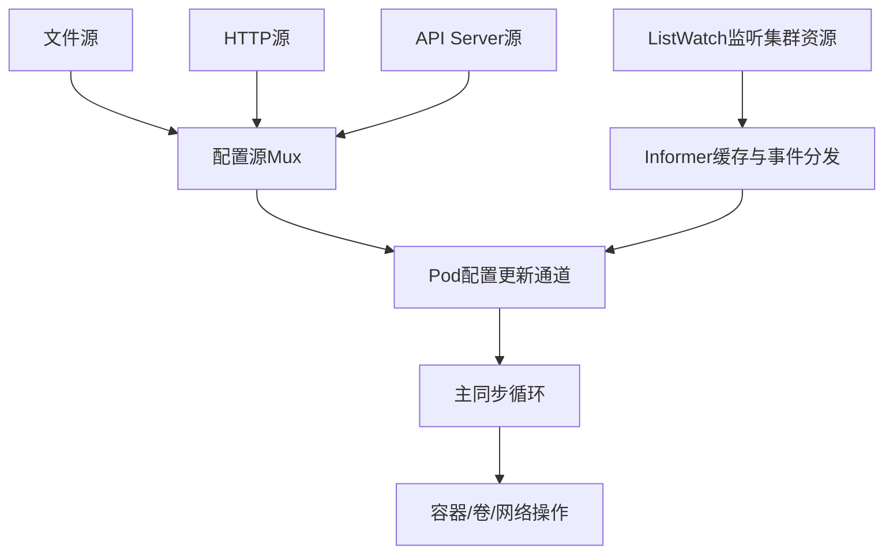
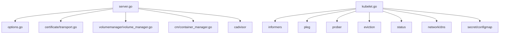

# Kubelet架构设计

<cite>
**本文引用的文件**   
- [cmd/kubelet/kubelet.go](file://cmd/kubelet/kubelet.go)
- [cmd/kubelet/app/server.go](file://cmd/kubelet/app/server.go)
- [cmd/kubelet/app/options/options.go](file://cmd/kubelet/app/options/options.go)
- [pkg/kubelet/kubelet.go](file://pkg/kubelet/kubelet.go)
- [pkg/kubelet/pluginmanager/plugin_manager.go](file://pkg/kubelet/pluginmanager/plugin_manager.go)
- [pkg/kubelet/config/config.go](file://pkg/kubelet/config/config.go)
- [pkg/kubelet/config/apiserver.go](file://pkg/kubelet/config/apiserver.go)
- [pkg/kubelet/config/file.go](file://pkg/kubelet/config/file.go)
- [pkg/kubelet/config/http.go](file://pkg/kubelet/config/http.go)
- [pkg/kubelet/config/mux.go](file://pkg/kubelet/config/mux.go)
- [pkg/kubelet/certificate/transport.go](file://pkg/kubelet/certificate/transport.go)
- [pkg/kubelet/kuberuntime/kuberuntime_manager.go](file://pkg/kubelet/kuberuntime/kuberuntime_manager.go)
- [pkg/kubelet/volumemanager/volume_manager.go](file://pkg/kubelet/volumemanager/volume_manager.go)
</cite>

## 目录
1. [简介](#简介)
2. [项目结构](#项目结构)
3. [核心组件](#核心组件)
4. [架构总览](#架构总览)
5. [详细组件分析](#详细组件分析)
6. [依赖关系分析](#依赖关系分析)
7. [性能考量](#性能考量)
8. [故障排查指南](#故障排查指南)
9. [结论](#结论)
10. [附录](#附录)

## 简介
本文件面向Kubernetes节点代理Kubelet的架构设计与实现，系统性阐述主进程启动流程、配置管理、与API Server通信机制、插件系统（CRI、卷、网络、准入控制）、事件驱动与Informer机制、状态同步等关键主题。文档以源码为依据，提供架构图与流程图，帮助读者从高层到代码级理解Kubelet内部工作原理。

## 项目结构
Kubelet入口位于命令行程序，随后进入应用层初始化、依赖装配、运行时准备、服务注册与运行循环。核心路径包括：
- 命令行入口与命令构建：cmd/kubelet/kubelet.go、cmd/kubelet/app/server.go
- 参数与配置模型：cmd/kubelet/app/options/options.go
- 主Kubelet对象与生命周期：pkg/kubelet/kubelet.go
- 配置源与监听：pkg/kubelet/config/*
- 证书与传输：pkg/kubelet/certificate/*
- 容器运行时接口：pkg/kubelet/kuberuntime/*
- 卷管理与插件：pkg/kubelet/volumemanager/*、pkg/kubelet/pluginmanager/*



**图表来源** 
- [cmd/kubelet/kubelet.go:35-39](file://cmd/kubelet/kubelet.go#L35-L39)
- [cmd/kubelet/app/server.go:142-329](file://cmd/kubelet/app/server.go#L142-L329)
- [cmd/kubelet/app/options/options.go:226-255](file://cmd/kubelet/app/options/options.go#L226-L255)
- [pkg/kubelet/kubelet.go:1344-1390](file://pkg/kubelet/kubelet.go#L1344-L1390)

**章节来源**
- [cmd/kubelet/kubelet.go:35-39](file://cmd/kubelet/kubelet.go#L35-L39)
- [cmd/kubelet/app/server.go:142-329](file://cmd/kubelet/app/server.go#L142-L329)
- [cmd/kubelet/app/options/options.go:226-255](file://cmd/kubelet/app/options/options.go#L226-L255)

## 核心组件
- 命令行与命令构建：负责Cobra命令组装、标志解析、版本与帮助处理、特性门控设置。
- 配置与选项：定义KubeletFlags与KubeletConfiguration，提供默认值、验证与标志绑定。
- 依赖装配：构造TLS、Tracing、Mounter、VolumePlugins、OOMAdjuster等基础依赖。
- 客户端与认证授权：构建kubelet到API Server的REST客户端，支持证书轮换、心跳失败连接清理。
- 主Kubelet对象：封装Pod配置源、运行时、事件记录器、资源管理器、探针、状态上报等。
- 配置源监听：文件、HTTP、API Server多源合并与增量更新。
- 插件系统：动态插件发现、卷插件、网络插件、准入控制插件集成。
- 事件驱动与Informer：基于client-go Informer/ListWatch监听集群资源变化，触发本地状态同步。

**章节来源**
- [cmd/kubelet/app/server.go:142-329](file://cmd/kubelet/app/server.go#L142-L329)
- [cmd/kubelet/app/options/options.go:196-255](file://cmd/kubelet/app/options/options.go#L196-L255)
- [cmd/kubelet/app/server.go:498-536](file://cmd/kubelet/app/server.go#L498-L536)
- [cmd/kubelet/app/server.go:1001-1121](file://cmd/kubelet/app/server.go#L1001-L1121)
- [pkg/kubelet/kubelet.go:1344-1390](file://pkg/kubelet/kubelet.go#L1344-L1390)

## 架构总览
Kubelet采用“命令构建→配置加载→依赖装配→主对象创建→后台协程启动”的分层架构。核心交互如下：
- 启动阶段：解析标志与配置文件，合并drop-in配置，设置日志与特性门控，初始化TLS与Tracing。
- 依赖阶段：探测卷插件、初始化cAdvisor、事件广播器、容器管理器、健康检查器等。
- 运行阶段：创建并启动主Kubelet实例，启动主同步循环、HTTP/只读端口、Pod资源接口等。
- 外部交互：通过REST客户端与API Server通信；通过CRI与容器运行时交互；通过插件系统与卷/网络/准入控制协作。

```mermaid
sequenceDiagram
participant Main as "主进程"
participant App as "应用层(server.go)"
participant Opt as "选项与配置(options.go)"
participant Deps as "依赖装配"
participant KL as "主Kubelet(kubelet.go)"
participant API as "API Server"
participant CRI as "容器运行时(CRI)"
participant Vol as "卷管理器"
participant PM as "插件管理器"
Main->>App : 构建命令与RunE
App->>Opt : 解析标志/加载配置文件/合并drop-in
App->>Deps : 初始化TLS/Tracing/卷插件/挂载器
App->>KL : 创建并初始化Kubelet
KL->>API : 建立REST客户端(证书轮换/心跳)
KL->>CRI : 获取运行时能力(cgroup driver等)
KL->>Vol : 初始化卷管理器
KL->>PM : 初始化插件管理器
KL-->>Main : 启动主循环与服务端点
```

**图表来源** 
- [cmd/kubelet/kubelet.go:35-39](file://cmd/kubelet/kubelet.go#L35-L39)
- [cmd/kubelet/app/server.go:142-329](file://cmd/kubelet/app/server.go#L142-L329)
- [cmd/kubelet/app/server.go:498-536](file://cmd/kubelet/app/server.go#L498-L536)
- [cmd/kubelet/app/server.go:1001-1121](file://cmd/kubelet/app/server.go#L1001-L1121)
- [pkg/kubelet/kubelet.go:1344-1390](file://pkg/kubelet/kubelet.go#L1344-L1390)

## 详细组件分析

### 主进程启动流程与组件初始化顺序
- 入口函数调用应用层命令构建，禁用Cobra自动解析以便自定义优先级规则。
- 首次解析标志后，根据是否提供配置文件与drop-in目录进行加载与合并，再按优先级重解析标志。
- 初始化日志与特性门控，打印有效配置与标志，校验配置合法性。
- 构建KubeletServer，装配UnsecuredDependencies（TLS、Tracing、Mounter、VolumePlugins等）。
- 进入run流程：健康检查器、锁文件、指标、独立模式判断、客户端构建、认证授权、CRI能力探测、cAdvisor与容器管理器初始化、事件记录器、启动Kubelet主循环与服务端点。



**图表来源** 
- [cmd/kubelet/app/server.go:142-329](file://cmd/kubelet/app/server.go#L142-L329)
- [cmd/kubelet/app/server.go:656-999](file://cmd/kubelet/app/server.go#L656-L999)
- [cmd/kubelet/app/server.go:1265-1342](file://cmd/kubelet/app/server.go#L1265-L1342)

**章节来源**
- [cmd/kubelet/app/server.go:142-329](file://cmd/kubelet/app/server.go#L142-L329)
- [cmd/kubelet/app/server.go:656-999](file://cmd/kubelet/app/server.go#L656-L999)
- [cmd/kubelet/app/server.go:1265-1342](file://cmd/kubelet/app/server.go#L1265-L1342)

### 配置管理系统（命令行参数、配置文件、动态更新）
- 标志与配置模型：KubeletFlags用于节点特有且不可共享的参数；KubeletConfiguration用于可共享的配置项，并提供默认值与验证。
- 配置文件加载：支持单一配置文件与drop-in目录，后者按文件名词序合并，仅处理.conf后缀文件。
- 优先级规则：先加载配置文件与drop-in，再以命令行标志覆盖，确保向后兼容。
- 动态更新：通过配置源监听（文件、HTTP、API Server）将变更推送至Pod配置通道，触发Kubelet同步。



**图表来源** 
- [cmd/kubelet/app/options/options.go:46-134](file://cmd/kubelet/app/options/options.go#L46-L134)
- [cmd/kubelet/app/options/options.go:226-255](file://cmd/kubelet/app/options/options.go#L226-L255)

**章节来源**
- [cmd/kubelet/app/options/options.go:196-255](file://cmd/kubelet/app/options/options.go#L196-L255)
- [cmd/kubelet/app/server.go:331-400](file://cmd/kubelet/app/server.go#L331-L400)
- [cmd/kubelet/app/server.go:453-496](file://cmd/kubelet/app/server.go#L453-L496)
- [pkg/kubelet/config/config.go](file://pkg/kubelet/config/config.go)
- [pkg/kubelet/config/mux.go](file://pkg/kubelet/config/mux.go)

### 与API Server的通信机制（认证授权、连接管理、错误处理）
- 客户端构建：支持证书轮换与bootstrap kubeconfig；根据环境变量决定是否在心跳失败时关闭空闲连接或强制关闭活动连接。
- 内容类型与QPS/Burst：可配置ContentType、QPS与Burst，分别影响请求编码与限流。
- 认证授权：构建Authenticator，支持X509、Webhook等；CA动态重载。
- 连接恢复：HTTP2下利用ping检测断连；可选关闭HTTP2以使用旧行为。



**图表来源** 
- [cmd/kubelet/app/server.go:1001-1121](file://cmd/kubelet/app/server.go#L1001-L1121)
- [cmd/kubelet/app/server.go:1165-1170](file://cmd/kubelet/app/server.go#L1165-L1170)
- [cmd/kubelet/app/server.go:789-796](file://cmd/kubelet/app/server.go#L789-L796)
- [pkg/kubelet/certificate/transport.go](file://pkg/kubelet/certificate/transport.go)

**章节来源**
- [cmd/kubelet/app/server.go:1001-1121](file://cmd/kubelet/app/server.go#L1001-L1121)
- [cmd/kubelet/app/server.go:1165-1170](file://cmd/kubelet/app/server.go#L1165-L1170)
- [cmd/kubelet/app/server.go:789-796](file://cmd/kubelet/app/server.go#L789-L796)
- [pkg/kubelet/certificate/transport.go](file://pkg/kubelet/certificate/transport.go)

### 插件系统架构（CRI、卷插件、网络插件、准入控制）
- CRI集成：通过kuberuntime与CRI gRPC接口交互，拉取RuntimeConfig以获取cgroup driver等信息。
- 卷插件：启动时探测静态卷插件，支持动态插件发现（DynamicPluginProber），由pluginwatcher监控插件二进制与API版本。
- 网络插件：通过插件管理器与网络插件API交互，配合PLEG与Pod生命周期协调网络配置。
- 准入控制：Kubelet侧主要涉及镜像拉取、安全上下文、资源配额等策略，结合Admission Webhook与内置策略执行。



**图表来源** 
- [pkg/kubelet/kuberuntime/kuberuntime_manager.go](file://pkg/kubelet/kuberuntime/kuberuntime_manager.go)
- [pkg/kubelet/volumemanager/volume_manager.go](file://pkg/kubelet/volumemanager/volume_manager.go)
- [pkg/kubelet/pluginmanager/plugin_manager.go](file://pkg/kubelet/pluginmanager/plugin_manager.go)

**章节来源**
- [cmd/kubelet/app/server.go:1442-1491](file://cmd/kubelet/app/server.go#L1442-L1491)
- [pkg/kubelet/pluginmanager/plugin_manager.go](file://pkg/kubelet/pluginmanager/plugin_manager.go)
- [pkg/kubelet/volumemanager/volume_manager.go](file://pkg/kubelet/volumemanager/volume_manager.go)
- [pkg/kubelet/kuberuntime/kuberuntime_manager.go](file://pkg/kubelet/kuberuntime/kuberuntime_manager.go)

### 事件驱动架构（Informer机制、资源监听、状态同步）
- Informer与ListWatch：Kubelet通过client-go Informers监听Node、Pod、Secret、ConfigMap等资源变更。
- 配置源聚合：文件、HTTP、API Server等多源变更经Mux聚合，统一推送到Pod配置更新通道。
- 状态同步：主循环消费更新事件，对比期望与实际状态，调度容器生命周期与资源操作。



**图表来源** 
- [pkg/kubelet/config/config.go](file://pkg/kubelet/config/config.go)
- [pkg/kubelet/config/mux.go](file://pkg/kubelet/config/mux.go)
- [pkg/kubelet/config/apiserver.go](file://pkg/kubelet/config/apiserver.go)
- [pkg/kubelet/config/file.go](file://pkg/kubelet/config/file.go)
- [pkg/kubelet/config/http.go](file://pkg/kubelet/config/http.go)

**章节来源**
- [pkg/kubelet/config/config.go](file://pkg/kubelet/config/config.go)
- [pkg/kubelet/config/mux.go](file://pkg/kubelet/config/mux.go)
- [pkg/kubelet/config/apiserver.go](file://pkg/kubelet/config/apiserver.go)
- [pkg/kubelet/config/file.go](file://pkg/kubelet/config/file.go)
- [pkg/kubelet/config/http.go](file://pkg/kubelet/config/http.go)

## 依赖关系分析
- 低耦合高内聚：各子系统通过接口与依赖注入装配，便于测试与替换。
- 直接依赖：server.go依赖options、certificate、metrics、tracing、volume、cadvisor、container manager等。
- 间接依赖：kubelet.go依赖informer、pleg、prober、eviction、status、network、secret、configmap等。
- 外部集成：API Server（REST）、CRI（gRPC）、文件系统、操作系统内核（cgroups、oom）。



**图表来源** 
- [cmd/kubelet/app/server.go:498-536](file://cmd/kubelet/app/server.go#L498-L536)
- [cmd/kubelet/app/server.go:1001-1121](file://cmd/kubelet/app/server.go#L1001-L1121)
- [pkg/kubelet/kubelet.go:1344-1390](file://pkg/kubelet/kubelet.go#L1344-L1390)

**章节来源**
- [cmd/kubelet/app/server.go:498-536](file://cmd/kubelet/app/server.go#L498-L536)
- [cmd/kubelet/app/server.go:1001-1121](file://cmd/kubelet/app/server.go#L1001-L1121)
- [pkg/kubelet/kubelet.go:1344-1390](file://pkg/kubelet/kubelet.go#L1344-L1390)

## 性能考量
- QPS与Burst：合理设置kube-api-qps/burst与event-qps/burst，避免API Server过载。
- 连接管理：HTTP2启用时利用ping检测断连；必要时关闭HTTP2以快速回收连接。
- 指标与追踪：启用OpenTelemetry Tracing与Prometheus指标，关注证书TTL、连接数、请求延迟。
- 资源预留：system-reserved与kube-reserved需与reserved-cpus协同，避免争用。
- 垃圾回收：image-gc阈值与minimum-image-ttl-duration影响磁盘占用与拉取性能。

[本节为通用指导，不直接分析具体文件]

## 故障排查指南
- 启动失败：检查标志与配置文件优先级、drop-in目录权限与命名、证书路径与可读性。
- 认证失败：确认bootstrap-kubeconfig与kubeconfig有效性，查看证书轮换日志与CSRs审批状态。
- 连接异常：观察心跳失败回调是否触发连接关闭，检查HTTP2环境与网络状况。
- 运行时问题：核对CRI RuntimeConfig返回的cgroup driver与Kubelet配置一致性。
- 资源不足：评估EvictionHard/Soft阈值与Node Allocatable计算，关注内存与磁盘压力。

**章节来源**
- [cmd/kubelet/app/server.go:142-329](file://cmd/kubelet/app/server.go#L142-L329)
- [cmd/kubelet/app/server.go:1001-1121](file://cmd/kubelet/app/server.go#L1001-L1121)
- [cmd/kubelet/app/server.go:1442-1491](file://cmd/kubelet/app/server.go#L1442-L1491)

## 结论
Kubelet采用模块化与依赖注入的架构，围绕配置管理、外部系统集成与事件驱动展开。通过严格的配置优先级、健壮的证书与连接管理、完善的插件生态以及高效的Informer机制，Kubelet实现了节点上工作负载的稳定编排与状态同步。生产环境中应重点关注性能调优与故障自愈策略，确保节点长期稳定运行。

[本节为总结，不直接分析具体文件]

## 附录
- 术语说明：
  - CRI：容器运行时接口
  - Informer：client-go的资源监听与缓存机制
  - Drop-in：配置文件片段，按词序合并
  - QoS：服务质量等级
- 参考路径：
  - 入口与命令：cmd/kubelet/kubelet.go、cmd/kubelet/app/server.go
  - 配置与选项：cmd/kubelet/app/options/options.go
  - 主Kubelet：pkg/kubelet/kubelet.go
  - 配置源：pkg/kubelet/config/*
  - 证书与传输：pkg/kubelet/certificate/*
  - 运行时与卷：pkg/kubelet/kuberuntime/*、pkg/kubelet/volumemanager/*
  - 插件管理：pkg/kubelet/pluginmanager/*

[本节为补充信息，不直接分析具体文件]