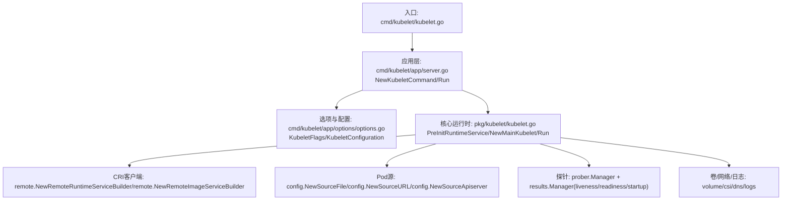
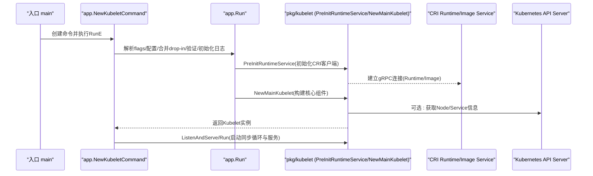
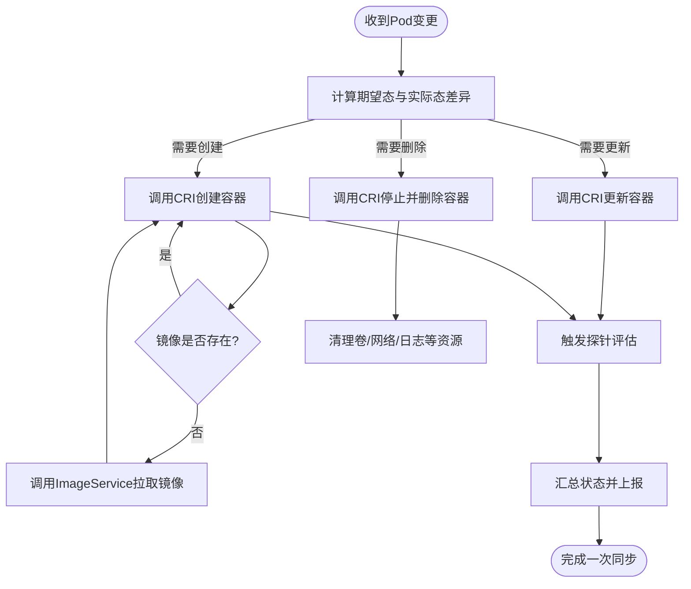
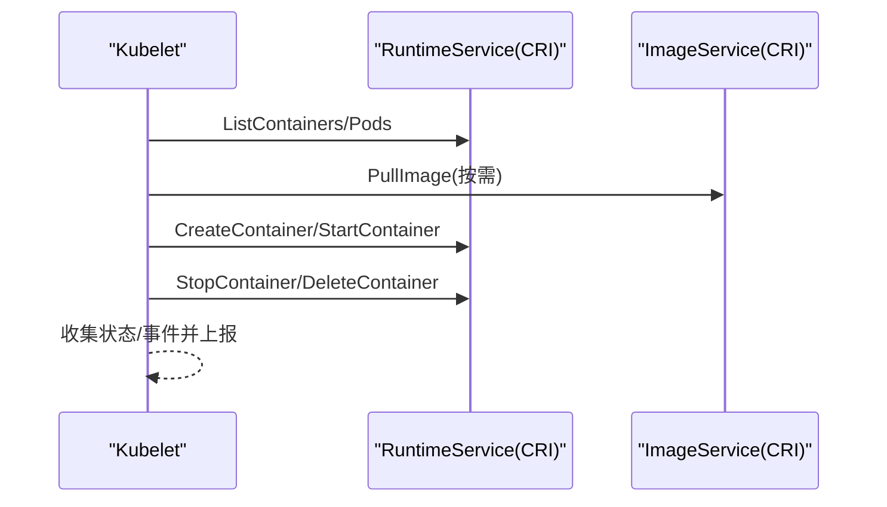
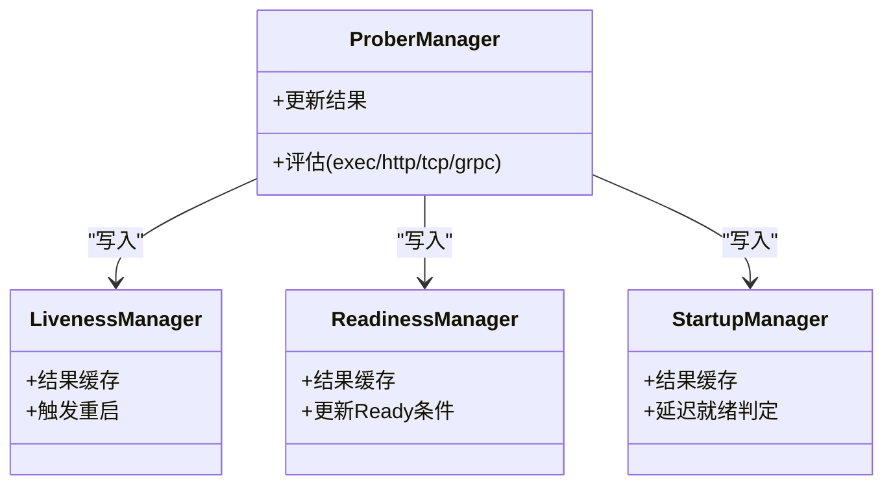
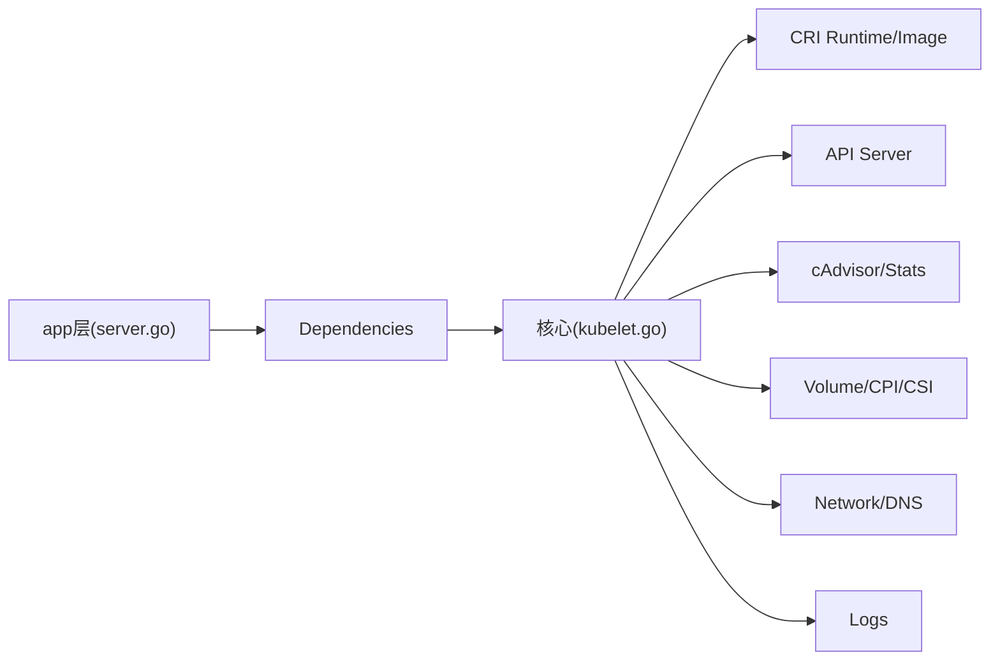

# Kubelet详解

<cite>
**本文引用的文件**   
- [cmd/kubelet/kubelet.go](file://cmd/kubelet/kubelet.go)
- [cmd/kubelet/app/server.go](file://cmd/kubelet/app/server.go)
- [cmd/kubelet/app/options/options.go](file://cmd/kubelet/app/options/options.go)
- [pkg/kubelet/kubelet.go](file://pkg/kubelet/kubelet.go)
</cite>

## 目录
1. [简介](#简介)
2. [项目结构](#项目结构)
3. [核心组件](#核心组件)
4. [架构总览](#架构总览)
5. [详细组件分析](#详细组件分析)
6. [依赖关系分析](#依赖关系分析)
7. [性能考虑](#性能考虑)
8. [故障排查指南](#故障排查指南)
9. [结论](#结论)
10. [附录](#附录)

## 简介
本文件面向Kubernetes节点代理Kubelet，系统性阐述其启动流程、配置管理、Pod同步机制与容器生命周期管理；深入解释与容器运行时接口（CRI）的交互方式；说明健康检查探针（liveness/readiness/startup）工作机制；文档化资源管理与QoS策略、安全上下文处理、卷挂载、网络配置与存储集成；并提供性能调优、监控指标解读与常见故障排查方法，覆盖静态Pod、镜像拉取、日志管理与节点状态上报等高级特性。

## 项目结构
Kubelet由入口程序、应用层装配与核心运行时三部分组成：
- 入口程序负责创建命令并调用应用层Run函数
- 应用层负责参数解析、配置加载与合并、依赖初始化、TLS/认证授权、客户端构建、运行期服务初始化
- 核心运行时负责Pod源订阅、同步循环、容器生命周期编排、探针调度、资源与配额、事件与状态上报、统计与指标采集等

图示来源
- [cmd/kubelet/kubelet.go:35-39](file://cmd/kubelet/kubelet.go#L35-L39)
- [cmd/kubelet/app/server.go:142-329](file://cmd/kubelet/app/server.go#L142-L329)
- [cmd/kubelet/app/options/options.go:226-255](file://cmd/kubelet/app/options/options.go#L226-L255)
- [pkg/kubelet/kubelet.go:403-431](file://pkg/kubelet/kubelet.go#L403-L431)
- [pkg/kubelet/kubelet.go:449-800](file://pkg/kubelet/kubelet.go#L449-L800)

章节来源
- [cmd/kubelet/kubelet.go:17-39](file://cmd/kubelet/kubelet.go#L17-L39)
- [cmd/kubelet/app/server.go:142-329](file://cmd/kubelet/app/server.go#L142-L329)
- [cmd/kubelet/app/options/options.go:226-255](file://cmd/kubelet/app/options/options.go#L226-L255)
- [pkg/kubelet/kubelet.go:403-431](file://pkg/kubelet/kubelet.go#L403-L431)
- [pkg/kubelet/kubelet.go:449-800](file://pkg/kubelet/kubelet.go#L449-L800)

## 核心组件
- 命令行与配置
  - 入口通过cobra创建命令，执行自定义flag解析与优先级规则，支持从配置文件与drop-in目录合并配置，最终输出有效配置并进入Run
  - 选项定义包含KubeletFlags与KubeletConfiguration，前者为节点级不可共享或不可热更新的参数，后者为可共享的配置对象
- 依赖装配
  - 非安全依赖构造包括mounter、subpather、hostutil、OOMAdjuster、OSInterface、VolumePlugins、DynamicPluginProber、TLSOptions等
  - 在运行前完成健康检查器、特征门控、锁文件、客户端（kube/event/heartbeat）、认证授权、运行时服务初始化
- 核心运行时
  - 预初始化CRI客户端（RuntimeService/ImageManagerService），建立与容器运行时和镜像服务的gRPC连接
  - 构建Pod源（文件/HTTP/API Server），创建PodConfig并订阅变更
  - 初始化探针管理器、结果缓存、工作队列、PodWorkers、分配管理器、状态管理器、日志管理器、DNS配置器等
  - 启动监听服务（主端口、只读端口、Pod资源API、Pods API等）

章节来源
- [cmd/kubelet/app/server.go:142-329](file://cmd/kubelet/app/server.go#L142-L329)
- [cmd/kubelet/app/server.go:498-536](file://cmd/kubelet/app/server.go#L498-L536)
- [cmd/kubelet/app/server.go:538-556](file://cmd/kubelet/app/server.go#L538-L556)
- [cmd/kubelet/app/server.go:656-800](file://cmd/kubelet/app/server.go#L656-L800)
- [cmd/kubelet/app/options/options.go:226-255](file://cmd/kubelet/app/options/options.go#L226-L255)
- [cmd/kubelet/app/options/options.go:257-320](file://cmd/kubelet/app/options/options.go#L257-L320)
- [cmd/kubelet/app/options/options.go:332-517](file://cmd/kubelet/app/options/options.go#L332-L517)
- [pkg/kubelet/kubelet.go:403-431](file://pkg/kubelet/kubelet.go#L403-L431)
- [pkg/kubelet/kubelet.go:449-800](file://pkg/kubelet/kubelet.go#L449-L800)

## 架构总览
Kubelet整体采用“配置驱动+事件驱动”的架构：
- 配置驱动：从命令行、配置文件与drop-in目录合并得到最终KubeletConfiguration，用于控制行为
- 事件驱动：通过Pod源订阅变更，经PodWorkers并行处理，调用CRI实现容器生命周期操作
- 运行时抽象：通过CRI统一对接不同容器运行时与镜像服务
- 观测性：探针、指标、日志、追踪贯穿全链路

图示来源
- [cmd/kubelet/kubelet.go:35-39](file://cmd/kubelet/kubelet.go#L35-L39)
- [cmd/kubelet/app/server.go:142-329](file://cmd/kubelet/app/server.go#L142-L329)
- [cmd/kubelet/app/server.go:538-556](file://cmd/kubelet/app/server.go#L538-L556)
- [pkg/kubelet/kubelet.go:403-431](file://pkg/kubelet/kubelet.go#L403-L431)
- [pkg/kubelet/kubelet.go:449-800](file://pkg/kubelet/kubelet.go#L449-L800)

## 详细组件分析

### 启动流程与配置管理
- 命令行与配置优先级
  - 先解析基础flags，再加载配置文件，若存在drop-in目录则按字典序合并，最后重新解析命令行以维持向后兼容的优先级
  - 打印有效配置与原始flags，便于排障
- 配置项要点
  - 运行时端点：container-runtime-endpoint、image-service-endpoint
  - 静态Pod：pod-manifest-path、manifest-url及请求头
  - 网络与DNS：cluster-dns、cluster-domain、resolv-conf、hairpin-mode
  - 资源与QoS：system-reserved、kube-reserved、enforce-node-allocatable、cgroups-per-qos、cpu-manager-policy、memory-manager-policy、topology-manager-policy
  - 日志与GC：container-log-max-size、container-log-max-files、image-gc-high/low-threshold、minimum-image-ttl-duration
  - 事件与心跳：event-qps/burst、node-status-update-frequency、node-lease-duration-seconds
  - 安全与TLS：client-ca-file、tls-cert-file、tls-private-key-file、rotate-certificates、server-tls-bootstrap
- 依赖与安全
  - 构建kube/event/heartbeat三个独立客户端，分别设置QPS/Burst/Timeout
  - 认证授权：支持匿名、x509、webhook；授权模式支持AlwaysAllow/Webhook
  - TLS：支持自签证书自动签发与轮换、服务端证书自动申请与轮换

章节来源
- [cmd/kubelet/app/server.go:142-329](file://cmd/kubelet/app/server.go#L142-L329)
- [cmd/kubelet/app/server.go:453-496](file://cmd/kubelet/app/server.go#L453-L496)
- [cmd/kubelet/app/server.go:538-556](file://cmd/kubelet/app/server.go#L538-L556)
- [cmd/kubelet/app/server.go:656-800](file://cmd/kubelet/app/server.go#L656-L800)
- [cmd/kubelet/app/options/options.go:257-320](file://cmd/kubelet/app/options/options.go#L257-L320)
- [cmd/kubelet/app/options/options.go:332-517](file://cmd/kubelet/app/options/options.go#L332-L517)

### Pod同步机制与容器生命周期管理
- Pod源与订阅
  - 支持三种来源：文件、HTTP、API Server；通过config.PodConfig聚合并分发到channel
- 同步循环与工作队列
  - 使用workQueue与podWorkers对Pod进行并发同步；根据差异计算生成期望态与实际态的差异
- 容器生命周期
  - 通过CRI接口创建/启动/停止/删除容器；镜像拉取由ImageService负责
  - 支持镜像拉取限流与序列化拉取
- 状态与事件
  - 将Pod/Container状态上报至API Server，同时产生Event记录

图示来源
- [pkg/kubelet/kubelet.go:449-800](file://pkg/kubelet/kubelet.go#L449-L800)
- [pkg/kubelet/kubelet.go:403-431](file://pkg/kubelet/kubelet.go#L403-L431)

章节来源
- [pkg/kubelet/kubelet.go:449-800](file://pkg/kubelet/kubelet.go#L449-L800)

### 与CRI的交互（容器创建/启动/停止/删除）
- 预初始化阶段建立RuntimeService与ImageService连接，支持流式列表与超时控制
- 生命周期操作通过CRI gRPC接口完成，kubelet封装为通用运行时管理器
- 镜像拉取走ImageService，支持QPS/Burst限制与串行拉取

图示来源
- [pkg/kubelet/kubelet.go:403-431](file://pkg/kubelet/kubelet.go#L403-L431)
- [pkg/kubelet/kubelet.go:449-800](file://pkg/kubelet/kubelet.go#L449-L800)

章节来源
- [pkg/kubelet/kubelet.go:403-431](file://pkg/kubelet/kubelet.go#L403-L431)
- [pkg/kubelet/kubelet.go:449-800](file://pkg/kubelet/kubelet.go#L449-L800)

### 健康检查探针（liveness/readiness/startup）
- 三类探针分别维护独立的结果管理器，周期性评估并更新Pod条件
- liveness失败触发重启；readiness变化影响Service流量；startup用于慢启动容器的保护
- 探针类型支持exec/http/tcp/grpc，结合探针间隔、超时、阈值等参数

图示来源
- [pkg/kubelet/kubelet.go:449-800](file://pkg/kubelet/kubelet.go#L449-L800)

章节来源
- [pkg/kubelet/kubelet.go:449-800](file://pkg/kubelet/kubelet.go#L449-L800)

### 资源管理与QoS策略
- 节点可分配资源
  - system-reserved与kube-reserved预留系统/组件资源；enforce-node-allocatable控制是否强制约束
  - 支持cgroup隔离与根cgroup选择
- QoS等级
  - Guaranteed/Burstable/BestEffort，结合cgroups-per-qos形成层级隔离
- CPU/内存/拓扑管理
  - CPU Manager：static/none策略，支持CPU独占与亲和
  - Memory Manager：Static/None策略，NUMA感知
  - Topology Manager：best-effort/restricted/single-numa-node策略
- 驱逐与回收
  - eviction-hard/soft阈值、软阈值宽限期、最小回收量、压力过渡期
  - 镜像GC与容器GC周期与阈值

章节来源
- [cmd/kubelet/app/options/options.go:332-517](file://cmd/kubelet/app/options/options.go#L332-L517)
- [pkg/kubelet/kubelet.go:449-800](file://pkg/kubelet/kubelet.go#L449-L800)

### 安全上下文、卷挂载、网络与存储
- 安全上下文
  - 支持seccomp默认策略、用户命名空间、SELinux/AppArmor相关能力
- 卷与存储
  - 内置插件与CSI动态发现；支持Attach/Detach控制器接管
  - 子路径挂载、主机路径、Secret/ConfigMap投影卷等
- 网络
  - hairpin模式、Cluster DNS、ResolvConf、PodCIDR（standalone模式）
- 日志
  - 容器日志轮转大小与数量限制，后台监控与清理

章节来源
- [cmd/kubelet/app/options/options.go:332-517](file://cmd/kubelet/app/options/options.go#L332-L517)
- [pkg/kubelet/kubelet.go:449-800](file://pkg/kubelet/kubelet.go#L449-L800)

### 静态Pod、镜像拉取、日志管理与节点状态上报
- 静态Pod
  - 本地文件或HTTP URL提供PodSpec，定期扫描与增量更新
- 镜像拉取
  - 支持registry QPS/Burst、串行拉取、凭证提供者插件
- 日志管理
  - 容器日志最大大小与数量、监控间隔、工作线程数
- 节点状态上报
  - Node.Status定期上报、Lease续约、事件发送速率限制

章节来源
- [cmd/kubelet/app/options/options.go:332-517](file://cmd/kubelet/app/options/options.go#L332-L517)
- [pkg/kubelet/kubelet.go:449-800](file://pkg/kubelet/kubelet.go#L449-L800)

## 依赖关系分析
- 外部依赖
  - Kubernetes API Server：Pod/Node/Service/Events/Lease
  - CRI Runtime/Image Service：容器与镜像生命周期
  - cAdvisor：系统/容器指标采集
  - 操作系统：cgroup、文件系统、网络栈
- 内部模块耦合
  - app层负责装配与启动，核心层负责业务编排；两者通过Dependencies解耦
  - 探针、卷、网络、日志、状态、统计等模块围绕Kubelet实例协作

图示来源
- [cmd/kubelet/app/server.go:498-536](file://cmd/kubelet/app/server.go#L498-L536)
- [pkg/kubelet/kubelet.go:449-800](file://pkg/kubelet/kubelet.go#L449-L800)

章节来源
- [cmd/kubelet/app/server.go:498-536](file://cmd/kubelet/app/server.go#L498-L536)
- [pkg/kubelet/kubelet.go:449-800](file://pkg/kubelet/kubelet.go#L449-L800)

## 性能考虑
- 同步与并发
  - 合理设置sync-frequency与pod-workers并发度，避免同步阻塞
- 资源预留与隔离
  - 正确配置system-reserved/kube-reserved与cgroup隔离，防止系统抖动
- 镜像拉取
  - 启用registry-qps/burst与serialize-image-pulls，降低远端压力
- 日志与GC
  - 调整container-log-max-size/files与image GC阈值，避免磁盘打满
- 指标与追踪
  - 关注kubelet自身指标与OpenTelemetry追踪，定位热点与瓶颈

[本节为通用指导，不直接分析具体文件]

## 故障排查指南
- 启动失败
  - 检查flags与配置文件合并顺序、drop-in文件扩展名与语法、TLS证书路径与权限
  - 确认lock-file独占与inotify监听是否正常
- CRI连通性
  - 校验container-runtime-endpoint/image-service-endpoint可达性与超时配置
- 镜像拉取问题
  - 查看registry-qps/burst、凭证提供者配置、网络连通与镜像仓库鉴权
- 资源不足/驱逐
  - 核对eviction阈值、软阈值宽限期、最小回收量与系统预留
- 探针异常
  - 检查探针类型、超时、阈值与容器启动时间，必要时调整startup探针
- 日志与事件
  - 查看kubelet日志、容器日志轮转情况、事件发送速率与API Server连接状态

章节来源
- [cmd/kubelet/app/server.go:142-329](file://cmd/kubelet/app/server.go#L142-L329)
- [cmd/kubelet/app/server.go:656-800](file://cmd/kubelet/app/server.go#L656-L800)
- [cmd/kubelet/app/options/options.go:332-517](file://cmd/kubelet/app/options/options.go#L332-L517)
- [pkg/kubelet/kubelet.go:449-800](file://pkg/kubelet/kubelet.go#L449-L800)

## 结论
Kubelet作为节点代理，通过统一的CRI抽象与丰富的配置项，实现了跨运行时的高可用容器编排。其“配置驱动+事件驱动”的架构确保了可扩展性与稳定性。在生产环境中，应重点关注资源预留、QoS与驱逐策略、镜像拉取限流、探针与日志配置，并结合指标与追踪进行持续优化。

[本节为总结性内容，不直接分析具体文件]

## 附录
- 关键入口与装配路径
  - 入口：cmd/kubelet/kubelet.go
  - 应用装配：cmd/kubelet/app/server.go
  - 选项与配置：cmd/kubelet/app/options/options.go
  - 核心运行时：pkg/kubelet/kubelet.go

章节来源
- [cmd/kubelet/kubelet.go:17-39](file://cmd/kubelet/kubelet.go#L17-L39)
- [cmd/kubelet/app/server.go:142-329](file://cmd/kubelet/app/server.go#L142-L329)
- [cmd/kubelet/app/options/options.go:226-255](file://cmd/kubelet/app/options/options.go#L226-L255)
- [pkg/kubelet/kubelet.go:403-431](file://pkg/kubelet/kubelet.go#L403-L431)
- [pkg/kubelet/kubelet.go:449-800](file://pkg/kubelet/kubelet.go#L449-L800)