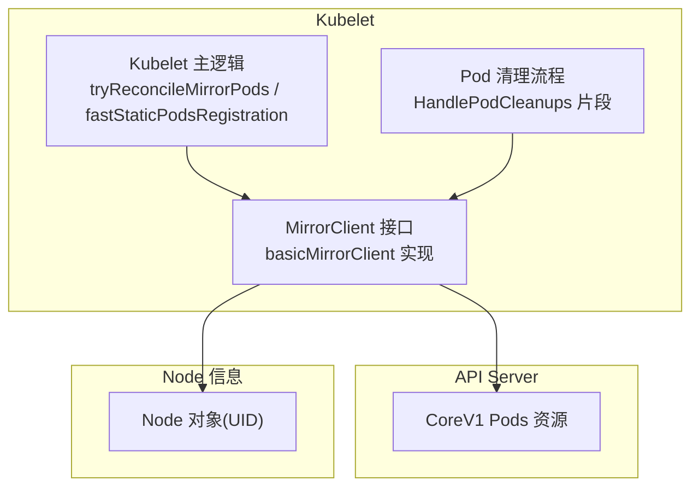
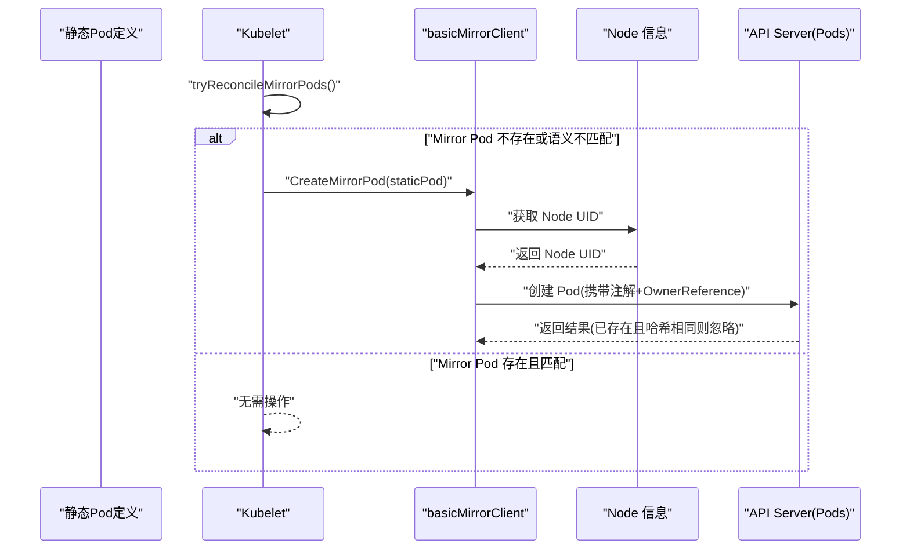
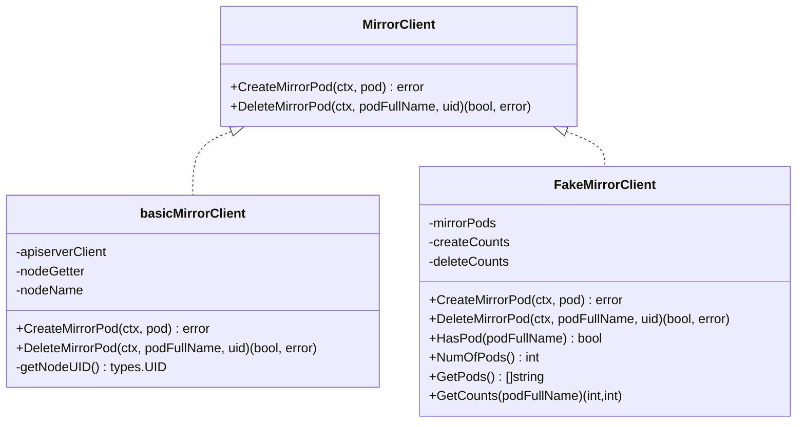
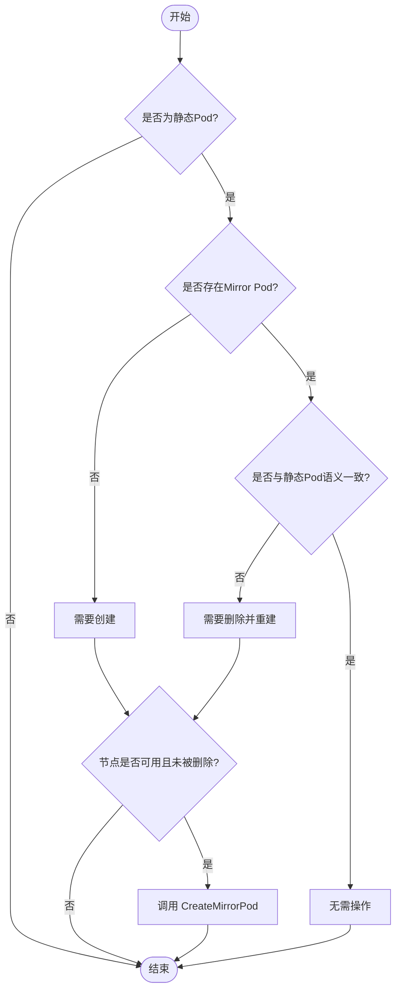
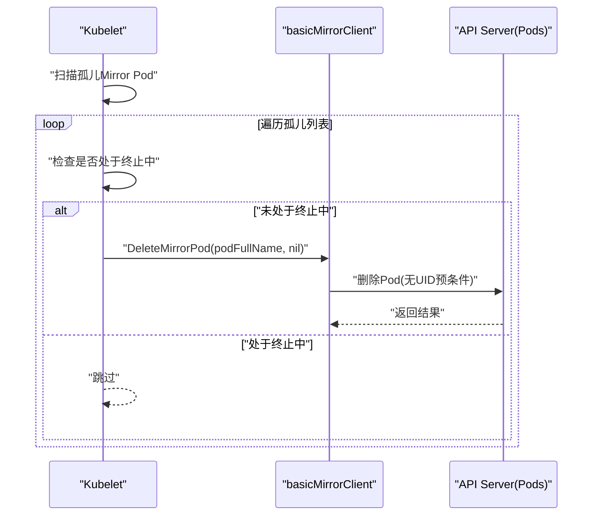
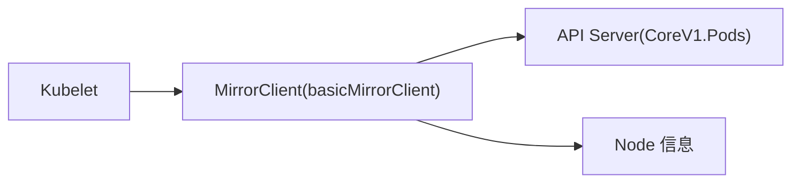
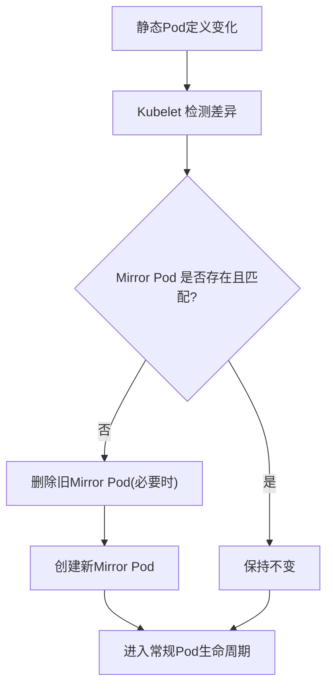

# Mirror Pod机制

<cite>
**本文引用的文件**   
- [pkg/kubelet/pod/mirror_client.go](file://pkg/kubelet/pod/mirror_client.go)
- [pkg/kubelet/kubelet.go](file://pkg/kubelet/kubelet.go)
- [pkg/kubelet/kubelet_pods.go](file://pkg/kubelet/kubelet_pods.go)
- [pkg/apis/core/annotation_key_constants.go](file://pkg/apis/core/annotation_key_constants.go)
- [pkg/kubelet/pod/testing/fake_mirror_client.go](file://pkg/kubelet/pod/testing/fake_mirror_client.go)
</cite>

## 目录
1. [简介](#简介)
2. [项目结构](#项目结构)
3. [核心组件](#核心组件)
4. [架构总览](#架构总览)
5. [详细组件分析](#详细组件分析)
6. [依赖关系分析](#依赖关系分析)
7. [性能考虑](#性能考虑)
8. [故障排查指南](#故障排查指南)
9. [结论](#结论)
10. [附录](#附录)

## 简介
本文件系统性阐述 Kubelet 的 Mirror Pod（镜像 Pod）机制，覆盖如下主题：
- 静态 Pod 到 Mirror Pod 的映射与 UID 转换
- Mirror Pod 的状态同步、事件转发与元数据同步
- 生命周期管理：创建、更新、删除与清理策略
- 与 API Server 的通信协议、认证授权与一致性保证
- 故障恢复、重试机制与错误处理
- 监控指标、调试工具与性能优化建议
- 关键流程的时序图与流程图

## 项目结构
围绕 Mirror Pod 的关键代码位于 Kubelet 内部，主要涉及：
- Mirror Client 接口与实现：负责在 API Server 上创建/删除 Mirror Pod
- Kubelet 主循环：负责静态 Pod 与 Mirror Pod 的一致性协调
- 清理流程：负责孤儿 Mirror Pod 的回收
- 注解常量：Mirror Pod 识别与校验相关注解键

图表来源
- [pkg/kubelet/pod/mirror_client.go:33-107](file://pkg/kubelet/pod/mirror_client.go#L33-L107)
- [pkg/kubelet/kubelet.go:3520-3576](file://pkg/kubelet/kubelet.go#L3520-L3576)
- [pkg/kubelet/kubelet_pods.go:1329-1341](file://pkg/kubelet/kubelet_pods.go#L1329-L1341)

章节来源
- [pkg/kubelet/pod/mirror_client.go:33-107](file://pkg/kubelet/pod/mirror_client.go#L33-L107)
- [pkg/kubelet/kubelet.go:3520-3576](file://pkg/kubelet/kubelet.go#L3520-L3576)
- [pkg/kubelet/kubelet_pods.go:1329-1341](file://pkg/kubelet/kubelet_pods.go#L1329-L1341)

## 核心组件
- MirrorClient 接口与 basicMirrorClient 实现
  - CreateMirrorPod：为静态 Pod 在 API Server 创建对应的 Mirror Pod，并注入必要注解与 OwnerReference
  - DeleteMirrorPod：按完整名称与可选 UID 条件删除 Mirror Pod
- Kubelet 协调器
  - tryReconcileMirrorPods：比较静态 Pod 与现有 Mirror Pod 是否一致，不一致则删除并重建
  - fastStaticPodsRegistration：节点注册后快速补齐 Mirror Pod
- 清理流程
  - HandlePodCleanups 片段：对孤儿 Mirror Pod 进行清理

章节来源
- [pkg/kubelet/pod/mirror_client.go:33-107](file://pkg/kubelet/pod/mirror_client.go#L33-L107)
- [pkg/kubelet/kubelet.go:3520-3576](file://pkg/kubelet/kubelet.go#L3520-L3576)
- [pkg/kubelet/kubelet_pods.go:1329-1341](file://pkg/kubelet/kubelet_pods.go#L1329-L1341)

## 架构总览
下图展示了从静态 Pod 到 Mirror Pod 的端到端流程，包括注解注入、OwnerReference 设置、与 API Server 的交互以及 Kubelet 的再平衡逻辑。

图表来源
- [pkg/kubelet/kubelet.go:3520-3576](file://pkg/kubelet/kubelet.go#L3520-L3576)
- [pkg/kubelet/pod/mirror_client.go:69-107](file://pkg/kubelet/pod/mirror_client.go#L69-L107)
- [pkg/kubelet/pod/mirror_client.go:146-155](file://pkg/kubelet/pod/mirror_client.go#L146-L155)

## 详细组件分析

### 组件一：MirrorClient 接口与实现
- 职责
  - 将静态 Pod 转换为 API Server 可管理的 Mirror Pod
  - 通过注解与 OwnerReference 建立“归属”和“配置版本”关联
- 关键行为
  - 复制原始 Pod 的注解，并追加配置哈希注解
  - 设置 OwnerReference 指向当前 Node，确保受 Node 生命周期保护
  - 创建时若发现同名 Pod 已存在且配置哈希一致，视为幂等成功
  - 删除时使用 Preconditions.UID 防止误删
- 复杂度
  - 时间复杂度：O(1)（以 Pod 数量计），主要开销在网络 I/O
  - 空间复杂度：O(1)（仅构造少量临时对象）

图表来源
- [pkg/kubelet/pod/mirror_client.go:33-107](file://pkg/kubelet/pod/mirror_client.go#L33-L107)
- [pkg/kubelet/pod/mirror_client.go:146-155](file://pkg/kubelet/pod/mirror_client.go#L146-L155)
- [pkg/kubelet/pod/testing/fake_mirror_client.go:29-86](file://pkg/kubelet/pod/testing/fake_mirror_client.go#L29-L86)

章节来源
- [pkg/kubelet/pod/mirror_client.go:33-107](file://pkg/kubelet/pod/mirror_client.go#L33-L107)
- [pkg/kubelet/pod/mirror_client.go:146-155](file://pkg/kubelet/pod/mirror_client.go#L146-L155)
- [pkg/kubelet/pod/testing/fake_mirror_client.go:29-86](file://pkg/kubelet/pod/testing/fake_mirror_client.go#L29-L86)

### 组件二：Kubelet 协调器（静态 Pod ↔ Mirror Pod）
- 职责
  - 保证每个静态 Pod 都有且只有一个与其语义一致的 Mirror Pod
  - 在节点注册完成后尽快补齐 Mirror Pod
- 关键行为
  - 若 Mirror Pod 被标记删除或与静态 Pod 语义不一致，则调用 DeleteMirrorPod 并重建
  - 若节点未注册或正在删除，则跳过创建
  - 使用 GetStaticPodToMirrorPodMap 遍历所有静态 Pod 进行快速补齐

图表来源
- [pkg/kubelet/kubelet.go:3520-3576](file://pkg/kubelet/kubelet.go#L3520-L3576)

章节来源
- [pkg/kubelet/kubelet.go:3520-3576](file://pkg/kubelet/kubelet.go#L3520-L3576)

### 组件三：清理流程（孤儿 Mirror Pod）
- 职责
  - 当系统检测到某些 Mirror Pod 不再被任何期望集合持有时，将其安全删除
- 关键行为
  - 遍历孤儿 Mirror Pod 列表
  - 若该 Pod 不在终止中，则调用 DeleteMirrorPod 删除
  - 记录日志便于排障

图表来源
- [pkg/kubelet/kubelet_pods.go:1329-1341](file://pkg/kubelet/kubelet_pods.go#L1329-L1341)

章节来源
- [pkg/kubelet/kubelet_pods.go:1329-1341](file://pkg/kubelet/kubelet_pods.go#L1329-L1341)

### 组件四：注解与标识
- 用于识别 Mirror Pod 的注解键
- 用于校验 Mirror Pod 的 nodeName 约束与不可变规则（由 API 层验证）

章节来源
- [pkg/apis/core/annotation_key_constants.go:26-27](file://pkg/apis/core/annotation_key_constants.go#L26-L27)

## 依赖关系分析
- 组件耦合
  - Kubelet 依赖 MirrorClient 抽象，屏蔽底层 API 差异
  - basicMirrorClient 依赖 API Server 客户端与 Node 信息源
- 外部依赖
  - CoreV1 Pods 资源（创建/删除）
  - Node 对象（UID 读取）
- 潜在环依赖
  - 无直接环依赖；MirrorClient 与 Kubelet 之间通过接口解耦

图表来源
- [pkg/kubelet/kubelet.go:3520-3576](file://pkg/kubelet/kubelet.go#L3520-L3576)
- [pkg/kubelet/pod/mirror_client.go:33-107](file://pkg/kubelet/pod/mirror_client.go#L33-L107)

章节来源
- [pkg/kubelet/kubelet.go:3520-3576](file://pkg/kubelet/kubelet.go#L3520-L3576)
- [pkg/kubelet/pod/mirror_client.go:33-107](file://pkg/kubelet/pod/mirror_client.go#L33-L107)

## 性能考虑
- 网络 I/O 主导：创建/删除 Mirror Pod 均涉及 API Server 请求，应关注网络延迟与重试退避
- 幂等性设计：创建时若同名 Pod 已存在且配置哈希一致，直接返回成功，避免重复写入
- 批量补齐：fastStaticPodsRegistration 在节点注册后一次性补齐所有静态 Pod 的 Mirror Pod，减少抖动
- 清理路径：孤儿 Mirror Pod 的删除采用非阻塞式日志记录，避免阻塞主循环

[本节为通用指导，不直接分析具体文件]

## 故障排查指南
- 常见问题
  - 节点未注册导致无法创建 Mirror Pod：需等待节点就绪后再触发补齐
  - 节点被删除：跳过创建，避免无效操作
  - 删除失败：区分 NotFound/Conflict 与其他错误，前者可忽略，后者需记录并观察
- 定位手段
  - 查看 Kubelet 日志关键字：“Creating a mirror pod for static pod”、“Failed creating a mirror pod”、“Deleted mirror pod as it didn't match the static Pod”、“Encountered error when deleting mirror pod”
  - 核对注解：确认 Mirror Pod 包含配置哈希注解与 OwnerReference
  - 对比静态 Pod 与 Mirror Pod 的语义一致性（命名空间、名称、注解等）

章节来源
- [pkg/kubelet/kubelet.go:3520-3576](file://pkg/kubelet/kubelet.go#L3520-L3576)
- [pkg/kubelet/kubelet_pods.go:1329-1341](file://pkg/kubelet/kubelet_pods.go#L1329-L1341)
- [pkg/kubelet/pod/mirror_client.go:116-144](file://pkg/kubelet/pod/mirror_client.go#L116-L144)

## 结论
Mirror Pod 机制通过“静态 Pod → Mirror Pod”的映射，使本地托管的静态工作负载也能纳入集群统一视图。其核心在于：
- 使用注解与 OwnerReference 建立强关联与版本一致性
- 在 Kubelet 侧进行再平衡，确保镜像与静态定义一致
- 提供幂等创建与条件删除，保障鲁棒性与可观测性

[本节为总结性内容，不直接分析具体文件]

## 附录

### 与 API Server 的通信协议、认证授权与一致性保证
- 通信协议
  - 基于 REST/HTTP 的 CoreV1 Pods 资源操作（Create/Delete）
- 认证与授权
  - 由 Kubelet 使用的 API 客户端凭据完成认证与 RBAC 授权
- 一致性保证
  - 创建时的幂等判断：若同名 Pod 已存在且配置哈希一致，视为成功
  - 删除时的 UID 预条件：防止并发竞争导致的误删

章节来源
- [pkg/kubelet/pod/mirror_client.go:69-107](file://pkg/kubelet/pod/mirror_client.go#L69-L107)
- [pkg/kubelet/pod/mirror_client.go:116-144](file://pkg/kubelet/pod/mirror_client.go#L116-L144)

### 状态同步、事件转发与元数据同步
- 状态同步
  - Mirror Pod 作为普通 Pod 参与 Kubelet 的 Pod 状态上报与条件更新流程
- 事件转发
  - 遵循标准 Pod 事件模型，由上层组件统一收集
- 元数据同步
  - 通过注解与 OwnerReference 保持与静态 Pod 的元数据一致性

[本节为概念性说明，不直接分析具体文件]

### 生命周期管理与清理策略
- 创建：静态 Pod 变更或首次出现时创建 Mirror Pod
- 更新：语义不一致时先删除旧 Mirror Pod，再创建新的
- 删除：节点删除或孤儿检测时删除 Mirror Pod
- 清理：定期扫描孤儿 Mirror Pod 并删除

章节来源
- [pkg/kubelet/kubelet.go:3520-3576](file://pkg/kubelet/kubelet.go#L3520-L3576)
- [pkg/kubelet/kubelet_pods.go:1329-1341](file://pkg/kubelet/kubelet_pods.go#L1329-L1341)

### 监控指标与调试工具
- 指标
  - 活跃 Pod 数、期望 Pod 数、Mirror Pod 计数、重启次数等
- 调试工具
  - 查看 Kubelet 日志关键字
  - 使用 kubectl 检查 Mirror Pod 的注解与 OwnerReference

章节来源
- [pkg/kubelet/kubelet_pods.go:1348-1352](file://pkg/kubelet/kubelet_pods.go#L1348-L1352)

### API 调用示例（路径引用）
- 创建 Mirror Pod
  - 参考路径：[pkg/kubelet/pod/mirror_client.go:69-107](file://pkg/kubelet/pod/mirror_client.go#L69-L107)
- 删除 Mirror Pod
  - 参考路径：[pkg/kubelet/pod/mirror_client.go:116-144](file://pkg/kubelet/pod/mirror_client.go#L116-L144)

### 状态同步流程图（Mirror Pod 视角）

图表来源
- [pkg/kubelet/kubelet.go:3520-3576](file://pkg/kubelet/kubelet.go#L3520-L3576)
- [pkg/kubelet/pod/mirror_client.go:69-107](file://pkg/kubelet/pod/mirror_client.go#L69-L107)