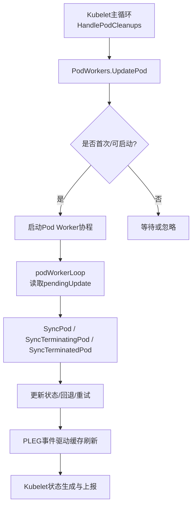
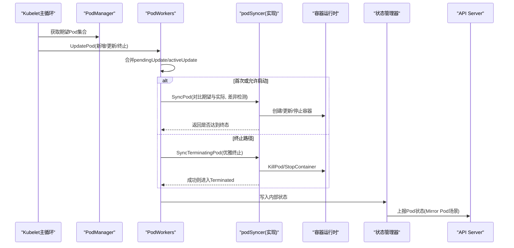
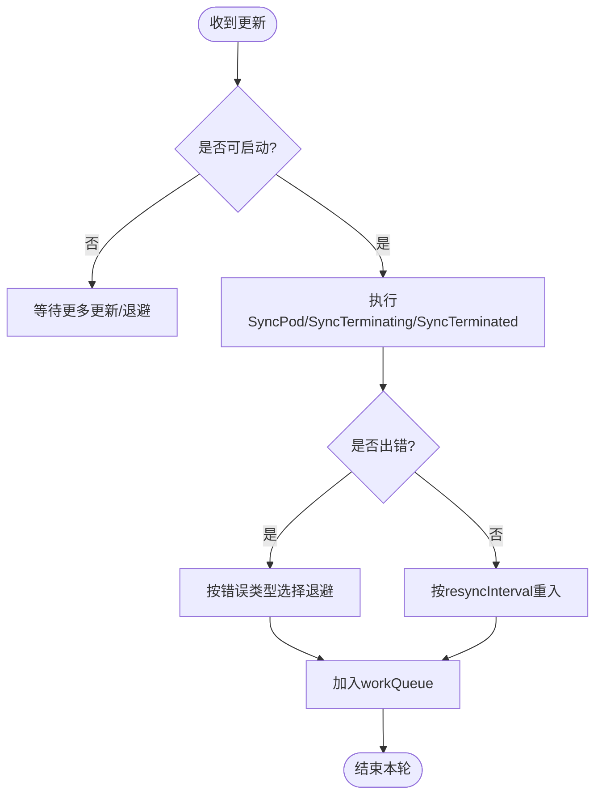
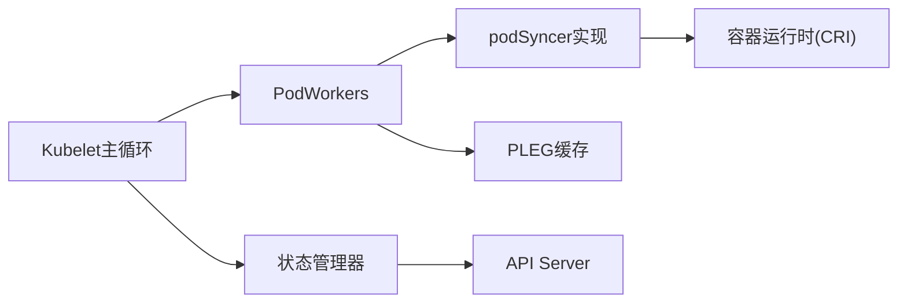

# Pod同步机制

<cite>
**本文引用的文件**   
- [pod_workers.go](file://pkg/kubelet/pod_workers.go)
- [kubelet_pods.go](file://pkg/kubelet/kubelet_pods.go)
- [pod_container_deletor.go](file://pkg/kubelet/pod_container_deletor.go)
- [pleg.go](file://pkg/kubelet/pleg/pleg.go)
</cite>

## 目录
1. [简介](#简介)
2. [项目结构](#项目结构)
3. [核心组件](#核心组件)
4. [架构总览](#架构总览)
5. [详细组件分析](#详细组件分析)
6. [依赖关系分析](#依赖关系分析)
7. [性能考量](#性能考量)
8. [故障排查指南](#故障排查指南)
9. [结论](#结论)
10. [附录](#附录)

## 简介
本文件系统性梳理Kubelet中Pod同步机制，围绕以下目标展开：
- 期望状态与实际状态的比较、差异检测与同步策略
- Pod工作器池设计：并发控制、任务队列、错误重试
- 静态Pod管理：文件监听、自动发现、热重载
- Mirror Pod的创建与管理（向API Server上报状态）
- Pod依赖处理：Init Container、Sidecar Container、Volume依赖
- 重启策略、存活检查与优雅终止
- 同步性能调优与故障排查方法

## 项目结构
与Pod同步相关的关键代码集中在Kubelet的Pod生命周期与工作器实现中：
- pod_workers.go：定义PodWorkers接口与实现，负责每个Pod的工作器生命周期、状态机推进、重入与退避。
- kubelet_pods.go：Kubelet侧对Pod的处理入口，包括清理、镜像拉取、挂载、环境变量注入、阶段计算、状态生成等。
- pod_container_deletor.go：容器删除异步工作器，按创建时间排序并批量删除已退出容器。
- pleg.go：Pod生命周期事件生成器接口，用于从运行时观测变更并触发同步。



图表来源
- [pod_workers.go:1232-1377](file://pkg/kubelet/pod_workers.go#L1232-L1377)
- [kubelet_pods.go:1217-1480](file://pkg/kubelet/kubelet_pods.go#L1217-L1480)
- [pleg.go:65-84](file://pkg/kubelet/pleg/pleg.go#L65-L84)

章节来源
- [pod_workers.go:157-257](file://pkg/kubelet/pod_workers.go#L157-L257)
- [kubelet_pods.go:1217-1480](file://pkg/kubelet/kubelet_pods.go#L1217-L1480)
- [pleg.go:65-84](file://pkg/kubelet/pleg/pleg.go#L65-L84)

## 核心组件
- PodWorkers接口与实现
  - UpdatePod：接收配置变更或终止信号，维护每Pod的pendingUpdate/activeUpdate，协调状态机推进。
  - SyncKnownPods：周期性清理不再被期望的Pod工作器，保证“已知”集合与期望一致。
  - 查询接口：IsPodKnownTerminated、CouldHaveRunningContainers、ShouldPodBeFinished等，供其他子系统判断Pod生命周期阶段。
- podWorkerLoop
  - 单Pod串行执行，依次进入Sync→Terminating→Terminated三阶段；失败时基于退避策略重入。
- Kubelet侧Pod处理
  - HandlePodCleanups：统一编排清理、孤儿Pod回收、Mirror Pod清理、指标统计与重新调度。
  - generateAPIPodStatus/getPhase：根据内部状态生成API PodStatus，计算Phase与条件。
- PLEG
  - 提供Watch通道与Relist能力，将运行时变化转化为Pod级事件，驱动缓存与后续同步。

章节来源
- [pod_workers.go:157-257](file://pkg/kubelet/pod_workers.go#L157-L257)
- [pod_workers.go:1232-1377](file://pkg/kubelet/pod_workers.go#L1232-L1377)
- [kubelet_pods.go:1217-1480](file://pkg/kubelet/kubelet_pods.go#L1217-L1480)
- [kubelet_pods.go:1901-2055](file://pkg/kubelet/kubelet_pods.go#L1901-L2055)
- [pleg.go:65-84](file://pkg/kubelet/pleg/pleg.go#L65-L84)

## 架构总览
下图展示Kubelet中Pod同步的整体流程与关键交互点：



图表来源
- [pod_workers.go:761-1005](file://pkg/kubelet/pod_workers.go#L761-L1005)
- [pod_workers.go:1232-1377](file://pkg/kubelet/pod_workers.go#L1232-L1377)
- [kubelet_pods.go:1217-1480](file://pkg/kubelet/kubelet_pods.go#L1217-L1480)

## 详细组件分析

### Pod工作器与状态机
- 状态机阶段
  - SyncPod：构建并启动Pod，包含镜像拉取、卷挂载、网络、探针等；若自然到达终态则转入Terminating。
  - SyncTerminatingPod：优雅终止所有运行中的容器，支持Grace Period缩短与多次重试。
  - SyncTerminatedPod：释放必须立即释放的资源，完成后标记为finished。
- 并发与隔离
  - 每个Pod一个goroutine，通过channel传递更新；避免同一Pod并发执行。
  - 使用sync.Mutex保护全局状态，per-pod状态在锁内读写。
- 重入与退避
  - 错误时按backoff周期重入；网络不可用等瞬态错误采用短退避；正常完成按resyncInterval重入。
- 静默取消
  - 当发生终止或Grace缩短时，会取消当前SyncPod上下文，确保快速响应。

```mermaid
classDiagram
class PodWorkers {
+UpdatePod(ctx, options)
+SyncKnownPods(logger, desiredPods) map
+IsPodKnownTerminated(uid) bool
+CouldHaveRunningContainers(uid) bool
+ShouldPodBeFinished(uid) bool
+IsPodTerminationRequested(uid) bool
+ShouldPodContainersBeTerminating(uid) bool
+ShouldPodRuntimeBeRemoved(uid) bool
+ShouldPodContentBeRemoved(uid) bool
+IsPodForMirrorPodTerminatingByFullName(fullname) bool
}
class podWorkers {
-podUpdates map[UID]chan struct{}
-podSyncStatuses map[UID]*podSyncStatus
-workQueue WorkQueue
-podSyncer podSyncer
+podWorkerLoop(ctx, uid, in)
+startPodSync(...)
+completeWork(...)
}
class podSyncStatus {
-ctx context.Context
-cancelFn CancelFunc
-fullname string
-working bool
-pendingUpdate *UpdatePodOptions
-activeUpdate *UpdatePodOptions
-startedAt time
-terminatingAt time
-terminatedAt time
-finished bool
-restartRequested bool
-observedRuntime bool
}
PodWorkers <|.. podWorkers
podWorkers --> podSyncStatus : "维护"
```

图表来源
- [pod_workers.go:157-257](file://pkg/kubelet/pod_workers.go#L157-L257)
- [pod_workers.go:572-622](file://pkg/kubelet/pod_workers.go#L572-L622)
- [pod_workers.go:336-424](file://pkg/kubelet/pod_workers.go#L336-L424)

章节来源
- [pod_workers.go:157-257](file://pkg/kubelet/pod_workers.go#L157-L257)
- [pod_workers.go:572-622](file://pkg/kubelet/pod_workers.go#L572-L622)
- [pod_workers.go:1232-1377](file://pkg/kubelet/pod_workers.go#L1232-L1377)
- [pod_workers.go:1522-1566](file://pkg/kubelet/pod_workers.go#L1522-L1566)

### 期望与实际状态比较与差异检测
- 期望来源
  - 来自Kubelet的PodManager（API Pod与静态Pod），经HandlePodCleanups过滤后得到Active Pods。
- 实际来源
  - 通过PLEG驱动的运行时缓存获取最新Pod与容器状态。
- 差异检测
  - SyncPod由具体实现负责对比期望Spec与实际运行时状态，决定创建/更新/删除容器、卷、网络等。
  - 对于仅存在于运行时的孤儿Pod，直接走终止路径。
- 同步策略
  - 优先保证幂等与最终一致性；错误时退避重试；遇到网络不可用等瞬态错误采用短退避。

章节来源
- [kubelet_pods.go:1217-1480](file://pkg/kubelet/kubelet_pods.go#L1217-L1480)
- [pod_workers.go:761-1005](file://pkg/kubelet/pod_workers.go#L761-L1005)
- [pod_workers.go:1232-1377](file://pkg/kubelet/pod_workers.go#L1232-L1377)

### 任务队列与错误重试
- 任务队列
  - per-Pod channel缓冲，避免阻塞调用方；workQueue用于带退避的重入。
- 错误分类与重试
  - 正常完成：按resyncInterval重入。
  - 网络未就绪：短退避重试。
  - 一般错误：按backoffPeriod重入，且受resyncInterval上限限制。
- 阶段转换即时重入
  - 进入Terminating/Terminated阶段时，立即重入以尽快推进。



图表来源
- [pod_workers.go:1522-1566](file://pkg/kubelet/pod_workers.go#L1522-L1566)

章节来源
- [pod_workers.go:1522-1566](file://pkg/kubelet/pod_workers.go#L1522-L1566)

### 静态Pod管理与热重载
- 顺序启动
  - 相同full name的静态Pod按到达顺序排队，避免并发冲突。
- UID重用与重启
  - 若出现UID重用（常见于固定UID的静态Pod），在终止后可允许再次启动。
- 热重载
  - 静态Pod文件变更导致新的Pod进入期望集合，PodWorkers会将其纳入调度；若已有同名实例在运行，新实例排队等待。

章节来源
- [pod_workers.go:951-1005](file://pkg/kubelet/pod_workers.go#L951-L1005)
- [pod_workers.go:1046-1101](file://pkg/kubelet/pod_workers.go#L1046-L1101)
- [kubelet_pods.go:1363-1391](file://pkg/kubelet/kubelet_pods.go#L1363-L1391)

### Mirror Pod的创建与管理
- 目的
  - 将本地运行的Pod状态映射为API Server上的Pod对象，便于上层控制器与用户观察。
- 生命周期
  - 当静态Pod存在时，Kubelet会在API Server上创建对应的Mirror Pod；当静态Pod终止或被移除，Mirror Pod会被清理。
- 清理策略
  - HandlePodCleanups中识别孤儿Mirror Pod并在非终止状态下删除，避免残留。

章节来源
- [kubelet_pods.go:1329-1341](file://pkg/kubelet/kubelet_pods.go#L1329-L1341)
- [pod_workers.go:726-742](file://pkg/kubelet/pod_workers.go#L726-L742)

### Pod依赖关系处理
- Init Container
  - 普通Init Container按顺序执行，任一失败且不可重启则Pod失败。
  - 可重启Init Container（Sidecar式）不影响Pod阶段判定，仅在等待/运行中计入Pending。
- Sidecar Container
  - 作为常规容器参与运行期逻辑，遵循重启策略与探针。
- Volume依赖
  - 卷准备与挂载在SyncPod前完成；子路径安全创建与SELinux重标签等由Kubelet负责。

章节来源
- [kubelet_pods.go:1665-1887](file://pkg/kubelet/kubelet_pods.go#L1665-L1887)
- [kubelet_pods.go:278-439](file://pkg/kubelet/kubelet_pods.go#L278-L439)

### 重启策略、存活检查与优雅终止
- 重启策略
  - Always/OnFailure/Never影响Pod阶段与是否重启；结合RestartAllContainersOnContainerExits特性可整体重启。
- 存活检查
  - ProbeManager根据Pod状态更新探针计划，失败时触发相应动作（如重启）。
- 优雅终止
  - Grace Period可被apiserver或eviction缩短；SyncTerminatingPod逐步降低宽限期直至成功。

章节来源
- [kubelet_pods.go:1901-2055](file://pkg/kubelet/kubelet_pods.go#L1901-L2055)
- [pod_workers.go:1007-1040](file://pkg/kubelet/pod_workers.go#L1007-L1040)
- [pod_workers.go:1379-1400](file://pkg/kubelet/pod_workers.go#L1379-L1400)

### 容器删除与资源回收
- 异步删除
  - 使用独立worker按创建时间倒序删除旧容器，保留指定数量历史容器。
- 批量与限流
  - 缓冲通道限制并发，避免对运行时造成压力。

章节来源
- [pod_container_deletor.go:47-121](file://pkg/kubelet/pod_container_deletor.go#L47-L121)

## 依赖关系分析
- 模块耦合
  - PodWorkers依赖podSyncer实现（由Kubelet提供），并通过PLEG缓存获取运行时状态。
  - Kubelet主循环负责收集期望集合、触发清理、上报状态。
- 外部依赖
  - 容器运行时（CRI）、API Server（Mirror Pod）、存储（卷插件）、网络（CNI）等。



图表来源
- [pod_workers.go:1232-1377](file://pkg/kubelet/pod_workers.go#L1232-L1377)
- [kubelet_pods.go:1217-1480](file://pkg/kubelet/kubelet_pods.go#L1217-L1480)
- [pleg.go:65-84](file://pkg/kubelet/pleg/pleg.go#L65-L84)

章节来源
- [pod_workers.go:1232-1377](file://pkg/kubelet/pod_workers.go#L1232-L1377)
- [kubelet_pods.go:1217-1480](file://pkg/kubelet/kubelet_pods.go#L1217-L1480)
- [pleg.go:65-84](file://pkg/kubelet/pleg/pleg.go#L65-L84)

## 性能考量
- 并发度
  - 每Pod一协程，天然隔离；避免跨Pod竞争。
- 队列与退避
  - 合理设置resyncInterval与backoffPeriod，平衡延迟与CPU占用；网络瞬态错误短退避可降低抖动。
- 状态刷新
  - PLEG Relist阈值与周期需权衡，避免频繁全量扫描。
- 资源清理
  - 孤儿Pod与Mirror Pod及时清理，减少内存与句柄泄漏风险。
- 日志与指标
  - 关注PodWorkerDuration、WorkingPodCount等指标定位瓶颈。

[本节为通用指导，不直接分析具体文件]

## 故障排查指南
- 常见问题
  - 镜像拉取失败：检查镜像仓库与Secret，查看Waiting原因。
  - 卷挂载失败：确认卷插件与权限，检查子路径与安全拼接。
  - 网络未就绪：关注短退避重试与网络插件状态。
  - 优雅终止超时：检查进程SIGTERM处理与Grace Period设置。
- 定位步骤
  - 查看Pod状态与事件，确认Phase与Reason。
  - 检查PLEG缓存是否及时刷新，必要时RequestRelist。
  - 核对Mirror Pod是否存在与是否被误删。
  - 评估退避参数与系统负载，调整resync/backoff。

章节来源
- [kubelet_pods.go:1601-1662](file://pkg/kubelet/kubelet_pods.go#L1601-L1662)
- [pod_workers.go:1522-1566](file://pkg/kubelet/pod_workers.go#L1522-L1566)
- [pleg.go:65-84](file://pkg/kubelet/pleg/pleg.go#L65-L84)

## 结论
Kubelet的Pod同步机制以PodWorkers为核心，通过严格的单Pod串行化与清晰的状态机推进，结合PLEG的事件驱动与Kubelet主循环的统一编排，实现了高可靠、可扩展的Pod生命周期管理。配合合理的退避策略、优雅终止与资源清理，能够在大规模集群中保持稳定的同步性能与一致性。

[本节为总结性内容，不直接分析具体文件]

## 附录
- 术语
  - PLEG：Pod Lifecycle Event Generator
  - Mirror Pod：由Kubelet在API Server上创建的镜像对象，反映本地运行Pod状态
  - Grace Period：优雅终止宽限期
- 参考实现位置
  - Pod工作器与状态机：[pod_workers.go](file://pkg/kubelet/pod_workers.go)
  - Kubelet主循环与状态生成：[kubelet_pods.go](file://pkg/kubelet/kubelet_pods.go)
  - 容器删除工作器：[pod_container_deletor.go](file://pkg/kubelet/pod_container_deletor.go)
  - PLEG接口：[pleg.go](file://pkg/kubelet/pleg/pleg.go)