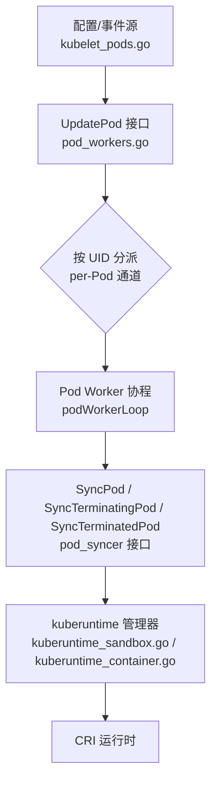
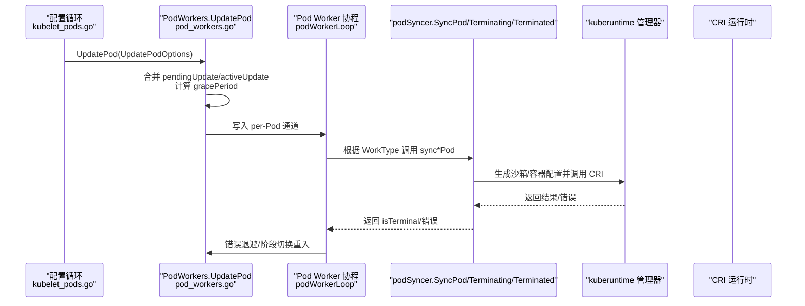
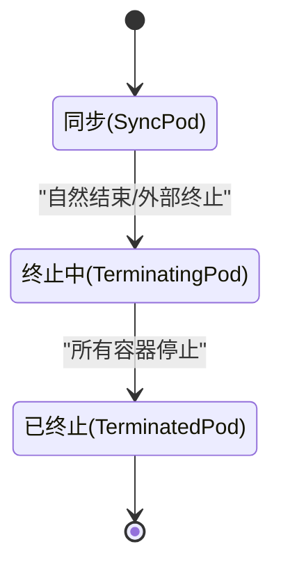
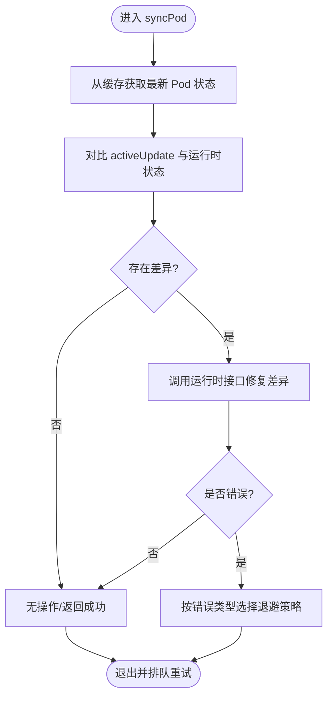
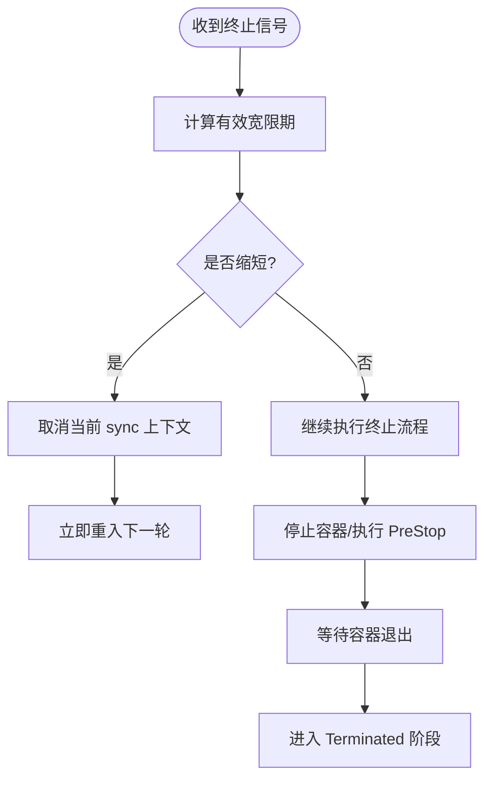
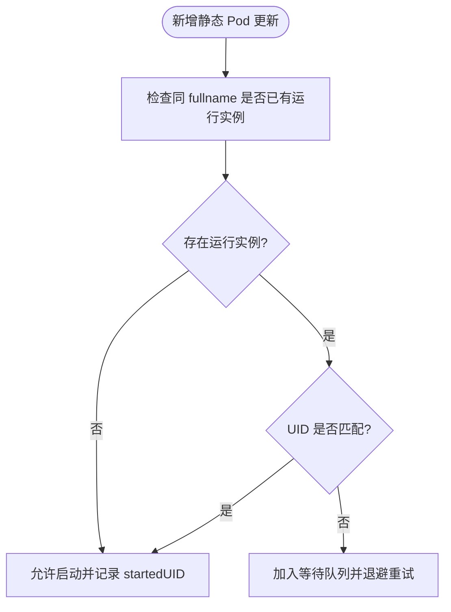
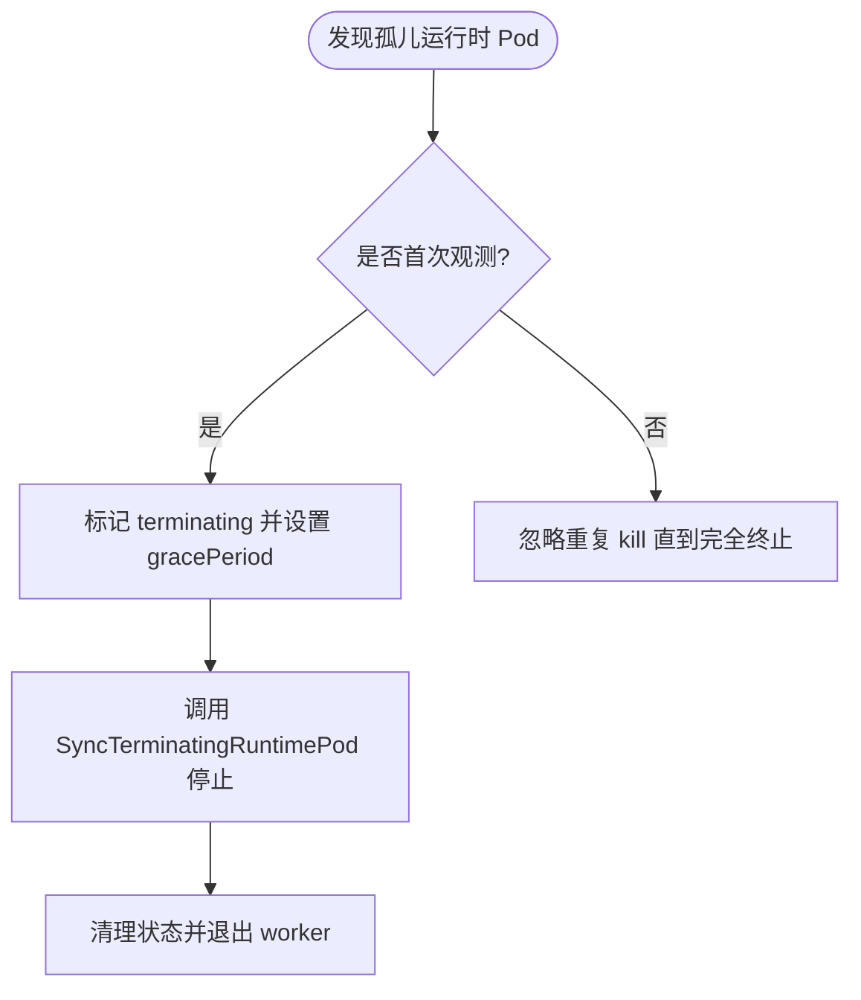
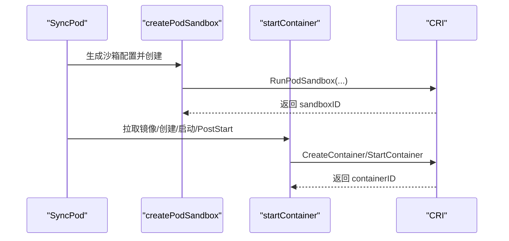
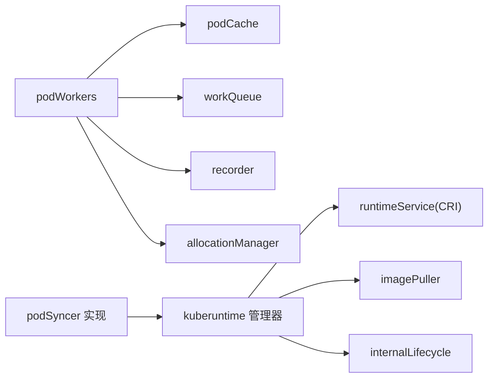

# 同步算法

<cite>
**本文引用的文件**   
- [pkg/kubelet/pod_workers.go](file://pkg/kubelet/pod_workers.go)
- [pkg/kubelet/kubelet_pods.go](file://pkg/kubelet/kubelet_pods.go)
- [pkg/kubelet/kuberuntime/kuberuntime_sandbox.go](file://pkg/kubelet/kuberuntime/kuberuntime_sandbox.go)
- [pkg/kubelet/kuberuntime/kuberuntime_container.go](file://pkg/kubelet/kuberuntime/kuberuntime_container.go)
</cite>

## 目录
1. [简介](#简介)
2. [项目结构](#项目结构)
3. [核心组件](#核心组件)
4. [架构总览](#架构总览)
5. [详细组件分析](#详细组件分析)
6. [依赖关系分析](#依赖关系分析)
7. [性能考量](#性能考量)
8. [故障排查指南](#故障排查指南)
9. [结论](#结论)
10. [附录](#附录)

## 简介
本文件聚焦 Kubelet 的 Pod 同步算法，系统性阐述“期望状态 vs 实际状态”的比较机制、差异检测与同步策略选择；解释同步过程中的状态转换、冲突解决与一致性保证；说明触发条件、批量处理与增量更新机制；文档化优先级、依赖关系与循环依赖检测；并提供性能优化与故障恢复的实现细节。文中所有实现细节均基于源码定位与路径引用，避免直接粘贴代码内容。

## 项目结构
Kubelet 的 Pod 同步由“调度入口 → 工作队列/每 Pod Goroutine → 运行时管理器（CRI）”的分层架构组成：
- 顶层入口负责收集“期望 Pod 集合”，并调用 UpdatePod 将变更投递到每个 Pod 的工作通道。
- podWorkers 为每个 Pod UID 维护一个独立 Goroutine，串行执行同步生命周期。
- 运行时层通过 kuberuntime 与 CRI 交互，完成沙箱与容器的创建、启动、停止与清理。

图表来源
- [pkg/kubelet/pod_workers.go:761-1005](file://pkg/kubelet/pod_workers.go#L761-L1005)
- [pkg/kubelet/kuberuntime/kuberuntime_sandbox.go:38-75](file://pkg/kubelet/kuberuntime/kuberuntime_sandbox.go#L38-L75)
- [pkg/kubelet/kuberuntime/kuberuntime_container.go:200-340](file://pkg/kubelet/kuberuntime/kuberuntime_container.go#L200-L340)

章节来源
- [pkg/kubelet/pod_workers.go:761-1005](file://pkg/kubelet/pod_workers.go#L761-L1005)
- [pkg/kubelet/kuberuntime/kuberuntime_sandbox.go:38-75](file://pkg/kubelet/kuberuntime/kuberuntime_sandbox.go#L38-L75)
- [pkg/kubelet/kuberuntime/kuberuntime_container.go:200-340](file://pkg/kubelet/kuberuntime/kuberuntime_container.go#L200-L340)

## 核心组件
- UpdatePodOptions/KillPodOptions：描述一次 Pod 更新或终止请求的参数，包括更新类型、镜像拉取、优雅终止宽限期等。
- PodWorkers 接口与 podWorkers 实现：提供 UpdatePod、SyncKnownPods 等能力，维护 per-Pod 的 goroutine、通道与状态机。
- podSyncStatus：记录每个 Pod 的“待处理更新”和“活跃更新”，以及时间戳与阶段标志，用于下游子系统判断是否可运行/删除。
- podSyncer 接口与函数包装：抽象出 SyncPod/SyncTerminatingPod/SyncTerminatingRuntimePod/SyncTerminatedPod 四个阶段方法。
- kuberuntime 管理器：负责生成沙箱/容器配置，调用 CRI 完成具体操作。

章节来源
- [pkg/kubelet/pod_workers.go:82-119](file://pkg/kubelet/pod_workers.go#L82-L119)
- [pkg/kubelet/pod_workers.go:157-257](file://pkg/kubelet/pod_workers.go#L157-L257)
- [pkg/kubelet/pod_workers.go:336-424](file://pkg/kubelet/pod_workers.go#L336-L424)
- [pkg/kubelet/pod_workers.go:259-323](file://pkg/kubelet/pod_workers.go#L259-L323)
- [pkg/kubelet/kuberuntime/kuberuntime_sandbox.go:78-157](file://pkg/kubelet/kuberuntime/kuberuntime_sandbox.go#L78-L157)
- [pkg/kubelet/kuberuntime/kuberuntime_container.go:343-408](file://pkg/kubelet/kuberuntime/kuberuntime_container.go#L343-L408)

## 架构总览
Pod 同步的核心流程如下：
- 触发：来自 API Server、静态 Pod、驱逐器等的变更经 kubelet 配置循环汇总后，调用 UpdatePod。
- 入队：根据 Pod UID 写入对应通道，若首次出现则启动 per-Pod 协程。
- 消费：podWorkerLoop 从通道读取，决定当前 WorkType（Sync/Terminating/Terminated），调用相应 sync*Pod 方法。
- 执行：syncPod 负责期望与实际比较、差异修复；terminating 阶段负责优雅停止；terminated 阶段负责收尾。
- 回退：错误时按指数退避重试；网络不可用等瞬态错误采用短退避；阶段切换立即重入。

图表来源
- [pkg/kubelet/pod_workers.go:761-1005](file://pkg/kubelet/pod_workers.go#L761-L1005)
- [pkg/kubelet/pod_workers.go:1245-1377](file://pkg/kubelet/pod_workers.go#L1245-L1377)
- [pkg/kubelet/kuberuntime/kuberuntime_sandbox.go:38-75](file://pkg/kubelet/kuberuntime/kuberuntime_sandbox.go#L38-L75)
- [pkg/kubelet/kuberuntime/kuberuntime_container.go:200-340](file://pkg/kubelet/kuberuntime/kuberuntime_container.go#L200-L340)

## 详细组件分析

### 状态机与阶段转换
Pod 在 worker 中经历三阶段：
- SyncPod：构建并驱动 Pod 达到期望状态。
- TerminatingPod：优雅停止所有容器，支持动态缩短宽限期。
- TerminatedPod：释放资源、写最终状态、结束 worker。

图表来源
- [pkg/kubelet/pod_workers.go:106-132](file://pkg/kubelet/pod_workers.go#L106-L132)
- [pkg/kubelet/pod_workers.go:1245-1377](file://pkg/kubelet/pod_workers.go#L1245-L1377)

章节来源
- [pkg/kubelet/pod_workers.go:106-132](file://pkg/kubelet/pod_workers.go#L106-L132)
- [pkg/kubelet/pod_workers.go:1245-1377](file://pkg/kubelet/pod_workers.go#L1245-L1377)

### 期望 vs 实际：差异检测与同步策略
- 期望状态：来自 UpdatePodOptions.Pod/MirrorPod/RunningPod 的累积版本（activeUpdate）。
- 实际状态：通过 podCache 获取最新 Pod 状态（PLEG 刷新），并在 Terminating/Terminated 阶段使用。
- 差异检测：由 syncPod 内部实现（不在本文件范围），但 worker 负责确保传入最新的 status 与 activeUpdate，并在失败时按退避重试。
- 同步策略：
  - 正常路径：定期 resyncInterval 重试。
  - 瞬态错误（如网络未就绪）：短退避快速重试。
  - 阶段切换：立即重入，无需等待。

图表来源
- [pkg/kubelet/pod_workers.go:1245-1377](file://pkg/kubelet/pod_workers.go#L1245-L1377)
- [pkg/kubelet/pod_workers.go:1524-1566](file://pkg/kubelet/pod_workers.go#L1524-L1566)

章节来源
- [pkg/kubelet/pod_workers.go:1245-1377](file://pkg/kubelet/pod_workers.go#L1245-L1377)
- [pkg/kubelet/pod_workers.go:1524-1566](file://pkg/kubelet/pod_workers.go#L1524-L1566)

### 优雅终止与宽限期控制
- 终止触发：API 删除时间戳、终端阶段（Succeeded/Failed）、显式 Kill、孤儿运行时 Pod。
- 宽限期计算：apiserver 的 DeletionGracePeriodSeconds 为权威值；允许其他模块（如驱逐）进一步缩短；兜底使用 Pod.Spec.TerminationGracePeriodSeconds；最小值为 1。
- 通知链：多个 Kill 请求会累积 CompletedCh 与 PodStatusFunc，最后生效。

图表来源
- [pkg/kubelet/pod_workers.go:872-949](file://pkg/kubelet/pod_workers.go#L872-L949)
- [pkg/kubelet/pod_workers.go:1007-1040](file://pkg/kubelet/pod_workers.go#L1007-L1040)
- [pkg/kubelet/pod_workers.go:1000-1004](file://pkg/kubelet/pod_workers.go#L1000-L1004)

章节来源
- [pkg/kubelet/pod_workers.go:872-949](file://pkg/kubelet/pod_workers.go#L872-L949)
- [pkg/kubelet/pod_workers.go:1007-1040](file://pkg/kubelet/pod_workers.go#L1007-L1040)
- [pkg/kubelet/pod_workers.go:1000-1004](file://pkg/kubelet/pod_workers.go#L1000-L1004)

### 静态 Pod 顺序与并发控制
- 同一 fullname 的静态 Pod 仅允许一个处于运行态；新到达的同名静态 Pod 进入等待队列，按到达顺序依次启动。
- 若已有同名静态 Pod 正在运行且 UID 不匹配，则拒绝启动并退避重试。

图表来源
- [pkg/kubelet/pod_workers.go:1046-1101](file://pkg/kubelet/pod_workers.go#L1046-L1101)

章节来源
- [pkg/kubelet/pod_workers.go:1046-1101](file://pkg/kubelet/pod_workers.go#L1046-L1101)

### 孤儿运行时 Pod 回收
- 当发现“仅有 RunningPod 而无配置”的 Pod，视为孤儿，直接进入终止流程。
- 若该 Pod 从未被 worker 启动过，可直接清理；否则标记 terminating 并尽快停止。

图表来源
- [pkg/kubelet/pod_workers.go:829-851](file://pkg/kubelet/pod_workers.go#L829-L851)
- [pkg/kubelet/pod_workers.go:1462-1492](file://pkg/kubelet/pod_workers.go#L1462-L1492)

章节来源
- [pkg/kubelet/pod_workers.go:829-851](file://pkg/kubelet/pod_workers.go#L829-L851)
- [pkg/kubelet/pod_workers.go:1462-1492](file://pkg/kubelet/pod_workers.go#L1462-L1492)

### 同步触发、批量与增量更新
- 触发：任何 UpdatePod 调用都会将变更推入 per-Pod 通道；SyncKnownPods 用于周期性清理不再期望的 Pod。
- 批量：不同 Pod 并行处理（per-Pod 协程），同一 Pod 串行处理（单通道）。
- 增量：pendingUpdate 覆盖中间态，只保留最新；activeUpdate 作为下游可见的“事实来源”。

章节来源
- [pkg/kubelet/pod_workers.go:761-1005](file://pkg/kubelet/pod_workers.go#L761-L1005)
- [pkg/kubelet/pod_workers.go:1576-1630](file://pkg/kubelet/pod_workers.go#L1576-L1630)

### 优先级与依赖关系
- 优先级：静默优先保证同一 fullname 的静态 Pod 顺序；对同一 UID 的 Pod 严格串行。
- 依赖：Pod 级别依赖通过静态 Pod 的 fullname 约束；容器级依赖由 runtime 管理（CRI 沙箱/容器模型）。
- 循环依赖检测：静态 Pod 通过“唯一运行实例 + 等待队列”避免并发冲突；不存在跨 Pod 的有向图依赖，因此不涉及通用环检测。

章节来源
- [pkg/kubelet/pod_workers.go:1046-1101](file://pkg/kubelet/pod_workers.go#L1046-L1101)

### 与运行时的交互（CRI）
- 沙箱创建：生成 PodSandboxConfig（DNS、主机名、端口映射、Linux/Windows 安全上下文等），调用 RunPodSandbox。
- 容器生命周期：拉取镜像 → 创建容器 → 启动容器 → 执行 PostStart Hook；终止时执行 PreStop Hook。
- 资源更新：支持运行时级别的资源调整（InPlace 垂直扩缩容相关）。

图表来源
- [pkg/kubelet/kuberuntime/kuberuntime_sandbox.go:38-75](file://pkg/kubelet/kuberuntime/kuberuntime_sandbox.go#L38-L75)
- [pkg/kubelet/kuberuntime/kuberuntime_container.go:200-340](file://pkg/kubelet/kuberuntime/kuberuntime_container.go#L200-L340)

章节来源
- [pkg/kubelet/kuberuntime/kuberuntime_sandbox.go:38-75](file://pkg/kubelet/kuberuntime/kuberuntime_sandbox.go#L38-L75)
- [pkg/kubelet/kuberuntime/kuberuntime_container.go:200-340](file://pkg/kubelet/kuberuntime/kuberuntime_container.go#L200-L340)

## 依赖关系分析
- podWorkers 依赖：
  - podCache：获取运行时状态（PLEG 缓存）。
  - workQueue：带退避的重入队列。
  - recorder：事件记录。
  - allocationManager：原地扩容场景下注入分配信息。
- kuberuntime 依赖：
  - runtimeService：CRI gRPC 接口。
  - imagePuller：镜像拉取。
  - internalLifecycle：PreCreate/PreStart/PostStart 钩子。

图表来源
- [pkg/kubelet/pod_workers.go:624-646](file://pkg/kubelet/pod_workers.go#L624-L646)
- [pkg/kubelet/kuberuntime/kuberuntime_container.go:200-340](file://pkg/kubelet/kuberuntime/kuberuntime_container.go#L200-L340)

章节来源
- [pkg/kubelet/pod_workers.go:624-646](file://pkg/kubelet/pod_workers.go#L624-L646)
- [pkg/kubelet/kuberuntime/kuberuntime_container.go:200-340](file://pkg/kubelet/kuberuntime/kuberuntime_container.go#L200-L340)

## 性能考量
- 并发模型：per-Pod 协程隔离，避免热点 Pod 阻塞其他 Pod；同一 Pod 内串行，简化一致性与竞态处理。
- 退避策略：
  - 常规错误：默认 backOffPeriod，上限不超过 resyncInterval。
  - 网络未就绪：短退避快速重试，降低抖动。
  - 阶段切换：立即重入，减少端到端延迟。
- 状态合并：pendingUpdate 覆盖中间态，activeUpdate 作为稳定视图，减少不必要的重算。
- 静态 Pod 顺序：避免同名冲突导致的反复重启。

[本节为通用指导，不直接分析具体文件]

## 故障排查指南
- 常见错误分类与处理：
  - 网络未就绪：短退避重试，关注网络插件就绪事件。
  - 镜像拉取失败：检查镜像仓库可达性、凭据与镜像名。
  - 容器创建/启动失败：查看 CRI 返回码与事件，确认资源配额、SELinux、命名空间等。
  - 优雅终止超时：检查 PreStop Hook 耗时与容器退出行为，必要时缩短宽限期。
- 诊断要点：
  - 观察 podSyncStatus 的阶段标志与时间戳，确认是否已进入 terminating/terminated。
  - 核对 effective grace period 的计算来源（DeletionGracePeriodSeconds > 覆盖值 > Spec 默认）。
  - 对于孤儿运行时 Pod，确认是否被正确识别并终止。

章节来源
- [pkg/kubelet/pod_workers.go:1524-1566](file://pkg/kubelet/pod_workers.go#L1524-L1566)
- [pkg/kubelet/pod_workers.go:1007-1040](file://pkg/kubelet/pod_workers.go#L1007-L1040)
- [pkg/kubelet/pod_workers.go:1462-1492](file://pkg/kubelet/pod_workers.go#L1462-L1492)

## 结论
Kubelet 的 Pod 同步以“每 Pod 一协程 + 三阶段状态机”为核心，结合“最近一次更新覆盖 + 活跃更新可见”的增量语义，实现了高吞吐与强一致性的平衡。通过灵活的宽限期控制、严格的静态 Pod 顺序与完善的错误退避策略，系统在大规模节点与高变更频率场景下仍保持稳定与可预测。

[本节为总结，不直接分析具体文件]

## 附录
- 关键实现路径参考：
  - 更新入口与状态合并：[pkg/kubelet/pod_workers.go:761-1005](file://pkg/kubelet/pod_workers.go#L761-L1005)
  - 工作循环与阶段推进：[pkg/kubelet/pod_workers.go:1245-1377](file://pkg/kubelet/pod_workers.go#L1245-L1377)
  - 宽限期计算与缩短：[pkg/kubelet/pod_workers.go:1007-1040](file://pkg/kubelet/pod_workers.go#L1007-L1040)
  - 静态 Pod 顺序控制：[pkg/kubelet/pod_workers.go:1046-1101](file://pkg/kubelet/pod_workers.go#L1046-L1101)
  - 孤儿运行时 Pod 回收：[pkg/kubelet/pod_workers.go:1462-1492](file://pkg/kubelet/pod_workers.go#L1462-L1492)
  - 沙箱创建流程：[pkg/kubelet/kuberuntime/kuberuntime_sandbox.go:38-75](file://pkg/kubelet/kuberuntime/kuberuntime_sandbox.go#L38-L75)
  - 容器生命周期流程：[pkg/kubelet/kuberuntime/kuberuntime_container.go:200-340](file://pkg/kubelet/kuberuntime/kuberuntime_container.go#L200-L340)