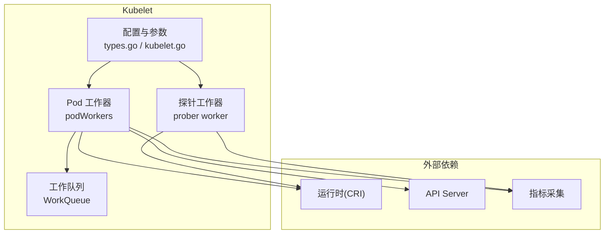
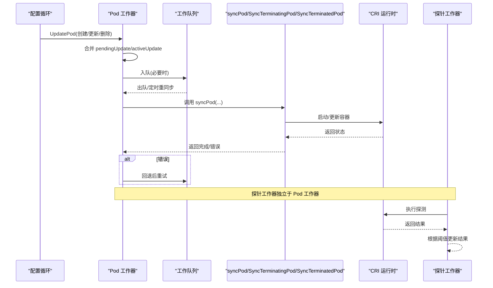
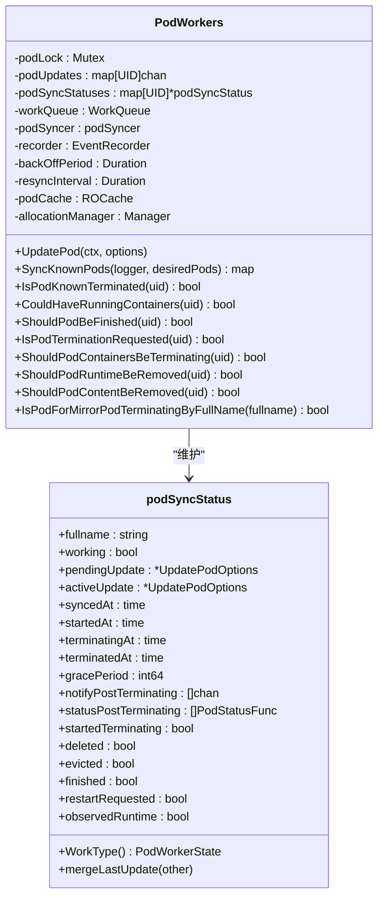
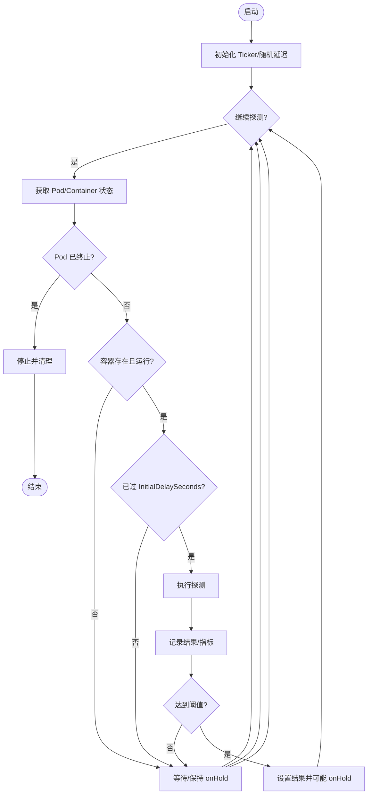
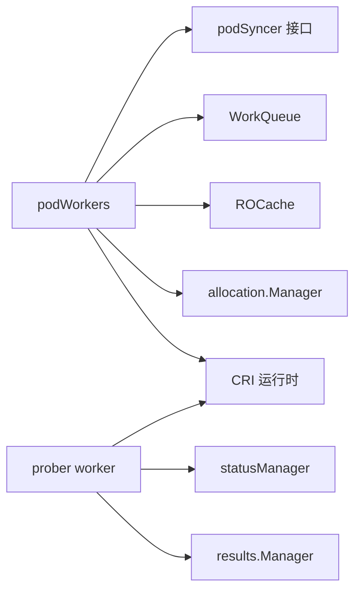

# 工作器池

<cite>
**本文引用的文件**   
- [pkg/kubelet/pod_workers.go](file://pkg/kubelet/pod_workers.go)
- [pkg/kubelet/prober/worker.go](file://pkg/kubelet/prober/worker.go)
- [pkg/kubelet/kubelet.go](file://pkg/kubelet/kubelet.go)
- [pkg/kubelet/apis/config/types.go](file://pkg/kubelet/apis/config/types.go)
- [pkg/kubelet/util/queue/workqueue.go](file://pkg/kubelet/util/queue/workqueue.go)
</cite>

## 目录
1. [简介](#简介)
2. [项目结构](#项目结构)
3. [核心组件](#核心组件)
4. [架构总览](#架构总览)
5. [详细组件分析](#详细组件分析)
6. [依赖关系分析](#依赖关系分析)
7. [性能考量](#性能考量)
8. [故障排查指南](#故障排查指南)
9. [结论](#结论)
10. [附录](#附录)

## 简介
本文件聚焦于 Kubelet 中 Pod 工作器池的设计与实现，系统性阐述其并发控制、任务队列管理、资源分配策略、工作器生命周期、任务分发机制、错误重试与超时处理、失败恢复策略、监控指标与调试接口、扩展性与容量规划，以及配置调优与故障排查方法。文档以源码为依据，提供可视化图示与“代码片段路径”以便快速定位实现细节。

## 项目结构
Kubelet 的 Pod 工作器池位于 pkg/kubelet 下，核心由以下模块构成：
- Pod 工作器与状态机：负责每个 Pod 的同步、终止、清理等全生命周期管理
- 探针工作器：按周期对容器执行就绪/存活/启动探测
- 全局配置与参数：MaxPods、回退间隔、重同步间隔等影响工作器并发与吞吐的关键参数
- 通用工作队列：用于解耦与限流的任务队列抽象

图表来源
- [pkg/kubelet/pod_workers.go:572-646](file://pkg/kubelet/pod_workers.go#L572-L646)
- [pkg/kubelet/prober/worker.go:35-155](file://pkg/kubelet/prober/worker.go#L35-L155)
- [pkg/kubelet/apis/config/types.go:300-360](file://pkg/kubelet/apis/config/types.go#L300-L360)
- [pkg/kubelet/kubelet.go:634-766](file://pkg/kubelet/kubelet.go#L634-L766)

章节来源
- [pkg/kubelet/pod_workers.go:572-646](file://pkg/kubelet/pod_workers.go#L572-L646)
- [pkg/kubelet/prober/worker.go:35-155](file://pkg/kubelet/prober/worker.go#L35-L155)
- [pkg/kubelet/apis/config/types.go:300-360](file://pkg/kubelet/apis/config/types.go#L300-L360)
- [pkg/kubelet/kubelet.go:634-766](file://pkg/kubelet/kubelet.go#L634-L766)

## 核心组件
- Pod 工作器（podWorkers）
  - 职责：为每个 Pod UID 维护一个工作协程，串行化该 Pod 的所有变更；协调 SyncPod、SyncTerminatingPod、SyncTerminatedPod 三阶段；对外暴露 ShouldPod* 系列查询接口，供其他子系统判断是否可安全进行资源回收或停止后台任务。
  - 并发模型：每 Pod 一协程 + 每 Pod 一个触发通道；跨 Pod 并行，单 Pod 串行。
  - 状态机：SyncPod → TerminatingPod → TerminatedPod，配合 activeUpdate/pendingUpdate 合并最新配置。
- 探针工作器（prober worker）
  - 职责：按 PeriodSeconds 周期执行 Readiness/Liveness/Startup 探测，记录结果并驱动容器重启或状态更新。
  - 并发模型：每个容器对应一个 worker 协程，独立运行。
- 工作队列（WorkQueue）
  - 职责：作为通用任务队列抽象，被 podWorkers 使用以承载周期性重同步与错误重试任务。
- 配置与参数
  - MaxPods：节点最大 Pod 数，决定工作器上限。
  - resyncInterval/backOffPeriod：重同步与错误回退间隔，影响吞吐与稳定性。
  - 其他：MaxOpenFiles、MaxParallelImagePulls、日志轮转并发等间接影响整体并发能力。

章节来源
- [pkg/kubelet/pod_workers.go:157-257](file://pkg/kubelet/pod_workers.go#L157-L257)
- [pkg/kubelet/pod_workers.go:572-646](file://pkg/kubelet/pod_workers.go#L572-L646)
- [pkg/kubelet/prober/worker.go:35-155](file://pkg/kubelet/prober/worker.go#L35-L155)
- [pkg/kubelet/apis/config/types.go:300-360](file://pkg/kubelet/apis/config/types.go#L300-L360)
- [pkg/kubelet/kubelet.go:634-766](file://pkg/kubelet/kubelet.go#L634-L766)

## 架构总览
下图展示 Pod 工作器与探针工作器的交互、状态流转及与外部系统的边界。

图表来源
- [pkg/kubelet/pod_workers.go:758-800](file://pkg/kubelet/pod_workers.go#L758-L800)
- [pkg/kubelet/pod_workers.go:325-334](file://pkg/kubelet/pod_workers.go#L325-L334)
- [pkg/kubelet/prober/worker.go:157-202](file://pkg/kubelet/prober/worker.go#L157-L202)

## 详细组件分析

### Pod 工作器（podWorkers）
- 设计要点
  - 每 Pod 一协程：保证同一 Pod 的变更严格串行，避免竞态。
  - 双缓冲更新：pendingUpdate 接收新变更，activeUpdate 作为下游可见的权威版本；KillPodOptions 累积，确保优雅期不可缩短。
  - 三阶段状态机：SyncPod/TerminatingPod/TerminatedPod，配合 finished/terminatedAt/startedAt 等时间戳精确刻画生命周期。
  - 外部查询接口：ShouldPod* 系列方法为其他子系统提供一致的状态视图，指导资源回收与后台任务启停。
- 并发与队列
  - 通过 per-pod 触发通道将变更投递到对应协程；工作队列用于周期性重同步与错误重试。
  - 重同步间隔与抖动因子：resyncInterval 与 jitter factor 降低雪崩风险。
  - 错误回退：backOffPeriod 与 transient error 专用回退间隔，避免风暴。
- 资源与缓存
  - 使用 ROCache 获取 Pod 运行时状态，减少直接 I/O。
  - 与 allocation.Manager 协作，在 Pod 生命周期内管理资源分配。
- 关键流程
  - UpdatePod：解析输入、首次同步标记、合并最新配置、决定是否进入 terminating/terminated。
  - SyncKnownPods：清理不再属于期望集合且已终止较久的 Pod 工作器。
  - 状态查询：IsPodKnownTerminated/CouldHaveRunningContainers/ShouldPodBeFinished 等。

图表来源
- [pkg/kubelet/pod_workers.go:572-646](file://pkg/kubelet/pod_workers.go#L572-L646)
- [pkg/kubelet/pod_workers.go:336-424](file://pkg/kubelet/pod_workers.go#L336-L424)
- [pkg/kubelet/pod_workers.go:446-484](file://pkg/kubelet/pod_workers.go#L446-L484)

章节来源
- [pkg/kubelet/pod_workers.go:157-257](file://pkg/kubelet/pod_workers.go#L157-L257)
- [pkg/kubelet/pod_workers.go:325-334](file://pkg/kubelet/pod_workers.go#L325-L334)
- [pkg/kubelet/pod_workers.go:572-646](file://pkg/kubelet/pod_workers.go#L572-L646)
- [pkg/kubelet/pod_workers.go:758-800](file://pkg/kubelet/pod_workers.go#L758-L800)

### 探针工作器（prober worker）
- 设计要点
  - 每个容器一个 worker，独立运行探测循环；支持手动触发与随机初始延迟，避免启动风暴。
  - 结果管理：基于 results.Manager 存储最近结果，结合 FailureThreshold/SuccessThreshold 判定状态变化。
  - 特殊处理：kubelet 重启时根据特性开关决定是否立即置 Failure；Graceful 关闭时将 liveness/startup 置 Success 以静默退出。
- 指标与清理
  - 成功/失败/未知三类计数与耗时观测；退出时清理结果与指标标签。

图表来源
- [pkg/kubelet/prober/worker.go:157-202](file://pkg/kubelet/prober/worker.go#L157-L202)
- [pkg/kubelet/prober/worker.go:213-394](file://pkg/kubelet/prober/worker.go#L213-L394)

章节来源
- [pkg/kubelet/prober/worker.go:35-155](file://pkg/kubelet/prober/worker.go#L35-L155)
- [pkg/kubelet/prober/worker.go:157-202](file://pkg/kubelet/prober/worker.go#L157-L202)
- [pkg/kubelet/prober/worker.go:213-394](file://pkg/kubelet/prober/worker.go#L213-L394)

### 任务队列与工作流
- 作用
  - 承载周期性重同步与错误重试任务，解耦主循环与具体处理逻辑。
- 行为
  - 使用 jitter 与 backoff 控制节奏，避免集中唤醒与级联失败。
  - 与 podWorkers 的 resyncInterval/backOffPeriod 协同工作。

章节来源
- [pkg/kubelet/pod_workers.go:325-334](file://pkg/kubelet/pod_workers.go#L325-L334)
- [pkg/kubelet/util/queue/workqueue.go](file://pkg/kubelet/util/queue/workqueue.go)

## 依赖关系分析
- 内部依赖
  - podWorkers 依赖 podSyncer 接口（由上层 lifecycle 实现），并通过 workQueue 调度重同步与重试。
  - prober worker 依赖 statusManager 与 results.Manager，间接依赖运行时状态。
- 外部依赖
  - CRI 运行时：容器生命周期操作与状态查询。
  - API Server：Pod 配置与事件（通过上层控制器/配置循环）。
  - 指标系统：探针与 Pod 工作器均上报指标。

图表来源
- [pkg/kubelet/pod_workers.go:572-646](file://pkg/kubelet/pod_workers.go#L572-L646)
- [pkg/kubelet/prober/worker.go:35-155](file://pkg/kubelet/prober/worker.go#L35-L155)

章节来源
- [pkg/kubelet/pod_workers.go:572-646](file://pkg/kubelet/pod_workers.go#L572-L646)
- [pkg/kubelet/prober/worker.go:35-155](file://pkg/kubelet/prober/worker.go#L35-L155)

## 性能考量
- 并发度
  - 每 Pod 一协程，最大并发受 MaxPods 限制；合理设置 MaxPods 以避免过多 goroutine 导致上下文切换开销。
- 队列与回退
  - 合理的 resyncInterval 与 backOffPeriod 能显著降低 CPU 与 I/O 抖动；jitter 有助于削峰。
- I/O 与缓存
  - 使用 ROCache 减少频繁访问运行时；按需刷新，避免阻塞。
- 探针
  - 合理设置 PeriodSeconds/InitialDelaySeconds/FailureThreshold/SuccessThreshold，避免过度探测。
- 资源限制
  - MaxOpenFiles、日志轮转并发等会影响整体吞吐与稳定性。

章节来源
- [pkg/kubelet/apis/config/types.go:300-360](file://pkg/kubelet/apis/config/types.go#L300-L360)
- [pkg/kubelet/kubelet.go:634-766](file://pkg/kubelet/kubelet.go#L634-L766)
- [pkg/kubelet/prober/worker.go:157-202](file://pkg/kubelet/prober/worker.go#L157-L202)

## 故障排查指南
- 常见问题定位
  - Pod 长时间处于 SyncPod：检查 syncPod 实现与 CRI 响应；关注回退与重同步日志。
  - 探针频繁失败：确认 InitialDelaySeconds 与容器启动时间；查看 FailureThreshold/SuccessThreshold 配置。
  - 资源回收不及时：核对 ShouldPod* 系列返回值与上游清理逻辑。
- 关键日志与指标
  - 探针指标：ProberResults、ProberDuration（成功/失败/未知）
  - Pod 工作器：可通过 metrics 包导出相关指标（如持续时间、重试次数等）
- 调试建议
  - 调整 resyncInterval/backOffPeriod 观察吞吐变化
  - 临时增大 MaxOpenFiles 与日志轮转并发，验证是否为 I/O 瓶颈
  - 使用 pprof 抓取 goroutine 与 CPU/内存 profile，定位热点

章节来源
- [pkg/kubelet/prober/worker.go:157-202](file://pkg/kubelet/prober/worker.go#L157-L202)
- [pkg/kubelet/pod_workers.go:325-334](file://pkg/kubelet/pod_workers.go#L325-L334)
- [pkg/kubelet/apis/config/types.go:300-360](file://pkg/kubelet/apis/config/types.go#L300-L360)

## 结论
Kubelet 的 Pod 工作器池采用“每 Pod 一协程 + 串行化 + 统一状态机”的模式，在保证一致性的同时具备良好的可扩展性。配合工作队列与回退策略，系统在大规模场景下仍能保持稳定。探针工作器独立运行，避免与 Pod 生命周期强耦合。通过合理配置 MaxPods、resyncInterval、backOffPeriod 与探针参数，可在吞吐与稳定性之间取得平衡。

## 附录

### 配置参数与调优建议
- MaxPods：控制最大并发 Pod 数，需结合节点 CPU/内存与 CRI 能力评估
- resyncInterval：全局重同步间隔，建议结合业务变更频率与节点规模调优
- backOffPeriod：错误回退间隔，避免雪崩；结合 transient error 专用间隔
- MaxOpenFiles：文件描述符上限，I/O 密集型场景适当提高
- MaxParallelImagePulls/SerializeImagePulls：镜像拉取并发策略，影响启动时延与带宽占用
- 探针参数：PeriodSeconds、InitialDelaySeconds、FailureThreshold、SuccessThreshold

章节来源
- [pkg/kubelet/apis/config/types.go:300-360](file://pkg/kubelet/apis/config/types.go#L300-L360)
- [pkg/kubelet/kubelet.go:634-766](file://pkg/kubelet/kubelet.go#L634-L766)

### 代码片段路径（便于快速定位）
- Pod 工作器构造与字段定义
  - [pkg/kubelet/pod_workers.go:572-646](file://pkg/kubelet/pod_workers.go#L572-L646)
- Pod 工作器状态结构与合并逻辑
  - [pkg/kubelet/pod_workers.go:336-424](file://pkg/kubelet/pod_workers.go#L336-L424)
  - [pkg/kubelet/pod_workers.go:446-484](file://pkg/kubelet/pod_workers.go#L446-L484)
- UpdatePod 入口与首次同步
  - [pkg/kubelet/pod_workers.go:758-800](file://pkg/kubelet/pod_workers.go#L758-L800)
- 探针工作器主循环
  - [pkg/kubelet/prober/worker.go:157-202](file://pkg/kubelet/prober/worker.go#L157-L202)
- 探针单次探测与结果记录
  - [pkg/kubelet/prober/worker.go:213-394](file://pkg/kubelet/prober/worker.go#L213-L394)
- 工作队列抽象
  - [pkg/kubelet/util/queue/workqueue.go](file://pkg/kubelet/util/queue/workqueue.go)
- 关键配置项
  - [pkg/kubelet/apis/config/types.go:300-360](file://pkg/kubelet/apis/config/types.go#L300-L360)
  - [pkg/kubelet/kubelet.go:634-766](file://pkg/kubelet/kubelet.go#L634-L766)