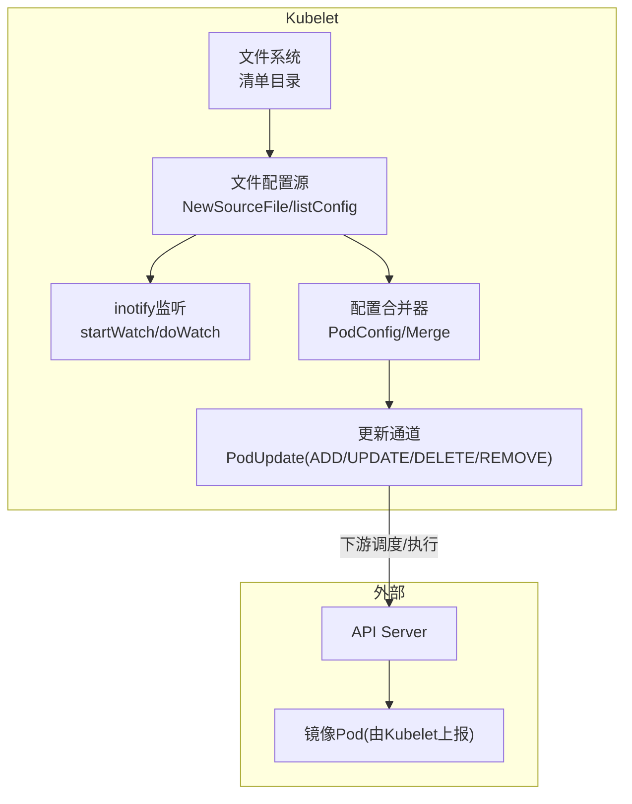
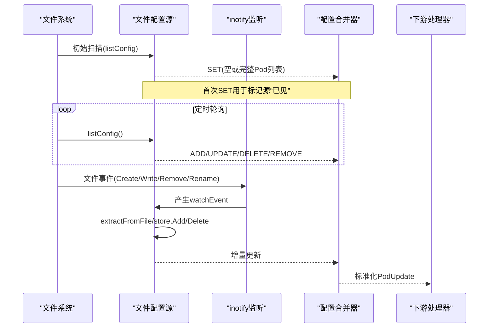
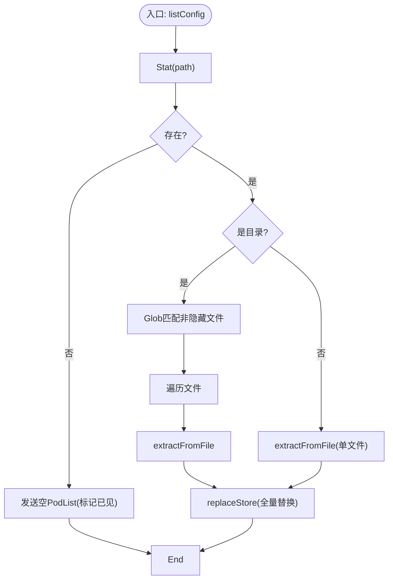
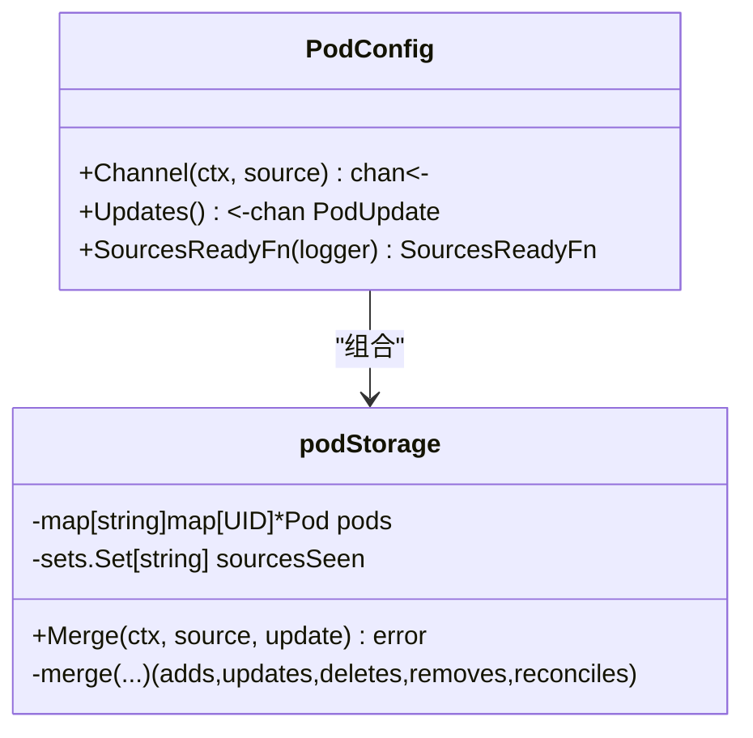
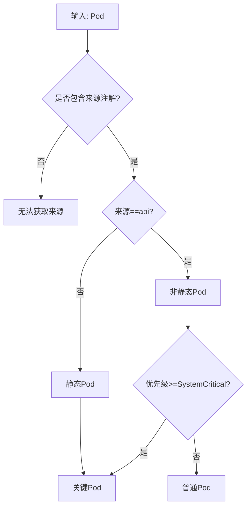
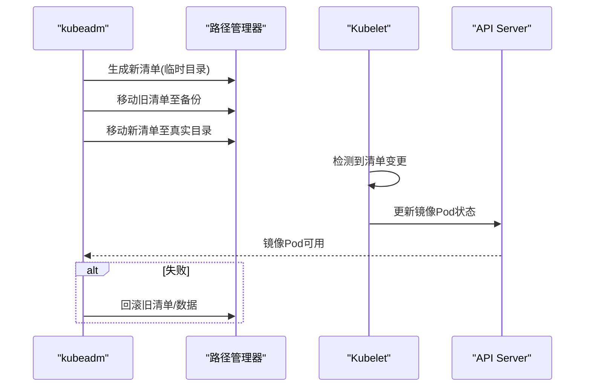
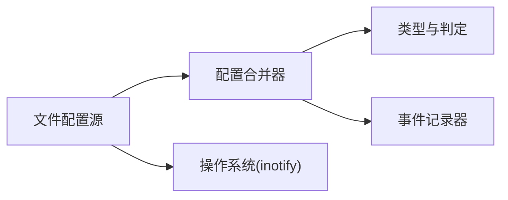

# 静态Pod管理

<cite>
**本文引用的文件**   
- [file.go](file://pkg/kubelet/config/file.go)
- [file_linux.go](file://pkg/kubelet/config/file_linux.go)
- [config.go](file://pkg/kubelet/config/config.go)
- [pod_update.go](file://pkg/kubelet/types/pod_update.go)
- [staticpods.go](file://cmd/kubeadm/app/phases/upgrade/staticpods.go)
</cite>

## 目录
1. [简介](#简介)
2. [项目结构](#项目结构)
3. [核心组件](#核心组件)
4. [架构总览](#架构总览)
5. [详细组件分析](#详细组件分析)
6. [依赖关系分析](#依赖关系分析)
7. [性能考量](#性能考量)
8. [故障排查指南](#故障排查指南)
9. [结论](#结论)
10. [附录](#附录)

## 简介
本技术文档聚焦于Kubelet的静态Pod管理机制，系统性阐述以下主题：
- 静态Pod发现机制：文件系统监听、目录扫描与变更检测
- 生命周期管理：创建、更新、删除与热重载
- 与API Server的隔离与安全考虑
- 配置格式、验证规则与默认值处理
- 优先级、依赖关系与资源限制
- 部署最佳实践与故障排查
- 配置文件示例与管理脚本（以路径引用形式提供）

## 项目结构
围绕静态Pod的核心代码主要分布在以下模块：
- Kubelet配置源层：负责从本地文件系统读取并监听Pod清单变化
- 配置合并与分发层：将多来源的Pod配置归一化并推送给下游消费者
- 类型与常量定义：标注Pod来源、操作类型、关键判断逻辑
- 升级工具链：kubeadm对控制面静态Pod的生成、替换与回滚流程

图表来源
- [file.go:61-114](file://pkg/kubelet/config/file.go#L61-L114)
- [file_linux.go:49-99](file://pkg/kubelet/config/file_linux.go#L49-L99)
- [config.go:146-179](file://pkg/kubelet/config/config.go#L146-L179)

章节来源
- [file.go:61-114](file://pkg/kubelet/config/file.go#L61-L114)
- [file_linux.go:49-99](file://pkg/kubelet/config/file_linux.go#L49-L99)
- [config.go:146-179](file://pkg/kubelet/config/config.go#L146-L179)

## 核心组件
- 文件配置源(sourceFile)
  - 职责：周期性扫描清单目录或单文件，解析为Pod对象；在Linux上通过inotify监听事件，增量更新缓存。
  - 关键点：支持目录与单文件两种模式；忽略隐藏文件；维护文件名到对象键的映射以便删除时精准定位。
- 配置合并器(PodConfig/podStorage)
  - 职责：接收来自多个源的Pod列表，去重、比较语义差异，输出最小化的ADD/UPDATE/DELETE/REMOVE/RECONCILE事件。
  - 关键点：首次SET后标记源“已见”；仅当语义发生变化才触发更新；保留本地注解（如来源、首次看到时间）。
- 类型与判定(types)
  - 职责：定义Pod来源(File/HTTP/API)、操作类型、是否为静态Pod/关键Pod等判定函数。
  - 关键点：静态Pod被视作关键Pod，参与抢占策略与系统保护。

章节来源
- [file.go:51-89](file://pkg/kubelet/config/file.go#L51-L89)
- [file.go:119-196](file://pkg/kubelet/config/file.go#L119-L196)
- [file_linux.go:101-152](file://pkg/kubelet/config/file_linux.go#L101-L152)
- [config.go:146-252](file://pkg/kubelet/config/config.go#L146-L252)
- [pod_update.go:54-100](file://pkg/kubelet/types/pod_update.go#L54-L100)
- [pod_update.go:151-169](file://pkg/kubelet/types/pod_update.go#L151-L169)

## 架构总览
静态Pod的生命周期由“发现→解析→合并→下发→运行→监控→变更响应”构成。

图表来源
- [file.go:91-114](file://pkg/kubelet/config/file.go#L91-L114)
- [file_linux.go:67-99](file://pkg/kubelet/config/file_linux.go#L67-L99)
- [config.go:146-179](file://pkg/kubelet/config/config.go#L146-L179)

## 详细组件分析

### 组件A：文件配置源(sourceFile)
- 初始化与运行
  - NewSourceFile：清理路径末尾分隔符，启动run循环与监听。
  - run：定时器驱动listConfig；同时消费watchEvents进行增量处理。
- 目录与文件处理
  - listConfig：区分目录与单文件；目录模式下遍历非隐藏文件，逐个解析；单文件直接解析。
  - extractFromDir：使用glob匹配非隐藏文件，排序后逐一处理；遇到子目录跳过并记录日志。
  - extractFromFile：限制最大读取长度；调用解码器解析单个Pod；失败返回错误。
- Linux平台监听
  - startWatch/doWatch：基于fsnotify建立监听，忽略不可恢复错误并退避重试。
  - produceWatchEvent：过滤隐藏文件；将Create/Write/Chmod映射为新增/修改；Remove/Rename映射为删除。
  - consumeWatchEvent：根据事件类型增删缓存条目；删除时通过文件名到对象键的映射精确移除。

图表来源
- [file.go:119-155](file://pkg/kubelet/config/file.go#L119-L155)
- [file.go:160-196](file://pkg/kubelet/config/file.go#L160-L196)
- [file.go:198-236](file://pkg/kubelet/config/file.go#L198-L236)
- [file_linux.go:101-152](file://pkg/kubelet/config/file_linux.go#L101-L152)

章节来源
- [file.go:61-114](file://pkg/kubelet/config/file.go#L61-L114)
- [file.go:119-196](file://pkg/kubelet/config/file.go#L119-L196)
- [file.go:198-236](file://pkg/kubelet/config/file.go#L198-L236)
- [file_linux.go:49-99](file://pkg/kubelet/config/file_linux.go#L49-L99)
- [file_linux.go:101-152](file://pkg/kubelet/config/file_linux.go#L101-L152)

### 组件B：配置合并器(PodConfig/podStorage)
- 合并与去重
  - Merge：按源名维护Pod集合；对比新旧集合计算ADD/UPDATE/DELETE/REMOVE/RECONCILE。
  - filterInvalidPods：同一源内禁止同名Pod冲突，重复者丢弃并记录事件。
- 语义比较与注解
  - checkAndUpdatePod：仅在Spec/Labels/Deletion相关字段或注解发生语义变化时才触发更新；若仅状态不同则触发RECONCILE。
  - 本地注解：来源、首次看到时间、镜像Pod标记等由Kubelet注入，不参与语义比较。
- 首次SET与就绪
  - 首个SET消息用于标记源“已见”，即使无Pod也会发送空更新，确保上游感知。

图表来源
- [config.go:43-71](file://pkg/kubelet/config/config.go#L43-L71)
- [config.go:146-252](file://pkg/kubelet/config/config.go#L146-L252)
- [config.go:266-283](file://pkg/kubelet/config/config.go#L266-L283)
- [config.go:349-405](file://pkg/kubelet/config/config.go#L349-L405)

章节来源
- [config.go:146-252](file://pkg/kubelet/config/config.go#L146-L252)
- [config.go:266-283](file://pkg/kubelet/config/config.go#L266-L283)
- [config.go:349-405](file://pkg/kubelet/config/config.go#L349-L405)

### 组件C：类型与判定(types)
- 来源与操作
  - 来源：file/http/api/*；操作：ADD/DELETE/REMOVE/UPDATE/RECONCILE。
  - GetValidatedSources：校验来源白名单。
- 静态与关键Pod
  - IsStaticPod：来源不是api即为静态Pod。
  - IsCriticalPod：静态Pod、镜像Pod或高优先级Pod视为关键Pod。
  - Preemptable/IsNodeCriticalPod：用于抢占与节点级关键性判断。

图表来源
- [pod_update.go:54-100](file://pkg/kubelet/types/pod_update.go#L54-L100)
- [pod_update.go:151-169](file://pkg/kubelet/types/pod_update.go#L151-L169)
- [pod_update.go:171-188](file://pkg/kubelet/types/pod_update.go#L171-L188)

章节来源
- [pod_update.go:54-100](file://pkg/kubelet/types/pod_update.go#L54-L100)
- [pod_update.go:151-169](file://pkg/kubelet/types/pod_update.go#L151-L169)
- [pod_update.go:171-188](file://pkg/kubelet/types/pod_update.go#L171-L188)

### 组件D：升级与热重载(kubeadm侧)
- 生成新清单：写入临时目录，避免影响正在运行的旧清单。
- 原子替换：将旧清单移动到备份目录，再将新清单移动到真实清单目录。
- 等待与回滚：等待镜像Pod哈希变化与新组件注册；失败则回滚清单与etcd数据。
- 证书续期：在升级前按需续期组件相关证书。

图表来源
- [staticpods.go:188-281](file://cmd/kubeadm/app/phases/upgrade/staticpods.go#L188-L281)
- [staticpods.go:429-533](file://cmd/kubeadm/app/phases/upgrade/staticpods.go#L429-L533)

章节来源
- [staticpods.go:188-281](file://cmd/kubeadm/app/phases/upgrade/staticpods.go#L188-L281)
- [staticpods.go:429-533](file://cmd/kubeadm/app/phases/upgrade/staticpods.go#L429-L533)

## 依赖关系分析
- 低耦合设计
  - 文件源与合并器通过通道解耦；合并器面向多种来源统一抽象。
- 关键依赖
  - 文件源依赖fsnotify(Linux)实现高效事件通知；合并器依赖客户端存储接口做增量比对。
- 潜在风险
  - inotify事件风暴：通过缓冲与退避缓解；合并器对冗余更新进行过滤。
  - 大清单文件：读取有上限，避免内存压力。

图表来源
- [file_linux.go:67-99](file://pkg/kubelet/config/file_linux.go#L67-L99)
- [config.go:146-179](file://pkg/kubelet/config/config.go#L146-L179)
- [pod_update.go:54-100](file://pkg/kubelet/types/pod_update.go#L54-L100)

章节来源
- [file_linux.go:67-99](file://pkg/kubelet/config/file_linux.go#L67-L99)
- [config.go:146-179](file://pkg/kubelet/config/config.go#L146-L179)
- [pod_update.go:54-100](file://pkg/kubelet/types/pod_update.go#L54-L100)

## 性能考量
- 事件驱动优于纯轮询：Linux下优先使用inotify减少IO开销。
- 增量更新：合并器仅推送语义变化的最小集，降低下游处理压力。
- 文件大小限制：读取上限防止异常大清单导致内存抖动。
- 退避重试：监听失败采用指数退避，避免频繁重建监听。

## 故障排查指南
- 清单未被识别
  - 检查清单是否以点号开头（会被忽略）；确认路径指向文件或目录。
  - 参考：[file_linux.go:101-106](file://pkg/kubelet/config/file_linux.go#L101-L106)
- 重复名称冲突
  - 同一源内同名Pod会被丢弃并记录警告事件。
  - 参考：[config.go:266-283](file://pkg/kubelet/config/config.go#L266-L283)
- 监听失效
  - 查看inotify创建与错误通道日志；关注退避行为。
  - 参考：[file_linux.go:67-99](file://pkg/kubelet/config/file_linux.go#L67-L99)
- 升级失败回滚
  - 检查临时/备份目录内容；确认etcd数据回滚是否成功。
  - 参考：[staticpods.go:535-571](file://cmd/kubeadm/app/phases/upgrade/staticpods.go#L535-L571)

章节来源
- [file_linux.go:101-106](file://pkg/kubelet/config/file_linux.go#L101-L106)
- [config.go:266-283](file://pkg/kubelet/config/config.go#L266-L283)
- [file_linux.go:67-99](file://pkg/kubelet/config/file_linux.go#L67-L99)
- [staticpods.go:535-571](file://cmd/kubeadm/app/phases/upgrade/staticpods.go#L535-L571)

## 结论
Kubelet的静态Pod管理通过“文件源+事件监听+合并器”的组合实现了稳定、高效的本地Pod编排能力。其设计强调：
- 安全隔离：静态Pod不经过API Server准入流程，但通过关键Pod策略获得系统级保护。
- 可观测与可控：通过注解与事件记录，便于诊断与排障。
- 可升级：配合kubeadm的原子替换与回滚机制，保障控制面平滑演进。

## 附录

### 配置格式与验证规则
- 清单格式
  - 支持单Pod YAML/JSON或PodList；每个文件对应一个Pod。
  - 参考：[file.go:198-236](file://pkg/kubelet/config/file.go#L198-L236)
- 命名与冲突
  - 同一源内不得出现同名Pod；否则丢弃并记录事件。
  - 参考：[config.go:266-283](file://pkg/kubelet/config/config.go#L266-L283)
- 默认值与注解
  - 解析阶段会应用默认值并注入本地注解（来源、首次看到时间等）。
  - 参考：[config.go:329-347](file://pkg/kubelet/config/config.go#L329-L347)

章节来源
- [file.go:198-236](file://pkg/kubelet/config/file.go#L198-L236)
- [config.go:266-283](file://pkg/kubelet/config/config.go#L266-L283)
- [config.go:329-347](file://pkg/kubelet/config/config.go#L329-L347)

### 优先级、依赖与资源限制
- 优先级
  - 静态Pod被视为关键Pod，参与抢占与系统保护。
  - 参考：[pod_update.go:151-169](file://pkg/kubelet/types/pod_update.go#L151-L169)
- 依赖关系
  - 静态Pod之间无内置依赖图；可通过Init容器顺序与探针控制启动顺序。
- 资源限制
  - 遵循标准Pod的资源请求/限制语义；受节点容量与QoS策略约束。

章节来源
- [pod_update.go:151-169](file://pkg/kubelet/types/pod_update.go#L151-L169)

### 与API Server的隔离与安全
- 隔离机制
  - 静态Pod由Kubelet本地管理，不经过API Server的常规创建流程；Kubelet会为其创建镜像Pod以暴露状态。
  - 参考：[config.go:203-211](file://pkg/kubelet/config/config.go#L203-L211)
- 安全建议
  - 严格管控清单目录权限，仅允许可信用户写入。
  - 结合节点准入策略与RBAC限制对节点资源的访问。

章节来源
- [config.go:203-211](file://pkg/kubelet/config/config.go#L203-L211)

### 部署最佳实践
- 清单组织
  - 使用独立文件存放各组件清单；避免隐藏文件干扰。
  - 参考：[file_linux.go:101-106](file://pkg/kubelet/config/file_linux.go#L101-L106)
- 变更策略
  - 先写临时清单，再原子替换；必要时配合kubeadm进行升级与回滚。
  - 参考：[staticpods.go:188-281](file://cmd/kubeadm/app/phases/upgrade/staticpods.go#L188-L281)
- 健康检查
  - 合理设置探针与重启策略，确保自愈能力。

章节来源
- [file_linux.go:101-106](file://pkg/kubelet/config/file_linux.go#L101-L106)
- [staticpods.go:188-281](file://cmd/kubeadm/app/phases/upgrade/staticpods.go#L188-L281)

### 配置文件示例与管理脚本（路径引用）
- 示例清单
  - 控制面组件清单模板：[controlplane.go](file://cmd/kubeadm/app/cmd/phases/init/controlplane.go)
  - etcd清单生成：[etcd.go](file://cmd/kubeadm/app/cmd/phases/init/etcd.go)
- 管理脚本
  - 集群初始化与加入：[init.go](file://cmd/kubeadm/app/cmd/init.go), [join.go](file://cmd/kubeadm/app/cmd/join.go)
  - 升级流程：[staticpods.go](file://cmd/kubeadm/app/phases/upgrade/staticpods.go)

章节来源
- [controlplane.go](file://cmd/kubeadm/app/cmd/phases/init/controlplane.go)
- [etcd.go](file://cmd/kubeadm/app/cmd/phases/init/etcd.go)
- [init.go](file://cmd/kubeadm/app/cmd/init.go)
- [join.go](file://cmd/kubeadm/app/cmd/join.go)
- [staticpods.go](file://cmd/kubeadm/app/phases/upgrade/staticpods.go)