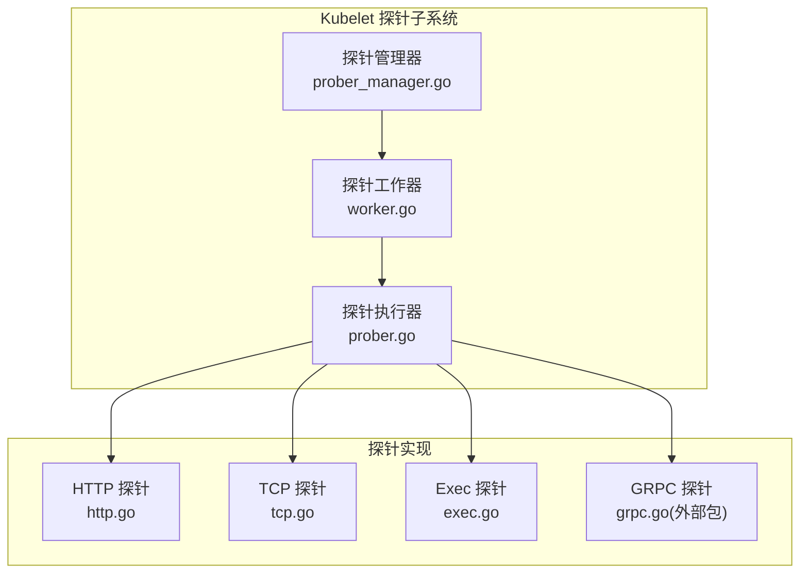
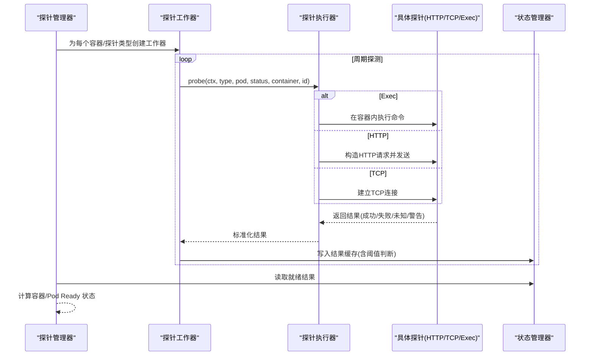
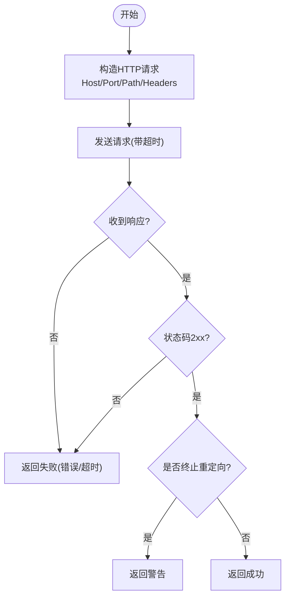
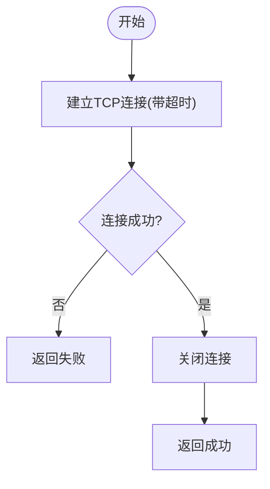
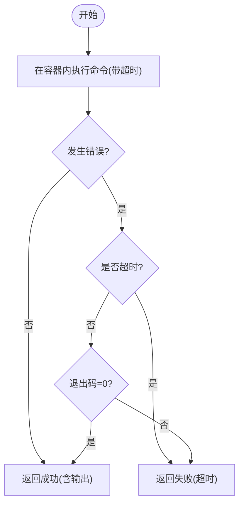
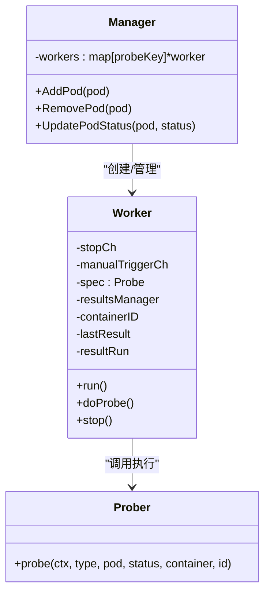
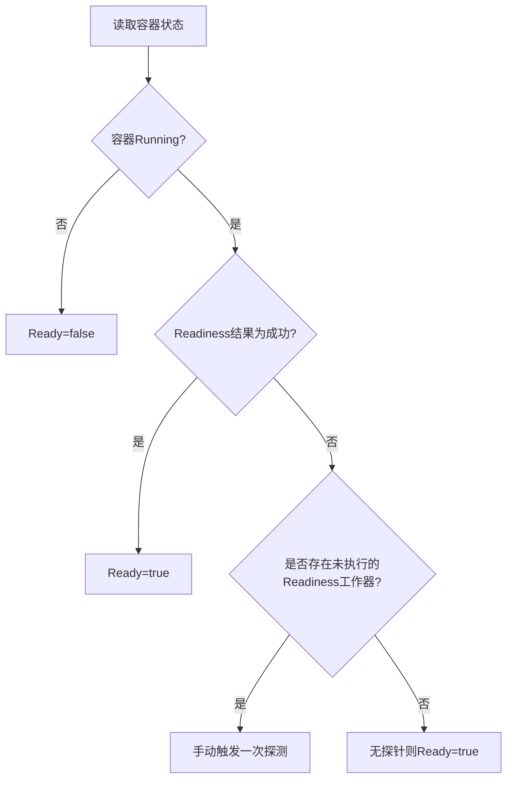
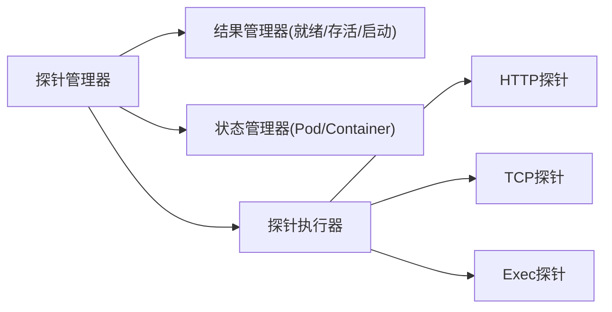

# 健康检查系统

<cite>
**本文引用的文件**
- [pkg/kubelet/prober/prober.go](file://pkg/kubelet/prober/prober.go)
- [pkg/kubelet/prober/prober_manager.go](file://pkg/kubelet/prober/prober_manager.go)
- [pkg/kubelet/prober/worker.go](file://pkg/kubelet/prober/worker.go)
- [pkg/probe/probe.go](file://pkg/probe/probe.go)
- [pkg/probe/http/http.go](file://pkg/probe/http/http.go)
- [pkg/probe/tcp/tcp.go](file://pkg/probe/tcp/tcp.go)
- [pkg/probe/exec/exec.go](file://pkg/probe/exec/exec.go)
</cite>

## 目录
1. [简介](#简介)
2. [项目结构](#项目结构)
3. [核心组件](#核心组件)
4. [架构总览](#架构总览)
5. [详细组件分析](#详细组件分析)
6. [依赖关系分析](#依赖关系分析)
7. [性能考量](#性能考量)
8. [故障排查指南](#故障排查指南)
9. [结论](#结论)
10. [附录](#附录)

## 简介
本技术文档聚焦于 Kubelet 健康检查系统，系统性阐述三种探针类型（LivenessProbe、ReadinessProbe、StartupProbe）的实现原理与调度机制，深入解析 HTTP、TCP、Exec 三类探针的工作流程（请求构造、超时处理、结果解析），并说明探针结果的传播路径（Pod 状态更新与服务发现联动）。同时提供性能影响分析与优化策略、配置最佳实践、常见问题诊断方法，以及扩展自定义探针类型的开发指南。

## 项目结构
Kubelet 的健康检查由“探针管理器 + 探针工作器 + 具体探针实现”三层组成：
- 探针管理器：负责为每个容器的每种探针创建独立工作器，维护运行期状态，聚合结果并驱动 Pod 状态更新。
- 探针工作器：周期性执行探测，管理间隔、初始延迟、阈值计数、手动触发等。
- 具体探针实现：HTTP/TCP/Exec/GRPC 四类探针的具体执行逻辑与结果判定。

图表来源
- [pkg/kubelet/prober/prober_manager.go:120-139](file://pkg/kubelet/prober/prober_manager.go#L120-L139)
- [pkg/kubelet/prober/worker.go:97-155](file://pkg/kubelet/prober/worker.go#L97-L155)
- [pkg/kubelet/prober/prober.go:56-69](file://pkg/kubelet/prober/prober.go#L56-L69)
- [pkg/probe/http/http.go:37-62](file://pkg/probe/http/http.go#L37-L62)
- [pkg/probe/tcp/tcp.go:29-44](file://pkg/probe/tcp/tcp.go#L29-L44)
- [pkg/probe/exec/exec.go:35-45](file://pkg/probe/exec/exec.go#L35-L45)

章节来源
- [pkg/kubelet/prober/prober_manager.go:120-139](file://pkg/kubelet/prober/prober_manager.go#L120-L139)
- [pkg/kubelet/prober/worker.go:97-155](file://pkg/kubelet/prober/worker.go#L97-L155)
- [pkg/kubelet/prober/prober.go:56-69](file://pkg/kubelet/prober/prober.go#L56-L69)

## 核心组件
- 探针结果类型：统一使用 Result 枚举表示成功、警告、失败、未知。
- 探针执行器：根据容器探针配置选择对应实现（HTTP/TCP/Exec/GRPC），封装超时、重试与事件记录。
- 探针管理器：按 Pod/Container/ProbeType 维度创建工作器，维护结果缓存，驱动 Ready/Started 状态计算。
- 探针工作器：周期轮询，管理 InitialDelaySeconds、FailureThreshold、SuccessThreshold，支持手动触发与优雅关停。

章节来源
- [pkg/probe/probe.go:19-31](file://pkg/probe/probe.go#L19-L31)
- [pkg/kubelet/prober/prober.go:82-134](file://pkg/kubelet/prober/prober.go#L82-L134)
- [pkg/kubelet/prober/prober_manager.go:71-94](file://pkg/kubelet/prober/prober_manager.go#L71-94)
- [pkg/kubelet/prober/worker.go:157-202](file://pkg/kubelet/prober/worker.go#L157-202)

## 架构总览
下图展示从“探针配置”到“Pod 状态更新”的端到端调用链：

图表来源
- [pkg/kubelet/prober/prober_manager.go:185-230](file://pkg/kubelet/prober/prober_manager.go#L185-L230)
- [pkg/kubelet/prober/worker.go:157-202](file://pkg/kubelet/prober/worker.go#L157-202)
- [pkg/kubelet/prober/prober.go:151-203](file://pkg/kubelet/prober/prober.go#L151-L203)
- [pkg/probe/http/http.go:74-82](file://pkg/probe/http/http.go#L74-L82)
- [pkg/probe/tcp/tcp.go:41-63](file://pkg/probe/tcp/tcp.go#L41-L63)
- [pkg/probe/exec/exec.go:47-79](file://pkg/probe/exec/exec.go#L47-L79)

## 详细组件分析

### 探针类型与语义
- LivenessProbe（存活探针）
  - 目的：检测进程是否处于可恢复的活跃状态；失败将触发容器重启。
  - 行为：首次默认成功；连续失败超过阈值后标记失败并停止探测，等待新容器实例。
- ReadinessProbe（就绪探针）
  - 目的：指示容器是否已准备好接收流量；失败则从服务后端摘除。
  - 行为：首次默认失败；连续成功超过阈值后标记就绪。
- StartupProbe（启动探针）
  - 目的：用于慢启动应用，避免 Liveness/Readiness 过早失败。
  - 行为：首次默认未知；成功后停止继续探测（除非容器重启）。

章节来源
- [pkg/kubelet/prober/worker.go:112-125](file://pkg/kubelet/prober/worker.go#L112-L125)
- [pkg/kubelet/prober/prober.go:82-134](file://pkg/kubelet/prober/prober.go#L82-L134)

### HTTP 探针工作机制
- 请求构造：基于 Probe.HTTPGet 与容器环境信息生成标准 HTTP 请求，包含 Host/Port/Path/Scheme/Headers。
- 传输层：使用专用 Transport，禁用代理与压缩，复用统一的拨号器以受控网络栈。
- 重定向策略：默认不跟随跨主机重定向，否则返回警告；最多允许固定次数重定向。
- 超时与错误：客户端超时直接映射为失败；响应体长度限制以避免内存膨胀。
- 结果判定：2xx 成功；非 2xx 或通信错误失败；终止重定向返回警告。

图表来源
- [pkg/probe/http/http.go:37-62](file://pkg/probe/http/http.go#L37-L62)
- [pkg/probe/http/http.go:74-123](file://pkg/probe/http/http.go#L74-L123)
- [pkg/probe/http/http.go:125-141](file://pkg/probe/http/http.go#L125-L141)

章节来源
- [pkg/probe/http/http.go:37-62](file://pkg/probe/http/http.go#L37-L62)
- [pkg/probe/http/http.go:74-123](file://pkg/probe/http/http.go#L74-L123)
- [pkg/probe/http/http.go:125-141](file://pkg/probe/http/http.go#L125-L141)

### TCP 探针工作机制
- 连接建立：通过拨号器向目标 host:port 发起 TCP 连接，超时即失败。
- 资源释放：连接成功后立即关闭，避免占用资源。
- 结果判定：连接成功即成功，否则失败。

图表来源
- [pkg/probe/tcp/tcp.go:41-63](file://pkg/probe/tcp/tcp.go#L41-L63)

章节来源
- [pkg/probe/tcp/tcp.go:41-63](file://pkg/probe/tcp/tcp.go#L41-L63)

### Exec 探针工作机制
- 命令执行：在容器命名空间内执行指定命令，合并 stdout/stderr 输出并限制大小。
- 退出码判定：退出码 0 视为成功，非 0 视为失败；超时映射为失败；其他错误为未知。
- 输出记录：日志级别下记录命令输出摘要，便于排障。

图表来源
- [pkg/probe/exec/exec.go:47-79](file://pkg/probe/exec/exec.go#L47-L79)

章节来源
- [pkg/probe/exec/exec.go:47-79](file://pkg/probe/exec/exec.go#L47-L79)

### 探针调度器与工作器
- 并发控制：每个容器每种探针类型一个独立 goroutine 工作器，互不阻塞。
- 间隔调整：PeriodSeconds 作为主时钟；支持手动触发即时探测并重置计时器。
- 初始延迟：InitialDelaySeconds 生效前跳过探测。
- 阈值管理：FailureThreshold/SuccessThreshold 决定状态切换时机；对 Liveness/Startup 失败后暂停探测直至新容器实例。
- 优雅关停：Pod 删除时，Liveness/Startup 探针提前置成功并停止，避免干扰优雅终止。
- 结果缓存：按容器 ID 存储最近一次结果，供状态管理器读取。

图表来源
- [pkg/kubelet/prober/prober_manager.go:185-230](file://pkg/kubelet/prober/prober_manager.go#L185-L230)
- [pkg/kubelet/prober/worker.go:157-202](file://pkg/kubelet/prober/worker.go#L157-202)
- [pkg/kubelet/prober/prober.go:82-134](file://pkg/kubelet/prober/prober.go#L82-L134)

章节来源
- [pkg/kubelet/prober/prober_manager.go:185-230](file://pkg/kubelet/prober/prober_manager.go#L185-L230)
- [pkg/kubelet/prober/worker.go:157-202](file://pkg/kubelet/prober/worker.go#L157-202)
- [pkg/kubelet/prober/worker.go:315-394](file://pkg/kubelet/prober/worker.go#L315-L394)

### 探针结果传播与 Pod 状态联动
- 就绪状态：容器 Running 且 Readiness 结果为成功时，容器 Ready=true；若无就绪探针则默认就绪。
- 启动状态：存在 Startup 探针时，容器 Started 取决于其结果；未定义时依据特性门控与启动时间窗口推断。
- 服务发现联动：Ready 变化会驱动 Endpoints/EndpointSlice 更新，从而改变服务路由。
- 重启保护：Kubelet 重启窗口内，若容器早于宽限期启动，避免立即置失败导致抖动。

图表来源
- [pkg/kubelet/prober/prober_manager.go:332-375](file://pkg/kubelet/prober/prober_manager.go#L332-L375)
- [pkg/kubelet/prober/prober_manager.go:275-296](file://pkg/kubelet/prober/prober_manager.go#L275-L296)

章节来源
- [pkg/kubelet/prober/prober_manager.go:332-375](file://pkg/kubelet/prober/prober_manager.go#L332-L375)
- [pkg/kubelet/prober/prober_manager.go:275-296](file://pkg/kubelet/prober/prober_manager.go#L275-L296)

## 依赖关系分析
- 模块耦合
  - 探针管理器依赖状态管理器与结果管理器，解耦了“探测执行”和“状态聚合”。
  - 探针执行器仅关注“如何执行”，通过接口抽象屏蔽底层差异。
- 外部依赖
  - HTTP/TCP 探针使用统一拨号器与受限传输层，避免受节点代理影响。
  - Exec 探针通过 CRI Client 在容器内执行命令。
- 潜在循环依赖
  - 当前分层清晰，未见循环导入风险。

图表来源
- [pkg/kubelet/prober/prober_manager.go:120-139](file://pkg/kubelet/prober/prober_manager.go#L120-L139)
- [pkg/kubelet/prober/prober.go:56-69](file://pkg/kubelet/prober/prober.go#L56-L69)
- [pkg/probe/http/http.go:37-62](file://pkg/probe/http/http.go#L37-L62)
- [pkg/probe/tcp/tcp.go:29-44](file://pkg/probe/tcp/tcp.go#L29-L44)
- [pkg/probe/exec/exec.go:35-45](file://pkg/probe/exec/exec.go#L35-L45)

章节来源
- [pkg/kubelet/prober/prober_manager.go:120-139](file://pkg/kubelet/prober/prober_manager.go#L120-L139)
- [pkg/kubelet/prober/prober.go:56-69](file://pkg/kubelet/prober/prober.go#L56-L69)

## 性能考量
- 并发模型：每探针一协程，天然并行；建议合理设置 PeriodSeconds 避免风暴。
- 随机退避：Kubelet 启动后短周期内引入随机延迟，降低瞬时集中探测。
- 资源限制：HTTP 响应体与 Exec 输出均有限长，防止大响应/大输出造成内存压力。
- 批量与节流：可通过增大 PeriodSeconds、提高阈值减少频繁状态翻转；结合业务冷启动时长调优。
- 指标观测：暴露探针总数与耗时直方图，便于定位热点与异常。

章节来源
- [pkg/kubelet/prober/worker.go:157-184](file://pkg/kubelet/prober/worker.go#L157-L184)
- [pkg/probe/http/http.go:33-35](file://pkg/probe/http/http.go#L33-L35)
- [pkg/probe/exec/exec.go:31-33](file://pkg/probe/exec/exec.go#L31-L33)
- [pkg/kubelet/prober/prober_manager.go:41-69](file://pkg/kubelet/prober/prober_manager.go#L41-L69)

## 故障排查指南
- 常见现象
  - 容器反复重启：检查 Liveness 阈值与探针逻辑，确认是否误判。
  - 服务不可达但容器存活：检查 Readiness 探针路径/端口/头部配置。
  - 启动缓慢被杀：适当增大 Startup 的 Period/Timeout/FailureThreshold。
- 定位步骤
  - 查看事件：探针失败/警告会记录事件，便于快速定位原因。
  - 观察指标：探针总数与耗时分布，识别异常波动。
  - 验证网络：HTTP/TCP 探针是否可达，注意重定向与 TLS 配置。
  - 校验命令：Exec 探针命令是否在容器内可用，输出是否过大。
- 典型问题
  - 重定向跨主机：默认终止并重定向告警，需调整策略或修正上游地址。
  - 超时过长：缩短 TimeoutSeconds 或优化后端响应。
  - 输出过大：限制命令输出或改用轻量级探针。

章节来源
- [pkg/kubelet/prober/prober.go:104-134](file://pkg/kubelet/prober/prober.go#L104-L134)
- [pkg/probe/http/http.go:125-141](file://pkg/probe/http/http.go#L125-L141)
- [pkg/probe/exec/exec.go:62-79](file://pkg/probe/exec/exec.go#L62-L79)

## 结论
Kubelet 健康检查系统通过清晰的职责分层与可扩展的探针接口，实现了高可靠、低侵入的容器生命周期治理。合理的探针配置与参数调优能显著提升系统的稳定性与可观测性。在生产环境中，建议结合业务特征制定差异化探针策略，并持续监控探针指标与事件，及时发现问题与优化体验。

## 附录

### 配置最佳实践
- LivenessProbe
  - 使用轻量级检查（如 /healthz），避免昂贵 I/O。
  - 设置合理的 FailureThreshold 与 PeriodSeconds，避免误杀。
- ReadinessProbe
  - 确保与对外服务一致的路径/端口/头部，避免流量进入未就绪实例。
  - 冷启动阶段可配合 StartupProbe 保护。
- StartupProbe
  - 针对慢启动应用，设置足够大的 FailureThreshold 与 PeriodSeconds。
  - 成功后不再重复探测，避免额外开销。
- 通用建议
  - 控制超时与输出大小，避免资源消耗。
  - 避免跨主机重定向，必要时显式配置。

### 扩展自定义探针类型（开发指南）
- 新增探针实现
  - 在对应子包中实现 Prober 接口，定义 Probe 方法与必要参数。
  - 遵循统一的结果语义（成功/失败/未知/警告），并处理超时与错误。
- 接入探针执行器
  - 在探针执行器中增加分支，解析配置并调用新探针实现。
  - 如需新的配置字段，需在 API 层同步扩展并在执行器中解析。
- 测试与发布
  - 编写单元测试覆盖正常/异常路径与边界条件。
  - 添加指标埋点与日志，便于上线后观测。

章节来源
- [pkg/probe/http/http.go:64-82](file://pkg/probe/http/http.go#L64-L82)
- [pkg/probe/tcp/tcp.go:34-44](file://pkg/probe/tcp/tcp.go#L34-L44)
- [pkg/probe/exec/exec.go:40-50](file://pkg/probe/exec/exec.go#L40-L50)
- [pkg/kubelet/prober/prober.go:151-203](file://pkg/kubelet/prober/prober.go#L151-L203)