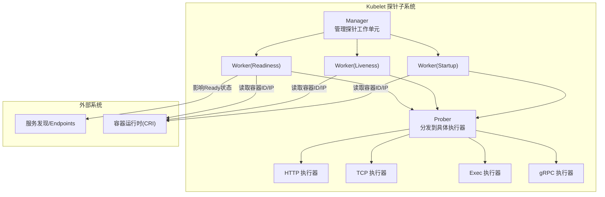
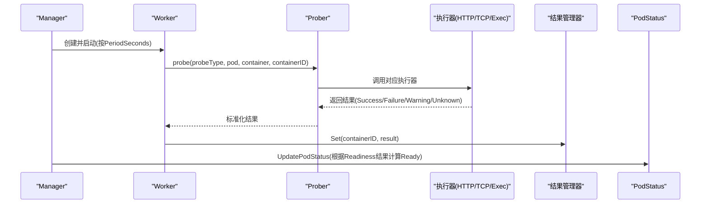
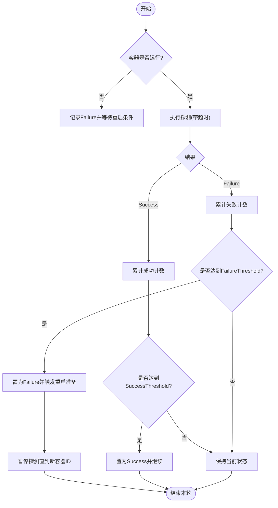
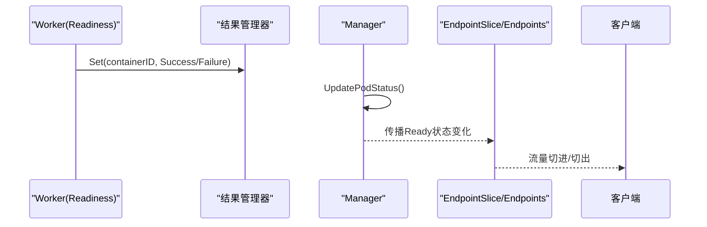
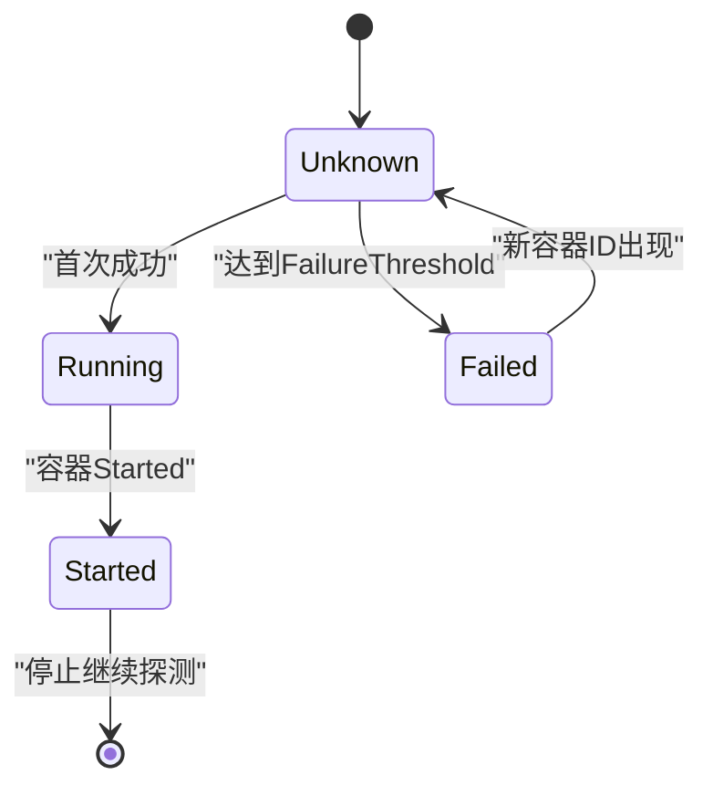
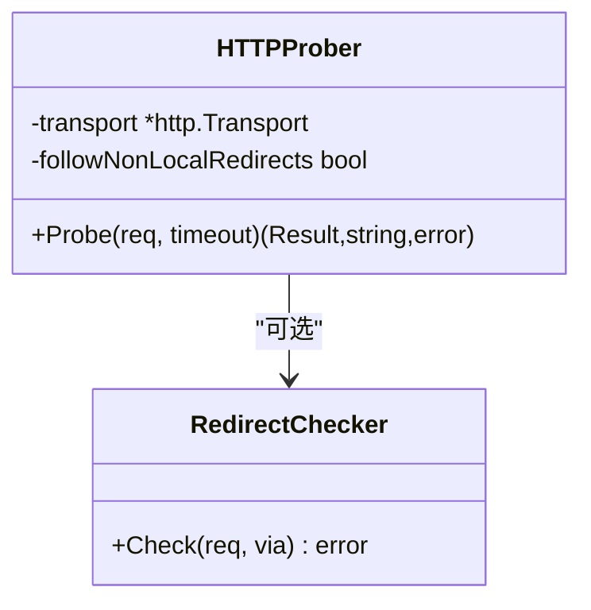
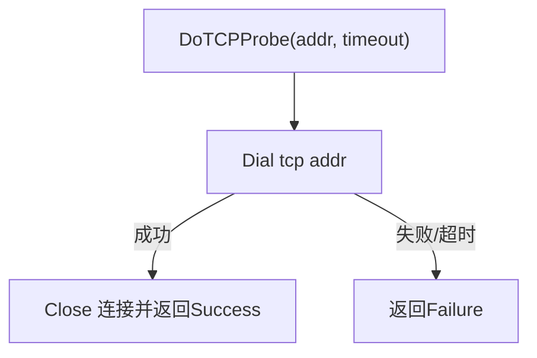
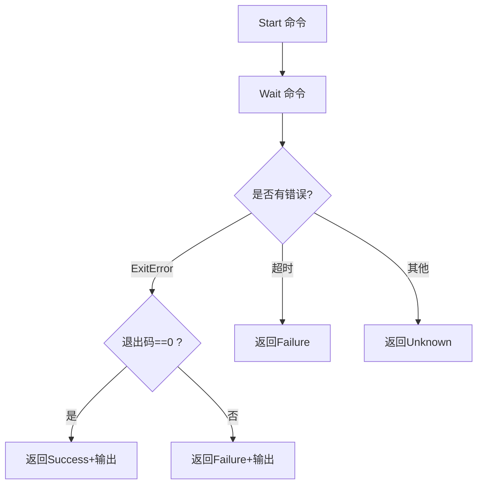
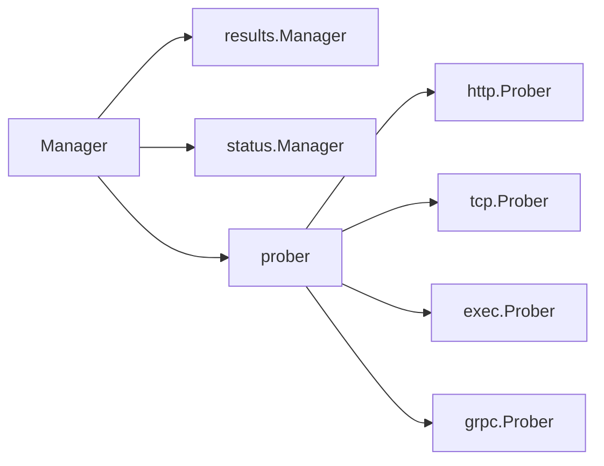

# 探针类型详解

<cite>
**本文引用的文件**   
- [pkg/kubelet/prober/prober_manager.go](file://pkg/kubelet/prober/prober_manager.go)
- [pkg/kubelet/prober/worker.go](file://pkg/kubelet/prober/worker.go)
- [pkg/kubelet/prober/prober.go](file://pkg/kubelet/prober/prober.go)
- [pkg/probe/http/http.go](file://pkg/probe/http/http.go)
- [pkg/probe/tcp/tcp.go](file://pkg/probe/tcp/tcp.go)
- [pkg/probe/exec/exec.go](file://pkg/probe/exec/exec.go)
- [pkg/probe/probe.go](file://pkg/probe/probe.go)
</cite>

## 目录
1. [简介](#简介)
2. [项目结构](#项目结构)
3. [核心组件](#核心组件)
4. [架构总览](#架构总览)
5. [详细组件分析](#详细组件分析)
6. [依赖关系分析](#依赖关系分析)
7. [性能考量](#性能考量)
8. [故障排查指南](#故障排查指南)
9. [结论](#结论)
10. [附录](#附录)

## 简介
本文件面向 Kubernetes 的三种探针类型：LivenessProbe（存活探针）、ReadinessProbe（就绪探针）与 StartupProbe（启动探针），从实现原理、调度与状态管理、执行器细节到最佳实践与排障进行系统化说明。重点覆盖：
- LivenessProbe 失败阈值、超时处理与容器重启机制
- ReadinessProbe 与服务发现联动、流量切换逻辑
- StartupProbe 的设计目的、启动延迟与依赖管理策略
- HTTP/TCP/Exec 三类探针的实现要点（请求构造、SSL/TLS、自定义头部、端口检测、命令执行环境等）
- 配置示例、最佳实践与常见问题定位方法

## 项目结构
Kubernetes 中探针由 Kubelet 在节点侧周期性执行，并通过结果管理器更新 Pod 状态。关键路径如下：
- Manager：为每个容器的每种探针创建 worker，负责生命周期管理与结果缓存
- Worker：按周期触发探测，维护连续成功/失败计数，写入结果管理器
- Prober：根据 Probe 类型分发到具体执行器（HTTP/TCP/Exec/gRPC）
- 执行器：完成具体的网络或命令探测并返回统一结果

图表来源
- [pkg/kubelet/prober/prober_manager.go:120-139](file://pkg/kubelet/prober/prober_manager.go#L120-L139)
- [pkg/kubelet/prober/worker.go:97-155](file://pkg/kubelet/prober/worker.go#L97-L155)
- [pkg/kubelet/prober/prober.go:56-69](file://pkg/kubelet/prober/prober.go#L56-L69)

章节来源
- [pkg/kubelet/prober/prober_manager.go:120-139](file://pkg/kubelet/prober/prober_manager.go#L120-L139)
- [pkg/kubelet/prober/worker.go:97-155](file://pkg/kubelet/prober/worker.go#L97-L155)
- [pkg/kubelet/prober/prober.go:56-69](file://pkg/kubelet/prober/prober.go#L56-L69)

## 核心组件
- 结果类型：Success/Warning/Failure/Unknown，用于统一表达探测结果
- Manager：为每个容器每种探针创建 worker；提供 UpdatePodStatus 将就绪状态写回 PodStatus
- Worker：周期性执行探测，维护 lastResult/resultRun，依据 FailureThreshold/SuccessThreshold 决定状态变更
- Prober：根据 Probe 定义选择 exec/http/tcp/grpc 执行器
- 执行器：
  - HTTP：构建请求、设置 TLS、限制响应体长度、处理重定向与状态码
  - TCP：建立 TCP 连接并关闭，超时即失败
  - Exec：在容器内执行命令，基于退出码判定成功/失败，捕获输出

章节来源
- [pkg/probe/probe.go:19-31](file://pkg/probe/probe.go#L19-L31)
- [pkg/kubelet/prober/prober_manager.go:71-94](file://pkg/kubelet/prober/prober_manager.go#L71-94)
- [pkg/kubelet/prober/worker.go:157-202](file://pkg/kubelet/prober/worker.go#L157-L202)
- [pkg/kubelet/prober/prober.go:82-134](file://pkg/kubelet/prober/prober.go#L82-L134)
- [pkg/probe/http/http.go:37-82](file://pkg/probe/http/http.go#L37-L82)
- [pkg/probe/tcp/tcp.go:29-63](file://pkg/probe/tcp/tcp.go#L29-L63)
- [pkg/probe/exec/exec.go:35-79](file://pkg/probe/exec/exec.go#L35-L79)

## 架构总览
下图展示一次完整探测流程：Manager 创建 Worker，Worker 定时调用 Prober，Prober 分派至具体执行器，最终通过结果管理器更新状态，进而影响服务发现。

图表来源
- [pkg/kubelet/prober/prober_manager.go:332-375](file://pkg/kubelet/prober/prober_manager.go#L332-L375)
- [pkg/kubelet/prober/worker.go:213-394](file://pkg/kubelet/prober/worker.go#L213-L394)
- [pkg/kubelet/prober/prober.go:151-203](file://pkg/kubelet/prober/prober.go#L151-L203)

## 详细组件分析

### LivenessProbe（存活探针）
- 设计目标：检测进程是否“健康”，失败达到阈值后触发容器重启，保障自愈能力
- 关键行为
  - 初始值：默认 Success（首次未探测时不视为失败）
  - 阈值控制：连续失败次数达到 FailureThreshold 才标记失败；成功后重置计数
  - 重启时机：当结果为 Failure 且达到阈值，会将该容器置为需要重启；随后暂停探测直到新容器出现，避免在停止过程中执行探测导致状态损坏
  - 优雅终止：Pod 进入删除阶段时，Liveness/Startup 会提前置为 Success 并停止探测，确保静默退出
- 超时与重试
  - 单次探测超时由 TimeoutSeconds 控制
  - 内部有限次重试（固定上限），任一成功即认为本次探测成功
- 与状态的关系
  - 仅影响容器生命周期（重启），不影响 Ready 状态

图表来源
- [pkg/kubelet/prober/worker.go:355-394](file://pkg/kubelet/prober/worker.go#L355-L394)
- [pkg/kubelet/prober/prober.go:136-149](file://pkg/kubelet/prober/prober.go#L136-L149)

章节来源
- [pkg/kubelet/prober/worker.go:117-125](file://pkg/kubelet/prober/worker.go#L117-L125)
- [pkg/kubelet/prober/worker.go:316-328](file://pkg/kubelet/prober/worker.go#L316-L328)
- [pkg/kubelet/prober/worker.go:373-391](file://pkg/kubelet/prober/worker.go#L373-L391)
- [pkg/kubelet/prober/prober.go:136-149](file://pkg/kubelet/prober/prober.go#L136-L149)

### ReadinessProbe（就绪探针）
- 设计目标：声明容器是否“准备好接收流量”，失败则从 Service/Endpoint 摘除
- 关键行为
  - 初始值：默认 Failure（未探测前视为未就绪）
  - 阈值控制：连续成功次数达到 SuccessThreshold 才置为 Ready；连续失败达到 FailureThreshold 则取消 Ready
  - 立即触发：当需要更新 Ready 状态时，可手动触发一次探测以尽快收敛
  - 与启动顺序：若存在 StartupProbe，则在容器 Started 之前不会执行其他探针
- 与服务发现的联动
  - Manager 在 UpdatePodStatus 中根据 Readiness 结果计算 Container.Ready
  - Ready 变化会被上层控制器传播到 EndpointSlice/Endpoints，从而驱动负载均衡流量切换

图表来源
- [pkg/kubelet/prober/prober_manager.go:332-375](file://pkg/kubelet/prober/prober_manager.go#L332-L375)
- [pkg/kubelet/prober/worker.go:112-116](file://pkg/kubelet/prober/worker.go#L112-L116)

章节来源
- [pkg/kubelet/prober/prober_manager.go:332-375](file://pkg/kubelet/prober/prober_manager.go#L332-L375)
- [pkg/kubelet/prober/worker.go:112-116](file://pkg/kubelet/prober/worker.go#L112-L116)

### StartupProbe（启动探针）
- 设计目的：允许慢启动应用先通过 StartupProbe 完成初始化，再启用 Liveness/Readiness，避免误杀
- 关键行为
  - 初始值：Unknown（尚未探测）
  - 启动期：在容器 Started 之前，仅执行 StartupProbe；一旦 Started，停止继续执行（但保留以便后续重启场景）
  - 重启保护：若 kubelet 重启且容器已早于宽限期启动，针对可重启 Init 容器（sidecar）会预置 Startup 结果为 Success，保证初始化流程不被阻塞
  - 失败处理：达到阈值后将暂停探测直至新容器出现，避免重复执行
- 配置策略建议
  - 对冷启动较慢的服务，优先使用 StartupProbe 替代过大的 InitialDelaySeconds
  - 合理设置 PeriodSeconds/FailureThreshold/SuccessThreshold，使最大启动时间 = (FailureThreshold + 1) × PeriodSeconds + InitialDelaySeconds

图表来源
- [pkg/kubelet/prober/worker.go:121-125](file://pkg/kubelet/prober/worker.go#L121-L125)
- [pkg/kubelet/prober/worker.go:335-346](file://pkg/kubelet/prober/worker.go#L335-L346)
- [pkg/kubelet/prober/worker.go:273-277](file://pkg/kubelet/prober/worker.go#L273-L277)

章节来源
- [pkg/kubelet/prober/worker.go:121-125](file://pkg/kubelet/prober/worker.go#L121-L125)
- [pkg/kubelet/prober/worker.go:335-346](file://pkg/kubelet/prober/worker.go#L335-L346)
- [pkg/kubelet/prober/worker.go:273-277](file://pkg/kubelet/prober/worker.go#L273-L277)

### HTTP 探针实现要点
- 请求构造
  - 由上层根据 HTTPGetAction、容器环境变量与 PodIP 构造请求
  - 支持自定义 HTTP 头部
- SSL/TLS
  - 默认跳过证书校验（InsecureSkipVerify），适用于集群内自签名证书场景
  - 可通过 TLS 配置扩展
- 重定向与响应体
  - 默认不跟随跨主机重定向，否则返回 Warning
  - 响应体最多读取固定长度，超出部分截断但不致命
- 状态码判定
  - 2xx 视为成功；非 2xx 视为失败；重定向返回 Warning

图表来源
- [pkg/probe/http/http.go:37-82](file://pkg/probe/http/http.go#L37-L82)
- [pkg/probe/http/http.go:89-141](file://pkg/probe/http/http.go#L89-L141)

章节来源
- [pkg/kubelet/prober/prober.go:160-175](file://pkg/kubelet/prober/prober.go#L160-L175)
- [pkg/probe/http/http.go:37-82](file://pkg/probe/http/http.go#L37-L82)
- [pkg/probe/http/http.go:89-141](file://pkg/probe/http/http.go#L89-L141)

### TCP 探针实现要点
- 连接建立：尝试与指定 host:port 建立 TCP 连接
- 端口检测：连接成功即成功；失败或超时即失败
- 适用场景：无 HTTP 服务的二进制服务快速可达性检查

图表来源
- [pkg/probe/tcp/tcp.go:46-63](file://pkg/probe/tcp/tcp.go#L46-L63)

章节来源
- [pkg/kubelet/prober/prober.go:177-188](file://pkg/kubelet/prober/prober.go#L177-L188)
- [pkg/probe/tcp/tcp.go:46-63](file://pkg/probe/tcp/tcp.go#L46-L63)

### Exec 探针实现要点
- 执行环境：在容器内执行命令，合并 stdout/stderr 输出
- 权限控制：遵循容器安全上下文（SecurityContext）与用户身份
- 输出解析：输出被限制长度；退出码 0 视为成功，非 0 视为失败；超时错误视为失败；其他错误返回 Unknown
- 注意：Exec 探针无法访问 Pod 环境变量与 Downward API（由执行层决定）

图表来源
- [pkg/probe/exec/exec.go:50-79](file://pkg/probe/exec/exec.go#L50-L79)

章节来源
- [pkg/kubelet/prober/prober.go:155-158](file://pkg/kubelet/prober/prober.go#L155-L158)
- [pkg/probe/exec/exec.go:50-79](file://pkg/probe/exec/exec.go#L50-L79)

## 依赖关系分析
- 模块耦合
  - Manager 依赖 statusManager 获取 Pod 与容器信息，依赖 results.Manager 缓存探针结果
  - Worker 依赖 Manager 提供的 prober 执行探测，并依赖 results.Manager 持久化结果
  - Prober 组合多个执行器（HTTP/TCP/Exec/gRPC），屏蔽差异
- 外部依赖
  - 容器运行时（CRI）：用于在容器内执行命令与获取容器ID
  - 服务发现：Readiness 状态变化影响 EndpointSlice/Endpoints，从而影响流量路由

图表来源
- [pkg/kubelet/prober/prober_manager.go:120-139](file://pkg/kubelet/prober/prober_manager.go#L120-L139)
- [pkg/kubelet/prober/prober.go:56-69](file://pkg/kubelet/prober/prober.go#L56-L69)

章节来源
- [pkg/kubelet/prober/prober_manager.go:120-139](file://pkg/kubelet/prober/prober_manager.go#L120-L139)
- [pkg/kubelet/prober/prober.go:56-69](file://pkg/kubelet/prober/prober.go#L56-L69)

## 性能考量
- 探测频率与开销
  - PeriodSeconds 越小，CPU/网络开销越大；应结合业务特性权衡
  - 对于高 QPS 服务，建议使用轻量级 HTTP 端点或 TCP 探针
- 超时与重试
  - TimeoutSeconds 需小于 PeriodSeconds，避免堆积
  - 内部有限次重试可减少瞬时抖动带来的误判
- 指标观测
  - 暴露了探针总数与耗时直方图指标，可用于监控与告警

[本节为通用指导，无需源码引用]

## 故障排查指南
- 常见症状与定位
  - 容器频繁重启：检查 LivenessProbe 的 FailureThreshold/TimeoutSeconds 是否过小；确认应用启动时间与依赖可用性
  - 服务不可达但容器未重启：检查 ReadinessProbe 是否正确返回 2xx；确认服务发现链路（EndpointSlice/Endpoints）是否同步
  - 启动阶段被误杀：引入 StartupProbe 并合理设置阈值；避免仅用大 InitialDelaySeconds
  - HTTP 探针警告：关注重定向行为与 TLS 配置；必要时调整 followNonLocalRedirects 或使用 HTTPS 自签证书
  - TCP 探针失败：确认端口监听与防火墙/NAT 规则；验证 Host/Port 解析
  - Exec 探针失败：检查命令是否存在、权限是否足够、退出码是否为 0；查看输出日志
- 观察手段
  - 查看事件与日志：探针错误会记录事件与日志
  - 使用指标：探针总数与耗时指标辅助判断抖动与瓶颈
  - 手动触发：Manager 可在需要时触发一次即时探测以加速收敛

章节来源
- [pkg/kubelet/prober/prober.go:104-133](file://pkg/kubelet/prober/prober.go#L104-L133)
- [pkg/kubelet/prober/worker.go:355-394](file://pkg/kubelet/prober/worker.go#L355-L394)
- [pkg/kubelet/prober/prober_manager.go:332-375](file://pkg/kubelet/prober/prober_manager.go#L332-L375)

## 结论
- LivenessProbe 保障进程健康与自愈，ReadinessProbe 控制流量接入，StartupProbe 解耦慢启动与健壮性
- 正确配置阈值与超时是稳定性的关键；结合指标与日志可有效定位问题
- 针对不同服务形态选择合适的探针类型与实现方式，兼顾性能与可靠性

[本节为总结性内容，无需源码引用]

## 附录
- 配置示例（概念性说明）
  - LivenessProbe（HTTP）：定义 /healthz 端点，设置合理的 PeriodSeconds、TimeoutSeconds、FailureThreshold、SuccessThreshold
  - ReadinessProbe（TCP）：对业务端口进行连通性检查，适合无 HTTP 服务
  - StartupProbe（HTTP）：对启动较慢的应用设置较长的最大启动时间窗口，成功后不再持续探测
- 最佳实践
  - 优先使用 StartupProbe 替代超大 InitialDelaySeconds
  - 将 Liveness 与 Readiness 端点分离，分别反映“进程健康”和“业务就绪”
  - 对 HTTP 探针使用最小化的响应体与轻量逻辑，降低探测开销
  - 谨慎使用 Exec 探针，避免复杂脚本与外部依赖
- 参考实现位置
  - 探针结果类型定义：[pkg/probe/probe.go:19-31](file://pkg/probe/probe.go#L19-L31)
  - 探针执行入口与分发：[pkg/kubelet/prober/prober.go:151-203](file://pkg/kubelet/prober/prober.go#L151-L203)
  - 探针调度与状态更新：[pkg/kubelet/prober/prober_manager.go:332-375](file://pkg/kubelet/prober/prober_manager.go#L332-L375)
  - 执行器实现：
    - HTTP：[pkg/probe/http/http.go:37-141](file://pkg/probe/http/http.go#L37-L141)
    - TCP：[pkg/probe/tcp/tcp.go:29-63](file://pkg/probe/tcp/tcp.go#L29-L63)
    - Exec：[pkg/probe/exec/exec.go:35-79](file://pkg/probe/exec/exec.go#L35-L79)