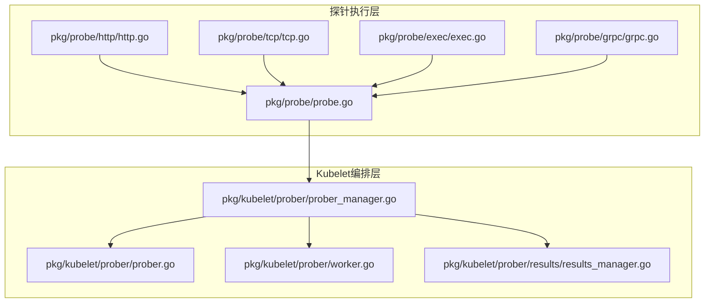
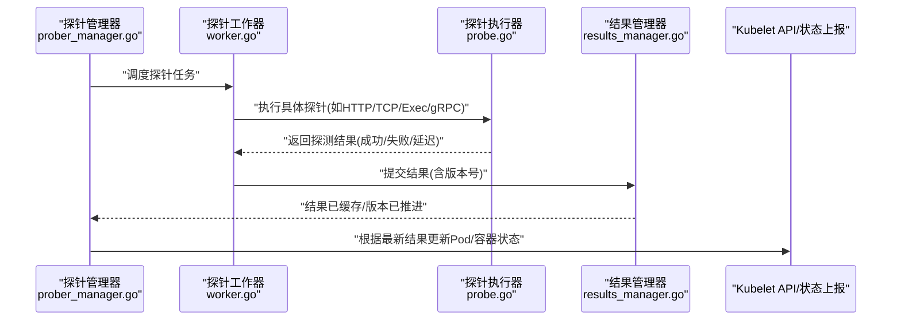
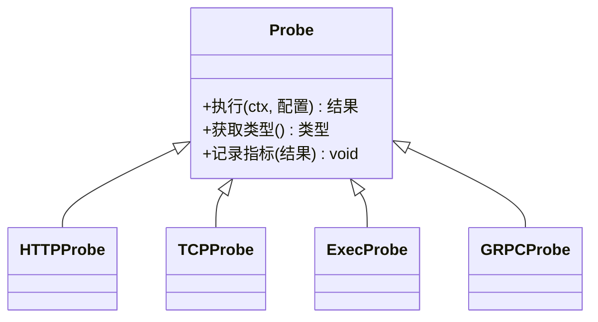
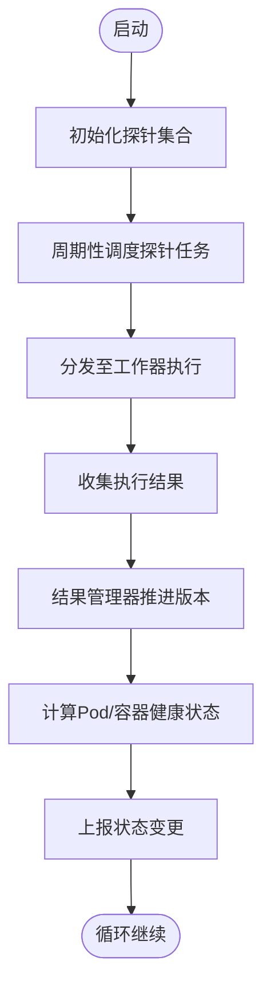
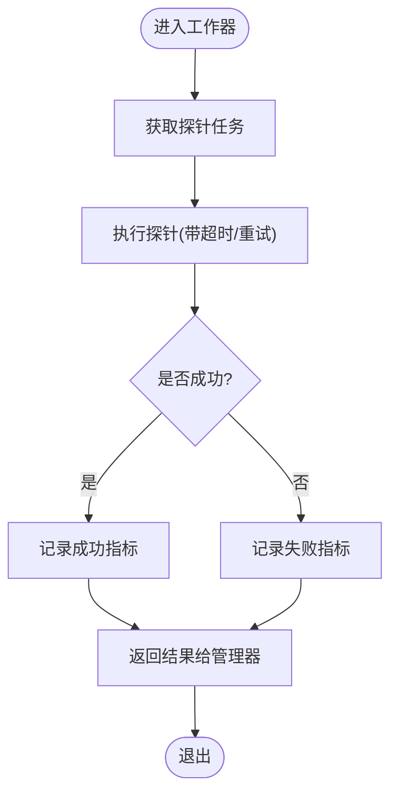
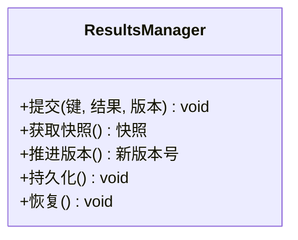
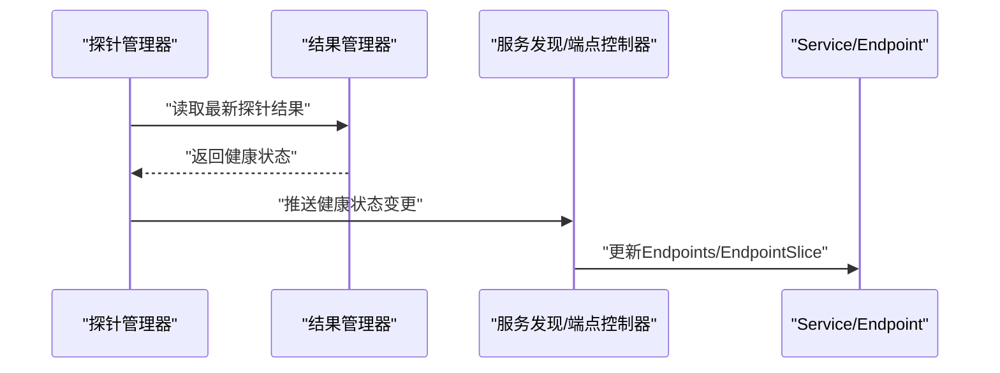
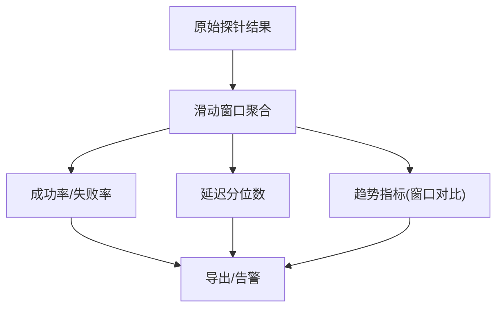
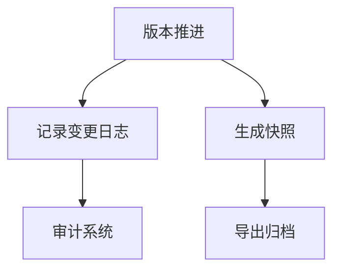
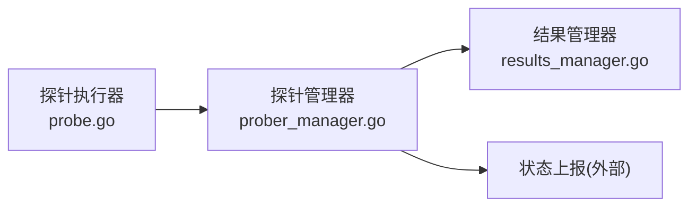

# 探针结果管理

<cite>
**本文引用的文件**   
- [prober.go](file://pkg/kubelet/prober/prober.go)
- [prober_manager.go](file://pkg/kubelet/prober/prober_manager.go)
- [worker.go](file://pkg/kubelet/prober/worker.go)
- [results_manager.go](file://pkg/kubelet/prober/results/results_manager.go)
- [probe.go](file://pkg/probe/probe.go)
- [http.go](file://pkg/probe/http/http.go)
- [tcp.go](file://pkg/probe/tcp/tcp.go)
- [exec.go](file://pkg/probe/exec/exec.go)
- [grpc.go](file://pkg/probe/grpc/grpc.go)
</cite>

## 目录
1. [简介](#简介)
2. [项目结构](#项目结构)
3. [核心组件](#核心组件)
4. [架构总览](#架构总览)
5. [详细组件分析](#详细组件分析)
6. [依赖关系分析](#依赖关系分析)
7. [性能考量](#性能考量)
8. [故障排查指南](#故障排查指南)
9. [结论](#结论)
10. [附录](#附录)

## 简介
本技术文档聚焦于Kubelet中的“探针结果管理”子系统，围绕以下目标展开：
- 解释探针结果的存储结构，包括结果缓存、版本控制与数据持久化机制。
- 说明探针状态从执行到Pod状态更新的完整传播链路。
- 文档化探针结果与服务发现的集成（Endpoint更新与服务健康同步）。
- 解释探针结果的聚合与统计能力（成功率、延迟监控、趋势分析）。
- 说明历史记录与审计（变更追踪与事件日志）相关实现。
- 提供探针结果管理的API接口与使用示例。
- 给出问题排查方法与性能优化建议。

## 项目结构
Kubelet探针结果管理主要分布在两个层次：
- 探针执行层：位于 pkg/probe，包含HTTP/TCP/Exec/gRPC等具体探针类型实现。
- Kubelet编排层：位于 pkg/kubelet/prober，负责调度、执行、结果管理与状态传播。

图表来源
- [prober_manager.go](file://pkg/kubelet/prober/prober_manager.go)
- [prober.go](file://pkg/kubelet/prober/prober.go)
- [worker.go](file://pkg/kubelet/prober/worker.go)
- [results_manager.go](file://pkg/kubelet/prober/results/results_manager.go)
- [probe.go](file://pkg/probe/probe.go)
- [http.go](file://pkg/probe/http/http.go)
- [tcp.go](file://pkg/probe/tcp/tcp.go)
- [exec.go](file://pkg/probe/exec/exec.go)
- [grpc.go](file://pkg/probe/grpc/grpc.go)

章节来源
- [prober_manager.go](file://pkg/kubelet/prober/prober_manager.go)
- [prober.go](file://pkg/kubelet/prober/prober.go)
- [worker.go](file://pkg/kubelet/prober/worker.go)
- [results_manager.go](file://pkg/kubelet/prober/results/results_manager.go)
- [probe.go](file://pkg/probe/probe.go)
- [http.go](file://pkg/probe/http/http.go)
- [tcp.go](file://pkg/probe/tcp/tcp.go)
- [exec.go](file://pkg/probe/exec/exec.go)
- [grpc.go](file://pkg/probe/grpc/grpc.go)

## 核心组件
- 探针管理器（ProberManager）：协调探针生命周期，维护探针实例集合，触发执行并处理结果。
- 探针工作器（Worker）：按策略并发执行探针任务，封装超时、重试与错误处理。
- 探针结果管理器（ResultsManager）：维护探针结果缓存、版本控制与增量更新，向外部暴露当前一致视图。
- 探针执行器（Probe）：定义统一探针接口与通用逻辑，HTTP/TCP/Exec/gRPC为具体实现。

职责边界
- 执行层（pkg/probe/*）：关注单次探测的IO语义与协议细节。
- 编排层（pkg/kubelet/prober/*）：关注调度、并发、结果聚合、版本与对外一致性。

章节来源
- [prober_manager.go](file://pkg/kubelet/prober/prober_manager.go)
- [worker.go](file://pkg/kubelet/prober/worker.go)
- [results_manager.go](file://pkg/kubelet/prober/results/results_manager.go)
- [probe.go](file://pkg/probe/probe.go)
- [http.go](file://pkg/probe/http/http.go)
- [tcp.go](file://pkg/probe/tcp/tcp.go)
- [exec.go](file://pkg/probe/exec/exec.go)
- [grpc.go](file://pkg/probe/grpc/grpc.go)

## 架构总览
下图展示了从探针执行到结果落盘与状态传播的整体流程。

图表来源
- [prober_manager.go](file://pkg/kubelet/prober/prober_manager.go)
- [worker.go](file://pkg/kubelet/prober/worker.go)
- [probe.go](file://pkg/probe/probe.go)
- [results_manager.go](file://pkg/kubelet/prober/results/results_manager.go)

## 详细组件分析

### 探针执行器（Probe）
- 统一接口：定义探针执行的输入参数、上下文与返回结果模型。
- 通用逻辑：包含超时控制、重试策略、指标采集入口等。
- 具体实现：
  - HTTP探针：基于HTTP请求与响应码判定健康。
  - TCP探针：基于TCP连接建立判定健康。
  - Exec探针：在容器内执行命令，依据退出码判定健康。
  - gRPC探针：基于gRPC健康检查协议判定健康。

图表来源
- [probe.go](file://pkg/probe/probe.go)
- [http.go](file://pkg/probe/http/http.go)
- [tcp.go](file://pkg/probe/tcp/tcp.go)
- [exec.go](file://pkg/probe/exec/exec.go)
- [grpc.go](file://pkg/probe/grpc/grpc.go)

章节来源
- [probe.go](file://pkg/probe/probe.go)
- [http.go](file://pkg/probe/http/http.go)
- [tcp.go](file://pkg/probe/tcp/tcp.go)
- [exec.go](file://pkg/probe/exec/exec.go)
- [grpc.go](file://pkg/probe/grpc/grpc.go)

### 探针管理器（ProberManager）
- 职责：
  - 维护探针实例集合与生命周期。
  - 将探针任务分发给工作器执行。
  - 接收工作器返回的结果，驱动结果管理器进行版本推进。
  - 根据最新结果计算Pod/容器状态变化并上报。
- 关键交互：
  - 与工作器协作，控制并发度与背压。
  - 与结果管理器协作，确保对外可见的一致视图。
  - 与Kubelet状态上报模块对接，推动Pod条件更新。

图表来源
- [prober_manager.go](file://pkg/kubelet/prober/prober_manager.go)
- [worker.go](file://pkg/kubelet/prober/worker.go)
- [results_manager.go](file://pkg/kubelet/prober/results/results_manager.go)

章节来源
- [prober_manager.go](file://pkg/kubelet/prober/prober_manager.go)
- [worker.go](file://pkg/kubelet/prober/worker.go)
- [results_manager.go](file://pkg/kubelet/prober/results/results_manager.go)

### 探针工作器（Worker）
- 并发模型：按配置的并发度并行执行探针任务，避免阻塞主循环。
- 容错与重试：对瞬时错误进行退避重试，区分可恢复与不可恢复错误。
- 指标采集：记录每次探针的耗时、成功/失败计数，便于后续聚合。

图表来源
- [worker.go](file://pkg/kubelet/prober/worker.go)

章节来源
- [worker.go](file://pkg/kubelet/prober/worker.go)

### 探针结果管理器（ResultsManager）
- 结果缓存：以键值形式缓存每个探针的最新结果，保证读取一致性。
- 版本控制：为每次结果推进递增版本号，支持快照与增量对比。
- 持久化：将结果序列化为本地文件（或内存+磁盘双写），用于重启恢复与审计。
- 对外视图：提供只读快照接口，供上层查询与导出。

图表来源
- [results_manager.go](file://pkg/kubelet/prober/results/results_manager.go)

章节来源
- [results_manager.go](file://pkg/kubelet/prober/results/results_manager.go)

### 探针结果与服务发现集成
- Endpoint更新：当探针结果影响服务健康时，通过Kubelet内部接口通知控制器/代理，进而更新Service的Endpoints或EndpointSlice。
- 健康同步：结合就绪探针（Readiness）与存活探针（Liveness）结果，决定Pod是否加入/移出服务流量。

图表来源
- [prober_manager.go](file://pkg/kubelet/prober/prober_manager.go)
- [results_manager.go](file://pkg/kubelet/prober/results/results_manager.go)

章节来源
- [prober_manager.go](file://pkg/kubelet/prober/prober_manager.go)
- [results_manager.go](file://pkg/kubelet/prober/results/results_manager.go)

### 探针结果的聚合与统计
- 成功率：基于历史窗口内的成功/失败次数计算。
- 延迟监控：记录每次探针的耗时分布（均值、P95/P99）。
- 趋势分析：按时间窗口滚动聚合，输出趋势指标，便于告警与容量规划。

[此图为概念性流程图，不直接映射具体源码文件]

### 历史记录与审计
- 变更追踪：每次版本推进记录变更摘要（新增/删除/修改），便于回溯。
- 事件日志：将关键状态变更写入事件流，供审计与排障。
- 快照导出：提供快照导出接口，用于离线分析与合规审计。

[此图为概念性流程图，不直接映射具体源码文件]

### API接口与使用示例
- 查询接口：
  - 获取某探针的最新结果与版本。
  - 获取指定时间窗口的聚合指标。
- 管理接口：
  - 触发一次强制探测。
  - 导出当前快照。
- 使用示例（描述性）：
  - 调用查询接口获取探针结果后，判断是否达到阈值，决定是否触发扩容或告警。
  - 定期导出快照，结合外部监控系统进行长期趋势分析。

[本节为概念性说明，不直接引用具体源码文件]

## 依赖关系分析
- 探针执行层与编排层解耦：执行层仅关注协议与IO；编排层关注调度、并发与一致性。
- 结果管理器作为唯一事实源：所有对外读取均通过其快照接口，避免竞态。
- 与Kubelet状态上报的耦合：探针结果直接影响Pod条件与容器状态，需保证幂等与顺序。

图表来源
- [probe.go](file://pkg/probe/probe.go)
- [prober_manager.go](file://pkg/kubelet/prober/prober_manager.go)
- [results_manager.go](file://pkg/kubelet/prober/results/results_manager.go)

章节来源
- [probe.go](file://pkg/probe/probe.go)
- [prober_manager.go](file://pkg/kubelet/prober/prober_manager.go)
- [results_manager.go](file://pkg/kubelet/prober/results/results_manager.go)

## 性能考量
- 并发度调优：根据节点CPU核数与探针IO特性调整工作器并发度，避免过度竞争。
- 超时与重试：合理设置探针超时与最大重试次数，降低长尾延迟对整体吞吐的影响。
- 结果缓存与快照：减少频繁序列化开销，采用增量更新与懒加载快照。
- 指标采样：对高频探针结果进行采样聚合，避免指标风暴。
- I/O路径优化：持久化采用批量写入与异步落盘，降低对主循环的影响。

[本节为通用性能指导，不直接分析具体源码文件]

## 故障排查指南
- 现象：探针频繁抖动
  - 排查要点：检查超时与重试配置、网络抖动、后端服务稳定性。
  - 定位方法：查看最近版本推进与变更日志，确认是否为瞬时错误导致。
- 现象：结果未生效
  - 排查要点：确认结果管理器版本是否推进、快照是否被正确消费。
  - 定位方法：比对最新版本号与对外快照版本，检查状态上报链路。
- 现象：高延迟或丢包
  - 排查要点：观察延迟分位数指标，定位热点探针与瓶颈资源。
  - 定位方法：导出快照并结合外部监控进行趋势分析。
- 现象：持久化异常
  - 排查要点：检查磁盘空间、权限与I/O错误。
  - 定位方法：查看持久化日志与恢复流程是否成功。

章节来源
- [results_manager.go](file://pkg/kubelet/prober/results/results_manager.go)
- [worker.go](file://pkg/kubelet/prober/worker.go)
- [prober_manager.go](file://pkg/kubelet/prober/prober_manager.go)

## 结论
Kubelet探针结果管理通过清晰的层次划分与严格的版本控制，实现了高可靠的状态传播与对外一致性。配合服务发现与健康同步，能够准确反映Pod可用性；通过聚合与统计能力，为运维与容量规划提供数据支撑。合理的并发与I/O优化，有助于在高负载场景下保持稳定与低延迟。

## 附录
- 术语表：
  - 探针：用于检测服务健康状态的机制，包括HTTP/TCP/Exec/gRPC等。
  - 就绪探针：决定Pod是否接受流量的探针。
  - 存活探针：决定是否需要重启容器的探针。
  - 快照：某一时刻的一致性结果视图。
  - 版本：结果推进的顺序编号，用于增量对比与一致性保障。

[本节为概念性内容，不直接分析具体源码文件]