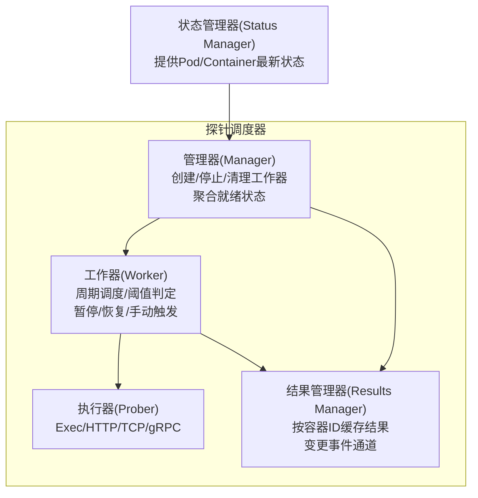
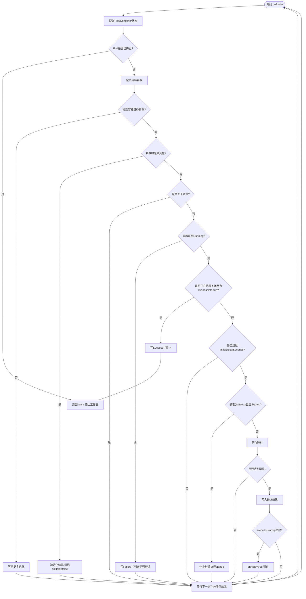
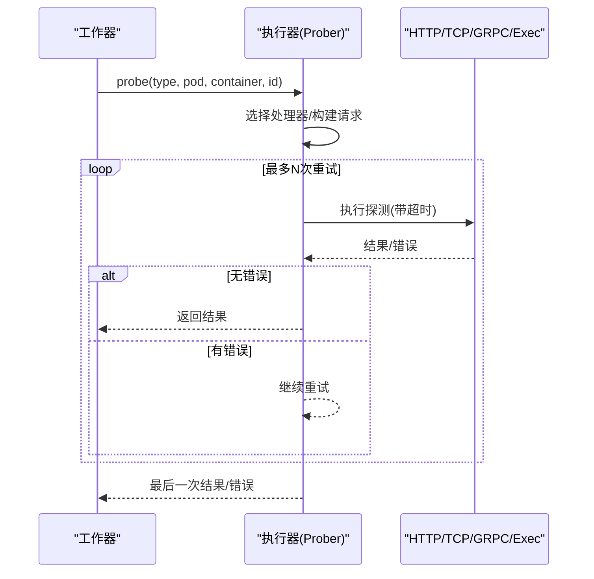
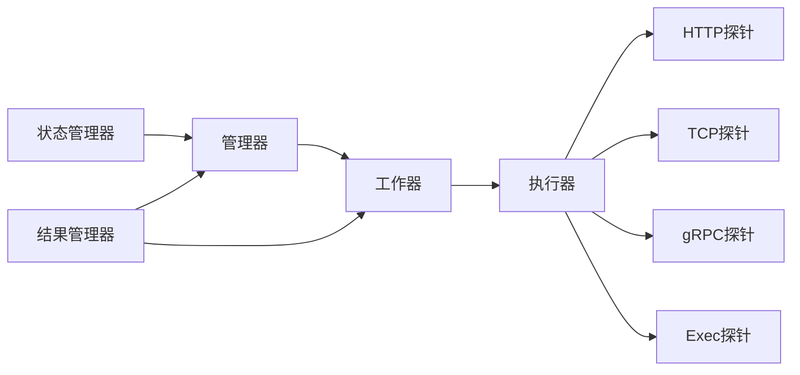

# 探针调度器

<cite>
**本文引用的文件**   
- [prober.go](file://pkg/kubelet/prober/prober.go)
- [prober_manager.go](file://pkg/kubelet/prober/prober_manager.go)
- [worker.go](file://pkg/kubelet/prober/worker.go)
- [results_manager.go](file://pkg/kubelet/prober/results/results_manager.go)
</cite>

## 目录
1. [简介](#简介)
2. [项目结构](#项目结构)
3. [核心组件](#核心组件)
4. [架构总览](#架构总览)
5. [详细组件分析](#详细组件分析)
6. [依赖关系分析](#依赖关系分析)
7. [性能考量](#性能考量)
8. [故障排查指南](#故障排查指南)
9. [结论](#结论)
10. [附录](#附录)

## 简介
本文件面向Kubelet中的“探针调度器”，系统性阐述其架构设计、主调度循环与工作队列管理、并发控制机制；深入解析探针执行调度算法（间隔调整、重试策略、阈值与优先级）；文档化探针实例生命周期（创建、状态跟踪、资源清理）；总结性能优化策略（批量处理、资源限制、内存管理）；说明错误处理机制（网络异常、超时、降级）；并提供配置参数详解、调优建议以及诊断方法与监控指标解读。

## 项目结构
探针调度器位于Kubelet的prober子系统中，围绕“管理器-工作器-执行器-结果缓存”四层组织：
- 管理器（Manager）：负责为每个容器的每种探针类型创建并维护一个工作器，协调Pod状态更新与清理。
- 工作器（Worker）：每个容器每种探针类型一个，周期性触发探测，维护连续成功/失败计数与阈值判定，管理暂停与恢复。
- 执行器（Prober）：封装具体探针实现（Exec/HTTP/TCP/gRPC），统一入口执行并返回结果。
- 结果管理器（Results Manager）：按容器ID缓存探针结果，并通过通道推送变更事件。



图示来源
- [prober_manager.go:96-139](file://pkg/kubelet/prober/prober_manager.go#L96-L139)
- [worker.go:39-155](file://pkg/kubelet/prober/worker.go#L39-L155)
- [prober.go:44-69](file://pkg/kubelet/prober/prober.go#L44-L69)
- [results_manager.go:86-104](file://pkg/kubelet/prober/results/results_manager.go#L86-L104)

章节来源
- [prober_manager.go:96-139](file://pkg/kubelet/prober/prober_manager.go#L96-L139)
- [worker.go:39-155](file://pkg/kubelet/prober/worker.go#L39-L155)
- [prober.go:44-69](file://pkg/kubelet/prober/prober.go#L44-L69)
- [results_manager.go:86-104](file://pkg/kubelet/prober/results/results_manager.go#L86-L104)

## 核心组件
- 管理器（Manager）
  - 职责：为Pod中每个容器的每种探针类型（启动/就绪/存活）创建工作器；在Pod删除或不再需要时清理工作器；根据结果管理器缓存计算容器/Pod就绪状态。
  - 并发：使用读写锁保护工作器映射；StopLivenessAndStartup/Remove/CleanupPods等接口保证安全停止。
  - 关键方法：AddPod、StopLivenessAndStartup、RemovePod、CleanupPods、UpdatePodStatus。
- 工作器（Worker）
  - 职责：基于PeriodSeconds定时轮询；支持InitialDelaySeconds延迟；维护resultRun计数以匹配SuccessThreshold/FailureThreshold；在liveness/startup失败后进入onHold暂停，等待新容器ID再恢复；支持手动触发立即执行。
  - 并发：stopCh用于优雅退出；manualTriggerCh非阻塞触发；panic防护确保不中断调度循环。
  - 关键流程：run -> doProbe -> 调用执行器 -> 统计与阈值判定 -> 写入结果管理器。
- 执行器（Prober）
  - 职责：统一入口，根据探针类型选择具体实现（Exec/HTTP/TCP/gRPC），设置超时、构造请求、执行并返回结果；对错误与警告进行事件记录。
  - 重试：内部有限次重试（默认3次），避免瞬时抖动导致误判。
- 结果管理器（Results Manager）
  - 职责：以容器ID为键缓存探针结果；当结果变化时通过Updates通道推送；提供Get/Set/Remove接口。
  - 并发：读写锁保护缓存；带缓冲的更新通道降低背压风险。

章节来源
- [prober_manager.go:96-139](file://pkg/kubelet/prober/prober_manager.go#L96-L139)
- [worker.go:39-155](file://pkg/kubelet/prober/worker.go#L39-L155)
- [prober.go:44-69](file://pkg/kubelet/prober/prober.go#L44-L69)
- [results_manager.go:86-104](file://pkg/kubelet/prober/results/results_manager.go#L86-L104)

## 架构总览
下图展示从Pod新增到探针执行与状态更新的端到端流程。

```mermaid
sequenceDiagram
participant K as "Kubelet"
participant M as "管理器(Manager)"
participant W as "工作器(Worker)"
participant P as "执行器(Prober)"
participant S as "状态管理器(Status Manager)"
participant R as "结果管理器(Results Manager)"
K->>M : AddPod(pod)
M->>W : newWorker() + go run(ctx)
loop 每PeriodSeconds
W->>S : GetPodStatus(podUID)
alt 容器未运行/不存在
W-->>W : 等待/跳过
else 满足InitialDelaySeconds
W->>P : probe(probeType, pod, container, containerID)
P-->>W : Success/Failure/Unknown
W->>R : Set(containerID, result)
W->>W : 更新lastResult/resultRun
alt 达到阈值
W->>R : 覆盖最终结果
alt liveness/startup失败
W->>W : onHold=true(暂停)
end
end
end
select stopCh|ticker|manualTriggerCh
end
K->>M : UpdatePodStatus(pod, podStatus)
M->>R : Get(containerID)
M->>M : 计算Ready/Started
M-->>K : 更新后的PodStatus
```

图示来源
- [prober_manager.go:185-230](file://pkg/kubelet/prober/prober_manager.go#L185-L230)
- [worker.go:157-202](file://pkg/kubelet/prober/worker.go#L157-L202)
- [worker.go:215-394](file://pkg/kubelet/prober/worker.go#L215-L394)
- [prober.go:83-134](file://pkg/kubelet/prober/prober.go#L83-L134)
- [results_manager.go:113-129](file://pkg/kubelet/prober/results/results_manager.go#L113-L129)

## 详细组件分析

### 管理器（Manager）
- 工作器生命周期
  - 创建：AddPod遍历容器与可重启Init容器，为存在Startup/Readiness/Liveness探针的类型分别newWorker并启动goroutine。
  - 停止：StopLivenessAndStartup仅停止存活与启动探针；RemovePod停止所有；CleanupPods按期望集合清理残留。
  - 移除：工作器退出后回调removeWorker从映射中删除。
- Pod状态更新
  - UpdatePodStatus遍历容器与Init容器状态，结合结果管理器缓存与是否存在未执行的探针，计算Started与Ready；必要时通过manualTriggerCh触发一次即时探测。
  - 针对Kubelet重启场景，提供宽限期逻辑以避免刚重启就误判NotReady。

```mermaid
classDiagram
class Manager {
+AddPod(ctx, pod)
+StopLivenessAndStartup(pod)
+RemovePod(pod)
+CleanupPods(desiredPods)
+UpdatePodStatus(ctx, pod, podStatus)
-workers map[probeKey]*worker
-statusManager status.Manager
-readinessManager results.Manager
-livenessManager results.Manager
-startupManager results.Manager
-prober *prober
}
class Worker {
+run(ctx)
+doProbe(ctx) bool
+stop()
-stopCh chan struct{}
-manualTriggerCh chan struct{}
-containerID ContainerID
-lastResult Result
-resultRun int
-onHold bool
}
class Prober {
+probe(ctx, type, pod, status, container, id) (Result, error)
}
class ResultsManager {
+Get(id) (Result, bool)
+Set(id, result, pod)
+Remove(id)
+Updates() <-chan Update
}
Manager --> Worker : "创建/停止/清理"
Manager --> Prober : "委托执行"
Manager --> ResultsManager : "读取/写入"
Worker --> Prober : "调用执行"
Worker --> ResultsManager : "写入结果"
```

图示来源
- [prober_manager.go:96-139](file://pkg/kubelet/prober/prober_manager.go#L96-L139)
- [worker.go:39-155](file://pkg/kubelet/prober/worker.go#L39-L155)
- [prober.go:44-69](file://pkg/kubelet/prober/prober.go#L44-L69)
- [results_manager.go:86-104](file://pkg/kubelet/prober/results/results_manager.go#L86-L104)

章节来源
- [prober_manager.go:185-230](file://pkg/kubelet/prober/prober_manager.go#L185-L230)
- [prober_manager.go:232-273](file://pkg/kubelet/prober/prober_manager.go#L232-L273)
- [prober_manager.go:332-420](file://pkg/kubelet/prober/prober_manager.go#L332-L420)

### 工作器（Worker）与调度算法
- 周期与抖动
  - 基于PeriodSeconds创建Ticker；若Kubelet刚启动，首次探测前随机休眠一段比例时间，缓解启动风暴。
- 初始延迟
  - InitialDelaySeconds内不执行探测，避免应用尚未就绪。
- 阈值与连续计数
  - 维护lastResult与resultRun；当连续失败次数>=FailureThreshold或连续成功次数>=SuccessThreshold时才更新最终结果。
- 暂停与恢复
  - liveness/startup失败后进入onHold暂停，直到容器ID变化（容器重建）才恢复，减少无效探测与潜在竞态。
- 启动阶段优先
  - 若容器未Started，则仅允许startup探针执行；一旦Started，停止继续执行startup探针（但保留以便容器重启后再次生效）。
- 优雅关闭
  - Pod被删除且为liveness/startup时，直接置结果为Success并停止探测，避免拖慢终止流程。
- 手动触发
  - 通过manualTriggerCh非阻塞触发一次立即执行，并重置Ticker计时起点，提升响应性。



图示来源
- [worker.go:157-202](file://pkg/kubelet/prober/worker.go#L157-L202)
- [worker.go:215-394](file://pkg/kubelet/prober/worker.go#L215-L394)

章节来源
- [worker.go:157-202](file://pkg/kubelet/prober/worker.go#L157-L202)
- [worker.go:215-394](file://pkg/kubelet/prober/worker.go#L215-L394)

### 执行器（Prober）与重试策略
- 探针类型分发
  - 根据探针类型选择Exec/HTTP/TCP/gRPC处理器，统一设置超时并执行。
- 重试机制
  - 内部有限次重试（默认3次），在出现错误时丢弃单次结果，避免瞬时抖动影响阈值判定。
- 事件与日志
  - 对错误、失败、警告均记录事件与日志，便于排障。



图示来源
- [prober.go:83-134](file://pkg/kubelet/prober/prober.go#L83-L134)
- [prober.go:138-203](file://pkg/kubelet/prober/prober.go#L138-L203)

章节来源
- [prober.go:83-134](file://pkg/kubelet/prober/prober.go#L83-L134)
- [prober.go:138-203](file://pkg/kubelet/prober/prober.go#L138-L203)

### 结果管理器（Results Manager）
- 缓存与事件
  - 以容器ID为键缓存结果；仅在值发生变化时发送Update事件，避免重复通知。
- 并发与背压
  - 读写锁保护缓存；更新通道带缓冲，降低消费者阻塞风险。
- 集成点
  - 工作器写入结果；管理器读取结果以计算Ready/Started。

章节来源
- [results_manager.go:86-104](file://pkg/kubelet/prober/results/results_manager.go#L86-L104)
- [results_manager.go:106-139](file://pkg/kubelet/prober/results/results_manager.go#L106-L139)

## 依赖关系分析
- 组件耦合
  - 管理器依赖状态管理器获取最新Pod/容器信息；依赖结果管理器读写缓存；委托执行器完成实际探测。
  - 工作器依赖管理器提供的状态与结果管理器，同时持有对执行器的引用。
- 外部依赖
  - 探针实现（HTTP/TCP/GRPC/Exec）作为独立模块注入，保持执行器可扩展。
- 可能的环路与解耦
  - 管理器与工作器之间通过接口通信，避免强耦合；结果管理器独立于执行路径，仅暴露最小API。



图示来源
- [prober_manager.go:96-139](file://pkg/kubelet/prober/prober_manager.go#L96-L139)
- [worker.go:39-155](file://pkg/kubelet/prober/worker.go#L39-L155)
- [prober.go:44-69](file://pkg/kubelet/prober/prober.go#L44-L69)
- [results_manager.go:86-104](file://pkg/kubelet/prober/results/results_manager.go#L86-L104)

章节来源
- [prober_manager.go:96-139](file://pkg/kubelet/prober/prober_manager.go#L96-L139)
- [worker.go:39-155](file://pkg/kubelet/prober/worker.go#L39-L155)
- [prober.go:44-69](file://pkg/kubelet/prober/prober.go#L44-L69)
- [results_manager.go:86-104](file://pkg/kubelet/prober/results/results_manager.go#L86-L104)

## 性能考量
- 启动抖动抑制
  - 首次探测前随机休眠，避免大量探针同时发起导致的瞬时拥塞。
- 阈值与暂停
  - 通过FailureThreshold/SuccessThreshold减少频繁状态翻转；liveness/startup失败后暂停，降低无效探测开销。
- 手动触发与Ticker重置
  - 按需立即执行并重置周期，缩短状态收敛时间。
- 结果缓存与去重
  - 结果管理器仅在值变化时广播，避免下游重复处理。
- 资源与内存
  - 工作器退出时清理自身结果与指标标签，防止泄漏；结果缓存按容器ID键控，空间复杂度与活跃容器数线性相关。
- 并发控制
  - 管理器使用读写锁保护工作器映射；工作器stopCh与manualTriggerCh均为缓冲通道，避免阻塞。

[本节为通用指导，无需特定文件来源]

## 故障排查指南
- 常见问题定位
  - 探针一直失败：检查InitialDelaySeconds是否过长、FailureThreshold是否过小、后端服务端口/路径可达性、超时设置是否合理。
  - 就绪状态抖动：关注SuccessThreshold/FailureThreshold与PeriodSeconds组合，适当放宽阈值或增大周期。
  - 启动风暴：确认Kubelet启动后首次探测的随机延迟是否生效，必要时调整PeriodSeconds。
  - 优雅关闭缓慢：确认liveness/startup在Pod删除时是否正确置Success并停止探测。
- 日志与事件
  - 关注探针错误、失败与警告事件；查看执行器日志中的scheme/host/port/path/timeout等信息。
- 指标观测
  - 探针总数与耗时分布指标可用于评估整体健康度与瓶颈。

章节来源
- [prober.go:104-134](file://pkg/kubelet/prober/prober.go#L104-L134)
- [worker.go:215-394](file://pkg/kubelet/prober/worker.go#L215-L394)

## 结论
Kubelet探针调度器通过“管理器-工作器-执行器-结果缓存”的分层设计，实现了高内聚、低耦合的可扩展探针体系。其调度算法兼顾了稳定性（抖动抑制、阈值与暂停）、响应性（手动触发、Ticker重置）与健壮性（重试、优雅关闭）。配合完善的指标与事件输出，便于在生产环境中进行性能调优与问题诊断。

[本节为总结性内容，无需特定文件来源]

## 附录

### 配置参数与行为对照
- PeriodSeconds：探针执行周期（秒）
- InitialDelaySeconds：容器启动后延迟多久开始探测
- TimeoutSeconds：单次探测超时
- SuccessThreshold：连续成功次数达到阈值才认为成功
- FailureThreshold：连续失败次数达到阈值才认为失败
- 探针类型：Exec/HTTP/TCP/gRPC（由容器Spec定义）
- 重试次数：执行器内部有限次重试（默认3次）

章节来源
- [worker.go:157-202](file://pkg/kubelet/prober/worker.go#L157-L202)
- [worker.go:331-346](file://pkg/kubelet/prober/worker.go#L331-L346)
- [prober.go:138-203](file://pkg/kubelet/prober/prober.go#L138-L203)

### 监控指标说明
- 探针总数（按类型与结果维度）
  - 名称：prober_probe_total
  - 维度：probe_type、result、container、pod、namespace、pod_uid
- 探针耗时（成功/未知）
  - 名称：prober_probe_duration_seconds
  - 维度：probe_type、container、pod、namespace

章节来源
- [prober_manager.go:41-69](file://pkg/kubelet/prober/prober_manager.go#L41-L69)
- [worker.go:127-153](file://pkg/kubelet/prober/worker.go#L127-L153)
- [worker.go:355-364](file://pkg/kubelet/prober/worker.go#L355-L364)