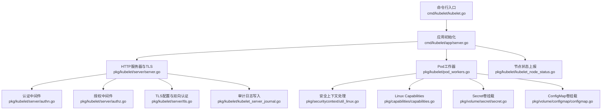
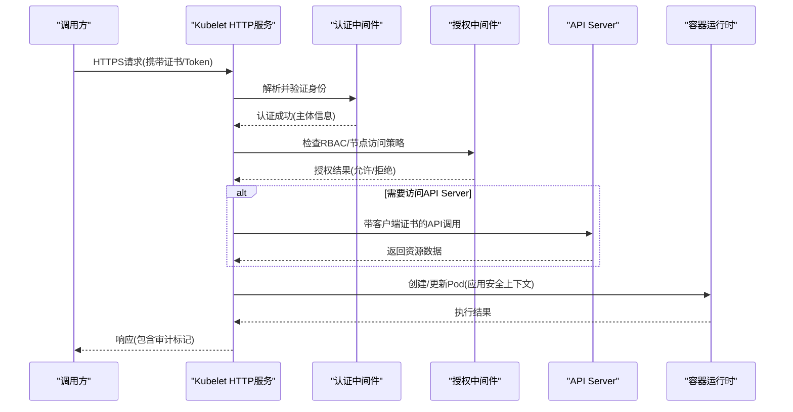
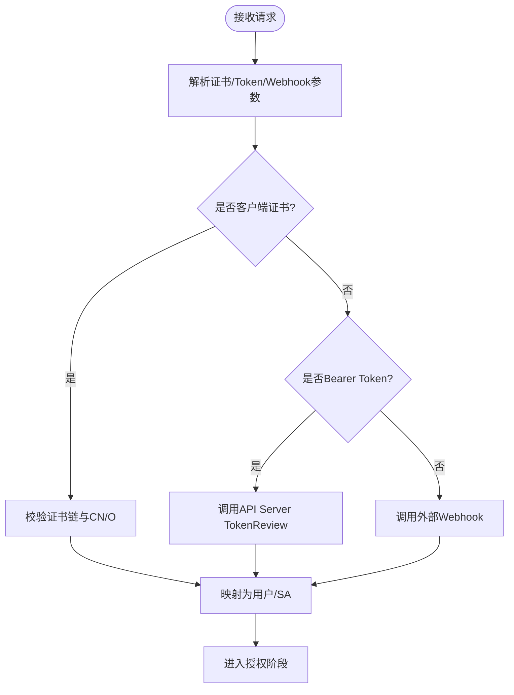
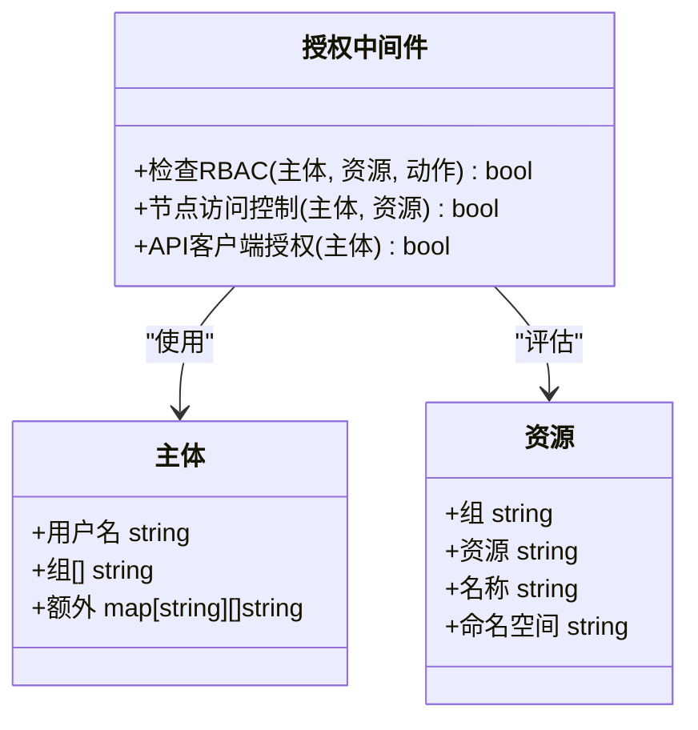
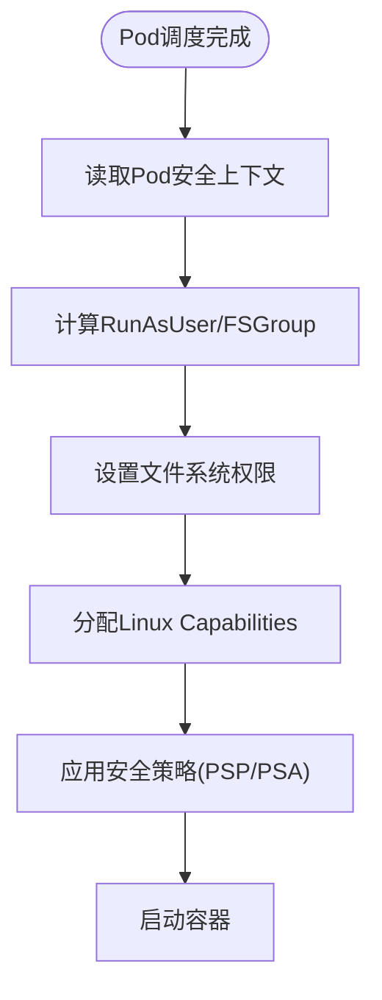
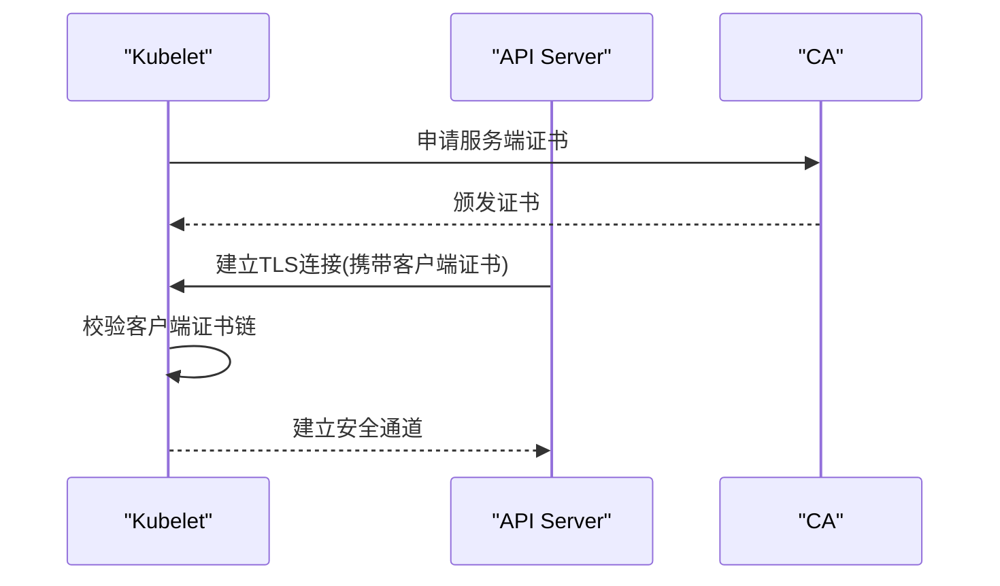
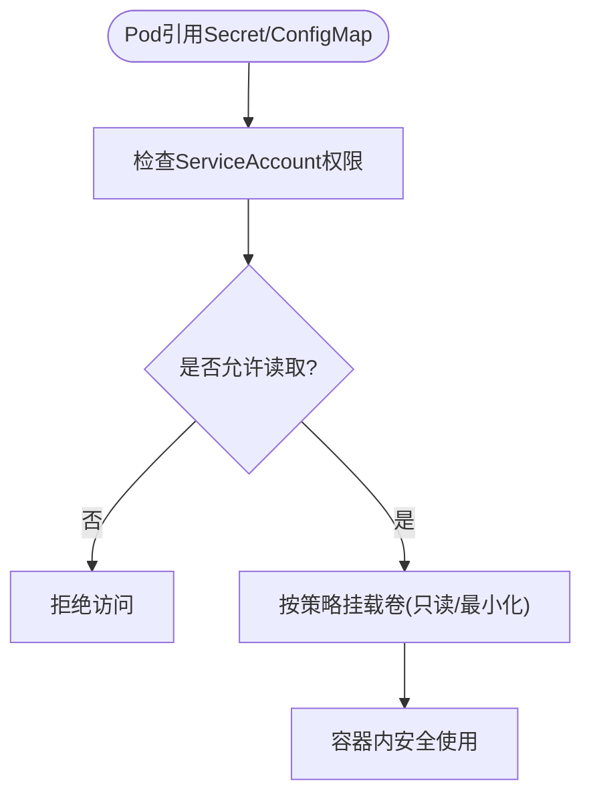
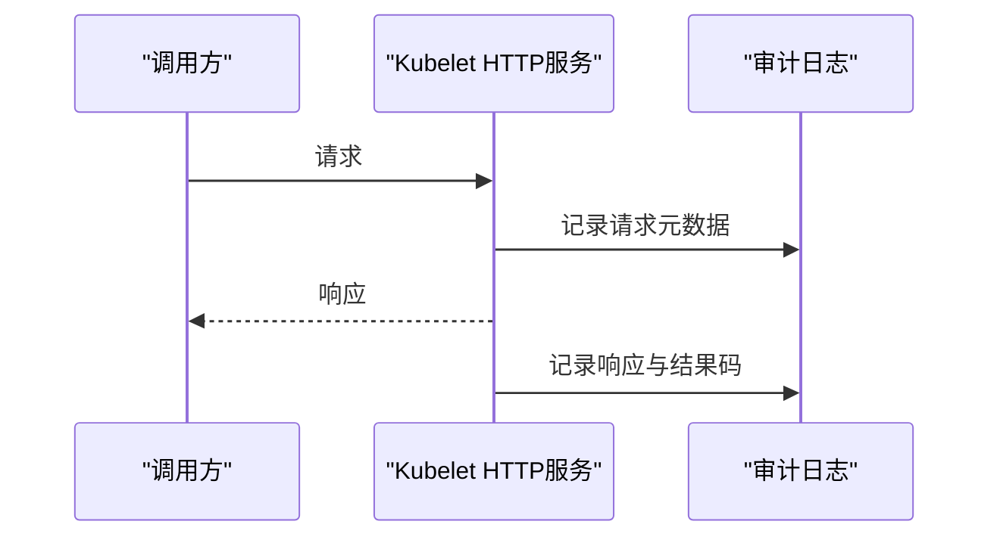
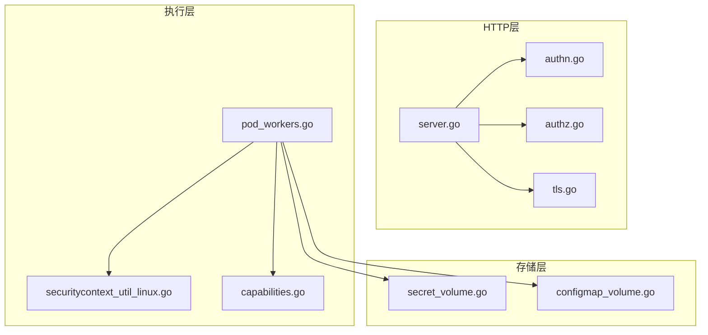

# 安全与权限控制

<cite>
**本文引用的文件**   
- [kubelet.go](file://cmd/kubelet/kubelet.go)
- [app.go](file://cmd/kubelet/app/server.go)
- [server.go](file://pkg/kubelet/server/server.go)
- [authn.go](file://pkg/kubelet/server/authn.go)
- [authz.go](file://pkg/kubelet/server/authz.go)
- [tls.go](file://pkg/kubelet/server/tls.go)
- [options.go](file://pkg/kubelet/config/options.go)
- [pod_workers.go](file://pkg/kubelet/pod_workers.go)
- [securitycontext_util_linux.go](file://pkg/securitycontext/util_linux.go)
- [capabilities.go](file://pkg/capabilities/capabilities.go)
- [secret_volume.go](file://pkg/volume/secret/secret.go)
- [configmap_volume.go](file://pkg/volume/configmap/configmap.go)
- [node_status.go](file://pkg/kubelet/kubelet_node_status.go)
- [kubelet_server_journal.go](file://pkg/kubelet/kubelet_server_journal.go)
</cite>

## 目录
1. [简介](#简介)
2. [项目结构](#项目结构)
3. [核心组件](#核心组件)
4. [架构总览](#架构总览)
5. [详细组件分析](#详细组件分析)
6. [依赖关系分析](#依赖关系分析)
7. [性能与安全考量](#性能与安全考量)
8. [故障排查指南](#故障排查指南)
9. [结论](#结论)
10. [附录](#附录)

## 简介
本文件聚焦Kubelet的安全与权限控制，系统性阐述认证、授权、Pod安全上下文、TLS/SSL通信、Secrets与ConfigMap访问控制、审计日志、加固配置与合规要求。文档面向运维工程师、平台安全工程师与开发者，既提供高层概览，也给出代码级定位与可视化图示，帮助快速落地安全策略与问题定位。

## 项目结构
围绕Kubelet安全能力的相关代码主要分布在以下位置：
- 启动与选项解析：cmd/kubelet/app/* 与 pkg/kubelet/config/*
- HTTP服务与鉴权入口：pkg/kubelet/server/*
- Pod生命周期与执行：pkg/kubelet/pod_workers.go、pkg/kubelet/kuberuntime/*
- 安全上下文与能力：pkg/securitycontext/*、pkg/capabilities/*
- 存储卷（Secrets/ConfigMap）：pkg/volume/secret/*、pkg/volume/configmap/*
- 节点状态与证书：pkg/kubelet/kubelet_node_status.go、pkg/kubelet/certificate/*
- 审计日志：pkg/kubelet/kubelet_server_journal.go

图表来源
- [kubelet.go](file://cmd/kubelet/kubelet.go)
- [app.go](file://cmd/kubelet/app/server.go)
- [server.go](file://pkg/kubelet/server/server.go)
- [authn.go](file://pkg/kubelet/server/authn.go)
- [authz.go](file://pkg/kubelet/server/authz.go)
- [tls.go](file://pkg/kubelet/server/tls.go)
- [pod_workers.go](file://pkg/kubelet/pod_workers.go)
- [securitycontext_util_linux.go](file://pkg/securitycontext/util_linux.go)
- [capabilities.go](file://pkg/capabilities/capabilities.go)
- [secret_volume.go](file://pkg/volume/secret/secret.go)
- [configmap_volume.go](file://pkg/volume/configmap/configmap.go)
- [node_status.go](file://pkg/kubelet/kubelet_node_status.go)
- [kubelet_server_journal.go](file://pkg/kubelet/kubelet_server_journal.go)

章节来源
- [kubelet.go](file://cmd/kubelet/kubelet.go)
- [app.go](file://cmd/kubelet/app/server.go)
- [server.go](file://pkg/kubelet/server/server.go)

## 核心组件
- 认证机制
  - 客户端证书认证：基于X.509证书进行身份识别，校验证书链与CN/O字段，映射为系统用户或ServiceAccount。
  - Token认证：支持Bearer Token（含ServiceAccount令牌），通过API Server的TokenReview接口验证。
  - Webhook认证：将认证请求转发至外部Webhook服务，由外部策略决定是否允许。
- 授权模型
  - RBAC权限检查：对受保护资源操作进行RBAC评估，结合Subject、Resource、Verb与Scope。
  - 节点访问控制：限制仅允许特定主体访问节点相关API（如节点状态、日志、端口转发等）。
  - API Server通信授权：Kubelet作为客户端访问API Server时，使用Node账户或专用ServiceAccount，遵循最小权限原则。
- Pod安全上下文
  - 用户ID映射：根据RunAsUser/FSGroup及UID/GID映射策略，确保容器进程以非特权用户运行。
  - 文件系统权限：依据FSGroup与Volume权限位设置，限制读写范围。
  - Linux Capabilities：按最小化原则分配能力，禁止危险能力（如SYS_ADMIN、NET_RAW等）。
  - 安全策略应用：结合PodSecurityPolicy/Pod Security Admission策略进行准入校验。
- TLS/SSL通信
  - 证书管理：服务端证书与私钥、CA证书轮换；客户端证书用于双向认证。
  - 加密传输：强制HTTPS，禁用弱密码套件与旧协议版本。
  - 双向认证：启用Client CA，校验客户端证书链。
- Secrets与ConfigMap安全访问
  - 数据加密：在etcd层开启EncryptionConfiguration，静态数据加密。
  - 权限验证：仅允许具备读取权限的ServiceAccount访问对应Secret/ConfigMap。
  - 挂载隔离：按需挂载、只读挂载、最小可见性。
- 审计日志
  - 记录关键操作：认证失败、授权拒绝、敏感资源访问、证书签发等。
  - 分级输出：区分请求级别与响应级别，便于追踪与告警。

章节来源
- [authn.go](file://pkg/kubelet/server/authn.go)
- [authz.go](file://pkg/kubelet/server/authz.go)
- [tls.go](file://pkg/kubelet/server/tls.go)
- [options.go](file://pkg/kubelet/config/options.go)
- [pod_workers.go](file://pkg/kubelet/pod_workers.go)
- [securitycontext_util_linux.go](file://pkg/securitycontext/util_linux.go)
- [capabilities.go](file://pkg/capabilities/capabilities.go)
- [secret_volume.go](file://pkg/volume/secret/secret.go)
- [configmap_volume.go](file://pkg/volume/configmap/configmap.go)
- [node_status.go](file://pkg/kubelet/kubelet_node_status.go)
- [kubelet_server_journal.go](file://pkg/kubelet/kubelet_server_journal.go)

## 架构总览
下图展示Kubelet在节点侧的安全边界与关键交互路径，包括认证、授权、TLS与Pod执行链路。

图表来源
- [server.go](file://pkg/kubelet/server/server.go)
- [authn.go](file://pkg/kubelet/server/authn.go)
- [authz.go](file://pkg/kubelet/server/authz.go)
- [tls.go](file://pkg/kubelet/server/tls.go)
- [pod_workers.go](file://pkg/kubelet/pod_workers.go)

## 详细组件分析

### 认证机制（客户端证书、Token、Webhook）
- 客户端证书认证
  - 流程要点：提取证书链、校验签名与有效期、解析CN/O、映射到系统用户或ServiceAccount。
  - 集成点：HTTP服务加载CA、启用双向认证、拒绝无效证书。
- Token认证
  - 流程要点：从请求头获取Bearer Token，调用API Server的TokenReview接口进行验证。
  - 集成点：与API Server通信需具备TokenReview权限。
- Webhook认证
  - 流程要点：将认证请求序列化后POST至外部Webhook端点，根据响应决定是否允许。
  - 集成点：超时、重试、错误处理与降级策略。

图表来源
- [authn.go](file://pkg/kubelet/server/authn.go)
- [tls.go](file://pkg/kubelet/server/tls.go)

章节来源
- [authn.go](file://pkg/kubelet/server/authn.go)
- [tls.go](file://pkg/kubelet/server/tls.go)

### 授权模型（RBAC、节点访问控制、API Server通信授权）
- RBAC权限检查
  - 主体：用户/ServiceAccount
  - 资源与动作：针对节点、Pod、事件等资源的读/写/代理操作
  - 作用域：命名空间与集群范围
- 节点访问控制
  - 限制仅允许节点自身或受控主体访问节点专属API（如日志、端口转发、exec）。
- API Server通信授权
  - Kubelet作为客户端访问API Server时使用受限账户，遵循最小权限原则。

图表来源
- [authz.go](file://pkg/kubelet/server/authz.go)

章节来源
- [authz.go](file://pkg/kubelet/server/authz.go)

### Pod安全上下文（用户ID映射、文件系统权限、Capabilities、安全策略）
- 用户ID映射
  - 根据RunAsUser/FSGroup与宿主UID映射策略，确保容器进程以非特权用户运行。
- 文件系统权限
  - 依据FSGroup与Volume权限位设置，限制读写范围，避免越权访问。
- Linux Capabilities
  - 最小化能力集，禁止危险能力，必要时显式添加必要能力。
- 安全策略应用
  - 结合PodSecurityPolicy/Pod Security Admission策略进行准入校验。

图表来源
- [pod_workers.go](file://pkg/kubelet/pod_workers.go)
- [securitycontext_util_linux.go](file://pkg/securitycontext/util_linux.go)
- [capabilities.go](file://pkg/capabilities/capabilities.go)

章节来源
- [pod_workers.go](file://pkg/kubelet/pod_workers.go)
- [securitycontext_util_linux.go](file://pkg/securitycontext/util_linux.go)
- [capabilities.go](file://pkg/capabilities/capabilities.go)

### TLS/SSL通信（证书管理、加密传输、双向认证）
- 证书管理
  - 服务端证书与私钥、CA证书轮换；客户端证书用于双向认证。
- 加密传输
  - 强制HTTPS，禁用弱密码套件与旧协议版本。
- 双向认证
  - 启用Client CA，校验客户端证书链，拒绝未信任主体。

图表来源
- [tls.go](file://pkg/kubelet/server/tls.go)
- [server.go](file://pkg/kubelet/server/server.go)

章节来源
- [tls.go](file://pkg/kubelet/server/tls.go)
- [server.go](file://pkg/kubelet/server/server.go)

### Secrets与ConfigMap安全访问（数据加密、权限验证）
- 数据加密
  - 在etcd层开启EncryptionConfiguration，静态数据加密。
- 权限验证
  - 仅允许具备读取权限的ServiceAccount访问对应Secret/ConfigMap。
- 挂载隔离
  - 按需挂载、只读挂载、最小可见性。

图表来源
- [secret_volume.go](file://pkg/volume/secret/secret.go)
- [configmap_volume.go](file://pkg/volume/configmap/configmap.go)

章节来源
- [secret_volume.go](file://pkg/volume/secret/secret.go)
- [configmap_volume.go](file://pkg/volume/configmap/configmap.go)

### 审计日志（关键操作记录与分析）
- 记录内容：认证失败、授权拒绝、敏感资源访问、证书签发等。
- 输出方式：分级输出，便于追踪与告警。
- 关联组件：HTTP服务与审计日志写入模块。

图表来源
- [kubelet_server_journal.go](file://pkg/kubelet/kubelet_server_journal.go)
- [server.go](file://pkg/kubelet/server/server.go)

章节来源
- [kubelet_server_journal.go](file://pkg/kubelet/kubelet_server_journal.go)
- [server.go](file://pkg/kubelet/server/server.go)

## 依赖关系分析
- 组件耦合
  - 认证与授权中间件强依赖于HTTP服务与TLS配置。
  - Pod工作器依赖安全上下文与Capabilities模块。
  - Secret/ConfigMap卷模块依赖权限检查与挂载策略。
- 外部依赖
  - API Server：TokenReview、资源访问、证书签发。
  - 容器运行时：执行容器与应用安全上下文。
- 潜在循环依赖
  - 通过分层设计避免循环：HTTP服务→中间件→业务逻辑→运行时。

图表来源
- [server.go](file://pkg/kubelet/server/server.go)
- [authn.go](file://pkg/kubelet/server/authn.go)
- [authz.go](file://pkg/kubelet/server/authz.go)
- [tls.go](file://pkg/kubelet/server/tls.go)
- [pod_workers.go](file://pkg/kubelet/pod_workers.go)
- [securitycontext_util_linux.go](file://pkg/securitycontext/util_linux.go)
- [capabilities.go](file://pkg/capabilities/capabilities.go)
- [secret_volume.go](file://pkg/volume/secret/secret.go)
- [configmap_volume.go](file://pkg/volume/configmap/configmap.go)

章节来源
- [server.go](file://pkg/kubelet/server/server.go)
- [authn.go](file://pkg/kubelet/server/authn.go)
- [authz.go](file://pkg/kubelet/server/authz.go)
- [tls.go](file://pkg/kubelet/server/tls.go)
- [pod_workers.go](file://pkg/kubelet/pod_workers.go)
- [securitycontext_util_linux.go](file://pkg/securitycontext/util_linux.go)
- [capabilities.go](file://pkg/capabilities/capabilities.go)
- [secret_volume.go](file://pkg/volume/secret/secret.go)
- [configmap_volume.go](file://pkg/volume/configmap/configmap.go)

## 性能与安全考量
- 认证开销
  - 客户端证书校验与TokenReview调用可能引入延迟，建议缓存与批处理优化。
- 授权评估
  - RBAC评估频繁，应合理划分资源与作用域，减少不必要的高成本查询。
- TLS握手
  - 复用连接与会话缓存，降低握手开销。
- 审计日志
  - 异步写入与采样策略，避免阻塞主路径。
- 安全加固
  - 最小权限原则、默认拒绝、定期轮换证书与密钥、关闭不必要的API端点。

[本节为通用指导，不直接分析具体文件]

## 故障排查指南
- 认证失败
  - 检查证书链完整性与有效期、CN/O映射是否正确。
  - 确认TokenReview权限与网络连通性。
- 授权拒绝
  - 核对RBAC规则与Subject匹配、资源与动作是否符合预期。
- TLS异常
  - 验证服务端证书与私钥配对、Client CA配置与客户端证书有效性。
- 审计日志缺失
  - 检查审计日志模块配置与写入权限，确认请求是否到达HTTP服务。

章节来源
- [authn.go](file://pkg/kubelet/server/authn.go)
- [authz.go](file://pkg/kubelet/server/authz.go)
- [tls.go](file://pkg/kubelet/server/tls.go)
- [kubelet_server_journal.go](file://pkg/kubelet/kubelet_server_journal.go)

## 结论
Kubelet的安全与权限控制围绕认证、授权、TLS、Pod安全上下文与敏感数据访问展开。通过严格的证书管理、RBAC策略、最小权限原则与完善的审计日志，可有效提升节点侧安全性。建议在部署中持续监控与演练，确保安全策略随业务演进而迭代。

[本节为总结，不直接分析具体文件]

## 附录
- 安全加固配置清单
  - 启用双向TLS、禁用弱套件、严格证书轮换。
  - 配置最小RBAC权限、限制节点专属API访问。
  - 启用etcd静态数据加密、按需挂载Secret/ConfigMap。
  - 配置审计日志分级输出与告警。
- 合规性要求
  - 遵循最小权限与可追溯原则，满足审计与合规检查。
  - 定期进行漏洞扫描与渗透测试，及时修复风险。

[本节为补充说明，不直接分析具体文件]