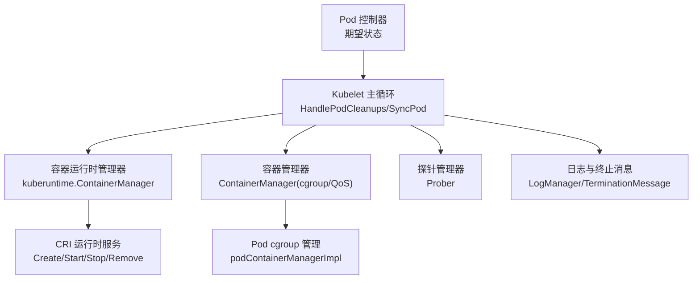
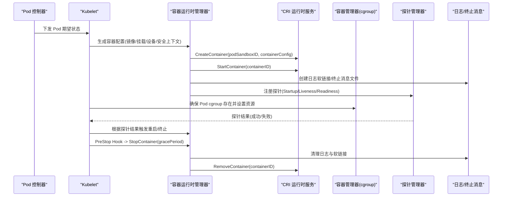
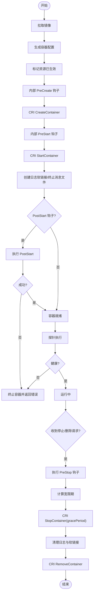
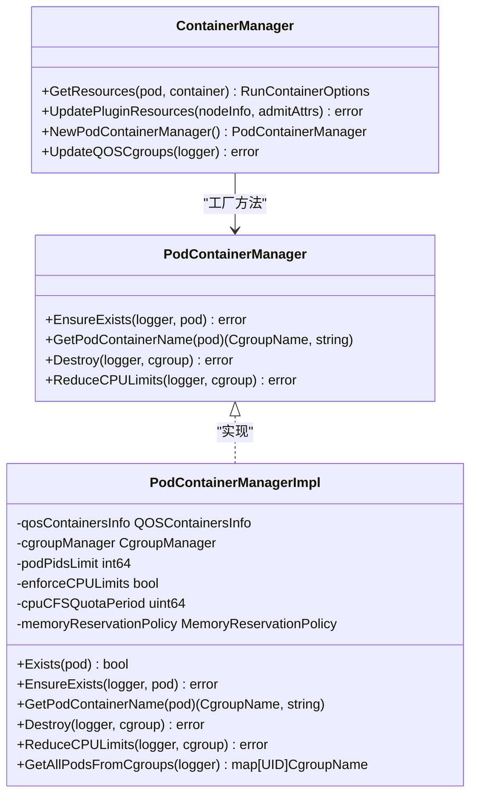
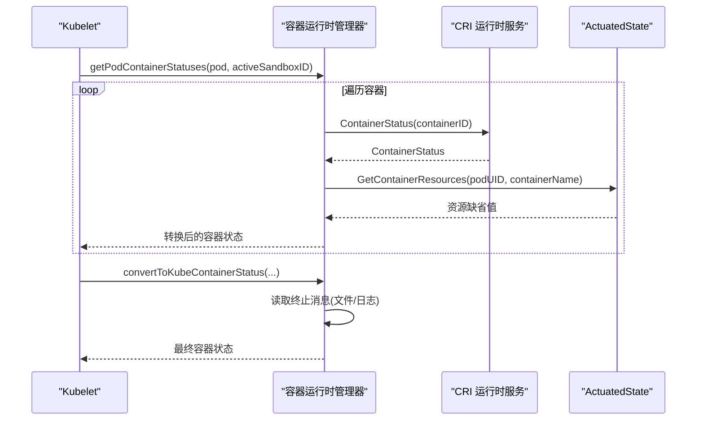
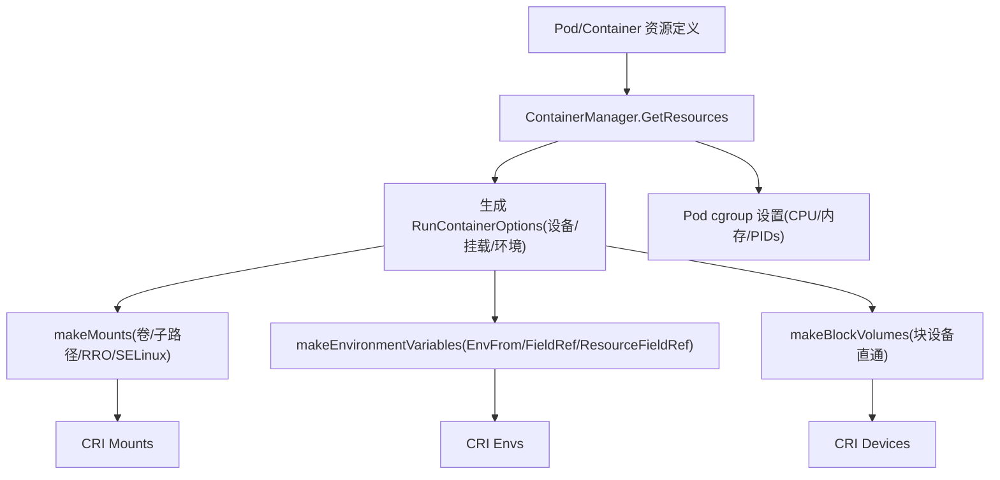
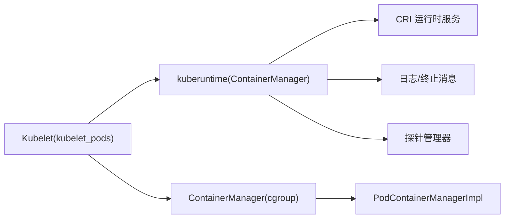

# 容器操作

<cite>
**本文引用的文件**   
- [kuberuntime_container.go](file://pkg/kubelet/kuberuntime/kuberuntime_container.go)
- [kubelet_pods.go](file://pkg/kubelet/kubelet_pods.go)
- [container_manager.go](file://pkg/kubelet/cm/container_manager.go)
- [pod_container_manager_linux.go](file://pkg/kubelet/cm/pod_container_manager_linux.go)
</cite>

## 目录
1. [简介](#简介)
2. [项目结构](#项目结构)
3. [核心组件](#核心组件)
4. [架构总览](#架构总览)
5. [详细组件分析](#详细组件分析)
6. [依赖关系分析](#依赖关系分析)
7. [性能考量](#性能考量)
8. [故障排查指南](#故障排查指南)
9. [结论](#结论)
10. [附录](#附录)

## 简介
本技术文档聚焦于 Kubelet 的容器操作模块，系统性阐述容器的完整生命周期（创建、启动、停止、重启与删除）、沙箱管理机制、容器与沙箱的关联与状态同步、资源分配与安全上下文处理、日志与交互式命令执行、健康检查与探针执行及故障检测等关键实现。文档以源码为依据，提供可视化图示与路径引用，帮助读者快速定位相关实现并理解整体设计。

## 项目结构
Kubelet 的容器操作涉及以下主要层次：
- 运行时适配层：通过 CRI 接口与底层容器运行时交互，负责镜像拉取、容器配置生成、生命周期调用等。
- Pod/容器编排层：负责将 Pod 规范转换为运行所需选项（环境变量、挂载、设备、安全上下文等），协调 Init 容器与普通容器的执行顺序与重启策略。
- 资源与隔离层：基于 cgroup 管理 Pod 级资源配额与 QoS，结合 CPU/内存/拓扑管理器进行精细化控制。
- 观测与可观测性：日志收集、终止消息读取、事件上报、探针执行与结果聚合。

图表来源
- [kuberuntime_container.go:194-340](file://pkg/kubelet/kuberuntime/kuberuntime_container.go#L194-L340)
- [kubelet_pods.go:1217-1480](file://pkg/kubelet/kubelet_pods.go#L1217-L1480)
- [container_manager.go:66-170](file://pkg/kubelet/cm/container_manager.go#L66-L170)
- [pod_container_manager_linux.go:77-109](file://pkg/kubelet/cm/pod_container_manager_linux.go#L77-L109)

章节来源
- [kuberuntime_container.go:194-340](file://pkg/kubelet/kuberuntime/kuberuntime_container.go#L194-L340)
- [kubelet_pods.go:1217-1480](file://pkg/kubelet/kubelet_pods.go#L1217-L1480)
- [container_manager.go:66-170](file://pkg/kubelet/cm/container_manager.go#L66-L170)
- [pod_container_manager_linux.go:77-109](file://pkg/kubelet/cm/pod_container_manager_linux.go#L77-L109)

## 核心组件
- 容器运行时管理器（kuberuntime）
  - 负责镜像拉取、容器配置生成、调用 CRI 完成 Create/Start/Stop/Remove，以及 PostStart/PreStop 钩子、日志与终止消息处理、Exec/Attach 支持。
- Pod/容器编排逻辑（kubelet_pods）
  - 负责将 Pod 规范转换为 RunContainerOptions（环境变量、挂载、设备、主机名/域名、/etc/hosts 注入等），Init 容器编排与重启策略，清理与回收。
- 容器与资源管理器（cm）
  - 提供节点资源能力、QoS cgroup 管理、Pod cgroup 创建/销毁、CPU/内存限制与 MemoryQoS 等。

章节来源
- [kuberuntime_container.go:194-340](file://pkg/kubelet/kuberuntime/kuberuntime_container.go#L194-L340)
- [kubelet_pods.go:643-692](file://pkg/kubelet/kubelet_pods.go#L643-L692)
- [container_manager.go:66-170](file://pkg/kubelet/cm/container_manager.go#L66-L170)
- [pod_container_manager_linux.go:77-109](file://pkg/kubelet/cm/pod_container_manager_linux.go#L77-L109)

## 架构总览
下图展示了从 Pod 期望状态到容器实际运行的端到端流程，包括沙箱与容器的创建、网络与存储准备、资源隔离、探针与日志、以及终止与清理。

图表来源
- [kuberuntime_container.go:194-340](file://pkg/kubelet/kuberuntime/kuberuntime_container.go#L194-L340)
- [kuberuntime_container.go:860-928](file://pkg/kubelet/kuberuntime/kuberuntime_container.go#L860-L928)
- [kubelet_pods.go:1217-1480](file://pkg/kubelet/kubelet_pods.go#L1217-L1480)
- [pod_container_manager_linux.go:77-109](file://pkg/kubelet/cm/pod_container_manager_linux.go#L77-L109)

## 详细组件分析

### 容器生命周期：创建、启动、停止、重启与删除
- 创建与启动
  - 拉取镜像：确保镜像存在，必要时使用 RuntimeClass 指定的 runtimeHandler。
  - 生成容器配置：包含命令、参数、工作目录、标签/注解、设备、挂载、日志路径、TTY/Stdin 等；应用平台特定配置（用户、SELinux、命名空间目标等）。
  - 标记资源已生效：记录 actuated 资源以便后续状态回填。
  - 调用 CRI：CreateContainer -> PreStart 钩子 -> StartContainer -> 记录事件。
  - 兼容旧日志路径：为集群日志系统创建软链接。
  - 执行 PostStart 钩子：失败则终止容器并返回错误。
- 停止与删除
  - PreStop 钩子：在宽限期内执行，超时则继续。
  - 优雅终止：按终止顺序等待后调用 StopContainer(gracePeriod)。
  - 删除容器：PostStop 钩子 -> 清理日志与软链接 -> RemoveContainer。
- 重启
  - 由探针或 Init 容器状态驱动，计算需要杀掉的容器与待启动的容器索引，随后进入上述“停止-删除-创建-启动”流程。

图表来源
- [kuberuntime_container.go:194-340](file://pkg/kubelet/kuberuntime/kuberuntime_container.go#L194-L340)
- [kuberuntime_container.go:860-928](file://pkg/kubelet/kuberuntime/kuberuntime_container.go#L860-L928)
- [kuberuntime_container.go:1381-1438](file://pkg/kubelet/kuberuntime/kuberuntime_container.go#L1381-L1438)

章节来源
- [kuberuntime_container.go:194-340](file://pkg/kubelet/kuberuntime/kuberuntime_container.go#L194-L340)
- [kuberuntime_container.go:860-928](file://pkg/kubelet/kuberuntime/kuberuntime_container.go#L860-L928)
- [kuberuntime_container.go:1381-1438](file://pkg/kubelet/kuberuntime/kuberuntime_container.go#L1381-L1438)

### 沙箱（Sandbox）管理与网络/资源隔离
- 沙箱创建与网络
  - 容器创建时传入 podSandboxID，表示容器共享同一 Pod 沙箱的网络与 IPC 命名空间。
  - /etc/hosts 注入：根据是否使用 hostNetwork、PodIPs、HostAliases 生成 hosts 文件并挂载至容器。
  - 主机名与域名：根据 Pod.Spec.Hostname/Subdomain 与集群域生成，必要时截断长度。
- 资源隔离
  - Pod cgroup 层级：按 QoS 分类（Guaranteed/Burstable/BestEffort）创建 Pod 级 cgroup，并在其下放置容器进程。
  - CPU/内存限制：依据 Pod/Container 资源请求与限制设置 cfs_quota/cfs_period、MemoryLimit 等；支持 MemoryQoS 与独占 CPU 场景下的 CFS 禁用。
  - PIDs 限制：可按 Pod 级别设置 pids_limit。

图表来源
- [container_manager.go:66-170](file://pkg/kubelet/cm/container_manager.go#L66-L170)
- [pod_container_manager_linux.go:44-109](file://pkg/kubelet/cm/pod_container_manager_linux.go#L44-L109)
- [pod_container_manager_linux.go:112-132](file://pkg/kubelet/cm/pod_container_manager_linux.go#L112-L132)

章节来源
- [kubelet_pods.go:278-439](file://pkg/kubelet/kubelet_pods.go#L278-L439)
- [kubelet_pods.go:593-632](file://pkg/kubelet/kubelet_pods.go#L593-L632)
- [pod_container_manager_linux.go:77-109](file://pkg/kubelet/cm/pod_container_manager_linux.go#L77-L109)
- [pod_container_manager_linux.go:112-132](file://pkg/kubelet/cm/pod_container_manager_linux.go#L112-L132)

### 容器与沙箱的关联与状态同步
- 关联关系
  - 每个容器状态中包含 PodSandboxID，用于确认其所属沙箱。
  - 列表过滤：可通过 PodUID 与运行态过滤器筛选容器与沙箱。
- 状态同步
  - 获取容器状态：遍历 Pod 中的容器，调用 CRI 获取状态并转换为 Kubelet 内部状态对象。
  - 终止消息：优先从挂载的终止消息文件读取，否则回退到日志尾部片段。
  - 资源信息回填：若运行时返回 CPU/内存资源信息，则填充到容器状态；缺失部分可从 actuated 状态补齐。

图表来源
- [kuberuntime_container.go:652-686](file://pkg/kubelet/kuberuntime/kuberuntime_container.go#L652-L686)
- [kuberuntime_container.go:585-606](file://pkg/kubelet/kuberuntime/kuberuntime_container.go#L585-L606)
- [kuberuntime_container.go:688-780](file://pkg/kubelet/kuberuntime/kuberuntime_container.go#L688-L780)

章节来源
- [kuberuntime_container.go:652-686](file://pkg/kubelet/kuberuntime/kuberuntime_container.go#L652-L686)
- [kuberuntime_container.go:585-606](file://pkg/kubelet/kuberuntime/kuberuntime_container.go#L585-L606)
- [kuberuntime_container.go:688-780](file://pkg/kubelet/kuberuntime/kuberuntime_container.go#L688-L780)

### 容器资源分配过程（CPU、内存、存储、网络）
- CPU/内存
  - 通过 ContainerManager.GetResources 获取扩展资源与设备信息，结合 Pod/Container 的资源请求与限制，在 Pod cgroup 中设置相应限额。
  - 支持独占 CPU、MemoryQoS、pids_limit 等特性。
- 存储
  - VolumeMounts 解析：支持 SubPath、ImageVolume、递归只读（RRO）、SELinuxRelabel、传播模式等。
  - 块设备直通：将宿主块设备映射到容器内指定路径，并根据 PVC 的只读属性设置权限。
- 网络
  - /etc/hosts 注入：根据 PodIPs、HostAliases、hostNetwork 决定内容。
  - 主机名/域名：根据 Pod.Spec 与集群域生成。

图表来源
- [kubelet_pods.go:643-692](file://pkg/kubelet/kubelet_pods.go#L643-L692)
- [kubelet_pods.go:278-439](file://pkg/kubelet/kubelet_pods.go#L278-L439)
- [kubelet_pods.go:232-261](file://pkg/kubelet/kubelet_pods.go#L232-L261)
- [pod_container_manager_linux.go:77-109](file://pkg/kubelet/cm/pod_container_manager_linux.go#L77-L109)

章节来源
- [kubelet_pods.go:643-692](file://pkg/kubelet/kubelet_pods.go#L643-L692)
- [kubelet_pods.go:278-439](file://pkg/kubelet/kubelet_pods.go#L278-L439)
- [kubelet_pods.go:232-261](file://pkg/kubelet/kubelet_pods.go#L232-L261)
- [pod_container_manager_linux.go:77-109](file://pkg/kubelet/cm/pod_container_manager_linux.go#L77-L109)

### 安全上下文处理（用户权限、SELinux、Capabilities）
- 用户与权限
  - 镜像用户解析：根据镜像元数据推断 UID/用户名，并结合 RunAsNonRoot 校验。
  - 平台特定配置：应用平台相关的用户、组、capabilities 等设置。
- SELinux
  - 挂载重打标：当卷支持 SELinuxRelabel 且未打标时，对卷进行重打标；容器挂载时传递 SelinuxRelabel 标志。
- Capabilities
  - 通过平台特定配置注入 capabilities（具体字段由运行时侧处理）。

章节来源
- [kuberuntime_container.go:343-408](file://pkg/kubelet/kuberuntime/kuberuntime_container.go#L343-L408)
- [kuberuntime_container.go:486-542](file://pkg/kubelet/kuberuntime/kuberuntime_container.go#L486-L542)

### 日志收集、标准输入输出重定向与交互式命令执行
- 日志收集
  - 容器日志路径：在容器配置中设置 LogPath，并在创建后建立兼容旧路径的软链接。
  - 终止消息：优先读取挂载的终止消息文件，失败则回退到日志尾部片段。
- 标准输入输出与 TTY
  - 容器配置包含 Stdin/StdinOnce/Tty 标志，供运行时处理流式 IO。
- 交互式命令执行
  - GetExec/GetAttach：向运行时发起 exec/attach 请求，返回连接 URL。
  - RunInContainer：同步执行命令并合并 stdout/stderr 输出。

章节来源
- [kuberuntime_container.go:300-340](file://pkg/kubelet/kuberuntime/kuberuntime_container.go#L300-L340)
- [kuberuntime_container.go:549-583](file://pkg/kubelet/kuberuntime/kuberuntime_container.go#L549-L583)
- [kuberuntime_container.go:1323-1379](file://pkg/kubelet/kuberuntime/kuberuntime_container.go#L1323-L1379)

### 健康检查、探针执行与故障检测
- 探针类型
  - StartupProbe：保障容器启动完成后才暴露服务。
  - LivenessProbe：探测容器是否存活，失败触发重启。
  - ReadinessProbe：控制流量入口（由上层控制器/Service 消费）。
- 执行与结果
  - 探针管理器周期性执行，并将结果写入对应管理器。
  - 对于可重启 Init 容器，失败会触发重启；普通 Init 容器失败可能终结 Pod。
- 故障检测
  - 探针失败导致 killContainer，随后重新创建并启动容器。
  - 终止宽限期：支持探针级别的 TerminationGracePeriodSeconds，但不超过 Pod 级别上限。

章节来源
- [kuberuntime_container.go:1151-1214](file://pkg/kubelet/kuberuntime/kuberuntime_container.go#L1151-L1214)
- [kuberuntime_container.go:1440-1471](file://pkg/kubelet/kuberuntime/kuberuntime_container.go#L1440-L1471)

## 依赖关系分析
- 组件耦合
  - kuberuntime 依赖 CRI 运行时服务与内部生命周期钩子，同时与日志管理器、actuated 状态、探针管理器协作。
  - kubelet_pods 依赖 volume 管理器、env 变量解析器、subpath 工具、hostutils 等。
  - cm 提供 cgroup 抽象，podContainerManagerImpl 实现 Pod 级 cgroup 管理。
- 外部依赖
  - CRI API：容器与沙箱的生命周期与状态查询。
  - SELinux 库：用于挂载重打标。
  - cgroup v1/v2：不同内核与驱动下的行为差异。

图表来源
- [kuberuntime_container.go:194-340](file://pkg/kubelet/kuberuntime/kuberuntime_container.go#L194-L340)
- [kubelet_pods.go:643-692](file://pkg/kubelet/kubelet_pods.go#L643-L692)
- [container_manager.go:66-170](file://pkg/kubelet/cm/container_manager.go#L66-L170)
- [pod_container_manager_linux.go:77-109](file://pkg/kubelet/cm/pod_container_manager_linux.go#L77-L109)

章节来源
- [kuberuntime_container.go:194-340](file://pkg/kubelet/kuberuntime/kuberuntime_container.go#L194-L340)
- [kubelet_pods.go:643-692](file://pkg/kubelet/kubelet_pods.go#L643-L692)
- [container_manager.go:66-170](file://pkg/kubelet/cm/container_manager.go#L66-L170)
- [pod_container_manager_linux.go:77-109](file://pkg/kubelet/cm/pod_container_manager_linux.go#L77-L109)

## 性能考量
- 并行终止：killContainersWithSyncResult 并发终止多个容器，减少 Pod 终止延迟。
- 日志软链接：避免重复创建，仅在日志文件存在时建立，降低无效开销。
- 探针与重启：针对可重启 Init 容器，仅保留最近一次执行状态，减少 GC 压力。
- cgroup 清理：在 Pod 终止后尝试多次杀死残留进程，确保资源及时释放。

章节来源
- [kuberuntime_container.go:930-967](file://pkg/kubelet/kuberuntime/kuberuntime_container.go#L930-L967)
- [kuberuntime_container.go:300-340](file://pkg/kubelet/kuberuntime/kuberuntime_container.go#L300-L340)
- [pod_container_manager_linux.go:171-205](file://pkg/kubelet/cm/pod_container_manager_linux.go#L171-L205)

## 故障排查指南
- 常见错误与定位
  - 镜像拉取失败：检查镜像仓库凭证与网络连通性，关注 FailedToCreateContainer 事件。
  - 容器创建失败：查看 ErrCreateContainerConfig/ErrCreateContainer 原因，核对挂载路径、设备权限、SELinux 标签。
  - 启动失败：关注 ErrRunContainer 与 PostStartHook 失败，检查容器入口与钩子脚本。
  - 探针失败：确认探针端口/路径可达，调整超时与重试策略。
  - 终止异常：检查 PreStop 钩子耗时与 gracePeriod，观察是否有残留进程。
- 日志与终止消息
  - 若终止消息为空，检查日志尾部片段；确认日志软链接是否存在。
- 资源问题
  - OOM/Killed：核对内存限制与 MemoryQoS 配置；检查独占 CPU 场景下的 CFS 禁用。
  - 卷挂载失败：验证 SubPath 合法性、RRO 特性开关、SELinuxRelabel 支持。

章节来源
- [kuberuntime_container.go:194-340](file://pkg/kubelet/kuberuntime/kuberuntime_container.go#L194-L340)
- [kuberuntime_container.go:549-583](file://pkg/kubelet/kuberuntime/kuberuntime_container.go#L549-L583)
- [kubelet_pods.go:1536-1600](file://pkg/kubelet/kubelet_pods.go#L1536-L1600)

## 结论
Kubelet 的容器操作模块通过清晰的职责分层与模块化设计，实现了从 Pod 期望状态到容器实际运行的全链路管理。借助 CRI 接口、cgroup 资源隔离、探针与健康检查、完善的日志与终止消息机制，系统在可靠性、可观测性与安全性方面具备良好支撑。建议在生产环境中合理配置探针与资源限制，关注日志与事件，持续优化终止流程与资源回收策略。

## 附录
- 术语
  - 沙箱（Sandbox）：Pod 级别的隔离单元，容器共享其网络与 IPC 命名空间。
  - Actuated 状态：记录已生效的资源配置，用于状态回填与一致性校验。
  - RRO：递归只读挂载，提升安全性与一致性。
- 参考路径
  - 容器生命周期：[kuberuntime_container.go:194-340](file://pkg/kubelet/kuberuntime/kuberuntime_container.go#L194-L340)
  - 终止与删除：[kuberuntime_container.go:860-928](file://pkg/kubelet/kuberuntime/kuberuntime_container.go#L860-L928)
  - 资源与 cgroup：[pod_container_manager_linux.go:77-109](file://pkg/kubelet/cm/pod_container_manager_linux.go#L77-L109)
  - 环境与挂载：[kubelet_pods.go:643-692](file://pkg/kubelet/kubelet_pods.go#L643-L692)