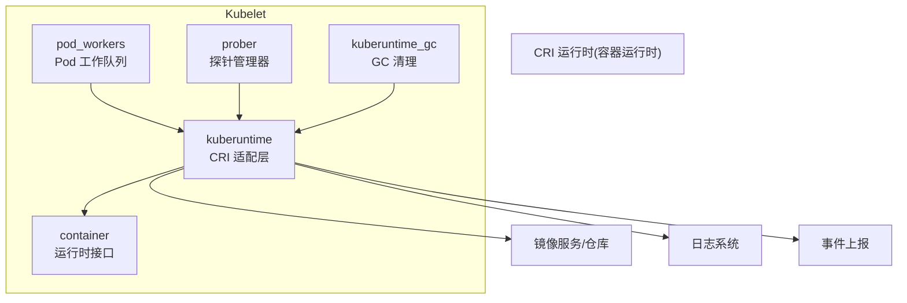
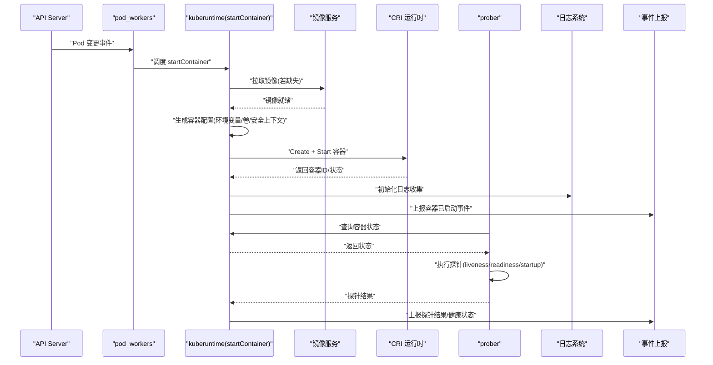
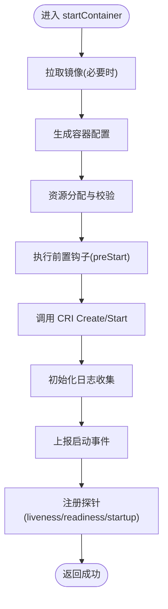
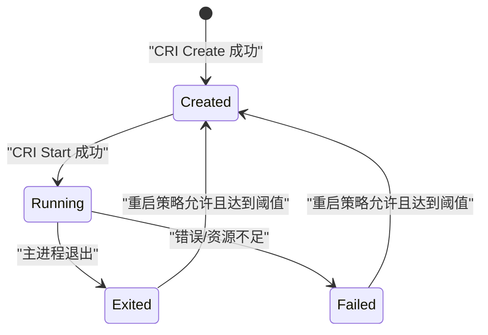
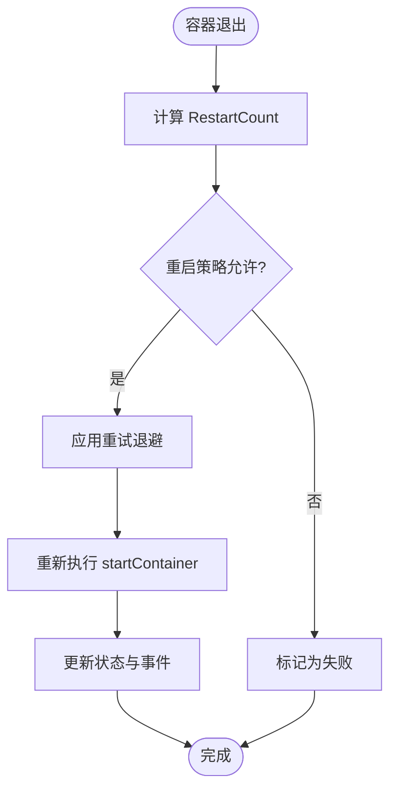
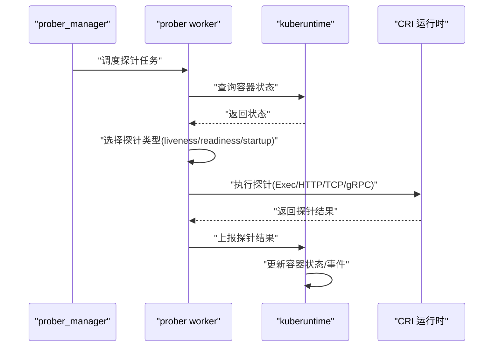
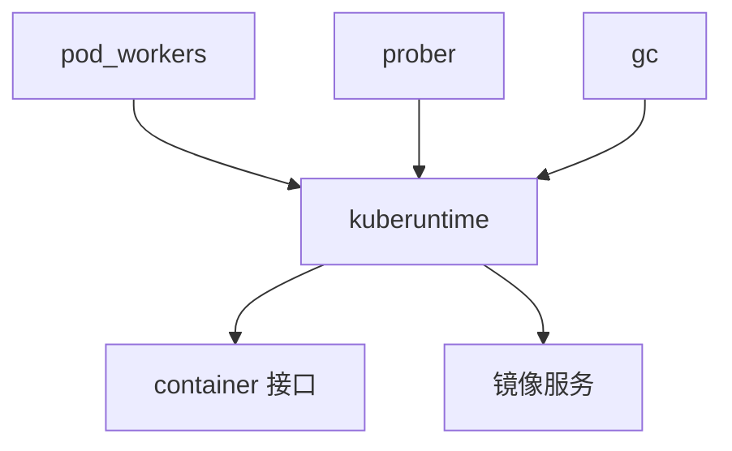

# 容器生命周期管理

<cite>
**本文引用的文件**   
- [pkg/kubelet/kuberuntime/kuberuntime_container.go](file://pkg/kubelet/kuberuntime/kuberuntime_container.go)
- [pkg/kubelet/kuberuntime/convert.go](file://pkg/kubelet/kuberuntime/convert.go)
- [pkg/kubelet/kuberuntime/helpers.go](file://pkg/kubelet/kuberuntime/helpers.go)
- [pkg/kubelet/prober/prober_manager.go](file://pkg/kubelet/prober/prober_manager.go)
- [pkg/kubelet/prober/worker.go](file://pkg/kubelet/prober/worker.go)
- [pkg/kubelet/pod_workers.go](file://pkg/kubelet/pod_workers.go)
- [pkg/kubelet/container/runtime.go](file://pkg/kubelet/container/runtime.go)
- [pkg/kubelet/kuberuntime/kuberuntime_gc.go](file://pkg/kubelet/kuberuntime/kuberuntime_gc.go)
</cite>

## 目录
1. [简介](#简介)
2. [项目结构](#项目结构)
3. [核心组件](#核心组件)
4. [架构总览](#架构总览)
5. [详细组件分析](#详细组件分析)
6. [依赖分析](#依赖分析)
7. [性能考虑](#性能考虑)
8. [故障排查指南](#故障排查指南)
9. [结论](#结论)
10. [附录](#附录)

## 简介
本技术文档聚焦于 Kubelet 的容器生命周期管理，围绕容器的创建、启动、停止、重启与删除等关键操作展开。重点解析 startContainer 的执行流程（镜像拉取、配置生成、资源分配、钩子执行）、状态机转换（Created → Running → Exited）、重启策略与重试机制（RestartCount 计算、日志文件管理）、健康检查实现（liveness/readiness/startup 探针及执行逻辑）、终止消息处理与退出码收集、错误诊断信息，以及事件记录与监控机制。

## 项目结构
Kubelet 的容器生命周期由多个子系统协作完成：
- kuberuntime：面向 CRI 的运行时适配层，负责将 PodSpec 转换为运行时请求，并调用底层运行时执行容器操作。
- prober：健康检查探针调度与执行器，驱动 liveness/readiness/startup 探针。
- pod_workers：Pod 工作队列与并发控制，协调容器同步任务。
- container：通用容器抽象与运行时缓存接口。
- gc：垃圾回收与清理策略。

图表来源
- [pkg/kubelet/pod_workers.go](file://pkg/kubelet/pod_workers.go)
- [pkg/kubelet/kuberuntime/kuberuntime_container.go](file://pkg/kubelet/kuberuntime/kuberuntime_container.go)
- [pkg/kubelet/prober/prober_manager.go](file://pkg/kubelet/prober/prober_manager.go)
- [pkg/kubelet/container/runtime.go](file://pkg/kubelet/container/runtime.go)
- [pkg/kubelet/kuberuntime/kuberuntime_gc.go](file://pkg/kubelet/kuberuntime/kuberuntime_gc.go)

章节来源
- [pkg/kubelet/kuberuntime/kuberuntime_container.go](file://pkg/kubelet/kuberuntime/kuberuntime_container.go)
- [pkg/kubelet/kuberuntime/convert.go](file://pkg/kubelet/kuberuntime/convert.go)
- [pkg/kubelet/kuberuntime/helpers.go](file://pkg/kubelet/kuberuntime/helpers.go)
- [pkg/kubelet/prober/prober_manager.go](file://pkg/kubelet/prober/prober_manager.go)
- [pkg/kubelet/prober/worker.go](file://pkg/kubelet/prober/worker.go)
- [pkg/kubelet/pod_workers.go](file://pkg/kubelet/pod_workers.go)
- [pkg/kubelet/container/runtime.go](file://pkg/kubelet/container/runtime.go)
- [pkg/kubelet/kuberuntime/kuberuntime_gc.go](file://pkg/kubelet/kuberuntime/kuberuntime_gc.go)

## 核心组件
- kuberuntime 容器控制器：封装了 startContainer、stopContainer、removeContainer 等生命周期方法，负责镜像拉取、容器配置构建、资源分配、钩子执行、日志与事件上报。
- 配置转换：将 PodSpec 与容器规格转换为 CRI 请求对象，确保字段映射正确与安全校验。
- 探针管理器：根据 Pod 探针定义调度执行 liveness/readiness/startup 探针，并与容器运行状态联动。
- Pod 工作队列：按 Pod 维度串行化容器同步任务，避免并发冲突，保证幂等性。
- 垃圾回收：依据策略清理不再使用的容器与镜像，释放节点资源。

章节来源
- [pkg/kubelet/kuberuntime/kuberuntime_container.go](file://pkg/kubelet/kuberuntime/kuberuntime_container.go)
- [pkg/kubelet/kuberuntime/convert.go](file://pkg/kubelet/kuberuntime/convert.go)
- [pkg/kubelet/kuberuntime/helpers.go](file://pkg/kubelet/kuberuntime/helpers.go)
- [pkg/kubelet/prober/prober_manager.go](file://pkg/kubelet/prober/prober_manager.go)
- [pkg/kubelet/pod_workers.go](file://pkg/kubelet/pod_workers.go)
- [pkg/kubelet/kuberuntime/kuberuntime_gc.go](file://pkg/kubelet/kuberuntime/kuberuntime_gc.go)

## 架构总览
下图展示了从 Pod 变更到容器实际运行的端到端流程，包括 startContainer 的关键步骤与探针触发时机。

图表来源
- [pkg/kubelet/pod_workers.go](file://pkg/kubelet/pod_workers.go)
- [pkg/kubelet/kuberuntime/kuberuntime_container.go](file://pkg/kubelet/kuberuntime/kuberuntime_container.go)
- [pkg/kubelet/prober/prober_manager.go](file://pkg/kubelet/prober/prober_manager.go)

## 详细组件分析

### startContainer 执行流程
startContainer 是容器生命周期的核心入口，典型步骤如下：
- 镜像拉取：若本地不存在所需镜像，则先拉取；支持重试与超时控制。
- 配置生成：基于 Pod 与容器规格生成运行时配置，包括环境变量、挂载卷、端口映射、安全上下文、资源限制等。
- 资源分配：通过 CRI 向运行时申请 CPU/内存等资源，确保节点资源配额满足要求。
- 钩子函数：在容器启动前后执行预置钩子（如 preStart/postStop），用于初始化或清理工作。
- 启动容器：调用 CRI 的 Create/Start 接口，获取容器 ID 与初始状态。
- 日志与事件：初始化日志收集管道，上报“容器已启动”事件。
- 探针注册：为容器注册探针，后续由探针管理器周期性执行。

图表来源
- [pkg/kubelet/kuberuntime/kuberuntime_container.go](file://pkg/kubelet/kuberuntime/kuberuntime_container.go)
- [pkg/kubelet/kuberuntime/convert.go](file://pkg/kubelet/kuberuntime/convert.go)
- [pkg/kubelet/kuberuntime/helpers.go](file://pkg/kubelet/kuberuntime/helpers.go)

章节来源
- [pkg/kubelet/kuberuntime/kuberuntime_container.go](file://pkg/kubelet/kuberuntime/kuberuntime_container.go)
- [pkg/kubelet/kuberuntime/convert.go](file://pkg/kubelet/kuberuntime/convert.go)
- [pkg/kubelet/kuberuntime/helpers.go](file://pkg/kubelet/kuberuntime/helpers.go)

### 容器状态转换机制
容器状态在 Kubelet 中遵循明确的转换路径：
- Created：容器已创建但未开始执行主进程。
- Running：容器主进程正在运行。
- Exited：容器主进程结束，包含正常退出与异常退出。
- Failed：因错误或资源不足导致无法继续运行。

状态转换触发点：
- 启动阶段：CRI 返回 Running 后，Kubelet 更新状态为 Running。
- 退出阶段：CRI 报告容器退出，Kubelet 更新为 Exited，并记录退出码与原因。
- 失败阶段：镜像拉取失败、资源不足、钩子执行失败等，标记为 Failed。

图表来源
- [pkg/kubelet/kuberuntime/kuberuntime_container.go](file://pkg/kubelet/kuberuntime/kuberuntime_container.go)

章节来源
- [pkg/kubelet/kuberuntime/kuberuntime_container.go](file://pkg/kubelet/kuberuntime/kuberuntime_container.go)

### 重启策略与重试机制
- RestartCount：每次容器退出后递增，用于统计重启次数。当超过最大重启次数时，Pod 将被标记为失败。
- 重试间隔：根据指数退避或固定延迟进行重试，避免频繁重启造成抖动。
- 日志文件管理：每次重启会保留历史日志，便于问题回溯；同时受磁盘空间与轮转策略约束。
- 条件判断：仅当重启策略允许且未达阈值时才尝试重启；否则直接进入失败状态。

图表来源
- [pkg/kubelet/kuberuntime/kuberuntime_container.go](file://pkg/kubelet/kuberuntime/kuberuntime_container.go)

章节来源
- [pkg/kubelet/kuberuntime/kuberuntime_container.go](file://pkg/kubelet/kuberuntime/kuberuntime_container.go)

### 健康检查实现（探针）
探针类型与职责：
- Liveness：检测容器是否存活，失败时触发重启。
- Readiness：检测容器是否可接受流量，失败时从 Service 端点摘除。
- Startup：检测容器是否已完成启动，失败时阻止其他探针执行，直到成功或超时。

执行逻辑：
- 探针管理器根据 Pod 定义周期性地调用探针处理器。
- 探针处理器通过 exec/http/tcp/grpc 等方式探测目标。
- 结果反馈给 Kubelet，更新容器状态与事件。

图表来源
- [pkg/kubelet/prober/prober_manager.go](file://pkg/kubelet/prober/prober_manager.go)
- [pkg/kubelet/prober/worker.go](file://pkg/kubelet/prober/worker.go)
- [pkg/kubelet/kuberuntime/kuberuntime_container.go](file://pkg/kubelet/kuberuntime/kuberuntime_container.go)

章节来源
- [pkg/kubelet/prober/prober_manager.go](file://pkg/kubelet/prober/prober_manager.go)
- [pkg/kubelet/prober/worker.go](file://pkg/kubelet/prober/worker.go)
- [pkg/kubelet/kuberuntime/kuberuntime_container.go](file://pkg/kubelet/kuberuntime/kuberuntime_container.go)

### 终止消息处理、退出码收集与错误诊断
- 终止消息：CRI 返回的终止原因与消息会被 Kubelet 记录，用于诊断容器为何退出。
- 退出码：主进程退出码被收集并写入容器状态，供上层控制器与用户查看。
- 错误诊断：结合探针结果、事件与日志，定位镜像拉取失败、资源不足、钩子执行异常等问题。

章节来源
- [pkg/kubelet/kuberuntime/kuberuntime_container.go](file://pkg/kubelet/kuberuntime/kuberuntime_container.go)

### 容器生命周期事件的记录与监控
- 事件记录：Kubelet 在关键生命周期节点（创建、启动、退出、失败）上报事件，便于集群观测。
- 监控指标：探针成功率、重启次数、容器状态分布等指标可用于容量与健康度评估。
- 日志聚合：容器标准输出与错误流被采集，配合轮转策略避免磁盘占用过高。

章节来源
- [pkg/kubelet/kuberuntime/kuberuntime_container.go](file://pkg/kubelet/kuberuntime/kuberuntime_container.go)

## 依赖分析
Kubelet 容器生命周期管理的依赖关系如下：
- pod_workers 负责并发控制与任务调度。
- kuberuntime 作为运行时适配层，依赖 CRI 运行时与镜像服务。
- prober 依赖 kuberuntime 的状态查询能力。
- gc 依赖 kuberuntime 的清理接口。

图表来源
- [pkg/kubelet/pod_workers.go](file://pkg/kubelet/pod_workers.go)
- [pkg/kubelet/kuberuntime/kuberuntime_container.go](file://pkg/kubelet/kuberuntime/kuberuntime_container.go)
- [pkg/kubelet/prober/prober_manager.go](file://pkg/kubelet/prober/prober_manager.go)
- [pkg/kubelet/kuberuntime/kuberuntime_gc.go](file://pkg/kubelet/kuberuntime/kuberuntime_gc.go)
- [pkg/kubelet/container/runtime.go](file://pkg/kubelet/container/runtime.go)

章节来源
- [pkg/kubelet/pod_workers.go](file://pkg/kubelet/pod_workers.go)
- [pkg/kubelet/kuberuntime/kuberuntime_container.go](file://pkg/kubelet/kuberuntime/kuberuntime_container.go)
- [pkg/kubelet/prober/prober_manager.go](file://pkg/kubelet/prober/prober_manager.go)
- [pkg/kubelet/kuberuntime/kuberuntime_gc.go](file://pkg/kubelet/kuberuntime/kuberuntime_gc.go)
- [pkg/kubelet/container/runtime.go](file://pkg/kubelet/container/runtime.go)

## 性能考虑
- 镜像拉取并行与缓存：利用本地镜像缓存减少重复拉取，提升启动速度。
- 资源分配优化：合理设置资源请求与限制，避免过度预留导致节点碎片化。
- 探针调优：调整探针间隔与超时，降低对容器性能的干扰。
- 日志轮转：配置合理的日志大小与数量上限，防止磁盘写放大。
- GC 策略：定期清理无用容器与镜像，保持节点资源整洁。

[本节提供一般性指导，无需特定文件引用]

## 故障排查指南
- 镜像拉取失败：检查镜像仓库可达性与凭据，确认镜像名称与标签正确。
- 资源不足：查看节点资源使用率与 Pod 资源请求，适当扩容或调整资源配额。
- 探针失败：验证探针端点可用性、端口开放与权限，调整探针参数。
- 重启风暴：检查应用稳定性与探针配置，避免过于敏感的探针导致频繁重启。
- 日志缺失：确认日志收集配置与磁盘空间，检查容器标准输出是否正常。

章节来源
- [pkg/kubelet/kuberuntime/kuberuntime_container.go](file://pkg/kubelet/kuberuntime/kuberuntime_container.go)
- [pkg/kubelet/prober/prober_manager.go](file://pkg/kubelet/prober/prober_manager.go)

## 结论
Kubelet 的容器生命周期管理通过 kuberuntime、prober、pod_workers 等模块协同工作，实现了从镜像拉取、配置生成、资源分配到探针执行的完整闭环。明确的状态机与重启策略保障了容器的自愈能力，而事件与日志则为问题定位提供了重要线索。在实际部署中，应结合业务特性调优探针与资源策略，以获得更稳定的运行效果。

[本节为总结性内容，无需特定文件引用]

## 附录
- 术语说明：
  - CRI：容器运行时接口，Kubelet 与底层运行时交互的标准协议。
  - 探针：用于检测容器健康状态的机制，包括 liveness/readiness/startup。
  - RestartCount：容器重启次数的计数器，用于控制重启策略。

[本节为概念性说明，无需特定文件引用]