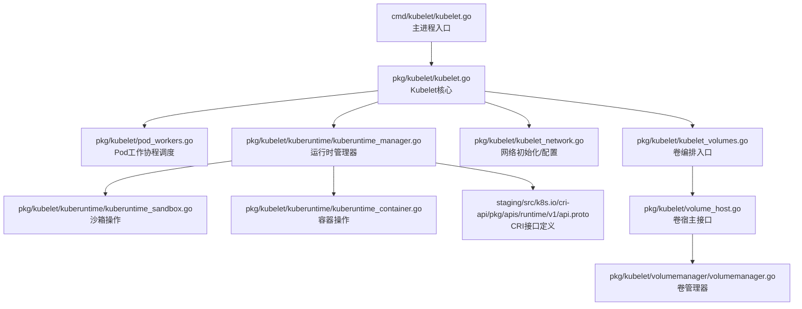
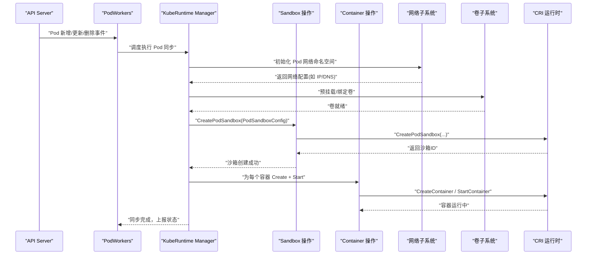
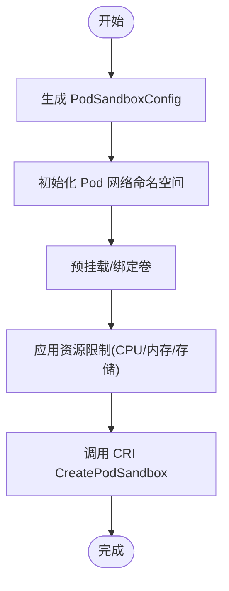
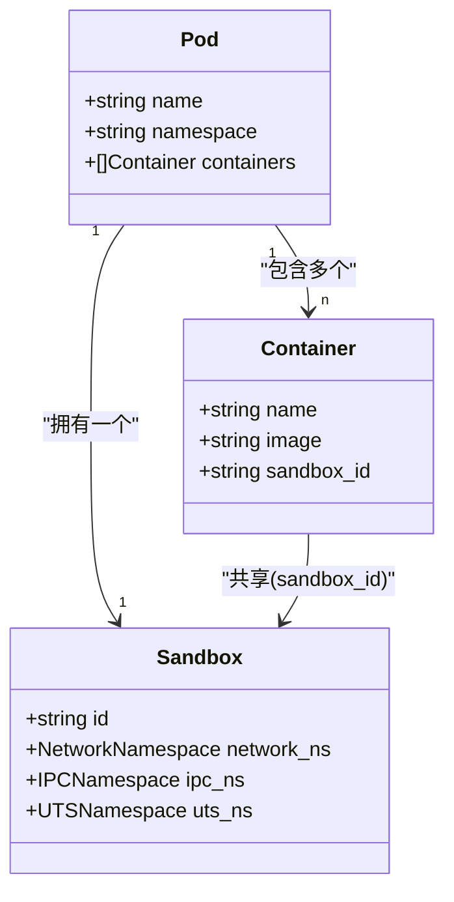
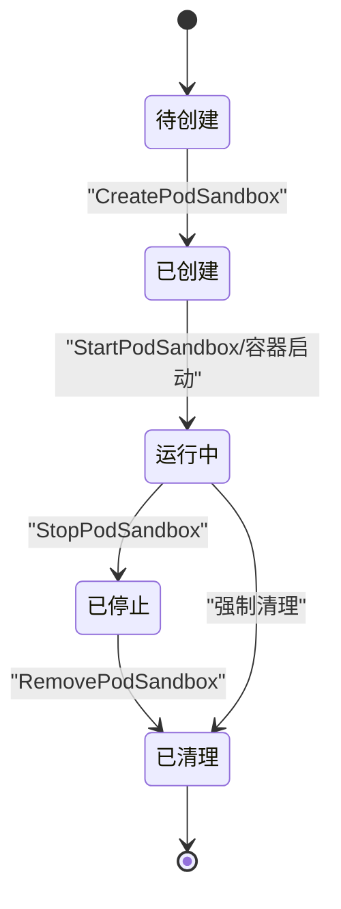
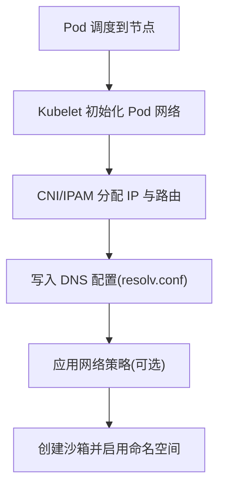
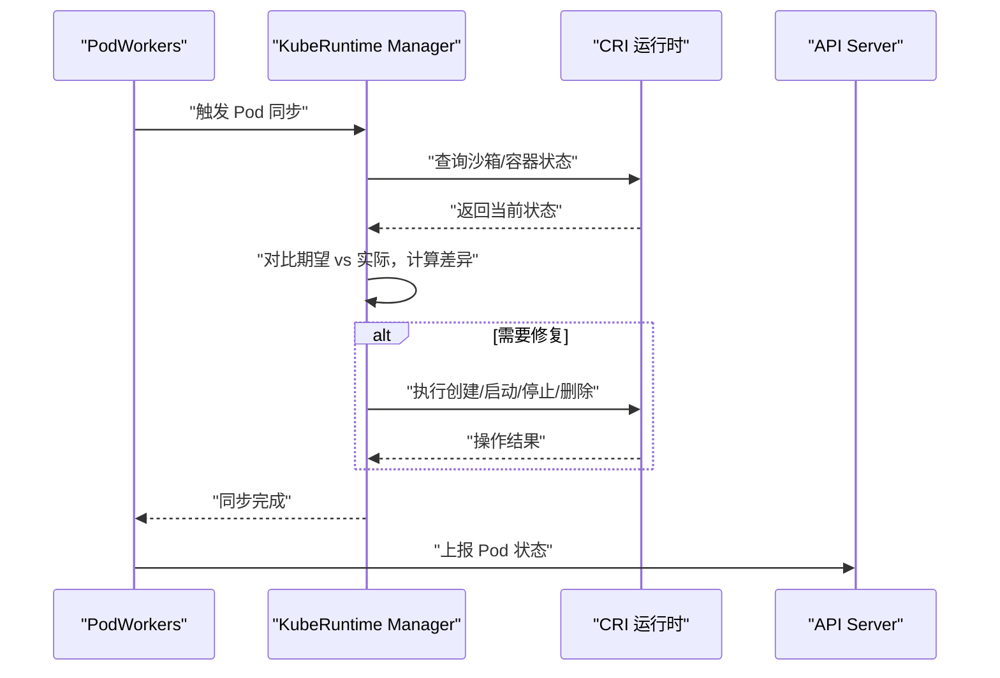
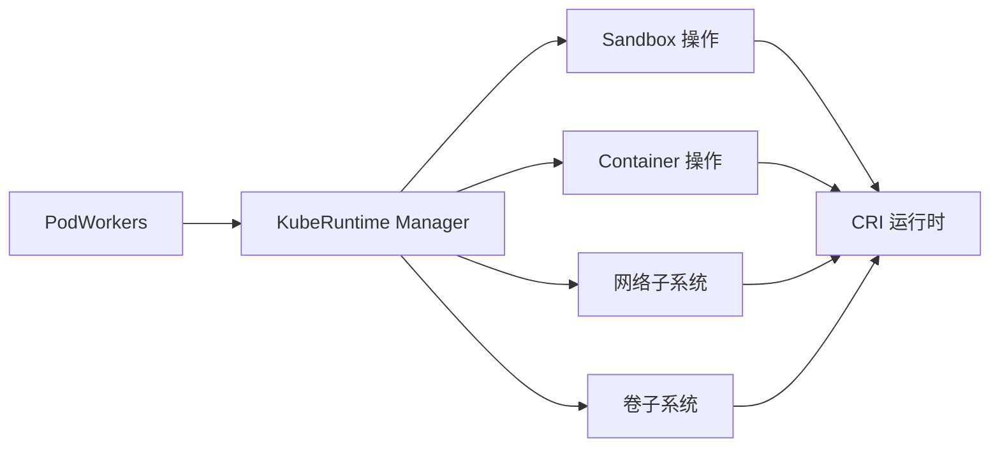

# 沙箱管理

<cite>
**本文引用的文件**   
- [kubelet.go](file://cmd/kubelet/kubelet.go)
- [kubelet.go](file://pkg/kubelet/kubelet.go)
- [kuberuntime_manager.go](file://pkg/kubelet/kuberuntime/kuberuntime_manager.go)
- [kuberuntime_sandbox.go](file://pkg/kubelet/kuberuntime/kuberuntime_sandbox.go)
- [kuberuntime_container.go](file://pkg/kubelet/kuberuntime/kuberuntime_container.go)
- [pod_workers.go](file://pkg/kubelet/pod_workers.go)
- [runtime.go](file://pkg/kubelet/container/runtime.go)
- [sync_result.go](file://pkg/kubelet/container/sync_result.go)
- [kubelet_pods.go](file://pkg/kubelet/kubelet_pods.go)
- [kubelet_network.go](file://pkg/kubelet/kubelet_network.go)
- [kubelet_volumes.go](file://pkg/kubelet/kubelet_volumes.go)
- [volume_host.go](file://pkg/kubelet/volume_host.go)
- [volumemanager.go](file://pkg/kubelet/volumemanager/volumemanager.go)
- [cri_api.go](file://staging/src/k8s.io/cri-api/pkg/apis/runtime/v1/api.proto)
</cite>

## 目录
1. [简介](#简介)
2. [项目结构](#项目结构)
3. [核心组件](#核心组件)
4. [架构总览](#架构总览)
5. [详细组件分析](#详细组件分析)
6. [依赖关系分析](#依赖关系分析)
7. [性能考量](#性能考量)
8. [故障排查指南](#故障排查指南)
9. [结论](#结论)
10. [附录](#附录)

## 简介
本文件面向Kubernetes Kubelet的沙箱管理机制，系统性阐述Pod沙箱的概念、隔离边界（网络命名空间、IPC命名空间、UTS命名空间）、创建流程（配置生成、网络初始化、卷挂载、资源限制）、与容器的共享关系、生命周期管理（创建、启动、停止、清理）、网络配置（IP分配、DNS、策略）、资源管理（CPU/内存/存储配额）以及故障恢复与状态同步机制。文档以源码为依据，提供可视化图示与可追溯的“章节来源”，帮助读者从高层到代码级全面理解沙箱在Kubelet中的实现。

## 项目结构
Kubelet中沙箱相关的关键路径集中在以下模块：
- 入口与协调层：cmd/kubelet/kubelet.go、pkg/kubelet/kubelet.go、pkg/kubelet/pod_workers.go
- 运行时适配层：pkg/kubelet/kuberuntime/*（Manager、Sandbox、Container等）
- 容器抽象与结果类型：pkg/kubelet/container/runtime.go、pkg/kubelet/container/sync_result.go
- 网络与卷：pkg/kubelet/kubelet_network.go、pkg/kubelet/kubelet_volumes.go、pkg/kubelet/volume_host.go、pkg/kubelet/volumemanager/volumemanager.go
- CRI接口定义：staging/src/k8s.io/cri-api/pkg/apis/runtime/v1/api.proto

图表来源
- [kubelet.go](file://cmd/kubelet/kubelet.go)
- [kubelet.go](file://pkg/kubelet/kubelet.go)
- [pod_workers.go](file://pkg/kubelet/pod_workers.go)
- [kuberuntime_manager.go](file://pkg/kubelet/kuberuntime/kuberuntime_manager.go)
- [kuberuntime_sandbox.go](file://pkg/kubelet/kuberuntime/kuberuntime_sandbox.go)
- [kuberuntime_container.go](file://pkg/kubelet/kuberuntime/kuberuntime_container.go)
- [kubelet_network.go](file://pkg/kubelet/kubelet_network.go)
- [kubelet_volumes.go](file://pkg/kubelet/kubelet_volumes.go)
- [volume_host.go](file://pkg/kubelet/volume_host.go)
- [volumemanager.go](file://pkg/kubelet/volumemanager/volumemanager.go)
- [cri_api.go](file://staging/src/k8s.io/cri-api/pkg/apis/runtime/v1/api.proto)

章节来源
- [kubelet.go](file://cmd/kubelet/kubelet.go)
- [kubelet.go](file://pkg/kubelet/kubelet.go)
- [pod_workers.go](file://pkg/kubelet/pod_workers.go)
- [kuberuntime_manager.go](file://pkg/kubelet/kuberuntime/kuberuntime_manager.go)
- [kuberuntime_sandbox.go](file://pkg/kubelet/kuberuntime/kuberuntime_sandbox.go)
- [kuberuntime_container.go](file://pkg/kubelet/kuberuntime/kuberuntime_container.go)
- [kubelet_network.go](file://pkg/kubelet/kubelet_network.go)
- [kubelet_volumes.go](file://pkg/kubelet/kubelet_volumes.go)
- [volume_host.go](file://pkg/kubelet/volume_host.go)
- [volumemanager.go](file://pkg/kubelet/volumemanager/volumemanager.go)
- [cri_api.go](file://staging/src/k8s.io/cri-api/pkg/apis/runtime/v1/api.proto)

## 核心组件
- Pod工作协程（PodWorkers）：负责将Pod变更事件分发到独立协程执行，保证并发安全与顺序性。
- 运行时管理器（KubeRuntime Manager）：封装CRI调用，统一处理沙箱与容器的创建、启动、停止、删除等操作。
- 沙箱操作（Sandbox）：围绕PodSandboxConfig构建并调用CRI创建/删除/停止沙箱，维护沙箱ID与状态。
- 容器操作（Container）：在已存在沙箱内创建并启动容器，复用沙箱的网络、IPC、UTS等资源。
- 网络与卷子系统：分别负责Pod网络命名空间初始化、IP/DNS/策略配置，以及卷的预挂载与绑定。
- CRI接口：定义CreatePodSandbox、StartPodSandbox、StopPodSandbox、RemovePodSandbox等标准方法。

章节来源
- [pod_workers.go](file://pkg/kubelet/pod_workers.go)
- [kuberuntime_manager.go](file://pkg/kubelet/kuberuntime/kuberuntime_manager.go)
- [kuberuntime_sandbox.go](file://pkg/kubelet/kuberuntime/kuberuntime_sandbox.go)
- [kuberuntime_container.go](file://pkg/kubelet/kuberuntime/kuberuntime_container.go)
- [kubelet_network.go](file://pkg/kubelet/kubelet_network.go)
- [kubelet_volumes.go](file://pkg/kubelet/kubelet_volumes.go)
- [volume_host.go](file://pkg/kubelet/volume_host.go)
- [volumemanager.go](file://pkg/kubelet/volumemanager/volumemanager.go)
- [cri_api.go](file://staging/src/k8s.io/cri-api/pkg/apis/runtime/v1/api.proto)

## 架构总览
下图展示了Kubelet对Pod沙箱的整体控制流：上层通过PodWorkers接收Pod事件，交由KubeRuntime Manager协调沙箱与容器操作；网络与卷子系统在沙箱创建前后完成必要准备；最终通过CRI与底层容器运行时交互。

图表来源
- [pod_workers.go](file://pkg/kubelet/pod_workers.go)
- [kuberuntime_manager.go](file://pkg/kubelet/kuberuntime/kuberuntime_manager.go)
- [kuberuntime_sandbox.go](file://pkg/kubelet/kuberuntime/kuberuntime_sandbox.go)
- [kuberuntime_container.go](file://pkg/kubelet/kuberuntime/kuberuntime_container.go)
- [kubelet_network.go](file://pkg/kubelet/kubelet_network.go)
- [kubelet_volumes.go](file://pkg/kubelet/kubelet_volumes.go)
- [volume_host.go](file://pkg/kubelet/volume_host.go)
- [volumemanager.go](file://pkg/kubelet/volumemanager/volumemanager.go)
- [cri_api.go](file://staging/src/k8s.io/cri-api/pkg/apis/runtime/v1/api.proto)

## 详细组件分析

### 沙箱概念与隔离边界
- 沙箱是Pod级别的隔离单元，包含一个或多个容器共享的命名空间与资源。
- 关键隔离维度：
  - 网络命名空间：Pod内所有容器共享同一网络栈，拥有相同IP、端口空间与路由表。
  - IPC命名空间：容器间可通过System V IPC或POSIX消息队列通信，但与其他Pod隔离。
  - UTS命名空间：容器共享相同的主机名与域名，便于在同一Pod内按主机名访问。
- 这些隔离由CRI在创建PodSandbox时建立，Kubelet通过PodSandboxConfig进行参数化。

章节来源
- [kuberuntime_sandbox.go](file://pkg/kubelet/kuberuntime/kuberuntime_sandbox.go)
- [cri_api.go](file://staging/src/k8s.io/cri-api/pkg/apis/runtime/v1/api.proto)

### 沙箱创建流程（配置、网络、卷、资源）
- 配置生成：根据PodSpec转换为CRI的PodSandboxConfig，包括元数据、安全上下文、网络与DNS设置、挂载点等。
- 网络初始化：在创建沙箱前，Kubelet可能先初始化Pod网络命名空间，分配IP、配置DNS与网络策略。
- 卷挂载：在创建沙箱前预挂载所需卷，确保容器启动即可访问。
- 资源限制：通过Cgroup或运行时能力施加CPU/内存/存储配额，具体由CRI实现。

图表来源
- [kuberuntime_manager.go](file://pkg/kubelet/kuberuntime/kuberuntime_manager.go)
- [kuberuntime_sandbox.go](file://pkg/kubelet/kuberuntime/kuberuntime_sandbox.go)
- [kubelet_network.go](file://pkg/kubelet/kubelet_network.go)
- [kubelet_volumes.go](file://pkg/kubelet/kubelet_volumes.go)
- [volume_host.go](file://pkg/kubelet/volume_host.go)
- [volumemanager.go](file://pkg/kubelet/volumemanager/volumemanager.go)
- [cri_api.go](file://staging/src/k8s.io/cri-api/pkg/apis/runtime/v1/api.proto)

章节来源
- [kuberuntime_manager.go](file://pkg/kubelet/kuberuntime/kuberuntime_manager.go)
- [kuberuntime_sandbox.go](file://pkg/kubelet/kuberuntime/kuberuntime_sandbox.go)
- [kubelet_network.go](file://pkg/kubelet/kubelet_network.go)
- [kubelet_volumes.go](file://pkg/kubelet/kubelet_volumes.go)
- [volume_host.go](file://pkg/kubelet/volume_host.go)
- [volumemanager.go](file://pkg/kubelet/volumemanager/volumemanager.go)
- [cri_api.go](file://staging/src/k8s.io/cri-api/pkg/apis/runtime/v1/api.proto)

### 沙箱与容器的关联关系（多容器共享）
- 一个Pod对应一个沙箱，多个容器共享该沙箱的网络、IPC、UTS等命名空间。
- 容器创建时指定sandbox_id，CRI据此将其加入已有沙箱环境。
- 这种设计简化了Pod内通信与资源共享，同时保持跨Pod隔离。

图表来源
- [kuberuntime_container.go](file://pkg/kubelet/kuberuntime/kuberuntime_container.go)
- [kuberuntime_sandbox.go](file://pkg/kubelet/kuberuntime/kuberuntime_sandbox.go)
- [cri_api.go](file://staging/src/k8s.io/cri-api/pkg/apis/runtime/v1/api.proto)

章节来源
- [kuberuntime_container.go](file://pkg/kubelet/kuberuntime/kuberuntime_container.go)
- [kuberuntime_sandbox.go](file://pkg/kubelet/kuberuntime/kuberuntime_sandbox.go)
- [cri_api.go](file://staging/src/k8s.io/cri-api/pkg/apis/runtime/v1/api.proto)

### 沙箱生命周期管理（创建、启动、停止、清理）
- 创建：生成PodSandboxConfig并调用CRI创建沙箱。
- 启动：通常与创建合并，CRI返回后沙箱处于运行态。
- 停止：调用CRI停止沙箱，保留文件系统以便后续诊断或重启。
- 清理：彻底删除沙箱及其命名空间与临时资源。

图表来源
- [kuberuntime_sandbox.go](file://pkg/kubelet/kuberuntime/kuberuntime_sandbox.go)
- [kuberuntime_manager.go](file://pkg/kubelet/kuberuntime/kuberuntime_manager.go)
- [cri_api.go](file://staging/src/k8s.io/cri-api/pkg/apis/runtime/v1/api.proto)

章节来源
- [kuberuntime_sandbox.go](file://pkg/kubelet/kuberuntime/kuberuntime_sandbox.go)
- [kuberuntime_manager.go](file://pkg/kubelet/kuberuntime/kuberuntime_manager.go)
- [cri_api.go](file://staging/src/k8s.io/cri-api/pkg/apis/runtime/v1/api.proto)

### 沙箱网络配置（IP分配、DNS、策略）
- IP分配：由网络插件或IPAM在Pod网络命名空间内分配IP，并通过PodSandboxConfig传递给CRI。
- DNS配置：在沙箱中注入resolv.conf与nameserver，供容器解析域名。
- 网络策略：由CNI插件或内核策略在命名空间级别生效，影响进出流量。

图表来源
- [kubelet_network.go](file://pkg/kubelet/kubelet_network.go)
- [kuberuntime_sandbox.go](file://pkg/kubelet/kuberuntime/kuberuntime_sandbox.go)
- [cri_api.go](file://staging/src/k8s.io/cri-api/pkg/apis/runtime/v1/api.proto)

章节来源
- [kubelet_network.go](file://pkg/kubelet/kubelet_network.go)
- [kuberuntime_sandbox.go](file://pkg/kubelet/kuberuntime/kuberuntime_sandbox.go)
- [cri_api.go](file://staging/src/k8s.io/cri-api/pkg/apis/runtime/v1/api.proto)

### 沙箱资源管理（CPU、内存、存储配额）
- CPU/内存：通过cgroup或CRI的资源字段限制沙箱及容器使用量。
- 存储配额：通过卷大小限制或底层存储驱动配额实现。
- QoS等级：基于请求与限制计算QoS，影响驱逐优先级。

章节来源
- [kuberuntime_sandbox.go](file://pkg/kubelet/kuberuntime/kuberuntime_sandbox.go)
- [kuberuntime_manager.go](file://pkg/kubelet/kuberuntime/kuberuntime_manager.go)
- [cri_api.go](file://staging/src/k8s.io/cri-api/pkg/apis/runtime/v1/api.proto)

### 故障恢复与状态同步
- 事件驱动：PodWorkers监听Pod变更，触发同步流程。
- 幂等性：每次同步都会重新评估期望状态与实际状态，确保收敛。
- 错误重试：对瞬时错误进行指数退避重试，持久错误记录原因缓存。
- 状态上报：同步完成后更新Pod状态，供API Server与控制器消费。

图表来源
- [pod_workers.go](file://pkg/kubelet/pod_workers.go)
- [kuberuntime_manager.go](file://pkg/kubelet/kuberuntime/kuberuntime_manager.go)
- [kuberuntime_sandbox.go](file://pkg/kubelet/kuberuntime/kuberuntime_sandbox.go)
- [kuberuntime_container.go](file://pkg/kubelet/kuberuntime/kuberuntime_container.go)
- [kubelet_pods.go](file://pkg/kubelet/kubelet_pods.go)

章节来源
- [pod_workers.go](file://pkg/kubelet/pod_workers.go)
- [kuberuntime_manager.go](file://pkg/kubelet/kuberuntime/kuberuntime_manager.go)
- [kuberuntime_sandbox.go](file://pkg/kubelet/kuberuntime/kuberuntime_sandbox.go)
- [kuberuntime_container.go](file://pkg/kubelet/kuberuntime/kuberuntime_container.go)
- [kubelet_pods.go](file://pkg/kubelet/kubelet_pods.go)

## 依赖关系分析
- 组件耦合：
  - KubeRuntime Manager依赖Sandbox与Container操作，间接依赖网络与卷子系统。
  - PodWorkers解耦事件分发与执行逻辑，降低耦合度。
- 外部依赖：
  - CRI作为唯一运行时接口，屏蔽不同运行时实现差异。
  - 网络与卷插件通过CNI与Volume Host扩展。

图表来源
- [pod_workers.go](file://pkg/kubelet/pod_workers.go)
- [kuberuntime_manager.go](file://pkg/kubelet/kuberuntime/kuberuntime_manager.go)
- [kuberuntime_sandbox.go](file://pkg/kubelet/kuberuntime/kuberuntime_sandbox.go)
- [kuberuntime_container.go](file://pkg/kubelet/kuberuntime/kuberuntime_container.go)
- [kubelet_network.go](file://pkg/kubelet/kubelet_network.go)
- [kubelet_volumes.go](file://pkg/kubelet/kubelet_volumes.go)
- [cri_api.go](file://staging/src/k8s.io/cri-api/pkg/apis/runtime/v1/api.proto)

章节来源
- [pod_workers.go](file://pkg/kubelet/pod_workers.go)
- [kuberuntime_manager.go](file://pkg/kubelet/kuberuntime/kuberuntime_manager.go)
- [kuberuntime_sandbox.go](file://pkg/kubelet/kuberuntime/kuberuntime_sandbox.go)
- [kuberuntime_container.go](file://pkg/kubelet/kuberuntime/kuberuntime_container.go)
- [kubelet_network.go](file://pkg/kubelet/kubelet_network.go)
- [kubelet_volumes.go](file://pkg/kubelet/kubelet_volumes.go)
- [cri_api.go](file://staging/src/k8s.io/cri-api/pkg/apis/runtime/v1/api.proto)

## 性能考量
- 并发控制：PodWorkers为每个Pod维护独立协程，避免阻塞其他Pod同步。
- 批量化操作：尽量合并CRI调用，减少网络往返。
- 缓存与去重：对频繁读取的状态进行本地缓存，避免重复查询。
- 资源限流：合理设置cgroup限额，防止单Pod占用过多资源导致节点不稳定。

[本节为通用指导，不直接分析具体文件]

## 故障排查指南
- 常见错误码与定位：
  - 创建失败：检查PodSandboxConfig是否正确、网络与卷是否就绪、CRI是否可用。
  - 启动失败：查看容器镜像拉取、命令与参数、环境变量与安全上下文。
  - 停止/删除失败：确认是否存在僵尸进程或锁冲突。
- 日志与指标：
  - 关注Kubelet日志中与沙箱相关的错误信息。
  - 结合CRI运行时日志交叉验证。
- 快速自检步骤：
  - 校验Pod状态与事件。
  - 复现最小化Pod，逐步排除配置问题。
  - 检查节点资源与cgroup状态。

章节来源
- [sync_result.go](file://pkg/kubelet/container/sync_result.go)
- [kuberuntime_manager.go](file://pkg/kubelet/kuberuntime/kuberuntime_manager.go)
- [kuberuntime_sandbox.go](file://pkg/kubelet/kuberuntime/kuberuntime_sandbox.go)
- [kuberuntime_container.go](file://pkg/kubelet/kuberuntime/kuberuntime_container.go)

## 结论
Kubelet的沙箱管理以CRI为核心接口，通过PodWorkers与KubeRuntime Manager协同，完成从配置生成、网络与卷准备、沙箱创建到容器启动的全链路流程。多容器共享沙箱资源提升了Pod内协作效率，而严格的命名空间隔离保障了安全性。配合幂等的同步与错误重试机制，系统具备良好的鲁棒性与可恢复性。

[本节为总结性内容，不直接分析具体文件]

## 附录
- 术语说明：
  - Pod：Kubernetes最小部署单元，可包含多个容器。
  - 沙箱：Pod级别的隔离环境，承载网络、IPC、UTS等命名空间。
  - CRI：容器运行时接口，定义沙箱与容器操作的标准化API。
- 参考接口：
  - CreatePodSandbox、StartPodSandbox、StopPodSandbox、RemovePodSandbox等。

章节来源
- [cri_api.go](file://staging/src/k8s.io/cri-api/pkg/apis/runtime/v1/api.proto)