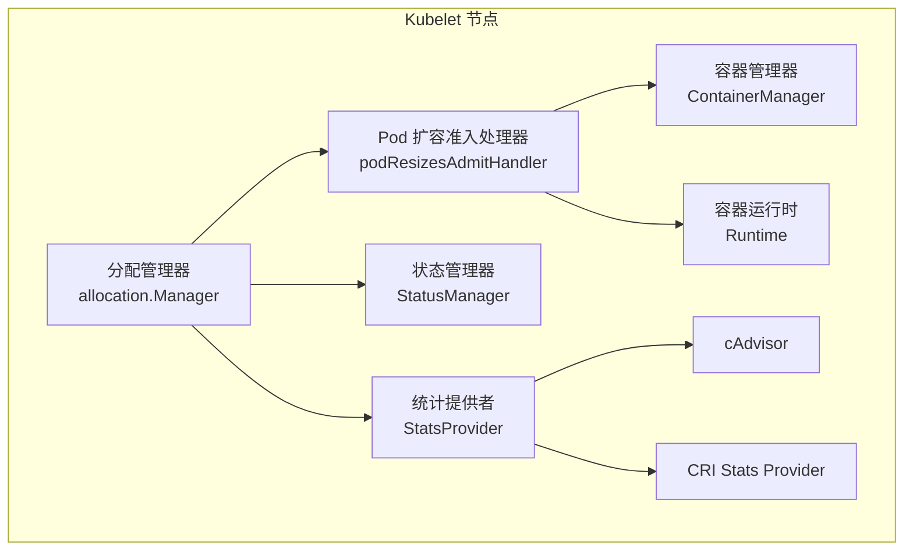
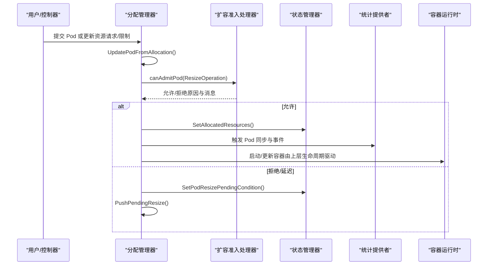
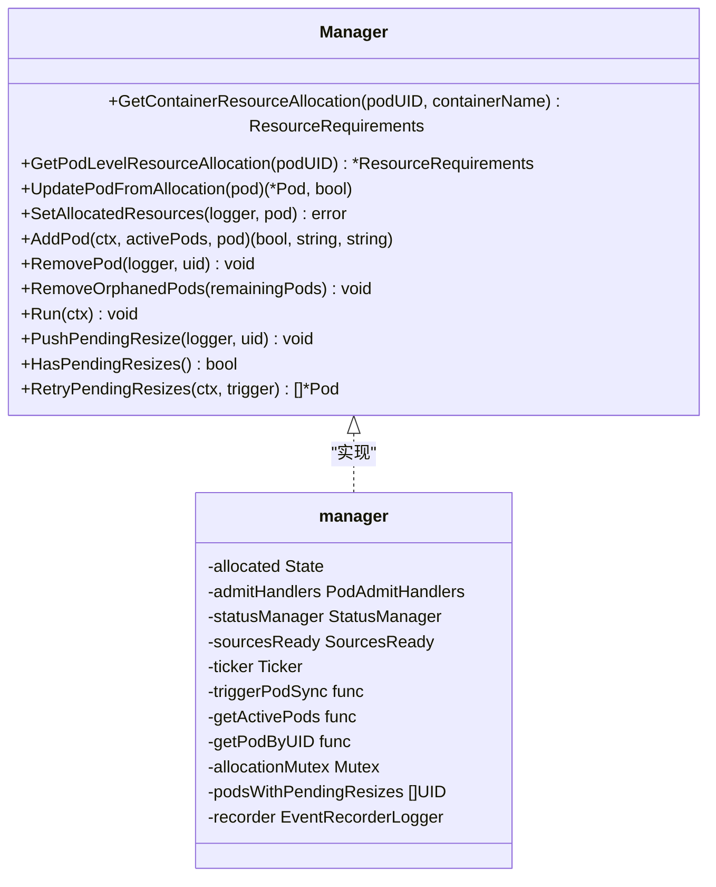
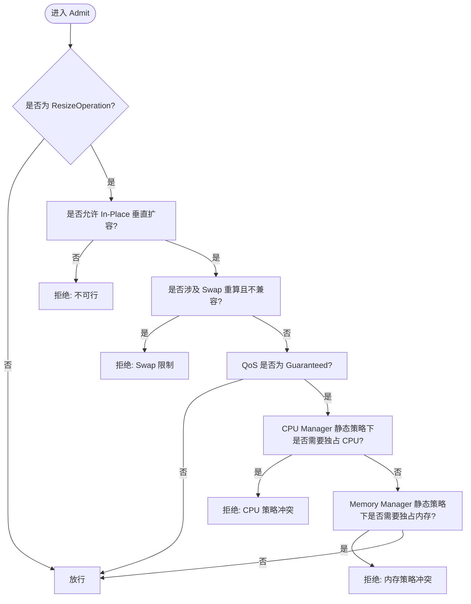
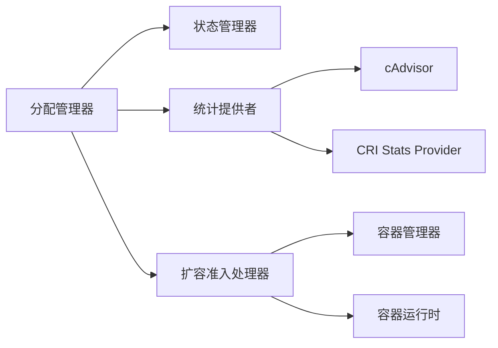

# 资源分配与管理

<cite>
**本文引用的文件**   
- [pkg/kubelet/kubelet_resources.go](file://pkg/kubelet/kubelet_resources.go)
- [pkg/kubelet/allocation/allocation_manager.go](file://pkg/kubelet/allocation/allocation_manager.go)
- [pkg/kubelet/allocation/handlers.go](file://pkg/kubelet/allocation/handlers.go)
- [pkg/kubelet/cadvisor/cadvisor_linux.go](file://pkg/kubelet/cadvisor/cadvisor_linux.go)
- [pkg/kubelet/stats/cadvisor_stats_provider.go](file://pkg/kubelet/stats/cadvisor_stats_provider.go)
- [pkg/kubelet/stats/cri_stats_provider.go](file://pkg/kubelet/stats/cri_stats_provider.go)
</cite>

## 目录
1. [简介](#简介)
2. [项目结构](#项目结构)
3. [核心组件](#核心组件)
4. [架构总览](#架构总览)
5. [详细组件分析](#详细组件分析)
6. [依赖关系分析](#依赖关系分析)
7. [性能考虑](#性能考虑)
8. [故障排查指南](#故障排查指南)
9. [结论](#结论)
10. [附录](#附录)

## 简介
本技术文档聚焦于 Kubelet 在节点侧的容器资源分配与管理，覆盖以下关键主题：
- 容器资源请求与限制（CPU、内存、GPU 与其他设备）的设置与合并策略
- 资源约束执行机制（cgroup 配置、内核参数调优、资源隔离）
- 动态资源调整（In-Place Pod Vertical Scaling）的实现与重试调度
- 资源配额管理与超卖控制，防止资源争用并保障服务质量
- 设备插件集成（GPU、FPGA 等）与资源声明式分配
- 存储资源管理（持久卷挂载、临时存储与缓存策略）
- 资源监控与告警（指标采集、事件上报）
- NUMA 感知与大页内存等特殊资源支持

## 项目结构
围绕资源分配与管理的关键代码主要分布在以下模块：
- 分配管理器与准入处理器：负责 Pod 资源分配、校验、状态持久化与重试
- Downward API 默认限制合并：为 Downward API 提供可分配的节点级或 Pod 级资源视图
- 统计与监控：通过 cAdvisor 与 CRI Stats Provider 采集容器与主机资源使用数据
- 运行时与容器管理器：与底层运行时交互，应用 CPU/Memory Manager 策略与 cgroup 设置

图表来源
- [pkg/kubelet/allocation/allocation_manager.go:110-150](file://pkg/kubelet/allocation/allocation_manager.go#L110-L150)
- [pkg/kubelet/allocation/handlers.go:40-102](file://pkg/kubelet/allocation/handlers.go#L40-L102)
- [pkg/kubelet/stats/cadvisor_stats_provider.go:1-200](file://pkg/kubelet/stats/cadvisor_stats_provider.go#L1-L200)
- [pkg/kubelet/stats/cri_stats_provider.go:1-200](file://pkg/kubelet/stats/cri_stats_provider.go#L1-L200)

章节来源
- [pkg/kubelet/allocation/allocation_manager.go:110-150](file://pkg/kubelet/allocation/allocation_manager.go#L110-L150)
- [pkg/kubelet/allocation/handlers.go:40-102](file://pkg/kubelet/allocation/handlers.go#L40-L102)
- [pkg/kubelet/stats/cadvisor_stats_provider.go:1-200](file://pkg/kubelet/stats/cadvisor_stats_provider.go#L1-L200)
- [pkg/kubelet/stats/cri_stats_provider.go:1-200](file://pkg/kubelet/stats/cri_stats_provider.go#L1-L200)

## 核心组件
- 分配管理器（Allocation Manager）
  - 职责：维护已分配资源的检查点、评估 Pod 是否可被接纳或扩容、处理待处理的扩容队列、触发 Pod 同步与事件记录。
  - 关键能力：读取/写入容器与 Pod 级别的资源分配；根据准入处理器结果决定扩容可行性；周期性重试待处理扩容。
- Pod 扩容准入处理器（Pod Resizes Admit Handler）
  - 职责：在扩容操作时进行策略校验，包括 QoS、CPU/Memory Manager 静态策略、Swap 行为、可重启策略等。
- Downward API 默认限制合并
  - 职责：为 Downward API 暴露“可分配”的资源视图，优先采用 Pod 级别限制（若启用），否则回退到节点 Allocatable。
- 统计与监控
  - 职责：通过 cAdvisor 与 CRI Stats Provider 收集容器与主机资源使用情况，支撑驱逐、度量与诊断。

章节来源
- [pkg/kubelet/allocation/allocation_manager.go:110-150](file://pkg/kubelet/allocation/allocation_manager.go#L110-L150)
- [pkg/kubelet/allocation/handlers.go:40-102](file://pkg/kubelet/allocation/handlers.go#L40-L102)
- [pkg/kubelet/kubelet_resources.go:39-79](file://pkg/kubelet/kubelet_resources.go#L39-L79)
- [pkg/kubelet/stats/cadvisor_stats_provider.go:1-200](file://pkg/kubelet/stats/cadvisor_stats_provider.go#L1-L200)
- [pkg/kubelet/stats/cri_stats_provider.go:1-200](file://pkg/kubelet/stats/cri_stats_provider.go#L1-L200)

## 架构总览
下图展示了从 Pod 更新到资源分配、准入校验、状态持久化与重试的整体流程。

图表来源
- [pkg/kubelet/allocation/allocation_manager.go:539-579](file://pkg/kubelet/allocation/allocation_manager.go#L539-L579)
- [pkg/kubelet/allocation/handlers.go:56-102](file://pkg/kubelet/allocation/handlers.go#L56-L102)

## 详细组件分析

### 分配管理器（Allocation Manager）
- 设计要点
  - 使用内部状态接口保存已分配资源（容器与 Pod 级别），支持检查点持久化与内存模式（测试）。
  - 维护待处理扩容队列，按优先级排序（不增加请求的扩容优先、PriorityClass、QoS、等待时长）。
  - 周期性重试待处理扩容，并在条件变化时触发 Pod 同步与事件。
- 关键方法
  - AddPod：结合已分配 Pod 集合评估新 Pod 是否可被接纳，必要时持久化分配结果。
  - RetryPendingResizes：定时轮询，重新评估待处理扩容，更新状态与事件。
  - UpdatePodFromAllocation：将检查点的分配结果回填到 Pod Spec，供后续逻辑使用。
  - SetAllocatedResources：持久化当前 Pod 的容器与 Pod 级别资源分配。
- 复杂度与性能
  - 排序与重试为 O(n log n) 与 O(n)，n 为待处理扩容数量；通常较小且受定时器节流。
  - 避免不必要的深拷贝，仅在需要时复制 Pod 对象。

图表来源
- [pkg/kubelet/allocation/allocation_manager.go:62-108](file://pkg/kubelet/allocation/allocation_manager.go#L62-L108)
- [pkg/kubelet/allocation/allocation_manager.go:110-150](file://pkg/kubelet/allocation/allocation_manager.go#L110-L150)

章节来源
- [pkg/kubelet/allocation/allocation_manager.go:110-150](file://pkg/kubelet/allocation/allocation_manager.go#L110-L150)
- [pkg/kubelet/allocation/allocation_manager.go:539-579](file://pkg/kubelet/allocation/allocation_manager.go#L539-L579)
- [pkg/kubelet/allocation/allocation_manager.go:294-376](file://pkg/kubelet/allocation/allocation_manager.go#L294-L376)

### Pod 扩容准入处理器（Pod Resizes Admit Handler）
- 设计要点
  - 仅对 ResizeOperation 生效，其他操作直接放行。
  - 校验 In-Place 垂直扩容是否允许；若不允许则标记为不可行。
  - 针对 Swap 行为进行限制：涉及 Swap 重算且不支持的场景直接拒绝。
  - 针对 Guaranteed QoS 与 CPU/Memory Manager 静态策略的兼容性进行判断。
- 关键逻辑
  - disallowResizeForSwappableContainers：检测容器 Swap 行为差异与重启策略，阻止不支持的扩容路径。
  - guaranteedPodResourceResizeRequired：当 QoS=Guaranteed 且资源变更涉及 CPU/Memory 时，需满足额外策略要求。

图表来源
- [pkg/kubelet/allocation/handlers.go:56-102](file://pkg/kubelet/allocation/handlers.go#L56-L102)
- [pkg/kubelet/allocation/handlers.go:104-136](file://pkg/kubelet/allocation/handlers.go#L104-L136)
- [pkg/kubelet/allocation/handlers.go:138-151](file://pkg/kubelet/allocation/handlers.go#L138-L151)

章节来源
- [pkg/kubelet/allocation/handlers.go:40-102](file://pkg/kubelet/allocation/handlers.go#L40-L102)
- [pkg/kubelet/allocation/handlers.go:104-136](file://pkg/kubelet/allocation/handlers.go#L104-L136)
- [pkg/kubelet/allocation/handlers.go:138-151](file://pkg/kubelet/allocation/handlers.go#L138-L151)

### Downward API 默认限制合并
- 设计要点
  - 若启用 Pod 级别资源特性且 Pod 设置了相关限制，则以 Pod 级别限制作为“可分配”资源用于 Downward API。
  - 否则回退到节点的 Allocatable 资源。
  - 合并后应用到每个容器的 Limits，确保 Downward API 可见性与一致性。
- 适用场景
  - 容器内通过 Downward API 获取自身可用的 CPU、内存、临时存储等资源上限。

章节来源
- [pkg/kubelet/kubelet_resources.go:39-79](file://pkg/kubelet/kubelet_resources.go#L39-L79)

### 统计与监控（cAdvisor 与 CRI Stats Provider）
- 设计要点
  - cAdvisor Stats Provider：基于 cAdvisor 采集容器与主机资源使用数据，包括 CPU、内存、文件系统、网络等。
  - CRI Stats Provider：通过 CRI 接口获取更细粒度的运行时统计信息，增强跨运行时的一致性。
- 用途
  - 支撑驱逐策略、资源告警、性能分析与容量规划。

章节来源
- [pkg/kubelet/stats/cadvisor_stats_provider.go:1-200](file://pkg/kubelet/stats/cadvisor_stats_provider.go#L1-L200)
- [pkg/kubelet/stats/cri_stats_provider.go:1-200](file://pkg/kubelet/stats/cri_stats_provider.go#L1-L200)

## 依赖关系分析
- 组件耦合
  - 分配管理器依赖状态接口、准入处理器、状态管理器与统计提供者。
  - 准入处理器依赖容器管理器与运行时以获取策略与 Swap 行为。
- 外部依赖
  - 特征门控（Feature Gates）控制 In-Place 垂直扩容、Pod 级别资源等能力。
  - 运行时与 cAdvisor 提供底层资源隔离与统计能力。

图表来源
- [pkg/kubelet/allocation/allocation_manager.go:110-150](file://pkg/kubelet/allocation/allocation_manager.go#L110-L150)
- [pkg/kubelet/allocation/handlers.go:40-102](file://pkg/kubelet/allocation/handlers.go#L40-L102)
- [pkg/kubelet/stats/cadvisor_stats_provider.go:1-200](file://pkg/kubelet/stats/cadvisor_stats_provider.go#L1-L200)
- [pkg/kubelet/stats/cri_stats_provider.go:1-200](file://pkg/kubelet/stats/cri_stats_provider.go#L1-L200)

章节来源
- [pkg/kubelet/allocation/allocation_manager.go:110-150](file://pkg/kubelet/allocation/allocation_manager.go#L110-L150)
- [pkg/kubelet/allocation/handlers.go:40-102](file://pkg/kubelet/allocation/handlers.go#L40-L102)

## 性能考虑
- 扩容重试与节流
  - 初始重试间隔较短，随后拉长至固定周期，避免频繁评估造成抖动。
- 排序优化
  - 优先处理不增加请求的扩容，减少失败率与系统开销。
- 深拷贝最小化
  - 仅在需要更新 Pod Spec 时进行深拷贝，降低内存压力。
- 统计采集频率
  - 合理设置 cAdvisor/CRI Stats 采样周期，平衡精度与开销。

[本节为通用指导，无需具体文件引用]

## 故障排查指南
- 扩容被拒绝
  - 检查准入处理器返回的原因与消息，常见包括：
    - 不可行（Infeasible）：QoS 与 CPU/Memory Manager 静态策略冲突、Swap 限制、In-Place 扩容不被允许。
    - 延迟（Deferred）：资源不足或策略未就绪，进入待处理队列等待重试。
- 待处理扩容未推进
  - 确认 sourcesReady 是否就绪；查看周期性重试日志与事件。
- 分配状态不一致
  - 核对检查点文件与内存状态；必要时清理孤儿 Pod 的分配状态。
- 资源瓶颈定位
  - 通过 cAdvisor/CRI Stats 提供的指标识别 CPU/内存/IO 热点，结合事件与日志定位根因。

章节来源
- [pkg/kubelet/allocation/allocation_manager.go:539-579](file://pkg/kubelet/allocation/allocation_manager.go#L539-L579)
- [pkg/kubelet/allocation/handlers.go:56-102](file://pkg/kubelet/allocation/handlers.go#L56-L102)
- [pkg/kubelet/stats/cadvisor_stats_provider.go:1-200](file://pkg/kubelet/stats/cadvisor_stats_provider.go#L1-L200)
- [pkg/kubelet/stats/cri_stats_provider.go:1-200](file://pkg/kubelet/stats/cri_stats_provider.go#L1-L200)

## 结论
Kubelet 的资源分配与管理通过分配管理器与准入处理器协同工作，实现了安全的 In-Place 垂直扩容与 Pod 级别资源管理。配合 cAdvisor 与 CRI Stats Provider 的统计能力，系统能够及时识别资源瓶颈并做出自适应调整。在生产环境中，建议结合 QoS、CPU/Memory Manager 策略与特征门控，制定合理的扩容策略与监控告警体系，以确保服务稳定性与资源利用率。

[本节为总结性内容，无需具体文件引用]

## 附录

### 资源请求与限制设置要点
- CPU/内存
  - 建议在 Deployment/StatefulSet 中明确设置 requests 与 limits，便于调度与隔离。
  - 对于高优先级服务，使用 Guaranteed QoS 以获得更强隔离与抢占优势。
- GPU/设备资源
  - 通过设备插件与 ResourceClaim 声明式分配，结合调度器与 Kubelet 的设备管理能力进行分配。
- 存储资源
  - 使用 PersistentVolume/PersistentVolumeClaim 管理持久化存储；EmptyDir 用于临时存储与缓存。
  - 关注节点磁盘空间与 inode 使用，避免写放大影响性能。

[本节为概念性说明，无需具体文件引用]