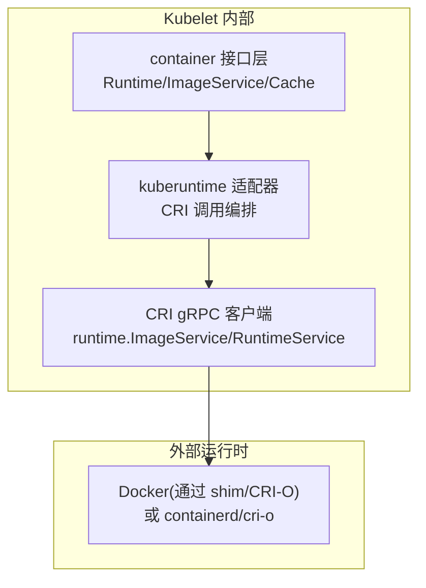
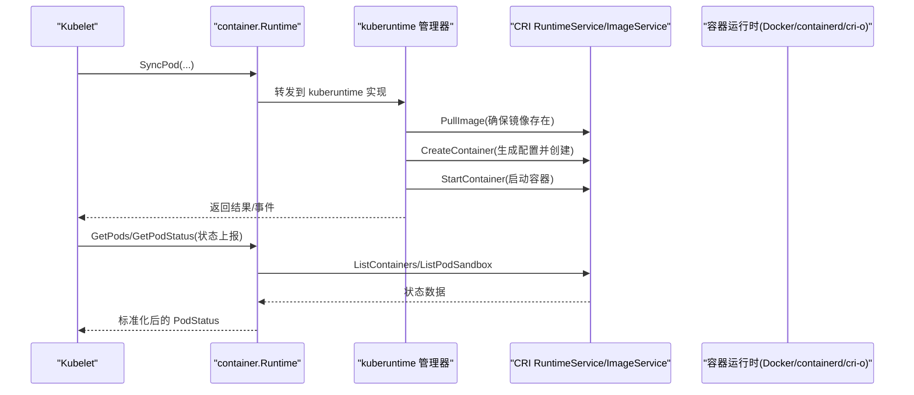
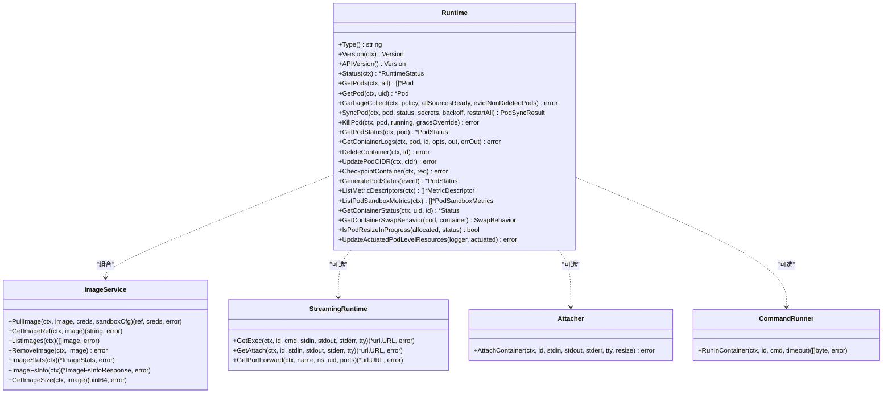
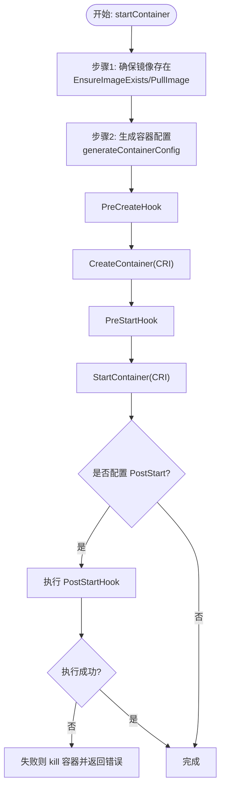
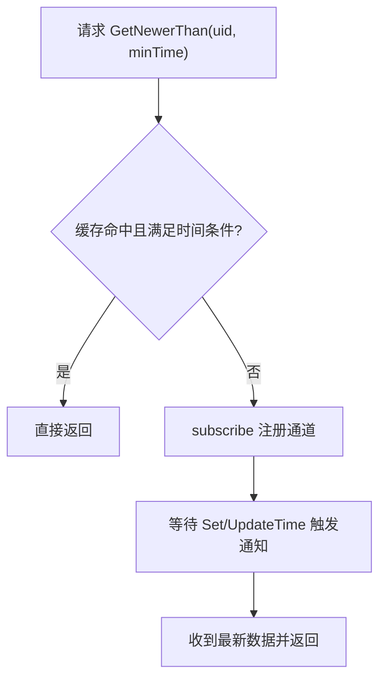
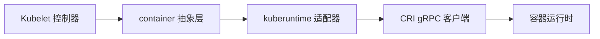

# 容器生命周期管理

<cite>
**本文引用的文件**   
- [pkg/kubelet/container/runtime.go](file://pkg/kubelet/container/runtime.go)
- [pkg/kubelet/kuberuntime/kuberuntime_container.go](file://pkg/kubelet/kuberuntime/kuberuntime_container.go)
- [pkg/kubelet/container/cache.go](file://pkg/kubelet/container/cache.go)
- [pkg/kubelet/container/runtime_cache.go](file://pkg/kubelet/container/runtime_cache.go)
- [staging/src/k8s.io/cri-api/pkg/apis/runtime/v1/api.proto](file://staging/src/k8s.io/cri-api/pkg/apis/runtime/v1/api.proto)
</cite>

## 目录
1. [简介](#简介)
2. [项目结构](#项目结构)
3. [核心组件](#核心组件)
4. [架构总览](#架构总览)
5. [详细组件分析](#详细组件分析)
6. [依赖关系分析](#依赖关系分析)
7. [性能考量](#性能考量)
8. [故障排查指南](#故障排查指南)
9. [结论](#结论)
10. [附录](#附录)

## 简介
本技术文档聚焦于 Kubelet 的容器生命周期管理，围绕运行时抽象层、CRI 适配、镜像拉取与容器创建/启动/停止/删除流程、缓存机制、状态监控与日志收集、资源隔离与安全上下文、命名空间管理以及调试与排障进行系统化说明。读者无需深入源码即可理解整体设计与关键实现路径。

## 项目结构
Kubelet 对容器运行时的抽象位于 container 包，具体 CRI 适配与生命周期编排位于 kuberuntime 子包；CRI 协议定义在 staging 的 cri-api 中。

图表来源
- [pkg/kubelet/container/runtime.go:71-154](file://pkg/kubelet/container/runtime.go#L71-L154)
- [pkg/kubelet/kuberuntime/kuberuntime_container.go:194-340](file://pkg/kubelet/kuberuntime/kuberuntime_container.go#L194-L340)
- [staging/src/k8s.io/cri-api/pkg/apis/runtime/v1/api.proto:24-247](file://staging/src/k8s.io/cri-api/pkg/apis/runtime/v1/api.proto#L24-L247)

章节来源
- [pkg/kubelet/container/runtime.go:71-154](file://pkg/kubelet/container/runtime.go#L71-L154)
- [pkg/kubelet/kuberuntime/kuberuntime_container.go:194-340](file://pkg/kubelet/kuberuntime/kuberuntime_container.go#L194-L340)
- [staging/src/k8s.io/cri-api/pkg/apis/runtime/v1/api.proto:24-247](file://staging/src/k8s.io/cri-api/pkg/apis/runtime/v1/api.proto#L24-L247)

## 核心组件
- 运行时抽象接口
  - Runtime：统一 Pod/Container 生命周期操作（同步、终止、垃圾回收、日志、指标等）
  - ImageService：镜像拉取、查询、删除、统计
  - StreamingRuntime/Attacher/CommandRunner：流式 exec/attach/port-forward、命令执行能力
- 数据模型
  - Pod/Container/PodStatus/Status：描述运行时可见的 Pod、容器及其状态
  - ContainerID/State/Mount/PortMapping/DeviceInfo/CDIDevice：标识、状态、挂载、端口映射、设备信息
- 缓存
  - Cache：Pod 状态缓存，支持 Get/GetNewerThan/Set/UpdateTime 等
  - RuntimeCache：Pod 列表缓存，带过期刷新策略

章节来源
- [pkg/kubelet/container/runtime.go:71-154](file://pkg/kubelet/container/runtime.go#L71-L154)
- [pkg/kubelet/container/runtime.go:170-191](file://pkg/kubelet/container/runtime.go#L170-L191)
- [pkg/kubelet/container/runtime.go:205-414](file://pkg/kubelet/container/runtime.go#L205-L414)
- [pkg/kubelet/container/cache.go:28-98](file://pkg/kubelet/container/cache.go#L28-L98)
- [pkg/kubelet/container/runtime_cache.go:26-98](file://pkg/kubelet/container/runtime_cache.go#L26-L98)

## 架构总览
Kubelet 通过 container.Runtime 接口屏蔽底层差异，由 kuberuntime 将 Kubernetes 语义转换为 CRI 调用，最终与任意符合 CRI 规范的运行时交互。

图表来源
- [pkg/kubelet/kuberuntime/kuberuntime_container.go:194-340](file://pkg/kubelet/kuberuntime/kuberuntime_container.go#L194-L340)
- [staging/src/k8s.io/cri-api/pkg/apis/runtime/v1/api.proto:24-247](file://staging/src/k8s.io/cri-api/pkg/apis/runtime/v1/api.proto#L24-L247)

## 详细组件分析

### 运行时抽象层设计（container.Runtime）
- 职责边界
  - 提供 Type/Version/APIVersion/Status 等元信息与能力探测
  - 暴露 GetPods/GetPod/GetPodStatus 等状态查询
  - 暴露 SyncPod/KillPod/DeleteContainer 等生命周期控制
  - 暴露 ImageService 镜像相关能力
  - 暴露 UpdatePodCIDR/CheckpointContainer/GeneratePodStatus/ListMetricDescriptors/ListPodSandboxMetrics 等扩展能力
- 线程安全要求
  - 接口实现需保证并发安全
- 错误与状态
  - 定义 ErrPodNotFound 等常见错误
  - 使用 RuntimeStatus/RuntimeCondition/RuntimeHandler/RuntimeFeatures 表达运行时健康与特性

图表来源
- [pkg/kubelet/container/runtime.go:71-154](file://pkg/kubelet/container/runtime.go#L71-L154)
- [pkg/kubelet/container/runtime.go:161-203](file://pkg/kubelet/container/runtime.go#L161-L203)
- [pkg/kubelet/container/runtime.go:170-191](file://pkg/kubelet/container/runtime.go#L170-L191)

章节来源
- [pkg/kubelet/container/runtime.go:71-154](file://pkg/kubelet/container/runtime.go#L71-L154)
- [pkg/kubelet/container/runtime.go:161-203](file://pkg/kubelet/container/runtime.go#L161-L203)
- [pkg/kubelet/container/runtime.go:170-191](file://pkg/kubelet/container/runtime.go#L170-L191)

### 容器完整生命周期（CRI 适配层）
- 阶段概览
  - 镜像拉取：EnsureImageExists -> PullImage
  - 容器创建：generateContainerConfig -> CreateContainer
  - 容器启动：StartContainer
  - 生命周期钩子：PreCreate/PreStart/PostStart
  - 日志与终止消息：LogPath/TerminationMessagePath
  - 资源更新：UpdateContainerResources/UpdatePodSandboxResources
  - 停止与删除：StopContainer/RemoveContainer
- 关键实现要点
  - 根据 Pod 的 RuntimeClass 解析 runtime handler
  - 计算重启次数（结合日志目录恢复）
  - 生成容器配置（环境变量、挂载、设备、CDI 设备、平台特定配置）
  - 记录事件与错误分类（FailedToCreateContainer/FailedToStartContainer 等）
  - 兼容旧版 CRI 字段（如 ImageId）

图表来源
- [pkg/kubelet/kuberuntime/kuberuntime_container.go:194-340](file://pkg/kubelet/kuberuntime/kuberuntime_container.go#L194-L340)
- [staging/src/k8s.io/cri-api/pkg/apis/runtime/v1/api.proto:65-106](file://staging/src/k8s.io/cri-api/pkg/apis/runtime/v1/api.proto#L65-L106)

章节来源
- [pkg/kubelet/kuberuntime/kuberuntime_container.go:194-340](file://pkg/kubelet/kuberuntime/kuberuntime_container.go#L194-L340)
- [staging/src/k8s.io/cri-api/pkg/apis/runtime/v1/api.proto:65-106](file://staging/src/k8s.io/cri-api/pkg/apis/runtime/v1/api.proto#L65-L106)

### 镜像拉取与镜像服务
- 能力
  - PullImage：按 ImageSpec 和凭据拉取镜像，返回引用与使用的凭据
  - GetImageRef/ListImages/RemoveImage/ImageStats/ImageFsInfo/GetImageSize
- 与 CRI 的对应
  - ImageService.PullImage -> CRI ImageService.PullImage
  - ImageService.ListImages -> CRI ImageService.ListImages/StreamImages
  - ImageService.ImageFsInfo -> CRI ImageService.ImageFsInfo

章节来源
- [pkg/kubelet/container/runtime.go:170-191](file://pkg/kubelet/container/runtime.go#L170-L191)
- [staging/src/k8s.io/cri-api/pkg/apis/runtime/v1/api.proto:210-247](file://staging/src/k8s.io/cri-api/pkg/apis/runtime/v1/api.proto#L210-L247)

### 容器状态监控与日志收集
- 状态获取
  - GetPodStatus/GetContainerStatus：从 CRI 拉取容器与沙箱状态，转换为 kubecontainer.Status
  - 兼容旧字段（ImageId）、补充资源与用户信息、StopSignal 等
- 日志与终止消息
  - LogPath：CRI 标准日志路径
  - TerminationMessagePath：优先读取挂载文件，否则回退到日志尾部
  - 兼容历史符号链接以支持集群日志系统
- 事件与指标
  - recordContainerEvent：规范化事件内容，避免泄露敏感信息
  - ListMetricDescriptors/ListPodSandboxMetrics：CRI 指标能力

章节来源
- [pkg/kubelet/kuberuntime/kuberuntime_container.go:585-606](file://pkg/kubelet/kuberuntime/kuberuntime_container.go#L585-L606)
- [pkg/kubelet/kuberuntime/kuberuntime_container.go:688-780](file://pkg/kubelet/kuberuntime/kuberuntime_container.go#L688-L780)
- [staging/src/k8s.io/cri-api/pkg/apis/runtime/v1/api.proto:166-191](file://staging/src/k8s.io/cri-api/pkg/apis/runtime/v1/api.proto#L166-L191)

### 容器缓存机制
- Pod 状态缓存（Cache）
  - 支持非阻塞 Get 与阻塞 GetNewerThan
  - Set/UpdateTime/SetObservedTime 驱动失效与订阅通知
  - 全局时间戳与条目级 modified/observedTime 共同决定“新鲜度”
- Pod 列表缓存（RuntimeCache）
  - 基于 cachePeriod 的过期策略，超时后强制刷新
  - ForceUpdateIfOlder 用于强一致场景下的按需刷新

图表来源
- [pkg/kubelet/container/cache.go:94-161](file://pkg/kubelet/container/cache.go#L94-L161)
- [pkg/kubelet/container/cache.go:181-241](file://pkg/kubelet/container/cache.go#L181-L241)
- [pkg/kubelet/container/runtime_cache.go:36-98](file://pkg/kubelet/container/runtime_cache.go#L36-L98)

章节来源
- [pkg/kubelet/container/cache.go:28-98](file://pkg/kubelet/container/cache.go#L28-L98)
- [pkg/kubelet/container/cache.go:94-161](file://pkg/kubelet/container/cache.go#L94-L161)
- [pkg/kubelet/container/cache.go:181-241](file://pkg/kubelet/container/cache.go#L181-L241)
- [pkg/kubelet/container/runtime_cache.go:36-98](file://pkg/kubelet/container/runtime_cache.go#L36-L98)

### 资源隔离、安全上下文与命名空间管理
- 资源隔离
  - 容器级别：UpdateContainerResources 同步更新 cgroup 资源
  - Pod 级别：UpdatePodSandboxResources 更新沙箱资源（best-effort，未实现时不阻塞）
- 安全上下文
  - LinuxSandboxSecurityContext：run_as_user/group、readonly_rootfs、supplemental_groups、privileged、seccomp/apparmor 等
  - SupplementalGroupsPolicy：Merge/Strict 两种策略
- 命名空间
  - NamespaceOption：network/pid/ipc/target 模式，支持 USER namespace 映射
  - 目标容器共享命名空间（TARGET）用于临时容器等场景

章节来源
- [pkg/kubelet/kuberuntime/kuberuntime_container.go:410-454](file://pkg/kubelet/kuberuntime/kuberuntime_container.go#L410-L454)
- [staging/src/k8s.io/cri-api/pkg/apis/runtime/v1/api.proto:456-536](file://staging/src/k8s.io/cri-api/pkg/apis/runtime/v1/api.proto#L456-L536)
- [staging/src/k8s.io/cri-api/pkg/apis/runtime/v1/api.proto:371-434](file://staging/src/k8s.io/cri-api/pkg/apis/runtime/v1/api.proto#L371-L434)

### 与不同容器运行时的适配
- 适配原则
  - 通过 CRI 统一接口对接 Docker（经由 shim）、containerd、CRI-O 等
  - 利用 RuntimeHandler/RuntimeClass 选择不同后端
- 兼容性处理
  - 兼容旧版 CRI 字段（如 ImageId）
  - 针对部分运行时未实现的 API 做 best-effort 处理（例如 UpdatePodSandboxResources）

章节来源
- [staging/src/k8s.io/cri-api/pkg/apis/runtime/v1/api.proto:24-247](file://staging/src/k8s.io/cri-api/pkg/apis/runtime/v1/api.proto#L24-L247)
- [pkg/kubelet/kuberuntime/kuberuntime_container.go:432-454](file://pkg/kubelet/kuberuntime/kuberuntime_container.go#L432-L454)

## 依赖关系分析
- 模块耦合
  - kuberuntime 依赖 container 抽象与 CRI 客户端
  - container 抽象解耦上层业务与底层运行时
- 外部依赖
  - CRI gRPC 服务（RuntimeService/ImageService）
  - 操作系统能力（文件系统、SELinux、进程信号等）

图表来源
- [pkg/kubelet/container/runtime.go:71-154](file://pkg/kubelet/container/runtime.go#L71-L154)
- [pkg/kubelet/kuberuntime/kuberuntime_container.go:194-340](file://pkg/kubelet/kuberuntime/kuberuntime_container.go#L194-L340)
- [staging/src/k8s.io/cri-api/pkg/apis/runtime/v1/api.proto:24-247](file://staging/src/k8s.io/cri-api/pkg/apis/runtime/v1/api.proto#L24-L247)

章节来源
- [pkg/kubelet/container/runtime.go:71-154](file://pkg/kubelet/container/runtime.go#L71-L154)
- [pkg/kubelet/kuberuntime/kuberuntime_container.go:194-340](file://pkg/kubelet/kuberuntime/kuberuntime_container.go#L194-L340)
- [staging/src/k8s.io/cri-api/pkg/apis/runtime/v1/api.proto:24-247](file://staging/src/k8s.io/cri-api/pkg/apis/runtime/v1/api.proto#L24-L247)

## 性能考量
- 缓存优化
  - Pod 状态缓存采用全局时间戳与条目级时间戳联合判定，减少不必要的全量刷新
  - RuntimeCache 基于周期阈值刷新，降低频繁 I/O 开销
- 流式接口
  - CRI 提供 Stream* 系列接口，避免大对象传输导致的 gRPC 限制
- 资源更新
  - Pod 级别资源更新为 best-effort，避免因未实现而阻塞扩容流程
- 事件去重
  - 事件消息替换不稳定 ID，降低事件风暴风险

[本节为通用指导，不直接分析具体文件]

## 故障排查指南
- 常见问题定位
  - 镜像拉取失败：检查 EnsureImageExists 返回值与事件 FailedToCreateContainer
  - 容器创建失败：关注 CreateContainer 错误码与事件 FailedToCreateContainer
  - 容器启动失败：关注 StartContainer 错误码与事件 FailedToStartContainer
  - PostStartHook 失败：查看 Hook 执行日志与事件 FailedPostStartHook
  - 资源更新失败：观察 UpdateContainerResources/UpdatePodSandboxResources 的错误码与 best-effort 行为
- 日志与终止消息
  - 优先读取 TerminationMessagePath 挂载文件，必要时回退到日志尾部
  - 注意历史符号链接兼容逻辑
- 状态不一致
  - 使用 GetNewerThan 等待最新状态，或强制刷新 RuntimeCache
- 事件与指标
  - 通过 ListMetricDescriptors/ListPodSandboxMetrics 获取运行时指标
  - 关注 recordContainerEvent 输出，避免敏感信息泄露

章节来源
- [pkg/kubelet/kuberuntime/kuberuntime_container.go:194-340](file://pkg/kubelet/kuberuntime/kuberuntime_container.go#L194-L340)
- [pkg/kubelet/kuberuntime/kuberuntime_container.go:585-606](file://pkg/kubelet/kuberuntime/kuberuntime_container.go#L585-L606)
- [pkg/kubelet/container/runtime_cache.go:60-98](file://pkg/kubelet/container/runtime_cache.go#L60-L98)
- [staging/src/k8s.io/cri-api/pkg/apis/runtime/v1/api.proto:166-191](file://staging/src/k8s.io/cri-api/pkg/apis/runtime/v1/api.proto#L166-L191)

## 结论
Kubelet 通过清晰的运行时抽象与 CRI 适配层，实现了跨多种容器运行时的统一生命周期管理。配合高效的缓存机制、完善的日志与事件体系、以及对资源与安全能力的精细控制，能够在大规模节点上稳定高效地管理容器。未来可继续借助 CRI 的流式接口与最佳实践，进一步优化吞吐与一致性。

[本节为总结性内容，不直接分析具体文件]

## 附录
- 术语
  - CRI：容器运行时接口
  - Sandbox：Pod 级沙箱，承载网络、命名空间等共享环境
  - RuntimeHandler：运行时处理器，用于选择不同后端
- 参考
  - CRI 协议定义见 api.proto
  - Kubelet 容器生命周期主流程见 kuberuntime_container.go

[本节为补充信息，不直接分析具体文件]