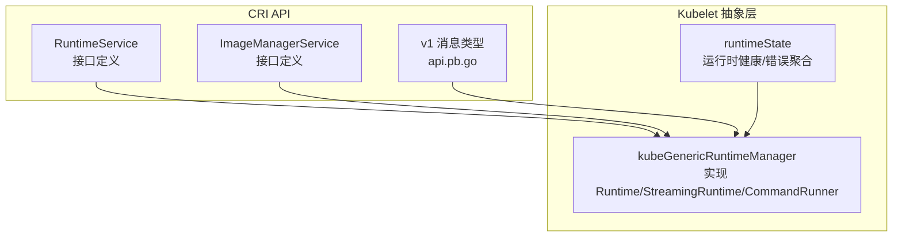
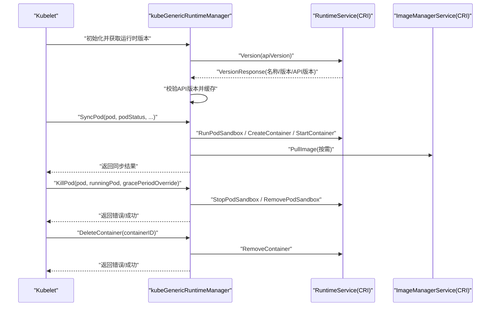
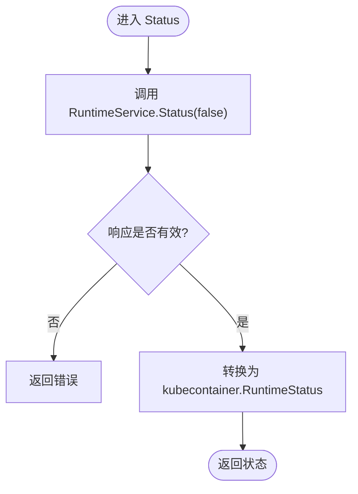
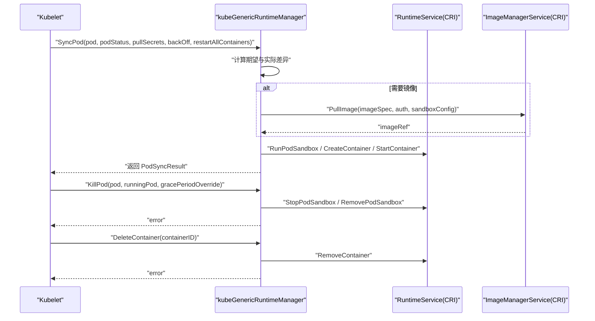
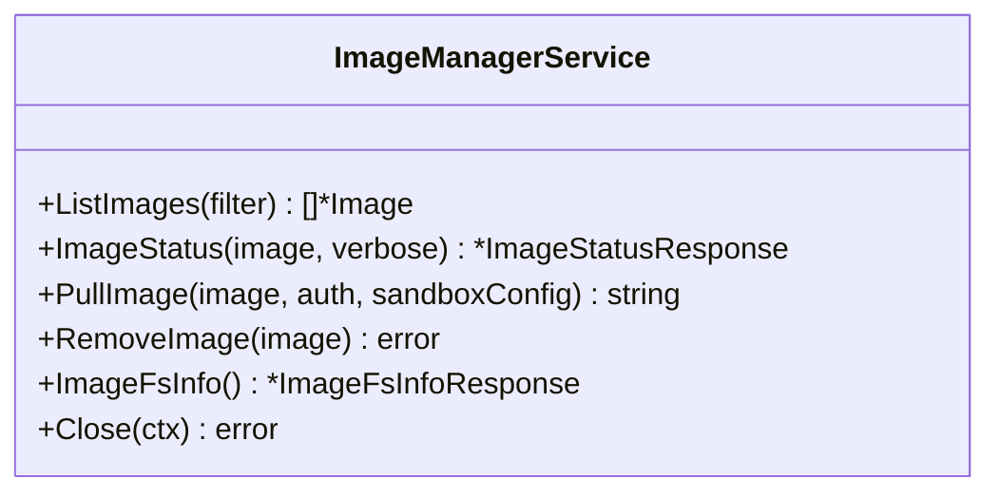
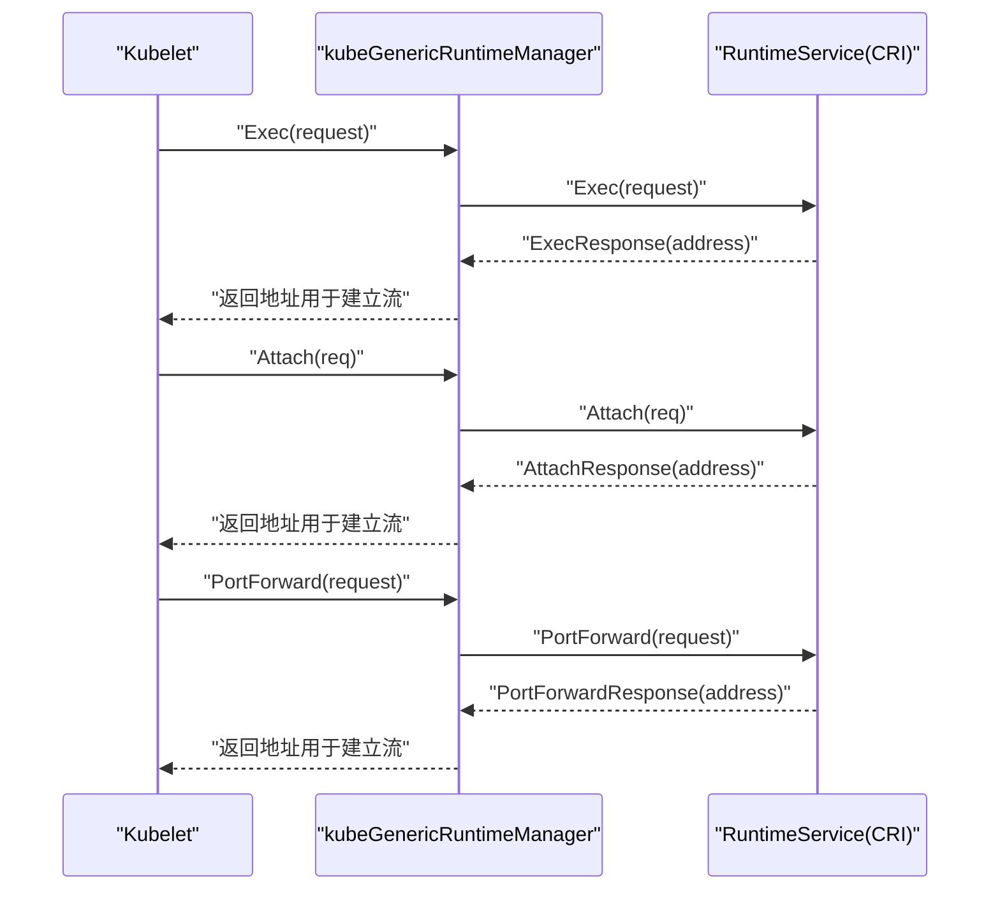
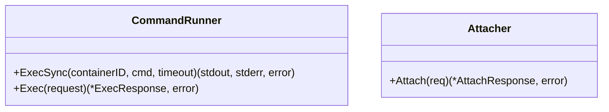
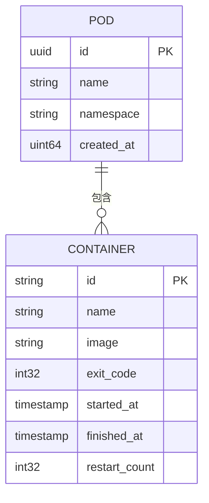
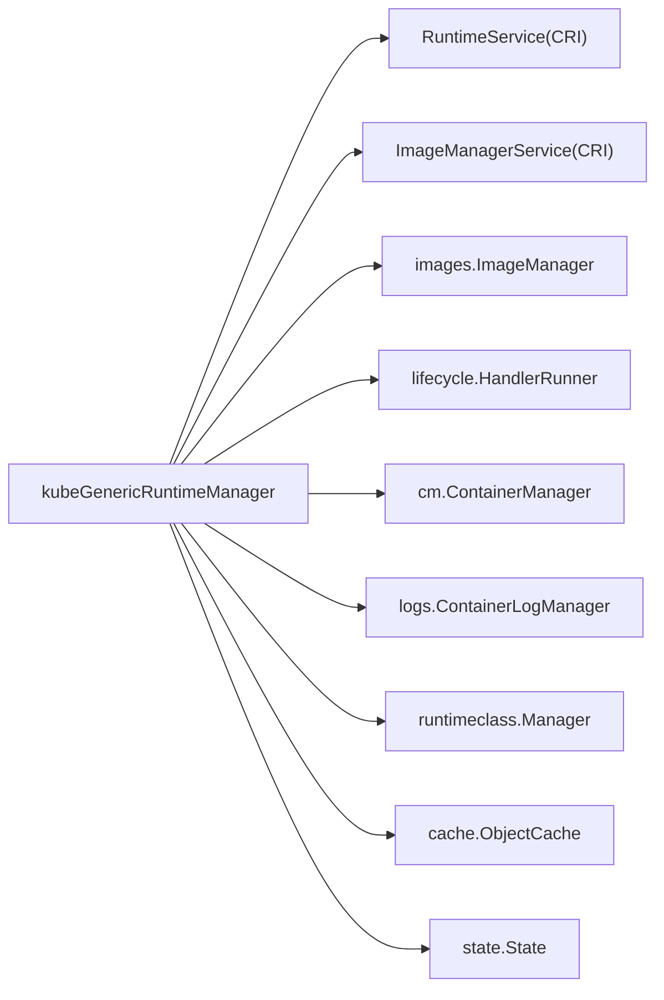

# 容器运行时接口

<cite>
**本文引用的文件**
- [services.go](file://staging/src/k8s.io/cri-api/pkg/apis/services.go)
- [api.pb.go](file://staging/src/k8s.io/cri-api/pkg/apis/runtime/v1/api.pb.go)
- [kuberuntime_manager.go](file://pkg/kubelet/kuberuntime/kuberuntime_manager.go)
- [kuberuntime_container.go](file://pkg/kubelet/kuberuntime/kuberuntime_container.go)
- [runtime.go](file://pkg/kubelet/runtime.go)
</cite>

## 目录
1. [简介](#简介)
2. [项目结构](#项目结构)
3. [核心组件](#核心组件)
4. [架构总览](#架构总览)
5. [详细组件分析](#详细组件分析)
6. [依赖关系分析](#依赖关系分析)
7. [性能考量](#性能考量)
8. [故障排查指南](#故障排查指南)
9. [结论](#结论)
10. [附录](#附录)

## 简介
本文件面向Kubernetes Kubelet的容器运行时接口（CRI）实现与使用，聚焦以下目标：
- 解释Runtime接口的核心设计，包括Type()、Version()、Status()等基础方法的实现原理。
- 详细说明容器生命周期管理方法SyncPod()、KillPod()、DeleteContainer()的调用流程与参数处理。
- 文档化ImageService接口中镜像拉取、查询、删除等操作的具体实现路径。
- 解释StreamingRuntime接口如何处理exec、attach、port-forward等流式操作。
- 说明Attacher和CommandRunner接口的设计目的和使用场景。
- 梳理关键数据结构（Pod、Container、Status等）字段定义与状态转换逻辑。
- 对比不同容器运行时（Docker、containerd、CRI-O）对接口的具体实现差异。

## 项目结构
围绕CRI在Kubelet中的集成，主要涉及以下层次：
- CRI API定义层：提供gRPC服务接口与消息类型（RuntimeService、ImageManagerService等）。
- Kubelet抽象层：kubeGenericRuntimeManager将CRI gRPC客户端封装为Kubelet内部使用的统一接口。
- 运行时状态与健康检查：runtimeState维护运行时健康、网络、存储等状态。

图表来源
- [services.go:112-146](file://staging/src/k8s.io/cri-api/pkg/apis/services.go#L112-L146)
- [api.pb.go:1-200](file://staging/src/k8s.io/cri-api/pkg/apis/runtime/v1/api.pb.go#L1-L200)
- [kuberuntime_manager.go:114-200](file://pkg/kubelet/kuberuntime/kuberuntime_manager.go#L114-L200)
- [runtime.go:30-170](file://pkg/kubelet/runtime.go#L30-L170)

章节来源
- [services.go:112-146](file://staging/src/k8s.io/cri-api/pkg/apis/services.go#L112-L146)
- [api.pb.go:1-200](file://staging/src/k8s.io/cri-api/pkg/apis/runtime/v1/api.pb.go#L1-L200)
- [kuberuntime_manager.go:114-200](file://pkg/kubelet/kuberuntime/kuberuntime_manager.go#L114-L200)
- [runtime.go:30-170](file://pkg/kubelet/runtime.go#L30-L170)

## 核心组件
- CRI接口定义
  - RuntimeService：包含版本查询、沙箱与容器管理、统计、配置更新、状态查询、关闭连接等能力。
  - ImageManagerService：包含镜像列表、镜像状态、拉取、删除、镜像文件系统信息等能力。
- Kubelet侧实现
  - kubeGenericRuntimeManager：实现Kubelet内部统一的Runtime/StreamingRuntime/CommandRunner接口，封装CRI gRPC客户端，负责版本校验、缓存、事件记录、资源管理等。
  - runtimeState：维护运行时健康检查、网络/存储错误、运行时处理器与特性等信息。

章节来源
- [services.go:26-146](file://staging/src/k8s.io/cri-api/pkg/apis/services.go#L26-L146)
- [kuberuntime_manager.go:114-200](file://pkg/kubelet/kuberuntime/kuberuntime_manager.go#L114-L200)
- [runtime.go:30-170](file://pkg/kubelet/runtime.go#L30-L170)

## 架构总览
Kubelet通过kubeGenericRuntimeManager与CRI运行时通信，完成Pod/容器的创建、启动、停止、删除、日志、执行命令、端口转发等。

图表来源
- [kuberuntime_manager.go:214-381](file://pkg/kubelet/kuberuntime/kuberuntime_manager.go#L214-L381)
- [kuberuntime_manager.go:403-437](file://pkg/kubelet/kuberuntime/kuberuntime_manager.go#L403-L437)
- [kuberuntime_manager.go:1475-1600](file://pkg/kubelet/kuberuntime/kuberuntime_manager.go#L1475-L1600)
- [kuberuntime_manager.go:2005-2100](file://pkg/kubelet/kuberuntime/kuberuntime_manager.go#L2005-L2100)
- [kuberuntime_container.go:1435-1500](file://pkg/kubelet/kuberuntime/kuberuntime_container.go#L1435-L1500)
- [services.go:112-146](file://staging/src/k8s.io/cri-api/pkg/apis/services.go#L112-L146)

## 详细组件分析

### 基础方法：Type()、Version()、Status()
- Type()
  - 返回运行时名称，来源于初始化时从CRI获取的版本响应中的RuntimeName。
- Version()
  - 调用CRI RuntimeService.Version(apiVersion)，解析并返回语义化版本对象；失败则向上返回错误。
- Status()
  - 调用CRI RuntimeService.Status(verbose=false)，将CRI的状态转换为Kubelet内部RuntimeStatus，包含运行时处理器与特性信息。

图表来源
- [kuberuntime_manager.go:403-437](file://pkg/kubelet/kuberuntime/kuberuntime_manager.go#L403-L437)
- [services.go:112-128](file://staging/src/k8s.io/cri-api/pkg/apis/services.go#L112-L128)

章节来源
- [kuberuntime_manager.go:383-437](file://pkg/kubelet/kuberuntime/kuberuntime_manager.go#L383-L437)
- [services.go:112-128](file://staging/src/k8s.io/cri-api/pkg/apis/services.go#L112-L128)

### 容器生命周期管理：SyncPod()、KillPod()、DeleteContainer()
- SyncPod()
  - 根据Pod期望状态与当前运行时状态进行差异计算，协调沙箱与容器的创建、启动、更新、删除等操作；必要时触发镜像拉取。
- KillPod()
  - 对Pod的沙箱执行停止与移除，支持优雅终止宽限期覆盖；若存在运行中容器，强制终止。
- DeleteContainer()
  - 针对单个容器执行移除操作，通常由GC或特定清理流程触发。

图表来源
- [kuberuntime_manager.go:1475-1600](file://pkg/kubelet/kuberuntime/kuberuntime_manager.go#L1475-L1600)
- [kuberuntime_manager.go:2005-2100](file://pkg/kubelet/kuberuntime/kuberuntime_manager.go#L2005-L2100)
- [kuberuntime_container.go:1435-1500](file://pkg/kubelet/kuberuntime/kuberuntime_container.go#L1435-L1500)
- [services.go:67-110](file://staging/src/k8s.io/cri-api/pkg/apis/services.go#L67-L110)

章节来源
- [kuberuntime_manager.go:1475-1600](file://pkg/kubelet/kuberuntime/kuberuntime_manager.go#L1475-L1600)
- [kuberuntime_manager.go:2005-2100](file://pkg/kubelet/kuberuntime/kuberuntime_manager.go#L2005-L2100)
- [kuberuntime_container.go:1435-1500](file://pkg/kubelet/kuberuntime/kuberuntime_container.go#L1435-L1500)

### 镜像服务：ImageService接口
- ListImages：列出本地已有镜像。
- ImageStatus：查询指定镜像的详细状态。
- PullImage：按认证信息与沙箱配置拉取镜像，返回镜像引用。
- RemoveImage：删除指定镜像。
- ImageFsInfo：返回镜像存储的文件系统信息（只读层与可写层）。

图表来源
- [services.go:130-146](file://staging/src/k8s.io/cri-api/pkg/apis/services.go#L130-L146)

章节来源
- [services.go:130-146](file://staging/src/k8s.io/cri-api/pkg/apis/services.go#L130-L146)

### 流式操作：StreamingRuntime接口
- Exec：准备一个流式端点以在容器中执行命令，返回服务端地址供后续建立双向流。
- Attach：准备一个流式端点以附加到运行中的容器，返回服务端地址。
- PortForward：准备一个流式端点以将PodSandbox的端口转发到本地，返回服务端地址。

图表来源
- [services.go:50-84](file://staging/src/k8s.io/cri-api/pkg/apis/services.go#L50-L84)

章节来源
- [services.go:50-84](file://staging/src/k8s.io/cri-api/pkg/apis/services.go#L50-L84)

### Attacher与CommandRunner接口
- CommandRunner：用于在容器内执行命令（如探针、生命周期钩子），支持同步执行与流式执行两种模式。
- Attacher：用于附加到运行中的容器，便于交互式调试或日志采集。

图表来源
- [services.go:50-56](file://staging/src/k8s.io/cri-api/pkg/apis/services.go#L50-L56)

章节来源
- [services.go:50-56](file://staging/src/k8s.io/cri-api/pkg/apis/services.go#L50-L56)

### 数据结构与状态转换
- Pod
  - 标识：UID、Name、Namespace。
  - 时间戳：CreatedAt、Timestamp。
  - 关联：Sandboxes、Containers集合。
- Container
  - 标识：ID、Name、Image、Labels等。
  - 状态：状态码、退出码、开始/结束时间、重启次数等。
- Status
  - 运行时状态：整体健康、处理器列表、特性集。
  - 容器状态：各容器独立状态，用于探针与调度决策。

图表来源
- [kuberuntime_manager.go:481-556](file://pkg/kubelet/kuberuntime/kuberuntime_manager.go#L481-L556)

章节来源
- [kuberuntime_manager.go:481-556](file://pkg/kubelet/kuberuntime/kuberuntime_manager.go#L481-L556)

### 不同运行时实现差异对比（Docker、containerd、CRI-O）
- Docker
  - 历史演进：早期非CRI实现已移除，现通过CRI兼容层接入；CRI v1为默认API版本。
  - 特点：基于OCI运行时，遵循CRI标准接口；在Kubelet中通过CRI客户端访问。
- containerd
  - 演进：CRI实现逐步完善，现已全面支持CRI v1；具备完整的沙箱与镜像管理能力。
  - 特点：轻量内核、高性能，广泛作为生产环境默认选择。
- CRI-O
  - 定位：专为Kubernetes设计的OCI运行时，原生CRI实现，通过全部节点级测试。
  - 特点：与Kubernetes深度集成，强调安全与合规。

章节来源
- [CHANGELOG-1.23.md:2281-2287](file://CHANGELOG/CHANGELOG-1.23.md#L2281-L2287)
- [CHANGELOG-1.7.md:1709-1723](file://CHANGELOG/CHANGELOG-1.7.md#L1709-L1723)
- [CHANGELOG-1.8.md:1862-1885](file://CHANGELOG/CHANGELOG-1.8.md#L1862-L1885)

## 依赖关系分析
- kubeGenericRuntimeManager依赖：
  - internalapi.RuntimeService与internalapi.ImageManagerService（CRI gRPC客户端）。
  - images.ImageManager（镜像拉取策略与重试、并发控制）。
  - lifecycle.HandlerRunner（生命周期钩子执行器）。
  - cm.ContainerManager（容器资源管理与内部生命周期）。
  - logs.ContainerLogManager（日志管理）。
  - runtimeclass.Manager（运行时类管理）。
  - cache.ObjectCache（版本缓存）。
  - state.State（已实施资源状态持久化）。

图表来源
- [kuberuntime_manager.go:114-200](file://pkg/kubelet/kuberuntime/kuberuntime_manager.go#L114-L200)
- [kuberuntime_manager.go:214-381](file://pkg/kubelet/kuberuntime/kuberuntime_manager.go#L214-L381)

章节来源
- [kuberuntime_manager.go:114-200](file://pkg/kubelet/kuberuntime/kuberuntime_manager.go#L114-L200)
- [kuberuntime_manager.go:214-381](file://pkg/kubelet/kuberuntime/kuberuntime_manager.go#L214-L381)

## 性能考量
- 版本缓存：kubeGenericRuntimeManager对运行时版本信息进行TTL缓存，减少频繁远程调用。
- 镜像拉取并发与限流：支持最大并行拉取数、QPS/Burst限制，避免过载。
- 错误去抖：相同错误延迟上报，降低日志风暴。
- 资源更新最佳努力：沙箱资源更新采用best-effort，不阻塞主流程。

章节来源
- [kuberuntime_manager.go:214-381](file://pkg/kubelet/kuberuntime/kuberuntime_manager.go#L214-L381)
- [kuberuntime_manager.go:80-94](file://pkg/kubelet/kuberuntime/kuberuntime_manager.go#L80-L94)

## 故障排查指南
- 运行时健康检查
  - runtimeState聚合多种错误源（网络、存储、自定义健康检查函数），并通过runtimeErrors()汇总返回。
  - 当最近一次基础运行时同步超过阈值，会报告“运行时不可用”。
- 常见错误
  - 版本不匹配：当CRI API版本与Kubelet期望不一致，返回ErrVersionNotSupported。
  - 状态为空：Status响应中状态对象为空时，直接报错。
- 建议步骤
  - 检查CRI服务连通性与版本兼容性。
  - 查看kubeGenericRuntimeManager初始化阶段的日志输出（运行时名称、版本、API版本）。
  - 关注镜像拉取失败的重试与限流策略。

章节来源
- [runtime.go:122-170](file://pkg/kubelet/runtime.go#L122-L170)
- [kuberuntime_manager.go:292-311](file://pkg/kubelet/kuberuntime/kuberuntime_manager.go#L292-L311)
- [kuberuntime_manager.go:426-437](file://pkg/kubelet/kuberuntime/kuberuntime_manager.go#L426-L437)

## 结论
Kubelet通过kubeGenericRuntimeManager将CRI标准化接口抽象为统一的运行时能力，屏蔽底层Docker、containerd、CRI-O的差异。其设计重点在于：
- 清晰的接口分层与职责分离（CRI API、Kubelet抽象层、运行时状态）。
- 健壮的错误聚合与降级策略（版本缓存、错误去抖、best-effort更新）。
- 可扩展的流式操作与镜像管理能力，满足复杂工作负载需求。

## 附录
- CRI v1默认：自1.23起，CRI v1成为默认API版本，旧版alpha实现将被逐步移除。
- 相关常量与枚举：协议类型、挂载传播模式、命名空间模式等在api.pb.go中定义，供上层使用。

章节来源
- [CHANGELOG-1.23.md:2281-2287](file://CHANGELOG/CHANGELOG-1.23.md#L2281-L2287)
- [api.pb.go:57-200](file://staging/src/k8s.io/cri-api/pkg/apis/runtime/v1/api.pb.go#L57-L200)