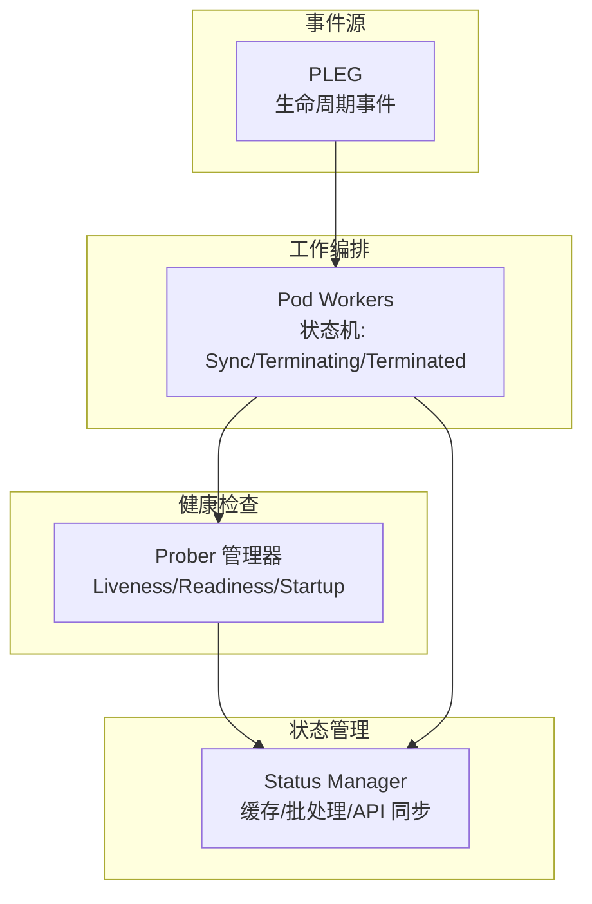
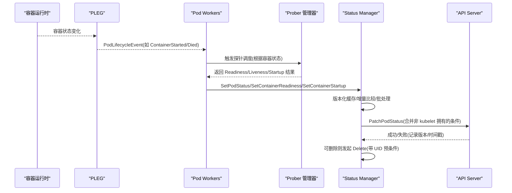
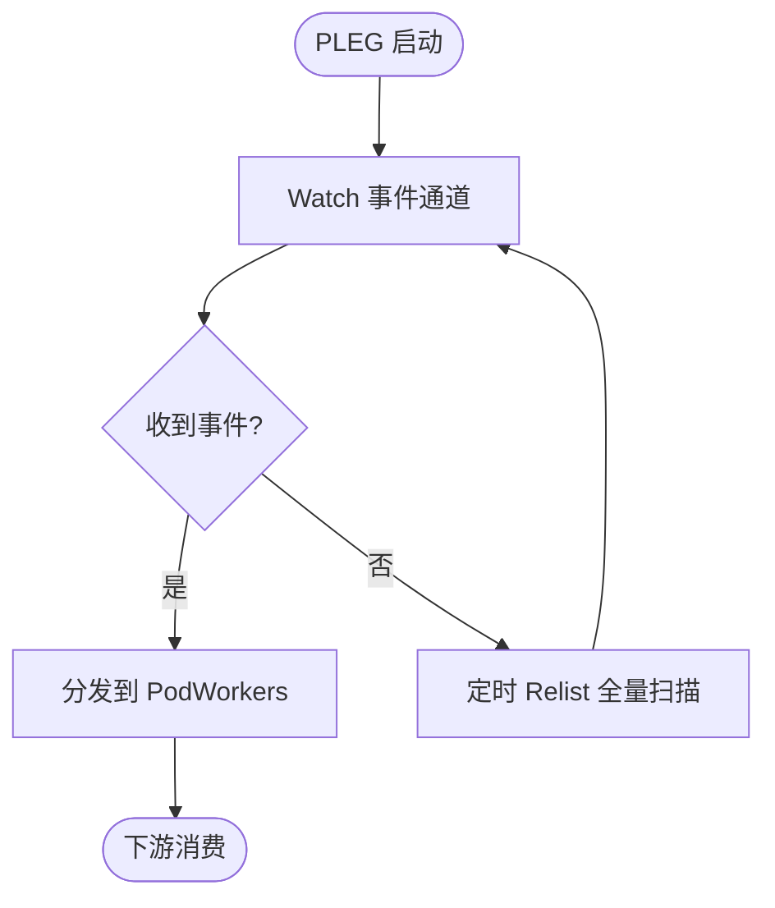
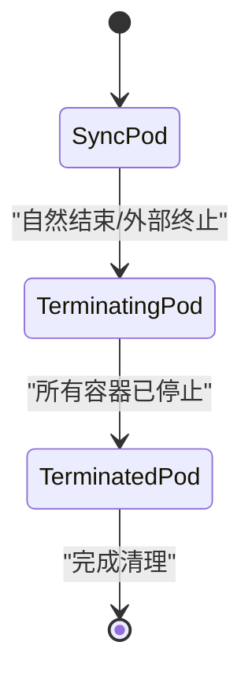
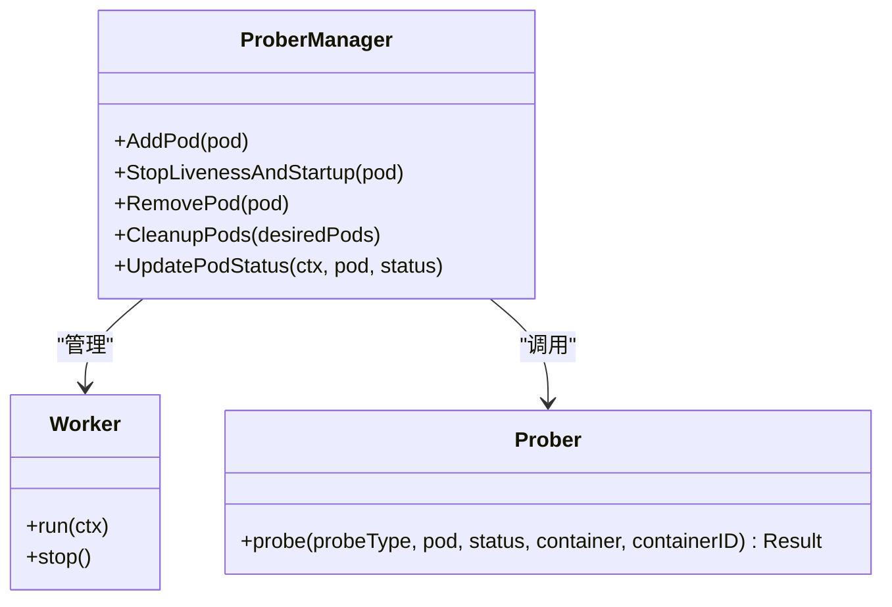
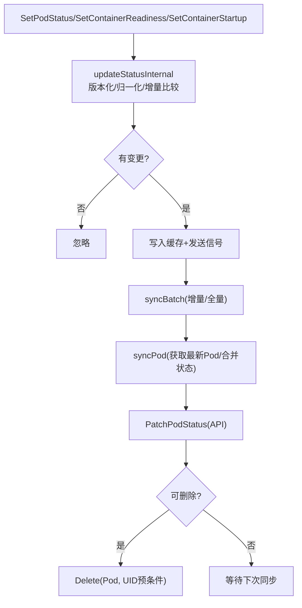
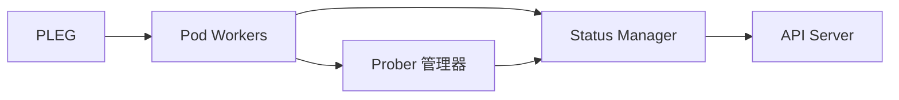

# 状态监控

<cite>
**本文引用的文件**   
- [status_manager.go](file://pkg/kubelet/status/status_manager.go)
- [pod_workers.go](file://pkg/kubelet/pod_workers.go)
- [pleg.go](file://pkg/kubelet/pleg/pleg.go)
- [prober.go](file://pkg/kubelet/prober/prober.go)
- [prober_manager.go](file://pkg/kubelet/prober/prober_manager.go)
</cite>

## 目录
1. [简介](#简介)
2. [项目结构](#项目结构)
3. [核心组件](#核心组件)
4. [架构总览](#架构总览)
5. [详细组件分析](#详细组件分析)
6. [依赖关系分析](#依赖关系分析)
7. [性能考量](#性能考量)
8. [故障排查指南](#故障排查指南)
9. [结论](#结论)
10. [附录](#附录)

## 简介
本技术文档围绕 Kubelet 容器状态监控系统，系统性阐述状态管理器的架构设计与实现细节，涵盖状态收集、更新与传播机制；深入解析容器状态阶段（Created、Running、Exited、Unknown）及其转换条件；说明 Pod 状态与容器状态的聚合逻辑（含就绪性与健康评估）；解释状态持久化机制（快照、恢复与一致性保证）；描述状态变更事件触发与处理流程（PLEG 事件与队列管理）；并提供性能优化策略（增量更新、批处理、数据压缩）以及调试工具与常见问题排查方法。

## 项目结构
Kubelet 的状态监控由多个子系统协作完成：
- PLEG（Pod Lifecycle Event Generator）负责从运行时采集 Pod/容器生命周期事件并生成统一事件流。
- Pod Workers 维护每个 Pod 的工作者协程，驱动 Sync/SyncTerminating/SyncTerminated 三阶段状态机，协调资源清理与最终状态落盘。
- Prober 子系统执行 Liveness/Readiness/Startup 探测，并将结果反馈到容器状态。
- Status Manager 作为 Kubelet 内 Pod 状态的权威缓存，负责合并、去重、批量化同步至 API Server，并在必要时触发删除。

图表来源
- [pleg.go:27-84](file://pkg/kubelet/pleg/pleg.go#L27-L84)
- [pod_workers.go:259-286](file://pkg/kubelet/pod_workers.go#L259-L286)
- [prober_manager.go:71-94](file://pkg/kubelet/prober/prober_manager.go#L71-L94)
- [status_manager.go:146-207](file://pkg/kubelet/status/status_manager.go#L146-L207)

章节来源
- [pleg.go:27-84](file://pkg/kubelet/pleg/pleg.go#L27-L84)
- [pod_workers.go:259-286](file://pkg/kubelet/pod_workers.go#L259-L286)
- [prober_manager.go:71-94](file://pkg/kubelet/prober/prober_manager.go#L71-L94)
- [status_manager.go:146-207](file://pkg/kubelet/status/status_manager.go#L146-L207)

## 核心组件
- PLEG（PodLifecycleEventGenerator）
  - 职责：周期性 Relist 与增量 Watch，产出 ContainerStarted/ContainerDied/ContainerRemoved/PodSync/ContainerChanged 等事件。
  - 接口：Start/Watch/Healthy/RequestReinspect/RequestRelist。
- Pod Workers
  - 职责：为每个 Pod 维护一个工作者协程，按 Sync → Terminating → Terminated 顺序推进，确保幂等与有序。
  - 关键能力：优雅终止（Grace Period）、静态 Pod 启动顺序控制、错误退避与重试、资源回收时机判定。
- Prober 管理器
  - 职责：为每个容器的 Liveness/Readiness/Startup 创建 worker，周期探测并缓存结果；在 UpdatePodStatus 时计算 Ready/Started。
- Status Manager
  - 职责：维护 Pod 状态缓存、版本控制、增量比较、批量同步 API Server、镜像 Pod UID 映射、删除安全判断、Resize 条件缓存与指标上报。

章节来源
- [pleg.go:27-84](file://pkg/kubelet/pleg/pleg.go#L27-L84)
- [pod_workers.go:259-286](file://pkg/kubelet/pod_workers.go#L259-L286)
- [prober_manager.go:71-94](file://pkg/kubelet/prober/prober_manager.go#L71-L94)
- [status_manager.go:146-207](file://pkg/kubelet/status/status_manager.go#L146-L207)

## 架构总览
下图展示了从事件产生到状态落盘的端到端流程，包括状态合并、批处理与 API 同步。

图表来源
- [pleg.go:27-84](file://pkg/kubelet/pleg/pleg.go#L27-L84)
- [pod_workers.go:1245-1377](file://pkg/kubelet/pod_workers.go#L1245-L1377)
- [prober_manager.go:332-420](file://pkg/kubelet/prober/prober_manager.go#L332-L420)
- [status_manager.go:1073-1225](file://pkg/kubelet/status/status_manager.go#L1073-L1225)

## 详细组件分析

### 组件一：PLEG 事件模型与触发
- 事件类型
  - ContainerStarted：容器进入 Running
  - ContainerDied：容器退出
  - ContainerRemoved：旧容器被移除
  - PodSync：需要整体重新同步（无法由单一事件覆盖）
  - ContainerChanged：容器状态未知或需再检查
- 工作机制
  - 周期性 Relist + 阈值保护，避免频繁抖动
  - 支持按需 RequestReinspect/RequestRelist 提升收敛速度

图表来源
- [pleg.go:27-84](file://pkg/kubelet/pleg/pleg.go#L27-L84)

章节来源
- [pleg.go:27-84](file://pkg/kubelet/pleg/pleg.go#L27-L84)

### 组件二：Pod Workers 状态机与生命周期
- 状态机
  - SyncPod：配置并启动/重启所有容器
  - SyncTerminatingPod：停止运行中的容器，收集最终状态
  - SyncTerminatedPod：释放必须立即执行的资源，标记节点侧“已完成”
- 关键特性
  - Grace Period 递减与最小值保障
  - 静态 Pod 启动顺序与冲突规避
  - 错误退避与网络不可用快速重试
  - 通过 Should* 系列方法向其他子系统暴露一致视图

图表来源
- [pod_workers.go:106-132](file://pkg/kubelet/pod_workers.go#L106-L132)
- [pod_workers.go:1245-1377](file://pkg/kubelet/pod_workers.go#L1245-L1377)

章节来源
- [pod_workers.go:259-286](file://pkg/kubelet/pod_workers.go#L259-L286)
- [pod_workers.go:1245-1377](file://pkg/kubelet/pod_workers.go#L1245-L1377)

### 组件三：Prober 管理与就绪性/健康评估
- 探针类型
  - Liveness：决定是否需要重启容器
  - Readiness：决定是否将流量路由到该容器
  - Startup：用于慢启动场景的初始就绪门控
- 结果聚合
  - UpdatePodStatus 中根据 Running 状态与探针结果设置 Started/Ready
  - 针对 Kubelet 重启后的平滑过渡提供宽限期逻辑，避免 Ready 抖动

图表来源
- [prober_manager.go:71-94](file://pkg/kubelet/prober/prober_manager.go#L71-L94)
- [prober.go:43-69](file://pkg/kubelet/prober/prober.go#L43-L69)

章节来源
- [prober_manager.go:332-420](file://pkg/kubelet/prober/prober_manager.go#L332-L420)
- [prober.go:82-134](file://pkg/kubelet/prober/prober.go#L82-L134)

### 组件四：Status Manager 状态缓存与同步
- 缓存与版本
  - 每个 Pod 维护 versionedPodStatus，包含单调递增版本号与首次更新时间 at
  - 使用 isPodStatusByKubeletEqual 进行 kubelet 拥有字段对比，避免无意义 Patch
- 批处理与增量
  - 通过 podStatusChannel 触发 syncBatch，支持按需增量与定时全量
  - 对 Mirror Pod UID 维护 apiStatusVersions，防止重复推送
- 合并与一致性
  - mergePodStatus 保留非 kubelet 拥有的条件，延迟终态转换直到容器全部终止
  - normalizeStatus 统一时间精度与排序，确保比较稳定
- 删除安全
  - canBeDeleted 结合 DeletionTimestamp、终端阶段与 PodCouldHaveRunningContainers 判断是否可删除
  - 使用 UID 预条件避免误删同名新 Pod

图表来源
- [status_manager.go:464-508](file://pkg/kubelet/status/status_manager.go#L464-L508)
- [status_manager.go:846-1012](file://pkg/kubelet/status/status_manager.go#L846-L1012)
- [status_manager.go:1073-1225](file://pkg/kubelet/status/status_manager.go#L1073-L1225)
- [status_manager.go:1356-1434](file://pkg/kubelet/status/status_manager.go#L1356-L1434)

章节来源
- [status_manager.go:464-508](file://pkg/kubelet/status/status_manager.go#L464-L508)
- [status_manager.go:846-1012](file://pkg/kubelet/status/status_manager.go#L846-L1012)
- [status_manager.go:1073-1225](file://pkg/kubelet/status/status_manager.go#L1073-L1225)
- [status_manager.go:1356-1434](file://pkg/kubelet/status/status_manager.go#L1356-L1434)

## 依赖关系分析
- PLEG 与 Pod Workers：事件驱动，PLEG 产出事件后由 Pod Workers 消费并驱动状态机。
- Pod Workers 与 Prober：在容器状态变化时触发探针调度，探针结果影响容器 Ready/Started。
- Pod Workers 与 Status Manager：在 Sync/SyncTerminating/SyncTerminated 各阶段写入状态，Status Manager 负责批处理与 API 同步。
- Status Manager 与 API Server：通过 PatchPodStatus 增量更新，必要时以 UID 预条件安全删除。

图表来源
- [pleg.go:27-84](file://pkg/kubelet/pleg/pleg.go#L27-L84)
- [pod_workers.go:1245-1377](file://pkg/kubelet/pod_workers.go#L1245-L1377)
- [prober_manager.go:71-94](file://pkg/kubelet/prober/prober_manager.go#L71-L94)
- [status_manager.go:1073-1225](file://pkg/kubelet/status/status_manager.go#L1073-L1225)

章节来源
- [pleg.go:27-84](file://pkg/kubelet/pleg/pleg.go#L27-L84)
- [pod_workers.go:1245-1377](file://pkg/kubelet/pod_workers.go#L1245-L1377)
- [prober_manager.go:71-94](file://pkg/kubelet/prober/prober_manager.go#L71-L94)
- [status_manager.go:1073-1225](file://pkg/kubelet/status/status_manager.go#L1073-L1225)

## 性能考量
- 增量更新
  - Status Manager 使用 isPodStatusByKubeletEqual 仅比较 kubelet 拥有字段，减少无效 Patch。
  - apiStatusVersions 跟踪已推送版本，避免重复提交。
- 批处理
  - 通过 podStatusChannel 与 syncBatch 将多次更新合并，降低 API 压力。
- 数据规范化与排序
  - normalizeStatus 统一时间精度与容器状态排序，提高比较稳定性与缓存命中率。
- 探针并发与节流
  - Prober 管理器为每个探针创建独立 worker，支持手动触发与结果缓存，避免频繁抖动。
- 错误退避与快速重试
  - Pod Workers 在网络不可用时短退避，其它错误采用指数退避，上限受 resyncInterval 限制。

[本节为通用性能建议，不直接分析具体文件]

## 故障排查指南
- 常见症状与定位
  - Pod 长时间处于 Pending/Running 但未 Ready
    - 检查 Prober 结果与 ReadinessProbe 配置，确认 UpdatePodStatus 是否正确设置 Ready。
    - 关注 Kubelet 重启后的 Ready 抖动保护逻辑。
  - 容器状态异常（Exited/Unknown）
    - 查看 PLEG 事件与 Pod Workers 日志，确认是否发生非法状态迁移（如 Terminated→非 Terminated）。
  - 状态未同步至 API Server
    - 检查 Status Manager 的增量比较与批处理逻辑，确认是否存在相同状态被忽略。
  - 删除不生效或误删
    - 核查 canBeDeleted 条件（DeletionTimestamp、终端阶段、是否有运行中容器）与 UID 预条件。
- 诊断要点
  - 启用高详细度日志（V(4)/V(5)），观察 updateStatusInternal 与 syncBatch 输出。
  - 关注 metrics：PodStatusSyncDuration、TerminatedContainersTotal、Prober probe_total/probe_duration_seconds。
  - 使用 kubectl describe pod 与 kubectl get pod -o yaml 对比本地缓存与 API 状态差异。

章节来源
- [status_manager.go:846-1012](file://pkg/kubelet/status/status_manager.go#L846-L1012)
- [status_manager.go:1073-1225](file://pkg/kubelet/status/status_manager.go#L1073-L1225)
- [prober_manager.go:332-420](file://pkg/kubelet/prober/prober_manager.go#L332-L420)
- [pod_workers.go:1245-1377](file://pkg/kubelet/pod_workers.go#L1245-L1377)

## 结论
Kubelet 的状态监控体系以 PLEG 事件为驱动，Pod Workers 为核心编排器，Prober 提供健康与就绪性评估，Status Manager 作为权威缓存与对外同步层，共同实现了高效、可靠、一致的容器与 Pod 状态管理。通过增量比较、批处理、规范化与删除安全机制，系统在大规模集群下仍保持低开销与强一致性。

[本节为总结性内容，不直接分析具体文件]

## 附录

### 容器状态阶段与转换条件
- Created：容器已创建但尚未开始运行（通常由运行时创建沙箱/镜像层后进入）
- Running：容器正在运行
- Exited：容器已退出（正常或非零退出码）
- Unknown：状态不可知（如运行时短暂不可用或信息缺失）
- 转换约束
  - 禁止从 Terminated 回到非 Terminated（除非允许重启策略）
  - Init 容器遵循顺序与重启规则，非重启型 Init 容器一旦 Terminated 不可逆
  - Pod 终态转换需等待所有运行中容器终止，避免资源竞争

章节来源
- [status_manager.go:766-844](file://pkg/kubelet/status/status_manager.go#L766-L844)
- [status_manager.go:1356-1434](file://pkg/kubelet/status/status_manager.go#L1356-L1434)

### 状态持久化与恢复
- 快照与恢复
  - Status Manager 在内存中维护 versionedPodStatus 缓存，配合 API Server 的 Pod 状态作为持久化存储
  - 重启后通过 PLEG 与 Pod Workers 重新收敛，Status Manager 基于最新版本号与合并逻辑保持一致
- 一致性保证
  - 使用 ObservedGeneration 与 LastTransitionTime 确保条件时序正确
  - 合并策略保留非 kubelet 拥有的条件，避免覆盖外部控制器写入
  - 删除前校验终端阶段与运行中容器，确保资源释放顺序

章节来源
- [status_manager.go:464-508](file://pkg/kubelet/status/status_manager.go#L464-L508)
- [status_manager.go:1073-1225](file://pkg/kubelet/status/status_manager.go#L1073-L1225)
- [status_manager.go:1356-1434](file://pkg/kubelet/status/status_manager.go#L1356-L1434)

### 事件与队列管理
- PLEG 事件
  - Watch 通道持续产出事件，支持按需 Reinspect/Relist
- Pod Workers 队列
  - 每 Pod 一个 channel，pendingUpdate/activeUpdate 分离，确保幂等与可见性
  - completeWork 根据错误类型与阶段转换决定退避与立即重入
- Status Manager 同步队列
  - podStatusChannel 缓冲容量为 1，避免阻塞写入
  - syncBatch 区分增量与全量，定期 reconcile 不一致状态

章节来源
- [pleg.go:27-84](file://pkg/kubelet/pleg/pleg.go#L27-L84)
- [pod_workers.go:1245-1377](file://pkg/kubelet/pod_workers.go#L1245-L1377)
- [status_manager.go:1073-1225](file://pkg/kubelet/status/status_manager.go#L1073-L1225)