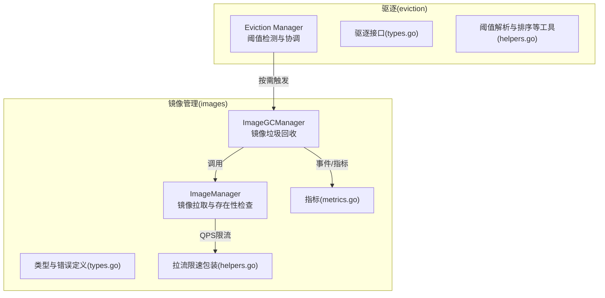
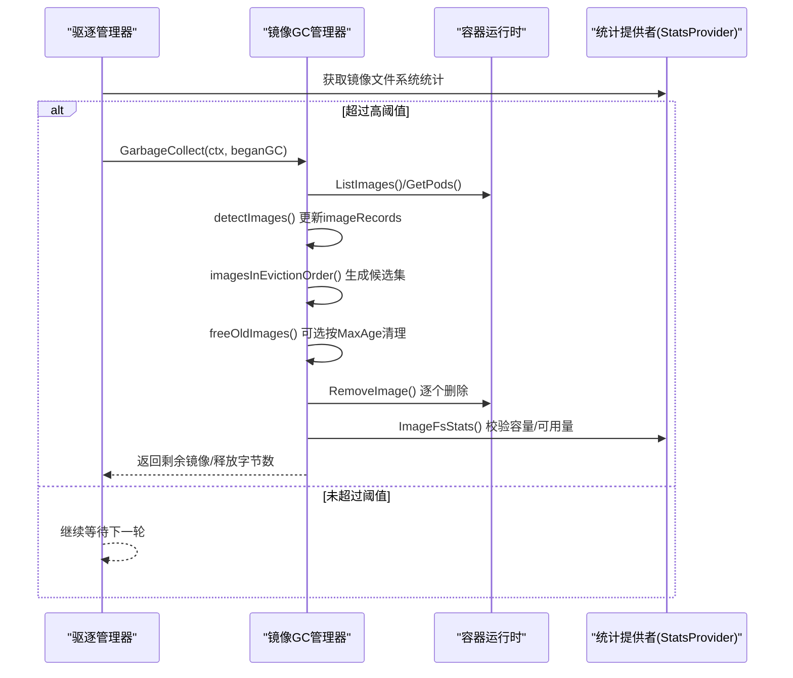
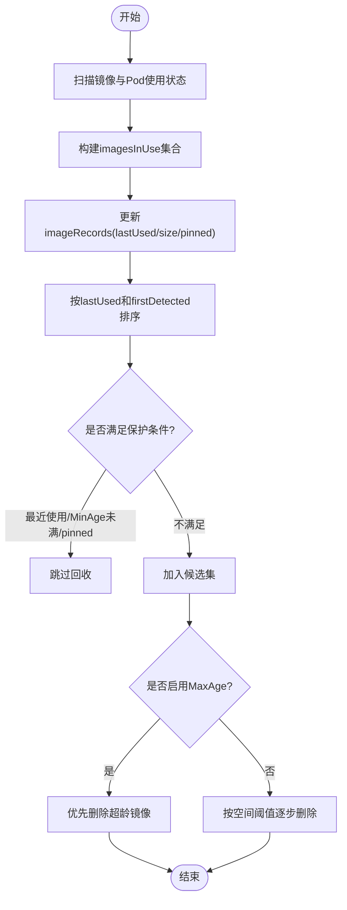
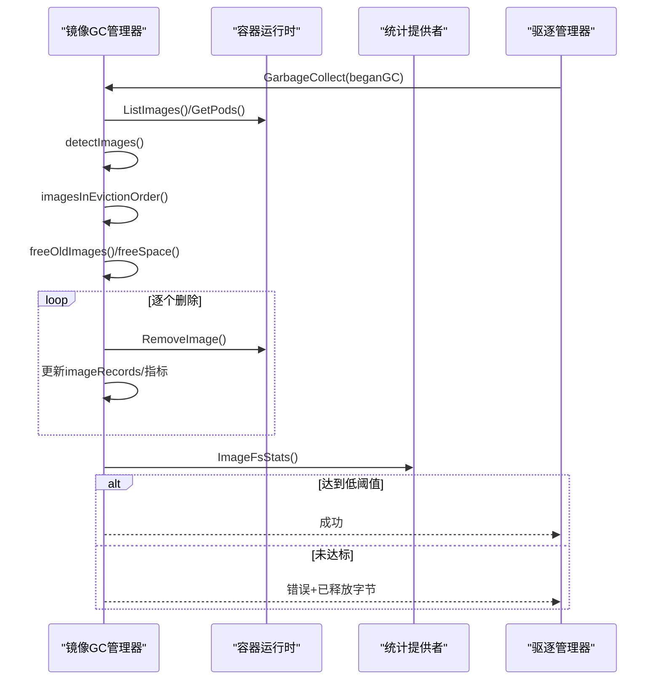
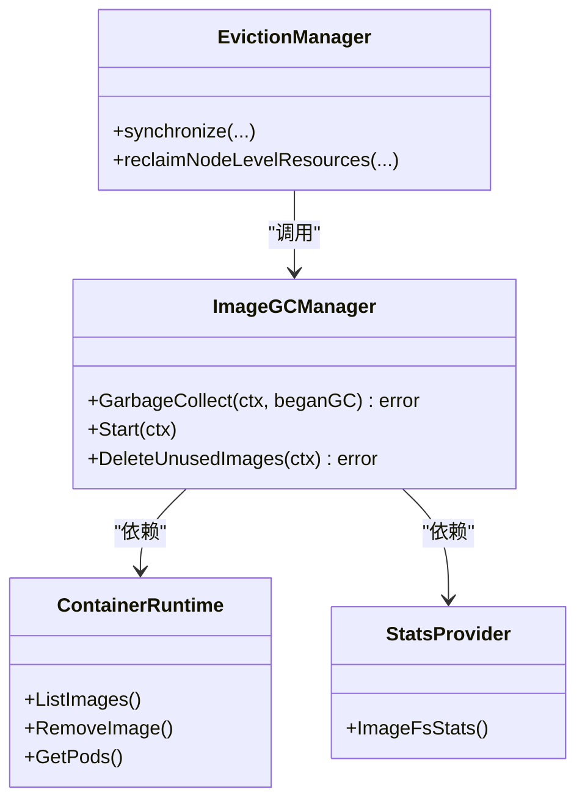

# 镜像垃圾回收

<cite>
**本文引用的文件**   
- [image_gc_manager.go](file://pkg/kubelet/images/image_gc_manager.go)
- [image_manager.go](file://pkg/kubelet/images/image_manager.go)
- [types.go](file://pkg/kubelet/images/types.go)
- [helpers.go](file://pkg/kubelet/images/helpers.go)
- [metrics.go](file://pkg/kubelet/images/metrics.go)
- [eviction_manager.go](file://pkg/kubelet/eviction/eviction_manager.go)
- [types.go](file://pkg/kubelet/eviction/types.go)
- [helpers.go](file://pkg/kubelet/eviction/helpers.go)
</cite>

## 目录
1. [简介](#简介)
2. [项目结构](#项目结构)
3. [核心组件](#核心组件)
4. [架构总览](#架构总览)
5. [详细组件分析](#详细组件分析)
6. [依赖关系分析](#依赖关系分析)
7. [性能考虑](#性能考虑)
8. [故障排查指南](#故障排查指南)
9. [结论](#结论)
10. [附录](#附录)

## 简介
本文件系统性梳理 Kubelet 的镜像垃圾回收（Image GC）机制，覆盖触发条件与调度策略、删除优先级算法、执行流程、安全删除保障、性能优化、监控指标与日志记录，以及配置调优与故障诊断要点。读者无需深入源码即可理解整体设计与关键实现细节。

## 项目结构
Kubelet 镜像垃圾回收相关代码主要位于以下包：
- images：镜像生命周期管理与垃圾回收核心逻辑
- eviction：节点资源压力检测与驱逐协调器，负责在磁盘空间不足时调用镜像 GC

图表来源
- [image_gc_manager.go:109-141](file://pkg/kubelet/images/image_gc_manager.go#L109-L141)
- [image_manager.go:58-105](file://pkg/kubelet/images/image_manager.go#L58-L105)
- [types.go:1-55](file://pkg/kubelet/images/types.go#L1-L55)
- [helpers.go:29-53](file://pkg/kubelet/images/helpers.go#L29-L53)
- [metrics.go:30-66](file://pkg/kubelet/images/metrics.go#L30-L66)
- [eviction_manager.go:66-143](file://pkg/kubelet/eviction/eviction_manager.go#L66-L143)
- [types.go:83-93](file://pkg/kubelet/eviction/types.go#L83-L93)
- [helpers.go:116-125](file://pkg/kubelet/eviction/helpers.go#L116-L125)

章节来源
- [image_gc_manager.go:109-141](file://pkg/kubelet/images/image_gc_manager.go#L109-L141)
- [eviction_manager.go:66-143](file://pkg/kubelet/eviction/eviction_manager.go#L66-L143)

## 核心组件
- ImageGCManager：镜像垃圾回收主控制器，负责扫描镜像、计算可回收集合、按策略删除并同步状态。
- Eviction Manager：统一资源压力控制面，当检测到磁盘空间不足时，优先尝试节点级资源回收，必要时再调用镜像 GC。
- ImageManager：镜像拉取与存在性检查，配合 ImageGCManager 完成“确保镜像存在”的前置流程。
- 辅助能力：拉流 QPS 限流、指标上报、事件记录、OpenTelemetry 追踪。

章节来源
- [image_gc_manager.go:73-141](file://pkg/kubelet/images/image_gc_manager.go#L73-L141)
- [eviction_manager.go:66-143](file://pkg/kubelet/eviction/eviction_manager.go#L66-L143)
- [image_manager.go:58-105](file://pkg/kubelet/images/image_manager.go#L58-L105)

## 架构总览
镜像垃圾回收由两条路径驱动：
- 定时任务：定期扫描镜像列表与使用状态，维护 imageRecords 缓存，为后续 GC 提供数据基础。
- 驱逐协调：Eviction Manager 周期性评估系统资源，当镜像文件系统可用空间低于阈值时，先尝试节点级回收，若仍不足则调用 ImageGCManager 进行镜像清理。

图表来源
- [eviction_manager.go:254-454](file://pkg/kubelet/eviction/eviction_manager.go#L254-L454)
- [image_gc_manager.go:349-418](file://pkg/kubelet/images/image_gc_manager.go#L349-L418)
- [image_gc_manager.go:244-323](file://pkg/kubelet/images/image_gc_manager.go#L244-L323)
- [image_gc_manager.go:548-593](file://pkg/kubelet/images/image_gc_manager.go#L548-L593)
- [image_gc_manager.go:426-456](file://pkg/kubelet/images/image_gc_manager.go#L426-L456)
- [image_gc_manager.go:483-522](file://pkg/kubelet/images/image_gc_manager.go#L483-L522)

## 详细组件分析

### 触发条件与调度策略
- 定时扫描
  - 每 5 分钟运行一次 detectImages，刷新镜像使用状态与首次发现时间。
  - 每 30 秒刷新镜像列表缓存，供外部查询与状态展示。
- 磁盘阈值触发
  - Eviction Manager 周期同步，读取镜像文件系统容量与可用空间，计算使用率。
  - 当使用率超过 HighThresholdPercent，尝试释放足够空间使使用率降至 LowThresholdPercent 以下。
  - 若无法通过镜像 GC 释放足够空间，会记录警告事件并返回错误，提示需排查日志、卷或其他数据占用。

章节来源
- [image_gc_manager.go:218-237](file://pkg/kubelet/images/image_gc_manager.go#L218-L237)
- [image_gc_manager.go:349-418](file://pkg/kubelet/images/image_gc_manager.go#L349-L418)
- [eviction_manager.go:254-454](file://pkg/kubelet/eviction/eviction_manager.go#L254-L454)

### 镜像删除优先级算法
- 使用识别与引用计数
  - 遍历所有 Pod 及其容器，收集正在使用的镜像 ID；支持 RuntimeClassInImageCriAPI 特性下以 (imageID,runtimeHandler) 元组作为索引。
  - 对每个镜像维护 firstDetected、lastUsed、size、pinned 等记录，用于排序与保护。
- 安全保护
  - 正在使用的镜像不会被删除。
  - 被标记为 pinned 的镜像跳过回收。
  - MinAge 保护：新近发现的镜像在达到最小年龄前不参与回收，避免误删刚拉取的镜像。
- 排序规则
  - 按 lastUsed 升序（最久未使用优先），同时间戳按 firstDetected 升序（更早发现优先）。
- 可选 MaxAge 清理
  - 当启用最大年龄策略且自 Kubelet 启动后已超过 MaxAge，将优先清理超过该时间的镜像，不受磁盘阈值限制。

图表来源
- [image_gc_manager.go:244-323](file://pkg/kubelet/images/image_gc_manager.go#L244-L323)
- [image_gc_manager.go:548-593](file://pkg/kubelet/images/image_gc_manager.go#L548-L593)
- [image_gc_manager.go:426-456](file://pkg/kubelet/images/image_gc_manager.go#L426-L456)
- [image_gc_manager.go:483-522](file://pkg/kubelet/images/image_gc_manager.go#L483-L522)

章节来源
- [image_gc_manager.go:244-323](file://pkg/kubelet/images/image_gc_manager.go#L244-L323)
- [image_gc_manager.go:548-593](file://pkg/kubelet/images/image_gc_manager.go#L548-L593)
- [image_gc_manager.go:426-456](file://pkg/kubelet/images/image_gc_manager.go#L426-L456)
- [image_gc_manager.go:483-522](file://pkg/kubelet/images/image_gc_manager.go#L483-L522)

### 执行流程：扫描、删除与状态同步
- 扫描阶段
  - 调用容器运行时列出镜像与 Pod，结合 ImageVolume 特性处理挂载镜像的使用关系。
  - 更新 imageRecords 中镜像的 size、pinned、lastUsed 等属性。
- 删除阶段
  - 根据策略选择 freeOldImages 或 freeSpace 执行删除。
  - 每次删除后从 imageRecords 移除对应条目，并递增回收指标。
- 状态同步
  - 删除完成后再次读取镜像文件系统容量与可用空间，验证是否达到目标阈值。
  - 若未达到目标，记录事件并返回错误，便于上层驱逐协调器决策。

图表来源
- [image_gc_manager.go:349-418](file://pkg/kubelet/images/image_gc_manager.go#L349-L418)
- [image_gc_manager.go:244-323](file://pkg/kubelet/images/image_gc_manager.go#L244-L323)
- [image_gc_manager.go:524-546](file://pkg/kubelet/images/image_gc_manager.go#L524-L546)

章节来源
- [image_gc_manager.go:349-418](file://pkg/kubelet/images/image_gc_manager.go#L349-L418)
- [image_gc_manager.go:524-546](file://pkg/kubelet/images/image_gc_manager.go#L524-L546)

### 安全删除机制
- 正在使用的镜像保护：基于 imagesInUse 集合判断，避免删除当前被 Pod 使用的镜像。
- Pinned 镜像保护：runtime 标记为 pinned 的镜像不参与回收。
- MinAge 保护：防止刚拉取的镜像立即被回收。
- 原子性与回滚
  - 删除操作逐条执行，失败时累积错误并继续尝试其他镜像。
  - 删除成功后立即从 imageRecords 移除，保证内部状态与运行时一致。
  - 若最终未能释放到目标空间，上层驱逐管理器会收到错误并可采取进一步动作（如 Pod 驱逐）。

章节来源
- [image_gc_manager.go:483-522](file://pkg/kubelet/images/image_gc_manager.go#L483-L522)
- [image_gc_manager.go:524-546](file://pkg/kubelet/images/image_gc_manager.go#L524-L546)
- [image_gc_manager.go:349-418](file://pkg/kubelet/images/image_gc_manager.go#L349-L418)

### 性能优化
- 批量删除与并发控制
  - 镜像拉取路径支持并行与串行两种模式，并通过令牌桶限流控制 QPS/Burst。
  - 镜像 GC 删除循环顺序执行，避免对运行时造成过大压力；可通过调整阈值与 MinAge 降低频繁回收带来的抖动。
- 缓存与排序
  - 镜像列表缓存按大小排序，减少重复 IO 与排序开销。
  - 仅对非使用且非 pinned 的镜像参与排序与删除，缩小候选集规模。
- 资源限制
  - 拉取路径通过 QPS 限流保护后端存储与网络带宽。

章节来源
- [image_manager.go:74-105](file://pkg/kubelet/images/image_manager.go#L74-L105)
- [helpers.go:29-53](file://pkg/kubelet/images/helpers.go#L29-L53)
- [image_gc_manager.go:144-172](file://pkg/kubelet/images/image_gc_manager.go#L144-L172)

### 监控指标与日志记录
- 指标
  - 镜像拉取请求计数：包含拉取策略、本地是否存在、是否需要拉取等标签。
  - 镜像回收总数：按原因分类（age/space）。
- 事件与日志
  - 磁盘容量异常、回收失败、镜像拉取失败等场景均会记录事件与日志，便于定位问题。
- OpenTelemetry
  - 垃圾回收入口创建 span，便于链路追踪。

章节来源
- [metrics.go:30-66](file://pkg/kubelet/images/metrics.go#L30-L66)
- [image_gc_manager.go:54-59](file://pkg/kubelet/images/image_gc_manager.go#L54-L59)
- [image_gc_manager.go:349-418](file://pkg/kubelet/images/image_gc_manager.go#L349-L418)

### 配置参数与调优建议
- 镜像 GC 策略
  - HighThresholdPercent：超过此值即触发回收。
  - LowThresholdPercent：回收目标，尽量将使用率降至该值以下。
  - MinAge：新镜像的最小存活时间，避免误删。
  - MaxAge：可选的最大年龄策略，超过该时间无论磁盘是否紧张都尝试回收。
- 驱逐阈值
  - 通过驱逐管理器配置的镜像文件系统可用空间阈值与最小回收量，决定何时进入回收流程。
- 调优建议
  - 合理设置 High/Low 阈值，避免频繁抖动。
  - 适当提高 MinAge，降低热镜像被误删风险。
  - 在大规模镜像变更场景开启 MaxAge，定期清理冷镜像。
  - 结合拉取 QPS/Burst 限制，避免峰值期对存储与网络造成冲击。

章节来源
- [image_gc_manager.go:89-107](file://pkg/kubelet/images/image_gc_manager.go#L89-L107)
- [eviction_manager.go:254-454](file://pkg/kubelet/eviction/eviction_manager.go#L254-L454)
- [helpers.go:29-53](file://pkg/kubelet/images/helpers.go#L29-L53)

## 依赖关系分析
- 组件耦合
  - ImageGCManager 依赖容器运行时接口与 StatsProvider 获取镜像与磁盘信息。
  - Eviction Manager 通过 ImageGC 接口调用镜像回收，形成松耦合编排。
- 外部依赖
  - 容器运行时：ListImages/RemoveImage/GetPods 等。
  - 统计子系统：镜像文件系统容量与可用空间。
  - 指标与事件：Prometheus 指标与 Kubernetes 事件。
- 潜在循环依赖
  - 无直接循环依赖；各模块通过接口解耦。

图表来源
- [image_gc_manager.go:73-141](file://pkg/kubelet/images/image_gc_manager.go#L73-L141)
- [eviction_manager.go:66-143](file://pkg/kubelet/eviction/eviction_manager.go#L66-L143)
- [types.go:83-93](file://pkg/kubelet/eviction/types.go#L83-L93)

章节来源
- [image_gc_manager.go:73-141](file://pkg/kubelet/images/image_gc_manager.go#L73-L141)
- [eviction_manager.go:66-143](file://pkg/kubelet/eviction/eviction_manager.go#L66-L143)
- [types.go:83-93](file://pkg/kubelet/eviction/types.go#L83-L93)

## 性能考虑
- 减少不必要的扫描与排序：仅在需要时刷新镜像缓存，并对候选集进行最小化过滤。
- 控制删除速率：逐条删除避免瞬时 I/O 尖峰；拉取路径通过 QPS 限流保护后端。
- 合理阈值与 MinAge：降低高频回收导致的抖动与额外 IO。
- 分离文件系统：当镜像文件系统独立时，能更精准地评估与回收，避免影响根文件系统。

[本节为通用指导，不直接分析具体文件]

## 故障排查指南
- 常见问题
  - 磁盘容量异常：当镜像文件系统容量为 0 或可用量大于容量时，会记录事件并报错。
  - 回收不足：即使删除了部分镜像，仍可能因日志、卷或其他数据占用导致空间不足。
  - 拉取失败：注册表不可用、签名校验失败等错误会被归类并记录。
- 定位步骤
  - 查看镜像 GC 与驱逐相关日志，关注阈值、释放字节数与错误聚合。
  - 检查 Prometheus 指标：镜像拉取计数、回收总数等。
  - 确认镜像是否被 Pod 使用或被标记为 pinned。
  - 核对 MinAge/MaxAge 与阈值配置是否符合预期。
- 恢复建议
  - 清理日志与临时文件，扩容或迁移镜像存储。
  - 调整阈值与 MinAge，避免过度回收。
  - 修复镜像仓库访问与签名校验问题。

章节来源
- [image_gc_manager.go:349-418](file://pkg/kubelet/images/image_gc_manager.go#L349-L418)
- [image_manager.go:391-420](file://pkg/kubelet/images/image_manager.go#L391-L420)

## 结论
Kubelet 镜像垃圾回收通过“定时扫描 + 阈值触发”的双通道机制，在保证业务镜像安全的前提下，有效缓解节点磁盘压力。其优先级算法兼顾使用频率、发现时间与保护策略，配合拉取限流与指标观测，形成了稳定可控的资源回收体系。生产环境中建议结合业务特征合理配置阈值与保护参数，并建立完善的监控与告警体系。

## 附录
- 术语
  - 高/低阈值：触发与目标使用率百分比。
  - MinAge/MaxAge：镜像最小/最大年龄策略。
  - Pinned：运行时标记的受保护镜像。
- 参考接口
  - ImageGCManager：镜像垃圾回收主接口。
  - ImageManager：镜像拉取与存在性检查接口。
  - Eviction Manager：资源压力协调器。