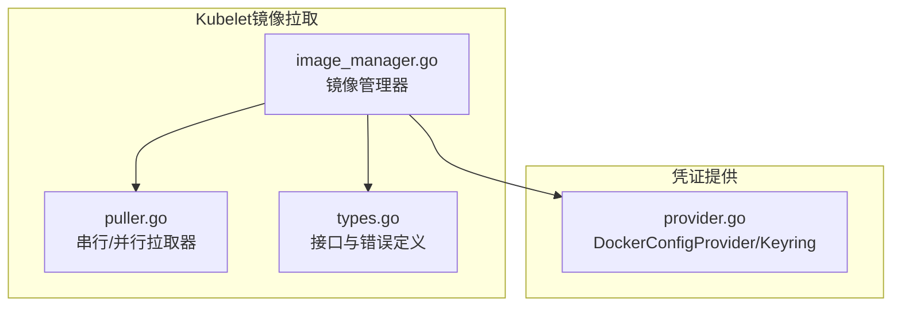
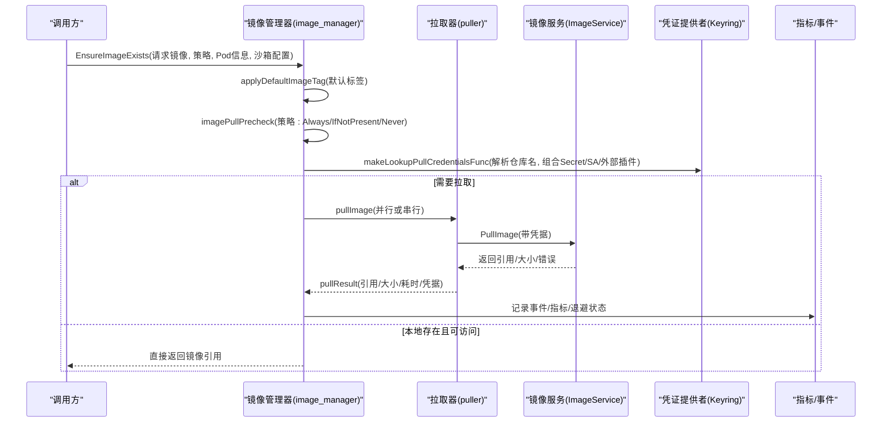
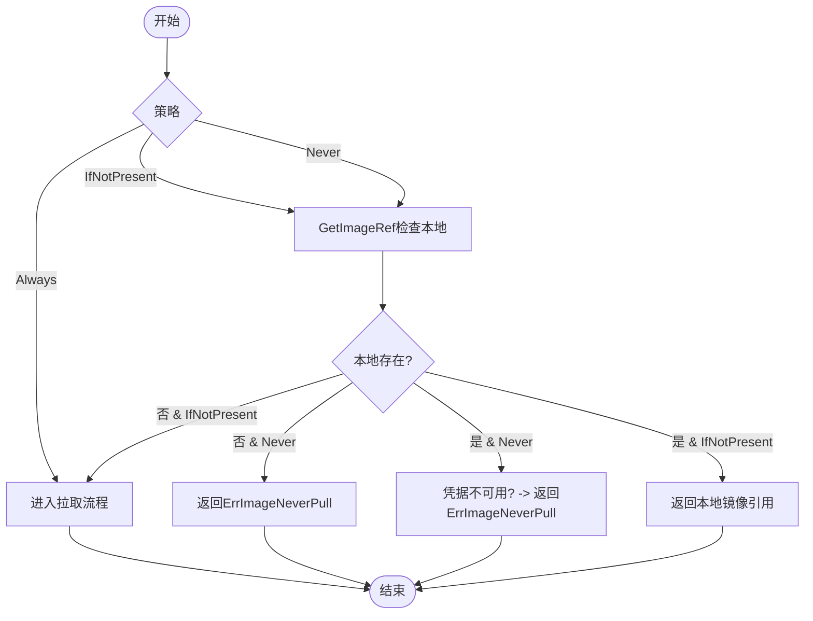
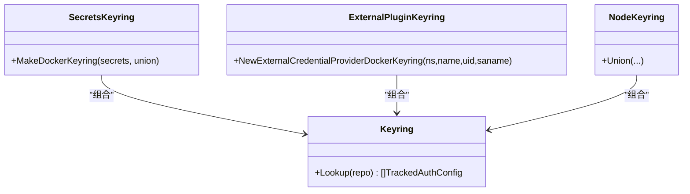
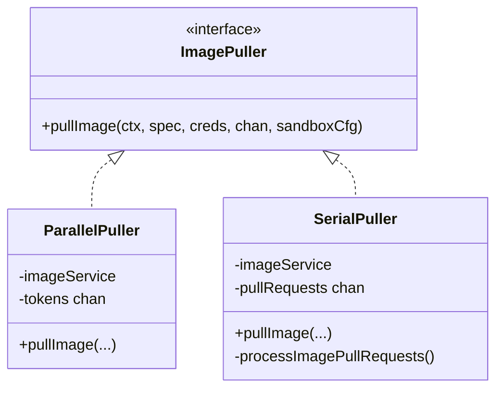
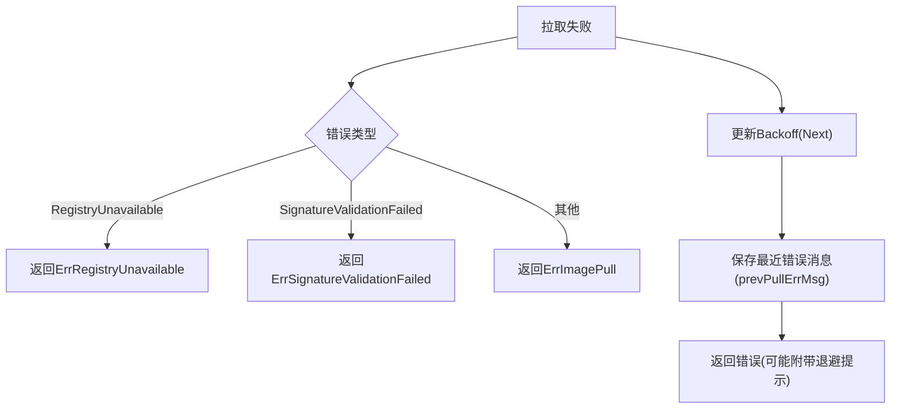
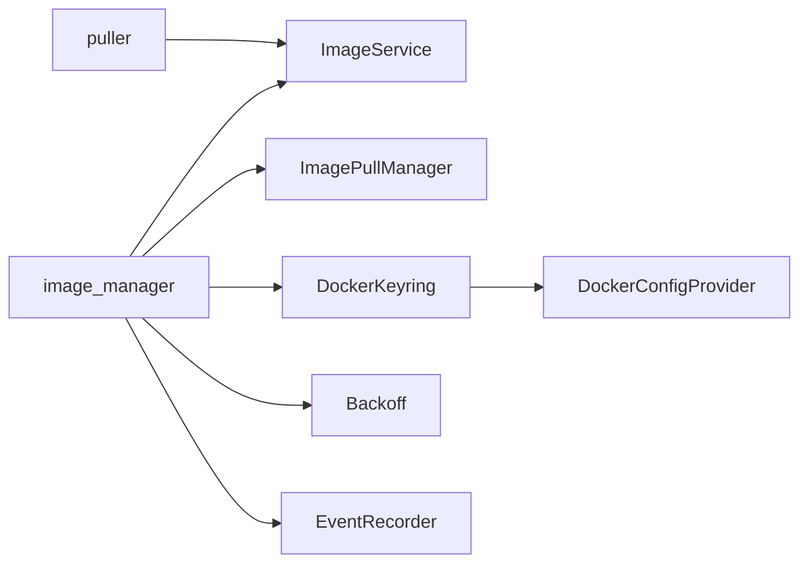

# 镜像拉取

<cite>
**本文引用的文件**   
- [pkg/kubelet/images/image_manager.go](file://pkg/kubelet/images/image_manager.go)
- [pkg/kubelet/images/puller.go](file://pkg/kubelet/images/puller.go)
- [pkg/kubelet/images/types.go](file://pkg/kubelet/images/types.go)
- [pkg/credentialprovider/provider.go](file://pkg/credentialprovider/provider.go)
</cite>

## 目录
1. [简介](#简介)
2. [项目结构](#项目结构)
3. [核心组件](#核心组件)
4. [架构总览](#架构总览)
5. [详细组件分析](#详细组件分析)
6. [依赖关系分析](#依赖关系分析)
7. [性能与并发控制](#性能与并发控制)
8. [错误处理与重试机制](#错误处理与重试机制)
9. [监控指标与时间记录](#监控指标与时间记录)
10. [故障排查指南](#故障排查指南)
11. [结论](#结论)

## 简介
本文件面向Kubelet的镜像拉取子系统，系统性梳理从镜像名称解析、标签处理、默认标签应用到拉取策略决策、认证来源（Secret、ServiceAccount、外部凭证提供者）、并发控制（串行/并行）、错误分类与退避重试、以及性能监控与时间记录的完整流程。文档以源码为依据，提供可视化图示与“代码片段路径”以便快速定位实现细节。

## 项目结构
Kubelet镜像拉取相关逻辑主要位于以下包：
- images：镜像拉取主流程、并发拉取器、类型与错误定义
- credentialprovider：Docker配置提供者与Keyring抽象，用于拼装拉取凭据

图表来源
- [pkg/kubelet/images/image_manager.go:74-105](file://pkg/kubelet/images/image_manager.go#L74-L105)
- [pkg/kubelet/images/puller.go:41-88](file://pkg/kubelet/images/puller.go#L41-L88)
- [pkg/kubelet/images/types.go:44-54](file://pkg/kubelet/images/types.go#L44-L54)
- [pkg/credentialprovider/provider.go:28-40](file://pkg/credentialprovider/provider.go#L28-L40)

章节来源
- [pkg/kubelet/images/image_manager.go:74-105](file://pkg/kubelet/images/image_manager.go#L74-L105)
- [pkg/kubelet/images/puller.go:41-88](file://pkg/kubelet/images/puller.go#L41-L88)
- [pkg/kubelet/images/types.go:44-54](file://pkg/kubelet/images/types.go#L44-L54)
- [pkg/credentialprovider/provider.go:28-40](file://pkg/credentialprovider/provider.go#L28-L40)

## 核心组件
- ImageManager：对外暴露EnsureImageExists，负责名称解析、默认标签应用、拉取策略判断、凭据查找、并发拉取调度、错误分类与退避、事件与指标上报。
- imagePuller：统一拉取执行接口，包含并行与串行两种实现。
- DockerKeyring/DockerConfigProvider：封装多源凭据拼装与缓存，支持节点级、Pod Secret、ServiceAccount及外部插件提供的凭据。

章节来源
- [pkg/kubelet/images/types.go:44-54](file://pkg/kubelet/images/types.go#L44-L54)
- [pkg/kubelet/images/image_manager.go:74-105](file://pkg/kubelet/images/image_manager.go#L74-L105)
- [pkg/kubelet/images/puller.go:37-53](file://pkg/kubelet/images/puller.go#L37-L53)
- [pkg/credentialprovider/provider.go:28-40](file://pkg/credentialprovider/provider.go#L28-L40)

## 架构总览
下图展示一次镜像拉取的关键调用链与数据流，包括策略判定、凭据组装、并发拉取、错误分类与退避、结果回传与指标记录。

图表来源
- [pkg/kubelet/images/image_manager.go:168-289](file://pkg/kubelet/images/image_manager.go#L168-L289)
- [pkg/kubelet/images/puller.go:55-74](file://pkg/kubelet/images/puller.go#L55-L74)
- [pkg/kubelet/images/image_manager.go:291-322](file://pkg/kubelet/images/image_manager.go#L291-L322)

## 详细组件分析

### 镜像名称解析与默认标签应用
- 入口：EnsureImageExists中先对请求镜像进行名称解析与默认标签应用。
- 规则：若未显式指定tag或digest，则应用默认tag；为避免短名被自动补全为docker.io前缀，采用字符串拼接方式追加tag，保持CRI无关性。
- 失败处理：解析失败时返回InvalidImageName错误并记录事件。

章节来源
- [pkg/kubelet/images/image_manager.go:182-188](file://pkg/kubelet/images/image_manager.go#L182-L188)
- [pkg/kubelet/images/image_manager.go:422-439](file://pkg/kubelet/images/image_manager.go#L422-L439)

### 拉取策略决策（Always / IfNotPresent / Never）
- Always：跳过本地检查，直接进入拉取流程。
- IfNotPresent：先GetImageRef检查本地是否存在；不存在则拉取。
- Never：若本地不存在，直接返回ErrImageNeverPull；若存在但凭据不可用，也按“不存在”语义返回，避免泄露存在性。

图表来源
- [pkg/kubelet/images/image_manager.go:107-136](file://pkg/kubelet/images/image_manager.go#L107-L136)
- [pkg/kubelet/images/image_manager.go:276-281](file://pkg/kubelet/images/image_manager.go#L276-L281)

章节来源
- [pkg/kubelet/images/image_manager.go:107-136](file://pkg/kubelet/images/image_manager.go#L107-L136)
- [pkg/kubelet/images/image_manager.go:276-281](file://pkg/kubelet/images/image_manager.go#L276-L281)

### 认证处理机制（Secret / ServiceAccount / 外部凭证提供者）
- 凭据来源组合：
  - 节点级凭据（nodeKeyring）
  - Pod级Secret（pullSecrets）
  - 可选：外部凭证插件（通过ExternalCredentialProviderDockerKeyring）
  - 可选：ServiceAccount（在特定特性门控开启时参与）
- 解析仓库名：使用ParseImageName提取仓库域，供Keyring匹配。
- 返回TrackedAuthConfig，用于后续记录实际使用的凭据来源。

图表来源
- [pkg/kubelet/images/image_manager.go:291-322](file://pkg/kubelet/images/image_manager.go#L291-L322)
- [pkg/credentialprovider/provider.go:28-40](file://pkg/credentialprovider/provider.go#L28-L40)

章节来源
- [pkg/kubelet/images/image_manager.go:291-322](file://pkg/kubelet/images/image_manager.go#L291-L322)
- [pkg/credentialprovider/provider.go:28-40](file://pkg/credentialprovider/provider.go#L28-L40)

### 并发控制（串行 vs 并行）
- 构造阶段：根据serialized参数选择串行或并行拉取器；并行时可配置最大并发数。
- 并行拉取器：
  - 使用令牌通道限流（容量=最大并发），无限制时为无限并发。
  - 每个goroutine独立调用ImageService.PullImage，成功后尽力获取镜像大小。
- 串行拉取器：
  - 单协程循环消费队列，保证严格串行。
  - 队列长度上限固定，防止积压过多。

图表来源
- [pkg/kubelet/images/puller.go:37-53](file://pkg/kubelet/images/puller.go#L37-L53)
- [pkg/kubelet/images/puller.go:79-126](file://pkg/kubelet/images/puller.go#L79-L126)

章节来源
- [pkg/kubelet/images/puller.go:41-88](file://pkg/kubelet/images/puller.go#L41-L88)
- [pkg/kubelet/images/puller.go:55-74](file://pkg/kubelet/images/puller.go#L55-L74)
- [pkg/kubelet/images/puller.go:98-126](file://pkg/kubelet/images/puller.go#L98-L126)

### 错误处理与重试机制
- 错误分类：
  - RegistryUnavailable：注册表不可达
  - SignatureValidationFailed：签名校验失败
  - 其他：通用ErrImagePull
- 退避策略：
  - 基于Backoff，键为podUID+image，避免频繁重试同一镜像。
  - 记录最近一次拉取错误消息，在退避期间一并返回给上层。
- 特殊策略：
  - Never策略下，即使本地存在但凭据不可用，也按“不存在”语义返回，不泄露存在性。

图表来源
- [pkg/kubelet/images/image_manager.go:391-420](file://pkg/kubelet/images/image_manager.go#L391-L420)
- [pkg/kubelet/images/image_manager.go:343-357](file://pkg/kubelet/images/image_manager.go#L343-L357)
- [pkg/kubelet/images/types.go:27-42](file://pkg/kubelet/images/types.go#L27-L42)

章节来源
- [pkg/kubelet/images/image_manager.go:343-357](file://pkg/kubelet/images/image_manager.go#L343-L357)
- [pkg/kubelet/images/image_manager.go:391-420](file://pkg/kubelet/images/image_manager.go#L391-L420)
- [pkg/kubelet/images/types.go:27-42](file://pkg/kubelet/images/types.go#L27-L42)

### 监控指标与时间记录
- 事件记录：拉取开始/成功/失败等事件通过EventRecorder输出。
- 指标收集：
  - 拉取时长：按镜像大小分桶观测。
  - 拉取意图与结果：在特性门控开启时，记录拉取意图、成功/失败。
- 时间记录：
  - 记录Pod开始/结束拉取时间，便于端到端统计。

章节来源
- [pkg/kubelet/images/image_manager.go:361-388](file://pkg/kubelet/images/image_manager.go#L361-L388)
- [pkg/kubelet/images/image_manager.go:329-341](file://pkg/kubelet/images/image_manager.go#L329-L341)

## 依赖关系分析
- image_manager依赖：
  - kubecontainer.ImageService：底层镜像操作（拉取、查询、大小）
  - pullmanager.ImagePullManager：拉取意图与结果追踪（特性门控）
  - credentialprovider.DockerKeyring：凭据查找
  - flowcontrol.Backoff：退避控制
  - record.EventRecorder：事件上报
- puller依赖：
  - kubecontainer.ImageService：实际拉取与大小查询
- credentialprovider：
  - DockerConfigProvider：读取/缓存Dockercfg
  - UnionDockerKeyring：组合多个来源

图表来源
- [pkg/kubelet/images/image_manager.go:74-105](file://pkg/kubelet/images/image_manager.go#L74-L105)
- [pkg/kubelet/images/puller.go:41-53](file://pkg/kubelet/images/puller.go#L41-L53)
- [pkg/credentialprovider/provider.go:28-40](file://pkg/credentialprovider/provider.go#L28-L40)

章节来源
- [pkg/kubelet/images/image_manager.go:74-105](file://pkg/kubelet/images/image_manager.go#L74-L105)
- [pkg/kubelet/images/puller.go:41-53](file://pkg/kubelet/images/puller.go#L41-L53)
- [pkg/credentialprovider/provider.go:28-40](file://pkg/credentialprovider/provider.go#L28-L40)

## 性能与并发控制
- 串行模式：适合资源受限或网络不稳定环境，避免争抢带宽与连接池。
- 并行模式：
  - 可通过maxParallelImagePulls限制并发度，避免过度竞争。
  - 无限制时允许无限并发，需结合系统资源评估。
- 建议：
  - 大规模批量启动场景优先并行，配合合理并发上限。
  - 私有仓库QPS/Burst限制下，应结合节流与并发上限调优。

[本节为通用指导，无需源码引用]

## 故障排查指南
- 常见错误码与含义
  - ErrImageInspect：无法检查镜像
  - ErrImagePull：通用拉取失败
  - ErrImagePullBackOff：触发退避，稍后重试
  - ErrImageNeverPull：Never策略且镜像不存在或凭据不可用
  - InvalidImageName：镜像名解析失败
- 排查步骤
  - 确认镜像名与tag/digest是否正确（默认标签是否生效）。
  - 检查拉取策略是否符合预期（Always/IfNotPresent/Never）。
  - 验证凭据来源：Secret、ServiceAccount、外部插件是否可用。
  - 观察事件与日志：拉取开始/成功/失败事件，以及退避提示。
  - 关注指标：拉取时长分布、失败原因分类。

章节来源
- [pkg/kubelet/images/types.go:27-42](file://pkg/kubelet/images/types.go#L27-L42)
- [pkg/kubelet/images/image_manager.go:107-136](file://pkg/kubelet/images/image_manager.go#L107-L136)
- [pkg/kubelet/images/image_manager.go:361-388](file://pkg/kubelet/images/image_manager.go#L361-L388)

## 结论
Kubelet镜像拉取模块围绕“名称解析与默认标签”、“策略决策”、“凭据聚合”、“并发控制”、“错误分类与退避”、“指标与事件”六大方面构建，既保证了跨运行时的兼容性，又提供了灵活的并发与凭据扩展能力。生产环境中建议结合业务规模与仓库能力，合理配置串行/并行模式、并发上限与QPS/Burst，并完善凭据管理与监控告警。