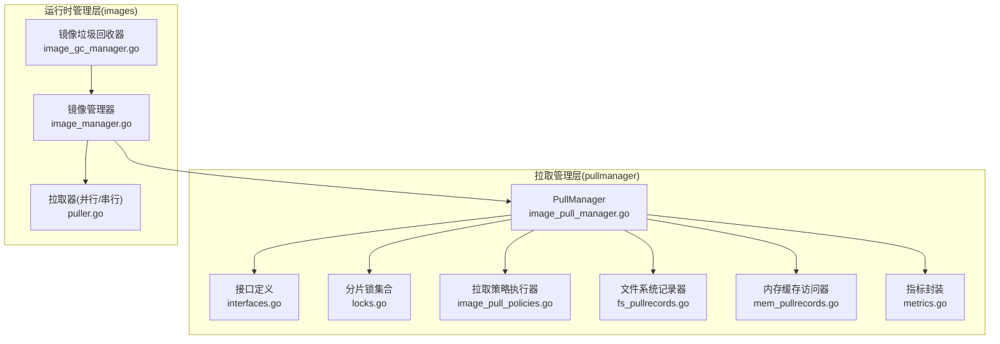
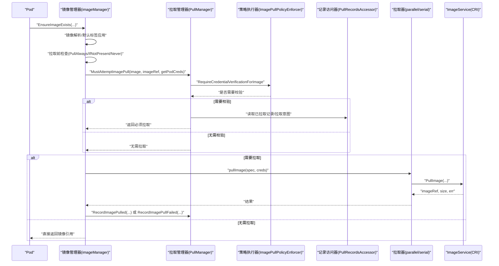
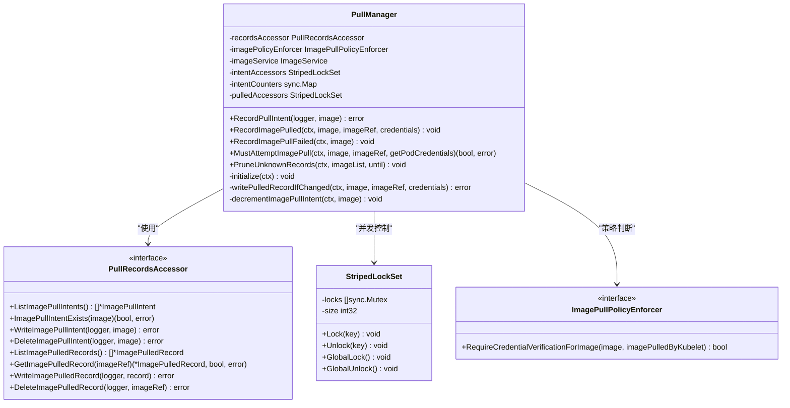
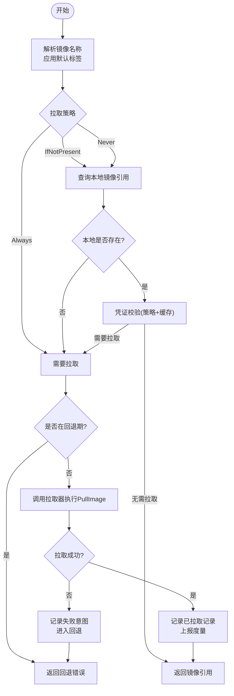
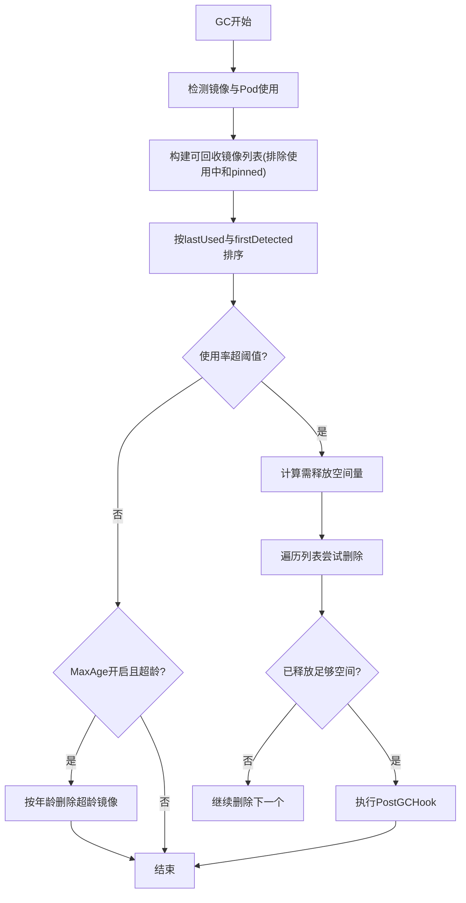
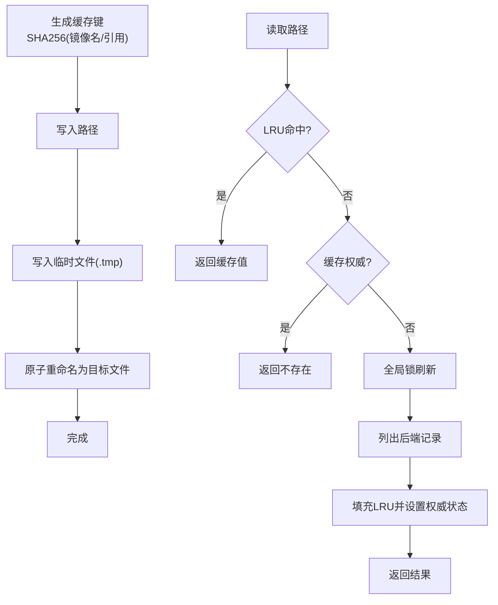
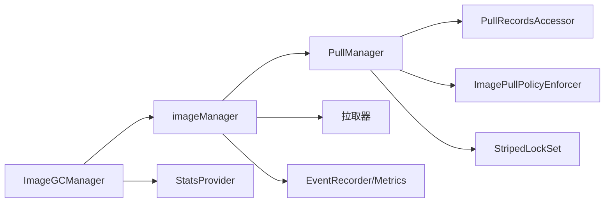

# 镜像管理

<cite>
**本文引用的文件**   
- [image_pull_manager.go](file://pkg/kubelet/images/pullmanager/image_pull_manager.go)
- [interfaces.go](file://pkg/kubelet/images/pullmanager/interfaces.go)
- [locks.go](file://pkg/kubelet/images/pullmanager/locks.go)
- [metrics.go](file://pkg/kubelet/images/pullmanager/metrics.go)
- [fs_pullrecords.go](file://pkg/kubelet/images/pullmanager/fs_pullrecords.go)
- [mem_pullrecords.go](file://pkg/kubelet/images/pullmanager/mem_pullrecords.go)
- [image_pull_policies.go](file://pkg/kubelet/images/pullmanager/image_pull_policies.go)
- [puller.go](file://pkg/kubelet/images/puller.go)
- [image_manager.go](file://pkg/kubelet/images/image_manager.go)
- [image_gc_manager.go](file://pkg/kubelet/images/image_gc_manager.go)
</cite>

## 目录
1. [简介](#简介)
2. [项目结构](#项目结构)
3. [核心组件](#核心组件)
4. [架构总览](#架构总览)
5. [详细组件分析](#详细组件分析)
6. [依赖关系分析](#依赖关系分析)
7. [性能考量](#性能考量)
8. [故障排查指南](#故障排查指南)
9. [结论](#结论)
10. [附录](#附录)

## 简介
本技术文档聚焦 Kubelet 镜像管理系统，围绕镜像拉取管理器（PullManager）的架构设计与并发控制机制展开，深入解析镜像拉取流程（镜像解析、认证处理、分层下载与缓存策略）、镜像垃圾回收机制（空间清理策略、引用计数管理与依赖关系处理）、镜像缓存工作原理（缓存键生成、失效策略与性能优化）、镜像大小计算与存储统计、监控指标收集、失败重试与超时处理、错误恢复策略，以及预拉取、按需拉取与批量拉取的配置选项与使用场景。

## 项目结构
Kubelet 镜像管理相关代码主要分布在两个层次：
- 拉取管理层：位于 pullmanager 包，负责拉取意图记录、已拉取记录、凭证校验策略、并发锁与指标上报等。
- 运行时管理层：位于 images 包，负责镜像拉取编排、并行/串行拉取器、GC 策略、事件与度量等。

图表来源
- [image_pull_manager.go:1-120](file://pkg/kubelet/images/pullmanager/image_pull_manager.go#L1-L120)
- [interfaces.go:1-122](file://pkg/kubelet/images/pullmanager/interfaces.go#L1-L122)
- [locks.go:1-73](file://pkg/kubelet/images/pullmanager/locks.go#L1-L73)
- [image_pull_policies.go:1-213](file://pkg/kubelet/images/pullmanager/image_pull_policies.go#L1-L213)
- [fs_pullrecords.go:1-120](file://pkg/kubelet/images/pullmanager/fs_pullrecords.go#L1-L120)
- [mem_pullrecords.go:1-120](file://pkg/kubelet/images/pullmanager/mem_pullrecords.go#L1-L120)
- [metrics.go:1-163](file://pkg/kubelet/images/pullmanager/metrics.go#L1-L163)
- [image_manager.go:1-120](file://pkg/kubelet/images/image_manager.go#L1-L120)
- [puller.go:1-127](file://pkg/kubelet/images/puller.go#L1-L127)
- [image_gc_manager.go:1-120](file://pkg/kubelet/images/image_gc_manager.go#L1-L120)

章节来源
- [image_pull_manager.go:1-120](file://pkg/kubelet/images/pullmanager/image_pull_manager.go#L1-L120)
- [image_manager.go:1-120](file://pkg/kubelet/images/image_manager.go#L1-L120)
- [image_gc_manager.go:1-120](file://pkg/kubelet/images/image_gc_manager.go#L1-L120)

## 核心组件
- PullManager：维护“拉取意图”和“已拉取记录”，提供 MustAttemptImagePull 决策、RecordPullIntent/RecordImagePulled/RecordImagePullFailed 生命周期方法，并基于策略决定是否需重新验证凭证。
- 记录访问器（PullRecordsAccessor）：抽象持久化层，支持文件系统实现与内存 LRU 缓存包装；FS 实现以原子写保证一致性，LRU 包装提升读路径性能并提供权威状态标记。
- 分片锁集合（StripedLockSet）：基于哈希将字符串键映射到有限数量的互斥锁，降低锁竞争，提高并发度。
- 拉取策略执行器（ImagePullPolicyEnforcer）：根据镜像名、是否由 Kubelet 拉取过等信息决定是否需要凭证校验，支持多种策略（从不校验、仅校验预加载、白名单免校验、总是校验）。
- 镜像管理器（imageManager）：协调拉取前检查、凭证查找、调用 PullManager 决策、选择并行或串行拉取器、回退与重试、事件与度量上报。
- 拉取器（parallel/serial）：封装对 ImageService.PullImage 的调用，支持令牌限流与队列限流，返回镜像引用、大小、耗时与使用的凭证信息。
- 镜像垃圾回收器（ImageGCManager）：周期性检测镜像使用情况，按最近使用时间排序，依据高/低阈值与最小年龄策略删除未使用镜像，支持最大年龄清理与钩子回调。

章节来源
- [image_pull_manager.go:40-120](file://pkg/kubelet/images/pullmanager/image_pull_manager.go#L40-L120)
- [interfaces.go:30-122](file://pkg/kubelet/images/pullmanager/interfaces.go#L30-L122)
- [locks.go:24-73](file://pkg/kubelet/images/pullmanager/locks.go#L24-L73)
- [image_pull_policies.go:29-130](file://pkg/kubelet/images/pullmanager/image_pull_policies.go#L29-L130)
- [image_manager.go:57-120](file://pkg/kubelet/images/image_manager.go#L57-L120)
- [puller.go:29-127](file://pkg/kubelet/images/puller.go#L29-L127)
- [image_gc_manager.go:73-141](file://pkg/kubelet/images/image_gc_manager.go#L73-L141)

## 架构总览
整体数据与控制流如下：
- 上层 Pod 调度触发 EnsureImageExists。
- imageManager 进行镜像解析与拉取前检查，必要时通过 PullManager.MustAttemptImagePull 判定是否需要凭证校验与拉取。
- 若需要拉取，imageManager 选择并行或串行拉取器，调用底层 ImageService 完成分层下载与本地缓存。
- 拉取成功后，PullManager 写入“已拉取记录”（含凭证映射），失败则更新“拉取意图”计数器并清理。
- GC 定期扫描镜像使用状态，按策略释放空间。

图表来源
- [image_manager.go:168-289](file://pkg/kubelet/images/image_manager.go#L168-L289)
- [image_pull_manager.go:184-329](file://pkg/kubelet/images/pullmanager/image_pull_manager.go#L184-L329)
- [image_pull_policies.go:50-130](file://pkg/kubelet/images/pullmanager/image_pull_policies.go#L50-L130)
- [puller.go:55-74](file://pkg/kubelet/images/puller.go#L55-L74)

## 详细组件分析

### 拉取管理器（PullManager）与并发控制
- 并发模型
  - intentAccessors：针对“镜像名”的分片锁，保护拉取意图的写入与递减逻辑。
  - pulledAccessors：针对“镜像引用”的分片锁，保护已拉取记录的读写与合并。
  - intentCounters：内存计数器，跟踪同一镜像的并发拉取意图数量，避免重复拉取与竞态。
- 关键流程
  - RecordPullIntent：在拉取前写入意图记录，递增计数器。
  - RecordImagePulled：成功拉取后写入已拉取记录（包含凭证映射），并尝试递减意图计数器；即使写入失败也不影响“已成功拉取”的判断，重启后可恢复。
  - RecordImagePullFailed：失败时递减意图计数器，当计数归零时删除意图记录。
  - MustAttemptImagePull：综合策略与缓存记录判断是否需要拉取；若命中 NodePodsAccessible 或匹配的 Secret/SA，可跳过拉取。
  - initialize：启动时扫描历史意图，若 CRI 报告镜像已存在，则将意图转为已拉取记录并清理意图。
  - PruneUnknownRecords：GC 阶段清理不在当前镜像列表中的旧记录。

图表来源
- [image_pull_manager.go:40-120](file://pkg/kubelet/images/pullmanager/image_pull_manager.go#L40-L120)
- [interfaces.go:30-122](file://pkg/kubelet/images/pullmanager/interfaces.go#L30-L122)
- [locks.go:24-73](file://pkg/kubelet/images/pullmanager/locks.go#L24-L73)

章节来源
- [image_pull_manager.go:79-182](file://pkg/kubelet/images/pullmanager/image_pull_manager.go#L79-L182)
- [image_pull_manager.go:184-329](file://pkg/kubelet/images/pullmanager/image_pull_manager.go#L184-L329)
- [image_pull_manager.go:359-406](file://pkg/kubelet/images/pullmanager/image_pull_manager.go#L359-L406)
- [image_pull_manager.go:331-357](file://pkg/kubelet/images/pullmanager/image_pull_manager.go#L331-L357)
- [locks.go:24-73](file://pkg/kubelet/images/pullmanager/locks.go#L24-L73)

### 镜像拉取流程（解析、认证、分层下载、缓存）
- 镜像解析
  - 应用默认标签（若无 tag/digest），确保 CRI 兼容性与名称规范化。
- 拉取前检查
  - 根据 PullPolicy 决定：Always 直接拉取；IfNotPresent/Never 先查询本地镜像引用。
- 凭证查找与缓存
  - 动态构建 keyring（节点级 + 外部插件），按仓库解析匹配 TrackedAuthConfig。
  - 若启用特性开关，通过 PullManager.MustAttemptImagePull 结合策略与缓存记录判断是否需要再次拉取。
- 实际拉取
  - 选择并行或串行拉取器，调用 ImageService.PullImage 完成分层下载与本地缓存。
  - 获取镜像大小（尽力而为），记录耗时与使用的凭证。
- 结果处理
  - 成功：记录已拉取记录（含凭证映射），上报度量，清除回退状态。
  - 失败：记录失败意图，进入指数回退，保留上次错误消息以便后续提示。

图表来源
- [image_manager.go:168-289](file://pkg/kubelet/images/image_manager.go#L168-L289)
- [puller.go:55-74](file://pkg/kubelet/images/puller.go#L55-L74)
- [image_pull_manager.go:184-329](file://pkg/kubelet/images/pullmanager/image_pull_manager.go#L184-L329)

章节来源
- [image_manager.go:168-289](file://pkg/kubelet/images/image_manager.go#L168-L289)
- [puller.go:55-74](file://pkg/kubelet/images/puller.go#L55-L74)

### 镜像垃圾回收机制（空间清理、引用计数、依赖关系）
- 策略参数
  - HighThresholdPercent/LowThresholdPercent：磁盘使用率阈值带。
  - MinAge：镜像最小存活时间，防止刚拉取的镜像被立即回收。
  - MaxAge：最大存活时间（受特性门控与配置控制），超过即按年龄清理。
- 运行流程
  - 周期性检测镜像与 Pod 使用情况，维护 imageRecords（首次发现时间、最后使用时间、大小、是否 pinned）。
  - 按 lastUsed 与 firstDetected 排序，优先回收最久未使用的非 pinned 镜像。
  - 若使用率超过高阈值，计算需释放空间量，循环删除直到达到低阈值或无可用镜像。
  - 支持 PostGCHook 回调，便于外部系统感知 GC 结果。
- 引用计数与依赖
  - 通过 runtime.ListImages 与 runtime.GetPods 建立使用集，考虑 ImageVolume 挂载情况。
  - 当 RuntimeClassInImageCriAPI 启用时，索引键为 (imageID,runtimeHandler) 元组，避免跨运行时处理器误删。

图表来源
- [image_gc_manager.go:349-418](file://pkg/kubelet/images/image_gc_manager.go#L349-L418)
- [image_gc_manager.go:426-456](file://pkg/kubelet/images/image_gc_manager.go#L426-L456)
- [image_gc_manager.go:483-522](file://pkg/kubelet/images/image_gc_manager.go#L483-L522)
- [image_gc_manager.go:549-593](file://pkg/kubelet/images/image_gc_manager.go#L549-L593)

章节来源
- [image_gc_manager.go:89-141](file://pkg/kubelet/images/image_gc_manager.go#L89-L141)
- [image_gc_manager.go:349-418](file://pkg/kubelet/images/image_gc_manager.go#L349-L418)
- [image_gc_manager.go:483-522](file://pkg/kubelet/images/image_gc_manager.go#L483-L522)
- [image_gc_manager.go:549-593](file://pkg/kubelet/images/image_gc_manager.go#L549-L593)

### 镜像缓存工作原理（缓存键、失效策略、性能优化）
- 缓存键生成
  - 文件系统实现：对镜像名/镜像引用进行 SHA256 哈希，前缀 sha256-，文件名不含 .tmp。
  - 内存缓存实现：以镜像名或镜像引用作为 LRU 键。
- 失效策略
  - 显式删除：对应键从 LRU 移除，不改变权威状态。
  - 容量溢出：触发权威状态置为非权威，下次 List 会刷新缓存。
  - 初始化失败或错误：同样置为非权威，降级为直连后端。
- 性能优化
  - 双检模式：先无锁 Get，再在分片锁下二次检查，减少锁竞争。
  - 全局锁仅在非权威状态下用于全量刷新，避免频繁扫描。
  - 原子写：FS 实现采用临时文件 + rename 保证原子性。

图表来源
- [fs_pullrecords.go:272-308](file://pkg/kubelet/images/pullmanager/fs_pullrecords.go#L272-L308)
- [mem_pullrecords.go:90-123](file://pkg/kubelet/images/pullmanager/mem_pullrecords.go#L90-L123)
- [mem_pullrecords.go:258-289](file://pkg/kubelet/images/pullmanager/mem_pullrecords.go#L258-L289)

章节来源
- [fs_pullrecords.go:272-308](file://pkg/kubelet/images/pullmanager/fs_pullrecords.go#L272-L308)
- [mem_pullrecords.go:90-123](file://pkg/kubelet/images/pullmanager/mem_pullrecords.go#L90-L123)
- [mem_pullrecords.go:258-289](file://pkg/kubelet/images/pullmanager/mem_pullrecords.go#L258-L289)

### 镜像大小计算、存储统计与监控指标
- 镜像大小
  - 拉取完成后尽力获取镜像大小，用于度量与日志输出。
- 存储统计
  - GC 使用 statsProvider.ImageFsStats 获取容量与可用空间，计算使用率并触发清理。
- 监控指标
  - 拉取管理器指标：磁盘上意图/已拉取记录数、内存缓存使用百分比、MustAttemptImagePull 结果计数。
  - 镜像拉取时长：按镜像大小桶观测拉取耗时。
  - GC 指标：按原因（age/space）统计垃圾回收总数。

章节来源
- [puller.go:61-74](file://pkg/kubelet/images/puller.go#L61-L74)
- [image_gc_manager.go:365-418](file://pkg/kubelet/images/image_gc_manager.go#L365-L418)
- [metrics.go:36-86](file://pkg/kubelet/images/pullmanager/metrics.go#L36-L86)
- [image_manager.go:380-389](file://pkg/kubelet/images/image_manager.go#L380-L389)

### 失败重试、超时与错误恢复
- 失败重试
  - 基于 flowcontrol.Backoff 的指数回退，按 podUID+image 维度去重，避免风暴。
  - 记录上一次拉取错误消息，在回退期间提示更详细信息。
- 超时处理
  - 拉取过程遵循上下文超时；拉取器内部不额外设置超时，由上层控制。
- 错误恢复
  - 拉取失败时更新意图计数器，归零则删除意图文件，避免僵尸状态。
  - 拉取成功但记录写入失败时，仍视为成功，重启后可通过 initialize 恢复。

章节来源
- [image_manager.go:324-389](file://pkg/kubelet/images/image_manager.go#L324-L389)
- [image_pull_manager.go:158-182](file://pkg/kubelet/images/pullmanager/image_pull_manager.go#L158-L182)
- [image_pull_manager.go:91-104](file://pkg/kubelet/images/pullmanager/image_pull_manager.go#L91-L104)

### 预拉取、按需拉取与批量拉取
- 预拉取
  - 通过提前调用 EnsureImageExists 或独立任务拉取常用镜像，配合 NeverVerifyPreloadedImages 策略可减少运行时校验开销。
- 按需拉取
  - PullIfNotPresent 策略结合 MustAttemptImagePull 的缓存与策略判断，避免不必要的拉取。
- 批量拉取
  - 并行拉取器通过令牌通道限制并发度；串行拉取器通过队列限流（最大排队请求数）控制负载。
  - 建议在高吞吐场景使用并行拉取器并合理设置 maxParallelImagePulls。

章节来源
- [image_pull_policies.go:71-81](file://pkg/kubelet/images/pullmanager/image_pull_policies.go#L71-L81)
- [puller.go:48-53](file://pkg/kubelet/images/puller.go#L48-L53)
- [puller.go:76-88](file://pkg/kubelet/images/puller.go#L76-L88)

## 依赖关系分析
- 组件耦合
  - imageManager 依赖 PullManager 做拉取决策，依赖拉取器执行实际拉取，依赖 recorder 与 metrics 上报事件与指标。
  - PullManager 依赖 PullRecordsAccessor 抽象持久化层，依赖 ImagePullPolicyEnforcer 做策略判断，依赖分片锁集合进行并发控制。
- 外部依赖
  - CRI ImageService：镜像拉取、查询、大小获取。
  - statsProvider：镜像文件系统统计。
  - feature gate：如 RuntimeClassInImageCriAPI、KubeletEnsureSecretPulledImages 等影响行为。

图表来源
- [image_manager.go:57-120](file://pkg/kubelet/images/image_manager.go#L57-L120)
- [image_pull_manager.go:40-120](file://pkg/kubelet/images/pullmanager/image_pull_manager.go#L40-L120)
- [image_gc_manager.go:109-141](file://pkg/kubelet/images/image_gc_manager.go#L109-L141)

章节来源
- [image_manager.go:57-120](file://pkg/kubelet/images/image_manager.go#L57-L120)
- [image_pull_manager.go:40-120](file://pkg/kubelet/images/pullmanager/image_pull_manager.go#L40-L120)
- [image_gc_manager.go:109-141](file://pkg/kubelet/images/image_gc_manager.go#L109-L141)

## 性能考量
- 并发控制
  - 分片锁集合降低锁粒度，提高并发度；内存计数器避免重复拉取。
- I/O 优化
  - FS 原子写避免脏数据；LRU 缓存减少后端扫描与序列化开销。
- 限流与背压
  - 并行拉取令牌限流；串行拉取队列限流；ImageService 调用 QPS/Burst 节流。
- 指标驱动调优
  - 观察 mustpull 检查结果分布、缓存使用百分比、拉取时长与 GC 效果，调整策略与阈值。

[本节为通用指导，不直接分析具体文件]

## 故障排查指南
- 常见问题
  - 拉取失败进入回退：检查 backOffKey 对应的错误消息与回退状态。
  - 凭证校验失败：确认策略配置、白名单模式、Secret/SA 坐标与哈希是否匹配。
  - GC 无法释放空间：检查磁盘占用（日志、卷、其他数据），确认镜像是否被使用或 pinned。
- 定位手段
  - 查看拉取管理器指标（意图/已拉取记录数、缓存使用百分比、mustpull 结果）。
  - 检查文件系统记录目录（pulling/pulled）是否存在异常文件或权限问题。
  - 关注 GC 事件与日志，确认阈值与年龄策略是否符合预期。

章节来源
- [image_manager.go:324-389](file://pkg/kubelet/images/image_manager.go#L324-L389)
- [metrics.go:36-86](file://pkg/kubelet/images/pullmanager/metrics.go#L36-L86)
- [fs_pullrecords.go:272-308](file://pkg/kubelet/images/pullmanager/fs_pullrecords.go#L272-L308)
- [image_gc_manager.go:349-418](file://pkg/kubelet/images/image_gc_manager.go#L349-L418)

## 结论
Kubelet 镜像管理系统通过 PullManager 的意图与记录机制、分片锁并发控制、灵活的凭证校验策略与高效的缓存实现，实现了安全、可靠且高性能的镜像拉取与复用。配合 GC 策略与完善的指标体系，可在复杂生产环境中稳定运行。建议结合实际业务场景选择合适的拉取策略、并发度与阈值，并通过指标持续优化。

[本节为总结，不直接分析具体文件]

## 附录
- 术语
  - 拉取意图：表示正在进行的镜像拉取，用于去重与幂等。
  - 已拉取记录：记录镜像引用与凭证映射，用于后续快速校验。
  - 策略执行器：根据镜像名与历史记录决定是否需要凭证校验。
  - 分片锁集合：将键空间分散到多个互斥锁以降低竞争。
- 配置要点
  - 拉取策略：NeverVerify/AlwaysVerify/Allowlist/Preloaded。
  - 并发度：maxParallelImagePulls、串行队列上限。
  - GC 阈值：High/Low 使用率阈值、MinAge、MaxAge。
  - 特性门控：RuntimeClassInImageCriAPI、KubeletEnsureSecretPulledImages 等。

[本节为补充说明，不直接分析具体文件]