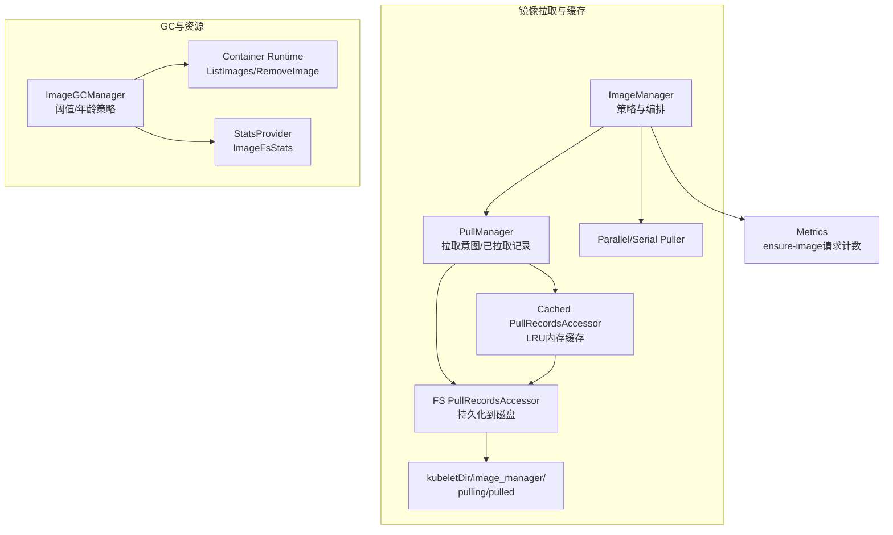
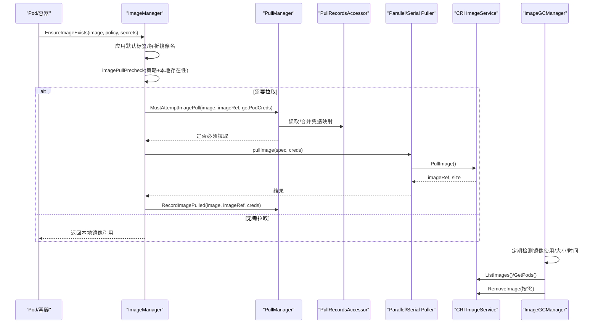
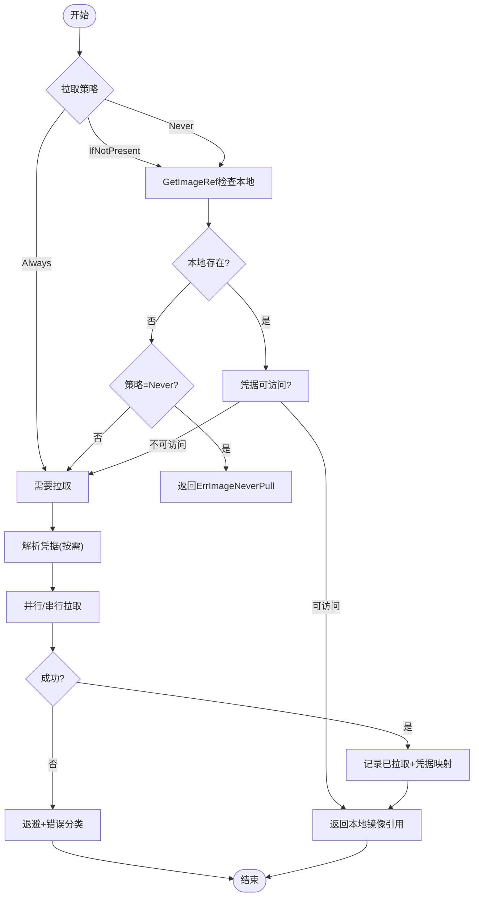
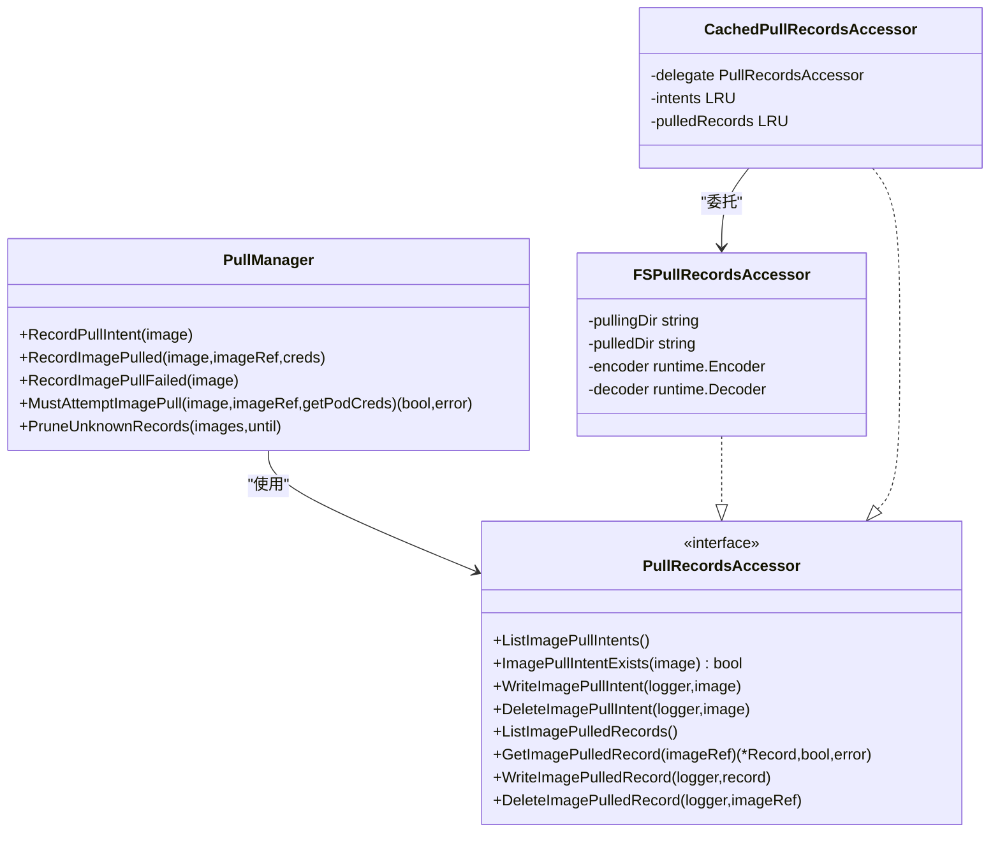
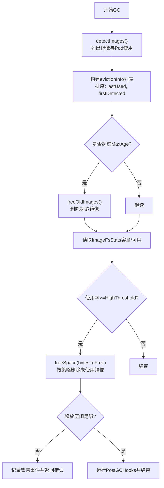
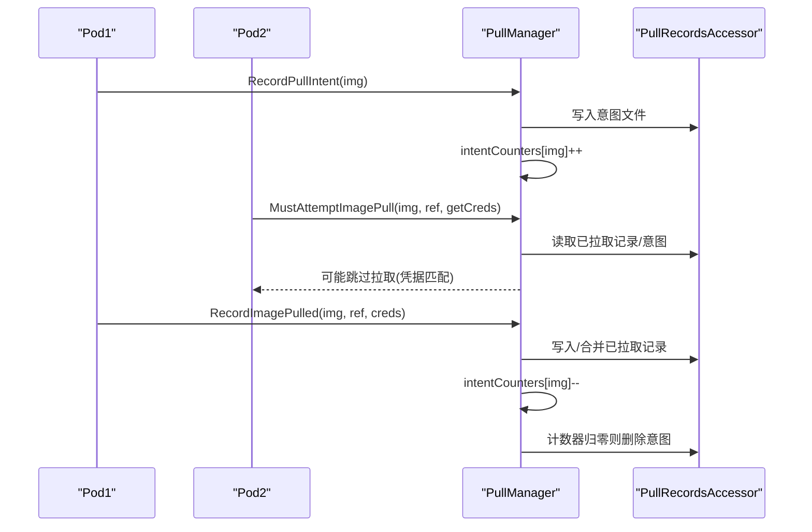
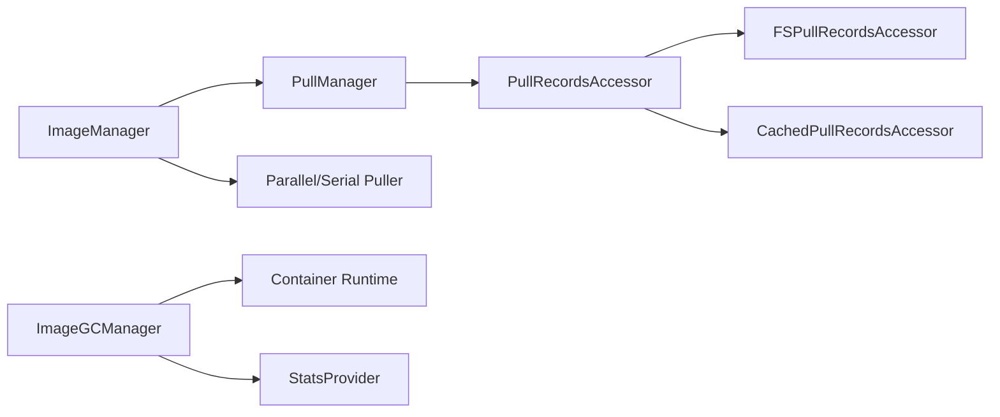

# 镜像缓存

<cite>
**本文引用的文件**   
- [image_manager.go](file://pkg/kubelet/images/image_manager.go)
- [puller.go](file://pkg/kubelet/images/puller.go)
- [types.go](file://pkg/kubelet/images/types.go)
- [metrics.go](file://pkg/kubelet/images/metrics.go)
- [image_gc_manager.go](file://pkg/kubelet/images/image_gc_manager.go)
- [image_pull_manager.go](file://pkg/kubelet/images/pullmanager/image_pull_manager.go)
- [interfaces.go](file://pkg/kubelet/images/pullmanager/interfaces.go)
- [fs_pullrecords.go](file://pkg/kubelet/images/pullmanager/fs_pullrecords.go)
- [mem_pullrecords.go](file://pkg/kubelet/images/pullmanager/mem_pullrecords.go)
</cite>

## 目录
1. [简介](#简介)
2. [项目结构](#项目结构)
3. [核心组件](#核心组件)
4. [架构总览](#架构总览)
5. [详细组件分析](#详细组件分析)
6. [依赖关系分析](#依赖关系分析)
7. [性能考虑](#性能考虑)
8. [故障排查指南](#故障排查指南)
9. [结论](#结论)
10. [附录](#附录)

## 简介
本文件面向Kubelet镜像缓存系统，系统性阐述其架构设计与实现细节，覆盖以下主题：
- 缓存键生成策略、镜像引用管理与版本控制机制
- 缓存失效策略（镜像更新检测、依赖跟踪、清理触发条件）
- 镜像存在性检查流程（本地查找、验证与访问权限检查）
- 缓存状态同步机制（多Pod共享镜像、竞态避免）
- 性能优化技术（预加载、懒加载、预热）
- 统计信息与监控指标
- 配置参数调优与故障排查方法

## 项目结构
Kubelet镜像子系统位于 pkg/kubelet/images 及其子包 pullmanager。主要职责划分如下：
- image_manager.go：镜像拉取协调器，负责策略判断、凭证解析、并发/串行拉取调度、错误处理与度量上报
- puller.go：并行/串行拉取器抽象与实现
- types.go：对外接口定义与错误类型
- metrics.go：镜像管理器相关指标注册与记录
- image_gc_manager.go：镜像垃圾回收与空间管理
- pullmanager/*：镜像拉取状态与凭据缓存层，包含持久化（文件系统）与内存LRU缓存实现

图表来源
- [image_manager.go:75-105](file://pkg/kubelet/images/image_manager.go#L75-L105)
- [puller.go:43-74](file://pkg/kubelet/images/puller.go#L43-L74)
- [image_pull_manager.go:47-77](file://pkg/kubelet/images/pullmanager/image_pull_manager.go#L47-L77)
- [fs_pullrecords.go:61-85](file://pkg/kubelet/images/pullmanager/fs_pullrecords.go#L61-L85)
- [mem_pullrecords.go:101-123](file://pkg/kubelet/images/pullmanager/mem_pullrecords.go#L101-L123)
- [image_gc_manager.go:192-216](file://pkg/kubelet/images/image_gc_manager.go#L192-L216)

章节来源
- [image_manager.go:75-105](file://pkg/kubelet/images/image_manager.go#L75-L105)
- [puller.go:43-74](file://pkg/kubelet/images/puller.go#L43-L74)
- [image_pull_manager.go:47-77](file://pkg/kubelet/images/pullmanager/image_pull_manager.go#L47-L77)
- [fs_pullrecords.go:61-85](file://pkg/kubelet/images/pullmanager/fs_pullrecords.go#L61-L85)
- [mem_pullrecords.go:101-123](file://pkg/kubelet/images/pullmanager/mem_pullrecords.go#L101-L123)
- [image_gc_manager.go:192-216](file://pkg/kubelet/images/image_gc_manager.go#L192-L216)

## 核心组件
- ImageManager：统一入口，封装镜像存在性检查、拉取决策、并发控制、错误与退避、事件与度量
- PullManager：维护“拉取意图”和“已拉取记录”，并基于凭据映射进行跨Pod的访问判定
- PullRecordsAccessor：统一抽象，支持文件系统与内存LRU两种后端
- Parallel/Serial Puller：对底层ImageService的拉取调用进行并发或串行封装
- ImageGCManager：按使用频率、最小年龄、高/低水位等策略执行镜像清理

章节来源
- [types.go:44-54](file://pkg/kubelet/images/types.go#L44-L54)
- [image_manager.go:75-105](file://pkg/kubelet/images/image_manager.go#L75-L105)
- [image_pull_manager.go:47-77](file://pkg/kubelet/images/pullmanager/image_pull_manager.go#L47-L77)
- [puller.go:43-74](file://pkg/kubelet/images/puller.go#L43-L74)
- [image_gc_manager.go:192-216](file://pkg/kubelet/images/image_gc_manager.go#L192-L216)

## 架构总览
整体数据流与控制流如下：
- 上层通过 EnsureImageExists 发起镜像保障
- 先做策略前置检查（Always/IfNotPresent/Never），必要时查询本地镜像
- 若需要拉取，则进入 PullManager 的 MustAttemptImagePull 进行凭据校验与去重
- 根据配置选择并行或串行拉取器，最终调用 CRI 拉取
- 成功拉取后写入“已拉取记录”，失败则清理“拉取意图”
- GC 周期扫描镜像使用情况，按策略删除无用镜像以释放空间

图表来源
- [image_manager.go:170-289](file://pkg/kubelet/images/image_manager.go#L170-L289)
- [image_pull_manager.go:184-329](file://pkg/kubelet/images/pullmanager/image_pull_manager.go#L184-L329)
- [puller.go:55-74](file://pkg/kubelet/images/puller.go#L55-L74)
- [image_gc_manager.go:244-323](file://pkg/kubelet/images/image_gc_manager.go#L244-L323)

## 详细组件分析

### 镜像存在性检查与拉取流程
- 策略分支
  - Always：直接拉取
  - IfNotPresent/Never：先 GetImageRef 检查本地是否存在
  - Never且不存在：返回特定错误
- 默认标签补齐：未指定tag/digest时补全为默认tag
- 凭据解析：从Secret/ServiceAccount/外部插件组合DockerKeyring，仅当需要时计算
- 并发控制：支持并行（令牌桶）与串行（队列）两种拉取模式
- 错误与退避：CRI错误分类（如RegistryUnavailable、SignatureValidationFailed），指数退避与消息聚合
- 度量上报：记录EnsureImage请求的policy、present_locally、pull_required

图表来源
- [image_manager.go:107-136](file://pkg/kubelet/images/image_manager.go#L107-L136)
- [image_manager.go:170-289](file://pkg/kubelet/images/image_manager.go#L170-L289)
- [image_manager.go:324-389](file://pkg/kubelet/images/image_manager.go#L324-L389)
- [image_manager.go:391-420](file://pkg/kubelet/images/image_manager.go#L391-L420)
- [puller.go:43-74](file://pkg/kubelet/images/puller.go#L43-L74)

章节来源
- [image_manager.go:107-136](file://pkg/kubelet/images/image_manager.go#L107-L136)
- [image_manager.go:170-289](file://pkg/kubelet/images/image_manager.go#L170-L289)
- [image_manager.go:324-389](file://pkg/kubelet/images/image_manager.go#L324-L389)
- [image_manager.go:391-420](file://pkg/kubelet/images/image_manager.go#L391-L420)
- [puller.go:43-74](file://pkg/kubelet/images/puller.go#L43-L74)

### 缓存键生成策略、镜像引用管理与版本控制
- 缓存键
  - 拉取意图键：以镜像字符串（含tag/digest）作为文件名键
  - 已拉取记录键：以CRI返回的imageRef（通常为digest）作为文件名键
  - 文件名采用sha256前缀+哈希值，保证唯一性与稳定性
- 镜像引用管理
  - 记录中保存imageRef与凭据映射（按“去tag/digest后的镜像名”维度）
  - 支持NodePodsAccessible、KubernetesSecrets、KubernetesServiceAccounts三类凭据来源
- 版本控制
  - 读写采用严格编解码器，启动时进行版本迁移，将旧格式转换为当前内部API版本
  - 文件写入采用原子操作（临时文件+rename），避免部分写入导致损坏

图表来源
- [interfaces.go:35-83](file://pkg/kubelet/images/pullmanager/interfaces.go#L35-L83)
- [fs_pullrecords.go:61-85](file://pkg/kubelet/images/pullmanager/fs_pullrecords.go#L61-L85)
- [mem_pullrecords.go:101-123](file://pkg/kubelet/images/pullmanager/mem_pullrecords.go#L101-L123)
- [image_pull_manager.go:47-77](file://pkg/kubelet/images/pullmanager/image_pull_manager.go#L47-L77)

章节来源
- [fs_pullrecords.go:272-308](file://pkg/kubelet/images/pullmanager/fs_pullrecords.go#L272-L308)
- [fs_pullrecords.go:352-384](file://pkg/kubelet/images/pullmanager/fs_pullrecords.go#L352-L384)
- [image_pull_manager.go:116-156](file://pkg/kubelet/images/pullmanager/image_pull_manager.go#L116-L156)
- [mem_pullrecords.go:101-123](file://pkg/kubelet/images/pullmanager/mem_pullrecords.go#L101-L123)

### 缓存失效策略：镜像更新检测、依赖跟踪与清理触发
- 镜像更新检测
  - 通过CRI ListImages获取最新镜像列表；结合Pod使用信息标记“正在使用”的镜像
  - 启用RuntimeClassInImageCriAPI时，索引键为(imageID,runtimeHandler)元组，区分不同运行时处理器下的同一镜像
- 依赖跟踪
  - 记录每个镜像首次发现时间、最近使用时间、大小、是否被pinned
  - 支持ImageVolume特性，将作为卷挂载的镜像视为“在使用”
- 清理触发条件
  - 高水位阈值：超过HighThresholdPercent时，尝试释放空间至LowThresholdPercent
  - 最大年龄：MaxAge>0且自Kubelet启动后超过该时长，可清理最久未使用的镜像
  - MinAge保护：新拉取镜像在MinAge内不被清理
  - 非空闲镜像与pinned镜像不参与清理

图表来源
- [image_gc_manager.go:244-323](file://pkg/kubelet/images/image_gc_manager.go#L244-L323)
- [image_gc_manager.go:349-418](file://pkg/kubelet/images/image_gc_manager.go#L349-L418)
- [image_gc_manager.go:426-456](file://pkg/kubelet/images/image_gc_manager.go#L426-L456)
- [image_gc_manager.go:483-522](file://pkg/kubelet/images/image_gc_manager.go#L483-L522)

章节来源
- [image_gc_manager.go:244-323](file://pkg/kubelet/images/image_gc_manager.go#L244-L323)
- [image_gc_manager.go:349-418](file://pkg/kubelet/images/image_gc_manager.go#L349-L418)
- [image_gc_manager.go:426-456](file://pkg/kubelet/images/image_gc_manager.go#L426-L456)
- [image_gc_manager.go:483-522](file://pkg/kubelet/images/image_gc_manager.go#L483-L522)

### 缓存状态同步机制：多Pod共享与竞态避免
- 拉取意图与计数
  - 每次拉取前记录ImagePullIntent，并在内存中维护计数器；失败或成功后递减，归零时删除意图文件
- 并发锁粒度
  - 使用StripedLockSet对image/imageRef进行分片锁，降低热点冲突
- 幂等与恢复
  - 启动时初始化：遍历历史意图，若CRI已报告镜像存在，则转为“已拉取记录”并删除意图
  - 写路径采用原子文件替换，读路径支持LRU缓存加速
- 凭据匹配与回写
  - 比较Secret坐标与CredentialHash，匹配成功时可选择回写更新后的凭据映射，减少后续重复校验

图表来源
- [image_pull_manager.go:79-104](file://pkg/kubelet/images/pullmanager/image_pull_manager.go#L79-L104)
- [image_pull_manager.go:158-182](file://pkg/kubelet/images/pullmanager/image_pull_manager.go#L158-L182)
- [image_pull_manager.go:366-406](file://pkg/kubelet/images/pullmanager/image_pull_manager.go#L366-L406)
- [mem_pullrecords.go:101-123](file://pkg/kubelet/images/pullmanager/mem_pullrecords.go#L101-L123)

章节来源
- [image_pull_manager.go:79-104](file://pkg/kubelet/images/pullmanager/image_pull_manager.go#L79-L104)
- [image_pull_manager.go:158-182](file://pkg/kubelet/images/pullmanager/image_pull_manager.go#L158-L182)
- [image_pull_manager.go:366-406](file://pkg/kubelet/images/pullmanager/image_pull_manager.go#L366-L406)
- [mem_pullrecords.go:101-123](file://pkg/kubelet/images/pullmanager/mem_pullrecords.go#L101-L123)

### 性能优化：预加载、懒加载与预热
- 懒加载
  - 凭据解析仅在需要时执行（makeLookupPullCredentialsFunc），避免不必要的开销
- 并发控制
  - 并行拉取器通过令牌通道限制并发度；串行拉取器通过队列顺序执行，避免CRI过载
- 预热
  - 内存缓存启动时批量加载意图与已拉取记录，尽快达到权威状态
- 缓存命中优化
  - 文件级原子写与LRU热路径，减少磁盘I/O与锁竞争

章节来源
- [image_manager.go:291-322](file://pkg/kubelet/images/image_manager.go#L291-L322)
- [puller.go:43-74](file://pkg/kubelet/images/puller.go#L43-L74)
- [mem_pullrecords.go:101-123](file://pkg/kubelet/images/pullmanager/mem_pullrecords.go#L101-L123)

### 统计信息与监控指标
- 镜像管理器指标
  - ensure_image_manager_ensure_image_requests_total：按拉取策略、本地是否存在、是否需要拉取三个维度计数
- GC指标
  - image_garbage_collected_total：按原因（age/space）累计删除次数
- 拉取耗时
  - image_pull_duration_seconds：按镜像大小桶观测拉取耗时

章节来源
- [metrics.go:30-66](file://pkg/kubelet/images/metrics.go#L30-L66)
- [image_gc_manager.go:544-546](file://pkg/kubelet/images/image_gc_manager.go#L544-L546)
- [image_manager.go:380-384](file://pkg/kubelet/images/image_manager.go#L380-L384)

## 依赖关系分析
- 组件耦合
  - ImageManager依赖PullManager与Puller，间接依赖PullRecordsAccessor
  - PullManager依赖PullRecordsAccessor与ImageService（用于初始化恢复）
  - ImageGCManager依赖Runtime与StatsProvider
- 外部依赖
  - CRI ImageService：镜像拉取、查询、删除
  - 凭证提供者：Secret、ServiceAccount、外部插件
  - 特征开关：如KubeletEnsureSecretPulledImages、RuntimeClassInImageCriAPI、ImageVolume等

图表来源
- [image_manager.go:75-105](file://pkg/kubelet/images/image_manager.go#L75-L105)
- [image_pull_manager.go:47-77](file://pkg/kubelet/images/pullmanager/image_pull_manager.go#L47-L77)
- [fs_pullrecords.go:61-85](file://pkg/kubelet/images/pullmanager/fs_pullrecords.go#L61-L85)
- [mem_pullrecords.go:101-123](file://pkg/kubelet/images/pullmanager/mem_pullrecords.go#L101-L123)
- [image_gc_manager.go:192-216](file://pkg/kubelet/images/image_gc_manager.go#L192-L216)

章节来源
- [image_manager.go:75-105](file://pkg/kubelet/images/image_manager.go#L75-L105)
- [image_pull_manager.go:47-77](file://pkg/kubelet/images/pullmanager/image_pull_manager.go#L47-L77)
- [fs_pullrecords.go:61-85](file://pkg/kubelet/images/pullmanager/fs_pullrecords.go#L61-L85)
- [mem_pullrecords.go:101-123](file://pkg/kubelet/images/pullmanager/mem_pullrecords.go#L101-L123)
- [image_gc_manager.go:192-216](file://pkg/kubelet/images/image_gc_manager.go#L192-L216)

## 性能考虑
- 并发拉取上限：合理设置maxParallelImagePulls，避免CRI拥塞
- 串行模式：在高争用场景下可降低锁竞争与CRI压力
- 缓存命中率：增大内存缓存容量可减少磁盘访问，但需权衡内存占用
- GC阈值：调整High/Low阈值与MinAge/MaxAge，平衡空间回收与活跃镜像保护
- 指标观测：关注ensure-image请求分布、拉取耗时与GC原因，定位瓶颈

[本节为通用指导，不直接分析具体文件]

## 故障排查指南
- 常见错误码与语义
  - ErrImagePullBackOff：拉取失败进入退避
  - ErrImageInspect：无法检查镜像
  - ErrImagePull：通用拉取错误
  - ErrImageNeverPull：策略为Never且镜像不存在
  - ErrInvalidImageName：镜像名解析失败
- 典型问题定位
  - 拉取失败：查看CRI错误分类（RegistryUnavailable/SignatureValidationFailed），确认网络与签名策略
  - 权限问题：核对Secret/ServiceAccount坐标与CredentialHash是否匹配
  - 空间不足：检查ImageFsStats容量与可用空间，观察GC事件
  - 缓存不一致：重启后自动恢复；若仍异常，检查pulling/pulled目录文件完整性
- 建议步骤
  - 收集指标：ensure-image请求、拉取耗时、GC计数
  - 检查日志：事件记录与klog输出
  - 验证文件：pulling/pulled目录下文件命名与内容一致性

章节来源
- [types.go:27-42](file://pkg/kubelet/images/types.go#L27-L42)
- [image_manager.go:391-420](file://pkg/kubelet/images/image_manager.go#L391-L420)
- [image_gc_manager.go:385-418](file://pkg/kubelet/images/image_gc_manager.go#L385-L418)

## 结论
Kubelet镜像缓存系统通过分层设计实现了高效、可靠的镜像拉取与生命周期管理：
- 以PullManager为核心的状态机确保多Pod共享与凭据安全
- 以文件系统与LRU结合的持久化方案提供强一致与高性能
- GC模块提供灵活的空间回收策略，保障节点健康
- 完善的错误分类、指标与事件便于运维诊断与调优

[本节为总结性内容，不直接分析具体文件]

## 附录

### 配置参数调优要点
- 拉取并发：maxParallelImagePulls（并行模式）
- 拉取节流：QPS/Burst（对ImageService调用限速）
- GC策略：HighThresholdPercent、LowThresholdPercent、MinAge、MaxAge
- 缓存容量：内存LRU的intents与pulledRecords上限
- 特征开关：KubeletEnsureSecretPulledImages、RuntimeClassInImageCriAPI、ImageVolume等

[本节为通用指导，不直接分析具体文件]