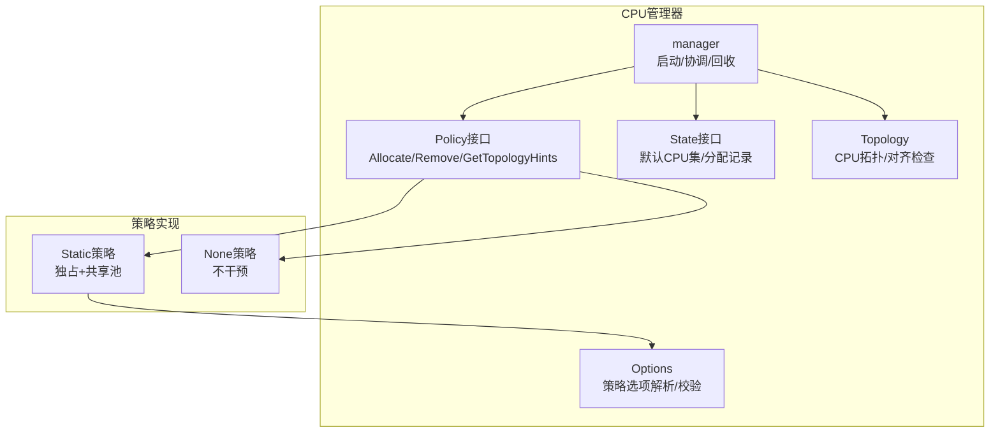
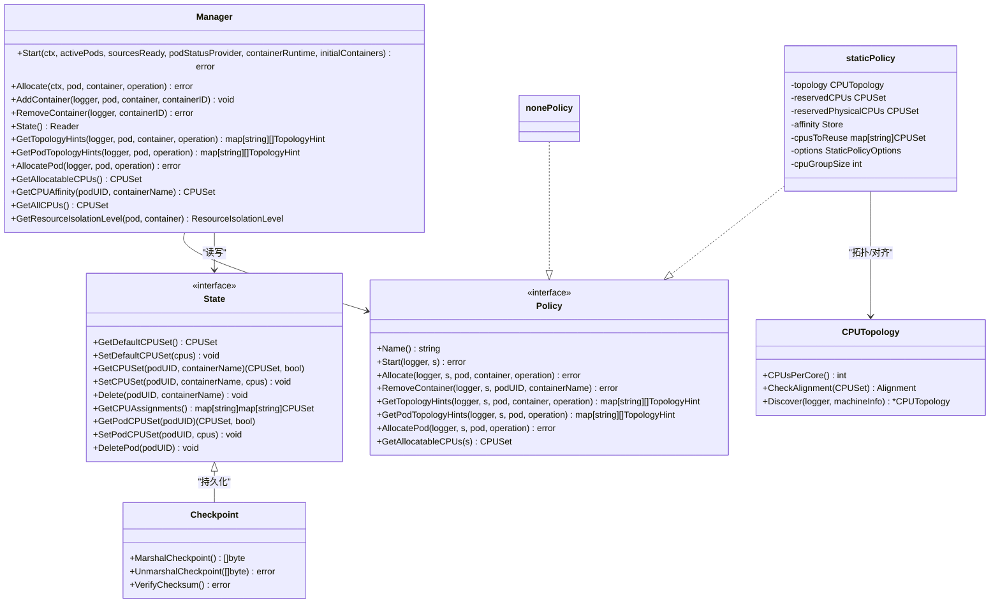
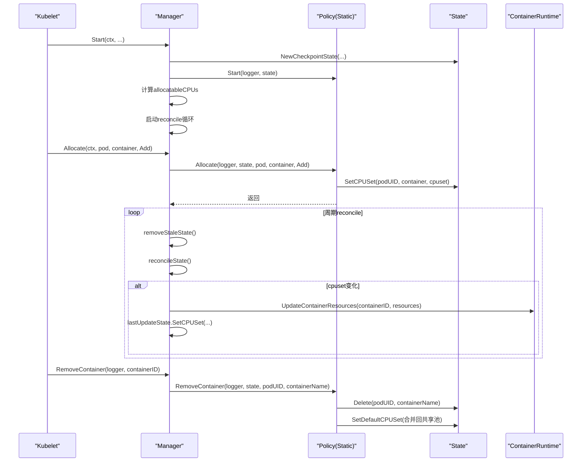
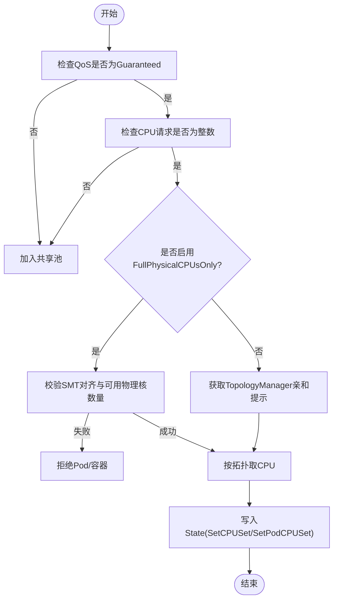
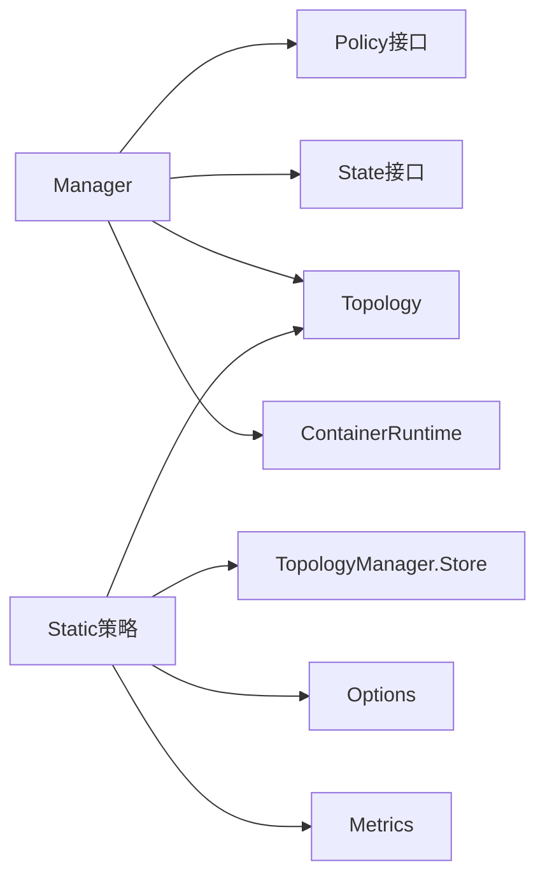

# CPU管理器

<cite>
**本文引用的文件**   
- [cpu_manager.go](file://pkg/kubelet/cm/cpumanager/cpu_manager.go)
- [policy.go](file://pkg/kubelet/cm/cpumanager/policy.go)
- [policy_static.go](file://pkg/kubelet/cm/cpumanager/policy_static.go)
- [policy_none.go](file://pkg/kubelet/cm/cpumanager/policy_none.go)
- [policy_options.go](file://pkg/kubelet/cm/cpumanager/policy_options.go)
- [checkpoint.go](file://pkg/kubelet/cm/cpumanager/state/checkpoint.go)
- [topology.go](file://pkg/kubelet/cm/cpumanager/topology/topology.go)
</cite>

## 目录
1. [简介](#简介)
2. [项目结构](#项目结构)
3. [核心组件](#核心组件)
4. [架构总览](#架构总览)
5. [详细组件分析](#详细组件分析)
6. [依赖关系分析](#依赖关系分析)
7. [性能考虑](#性能考虑)
8. [故障排查指南](#故障排查指南)
9. [结论](#结论)
10. [附录](#附录)

## 简介
本文件为Kubelet CPU管理器的技术文档，聚焦以下主题：
- 架构设计与工作原理：独占CPU分配、共享CPU池与动态调整机制
- CPU管理策略：static、dynamic、none的特点与适用场景
- CPU集（CPUSet）管理：NUMA感知分配、CPU亲和性设置与负载均衡
- 回收与重新分配：Pod生命周期事件处理与资源释放
- 配置选项详解：策略参数调优与性能优化建议
- 争用诊断与常见问题排查

说明：
- 当前代码库实现了none与static两种策略；dynamic策略在CPU管理器中未提供实现。
- 本文所有实现细节均基于仓库源码进行分析与总结。

## 项目结构
CPU管理器位于Kubelet的cm子系统中，核心目录与职责如下：
- cpumanager：策略接口与管理器主逻辑
- cpumanager/state：状态持久化与内存态
- cpumanager/topology：CPU拓扑发现与对齐判断
- policy_*：各策略的具体实现
- policy_options：策略选项解析与校验

图表来源
- [cpu_manager.go:115-162](file://pkg/kubelet/cm/cpumanager/cpu_manager.go#L115-L162)
- [policy.go:28-48](file://pkg/kubelet/cm/cpumanager/policy.go#L28-L48)
- [policy_static.go:110-130](file://pkg/kubelet/cm/cpumanager/policy_static.go#L110-L130)
- [policy_none.go:30-44](file://pkg/kubelet/cm/cpumanager/policy_none.go#L30-L44)
- [policy_options.go:74-100](file://pkg/kubelet/cm/cpumanager/policy_options.go#L74-L100)
- [topology.go:34-47](file://pkg/kubelet/cm/cpumanager/topology/topology.go#L34-L47)

章节来源
- [cpu_manager.go:115-162](file://pkg/kubelet/cm/cpumanager/cpu_manager.go#L115-L162)
- [policy.go:28-48](file://pkg/kubelet/cm/cpumanager/policy.go#L28-L48)
- [policy_static.go:110-130](file://pkg/kubelet/cm/cpumanager/policy_static.go#L110-L130)
- [policy_none.go:30-44](file://pkg/kubelet/cm/cpumanager/policy_none.go#L30-L44)
- [policy_options.go:74-100](file://pkg/kubelet/cm/cpumanager/policy_options.go#L74-L100)
- [topology.go:34-47](file://pkg/kubelet/cm/cpumanager/topology/topology.go#L34-L47)

## 核心组件
- Manager接口与实现
  - 负责启动、周期重平衡、容器增删、拓扑提示、可分配CPU集合查询等
  - 维护state、lastUpdateState、containerMap、topology、allocatableCPUs等
- Policy接口
  - 定义策略能力：名称、启动、分配、移除、拓扑提示、Pod级分配、可分配CPU集合
- State抽象
  - 提供默认CPU集、容器分配、Pod级分配、基线分配等读写能力
  - 通过Checkpoint进行持久化，支持多版本兼容与校验
- Topology
  - 从cadvisor发现CPU拓扑（NUMA/Socket/Core/UncoreCache），提供对齐检查与聚合方法
- Options
  - 解析并校验静态策略选项，如全物理核独占、跨NUMA分布、按Socket对齐、严格保留等

章节来源
- [cpu_manager.go:59-113](file://pkg/kubelet/cm/cpumanager/cpu_manager.go#L59-L113)
- [policy.go:28-48](file://pkg/kubelet/cm/cpumanager/policy.go#L28-L48)
- [checkpoint.go:47-72](file://pkg/kubelet/cm/cpumanager/state/checkpoint.go#L47-L72)
- [topology.go:34-47](file://pkg/kubelet/cm/cpumanager/topology/topology.go#L34-L47)
- [policy_options.go:74-100](file://pkg/kubelet/cm/cpumanager/policy_options.go#L74-L100)

## 架构总览
CPU管理器采用“策略模式”将具体分配算法与通用编排解耦。Manager统一入口，根据配置选择策略；策略内部使用Topology进行NUMA感知分配，并通过State持久化分配结果。

图表来源
- [cpu_manager.go:59-113](file://pkg/kubelet/cm/cpumanager/cpu_manager.go#L59-L113)
- [policy.go:28-48](file://pkg/kubelet/cm/cpumanager/policy.go#L28-L48)
- [policy_static.go:110-130](file://pkg/kubelet/cm/cpumanager/policy_static.go#L110-L130)
- [policy_none.go:30-44](file://pkg/kubelet/cm/cpumanager/policy_none.go#L30-L44)
- [checkpoint.go:47-72](file://pkg/kubelet/cm/cpumanager/state/checkpoint.go#L47-L72)
- [topology.go:34-47](file://pkg/kubelet/cm/cpumanager/topology/topology.go#L34-L47)

## 详细组件分析

### 管理器（Manager）
- 启动流程
  - 初始化拓扑、策略、状态后端（Checkpoint）
  - 计算可分配CPU集合
  - 非none策略下启动周期性reconcile循环
- 分配与回收
  - Allocate/AllocatePod：调用策略进行分配
  - AddContainer/RemoveContainer：维护容器映射与状态清理
  - reconcileState：对比lastUpdateState与当前state，必要时更新cgroup亲和性
- 拓扑提示
  - GetTopologyHints/GetPodTopologyHints：向TopologyManager提供NUMA对齐提示
- 隔离级别
  - GetResourceIsolationLevel：根据是否分配独占CPU与Pod级资源特性决定隔离粒度

图表来源
- [cpu_manager.go:233-267](file://pkg/kubelet/cm/cpumanager/cpu_manager.go#L233-L267)
- [cpu_manager.go:269-301](file://pkg/kubelet/cm/cpumanager/cpu_manager.go#L269-L301)
- [cpu_manager.go:313-349](file://pkg/kubelet/cm/cpumanager/cpu_manager.go#L313-L349)
- [cpu_manager.go:444-531](file://pkg/kubelet/cm/cpumanager/cpu_manager.go#L444-L531)

章节来源
- [cpu_manager.go:233-267](file://pkg/kubelet/cm/cpumanager/cpu_manager.go#L233-L267)
- [cpu_manager.go:269-301](file://pkg/kubelet/cm/cpumanager/cpu_manager.go#L269-L301)
- [cpu_manager.go:313-349](file://pkg/kubelet/cm/cpumanager/cpu_manager.go#L313-L349)
- [cpu_manager.go:444-531](file://pkg/kubelet/cm/cpumanager/cpu_manager.go#L444-L531)

### 策略接口与实现

#### 策略接口（Policy）
- 定义统一的策略能力，包括分配、移除、拓扑提示、Pod级分配、可分配CPU集合等

章节来源
- [policy.go:28-48](file://pkg/kubelet/cm/cpumanager/policy.go#L28-L48)

#### None策略
- 行为：不做任何CPU分配或亲和性设置
- 适用场景：不需要CPU独占或精细化控制的通用工作负载
- 可分配CPU集合：空集（无独占分配概念）

章节来源
- [policy_none.go:30-83](file://pkg/kubelet/cm/cpumanager/policy_none.go#L30-L83)

#### Static策略
- 核心思想
  - 维护三类逻辑CPU集合：RESERVED（系统/节点保留）、SHARED（共享池）、EXCLUSIVE ALLOCATIONS（独占分配）
  - ASSIGNABLE = SHARED - RESERVED，独占分配从此池中取出
  - 对Guaranteed且整数CPU请求的容器进行独占分配；否则进入共享池
- NUMA感知与对齐
  - 结合TopologyManager提供的NUMA亲和提示，优先在同NUMA/同Socket内分配
  - 支持FullPhysicalCPUsOnly（SMT对齐）、StrictCPUReservation、PreferAlignByUncoreCache等选项
- Pod级资源管理
  - 当启用Pod级资源时，先为整个Pod分配一个“CPU气泡”，再在容器间划分
  - 支持Init容器复用与重启型Sidecar的特殊处理
- 回收与共享池恢复
  - 容器删除后，将其独占CPU归还共享池；若为Pod级分配且最后一个容器退出，则释放整个Pod级CPU集

图表来源
- [policy_static.go:738-764](file://pkg/kubelet/cm/cpumanager/policy_static.go#L738-L764)
- [policy_static.go:527-564](file://pkg/kubelet/cm/cpumanager/policy_static.go#L527-L564)
- [policy_static.go:696-732](file://pkg/kubelet/cm/cpumanager/policy_static.go#L696-L732)
- [policy_static.go:383-512](file://pkg/kubelet/cm/cpumanager/policy_static.go#L383-L512)
- [policy_static.go:659-694](file://pkg/kubelet/cm/cpumanager/policy_static.go#L659-L694)

章节来源
- [policy_static.go:73-130](file://pkg/kubelet/cm/cpumanager/policy_static.go#L73-L130)
- [policy_static.go:383-512](file://pkg/kubelet/cm/cpumanager/policy_static.go#L383-L512)
- [policy_static.go:566-644](file://pkg/kubelet/cm/cpumanager/policy_static.go#L566-L644)
- [policy_static.go:659-694](file://pkg/kubelet/cm/cpumanager/policy_static.go#L659-L694)

### 状态管理与持久化（State & Checkpoint）
- 内存态与持久化
  - 通过Checkpoint实现多版本兼容（V2/V3/V4），包含策略名、默认CPU集、容器分配、Pod级分配、基线分配等
  - V4引入双校验和，Data字段为主数据，DataChecksum为权威校验
- 一致性校验
  - 启动时验证默认CPU集与保留集一致性、分配集与默认集不重叠、已知CPU集合与当前拓扑一致
- 基线分配
  - 支持原地扩缩容场景下的基线记录，便于恢复与一致性保障

章节来源
- [checkpoint.go:47-72](file://pkg/kubelet/cm/cpumanager/state/checkpoint.go#L47-L72)
- [checkpoint.go:162-183](file://pkg/kubelet/cm/cpumanager/state/checkpoint.go#L162-L183)
- [checkpoint.go:195-204](file://pkg/kubelet/cm/cpumanager/state/checkpoint.go#L195-L204)
- [checkpoint.go:268-272](file://pkg/kubelet/cm/cpumanager/state/checkpoint.go#L268-L272)
- [policy_static.go:206-280](file://pkg/kubelet/cm/cpumanager/policy_static.go#L206-L280)

### 拓扑与NUMA感知（Topology）
- 拓扑发现
  - 从cadvisor机器信息构建CPU拓扑，包含NUMA/Socket/Core/UncoreCache层级
- 对齐与聚合
  - 提供每核/每Socket/每UncoreCache的CPU计数、聚合与过滤方法
  - CheckAlignment用于判断给定CPU集合的对齐属性（如UncoreCache对齐）

章节来源
- [topology.go:34-47](file://pkg/kubelet/cm/cpumanager/topology/topology.go#L34-L47)
- [topology.go:352-388](file://pkg/kubelet/cm/cpumanager/topology/topology.go#L352-L388)
- [topology.go:104-111](file://pkg/kubelet/cm/cpumanager/topology/topology.go#L104-L111)

### 策略选项（Options）
- 关键选项
  - full-pcpus-only：强制按完整物理核分配（SMT对齐）
  - distribute-cpus-across-numa：跨NUMA均匀分布
  - align-by-socket：按Socket边界对齐
  - distribute-cpus-across-cores：跨物理核分散（与full-pcpus-only互斥）
  - strict-cpu-reservation：严格保留，禁止默认集包含保留CPU
  - prefer-align-cpus-by-uncorecache：尽力按UncoreCache对齐
- 兼容性校验
  - 与TopologyManager策略（如single-numa-node）的兼容性
  - 硬件拓扑约束（如Socket数与NUMA节点数关系）

章节来源
- [policy_options.go:30-53](file://pkg/kubelet/cm/cpumanager/policy_options.go#L30-L53)
- [policy_options.go:74-100](file://pkg/kubelet/cm/cpumanager/policy_options.go#L74-L100)
- [policy_options.go:102-172](file://pkg/kubelet/cm/cpumanager/policy_options.go#L102-L172)
- [policy_options.go:174-187](file://pkg/kubelet/cm/cpumanager/policy_options.go#L174-L187)

## 依赖关系分析
- Manager依赖
  - Policy：分配与移除逻辑
  - State：分配与默认CPU集读写
  - Topology：拓扑信息与对齐判断
  - ContainerRuntime：更新容器资源（亲和性）
- Static策略依赖
  - Topology：NUMA/Socket/Core/UncoreCache聚合
  - TopologyManager.Store：获取亲和提示
  - Options：策略选项解析与校验
  - Metrics：统计分配/错误/对齐指标

图表来源
- [cpu_manager.go:115-162](file://pkg/kubelet/cm/cpumanager/cpu_manager.go#L115-L162)
- [policy.go:28-48](file://pkg/kubelet/cm/cpumanager/policy.go#L28-L48)
- [policy_static.go:110-130](file://pkg/kubelet/cm/cpumanager/policy_static.go#L110-L130)
- [policy_options.go:74-100](file://pkg/kubelet/cm/cpumanager/policy_options.go#L74-L100)

章节来源
- [cpu_manager.go:115-162](file://pkg/kubelet/cm/cpumanager/cpu_manager.go#L115-L162)
- [policy.go:28-48](file://pkg/kubelet/cm/cpumanager/policy.go#L28-L48)
- [policy_static.go:110-130](file://pkg/kubelet/cm/cpumanager/policy_static.go#L110-L130)
- [policy_options.go:74-100](file://pkg/kubelet/cm/cpumanager/policy_options.go#L74-L100)

## 性能考虑
- 独占分配带来的确定性延迟与吞吐提升，适合低延迟敏感工作负载
- 共享池避免过度碎片化，但需容忍reconcile周期内的亲和性漂移
- NUMA对齐可减少跨节点访问开销，提升缓存命中率
- 合理设置保留CPU，防止共享池耗尽导致独占分配不可用
- 谨慎开启strict-cpu-reservation与prefer-align-cpus-by-uncorecache，权衡可用性与性能

[本节为通用指导，无需源码引用]

## 故障排查指南
- 常见错误
  - SMT对齐错误：请求CPU不是每核线程数的倍数，或可用物理核不足
  - 共享池为空：Pod级预算被独占容器完全消耗，导致共享容器无法运行
  - 状态不一致：默认CPU集与保留集冲突、分配集与默认集重叠、已知CPU集合与拓扑不一致
- 定位步骤
  - 查看策略日志与指标（分配/错误/对齐）
  - 检查Checkpoint文件完整性与版本兼容
  - 核对TopologyManager亲和提示与硬件拓扑
  - 确认系统/节点保留CPU配置满足最小要求
- 修复建议
  - 调整CPU请求为整数，或放宽独占条件
  - 增加系统/节点保留CPU，确保共享池有空间
  - 修正策略选项组合，避免互斥或不兼容配置
  - 清理损坏的Checkpoint文件并重启Kubelet

章节来源
- [policy_static.go:527-564](file://pkg/kubelet/cm/cpumanager/policy_static.go#L527-L564)
- [policy_static.go:322-377](file://pkg/kubelet/cm/cpumanager/policy_static.go#L322-L377)
- [policy_static.go:206-280](file://pkg/kubelet/cm/cpumanager/policy_static.go#L206-L280)
- [checkpoint.go:268-272](file://pkg/kubelet/cm/cpumanager/state/checkpoint.go#L268-L272)

## 结论
Kubelet CPU管理器通过策略模式将分配逻辑与编排解耦，提供了none与static两种策略。static策略在Guaranteed且整数CPU请求的场景下提供独占分配与NUMA感知，配合TopologyManager与Checkpoint实现高可靠与高性能的资源管理。正确配置保留CPU与策略选项，可有效避免共享池耗尽与对齐问题，提升整体稳定性与性能。

[本节为总结，无需源码引用]

## 附录

### CPU管理策略对比
- none
  - 特点：不干预CPU分配
  - 适用：通用工作负载，无需独占或精细控制
- static
  - 特点：独占分配+共享池，NUMA感知，支持Pod级资源
  - 适用：低延迟、高吞吐、对CPU亲和性敏感的工作负载
- dynamic
  - 现状：CPU管理器中未提供实现
  - 建议：如需动态调整，可结合外部调度器或运行时能力

章节来源
- [policy_none.go:30-83](file://pkg/kubelet/cm/cpumanager/policy_none.go#L30-L83)
- [policy_static.go:73-130](file://pkg/kubelet/cm/cpumanager/policy_static.go#L73-L130)

### CPU集（CPUSet）管理要点
- NUMA感知分配：优先在同NUMA/同Socket内分配，减少跨节点访问
- CPU亲和性设置：通过ContainerRuntime更新cgroup亲和性
- 负载均衡：跨NUMA分布选项可在多NUMA场景均衡负载

章节来源
- [policy_static.go:696-732](file://pkg/kubelet/cm/cpumanager/policy_static.go#L696-L732)
- [topology.go:352-388](file://pkg/kubelet/cm/cpumanager/topology/topology.go#L352-L388)

### 配置选项速查
- full-pcpus-only：强制SMT对齐，保证整核分配
- distribute-cpus-across-numa：跨NUMA均匀分布
- align-by-socket：按Socket边界对齐
- distribute-cpus-across-cores：跨物理核分散（与full-pcpus-only互斥）
- strict-cpu-reservation：严格保留，默认集不得包含保留CPU
- prefer-align-cpus-by-uncorecache：尽力按UncoreCache对齐

章节来源
- [policy_options.go:30-53](file://pkg/kubelet/cm/cpumanager/policy_options.go#L30-L53)
- [policy_options.go:102-172](file://pkg/kubelet/cm/cpumanager/policy_options.go#L102-L172)