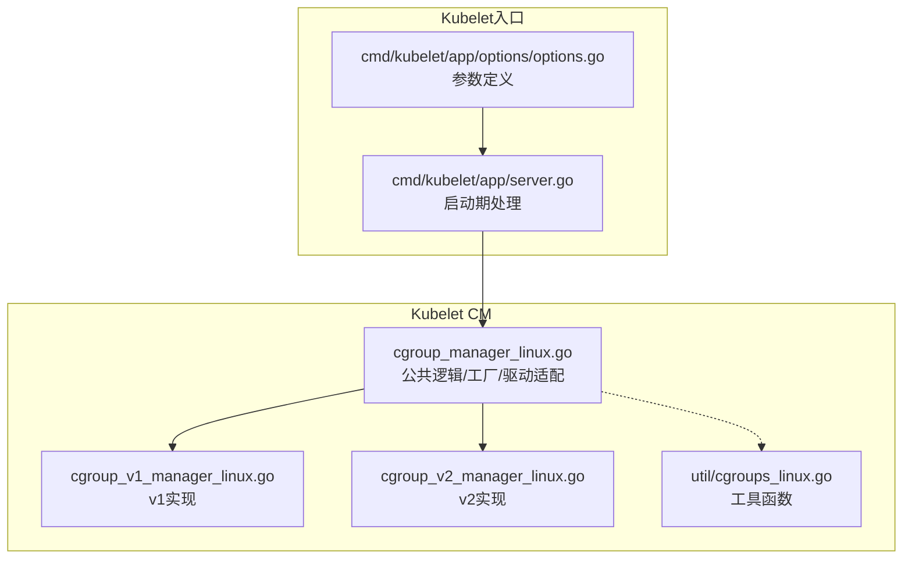
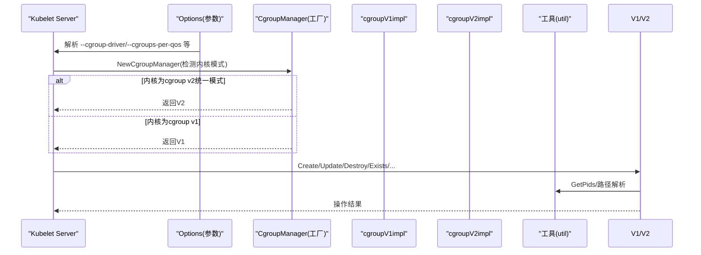
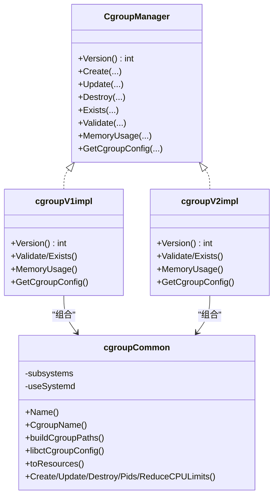
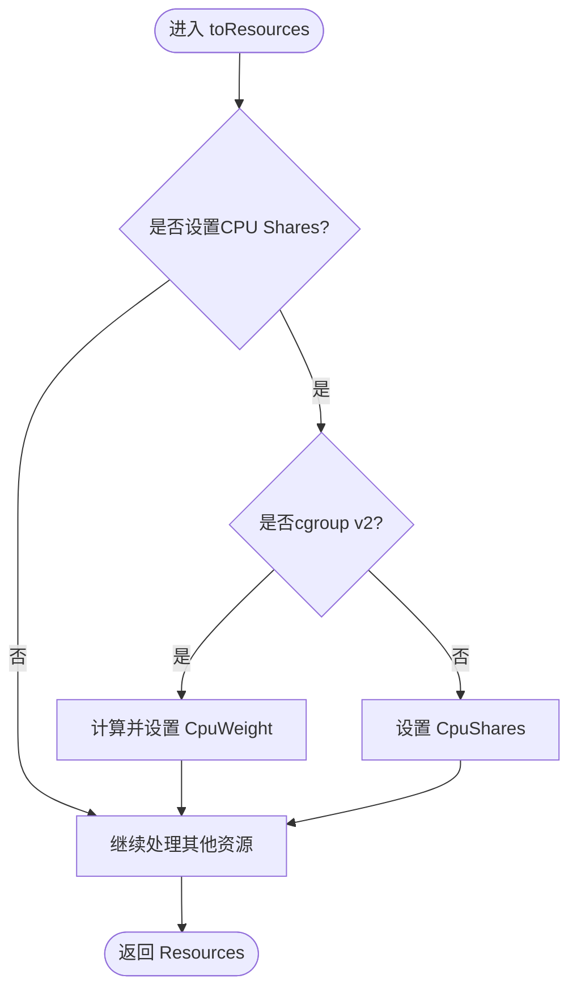
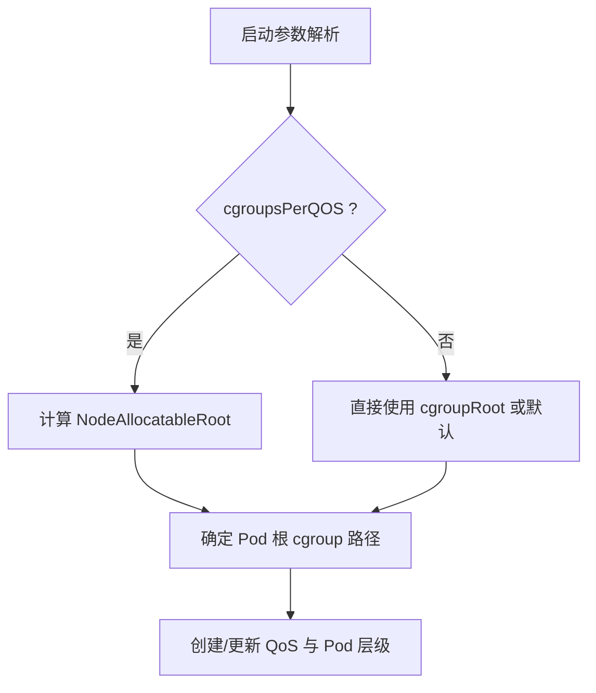
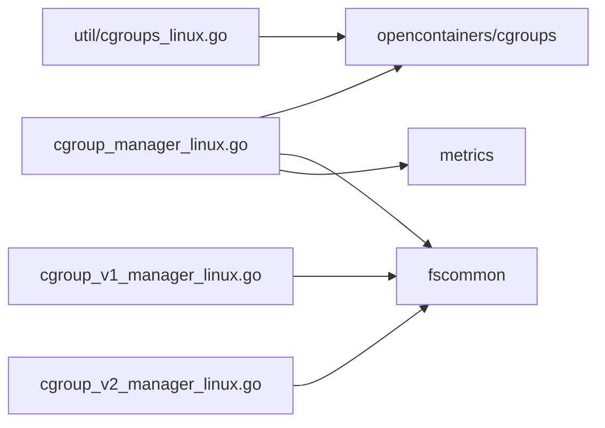

# Cgroup资源隔离

<cite>
**本文引用的文件**   
- [cgroup_manager_linux.go](file://pkg/kubelet/cm/cgroup_manager_linux.go)
- [cgroup_v1_manager_linux.go](file://pkg/kubelet/cm/cgroup_v1_manager_linux.go)
- [cgroup_v2_manager_linux.go](file://pkg/kubelet/cm/cgroup_v2_manager_linux.go)
- [cgroups_linux.go](file://pkg/kubelet/cm/util/cgroups_linux.go)
- [options.go](file://cmd/kubelet/app/options/options.go)
- [server.go](file://cmd/kubelet/app/server.go)
</cite>

## 目录
1. [简介](#简介)
2. [项目结构](#项目结构)
3. [核心组件](#核心组件)
4. [架构总览](#架构总览)
5. [详细组件分析](#详细组件分析)
6. [依赖关系分析](#依赖关系分析)
7. [性能考量](#性能考量)
8. [故障排查指南](#故障排查指南)
9. [结论](#结论)
10. [附录](#附录)

## 简介
本文件聚焦Kubelet在Linux上的Cgroup资源隔离机制，系统性阐述Cgroup v1与v2的实现差异、子系统管理、资源限制（CPU/内存/磁盘I/O/网络）、QoS层级组织、驱动选择（systemd与cgroupfs）以及监控与排障要点。文档以源码为依据，结合图示帮助读者快速理解从配置到落地的完整链路。

## 项目结构
围绕Cgroup管理的核心代码位于kubelet的cm（container manager）子包中，按版本实现拆分：
- cgroup_manager_linux.go：公共逻辑、驱动适配、创建/更新/销毁、路径构建、资源映射等
- cgroup_v1_manager_linux.go：v1专属实现（多子系统挂载点、各控制器独立文件）
- cgroup_v2_manager_linux.go：v2统一模式实现（单一层次、控制器集合、统一文件）
- util/cgroups_linux.go：通用工具（PID获取、路径解析等）
- cmd/kubelet/app/options/options.go：命令行参数（cgroupDriver、cgroups-per-qos、系统/运行时cgroup根等）
- cmd/kubelet/app/server.go：启动期cgroup相关初始化与告警

图表来源
- [cgroup_manager_linux.go:156-162](file://pkg/kubelet/cm/cgroup_manager_linux.go#L156-L162)
- [cgroup_v1_manager_linux.go:43-47](file://pkg/kubelet/cm/cgroup_v1_manager_linux.go#L43-L47)
- [cgroup_v2_manager_linux.go:49-53](file://pkg/kubelet/cm/cgroup_v2_manager_linux.go#L49-L53)
- [cgroups_linux.go:34-51](file://pkg/kubelet/cm/util/cgroups_linux.go#L34-L51)
- [options.go:450-452](file://cmd/kubelet/app/options/options.go#L450-L452)
- [server.go:801-829](file://cmd/kubelet/app/server.go#L801-L829)

章节来源
- [cgroup_manager_linux.go:156-162](file://pkg/kubelet/cm/cgroup_manager_linux.go#L156-L162)
- [cgroup_v1_manager_linux.go:43-47](file://pkg/kubelet/cm/cgroup_v1_manager_linux.go#L43-L47)
- [cgroup_v2_manager_linux.go:49-53](file://pkg/kubelet/cm/cgroup_v2_manager_linux.go#L49-L53)
- [cgroups_linux.go:34-51](file://pkg/kubelet/cm/util/cgroups_linux.go#L34-L51)
- [options.go:450-452](file://cmd/kubelet/app/options/options.go#L450-L452)
- [server.go:801-829](file://cmd/kubelet/app/server.go#L801-L829)

## 核心组件
- CgroupManager接口与工厂：根据内核是否处于cgroup v2统一模式，返回v1或v2管理器实例
- cgroupCommon：跨版本公共能力（名称转换、路径构建、资源映射、创建/更新/销毁、Pids扫描、CPU配额降级等）
- cgroupV1impl：基于多子系统挂载点的v1实现（cpu/memory/cpuset/pids/hugetlb等）
- cgroupV2impl：基于统一控制器的v2实现（cpu.max/cpu.weight/memory.max等）
- 工具模块：统一读取PID、v1相对路径解析等

关键职责
- 驱动适配：将内部CgroupName转换为cgroupfs或systemd风格路径
- 资源映射：将Kubernetes资源请求/限制映射为底层cgroup文件值（含shares/weight/quota/period等）
- 生命周期：Create/Update/Destroy/Exists/Validate/Pids/MemoryUsage/GetCgroupConfig

章节来源
- [cgroup_manager_linux.go:156-162](file://pkg/kubelet/cm/cgroup_manager_linux.go#L156-L162)
- [cgroup_manager_linux.go:164-178](file://pkg/kubelet/cm/cgroup_manager_linux.go#L164-L178)
- [cgroup_manager_linux.go:284-327](file://pkg/kubelet/cm/cgroup_manager_linux.go#L284-L327)
- [cgroup_v1_manager_linux.go:34-47](file://pkg/kubelet/cm/cgroup_v1_manager_linux.go#L34-L47)
- [cgroup_v2_manager_linux.go:40-53](file://pkg/kubelet/cm/cgroup_v2_manager_linux.go#L40-L53)

## 架构总览
Kubelet在启动时依据内核模式与配置选择cgroup驱动与根路径，随后通过CgroupManager对Pod/容器进行资源隔离设置。

图表来源
- [options.go:450-452](file://cmd/kubelet/app/options/options.go#L450-L452)
- [server.go:801-829](file://cmd/kubelet/app/server.go#L801-L829)
- [cgroup_manager_linux.go:156-162](file://pkg/kubelet/cm/cgroup_manager_linux.go#L156-L162)
- [cgroups_linux.go:34-51](file://pkg/kubelet/cm/util/cgroups_linux.go#L34-L51)

## 详细组件分析

### Cgroup v1与v2实现差异
- 层级结构与子系统
  - v1：多子系统各自挂载（如/sys/fs/cgroup/{cpu,memory,cpuset,pids,hugetlb,...}），每个控制器独立文件
  - v2：统一挂载点，控制器以“集合”形式启用，统一目录下提供cpu.max、memory.max等文件
- 控制器校验
  - v1：检查允许列表中的子系统路径是否存在
  - v2：读取cgroup.controllers并校验所需控制器是否可用
- 资源文件映射
  - CPU：v1使用cpu.shares/cpu.cfs_quota_us/cpu.cfs_period_us；v2使用cpu.weight与cpu.max（支持max表示无上限）
  - 内存：v1使用memory.limit_in_bytes；v2使用memory.max
  - HugeTLB：两者均支持，但v2需确认控制器存在
- 名称与路径
  - 支持systemd驱动：内部名称可转换为.slice风格的systemd路径，再展开为cgroupfs路径
  - 统一Name/CgroupName转换，屏蔽底层差异

图表来源
- [cgroup_manager_linux.go:152-169](file://pkg/kubelet/cm/cgroup_manager_linux.go#L152-L169)
- [cgroup_v1_manager_linux.go:34-52](file://pkg/kubelet/cm/cgroup_v1_manager_linux.go#L34-L52)
- [cgroup_v2_manager_linux.go:40-58](file://pkg/kubelet/cm/cgroup_v2_manager_linux.go#L40-L58)

章节来源
- [cgroup_v1_manager_linux.go:55-87](file://pkg/kubelet/cm/cgroup_v1_manager_linux.go#L55-L87)
- [cgroup_v2_manager_linux.go:60-78](file://pkg/kubelet/cm/cgroup_v2_manager_linux.go#L60-L78)
- [cgroup_manager_linux.go:171-196](file://pkg/kubelet/cm/cgroup_manager_linux.go#L171-L196)
- [cgroup_manager_linux.go:284-327](file://pkg/kubelet/cm/cgroup_manager_linux.go#L284-L327)

### CPU资源隔离
- v1
  - 权重：cpu.shares（范围映射至[2,262144]）
  - 配额：cpu.cfs_quota_us / cpu.cfs_period_us
- v2
  - 权重：cpu.weight（范围映射至[1,10000]）
  - 配额：cpu.max（支持“max”表示不限制）
- 映射与兼容
  - 当运行于v2时，若传入shares，会转换为weight；反之读取v2的weight可换算回shares用于一致性展示
  - 统一通过libcontainer Resources对象下发，避免重复逻辑

图表来源
- [cgroup_manager_linux.go:284-327](file://pkg/kubelet/cm/cgroup_manager_linux.go#L284-L327)
- [cgroup_v2_manager_linux.go:106-134](file://pkg/kubelet/cm/cgroup_v2_manager_linux.go#L106-L134)

章节来源
- [cgroup_manager_linux.go:268-277](file://pkg/kubelet/cm/cgroup_manager_linux.go#L268-L277)
- [cgroup_v1_manager_linux.go:124-142](file://pkg/kubelet/cm/cgroup_v1_manager_linux.go#L124-L142)
- [cgroup_v2_manager_linux.go:106-134](file://pkg/kubelet/cm/cgroup_v2_manager_linux.go#L106-L134)

### 内存资源隔离
- v1：memory.limit_in_bytes
- v2：memory.max
- 使用场景：Pod/容器的requests/limits映射到对应文件；同时提供MemoryUsage读取当前使用量

章节来源
- [cgroup_v1_manager_linux.go:144-146](file://pkg/kubelet/cm/cgroup_v1_manager_linux.go#L144-L146)
- [cgroup_v2_manager_linux.go:136-138](file://pkg/kubelet/cm/cgroup_v2_manager_linux.go#L136-L138)
- [cgroup_manager_linux.go:478-487](file://pkg/kubelet/cm/cgroup_manager_linux.go#L478-L487)

### 磁盘I/O与网络资源
- 磁盘I/O：当前CM未直接暴露io控制器设置；如需限制可通过Unified字段透传（v2）或在更上层由CRI/OCI运行时处理
- 网络：Kubelet CM不直接管理网络带宽；通常由CRI/插件或eBPF/TC方案实现

说明：本节为概念性说明，不涉及具体源码行号

### QoS层级与容器组织
- 参数开关：--cgroups-per-qos控制是否创建顶层QoS与Pod层cgroup
- 根路径：--cgroup-root决定Pod根cgroup位置；未指定且开启QoS时默认使用“/”
- 系统/运行时cgroup：--system-cgroups与--runtime-cgroups用于隔离系统进程与容器运行时自身
- 节点可分配资源：NodeAllocatableRoot参与根路径计算，配合enforce-node-allocatable策略

图表来源
- [options.go:450-452](file://cmd/kubelet/app/options/options.go#L450-L452)
- [server.go:812-829](file://cmd/kubelet/app/server.go#L812-L829)

章节来源
- [options.go:450-452](file://cmd/kubelet/app/options/options.go#L450-L452)
- [server.go:812-829](file://cmd/kubelet/app/server.go#L812-L829)

### Cgroup驱动选择与配置
- 驱动类型：cgroupfs与systemd
- systemd适配：内部名称经ToSystemd/ParseSystemdToCgroupName转换，最终展开为cgroupfs路径供底层写入
- 选择时机：NewCgroupManager根据内核模式选择v1/v2；useSystemd标志来自cgroupDriver参数

章节来源
- [cgroup_manager_linux.go:171-196](file://pkg/kubelet/cm/cgroup_manager_linux.go#L171-L196)
- [cgroup_manager_linux.go:164-169](file://pkg/kubelet/cm/cgroup_manager_linux.go#L164-L169)
- [options.go:451](file://cmd/kubelet/app/options/options.go#L451)

### 监控接口与指标
- 使用fscommon读取cgroup文件（如memory.current/memory.usage_in_bytes等）
- Manager操作耗时通过metrics记录（create/update/destroy）

章节来源
- [cgroup_v2_manager_linux.go:82-88](file://pkg/kubelet/cm/cgroup_v2_manager_linux.go#L82-88)
- [cgroup_v1_manager_linux.go:96-106](file://pkg/kubelet/cm/cgroup_v1_manager_linux.go#L96-L106)
- [cgroup_manager_linux.go:238-257](file://pkg/kubelet/cm/cgroup_manager_linux.go#L238-L257)

## 依赖关系分析
- 外部库
  - opencontainers/cgroups：底层cgroup读写、manager抽象、systemd扩展
  - fscommon：cgroup参数读取封装
- 内部依赖
  - util/cgroups_linux.go：GetPids、v1路径解析
  - metrics：操作耗时埋点

图表来源
- [cgroup_manager_linux.go:28-38](file://pkg/kubelet/cm/cgroup_manager_linux.go#L28-38)
- [cgroup_v1_manager_linux.go:25-30](file://pkg/kubelet/cm/cgroup_v1_manager_linux.go#L25-30)
- [cgroup_v2_manager_linux.go:27-32](file://pkg/kubelet/cm/cgroup_v2_manager_linux.go#L27-32)
- [cgroups_linux.go:24-25](file://pkg/kubelet/cm/util/cgroups_linux.go#L24-25)

章节来源
- [cgroup_manager_linux.go:28-38](file://pkg/kubelet/cm/cgroup_manager_linux.go#L28-38)
- [cgroups_linux.go:34-51](file://pkg/kubelet/cm/util/cgroups_linux.go#L34-L51)

## 性能考量
- 优先使用cgroup v2：统一控制器减少路径遍历与权限问题，简化资源配置
- 合理设置CPU权重与配额：避免过度细分导致调度抖动；在高密度场景下关注cpu.max与cpu.weight的组合
- 内存限制与OOM：确保limit合理，避免频繁OOM；必要时结合swap（仅v2支持）
- HugeTLB：仅在需要大页时启用，避免不必要的控制器开销
- 减少文件系统访问：批量更新资源，避免频繁Create/Update

## 故障排查指南
常见问题与定位步骤
- 控制器缺失（v2）
  - 现象：Validate失败，提示缺少cpu/memory等控制器
  - 排查：检查根cgroup的cgroup.controllers是否包含所需控制器
- 路径不存在（v1）
  - 现象：Validate失败，提示某些子系统路径缺失
  - 排查：核对子系统挂载点与cgroup路径是否正确
- systemd驱动名称异常
  - 现象：slice命名不符合预期
  - 排查：确认内部名称不含非法字符，ToSystemd/ParseSystemdToCgroupName转换一致
- 内存用量读取失败
  - 现象：MemoryUsage报错
  - 排查：确认对应文件存在且可读（v1: memory.usage_in_bytes；v2: memory.current）
- swap支持
  - 注意：swap仅v2支持，v1启用会触发告警或错误

章节来源
- [cgroup_v2_manager_linux.go:60-78](file://pkg/kubelet/cm/cgroup_v2_manager_linux.go#L60-L78)
- [cgroup_v1_manager_linux.go:55-87](file://pkg/kubelet/cm/cgroup_v1_manager_linux.go#L55-L87)
- [cgroup_v2_manager_linux.go:82-88](file://pkg/kubelet/cm/cgroup_v2_manager_linux.go#L82-88)
- [cgroup_v1_manager_linux.go:96-106](file://pkg/kubelet/cm/cgroup_v1_manager_linux.go#L96-L106)

## 结论
Kubelet通过统一的CgroupManager抽象屏蔽了v1/v2差异，并以systemd/cgroupfs双驱动适配不同部署环境。在生产环境中建议优先采用cgroup v2与systemd驱动，结合合理的QoS层级与资源配额，以获得更好的稳定性与可观测性。

## 附录
- 关键参数速查
  - --cgroup-driver：cgroupfs或systemd
  - --cgroups-per-qos：是否创建QoS层级
  - --cgroup-root：Pod根cgroup路径
  - --system-cgroups / --runtime-cgroups：系统与运行时cgroup根
  - --fail-cgroupv1：禁止在v1主机上启动（安全策略）

章节来源
- [options.go:450-452](file://cmd/kubelet/app/options/options.go#L450-L452)
- [options.go:375](file://cmd/kubelet/app/options/options.go#L375)
- [server.go:801-829](file://cmd/kubelet/app/server.go#L801-L829)