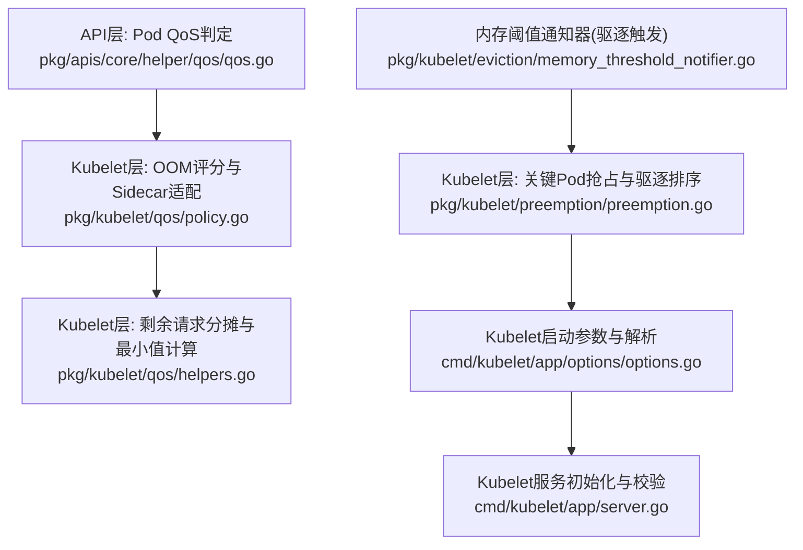
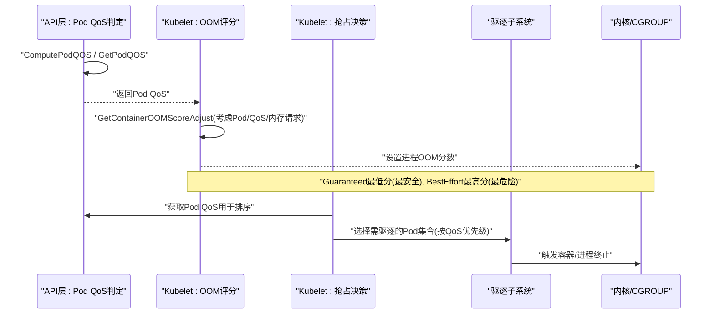
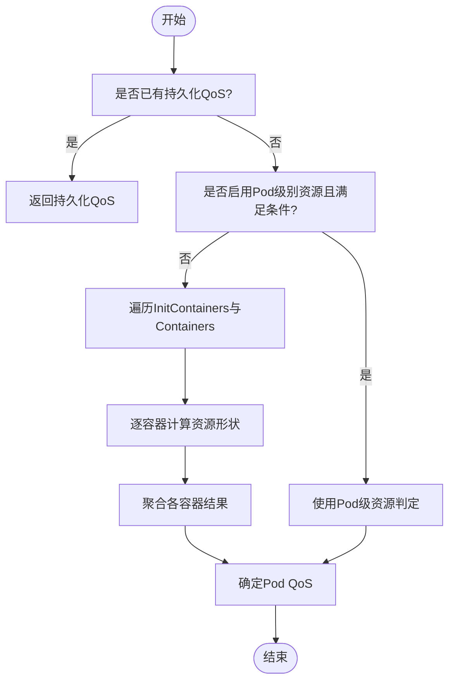
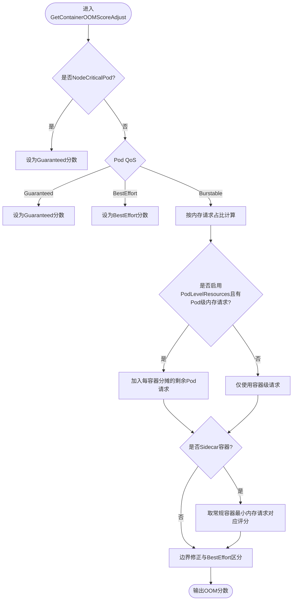
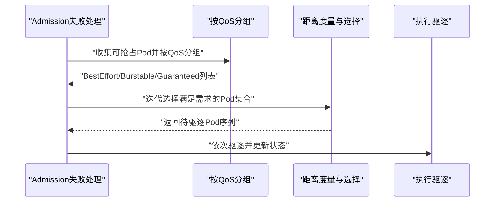
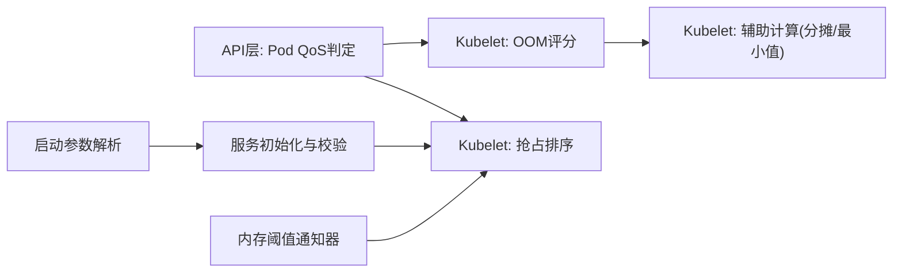

# QoS策略与优先级

<cite>
**本文引用的文件**   
- [pkg/kubelet/qos/policy.go](file://pkg/kubelet/qos/policy.go)
- [pkg/kubelet/qos/helpers.go](file://pkg/kubelet/qos/helpers.go)
- [pkg/apis/core/helper/qos/qos.go](file://pkg/apis/core/helper/qos/qos.go)
- [pkg/kubelet/preemption/preemption.go](file://pkg/kubelet/preemption/preemption.go)
- [cmd/kubelet/app/options/options.go](file://cmd/kubelet/app/options/options.go)
- [cmd/kubelet/app/server.go](file://cmd/kubelet/app/server.go)
- [pkg/kubelet/eviction/memory_threshold_notifier.go](file://pkg/kubelet/eviction/memory_threshold_notifier.go)
</cite>

## 目录
1. [简介](#简介)
2. [项目结构](#项目结构)
3. [核心组件](#核心组件)
4. [架构总览](#架构总览)
5. [详细组件分析](#详细组件分析)
6. [依赖关系分析](#依赖关系分析)
7. [性能考量](#性能考量)
8. [故障排查指南](#故障排查指南)
9. [结论](#结论)
10. [附录](#附录)

## 简介
本文件系统性梳理Kubelet中QoS（服务质量）策略的实现与使用，覆盖三个QoS等级（Guaranteed、Burstable、BestEffort）的定义与判定规则、Pod与Container级别的计算逻辑、基于QoS的调度优先级（驱逐顺序、抢占与回收）、系统资源预留（kube-reserved与system-reserved）及其影响，以及QoS对容器生命周期管理的影响。同时提供配置优化建议与设计模式，帮助在不同工作负载类型下获得更稳定的运行效果。

## 项目结构
围绕QoS相关的关键代码主要分布在以下位置：
- Pod QoS判定与辅助函数：pkg/apis/core/helper/qos/qos.go
- Kubelet侧OOM Score调整与Sidecar特殊处理：pkg/kubelet/qos/policy.go、pkg/kubelet/qos/helpers.go
- 关键Pod抢占与驱逐选择：pkg/kubelet/preemption/preemption.go
- Kubelet命令行参数与解析（含QoS保留、系统预留等）：cmd/kubelet/app/options/options.go、cmd/kubelet/app/server.go
- 内存阈值通知器（用于触发驱逐流程）：pkg/kubelet/eviction/memory_threshold_notifier.go

图示来源
- [pkg/apis/core/helper/qos/qos.go:31-83](file://pkg/apis/core/helper/qos/qos.go#L31-L83)
- [pkg/kubelet/qos/policy.go:45-120](file://pkg/kubelet/qos/policy.go#L45-L120)
- [pkg/kubelet/qos/helpers.go:33-71](file://pkg/kubelet/qos/helpers.go#L33-L71)
- [pkg/kubelet/preemption/preemption.go:132-157](file://pkg/kubelet/preemption/preemption.go#L132-L157)
- [cmd/kubelet/app/options/options.go:450-511](file://cmd/kubelet/app/options/options.go#L450-L511)
- [cmd/kubelet/app/server.go:813-934](file://cmd/kubelet/app/server.go#L813-L934)
- [pkg/kubelet/eviction/memory_threshold_notifier.go:30-39](file://pkg/kubelet/eviction/memory_threshold_notifier.go#L30-L39)

章节来源
- [pkg/apis/core/helper/qos/qos.go:31-83](file://pkg/apis/core/helper/qos/qos.go#L31-L83)
- [pkg/kubelet/qos/policy.go:45-120](file://pkg/kubelet/qos/policy.go#L45-L120)
- [pkg/kubelet/qos/helpers.go:33-71](file://pkg/kubelet/qos/helpers.go#L33-L71)
- [pkg/kubelet/preemption/preemption.go:132-157](file://pkg/kubelet/preemption/preemption.go#L132-L157)
- [cmd/kubelet/app/options/options.go:450-511](file://cmd/kubelet/app/options/options.go#L450-L511)
- [cmd/kubelet/app/server.go:813-934](file://cmd/kubelet/app/server.go#L813-L934)
- [pkg/kubelet/eviction/memory_threshold_notifier.go:30-39](file://pkg/kubelet/eviction/memory_threshold_notifier.go#L30-L39)

## 核心组件
- Pod QoS判定
  - 支持三种QoS：BestEffort、Burstable、Guaranteed。
  - 当启用Pod级别资源特性时，优先依据Pod级资源进行判定；否则遍历InitContainers与Containers，聚合各容器的资源请求与限制，按CPU与Memory两类可计算资源分别判定后综合得出Pod QoS。
- Kubelet OOM评分调整
  - 根据Pod QoS与容器内存请求计算OOMScoreAdjust，保证Guaranteed最不易被OOM，BestEffort最易被OOM，Burstable居中且与内存请求比例相关。
  - 在PodLevelResources开启时，将未分配到容器的Pod级内存请求平均分摊到每个容器参与计算。
  - Sidecar容器采用“取当前sidecar与常规容器最小内存请求对应的评分”的策略，避免sidecar因高请求而更易存活。
- 关键Pod抢占
  - 当关键Pod因资源不足被拒绝时，尝试通过驱逐现有Pod来释放资源。
  - 驱逐顺序遵循QoS优先级：先BestEffort，再Burstable，最后Guaranteed；同等级内以“距离需求最近且总请求更小”为准则。
- 系统资源预留与节点可分配
  - 支持system-reserved、kube-reserved、reserved-cpus、qos-reserved等参数，配合cgroupsPerQOS与enforce-node-allocatable实现节点资源分层隔离与保障。

章节来源
- [pkg/apis/core/helper/qos/qos.go:31-83](file://pkg/apis/core/helper/qos/qos.go#L31-L83)
- [pkg/kubelet/qos/policy.go:45-120](file://pkg/kubelet/qos/policy.go#L45-L120)
- [pkg/kubelet/qos/helpers.go:33-71](file://pkg/kubelet/qos/helpers.go#L33-L71)
- [pkg/kubelet/preemption/preemption.go:132-157](file://pkg/kubelet/preemption/preemption.go#L132-L157)
- [cmd/kubelet/app/options/options.go:450-511](file://cmd/kubelet/app/options/options.go#L450-L511)
- [cmd/kubelet/app/server.go:813-934](file://cmd/kubelet/app/server.go#L813-L934)

## 架构总览
下图展示从Pod创建到QoS判定、OOM评分、抢占与驱逐的整体交互路径。

图示来源
- [pkg/apis/core/helper/qos/qos.go:31-83](file://pkg/apis/core/helper/qos/qos.go#L31-L83)
- [pkg/kubelet/qos/policy.go:45-120](file://pkg/kubelet/qos/policy.go#L45-L120)
- [pkg/kubelet/preemption/preemption.go:132-157](file://pkg/kubelet/preemption/preemption.go#L132-L157)

## 详细组件分析

### Pod QoS判定逻辑
- 判定入口
  - 若Pod状态已持久化QoS，直接返回；否则调用ComputePodQOS重新评估。
- 判定规则
  - 当启用Pod级别资源特性且满足条件时，直接使用Pod级资源进行判定。
  - 否则遍历所有InitContainers与Containers，逐个计算其资源形状（BestEffort/Burstable/Guaranteed），并汇总得到Pod QoS。
- 单组资源的形状判定
  - 仅针对CPU与Memory两类可计算资源。
  - Request与Limit相等且非零：Guaranteed；相等且为零：BestEffort；不相等：Burstable。
  - 若不同资源形状不一致，则整体为Burstable。

图示来源
- [pkg/apis/core/helper/qos/qos.go:31-83](file://pkg/apis/core/helper/qos/qos.go#L31-L83)
- [pkg/apis/core/helper/qos/qos.go:85-126](file://pkg/apis/core/helper/qos/qos.go#L85-L126)

章节来源
- [pkg/apis/core/helper/qos/qos.go:31-83](file://pkg/apis/core/helper/qos/qos.go#L31-L83)
- [pkg/apis/core/helper/qos/qos.go:85-126](file://pkg/apis/core/helper/qos/qos.go#L85-L126)

### Kubelet OOM评分调整与Sidecar适配
- 基本策略
  - NodeCriticalPod与Guaranteed：最低OOM分数（最不易被杀）。
  - BestEffort：最高OOM分数（最易被杀）。
  - Burstable：介于两者之间，按容器内存请求占系统内存的比例计算。
- PodLevelResources影响
  - 当启用该特性且设置了Pod级内存请求时，将未分配到容器的剩余内存请求平均摊分到每个容器，参与OOM评分计算。
- Sidecar容器特殊处理
  - 若容器被识别为Sidecar（如RestartPolicy=Always且匹配特定标识），其OOM评分不高于同一Pod中常规容器的最小内存请求对应的评分，以避免Sidecar比主业务更易存活。

图示来源
- [pkg/kubelet/qos/policy.go:45-120](file://pkg/kubelet/qos/policy.go#L45-L120)
- [pkg/kubelet/qos/helpers.go:33-71](file://pkg/kubelet/qos/helpers.go#L33-L71)

章节来源
- [pkg/kubelet/qos/policy.go:45-120](file://pkg/kubelet/qos/policy.go#L45-L120)
- [pkg/kubelet/qos/helpers.go:33-71](file://pkg/kubelet/qos/helpers.go#L33-L71)

### 关键Pod抢占与驱逐顺序
- 触发条件
  - 关键Pod因资源不足被拒绝时，尝试通过驱逐其他Pod释放所需资源。
- 选择策略
  - 按QoS分组：BestEffort > Burstable > Guaranteed。
  - 同组内选择“距离需求最近”的Pod，并在距离相同的情况下选择“总请求更小”的Pod，尽量降低影响面。
- 执行过程
  - 记录事件、标记Pod状态、调用KillPod接口，直至容器与Pod完全终止。

图示来源
- [pkg/kubelet/preemption/preemption.go:132-157](file://pkg/kubelet/preemption/preemption.go#L132-L157)
- [pkg/kubelet/preemption/preemption.go:244-262](file://pkg/kubelet/preemption/preemption.go#L244-L262)

章节来源
- [pkg/kubelet/preemption/preemption.go:132-157](file://pkg/kubelet/preemption/preemption.go#L132-L157)
- [pkg/kubelet/preemption/preemption.go:244-262](file://pkg/kubelet/preemption/preemption.go#L244-L262)

### 系统资源预留与节点可分配
- 关键参数
  - system-reserved：为非Kubernetes组件预留的资源（CPU、内存、PID、本地临时存储等）。
  - kube-reserved：为Kubernetes系统组件预留的资源。
  - reserved-cpus：静态CPU列表，会覆盖由system-reserved与kube-reserved推导的动态CPU列表。
  - qos-reserved：在QoS层级预留Pod资源请求（目前仅支持内存），需要相应特性门控。
  - enforce-node-allocatable：控制对pods/system-reserved/kube-reserved等的强制约束。
- 生效方式
  - 启动阶段解析与校验这些参数，结合cgroupsPerQOS与cgroup根路径，构建节点可分配资源视图，确保系统组件与关键工作负载有稳定资源保障。

章节来源
- [cmd/kubelet/app/options/options.go:450-511](file://cmd/kubelet/app/options/options.go#L450-L511)
- [cmd/kubelet/app/server.go:813-934](file://cmd/kubelet/app/server.go#L813-L934)

### 内存阈值通知与驱逐触发
- 作用
  - 监听内核或cgroup层面的内存阈值事件，周期性刷新通知器，驱动驱逐管理器评估是否需要驱逐低优先级Pod。
- 行为
  - 通过工厂方法创建CgroupNotifier，封装路径、属性与阈值，统一接入驱逐流程。

章节来源
- [pkg/kubelet/eviction/memory_threshold_notifier.go:30-39](file://pkg/kubelet/eviction/memory_threshold_notifier.go#L30-L39)

## 依赖关系分析
- 模块耦合
  - Pod QoS判定位于API层，供Kubelet多模块复用（OOM评分、抢占排序等）。
  - Kubelet QoS子包负责具体评分与Sidecar适配，依赖API层QoS工具与特性门控。
  - 抢占模块依赖QoS判定与类型判断，决定驱逐顺序。
  - 启动参数与服务器初始化负责解析与校验系统预留与QoS保留配置。
- 外部依赖
  - 特性门控（如PodLevelResources、QOSReserved等）影响QoS判定与OOM评分公式。
  - cgroups与内核版本影响MemoryQoS与阈值通知机制的行为。

图示来源
- [pkg/apis/core/helper/qos/qos.go:31-83](file://pkg/apis/core/helper/qos/qos.go#L31-L83)
- [pkg/kubelet/qos/policy.go:45-120](file://pkg/kubelet/qos/policy.go#L45-L120)
- [pkg/kubelet/qos/helpers.go:33-71](file://pkg/kubelet/qos/helpers.go#L33-L71)
- [pkg/kubelet/preemption/preemption.go:132-157](file://pkg/kubelet/preemption/preemption.go#L132-L157)
- [cmd/kubelet/app/options/options.go:450-511](file://cmd/kubelet/app/options/options.go#L450-L511)
- [cmd/kubelet/app/server.go:813-934](file://cmd/kubelet/app/server.go#L813-L934)
- [pkg/kubelet/eviction/memory_threshold_notifier.go:30-39](file://pkg/kubelet/eviction/memory_threshold_notifier.go#L30-L39)

## 性能考量
- QoS判定开销
  - ComputePodQOS涉及遍历容器与资源聚合，建议在Pod状态包含QoS时优先使用GetPodQOS以减少重复计算。
- OOM评分计算
  - 在PodLevelResources开启时引入分摊计算，复杂度随容器数量线性增长；合理设置Pod级资源可减少频繁重算带来的额外开销。
- 抢占与驱逐
  - 选择算法按QoS分组后再做距离度量，时间复杂度与候选Pod数量相关；在高动态场景下应关注候选集规模与指标上报频率。
- 阈值通知
  - 通知器存在刷新间隔，避免过于频繁的回调导致驱逐循环抖动。

[本节为通用指导，无需列出具体文件来源]

## 故障排查指南
- 现象：关键Pod无法调度，但节点显示仍有空闲资源
  - 检查system-reserved与kube-reserved是否过大，导致实际可分配资源不足。
  - 确认enforce-node-allocatable是否正确配置，必要时调整预留策略。
- 现象：Burstable Pod频繁被OOM
  - 检查容器内存请求是否偏低，导致OOM评分偏高；适当提高request或调整为Guaranteed。
  - 若启用了PodLevelResources，确认Pod级内存请求与分摊逻辑是否符合预期。
- 现象：Sidecar与主容器竞争资源
  - 确认Sidecar识别逻辑与最小内存请求策略是否达到预期，必要时调整主容器内存请求分布。
- 现象：内存压力导致驱逐风暴
  - 检查内存阈值通知器刷新间隔与阈值设置，避免过激驱逐；观察驱逐指标与事件日志定位问题源。

章节来源
- [cmd/kubelet/app/options/options.go:450-511](file://cmd/kubelet/app/options/options.go#L450-L511)
- [cmd/kubelet/app/server.go:813-934](file://cmd/kubelet/app/server.go#L813-L934)
- [pkg/kubelet/qos/policy.go:45-120](file://pkg/kubelet/qos/policy.go#L45-L120)
- [pkg/kubelet/eviction/memory_threshold_notifier.go:30-39](file://pkg/kubelet/eviction/memory_threshold_notifier.go#L30-L39)

## 结论
Kubelet的QoS体系通过严格的资源形状判定与精细化的OOM评分调整，保障了关键与高优先级工作负载在资源紧张时的稳定性。配合系统资源预留与节点可分配约束，集群可在复杂负载环境下维持可控的服务质量。实践中应根据工作负载特征选择合适的QoS设计，并结合PodLevelResources与Sidecar策略进一步优化生存概率与资源利用率。

[本节为总结性内容，无需列出具体文件来源]

## 附录
- 配置建议与最佳实践
  - 关键业务：优先设置为Guaranteed，明确CPU与Memory的request=limit，提升抗OOM能力。
  - 弹性任务：使用Burstable，合理设置request与limit，避免过度占用导致邻居Pod受影响。
  - 批处理/离线任务：可使用BestEffort，充分利用空闲资源，但需接受较高被驱逐风险。
  - 系统预留：根据节点规格与系统组件负载，合理设置system-reserved与kube-reserved，避免挤占业务可用资源。
  - QoS保留：在Alpha特性允许的场景下，谨慎启用qos-reserved，确保关键Pod在QoS层级获得基础保障。
  - 节点可分配：结合cgroupsPerQOS与enforce-node-allocatable，形成清晰的资源分层与隔离边界。

[本节为通用指导，无需列出具体文件来源]