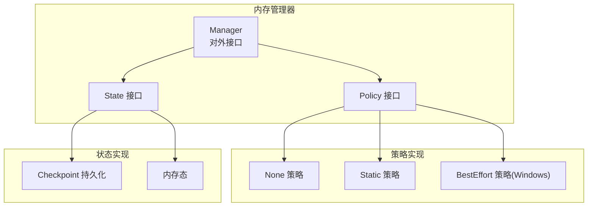
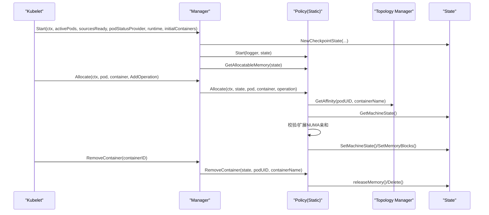
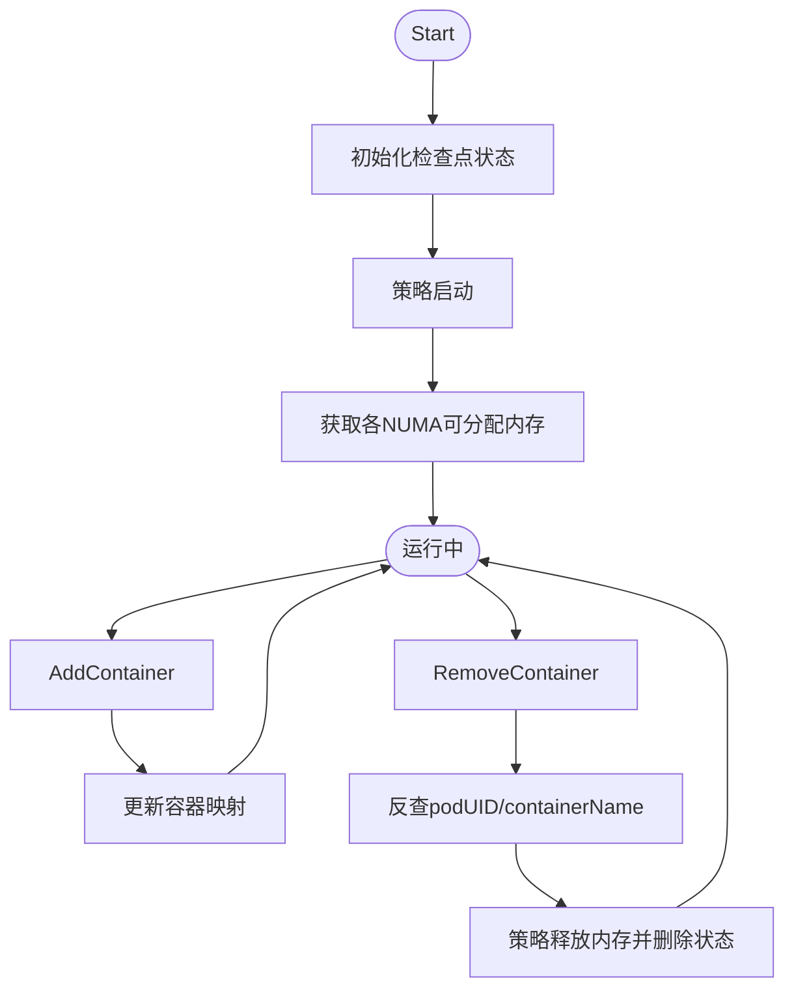
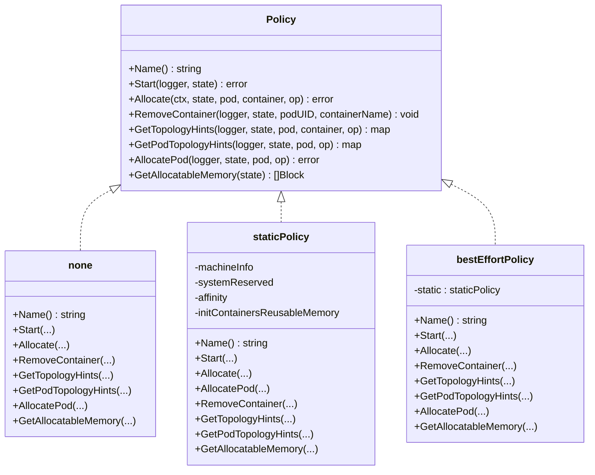
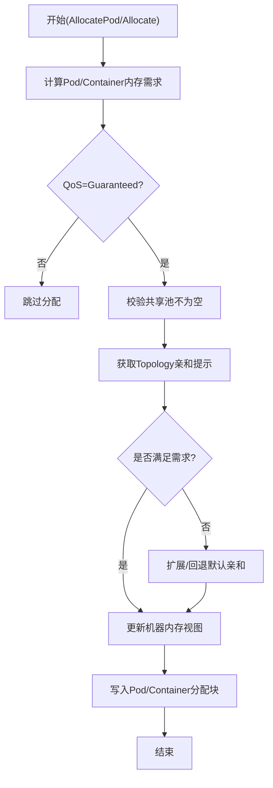
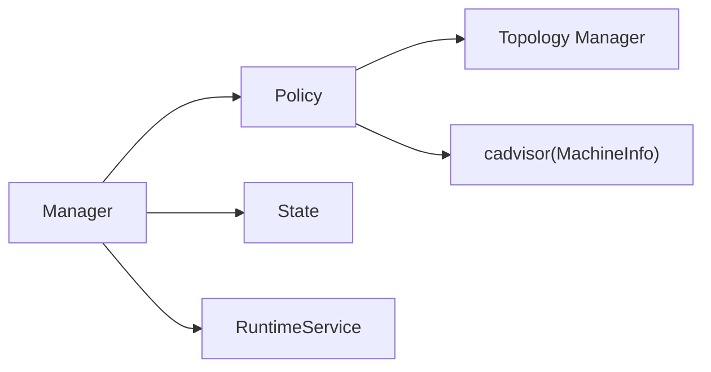

# 内存管理器

<cite>
**本文引用的文件**   
- [memory_manager.go](file://pkg/kubelet/cm/memorymanager/memory_manager.go)
- [policy.go](file://pkg/kubelet/cm/memorymanager/policy.go)
- [policy_static.go](file://pkg/kubelet/cm/memorymanager/policy_static.go)
- [policy_none.go](file://pkg/kubelet/cm/memorymanager/policy_none.go)
- [policy_best_effort.go](file://pkg/kubelet/cm/memorymanager/policy_best_effort.go)
- [state.go](file://pkg/kubelet/cm/memorymanager/state/state.go)
- [checkpoint.go](file://pkg/kubelet/cm/memorymanager/state/checkpoint.go)
- [state_checkpoint.go](file://pkg/kubelet/cm/memorymanager/state/state_checkpoint.go)
- [state_mem.go](file://pkg/kubelet/cm/memorymanager/state/state_mem.go)
- [options.go](file://cmd/kubelet/app/options/options.go)
- [server.go](file://cmd/kubelet/app/server.go)
- [types.go](file://pkg/kubelet/apis/config/types.go)
</cite>

## 目录
1. [简介](#简介)
2. [项目结构](#项目结构)
3. [核心组件](#核心组件)
4. [架构总览](#架构总览)
5. [详细组件分析](#详细组件分析)
6. [依赖关系分析](#依赖关系分析)
7. [性能与容量规划](#性能与容量规划)
8. [故障排查指南](#故障排查指南)
9. [结论](#结论)
10. [附录](#附录)

## 简介
本技术文档聚焦于 Kubelet 内存管理器的设计与实现，围绕以下目标展开：
- 静态内存预留机制：计算、分配与监控
- NUMA 亲和性管理：节点本地访问优化与跨节点访问影响
- OOM 保护机制：OOM 评分调整、内存压力检测与自动回收
- 内存监控指标：使用率、换页率、碎片情况
- 调优建议与容量规划：含常见内存问题的诊断与解决

Kubelet 内存管理器通过策略化设计（None/Static/BestEffort）实现对容器内存的精细化控制，结合 Topology Manager 提供 NUMA 感知分配能力，并通过状态持久化保障重启后的可恢复性。

## 项目结构
内存管理器位于 pkg/kubelet/cm/memorymanager 下，核心由“管理器 + 策略 + 状态”三层组成：
- 管理器：对外暴露统一接口，协调生命周期、状态清理、拓扑提示等
- 策略：定义不同内存管理策略（None/Static/BestEffort）的具体行为
- 状态：维护机器级内存视图、Pod/Container 级别分配块、检查点持久化

图表来源
- [memory_manager.go:59-99](file://pkg/kubelet/cm/memorymanager/memory_manager.go#L59-L99)
- [policy.go:32-52](file://pkg/kubelet/cm/memorymanager/policy.go#L32-L52)
- [state.go](file://pkg/kubelet/cm/memorymanager/state/state.go)
- [checkpoint.go](file://pkg/kubelet/cm/memorymanager/state/checkpoint.go)
- [state_checkpoint.go](file://pkg/kubelet/cm/memorymanager/state/state_checkpoint.go)
- [state_mem.go](file://pkg/kubelet/cm/memorymanager/state/state_mem.go)

章节来源
- [memory_manager.go:101-134](file://pkg/kubelet/cm/memorymanager/memory_manager.go#L101-L134)
- [policy.go:1-53](file://pkg/kubelet/cm/memorymanager/policy.go#L1-L53)

## 核心组件
- Manager 接口：提供 Start、Allocate、RemoveContainer、GetTopologyHints、GetPodTopologyHints、GetMemoryNUMANodes、GetAllocatableMemory、GetMemory 等方法，作为 Kubelet 调用入口
- Policy 接口：封装具体策略逻辑，包括 Allocate/AllocatePod/RemoveContainer、拓扑提示生成、可分配内存查询
- State 接口：维护机器内存视图、Pod/Container 分配块、检查点读写

关键职责划分：
- Manager 负责生命周期、并发安全、状态清理、与 Topology Manager 协作
- Policy 负责资源计算、NUMA 亲和选择、分配/释放、共享池与独占池划分
- State 负责内存视图更新、分配记录、持久化与恢复

章节来源
- [memory_manager.go:59-99](file://pkg/kubelet/cm/memorymanager/memory_manager.go#L59-L99)
- [policy.go:32-52](file://pkg/kubelet/cm/memorymanager/policy.go#L32-L52)

## 架构总览
内存管理器在 Kubelet 启动时根据配置选择策略并初始化；在 Pod 调度与容器生命周期事件中参与分配与回收；与 Topology Manager 协同完成 NUMA 亲和提示；通过状态模块进行持久化与恢复。

图表来源
- [memory_manager.go:188-215](file://pkg/kubelet/cm/memorymanager/memory_manager.go#L188-L215)
- [memory_manager.go:268-281](file://pkg/kubelet/cm/memorymanager/memory_manager.go#L268-L281)
- [memory_manager.go:298-314](file://pkg/kubelet/cm/memorymanager/memory_manager.go#L298-L314)
- [policy_static.go:428-554](file://pkg/kubelet/cm/memorymanager/policy_static.go#L428-L554)

## 详细组件分析

### 管理器（Manager）
- 启动流程：初始化检查点状态、启动策略、获取各 NUMA 节点可分配内存
- 生命周期：AddContainer 维护容器映射、支持 Init 容器复用与清理；RemoveContainer 基于容器映射反查 Pod/Container 并释放
- 拓扑提示：将请求委托给当前策略，确保垃圾回收后再生成提示
- 状态清理：当所有配置源就绪后，对比活跃 Pod/Container 列表，移除陈旧状态

图表来源
- [memory_manager.go:188-215](file://pkg/kubelet/cm/memorymanager/memory_manager.go#L188-L215)
- [memory_manager.go:218-243](file://pkg/kubelet/cm/memorymanager/memory_manager.go#L218-L243)
- [memory_manager.go:298-314](file://pkg/kubelet/cm/memorymanager/memory_manager.go#L298-L314)
- [memory_manager.go:338-384](file://pkg/kubelet/cm/memorymanager/memory_manager.go#L338-L384)

章节来源
- [memory_manager.go:139-186](file://pkg/kubelet/cm/memorymanager/memory_manager.go#L139-L186)
- [memory_manager.go:188-215](file://pkg/kubelet/cm/memorymanager/memory_manager.go#L188-L215)
- [memory_manager.go:218-243](file://pkg/kubelet/cm/memorymanager/memory_manager.go#L218-L243)
- [memory_manager.go:268-281](file://pkg/kubelet/cm/memorymanager/memory_manager.go#L268-L281)
- [memory_manager.go:298-314](file://pkg/kubelet/cm/memorymanager/memory_manager.go#L298-L314)
- [memory_manager.go:338-384](file://pkg/kubelet/cm/memorymanager/memory_manager.go#L338-L384)

### 策略接口与实现
- None 策略：无内存管理，返回空拓扑提示，不做分配与释放
- Static 策略：对 Guaranteed Pod 进行严格 NUMA 亲和分配，支持 Pod 级资源与共享池/独占池划分，支持 Init 容器内存复用
- BestEffort 策略（Windows）：复用 Static 策略逻辑，但仅用于生成拓扑提示，不强制绑定 NUMA

图表来源
- [policy.go:32-52](file://pkg/kubelet/cm/memorymanager/policy.go#L32-L52)
- [policy_none.go:38-82](file://pkg/kubelet/cm/memorymanager/policy_none.go#L38-L82)
- [policy_static.go:67-88](file://pkg/kubelet/cm/memorymanager/policy_static.go#L67-L88)
- [policy_best_effort.go:46-91](file://pkg/kubelet/cm/memorymanager/policy_best_effort.go#L46-L91)

章节来源
- [policy.go:1-53](file://pkg/kubelet/cm/memorymanager/policy.go#L1-L53)
- [policy_none.go:1-82](file://pkg/kubelet/cm/memorymanager/policy_none.go#L1-L82)
- [policy_static.go:1-800](file://pkg/kubelet/cm/memorymanager/policy_static.go#L1-L800)
- [policy_best_effort.go:1-91](file://pkg/kubelet/cm/memorymanager/policy_best_effort.go#L1-L91)

### 静态策略（Static）深度解析
- 适用场景：Guaranteed QoS Pod，支持 Pod 级资源（特性门控）
- 分配流程：
  - 计算 Pod 总内存需求（考虑 Init 容器最大并发与 Restartable Init 容器）
  - 校验“共享池为空”场景，避免共享容器无可用内存
  - 从 Topology Manager 获取最佳 NUMA 亲和提示，必要时扩展或回退默认提示
  - 按 Init 容器与 App 容器顺序划分独占块与共享池，更新机器内存视图
  - 持久化 Pod 级与 Container 级分配块
- 释放流程：
  - 若为 Pod 级资源，最后一个容器退出时释放整块 Pod 内存
  - 否则按 Container 粒度释放，反向更新机器内存视图
- 复用机制：
  - 非重启型 Init 容器的内存可在后续容器分配时复用，减少实际分配开销
- 约束与校验：
  - 禁止在同一 NUMA 节点上同时存在单 NUMA 与跨 NUMA 分配
  - 必须满足系统预留与 Node Allocatable 的一致性

图表来源
- [policy_static.go:184-398](file://pkg/kubelet/cm/memorymanager/policy_static.go#L184-L398)
- [policy_static.go:428-554](file://pkg/kubelet/cm/memorymanager/policy_static.go#L428-L554)
- [policy_static.go:602-674](file://pkg/kubelet/cm/memorymanager/policy_static.go#L602-L674)

章节来源
- [policy_static.go:102-178](file://pkg/kubelet/cm/memorymanager/policy_static.go#L102-L178)
- [policy_static.go:184-398](file://pkg/kubelet/cm/memorymanager/policy_static.go#L184-L398)
- [policy_static.go:428-554](file://pkg/kubelet/cm/memorymanager/policy_static.go#L428-L554)
- [policy_static.go:602-674](file://pkg/kubelet/cm/memorymanager/policy_static.go#L602-L674)

### 状态管理与检查点
- 状态类型：
  - MachineState：每个 NUMA 节点的 Free/Reserved 计数、分配数、Cells 掩码
  - Pod/Container Blocks：按资源类型与 NUMA 亲和划分的分配块
- 持久化：
  - 使用检查点文件保存策略名称与状态，重启后恢复
- 内存态：
  - 进程内状态用于测试与轻量场景

章节来源
- [state.go](file://pkg/kubelet/cm/memorymanager/state/state.go)
- [checkpoint.go](file://pkg/kubelet/cm/memorymanager/state/checkpoint.go)
- [state_checkpoint.go](file://pkg/kubelet/cm/memorymanager/state/state_checkpoint.go)
- [state_mem.go](file://pkg/kubelet/cm/memorymanager/state/state_mem.go)

### 配置与入口
- Kubelet 选项：
  - memory-manager-policy：策略名（None/Static）
  - reserved-memory：按 NUMA 节点与内存类型的预留清单
- 服务器装配：
  - 将策略名与预留内存传入内存管理器构造器
- 配置类型：
  - MemoryManagerPolicy 字段与 ReservedMemory 字段定义

章节来源
- [options.go:510-511](file://cmd/kubelet/app/options/options.go#L510-L511)
- [server.go:938-939](file://cmd/kubelet/app/server.go#L938-L939)
- [types.go:272-274](file://pkg/kubelet/apis/config/types.go#L272-L274)
- [types.go:476-478](file://pkg/kubelet/apis/config/types.go#L476-L478)

## 依赖关系分析
- 外部依赖：
  - cadvisor：读取机器拓扑与内存信息
  - Topology Manager：提供多资源控制器间的 NUMA 亲和一致性
  - CRI Runtime：更新容器资源（如 cgroup 参数）
- 内部耦合：
  - Manager 与 Policy 松耦合，便于扩展新策略
  - State 抽象了持久化与内存态，便于替换实现

图表来源
- [memory_manager.go:139-186](file://pkg/kubelet/cm/memorymanager/memory_manager.go#L139-L186)
- [policy_static.go:67-88](file://pkg/kubelet/cm/memorymanager/policy_static.go#L67-L88)

章节来源
- [memory_manager.go:139-186](file://pkg/kubelet/cm/memorymanager/memory_manager.go#L139-L186)
- [policy_static.go:67-88](file://pkg/kubelet/cm/memorymanager/policy_static.go#L67-L88)

## 性能与容量规划
- 静态预留与 NUMA 亲和
  - 合理设置 reserved-memory，使各 NUMA 节点预留总量与 Node Allocatable 一致，避免分配失败
  - 优先保证关键工作负载为 Guaranteed QoS，以获得更稳定的 NUMA 亲和与更低延迟
- 共享池与独占池
  - 避免“共享池为空”的配置，确保需要共享内存的容器有可用空间
  - 利用 Init 容器内存复用，降低重复分配带来的开销
- 跨 NUMA 访问
  - 尽量保持单 NUMA 分配，减少跨 NUMA 访问带来的额外延迟
  - 当无法完全满足时，采用扩展亲和策略，但仍需评估性能影响
- 容量规划建议
  - 统计峰值内存需求，结合预留与系统开销，预留足够缓冲
  - 关注 HugePages 与普通内存的配比，按应用特征调整
  - 定期评估 Pod 级资源与容器级资源的组合，平衡隔离性与灵活性

[本节为通用指导，无需源码引用]

## 故障排查指南
- 常见问题
  - 预留不一致：reserved-memory 总和与 Node Allocatable 不一致导致启动失败
  - 共享池为空：Pod 配置导致共享容器无可用内存，被拒绝
  - NUMA 冲突：同一 NUMA 节点同时出现单 NUMA 与跨 NUMA 分配
  - 状态残留：Kubelet 重启后遗留陈旧状态，需清理检查点文件
- 定位方法
  - 查看内存管理器日志中的错误信息与警告
  - 检查各 NUMA 节点的 Free/Reserved 变化轨迹
  - 确认 Topology Manager 返回的亲和提示是否符合预期
- 处理步骤
  - 修正 reserved-memory 配置，确保与 Node Allocatable 一致
  - 调整 Pod 资源请求，避免共享池耗尽
  - 清理检查点文件并重新调度
  - 针对 Windows 节点使用 BestEffort 策略以兼容平台限制

章节来源
- [memory_manager.go:198-215](file://pkg/kubelet/cm/memorymanager/memory_manager.go#L198-L215)
- [policy_static.go:102-178](file://pkg/kubelet/cm/memorymanager/policy_static.go#L102-L178)
- [policy_static.go:428-554](file://pkg/kubelet/cm/memorymanager/policy_static.go#L428-L554)

## 结论
Kubelet 内存管理器通过策略化与状态化设计，实现了静态内存预留、NUMA 亲和分配与高效回收。配合 Topology Manager 与检查点机制，能够在复杂工作负载下提供稳定且高性能的内存管理能力。正确配置预留与 QoS、合理规划共享池与独占池，是获得最佳效果的关键。

[本节为总结，无需源码引用]

## 附录
- 相关配置项说明
  - memory-manager-policy：策略选择（None/Static），Windows 建议使用 BestEffort
  - reserved-memory：按 NUMA 节点与内存类型指定预留，需与 Node Allocatable 一致
- 指标与监控
  - 分配成功/失败计数、PINNING 请求总数、各策略分配次数等
  - 结合系统指标观察内存使用率、换页率与碎片情况，辅助容量规划与调优

[本节为补充说明，无需源码引用]