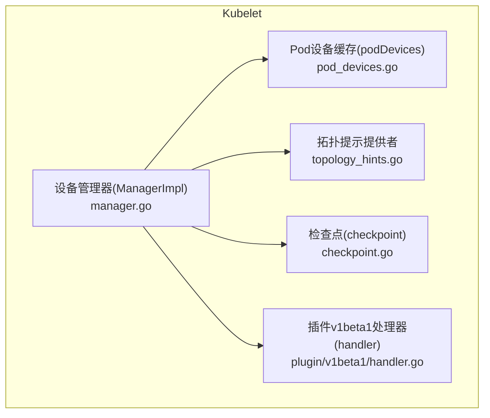
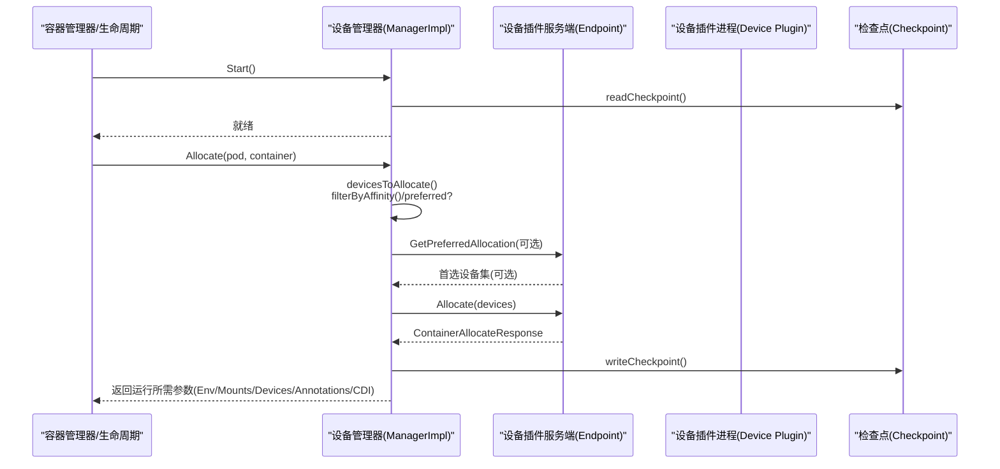
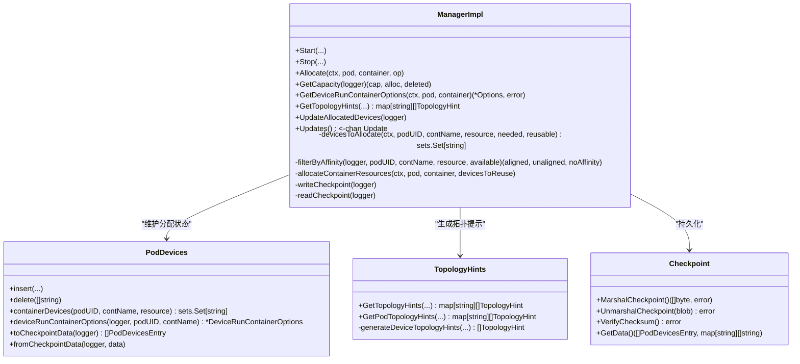
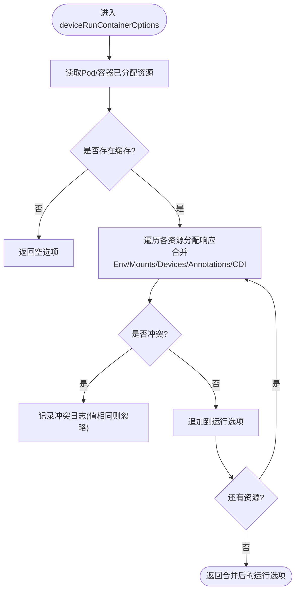
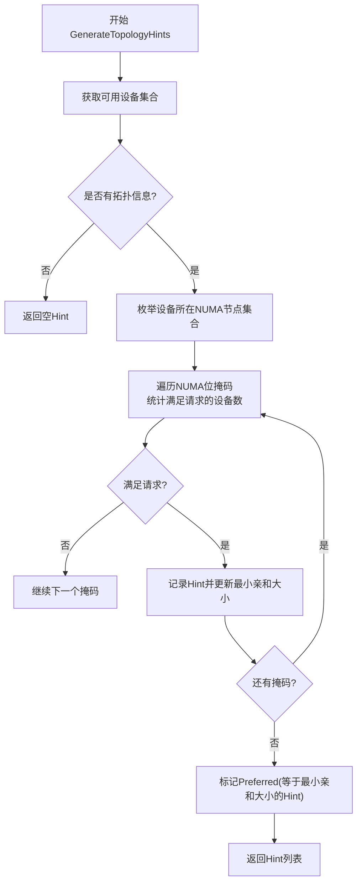
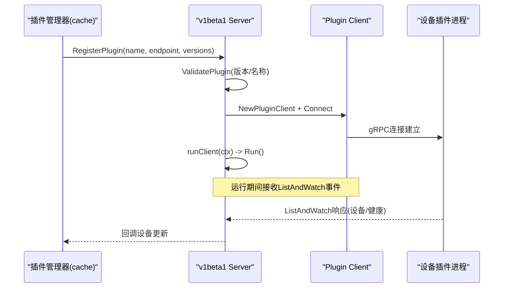
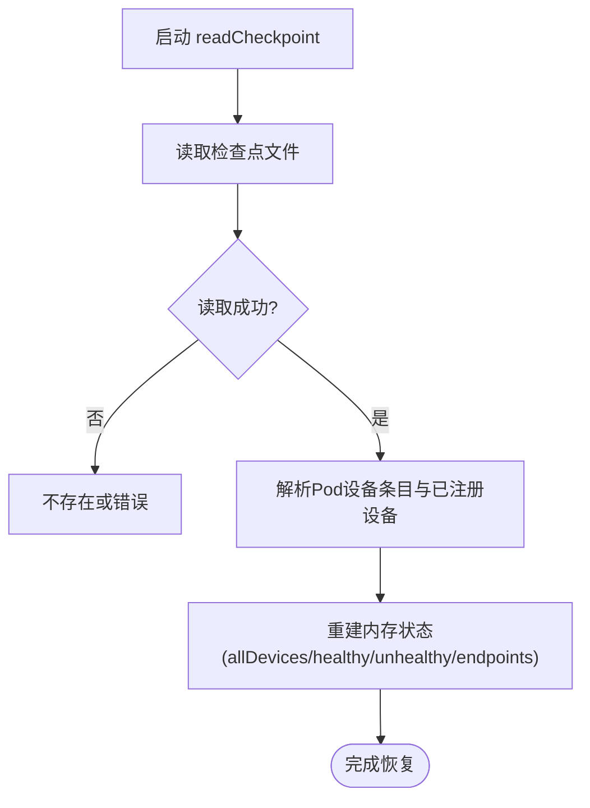
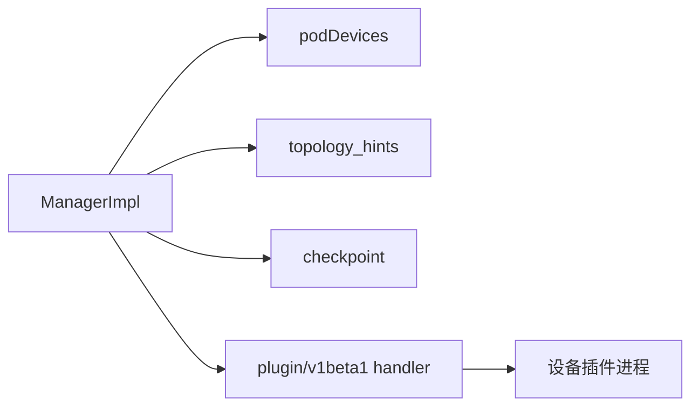

# 设备管理器

<cite>
**本文引用的文件**   
- [manager.go](file://pkg/kubelet/cm/devicemanager/manager.go)
- [types.go](file://pkg/kubelet/cm/devicemanager/types.go)
- [pod_devices.go](file://pkg/kubelet/cm/devicemanager/pod_devices.go)
- [topology_hints.go](file://pkg/kubelet/cm/devicemanager/topology_hints.go)
- [handler.go](file://pkg/kubelet/cm/devicemanager/plugin/v1beta1/handler.go)
- [checkpoint.go](file://pkg/kubelet/cm/devicemanager/checkpoint/checkpoint.go)
</cite>

## 目录
1. [简介](#简介)
2. [项目结构](#项目结构)
3. [核心组件](#核心组件)
4. [架构总览](#架构总览)
5. [详细组件分析](#详细组件分析)
6. [依赖关系分析](#依赖关系分析)
7. [性能考量](#性能考量)
8. [故障排查指南](#故障排查指南)
9. [结论](#结论)
10. [附录](#附录)

## 简介
本文件面向Kubelet设备管理器的设计与实现，系统性阐述以下主题：
- 设备插件框架与发现注册机制
- GPU、FPGA、NIC等加速设备的分配与隔离（含拓扑感知与NUMA亲和）
- 设备插件生命周期管理（启动、健康检查、故障恢复）
- 资源分配算法（选择策略、预留、冲突解决）
- 状态监控与报告（可用性检测、指标收集）
- 配置选项（过滤、限制、调度策略）
- 诊断与排障方法

## 项目结构
设备管理器位于Kubelet内部，围绕“设备插件”这一扩展点组织代码。关键目录与职责如下：
- devicemanager：设备管理器主逻辑，包含注册、分配、拓扑提示、持久化等
- plugin/v1beta1：设备插件v1beta1协议客户端与服务端封装，负责连接、版本校验、运行循环
- checkpoint：设备分配与注册状态的持久化格式与校验

图表来源
- [manager.go:134-183](file://pkg/kubelet/cm/devicemanager/manager.go#L134-L183)
- [pod_devices.go:41-51](file://pkg/kubelet/cm/devicemanager/pod_devices.go#L41-L51)
- [topology_hints.go:31-82](file://pkg/kubelet/cm/devicemanager/topology_hints.go#L31-L82)
- [checkpoint.go:27-57](file://pkg/kubelet/cm/devicemanager/checkpoint/checkpoint.go#L27-L57)
- [handler.go:32-95](file://pkg/kubelet/cm/devicemanager/plugin/v1beta1/handler.go#L32-L95)

章节来源
- [manager.go:134-183](file://pkg/kubelet/cm/devicemanager/manager.go#L134-L183)
- [types.go:37-100](file://pkg/kubelet/cm/devicemanager/types.go#L37-L100)

## 核心组件
- ManagerImpl：设备管理器核心，维护设备注册、健康状态、已分配集合、Pod设备映射、NUMA拓扑信息、拓扑亲和存储、可复用设备等；提供Start/Stop、Allocate、GetCapacity、GetDeviceRunContainerOptions、UpdatePluginResources、GetTopologyHints等接口。
- podDevices：按Pod/容器维度的设备分配缓存，支持并发读写、序列化到检查点、生成容器运行时注入参数（环境变量、挂载、设备、注解、CDI）。
- topology_hints：为ToplogyManager提供设备相关的拓扑提示，基于设备NUMA拓扑与请求数量生成Hint并标记Preferred。
- plugin/v1beta1 handler：设备插件的注册、验证、连接、断开、运行循环；负责版本兼容性与资源名合法性校验。
- checkpoint：持久化Pod设备分配与已注册设备列表，带校验和，用于节点重启后恢复。

章节来源
- [types.go:37-100](file://pkg/kubelet/cm/devicemanager/types.go#L37-L100)
- [pod_devices.go:41-51](file://pkg/kubelet/cm/devicemanager/pod_devices.go#L41-L51)
- [topology_hints.go:31-82](file://pkg/kubelet/cm/devicemanager/topology_hints.go#L31-L82)
- [handler.go:32-95](file://pkg/kubelet/cm/devicemanager/plugin/v1beta1/handler.go#L32-L95)
- [checkpoint.go:27-57](file://pkg/kubelet/cm/devicemanager/checkpoint/checkpoint.go#L27-L57)

## 架构总览
设备管理器作为Kubelet内对设备插件的统一抽象，向上暴露给容器生命周期与调度适配层，向下通过gRPC与设备插件通信，并通过检查点保证跨重启一致性。

图表来源
- [manager.go:366-381](file://pkg/kubelet/cm/devicemanager/manager.go#L366-L381)
- [manager.go:392-432](file://pkg/kubelet/cm/devicemanager/manager.go#L392-L432)
- [manager.go:857-963](file://pkg/kubelet/cm/devicemanager/manager.go#L857-L963)
- [manager.go:1051-1076](file://pkg/kubelet/cm/devicemanager/manager.go#L1051-L1076)
- [manager.go:524-541](file://pkg/kubelet/cm/devicemanager/manager.go#L524-L541)
- [pod_devices.go:249-354](file://pkg/kubelet/cm/devicemanager/pod_devices.go#L249-L354)

## 详细组件分析

### 组件一：设备管理器(ManagerImpl)
- 职责
  - 设备插件注册/断连处理，维护endpoint与options
  - 设备健康状态更新与容量上报
  - Pod/容器维度设备分配与回收
  - 拓扑感知分配与Preferred设备协商
  - 检查点读写与节点重启恢复
  - 向容器运行时注入设备相关运行参数
- 关键流程
  - 启动：创建Server、加载检查点、启动监听
  - 分配：计算可用设备、NUMA亲和过滤、调用插件首选策略、发起Allocate RPC、落盘
  - 容量：汇总健康/不健康设备，清理过期endpoint，输出capacity/allocatable
  - 拓扑提示：根据设备拓扑与请求生成Hint，供调度器使用
  - 预启动：按需调用PreStartContainer
- 错误与恢复
  - 无健康设备或设备不再健康时拒绝分配
  - 节点重启场景下，若容器已在运行则跳过分配
  - 分配失败时回滚allocatedDevices至实际状态

图表来源
- [manager.go:62-118](file://pkg/kubelet/cm/devicemanager/manager.go#L62-L118)
- [manager.go:392-432](file://pkg/kubelet/cm/devicemanager/manager.go#L392-L432)
- [manager.go:472-521](file://pkg/kubelet/cm/devicemanager/manager.go#L472-L521)
- [manager.go:524-571](file://pkg/kubelet/cm/devicemanager/manager.go#L524-L571)
- [manager.go:857-963](file://pkg/kubelet/cm/devicemanager/manager.go#L857-L963)
- [manager.go:1051-1076](file://pkg/kubelet/cm/devicemanager/manager.go#L1051-L1076)
- [pod_devices.go:41-51](file://pkg/kubelet/cm/devicemanager/pod_devices.go#L41-L51)
- [topology_hints.go:31-82](file://pkg/kubelet/cm/devicemanager/topology_hints.go#L31-L82)
- [checkpoint.go:27-57](file://pkg/kubelet/cm/devicemanager/checkpoint/checkpoint.go#L27-L57)

章节来源
- [manager.go:366-381](file://pkg/kubelet/cm/devicemanager/manager.go#L366-L381)
- [manager.go:392-432](file://pkg/kubelet/cm/devicemanager/manager.go#L392-L432)
- [manager.go:472-521](file://pkg/kubelet/cm/devicemanager/manager.go#L472-L521)
- [manager.go:524-571](file://pkg/kubelet/cm/devicemanager/manager.go#L524-L571)
- [manager.go:857-963](file://pkg/kubelet/cm/devicemanager/manager.go#L857-L963)
- [manager.go:1051-1076](file://pkg/kubelet/cm/devicemanager/manager.go#L1051-L1076)

### 组件二：Pod设备缓存(podDevices)
- 数据结构
  - 以Pod UID为键，值为容器名到资源名的映射，再映射到设备ID集合与分配响应
  - 支持并发读写的RWMutex保护
- 能力
  - 插入/删除/查询容器与Pod级设备集合
  - 合并多个资源的运行参数（环境变量、设备映射、挂载、注解、CDI），并去重与冲突检测
  - 序列化为检查点数据，反序列化恢复
- 复杂度
  - 插入/删除/查询均为O(1)平均时间（哈希表）
  - 合并运行参数为O(R+E+M+A+C)，其中R为资源数，E/M/A/C分别为环境/挂载/注解/CDI条目数

图表来源
- [pod_devices.go:249-354](file://pkg/kubelet/cm/devicemanager/pod_devices.go#L249-L354)

章节来源
- [pod_devices.go:41-51](file://pkg/kubelet/cm/devicemanager/pod_devices.go#L41-L51)
- [pod_devices.go:249-354](file://pkg/kubelet/cm/devicemanager/pod_devices.go#L249-L354)
- [pod_devices.go:203-246](file://pkg/kubelet/cm/devicemanager/pod_devices.go#L203-L246)

### 组件三：拓扑提示与NUMA亲和
- 目标
  - 为调度器/拓扑管理器提供设备拓扑Hint，尽量将设备分配到满足NUMA亲和的节点集合
- 算法要点
  - 仅考虑具备Topology信息的资源
  - 若已有分配且数量匹配，直接再生成相同Hint
  - 基于设备NUMA拓扑枚举有效NUMA组合，筛选满足请求数量的掩码，最小化亲和大小并标记Preferred
  - 分配阶段优先从“对齐集合”中选择，必要时回退到非对齐或无拓扑设备
- 复杂度
  - Hint生成受设备所在NUMA节点数n影响，最坏O(2^n)，但通过仅遍历有设备的节点降低n

图表来源
- [topology_hints.go:149-229](file://pkg/kubelet/cm/devicemanager/topology_hints.go#L149-L229)
- [topology_hints.go:31-82](file://pkg/kubelet/cm/devicemanager/topology_hints.go#L31-L82)
- [manager.go:760-855](file://pkg/kubelet/cm/devicemanager/manager.go#L760-L855)

章节来源
- [topology_hints.go:31-82](file://pkg/kubelet/cm/devicemanager/topology_hints.go#L31-L82)
- [topology_hints.go:149-229](file://pkg/kubelet/cm/devicemanager/topology_hints.go#L149-L229)
- [manager.go:760-855](file://pkg/kubelet/cm/devicemanager/manager.go#L760-L855)

### 组件四：设备插件v1beta1处理器
- 功能
  - 注册/注销插件，建立gRPC客户端，运行ListAndWatch循环
  - 版本兼容性校验与资源名合法性校验
  - 连接失败重试与断开清理
- 关键点
  - 同一资源可存在多个endpoint，断连时保留其他endpoint并提升为主
  - 最后endpoint断开时将该资源整体标记为不健康

图表来源
- [handler.go:32-95](file://pkg/kubelet/cm/devicemanager/plugin/v1beta1/handler.go#L32-L95)
- [handler.go:43-75](file://pkg/kubelet/cm/devicemanager/plugin/v1beta1/handler.go#L43-L75)
- [handler.go:133-145](file://pkg/kubelet/cm/devicemanager/plugin/v1beta1/handler.go#L133-L145)

章节来源
- [handler.go:32-95](file://pkg/kubelet/cm/devicemanager/plugin/v1beta1/handler.go#L32-L95)
- [handler.go:43-75](file://pkg/kubelet/cm/devicemanager/plugin/v1beta1/handler.go#L43-L75)
- [handler.go:133-145](file://pkg/kubelet/cm/devicemanager/plugin/v1beta1/handler.go#L133-L145)

### 组件五：检查点与恢复
- 内容
  - Pod设备分配明细（按NUMA分组）
  - 已注册设备列表（按资源名）
- 特性
  - JSON序列化，附带校验和，防止损坏
  - 启动时读取并重建内存状态；缺失检查点视为节点重建，可能重置扩展资源容量

图表来源
- [checkpoint.go:75-110](file://pkg/kubelet/cm/devicemanager/checkpoint/checkpoint.go#L75-L110)
- [manager.go:545-571](file://pkg/kubelet/cm/devicemanager/manager.go#L545-L571)

章节来源
- [checkpoint.go:27-57](file://pkg/kubelet/cm/devicemanager/checkpoint/checkpoint.go#L27-L57)
- [manager.go:545-571](file://pkg/kubelet/cm/devicemanager/manager.go#L545-L571)

## 依赖关系分析
- 内部依赖
  - ManagerImpl依赖podDevices进行分配状态管理
  - ManagerImpl依赖topology_hints生成拓扑提示
  - ManagerImpl依赖checkpoint进行持久化
  - ManagerImpl依赖plugin/v1beta1 handler与设备插件通信
- 外部依赖
  - 设备插件进程通过gRPC与ManagerImpl交互
  - 拓扑管理器通过HintProvider接口与设备管理器协作

图表来源
- [manager.go:62-118](file://pkg/kubelet/cm/devicemanager/manager.go#L62-L118)
- [pod_devices.go:41-51](file://pkg/kubelet/cm/devicemanager/pod_devices.go#L41-L51)
- [topology_hints.go:31-82](file://pkg/kubelet/cm/devicemanager/topology_hints.go#L31-L82)
- [checkpoint.go:27-57](file://pkg/kubelet/cm/devicemanager/checkpoint/checkpoint.go#L27-L57)
- [handler.go:32-95](file://pkg/kubelet/cm/devicemanager/plugin/v1beta1/handler.go#L32-L95)

章节来源
- [manager.go:62-118](file://pkg/kubelet/cm/devicemanager/manager.go#L62-L118)

## 性能考量
- 分配路径
  - 在分配前尽可能减少锁持有范围，避免长时间阻塞
  - 优先尝试Preferred设备以减少不必要的分配
  - 仅在需要时写入检查点
- 拓扑提示
  - 通过仅遍历携带设备的NUMA节点降低枚举规模
- 容量上报
  - 聚合健康/不健康设备，避免频繁变更导致调度抖动
- 并发安全
  - 使用RWMutex保护共享状态，读多写少场景优化

[本节为通用指导，无需源码引用]

## 故障排查指南
- 设备不可用/分配失败
  - 现象：分配报错“no healthy devices present”或“previously allocated devices are no longer healthy”
  - 排查：确认设备插件是否在线、设备健康状态是否为Healthy；查看节点容量与已分配集合
  - 参考
    - [manager.go:647-659](file://pkg/kubelet/cm/devicemanager/manager.go#L647-L659)
- 插件断连/资源不健康
  - 现象：某资源所有endpoint断开，资源被标记为不健康
  - 排查：检查设备插件进程存活、socket路径、版本兼容性
  - 参考
    - [manager.go:256-283](file://pkg/kubelet/cm/devicemanager/manager.go#L256-L283)
    - [handler.go:43-75](file://pkg/kubelet/cm/devicemanager/plugin/v1beta1/handler.go#L43-L75)
- 节点重启后分配不一致
  - 现象：重启后某些容器未获得设备
  - 排查：检查检查点文件是否存在、是否损坏；确认sourcesReady状态与容器运行集合
  - 参考
    - [manager.go:545-571](file://pkg/kubelet/cm/devicemanager/manager.go#L545-L571)
    - [manager.go:1232-1265](file://pkg/kubelet/cm/devicemanager/manager.go#L1232-L1265)
- 拓扑亲和未生效
  - 现象：设备跨NUMA分配
  - 排查：确认设备是否上报Topology信息、Hint是否生成Preferred
  - 参考
    - [topology_hints.go:134-142](file://pkg/kubelet/cm/devicemanager/topology_hints.go#L134-L142)
    - [topology_hints.go:149-229](file://pkg/kubelet/cm/devicemanager/topology_hints.go#L149-L229)

章节来源
- [manager.go:647-659](file://pkg/kubelet/cm/devicemanager/manager.go#L647-L659)
- [manager.go:256-283](file://pkg/kubelet/cm/devicemanager/manager.go#L256-L283)
- [handler.go:43-75](file://pkg/kubelet/cm/devicemanager/plugin/v1beta1/handler.go#L43-L75)
- [manager.go:545-571](file://pkg/kubelet/cm/devicemanager/manager.go#L545-L571)
- [manager.go:1232-1265](file://pkg/kubelet/cm/devicemanager/manager.go#L1232-L1265)
- [topology_hints.go:134-142](file://pkg/kubelet/cm/devicemanager/topology_hints.go#L134-L142)
- [topology_hints.go:149-229](file://pkg/kubelet/cm/devicemanager/topology_hints.go#L149-L229)

## 结论
Kubelet设备管理器通过统一的设备插件框架，实现了设备发现、注册、健康监控、拓扑感知分配与持久化恢复。其设计兼顾了可扩展性（插件化）、可靠性（检查点与容错）与高性能（锁粒度控制与Preferred设备协商）。对于GPU/FPGA/NIC等加速设备，结合TopologyManager可实现NUMA亲和与更精细的资源编排。

[本节为总结，无需源码引用]

## 附录

### 配置与行为要点（基于源码语义）
- 插件选项
  - PreStartRequired：是否需要调用PreStartContainer
  - GetPreferredAllocationAvailable：是否允许调用GetPreferredAllocation以优选设备
- 资源命名与校验
  - 设备插件资源名需符合扩展资源命名规范
- 容量与可分配量
  - capacity=健康+不健康设备总数；allocatable=健康设备数
- 拓扑提示
  - 仅当设备具备Topology信息时参与Hint生成
- 检查点
  - 缺失检查点文件通常表示节点重建，可能需要重置扩展资源容量

章节来源
- [manager.go:1019-1049](file://pkg/kubelet/cm/devicemanager/manager.go#L1019-L1049)
- [manager.go:1051-1076](file://pkg/kubelet/cm/devicemanager/manager.go#L1051-L1076)
- [handler.go:61-75](file://pkg/kubelet/cm/devicemanager/plugin/v1beta1/handler.go#L61-L75)
- [manager.go:472-521](file://pkg/kubelet/cm/devicemanager/manager.go#L472-L521)
- [topology_hints.go:134-142](file://pkg/kubelet/cm/devicemanager/topology_hints.go#L134-L142)
- [manager.go:1221-1230](file://pkg/kubelet/cm/devicemanager/manager.go#L1221-L1230)