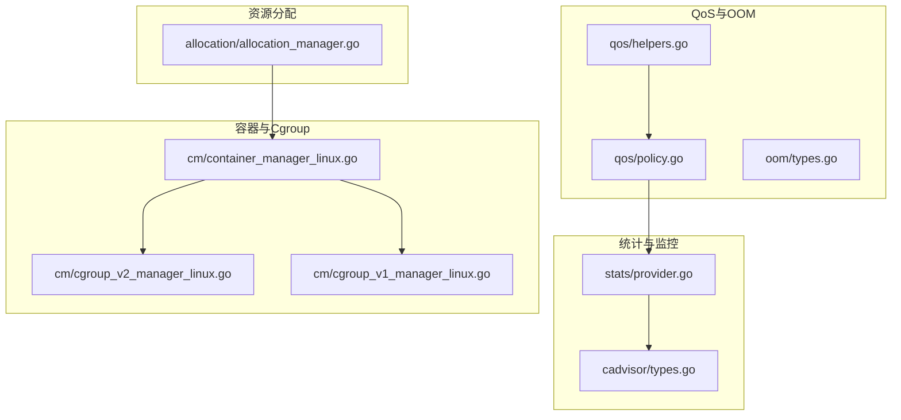
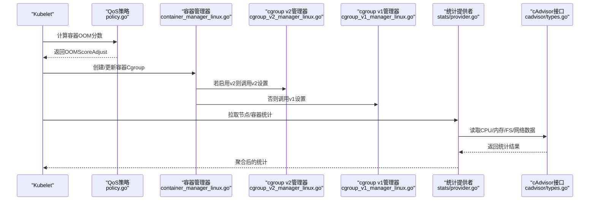
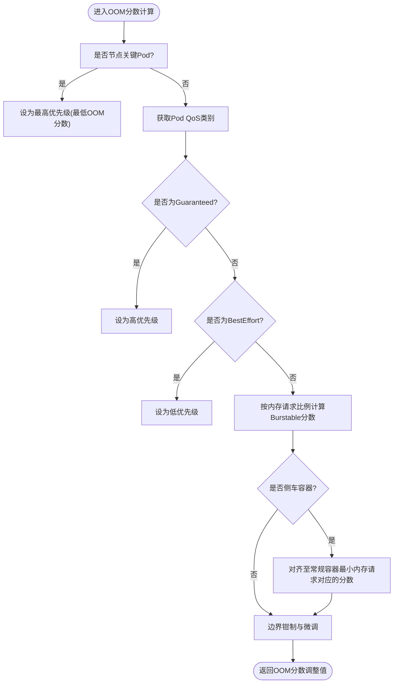
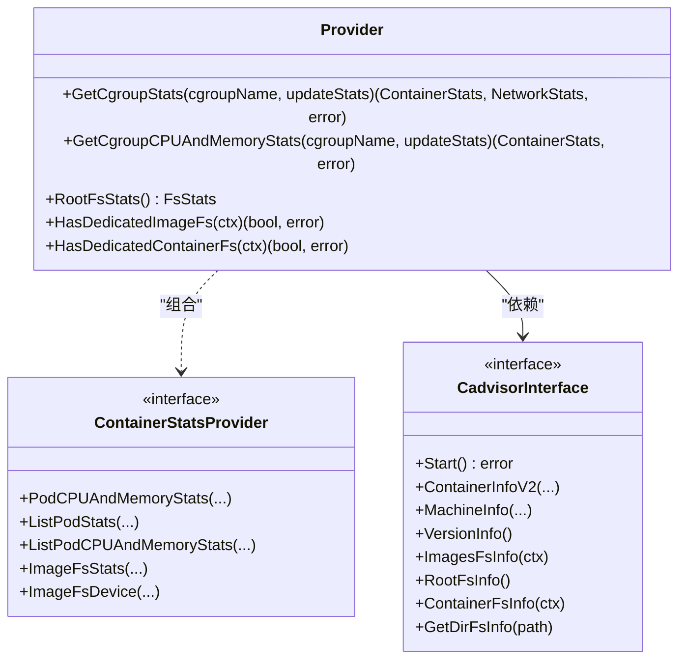
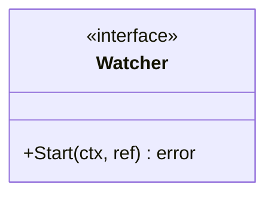
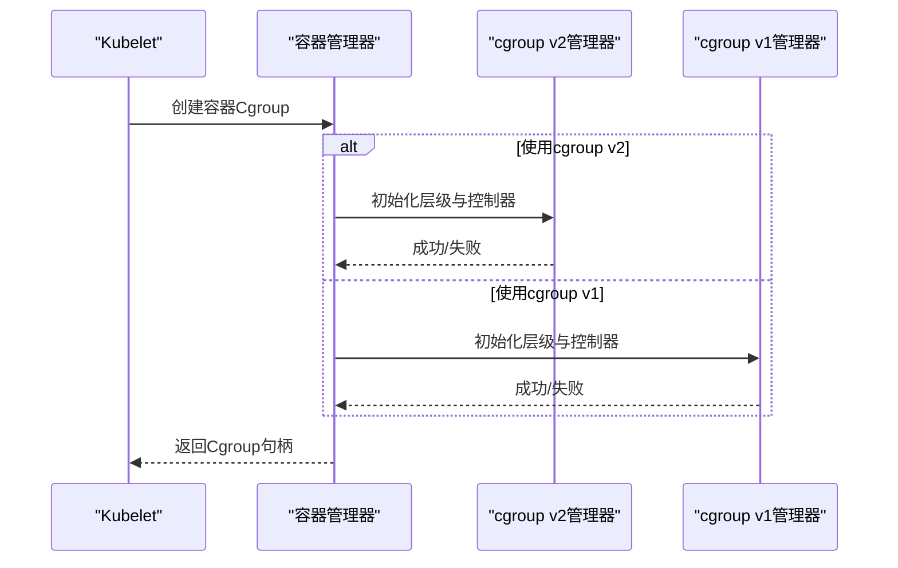
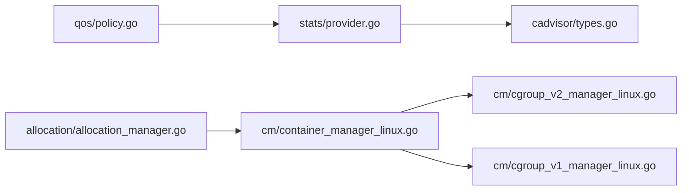

# 资源管理与QoS

<cite>
**本文引用的文件**   
- [pkg/kubelet/qos/policy.go](file://pkg/kubelet/qos/policy.go)
- [pkg/kubelet/qos/helpers.go](file://pkg/kubelet/qos/helpers.go)
- [pkg/kubelet/cadvisor/types.go](file://pkg/kubelet/cadvisor/types.go)
- [pkg/kubelet/stats/provider.go](file://pkg/kubelet/stats/provider.go)
- [pkg/kubelet/oom/types.go](file://pkg/kubelet/oom/types.go)
- [pkg/kubelet/cm/container_manager_linux.go](file://pkg/kubelet/cm/container_manager_linux.go)
- [pkg/kubelet/cm/cgroup_v2_manager_linux.go](file://pkg/kubelet/cm/cgroup_v2_manager_linux.go)
- [pkg/kubelet/cm/cgroup_v1_manager_linux.go](file://pkg/kubelet/cm/cgroup_v1_manager_linux.go)
- [pkg/kubelet/allocation/allocation_manager.go](file://pkg/kubelet/allocation/allocation_manager.go)
</cite>

## 目录
1. [简介](#简介)
2. [项目结构](#项目结构)
3. [核心组件](#核心组件)
4. [架构总览](#架构总览)
5. [详细组件分析](#详细组件分析)
6. [依赖关系分析](#依赖关系分析)
7. [性能考虑](#性能考虑)
8. [故障排查指南](#故障排查指南)
9. [结论](#结论)
10. [附录](#附录)

## 简介
本技术文档聚焦于Kubelet的资源管理与服务质量（QoS）体系，围绕以下主题展开：
- Cgroup资源隔离与限制：CPU、内存、磁盘I/O与网络资源的控制与监控路径。
- QoS策略：Guaranteed、Burstable、BestEffort的判定与OOM优先级调整。
- CPU管理器：独占CPU分配、共享池与动态调整机制。
- 内存管理：OOM保护、回收与交换空间相关行为。
- 设备资源：GPU/FPGA等加速设备的分配与隔离。
- 指标解读、性能调优与容量规划建议。
- 资源争用诊断与故障排查方法。

## 项目结构
围绕资源管理与QoS的关键代码分布在以下模块：
- QoS与OOM评分：qos包负责Pod/容器级别的QoS判定与OOM分数计算。
- 统计与监控：stats与cadvisor接口用于采集节点与容器的CPU/内存/文件系统/网络使用信息。
- OOM事件：oom包提供OOM事件观察接口。
- 容器与Cgroup管理：cm包实现cgroup v1/v2的管理器与容器生命周期集成。
- 资源分配：allocation包维护已分配资源视图，辅助调度与配额决策。

图表来源
- [pkg/kubelet/qos/policy.go:1-136](file://pkg/kubelet/qos/policy.go#L1-L136)
- [pkg/kubelet/qos/helpers.go:1-72](file://pkg/kubelet/qos/helpers.go#L1-L72)
- [pkg/kubelet/stats/provider.go:1-238](file://pkg/kubelet/stats/provider.go#L1-L238)
- [pkg/kubelet/cadvisor/types.go:1-57](file://pkg/kubelet/cadvisor/types.go#L1-L57)
- [pkg/kubelet/cm/container_manager_linux.go](file://pkg/kubelet/cm/container_manager_linux.go)
- [pkg/kubelet/cm/cgroup_v2_manager_linux.go](file://pkg/kubelet/cm/cgroup_v2_manager_linux.go)
- [pkg/kubelet/cm/cgroup_v1_manager_linux.go](file://pkg/kubelet/cm/cgroup_v1_manager_linux.go)
- [pkg/kubelet/allocation/allocation_manager.go](file://pkg/kubelet/allocation/allocation_manager.go)

章节来源
- [pkg/kubelet/qos/policy.go:1-136](file://pkg/kubelet/qos/policy.go#L1-L136)
- [pkg/kubelet/qos/helpers.go:1-72](file://pkg/kubelet/qos/helpers.go#L1-L72)
- [pkg/kubelet/stats/provider.go:1-238](file://pkg/kubelet/stats/provider.go#L1-L238)
- [pkg/kubelet/cadvisor/types.go:1-57](file://pkg/kubelet/cadvisor/types.go#L1-L57)
- [pkg/kubelet/oom/types.go:1-29](file://pkg/kubelet/oom/types.go#L1-L29)
- [pkg/kubelet/cm/container_manager_linux.go](file://pkg/kubelet/cm/container_manager_linux.go)
- [pkg/kubelet/cm/cgroup_v2_manager_linux.go](file://pkg/kubelet/cm/cgroup_v2_manager_linux.go)
- [pkg/kubelet/cm/cgroup_v1_manager_linux.go](file://pkg/kubelet/cm/cgroup_v1_manager_linux.go)
- [pkg/kubelet/allocation/allocation_manager.go](file://pkg/kubelet/allocation/allocation_manager.go)

## 核心组件
- QoS与OOM评分
  - Pod级QoS分类决定进程被OOM杀死的优先级；支持Guaranteed、Burstable、BestEffort三类。
  - 针对侧车容器与Pod级别资源请求场景，OOM分数计算有额外修正逻辑。
- 统计与监控
  - 通过cAdvisor与CRI两种路径获取节点与容器统计数据，包括CPU、内存、文件系统与网络。
  - 提供根文件系统、镜像文件系统、容器文件系统的使用情况判断能力。
- OOM事件观察
  - 定义统一的Watcher接口，便于在Linux上监听并处理OOM事件。
- 容器与Cgroup管理
  - 抽象出容器管理器，并在Linux下分别实现cgroup v1与v2两套后端。
- 资源分配
  - 维护节点上的资源分配视图，为后续调度与隔离提供依据。

章节来源
- [pkg/kubelet/qos/policy.go:1-136](file://pkg/kubelet/qos/policy.go#L1-L136)
- [pkg/kubelet/qos/helpers.go:1-72](file://pkg/kubelet/qos/helpers.go#L1-L72)
- [pkg/kubelet/stats/provider.go:1-238](file://pkg/kubelet/stats/provider.go#L1-L238)
- [pkg/kubelet/cadvisor/types.go:1-57](file://pkg/kubelet/cadvisor/types.go#L1-L57)
- [pkg/kubelet/oom/types.go:1-29](file://pkg/kubelet/oom/types.go#L1-L29)
- [pkg/kubelet/cm/container_manager_linux.go](file://pkg/kubelet/cm/container_manager_linux.go)
- [pkg/kubelet/cm/cgroup_v2_manager_linux.go](file://pkg/kubelet/cm/cgroup_v2_manager_linux.go)
- [pkg/kubelet/cm/cgroup_v1_manager_linux.go](file://pkg/kubelet/cm/cgroup_v1_manager_linux.go)
- [pkg/kubelet/allocation/allocation_manager.go](file://pkg/kubelet/allocation/allocation_manager.go)

## 架构总览
下图展示了从Pod到Cgroup再到统计上报的整体链路，以及QoS与OOM评分如何影响系统行为。

图表来源
- [pkg/kubelet/qos/policy.go:1-136](file://pkg/kubelet/qos/policy.go#L1-L136)
- [pkg/kubelet/cm/container_manager_linux.go](file://pkg/kubelet/cm/container_manager_linux.go)
- [pkg/kubelet/cm/cgroup_v2_manager_linux.go](file://pkg/kubelet/cm/cgroup_v2_manager_linux.go)
- [pkg/kubelet/cm/cgroup_v1_manager_linux.go](file://pkg/kubelet/cm/cgroup_v1_manager_linux.go)
- [pkg/kubelet/stats/provider.go:1-238](file://pkg/kubelet/stats/provider.go#L1-L238)
- [pkg/kubelet/cadvisor/types.go:1-57](file://pkg/kubelet/cadvisor/types.go#L1-L57)

## 详细组件分析

### QoS与OOM评分
- 目标
  - 根据Pod与容器的资源声明，计算每个进程的OOM分数调整值，从而决定内存紧张时的杀死顺序。
- 关键规则
  - Guaranteed类容器优先存活；BestEffort类最容易被杀。
  - Burstable类介于两者之间，且当开启Pod级别资源时，会将未分配到容器的剩余Pod内存请求均摊到各容器参与计算。
  - 侧车容器（RestartPolicy=Always且匹配InitContainer名称）的OOM分数会与同Pod常规容器的最小内存请求对齐，避免侧车比主业务更易被杀。
- 复杂度
  - 主要涉及线性遍历容器列表与简单算术运算，时间复杂度O(n)，n为容器数量。
- 错误处理
  - 对特征开关与资源聚合函数进行条件判断，避免非法状态。

图表来源
- [pkg/kubelet/qos/policy.go:1-136](file://pkg/kubelet/qos/policy.go#L1-L136)
- [pkg/kubelet/qos/helpers.go:1-72](file://pkg/kubelet/qos/helpers.go#L1-L72)

章节来源
- [pkg/kubelet/qos/policy.go:1-136](file://pkg/kubelet/qos/policy.go#L1-L136)
- [pkg/kubelet/qos/helpers.go:1-72](file://pkg/kubelet/qos/helpers.go#L1-L72)

### 统计与监控（CPU/内存/磁盘I/O/网络）
- 目标
  - 统一对外暴露节点与容器维度的资源使用统计，支撑告警、HPA、弹性伸缩与容量规划。
- 数据源
  - cAdvisor：提供主机、容器、文件系统、网络等底层统计。
  - CRI：部分平台可直接从运行时获取容器统计。
- 关键能力
  - 获取指定cgroup的CPU/内存与网络统计。
  - 根文件系统、镜像文件系统、容器文件系统的使用量与inode统计。
  - 判断是否存在独立的镜像/容器文件系统。
- 复杂度
  - 以IO为主，统计聚合为O(1)或O(k)（k为文件系统数量）。

图表来源
- [pkg/kubelet/stats/provider.go:1-238](file://pkg/kubelet/stats/provider.go#L1-L238)
- [pkg/kubelet/cadvisor/types.go:1-57](file://pkg/kubelet/cadvisor/types.go#L1-L57)

章节来源
- [pkg/kubelet/stats/provider.go:1-238](file://pkg/kubelet/stats/provider.go#L1-L238)
- [pkg/kubelet/cadvisor/types.go:1-57](file://pkg/kubelet/cadvisor/types.go#L1-L57)

### OOM事件观察
- 目标
  - 在Linux环境下监听OOM事件，以便记录指标、触发告警或执行自愈动作。
- 设计要点
  - 通过统一Watcher接口屏蔽平台差异，便于扩展与测试。

图表来源
- [pkg/kubelet/oom/types.go:1-29](file://pkg/kubelet/oom/types.go#L1-L29)

章节来源
- [pkg/kubelet/oom/types.go:1-29](file://pkg/kubelet/oom/types.go#L1-L29)

### 容器与Cgroup管理（CPU/内存/磁盘I/O/网络）
- 目标
  - 将Kubernetes资源模型映射到宿主机的Cgroup子系统，完成CPU、内存、磁盘I/O与网络的隔离与限制。
- 架构要点
  - 容器管理器抽象层统一入口，内部根据内核能力选择cgroup v1或v2实现。
  - cgroup v2采用统一层级与控制器集合，v1采用多层级与独立控制器。
- 典型流程
  - 启动容器前，创建对应Cgroup树，写入cpu、memory、io、net_cls/net_prio等控制器参数。
  - 容器生命周期结束时，清理Cgroup资源。

图表来源
- [pkg/kubelet/cm/container_manager_linux.go](file://pkg/kubelet/cm/container_manager_linux.go)
- [pkg/kubelet/cm/cgroup_v2_manager_linux.go](file://pkg/kubelet/cm/cgroup_v2_manager_linux.go)
- [pkg/kubelet/cm/cgroup_v1_manager_linux.go](file://pkg/kubelet/cm/cgroup_v1_manager_linux.go)

章节来源
- [pkg/kubelet/cm/container_manager_linux.go](file://pkg/kubelet/cm/container_manager_linux.go)
- [pkg/kubelet/cm/cgroup_v2_manager_linux.go](file://pkg/kubelet/cm/cgroup_v2_manager_linux.go)
- [pkg/kubelet/cm/cgroup_v1_manager_linux.go](file://pkg/kubelet/cm/cgroup_v1_manager_linux.go)

### 资源分配与管理视图
- 目标
  - 维护节点上已分配资源的全局视图，辅助后续的资源再平衡、驱逐与容量评估。
- 关键点
  - 与容器管理器联动，确保“声明-分配-实际”三者一致。
  - 为上层组件（如调度器、HPA、集群自治）提供一致性数据源。

章节来源
- [pkg/kubelet/allocation/allocation_manager.go](file://pkg/kubelet/allocation/allocation_manager.go)

## 依赖关系分析
- 耦合与内聚
  - qos与stats解耦：QoS仅依赖资源声明与特征开关，不直接访问底层统计。
  - stats与cAdvisor强耦合：统计采集高度依赖cAdvisor接口。
  - cm与cgroup版本实现分离：通过抽象降低平台差异带来的耦合。
- 外部依赖
  - cAdvisor：底层统计与文件系统信息。
  - CRI：可选的容器统计来源。
  - 内核特性：cgroup v1/v2、OOM子系统等。

图表来源
- [pkg/kubelet/qos/policy.go:1-136](file://pkg/kubelet/qos/policy.go#L1-L136)
- [pkg/kubelet/stats/provider.go:1-238](file://pkg/kubelet/stats/provider.go#L1-L238)
- [pkg/kubelet/cadvisor/types.go:1-57](file://pkg/kubelet/cadvisor/types.go#L1-L57)
- [pkg/kubelet/cm/container_manager_linux.go](file://pkg/kubelet/cm/container_manager_linux.go)
- [pkg/kubelet/cm/cgroup_v2_manager_linux.go](file://pkg/kubelet/cm/cgroup_v2_manager_linux.go)
- [pkg/kubelet/cm/cgroup_v1_manager_linux.go](file://pkg/kubelet/cm/cgroup_v1_manager_linux.go)
- [pkg/kubelet/allocation/allocation_manager.go](file://pkg/kubelet/allocation/allocation_manager.go)

## 性能考虑
- 统计采样频率
  - 合理设置统计周期，避免频繁IO导致节点抖动。
- cgroup控制器开销
  - 大量细粒度控制器（如io、net_cls）会增加路径查找与写放大，建议在非必要时关闭。
- 文件系统统计
  - 独立镜像/容器文件系统可提升统计准确性，但需关注跨设备统计成本。
- OOM评分计算
  - 尽量保持容器数量可控，避免过深嵌套导致的计算与传播延迟。

[本节为通用指导，无需特定文件引用]

## 故障排查指南
- OOM相关问题
  - 检查Pod/容器QoS类别与内存请求是否合理。
  - 核对侧车容器是否与主业务容器内存请求对齐。
  - 查看OOM事件观察器是否正常启动与上报。
- 统计异常
  - 确认cAdvisor服务健康与数据缓存命中。
  - 校验根/镜像/容器文件系统是否分离，避免统计口径不一致。
- Cgroup配置问题
  - 确认当前内核支持的cgroup版本与控制器可用性。
  - 对比v1/v2路径的差异，定位控制器写入失败原因。

章节来源
- [pkg/kubelet/qos/policy.go:1-136](file://pkg/kubelet/qos/policy.go#L1-L136)
- [pkg/kubelet/qos/helpers.go:1-72](file://pkg/kubelet/qos/helpers.go#L1-L72)
- [pkg/kubelet/stats/provider.go:1-238](file://pkg/kubelet/stats/provider.go#L1-L238)
- [pkg/kubelet/oom/types.go:1-29](file://pkg/kubelet/oom/types.go#L1-L29)
- [pkg/kubelet/cm/container_manager_linux.go](file://pkg/kubelet/cm/container_manager_linux.go)
- [pkg/kubelet/cm/cgroup_v2_manager_linux.go](file://pkg/kubelet/cm/cgroup_v2_manager_linux.go)
- [pkg/kubelet/cm/cgroup_v1_manager_linux.go](file://pkg/kubelet/cm/cgroup_v1_manager_linux.go)

## 结论
Kubelet的资源管理与QoS体系通过清晰的层次划分与接口抽象，实现了从资源声明到Cgroup隔离、从统计采集到OOM保护的完整闭环。在生产环境中，应结合工作负载特征合理设置QoS与资源请求，配合独立的镜像/容器文件系统与合适的统计频率，以获得稳定可预期的性能表现。

[本节为总结性内容，无需特定文件引用]

## 附录
- 术语
  - QoS：服务质量，分为Guaranteed、Burstable、BestEffort三类。
  - OOM：Out-of-Memory，内存不足时由内核触发进程终止。
  - cgroup：Linux内核提供的资源隔离与限制机制。
- 参考路径
  - QoS与OOM评分：[pkg/kubelet/qos/policy.go](file://pkg/kubelet/qos/policy.go)、[pkg/kubelet/qos/helpers.go](file://pkg/kubelet/qos/helpers.go)
  - 统计与监控：[pkg/kubelet/stats/provider.go](file://pkg/kubelet/stats/provider.go)、[pkg/kubelet/cadvisor/types.go](file://pkg/kubelet/cadvisor/types.go)
  - OOM事件：[pkg/kubelet/oom/types.go](file://pkg/kubelet/oom/types.go)
  - 容器与Cgroup：[pkg/kubelet/cm/container_manager_linux.go](file://pkg/kubelet/cm/container_manager_linux.go)、[pkg/kubelet/cm/cgroup_v2_manager_linux.go](file://pkg/kubelet/cm/cgroup_v2_manager_linux.go)、[pkg/kubelet/cm/cgroup_v1_manager_linux.go](file://pkg/kubelet/cm/cgroup_v1_manager_linux.go)
  - 资源分配：[pkg/kubelet/allocation/allocation_manager.go](file://pkg/kubelet/allocation/allocation_manager.go)