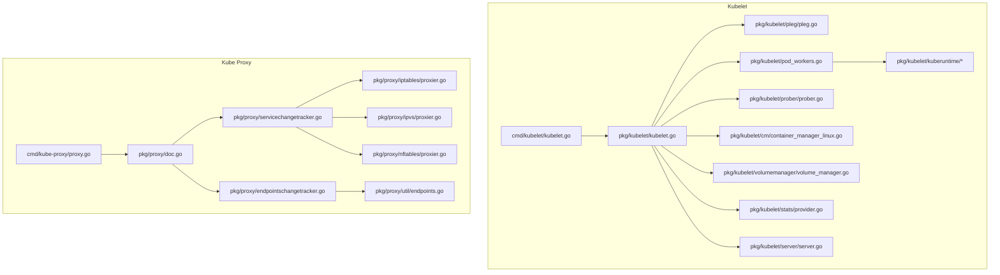
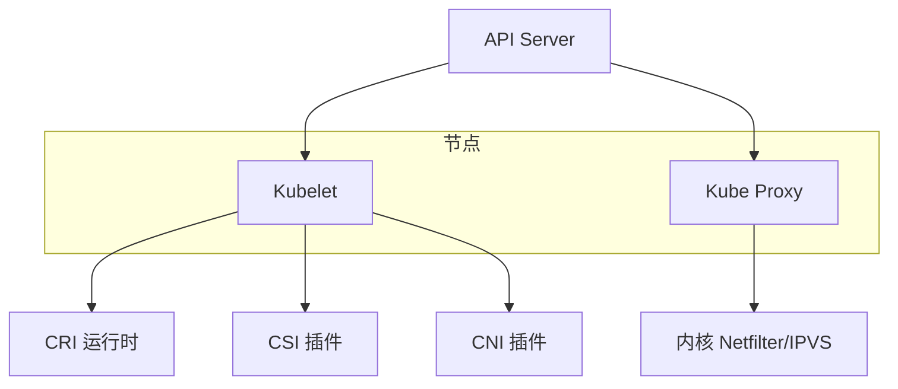
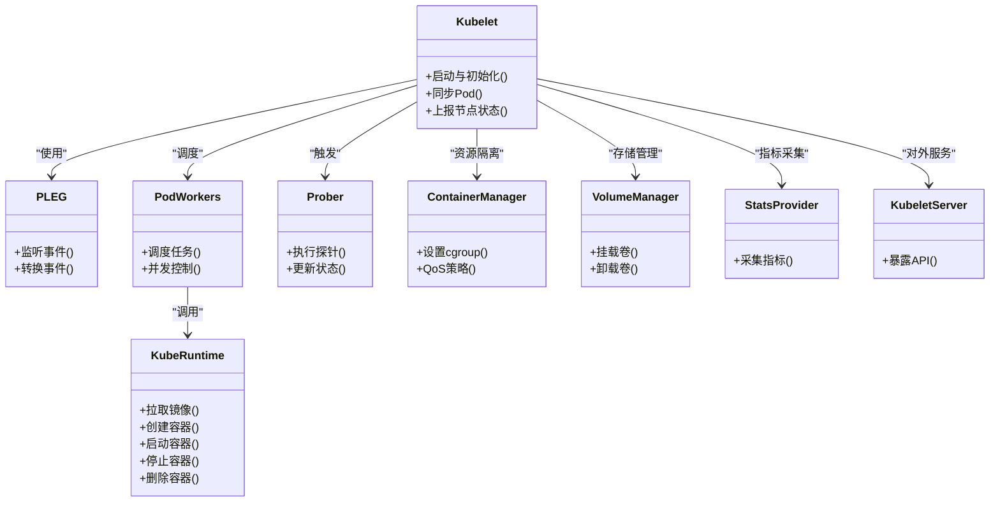
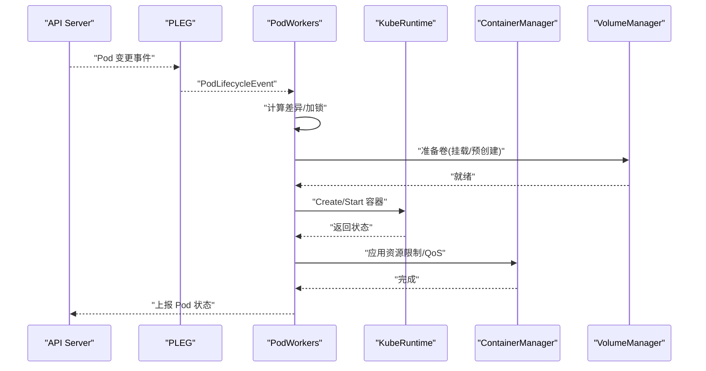
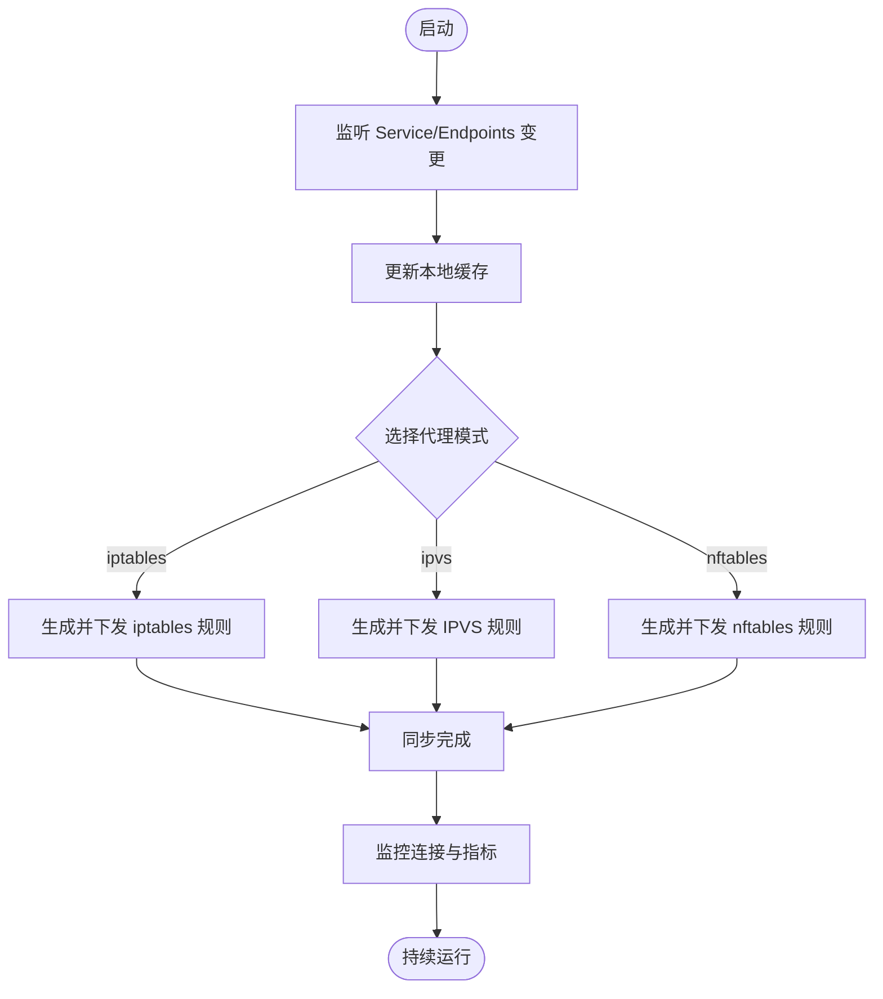
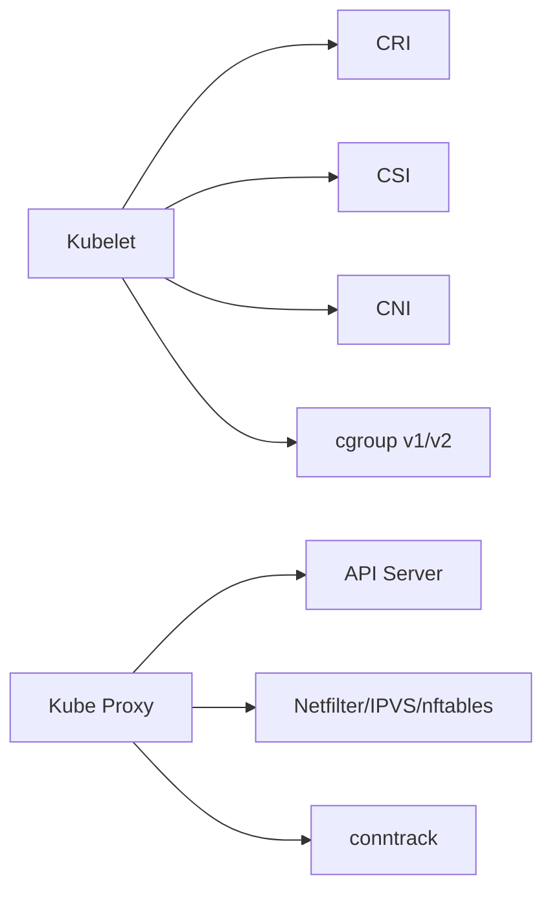

# 数据平面组件

<cite>
**本文引用的文件**   
- [cmd/kubelet/kubelet.go](file://cmd/kubelet/kubelet.go)
- [cmd/kube-proxy/proxy.go](file://cmd/kube-proxy/proxy.go)
- [pkg/kubelet/kubelet.go](file://pkg/kubelet/kubelet.go)
- [pkg/kubelet/pod_workers.go](file://pkg/kubelet/pod_workers.go)
- [pkg/kubelet/kuberuntime/kuberuntime_manager.go](file://pkg/kubelet/kuberuntime/kuberuntime_manager.go)
- [pkg/kubelet/kuberuntime/kuberuntime_container.go](file://pkg/kubelet/kuberuntime/kuberuntime_container.go)
- [pkg/kubelet/prober/prober.go](file://pkg/kubelet/prober/prober.go)
- [pkg/kubelet/cm/container_manager_linux.go](file://pkg/kubelet/cm/container_manager_linux.go)
- [pkg/kubelet/volumemanager/volume_manager.go](file://pkg/kubelet/volumemanager/volume_manager.go)
- [pkg/kubelet/pleg/pleg.go](file://pkg/kubelet/pleg/pleg.go)
- [pkg/kubelet/stats/provider.go](file://pkg/kubelet/stats/provider.go)
- [pkg/kubelet/server/server.go](file://pkg/kubelet/server/server.go)
- [pkg/proxy/doc.go](file://pkg/proxy/doc.go)
- [pkg/proxy/iptables/proxier.go](file://pkg/proxy/iptables/proxier.go)
- [pkg/proxy/ipvs/proxier.go](file://pkg/proxy/ipvs/proxier.go)
- [pkg/proxy/nftables/proxier.go](file://pkg/proxy/nftables/proxier.go)
- [pkg/proxy/util/endpoints.go](file://pkg/proxy/util/endpoints.go)
- [pkg/proxy/servicechangetracker.go](file://pkg/proxy/servicechangetracker.go)
- [pkg/proxy/endpointschangetracker.go](file://pkg/proxy/endpointschangetracker.go)
</cite>

## 目录
1. [简介](#简介)
2. [项目结构](#项目结构)
3. [核心组件](#核心组件)
4. [架构总览](#架构总览)
5. [详细组件分析](#详细组件分析)
6. [依赖关系分析](#依赖关系分析)
7. [性能考量](#性能考量)
8. [故障排查指南](#故障排查指南)
9. [结论](#结论)
10. [附录](#附录)

## 简介
本技术文档聚焦 Kubernetes 数据平面两大关键组件：Kubelet（节点代理）与 Kube Proxy（服务发现与负载均衡）。内容覆盖容器生命周期管理、Pod 同步机制、健康检查探针、资源管理与安全上下文处理；以及 iptables、ipvs、nftables 等代理模式的实现原理与性能特点。同时给出节点网络配置、存储挂载、资源限制机制，以及监控指标、日志收集方法与常见故障排查建议，并说明 CRI、CSI、CNI 的集成方式。

## 项目结构
仓库采用按功能域分层组织的方式，数据平面相关代码主要分布在以下路径：
- cmd/kubelet：Kubelet 进程入口
- pkg/kubelet：Kubelet 核心逻辑（Pod 工作器、运行时抽象、探针、资源管理、卷管理、PLEG、统计、服务端等）
- cmd/kube-proxy：Kube Proxy 进程入口
- pkg/proxy：Kube Proxy 核心逻辑（Service/Endpoint 变更跟踪、多种后端 proxier 实现、工具集等）

图表来源
- [cmd/kubelet/kubelet.go:1-40](file://cmd/kubelet/kubelet.go#L1-L40)
- [pkg/kubelet/kubelet.go](file://pkg/kubelet/kubelet.go)
- [pkg/kubelet/pleg/pleg.go](file://pkg/kubelet/pleg/pleg.go)
- [pkg/kubelet/pod_workers.go](file://pkg/kubelet/pod_workers.go)
- [pkg/kubelet/kuberuntime/kuberuntime_manager.go](file://pkg/kubelet/kuberuntime/kuberuntime_manager.go)
- [pkg/kubelet/kuberuntime/kuberuntime_container.go](file://pkg/kubelet/kuberuntime/kuberuntime_container.go)
- [pkg/kubelet/prober/prober.go](file://pkg/kubelet/prober/prober.go)
- [pkg/kubelet/cm/container_manager_linux.go](file://pkg/kubelet/cm/container_manager_linux.go)
- [pkg/kubelet/volumemanager/volume_manager.go](file://pkg/kubelet/volumemanager/volume_manager.go)
- [pkg/kubelet/stats/provider.go](file://pkg/kubelet/stats/provider.go)
- [pkg/kubelet/server/server.go](file://pkg/kubelet/server/server.go)
- [cmd/kube-proxy/proxy.go:1-34](file://cmd/kube-proxy/proxy.go#L1-L34)
- [pkg/proxy/doc.go](file://pkg/proxy/doc.go)
- [pkg/proxy/servicechangetracker.go](file://pkg/proxy/servicechangetracker.go)
- [pkg/proxy/endpointschangetracker.go](file://pkg/proxy/endpointschangetracker.go)
- [pkg/proxy/iptables/proxier.go](file://pkg/proxy/iptables/proxier.go)
- [pkg/proxy/ipvs/proxier.go](file://pkg/proxy/ipvs/proxier.go)
- [pkg/proxy/nftables/proxier.go](file://pkg/proxy/nftables/proxier.go)
- [pkg/proxy/util/endpoints.go](file://pkg/proxy/util/endpoints.go)

章节来源
- [cmd/kubelet/kubelet.go:1-40](file://cmd/kubelet/kubelet.go#L1-L40)
- [cmd/kube-proxy/proxy.go:1-34](file://cmd/kube-proxy/proxy.go#L1-L34)

## 核心组件
- Kubelet
  - Pod 同步与调度执行：通过 PLEG 监听事件，由 PodWorkers 并发执行同步流程，调用运行时接口创建/更新/删除容器。
  - 健康检查探针：周期性执行 liveness/readiness/startup 探针，驱动重启或流量摘除。
  - 资源管理：基于 cgroup v1/v2 进行 CPU/内存隔离与 QoS 分级，结合 Topology Manager、CPU/Memory Manager 做亲和与预留。
  - 安全上下文：解析并应用 SecurityContext（用户/组、能力、只读根文件系统、SELinux/AppArmor 等），在运行时层生效。
  - 存储挂载：VolumeManager 协调 CSI/FlexVolume/HostPath 等插件完成挂载/卸载。
  - 监控与 API：stats 提供节点/容器级指标；server 暴露 kubelet API 供上层查询。
- Kube Proxy
  - Service/Endpoint 变更跟踪：监听 API Server，维护本地缓存与增量同步。
  - 多模式转发：iptables、ipvs、nftables 三种内核态模式，分别以不同规则集实现 L4 负载均衡与 NodePort/ClusterIP/ExternalIP 访问。
  - 连接跟踪与清理：conntrack 管理连接状态，支持优雅终止与规则清理。

章节来源
- [pkg/kubelet/kubelet.go](file://pkg/kubelet/kubelet.go)
- [pkg/kubelet/pod_workers.go](file://pkg/kubelet/pod_workers.go)
- [pkg/kubelet/kuberuntime/kuberuntime_manager.go](file://pkg/kubelet/kuberuntime/kuberuntime_manager.go)
- [pkg/kubelet/kuberuntime/kuberuntime_container.go](file://pkg/kubelet/kuberuntime/kuberuntime_container.go)
- [pkg/kubelet/prober/prober.go](file://pkg/kubelet/prober/prober.go)
- [pkg/kubelet/cm/container_manager_linux.go](file://pkg/kubelet/cm/container_manager_linux.go)
- [pkg/kubelet/volumemanager/volume_manager.go](file://pkg/kubelet/volumemanager/volume_manager.go)
- [pkg/kubelet/stats/provider.go](file://pkg/kubelet/stats/provider.go)
- [pkg/kubelet/server/server.go](file://pkg/kubelet/server/server.go)
- [pkg/proxy/doc.go](file://pkg/proxy/doc.go)
- [pkg/proxy/servicechangetracker.go](file://pkg/proxy/servicechangetracker.go)
- [pkg/proxy/endpointschangetracker.go](file://pkg/proxy/endpointschangetracker.go)
- [pkg/proxy/iptables/proxier.go](file://pkg/proxy/iptables/proxier.go)
- [pkg/proxy/ipvs/proxier.go](file://pkg/proxy/ipvs/proxier.go)
- [pkg/proxy/nftables/proxier.go](file://pkg/proxy/nftables/proxier.go)
- [pkg/proxy/util/endpoints.go](file://pkg/proxy/util/endpoints.go)

## 架构总览
下图展示 Kubelet 与 Kube Proxy 在节点上的整体交互关系及与外部子系统（API Server、CRI、CSI、CNI、内核 netfilter/IPVS）的边界。

图表来源
- [cmd/kubelet/kubelet.go:1-40](file://cmd/kubelet/kubelet.go#L1-L40)
- [cmd/kube-proxy/proxy.go:1-34](file://cmd/kube-proxy/proxy.go#L1-L34)
- [pkg/kubelet/kubelet.go](file://pkg/kubelet/kubelet.go)
- [pkg/proxy/doc.go](file://pkg/proxy/doc.go)

## 详细组件分析

### Kubelet 组件分析
Kubelet 作为节点代理，负责将期望状态（Pod Spec）转化为实际运行状态（容器/网络/存储/资源）。其关键子模块如下：

- Pod 同步与事件驱动
  - PLEG 将底层运行时事件转换为统一的 PodLifecycleEvent，降低对具体实现的耦合。
  - PodWorkers 为每个 Pod 维护独立的工作队列与锁，避免跨 Pod 竞争。
  - 同步流程读取 PodSpec，计算差异，调用运行时接口执行 Create/Start/Stop/Delete。

- 运行时抽象（CRI/KubeRuntime）
  - 通过统一接口封装拉取镜像、创建/启动/停止/删除容器、获取状态、执行命令等。
  - 安全上下文在运行时层落地（用户/组、能力、只读根文件系统、SELinux/AppArmor 等）。

- 健康检查探针
  - 周期性执行 Exec/HTTP/TCP/gRPC 探针，根据结果调整容器重启策略与 Service 端点可见性。

- 资源管理与 QoS
  - ContainerManager 基于 cgroup 设置 CPU/内存限额与共享策略，配合 QoS 类（Guaranteed/Burstable/BestEffort）影响驱逐优先级。
  - Topology/CPU/Memory Manager 优化 NUMA/大页/独占核等场景。

- 存储挂载（CSI/VolumeManager）
  - VolumeManager 协调各 Volume 插件，保证挂载/卸载顺序与幂等，支持 CSI 动态供给与迁移。

- 监控与服务端
  - stats 提供节点/容器/磁盘/网络等指标；server 暴露 /pods、/metrics、/healthz 等接口。

图表来源
- [pkg/kubelet/kubelet.go](file://pkg/kubelet/kubelet.go)
- [pkg/kubelet/pleg/pleg.go](file://pkg/kubelet/pleg/pleg.go)
- [pkg/kubelet/pod_workers.go](file://pkg/kubelet/pod_workers.go)
- [pkg/kubelet/kuberuntime/kuberuntime_manager.go](file://pkg/kubelet/kuberuntime/kuberuntime_manager.go)
- [pkg/kubelet/kuberuntime/kuberuntime_container.go](file://pkg/kubelet/kuberuntime/kuberuntime_container.go)
- [pkg/kubelet/prober/prober.go](file://pkg/kubelet/prober/prober.go)
- [pkg/kubelet/cm/container_manager_linux.go](file://pkg/kubelet/cm/container_manager_linux.go)
- [pkg/kubelet/volumemanager/volume_manager.go](file://pkg/kubelet/volumemanager/volume_manager.go)
- [pkg/kubelet/stats/provider.go](file://pkg/kubelet/stats/provider.go)
- [pkg/kubelet/server/server.go](file://pkg/kubelet/server/server.go)

#### Pod 同步序列图

图表来源
- [pkg/kubelet/pleg/pleg.go](file://pkg/kubelet/pleg/pleg.go)
- [pkg/kubelet/pod_workers.go](file://pkg/kubelet/pod_workers.go)
- [pkg/kubelet/kuberuntime/kuberuntime_manager.go](file://pkg/kubelet/kuberuntime/kuberuntime_manager.go)
- [pkg/kubelet/volumemanager/volume_manager.go](file://pkg/kubelet/volumemanager/volume_manager.go)
- [pkg/kubelet/cm/container_manager_linux.go](file://pkg/kubelet/cm/container_manager_linux.go)

章节来源
- [pkg/kubelet/kubelet.go](file://pkg/kubelet/kubelet.go)
- [pkg/kubelet/pleg/pleg.go](file://pkg/kubelet/pleg/pleg.go)
- [pkg/kubelet/pod_workers.go](file://pkg/kubelet/pod_workers.go)
- [pkg/kubelet/kuberuntime/kuberuntime_manager.go](file://pkg/kubelet/kuberuntime/kuberuntime_manager.go)
- [pkg/kubelet/kuberuntime/kuberuntime_container.go](file://pkg/kubelet/kuberuntime/kuberuntime_container.go)
- [pkg/kubelet/prober/prober.go](file://pkg/kubelet/prober/prober.go)
- [pkg/kubelet/cm/container_manager_linux.go](file://pkg/kubelet/cm/container_manager_linux.go)
- [pkg/kubelet/volumemanager/volume_manager.go](file://pkg/kubelet/volumemanager/volume_manager.go)
- [pkg/kubelet/stats/provider.go](file://pkg/kubelet/stats/provider.go)
- [pkg/kubelet/server/server.go](file://pkg/kubelet/server/server.go)

### Kube Proxy 组件分析
Kube Proxy 负责将 Service/Endpoint 变化映射到内核转发规则，提供 L4 负载均衡与访问入口。

- 变更跟踪
  - ServiceChangeTracker 与 EndpointsChangeTracker 监听 API Server，维护本地缓存与增量同步，减少全量刷新开销。
- 后端实现
  - iptables：基于 netfilter 规则链，通用性强，规则数量增长时存在抖动风险。
  - ipvs：基于内核 IPVS 模块，支持更高吞吐与更优延迟，适合大规模集群。
  - nftables：新一代规则框架，具备更好的可扩展性与性能潜力。
- 工具与辅助
  - util/endpoints 提供端点聚合、去重、拓扑选择等工具方法。
  - conntrack 管理连接表，支持优雅终止与清理。

图表来源
- [pkg/proxy/servicechangetracker.go](file://pkg/proxy/servicechangetracker.go)
- [pkg/proxy/endpointschangetracker.go](file://pkg/proxy/endpointschangetracker.go)
- [pkg/proxy/iptables/proxier.go](file://pkg/proxy/iptables/proxier.go)
- [pkg/proxy/ipvs/proxier.go](file://pkg/proxy/ipvs/proxier.go)
- [pkg/proxy/nftables/proxier.go](file://pkg/proxy/nftables/proxier.go)
- [pkg/proxy/util/endpoints.go](file://pkg/proxy/util/endpoints.go)

章节来源
- [cmd/kube-proxy/proxy.go:1-34](file://cmd/kube-proxy/proxy.go#L1-L34)
- [pkg/proxy/doc.go](file://pkg/proxy/doc.go)
- [pkg/proxy/servicechangetracker.go](file://pkg/proxy/servicechangetracker.go)
- [pkg/proxy/endpointschangetracker.go](file://pkg/proxy/endpointschangetracker.go)
- [pkg/proxy/iptables/proxier.go](file://pkg/proxy/iptables/proxier.go)
- [pkg/proxy/ipvs/proxier.go](file://pkg/proxy/ipvs/proxier.go)
- [pkg/proxy/nftables/proxier.go](file://pkg/proxy/nftables/proxier.go)
- [pkg/proxy/util/endpoints.go](file://pkg/proxy/util/endpoints.go)

## 依赖关系分析
- Kubelet 依赖
  - 运行时：CRI（通过 KubeRuntime 抽象）
  - 存储：CSI/FlexVolume/HostPath 等（通过 VolumeManager）
  - 网络：CNI（Pod 网络初始化与回收）
  - 内核子系统：cgroup v1/v2、netlink、procfs
- Kube Proxy 依赖
  - 内核：netfilter（iptables）、IPVS、nftables
  - API Server：Service/Endpoints/EndpointsSlice 监听
  - 系统：conntrack、sysctl

图表来源
- [pkg/kubelet/kubelet.go](file://pkg/kubelet/kubelet.go)
- [pkg/proxy/doc.go](file://pkg/proxy/doc.go)

章节来源
- [pkg/kubelet/kubelet.go](file://pkg/kubelet/kubelet.go)
- [pkg/proxy/doc.go](file://pkg/proxy/doc.go)

## 性能考量
- Kubelet
  - PodWorkers 并发度需与节点规模匹配，避免过多线程导致调度抖动。
  - PLEG 事件批处理与去重可降低高频事件带来的压力。
  - 资源管理：合理设置 QoS 与 Topology 策略，减少频繁迁移与 OOM 风险。
  - 探针：调优失败阈值与间隔，避免误判导致的频繁重启。
- Kube Proxy
  - iptables：在大规模 Service/Endpoint 下规则数增长可能引发同步抖动，建议评估切换至 ipvs。
  - ipvs：在高吞吐场景下表现更佳，但需确保内核支持与正确参数（如连接跟踪超时）。
  - nftables：在新内核上具备更好扩展性，可逐步替代 iptables。
  - conntrack：根据流量模型调整大小与超时，避免丢包或连接中断。

[本节为通用指导，不直接分析具体文件]

## 故障排查指南
- Kubelet
  - 查看节点与 Pod 状态：通过 server 提供的 /pods、/healthz 接口定位异常。
  - 探针失败：检查探针类型（Exec/HTTP/TCP/gRPC）与目标端口/路径，确认容器内服务可用性。
  - 资源不足：关注 stats 指标（CPU/内存/磁盘/网络），结合 QoS 与驱逐策略判断是否被抢占。
  - 存储问题：检查 VolumeManager 日志与 CSI 插件状态，确认挂载/卸载幂等与权限。
- Kube Proxy
  - 规则不一致：对比当前规则与实际 Service/Endpoints，必要时触发一次全量同步。
  - 高延迟/丢包：检查 conntrack 表大小与超时，评估是否需切换到 ipvs。
  - 优雅终止：确保在升级/滚动过程中正确清理规则与连接，避免短时中断。

章节来源
- [pkg/kubelet/server/server.go](file://pkg/kubelet/server/server.go)
- [pkg/kubelet/stats/provider.go](file://pkg/kubelet/stats/provider.go)
- [pkg/kubelet/prober/prober.go](file://pkg/kubelet/prober/prober.go)
- [pkg/kubelet/volumemanager/volume_manager.go](file://pkg/kubelet/volumemanager/volume_manager.go)
- [pkg/proxy/iptables/proxier.go](file://pkg/proxy/iptables/proxier.go)
- [pkg/proxy/ipvs/proxier.go](file://pkg/proxy/ipvs/proxier.go)
- [pkg/proxy/nftables/proxier.go](file://pkg/proxy/nftables/proxier.go)

## 结论
Kubelet 与 Kube Proxy 是 Kubernetes 数据平面的基石：前者负责将声明式 Pod 规范落地为真实运行环境，后者将 Service 抽象映射为高效的内核转发规则。理解两者的职责边界、关键流程与性能特征，有助于在大规模集群中做出合理的配置与选型决策。

[本节为总结性内容，不直接分析具体文件]

## 附录
- 监控指标
  - Kubelet：节点/容器级 CPU、内存、磁盘、网络、I/O、探针成功率、Pod 状态等（stats 与 metrics 导出）。
  - Kube Proxy：转发规则数量、同步耗时、连接数、丢弃计数等（proxy 内部指标）。
- 日志收集
  - 节点日志：systemd/journald 或容器化部署时的 stdout/stderr。
  - 集中采集：推荐通过 DaemonSet 形式的日志采集器（如 Fluent Bit/Fluentd）收集 kubelet 与 kube-proxy 日志。
- CRI/CSI/CNI 集成要点
  - CRI：Kubelet 通过标准 gRPC 接口与运行时通信，屏蔽底层差异。
  - CSI：VolumeManager 调用 CSI 插件完成卷生命周期管理，支持动态供给与快照。
  - CNI：Pod 网络初始化与回收由 CNI 插件负责，Kubelet 在 Pod 生命周期中调用 CNI 接口。

[本节为概念性补充，不直接分析具体文件]