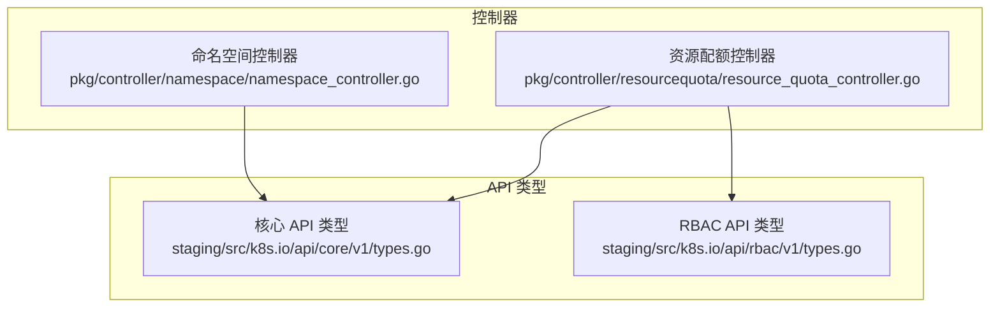
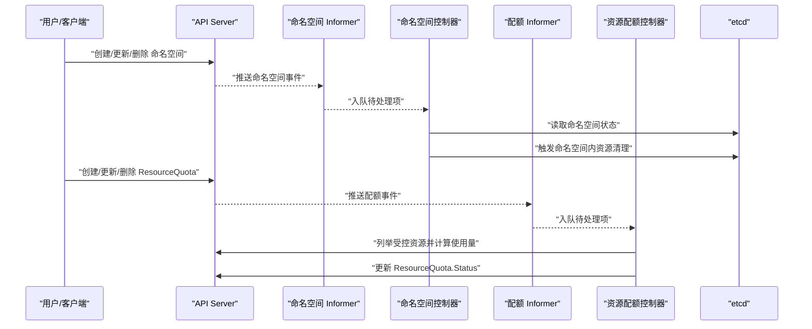
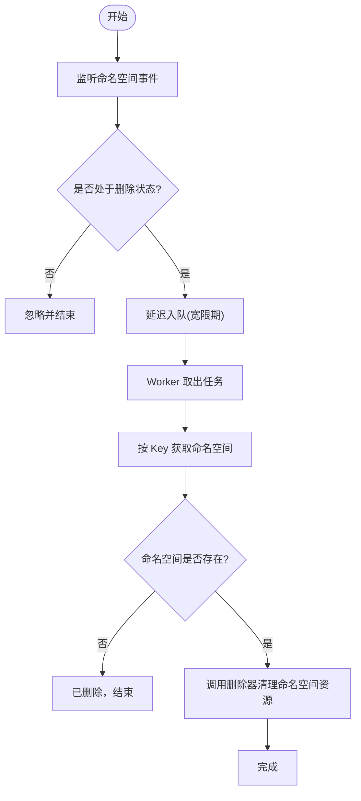
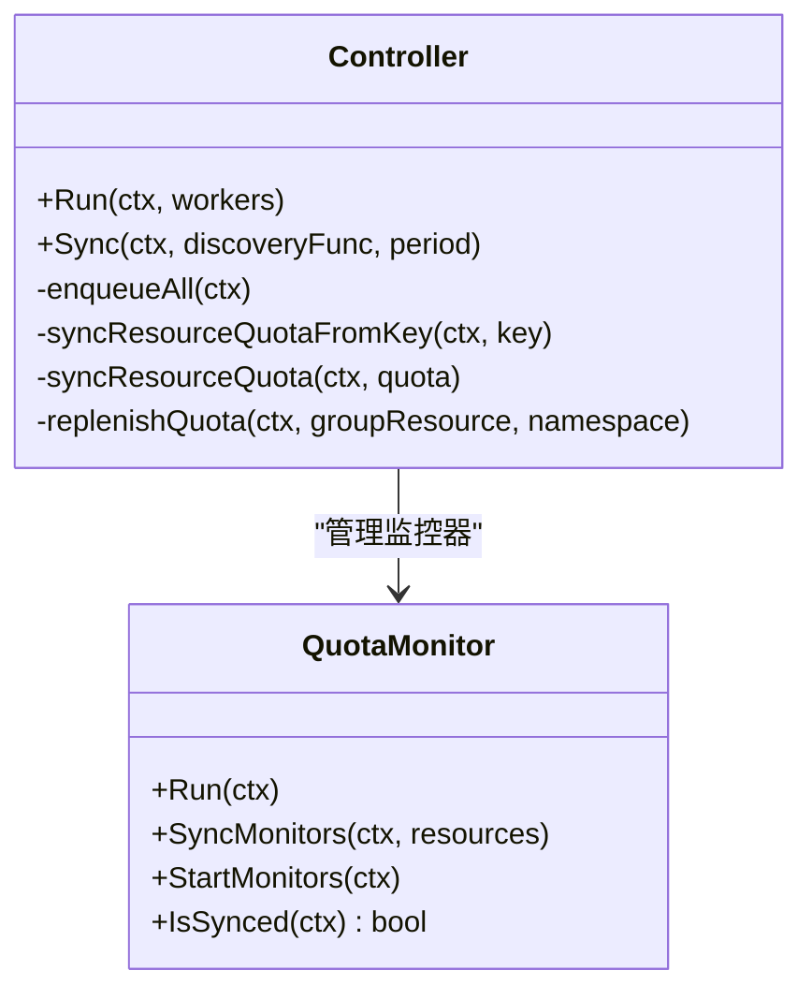
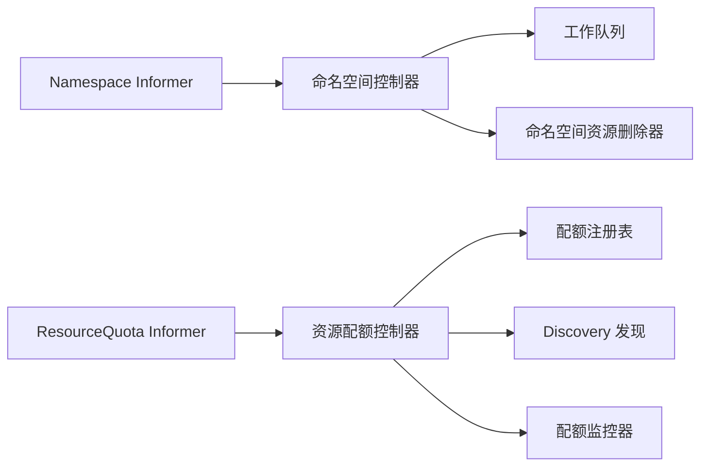

# 命名空间与隔离

<cite>
**本文引用的文件**   
- [namespace_controller.go](file://pkg/controller/namespace/namespace_controller.go)
- [resource_quota_controller.go](file://pkg/controller/resourcequota/resource_quota_controller.go)
- [types.go](file://staging/src/k8s.io/api/core/v1/types.go)
- [types.go](file://staging/src/k8s.io/api/rbac/v1/types.go)
</cite>

## 目录
1. [简介](#简介)
2. [项目结构](#项目结构)
3. [核心组件](#核心组件)
4. [架构总览](#架构总览)
5. [详细组件分析](#详细组件分析)
6. [依赖关系分析](#依赖关系分析)
7. [性能考量](#性能考量)
8. [故障排查指南](#故障排查指南)
9. [结论](#结论)
10. [附录](#附录)

## 简介
本文件围绕 Kubernetes 的命名空间与资源隔离机制，系统性阐述以下主题：
- 命名空间的概念、作用域与隔离原理
- 不同命名空间间的网络隔离策略（结合集群默认行为与可选插件）
- 资源配额限制的实现与调度影响
- RBAC 权限控制与跨命名空间访问的安全考虑
- 多租户环境下的组织策略与最佳实践
- 命名空间的创建、配置、监控与管理操作示例（以命令与清单路径指引为主）
- 命名空间范围资源与集群范围资源的区别

说明：
- 本文所有实现细节均基于仓库源码进行分析；概念性内容在不引用具体代码时不附带“章节来源”。
- 为避免泄露敏感信息，文中不直接粘贴代码片段，而是通过“章节来源”指向对应源码位置。

## 项目结构
与命名空间与隔离相关的控制器与 API 类型主要位于如下位置：
- 命名空间生命周期与清理控制器：pkg/controller/namespace
- 资源配额控制器：pkg/controller/resourcequota
- 核心 API 类型定义（Namespace、ResourceQuota 等）：staging/src/k8s.io/api/core/v1
- RBAC API 类型定义（Role、ClusterRole、RoleBinding、ClusterRoleBinding 等）：staging/src/k8s.io/api/rbac/v1

图表来源
- [namespace_controller.go:1-224](file://pkg/controller/namespace/namespace_controller.go#L1-L224)
- [resource_quota_controller.go:1-571](file://pkg/controller/resourcequota/resource_quota_controller.go#L1-L571)
- [types.go](file://staging/src/k8s.io/api/core/v1/types.go)
- [types.go](file://staging/src/k8s.io/api/rbac/v1/types.go)

章节来源
- [namespace_controller.go:1-224](file://pkg/controller/namespace/namespace_controller.go#L1-L224)
- [resource_quota_controller.go:1-571](file://pkg/controller/resourcequota/resource_quota_controller.go#L1-L571)
- [types.go](file://staging/src/k8s.io/api/core/v1/types.go)
- [types.go](file://staging/src/k8s.io/api/rbac/v1/types.go)

## 核心组件
- 命名空间控制器：负责监听命名空间删除事件，延迟处理并清理命名空间内剩余对象，确保在 HA 场景下完成最终一致性清理。
- 资源配额控制器：负责计算并更新 ResourceQuota 的使用量状态，支持动态发现可配额资源、周期性全量重算与增量补充。

章节来源
- [namespace_controller.go:53-104](file://pkg/controller/namespace/namespace_controller.go#L53-L104)
- [resource_quota_controller.go:79-191](file://pkg/controller/resourcequota/resource_quota_controller.go#L79-L191)

## 架构总览
下图展示了命名空间与资源配额在控制面中的关键交互：API Server 持久化对象，控制器通过 Informer 监听变更，工作队列驱动同步逻辑，最终写回 Status 或执行清理动作。

图表来源
- [namespace_controller.go:118-195](file://pkg/controller/namespace/namespace_controller.go#L118-L195)
- [resource_quota_controller.go:128-191](file://pkg/controller/resourcequota/resource_quota_controller.go#L128-L191)
- [resource_quota_controller.go:339-415](file://pkg/controller/resourcequota/resource_quota_controller.go#L339-L415)

## 详细组件分析

### 命名空间控制器：删除与清理流程
- 职责
  - 监听命名空间事件，仅对处于删除状态的命名空间进行入队处理。
  - 引入短暂宽限期，等待 HA 环境下其他组件观察到删除事件，避免新对象在终止中命名空间被创建。
  - 调用命名空间资源删除器，递归清理命名空间内的各类资源。
- 关键流程
  - 事件入队：过滤非删除事件，延迟入队。
  - Worker 循环：从队列取任务，按 Key 获取命名空间，委托删除器执行清理。
  - 错误重试：根据剩余资源估算时间重新入队，或使用通用速率限制器重试。
- 设计要点
  - 使用带速率限制的队列，兼顾快速回收与整体吞吐。
  - 通过 Finalizer 与删除器协作，保证命名空间最终被清空后移除 Finalizer。

图表来源
- [namespace_controller.go:118-195](file://pkg/controller/namespace/namespace_controller.go#L118-L195)

章节来源
- [namespace_controller.go:43-51](file://pkg/controller/namespace/namespace_controller.go#L43-L51)
- [namespace_controller.go:118-195](file://pkg/controller/namespace/namespace_controller.go#L118-L195)
- [namespace_controller.go:197-224](file://pkg/controller/namespace/namespace_controller.go#L197-L224)

### 资源配额控制器：计算与更新
- 职责
  - 监听 ResourceQuota 的 Spec 变更，计算各受控资源的使用量，并更新 Status。
  - 支持动态发现可配额资源，按需启动/停止监控器，周期性全量重算与增量补充。
- 关键流程
  - 事件处理：仅关注 Spec.Hard 变化；若存在缺失的使用量信息则优先入队。
  - 同步逻辑：调用配额计算引擎遍历受控资源，汇总使用量，对比差异后更新 Status。
  - 补充机制：当受控资源发生变更时，触发相关配额的重算。
- 设计要点
  - 双队列：普通队列与“缺失使用量”优先级队列，保障首次或边界情况尽快补齐。
  - 发现与监控：通过 Discovery 接口筛选具备 create/list/watch/delete 能力的资源，动态维护监控器集合。

图表来源
- [resource_quota_controller.go:79-191](file://pkg/controller/resourcequota/resource_quota_controller.go#L79-L191)
- [resource_quota_controller.go:292-337](file://pkg/controller/resourcequota/resource_quota_controller.go#L292-L337)
- [resource_quota_controller.go:339-415](file://pkg/controller/resourcequota/resource_quota_controller.go#L339-L415)
- [resource_quota_controller.go:452-521](file://pkg/controller/resourcequota/resource_quota_controller.go#L452-L521)

章节来源
- [resource_quota_controller.go:128-191](file://pkg/controller/resourcequota/resource_quota_controller.go#L128-L191)
- [resource_quota_controller.go:254-290](file://pkg/controller/resourcequota/resource_quota_controller.go#L254-L290)
- [resource_quota_controller.go:339-415](file://pkg/controller/resourcequota/resource_quota_controller.go#L339-L415)
- [resource_quota_controller.go:452-521](file://pkg/controller/resourcequota/resource_quota_controller.go#L452-L521)

### 命名空间与资源模型（API 类型）
- 命名空间（Namespace）
  - 作为所有命名空间范围资源的容器，提供作用域隔离。
  - 典型字段包括元数据、阶段（Phase）、标签与注解等。
- 资源配额（ResourceQuota）
  - 用于限制命名空间内资源的使用上限，包含硬限制（Spec.Hard）与使用量（Status.Used）。
  - 支持按 Scope/ScopeSelector 限定受控资源范围。

章节来源
- [types.go](file://staging/src/k8s.io/api/core/v1/types.go)

### RBAC 权限控制与跨命名空间访问
- 命名空间范围授权
  - Role 与 RoleBinding：在特定命名空间内授予主体对资源的访问权限。
- 集群范围授权
  - ClusterRole 与 ClusterRoleBinding：授予跨命名空间或集群范围资源的访问权限。
- 安全建议
  - 遵循最小权限原则，尽量使用 Role/RoleBinding 而非 ClusterRole/ClusterRoleBinding。
  - 对跨命名空间访问，显式声明所需权限，避免过度授权。

章节来源
- [types.go](file://staging/src/k8s.io/api/rbac/v1/types.go)

## 依赖关系分析
- 命名空间控制器依赖
  - Informer/Lister：监听 Namespace 变更，缓存加速读取。
  - 工作队列：带速率限制的任务队列，协调并发与重试。
  - 删除器：递归清理命名空间内资源，配合 Finalizer 保证最终一致。
- 资源配额控制器依赖
  - Informer/Lister：监听 ResourceQuota 变更。
  - 配额注册表：提供各资源类型的用量评估器。
  - Discovery：动态发现可配额资源，筛选具备必要动词的资源。
  - 监控器：为受控资源建立 Informer，触发配额补充计算。

图表来源
- [namespace_controller.go:65-104](file://pkg/controller/namespace/namespace_controller.go#L65-L104)
- [resource_quota_controller.go:105-191](file://pkg/controller/resourcequota/resource_quota_controller.go#L105-L191)

章节来源
- [namespace_controller.go:65-104](file://pkg/controller/namespace/namespace_controller.go#L65-L104)
- [resource_quota_controller.go:105-191](file://pkg/controller/resourcequota/resource_quota_controller.go#L105-L191)

## 性能考量
- 命名空间控制器
  - 采用指数退避与桶限流组合的速率限制器，既保证快速重试又控制整体吞吐。
  - 删除前设置宽限期，减少因 HA 复制延迟导致的重复清理或遗漏。
- 资源配额控制器
  - 双队列分离“缺失使用量”的高优先级任务，缩短首次收敛时间。
  - 周期性全量重算与增量补充相结合，平衡准确性与开销。
  - 动态监控器启停，避免不必要的 Informer 与缓存压力。

章节来源
- [namespace_controller.go:106-116](file://pkg/controller/namespace/namespace_controller.go#L106-L116)
- [resource_quota_controller.go:112-124](file://pkg/controller/resourcequota/resource_quota_controller.go#L112-L124)
- [resource_quota_controller.go:292-337](file://pkg/controller/resourcequota/resource_quota_controller.go#L292-L337)

## 故障排查指南
- 命名空间无法删除
  - 检查是否存在未清理的命名空间范围资源，查看控制器日志中的“剩余资源估算”提示。
  - 确认 Finalizer 是否正确移除，必要时手动干预残留对象。
- 配额使用量不准确
  - 观察是否触发了“缺失使用量”队列，确认首次补全是否完成。
  - 检查 Discovery 是否成功返回受控资源，以及监控器是否处于同步状态。
  - 核对 ResourceQuota 的 Scope/ScopeSelector 是否与目标资源匹配。

章节来源
- [namespace_controller.go:157-166](file://pkg/controller/namespace/namespace_controller.go#L157-L166)
- [resource_quota_controller.go:222-252](file://pkg/controller/resourcequota/resource_quota_controller.go#L222-L252)
- [resource_quota_controller.go:452-521](file://pkg/controller/resourcequota/resource_quota_controller.go#L452-L521)

## 结论
- 命名空间提供了天然的作用域隔离，配合 RBAC 可实现细粒度的权限控制。
- 资源配额控制器通过动态发现与监控机制，准确统计并限制命名空间资源使用，适合多租户场景。
- 命名空间控制器在删除流程中加入宽限期与重试策略，确保在复杂环境下的一致性清理。
- 在生产环境中，建议结合网络策略、配额与 RBAC 共同构建安全的隔离体系，并持续监控与审计。

## 附录

### 概念与最佳实践
- 命名空间概念与作用域
  - 命名空间将集群划分为多个虚拟子集群，同一命名空间内资源名唯一，跨命名空间需显式引用。
- 网络隔离策略
  - 默认情况下，Kubernetes 不强制命名空间间网络隔离；可通过 NetworkPolicy 或 CNI 插件实现隔离。
  - 在多租户场景中，建议为每个租户启用默认拒绝策略，再按需放行。
- 资源配额限制
  - 使用 ResourceQuota 限制 CPU、内存、存储、对象数量等，防止单租户耗尽集群资源。
  - 结合 LimitRange 设定默认容器资源请求与限制，提升调度稳定性。
- RBAC 权限控制
  - 优先使用 Role/RoleBinding 限定到具体命名空间；仅在必要时使用 ClusterRole/ClusterRoleBinding。
  - 定期审计权限，遵循最小权限原则。
- 多租户组织策略
  - 按团队/业务划分命名空间，统一标签规范便于治理与计费。
  - 为每个命名空间配置独立的配额、网络策略与服务账户，降低横向风险。

[本节为概念性内容，不直接分析具体文件，故无“章节来源”]

### 操作示例（命令与清单路径指引）
- 创建命名空间
  - 使用 kubectl 创建命名空间，或通过应用清单提交至 API Server。
  - 参考示例清单路径：test/testdata/pod.yaml（用于演示命名空间上下文）
- 配置资源配额
  - 在目标命名空间创建 ResourceQuota，指定硬限制与可选 Scope/ScopeSelector。
  - 参考示例清单路径：test/testdata/multi-resource-yaml.yaml（展示多资源清单的组织方式）
- 配置 RBAC
  - 在命名空间内创建 Role 与 RoleBinding，或在集群范围创建 ClusterRole 与 ClusterRoleBinding。
  - 参考 RBAC API 类型定义：staging/src/k8s.io/api/rbac/v1/types.go
- 监控与验证
  - 使用 kubectl get resourcequota --all-namespaces 查看配额使用情况。
  - 使用 kubectl describe namespace <name> 查看命名空间状态与事件。
  - 使用 kubectl auth can-i --list --namespace <ns> 验证当前主体的权限。

[本节为操作指引，不直接分析具体文件，故无“章节来源”]