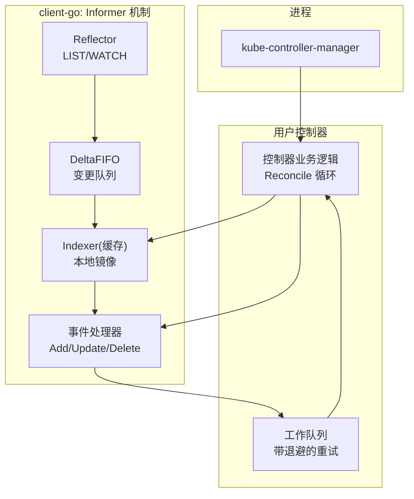
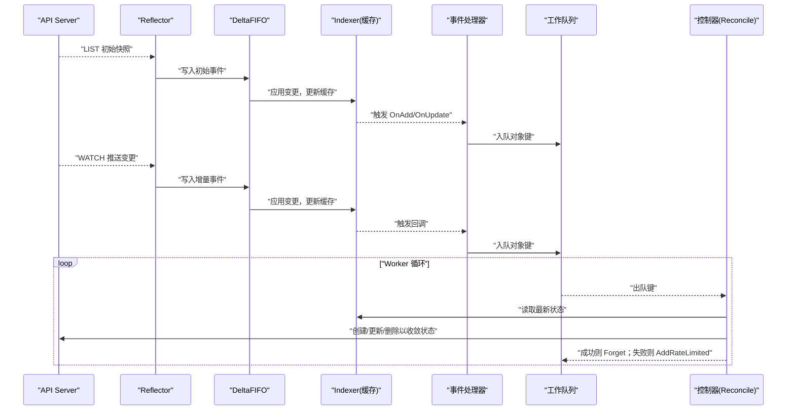
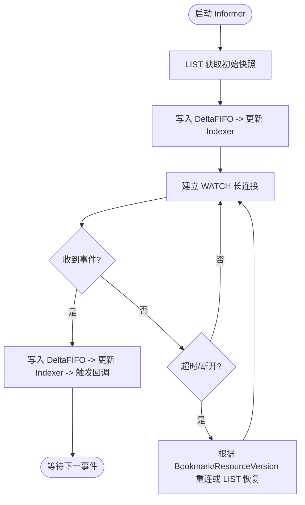
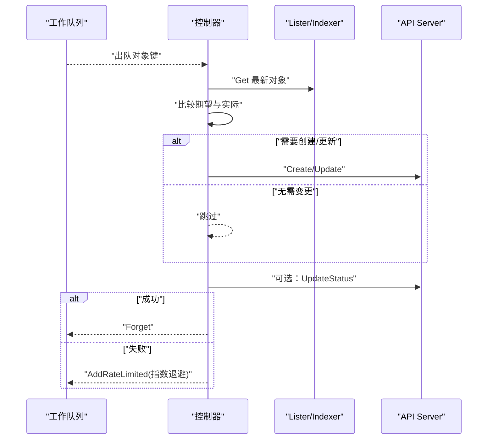
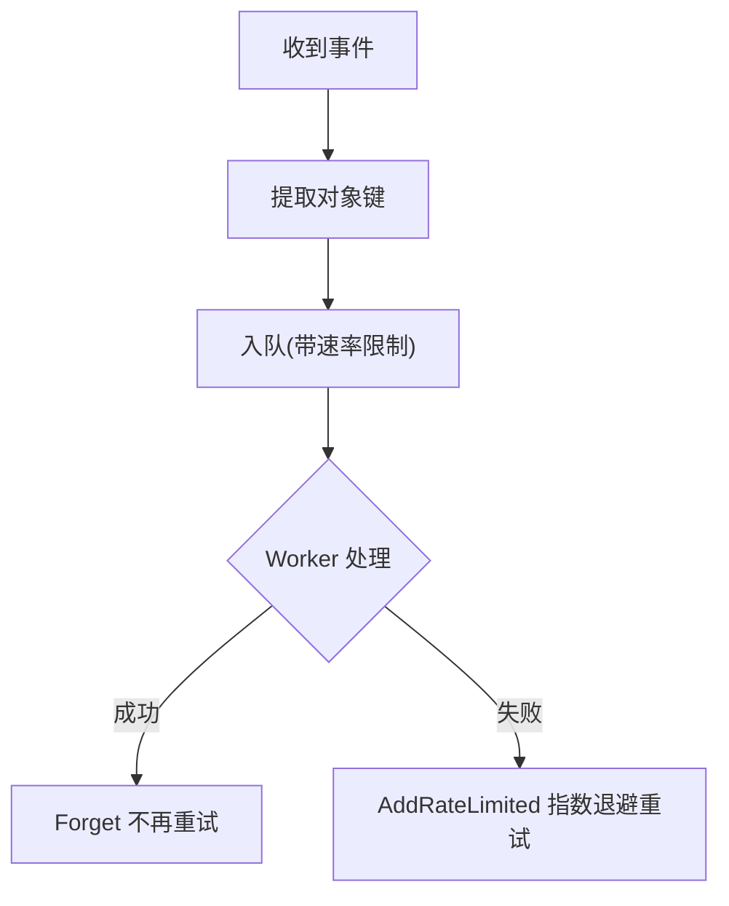
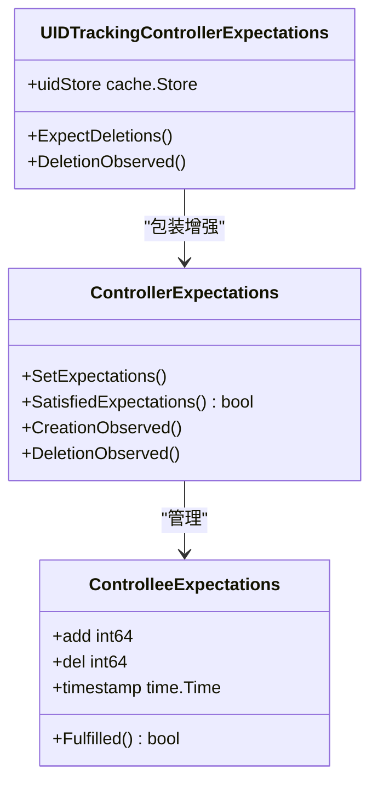
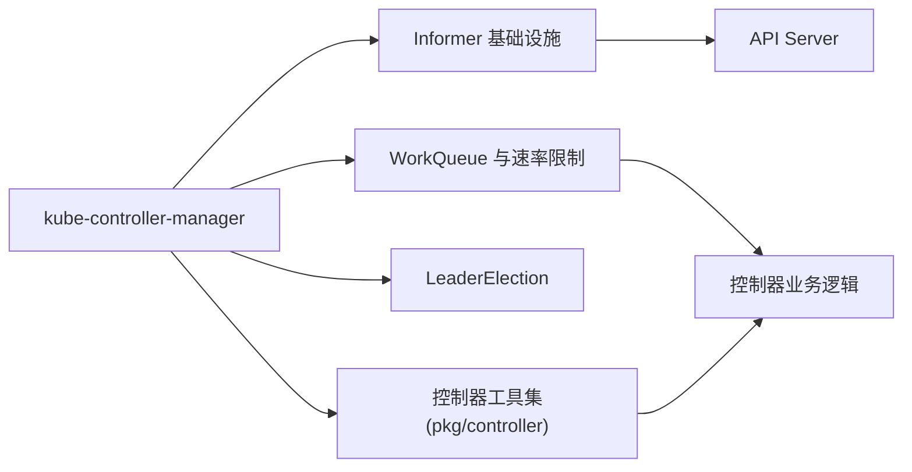

# 控制器模式

<cite>
**本文引用的文件**   
- [controller-manager.go](file://cmd/kube-controller-manager/controller-manager.go)
- [controller_utils.go](file://pkg/controller/controller_utils.go)
- [controller.go](file://staging/src/k8s.io/client-go/tools/cache/controller.go)
- [ARCHITECTURE.md](file://staging/src/k8s.io/client-go/ARCHITECTURE.md)
- [controller-client-go.md](file://staging/src/k8s.io/sample-controller/docs/controller-client-go.md)
- [controller.go](file://staging/src/k8s.io/sample-controller/controller.go)
- [kubernetes-internals-deep-dive.md](file://docs/kubernetes-internals-deep-dive.md)
</cite>

## 目录
1. [简介](#简介)
2. [项目结构](#项目结构)
3. [核心组件](#核心组件)
4. [架构总览](#架构总览)
5. [详细组件分析](#详细组件分析)
6. [依赖关系分析](#依赖关系分析)
7. [性能考量](#性能考量)
8. [故障排查指南](#故障排查指南)
9. [结论](#结论)
10. [附录](#附录)

## 简介
本文件面向 Kubernetes 控制器模式的系统性文档，围绕“期望状态与实际状态的收敛”这一核心思想，深入解析 Informer 机制、Reconcile 循环、事件处理与错误重试，并提供自定义控制器的开发指南与最佳实践。内容基于仓库中的 client-go 控制器基础设施、内置控制器工具集以及 sample-controller 示例进行归纳与提炼。

## 项目结构
- 入口进程：kube-controller-manager 作为控制器管理器，负责启动并协调多个内置控制器。
- 控制器基础设施：client-go tools/cache 提供 Reflector、DeltaFIFO、Indexer、Informer 等核心能力，支撑所有控制器的数据同步与事件分发。
- 控制器工具集：pkg/controller 提供通用工具（如期望管理、Pod/RS 操作封装、排序与选择策略等）。
- 示例控制器：sample-controller 演示如何基于 Informer + WorkQueue 构建自定义控制器。

图表来源
- [controller.go:169-209](file://staging/src/k8s.io/client-go/tools/cache/controller.go#L169-L209)
- [ARCHITECTURE.md:89-132](file://staging/src/k8s.io/client-go/ARCHITECTURE.md#L89-L132)

章节来源
- [controller-manager.go:17-39](file://cmd/kube-controller-manager/controller-manager.go#L17-L39)
- [ARCHITECTURE.md:89-132](file://staging/src/k8s.io/client-go/ARCHITECTURE.md#L89-L132)

## 核心组件
- 期望状态与实际状态收敛
  - 控制器通过比较期望状态（Spec）与实际状态（Status/集群资源现状），驱动 API Server 执行必要的创建、更新或删除，使实际状态收敛到期望状态。
- Informer 机制
  - Reflector 负责 LIST/WATCH；DeltaFIFO 聚合变更；Indexer 维护本地缓存；EventHandler 将对象键入工作队列。
- Reconcile 循环
  - 从工作队列取出对象键，读取缓存获取最新状态，计算差异并调用 API 修正，必要时更新 Status。
- 事件处理与重试
  - 事件仅入队，不直接处理；失败项按指数退避重新入队，避免风暴与阻塞 Watch。
- 高可用与并发
  - 使用 LeaderElection 保证单写者语义；多 Worker 并行消费队列。

章节来源
- [ARCHITECTURE.md:133-146](file://staging/src/k8s.io/client-go/ARCHITECTURE.md#L133-L146)
- [controller-client-go.md:39-64](file://staging/src/k8s.io/sample-controller/docs/controller-client-go.md#L39-L64)

## 架构总览
下图展示了从 API Server 到控制器业务处理的完整链路，包括缓存同步、事件分发与重连恢复。

图表来源
- [controller.go:169-209](file://staging/src/k8s.io/client-go/tools/cache/controller.go#L169-L209)
- [controller.go:607-665](file://staging/src/k8s.io/client-go/tools/cache/controller.go#L607-L665)
- [ARCHITECTURE.md:89-132](file://staging/src/k8s.io/client-go/ARCHITECTURE.md#L89-L132)

## 详细组件分析

### Informer 机制与缓存同步
- Reflector 负责 LIST 全量快照与 WATCH 增量流，支持 Bookmark 提升 re-list 效率，并在 resourceVersion 过旧时自动回退为 LIST 恢复一致性。
- DeltaFIFO 对事件去重与顺序化，确保 Store 的原子性更新。
- Indexer 提供线程安全的本地缓存与索引查询，Lister 暴露只读接口供控制器读取。
- Resync 周期可配置，用于补偿丢失事件或周期性校验外部依赖。

图表来源
- [controller.go:169-209](file://staging/src/k8s.io/client-go/tools/cache/controller.go#L169-L209)
- [controller.go:607-665](file://staging/src/k8s.io/client-go/tools/cache/controller.go#L607-L665)
- [kubernetes-internals-deep-dive.md:84-134](file://docs/kubernetes-internals-deep-dive.md#L84-L134)

章节来源
- [controller.go:169-209](file://staging/src/k8s.io/client-go/tools/cache/controller.go#L169-L209)
- [kubernetes-internals-deep-dive.md:84-134](file://docs/kubernetes-internals-deep-dive.md#L84-L134)

### Reconcile 循环与状态比较
- 典型流程：从工作队列取键 -> 从 Lister/Indexer 读取最新对象 -> 对比期望与实际 -> 调用 API 修正 -> 更新 Status -> 成功则 Forget，失败则带退避重新入队。
- 示例控制器展示了如何处理 OwnerReference 关联、创建/更新 Deployment、更新 Foo 的 Status 子资源。

图表来源
- [controller.go:190-312](file://staging/src/k8s.io/sample-controller/controller.go#L190-L312)

章节来源
- [controller.go:190-312](file://staging/src/k8s.io/sample-controller/controller.go#L190-L312)
- [controller-client-go.md:39-64](file://staging/src/k8s.io/sample-controller/docs/controller-client-go.md#L39-L64)

### 事件处理与错误重试
- 事件处理器仅做轻量转换（提取对象键）并入队，避免在事件路径中执行耗时逻辑。
- 工作队列采用速率限制器组合（指数失败退避 + 桶限流），防止热点对象导致失控重试。
- 失败处理统一上报并记录，便于监控告警。

图表来源
- [controller.go:200-236](file://staging/src/k8s.io/sample-controller/controller.go#L200-L236)
- [controller.go:110-124](file://staging/src/k8s.io/sample-controller/controller.go#L110-L124)

章节来源
- [controller.go:200-236](file://staging/src/k8s.io/sample-controller/controller.go#L200-L236)
- [controller.go:110-124](file://staging/src/k8s.io/sample-controller/controller.go#L110-L124)

### 期望管理与优雅删除
- 期望（Expectations）机制用于抑制不必要的同步：在批量创建/删除前设置期望，待观察到对应事件后再触发 sync，避免抖动与重复操作。
- UIDTrackingControllerExpectations 跟踪被删除对象的 UID，配合优雅删除（DeletionTimestamp）避免重复计数。

图表来源
- [controller_utils.go:128-316](file://pkg/controller/controller_utils.go#L128-L316)
- [controller_utils.go:334-410](file://pkg/controller/controller_utils.go#L334-L410)

章节来源
- [controller_utils.go:128-316](file://pkg/controller/controller_utils.go#L128-L316)
- [controller_utils.go:334-410](file://pkg/controller/controller_utils.go#L334-L410)

### 控制器框架与示例
- 示例控制器展示了：
  - 初始化 EventBroadcaster/Recorder
  - 注册 Foo 与 Deployment 的事件处理器
  - 等待缓存同步后启动多 Worker
  - 在 syncHandler 中实现期望与实际收敛
  - 使用 FieldManager 标记字段所有权
- 该示例可作为自定义控制器的参考模板。

章节来源
- [controller.go:92-156](file://staging/src/k8s.io/sample-controller/controller.go#L92-L156)
- [controller.go:162-188](file://staging/src/k8s.io/sample-controller/controller.go#L162-L188)
- [controller.go:241-312](file://staging/src/k8s.io/sample-controller/controller.go#L241-L312)

## 依赖关系分析
- kube-controller-manager 作为进程入口，加载并运行各内置控制器。
- 控制器依赖 client-go 的 Informer/WorkQueue/LeaderElection 等基础设施。
- 内置控制器复用 pkg/controller 的工具集（期望管理、Pod/RS 控制封装等）。

图表来源
- [controller-manager.go:17-39](file://cmd/kube-controller-manager/controller-manager.go#L17-L39)
- [ARCHITECTURE.md:133-146](file://staging/src/k8s.io/client-go/ARCHITECTURE.md#L133-L146)

章节来源
- [controller-manager.go:17-39](file://cmd/kube-controller-manager/controller-manager.go#L17-L39)
- [ARCHITECTURE.md:133-146](file://staging/src/k8s.io/client-go/ARCHITECTURE.md#L133-L146)

## 性能考量
- 事件与处理解耦：事件仅入队，避免阻塞 Watch 通道。
- 速率限制：组合指数失败退避与桶限流，保护 API Server 与控制器自身。
- 批量处理：在特性门控开启时，Informer 支持批处理 deltas，减少回调开销。
- 缓存优先：控制器读取均走本地缓存，降低 API 压力。
- 合理 Resync：仅在必要时启用周期性 resync，避免无意义同步风暴。

章节来源
- [ARCHITECTURE.md:89-132](file://staging/src/k8s.io/client-go/ARCHITECTURE.md#L89-L132)
- [controller.go:236-261](file://staging/src/k8s.io/client-go/tools/cache/controller.go#L236-L261)
- [controller.go:110-124](file://staging/src/k8s.io/sample-controller/controller.go#L110-L124)

## 故障排查指南
- Watch 断链与重连
  - 现象：Watch 断开、resourceVersion 过旧。
  - 行为：Reflector 自动 relist 或使用 Bookmark 快速恢复。
  - 建议：关注 LastSyncResourceVersion 指标与日志，确认是否频繁重连。
- 事件丢失与最终一致
  - 现象：错过 Delete 事件。
  - 行为：EventHandler 可能收到 DeletedFinalStateUnknown，需安全处理。
  - 建议：在事件处理器中对 tombstone 类型进行兼容处理。
- 过度重试与热点对象
  - 现象：某对象持续失败导致队列堆积。
  - 行为：AddRateLimited 会指数退避，但仍需关注热点。
  - 建议：检查业务逻辑幂等性与错误分类，必要时引入分片或隔离队列。
- 期望未满足导致长时间不触发 sync
  - 现象：设置了期望但观察不到对应事件。
  - 行为：TTL 过期后会强制触发一次 sync。
  - 建议：核对期望设置与观察点是否匹配，避免误用 KeyFunc 跨类型冲突。

章节来源
- [controller.go:169-209](file://staging/src/k8s.io/client-go/tools/cache/controller.go#L169-L209)
- [controller.go:607-665](file://staging/src/k8s.io/client-go/tools/cache/controller.go#L607-L665)
- [controller_utils.go:128-227](file://pkg/controller/controller_utils.go#L128-L227)

## 结论
Kubernetes 控制器模式通过“事件驱动的本地缓存 + 工作队列 + Reconcile 循环”实现了高可靠的状态收敛。client-go 的基础设施提供了健壮的数据同步与错误恢复能力，而内置工具与示例控制器为开发者提供了清晰的范式与最佳实践。遵循本文档的建议，可在保证稳定性的前提下高效扩展集群能力。

## 附录
- 自定义控制器开发步骤（要点）
  - 定义 CRD 与类型，生成 Client/Lister/Informer。
  - 创建控制器实例，注入 KubeClient 与 SampleClient。
  - 注册事件处理器，将对象键入带速率限制的队列。
  - 启动多 Worker 循环，实现 syncHandler 完成期望与实际收敛。
  - 使用 UpdateStatus 更新状态子资源，记录事件与指标。
  - 结合 LeaderElection 实现高可用部署。

章节来源
- [controller-client-go.md:39-64](file://staging/src/k8s.io/sample-controller/docs/controller-client-go.md#L39-L64)
- [controller.go:92-156](file://staging/src/k8s.io/sample-controller/controller.go#L92-L156)
- [controller.go:162-188](file://staging/src/k8s.io/sample-controller/controller.go#L162-L188)
- [controller.go:241-312](file://staging/src/k8s.io/sample-controller/controller.go#L241-L312)