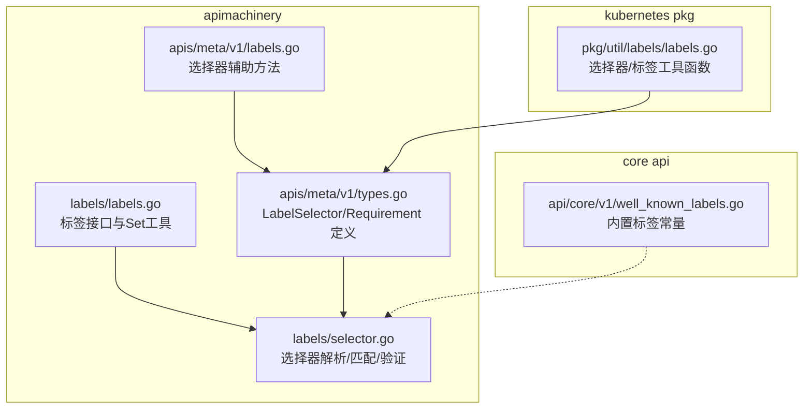
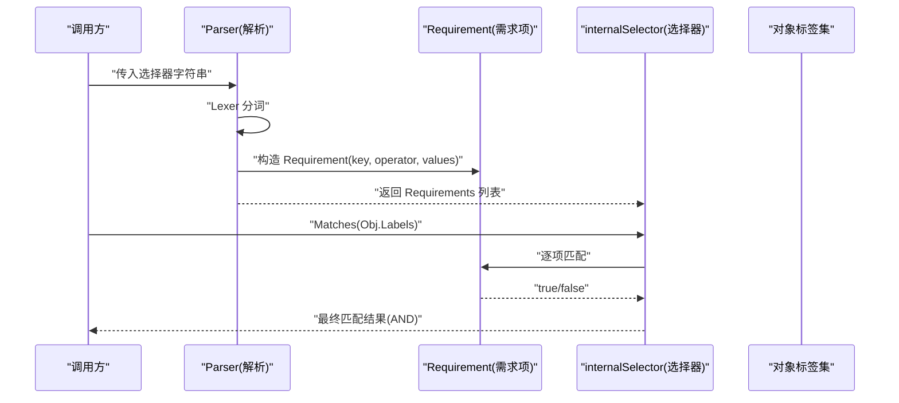
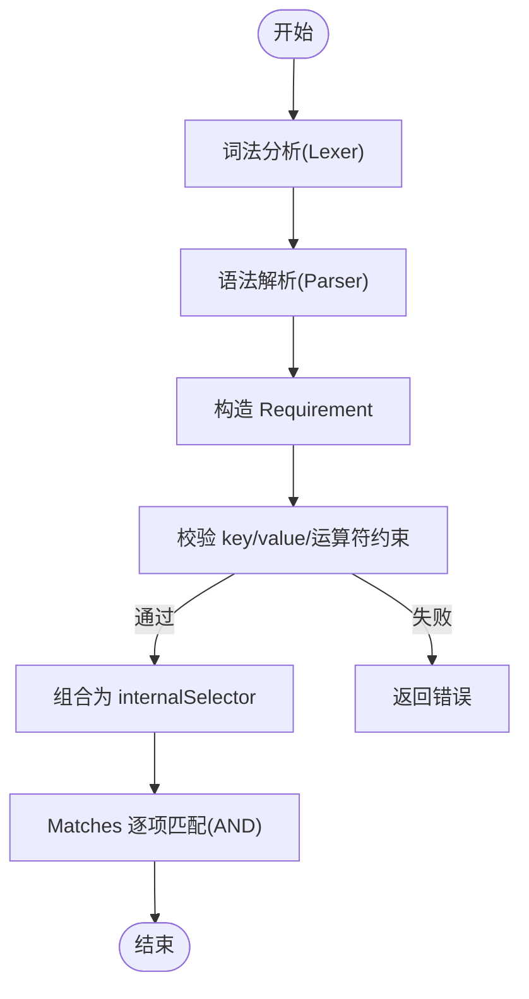
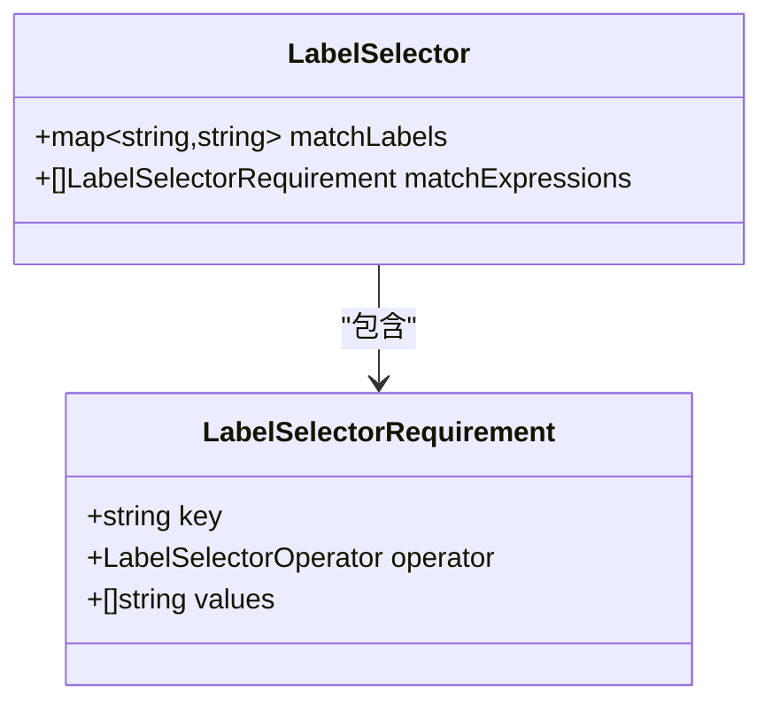
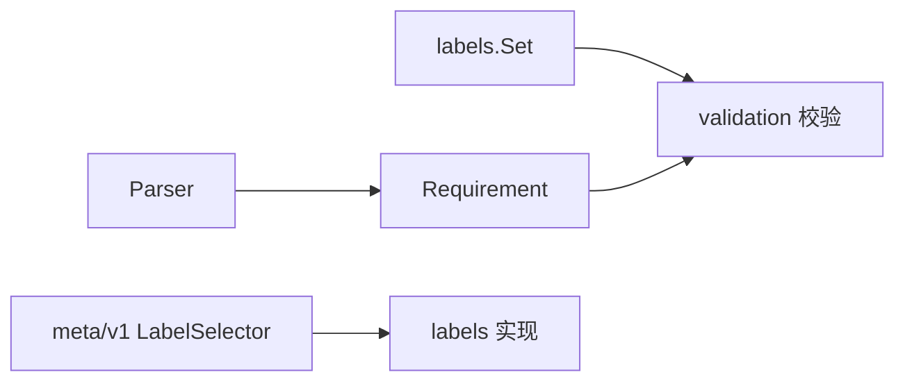

# 标签与选择器

<cite>
**本文引用的文件**   
- [staging/src/k8s.io/apimachinery/pkg/labels/labels.go](file://staging/src/k8s.io/apimachinery/pkg/labels/labels.go)
- [staging/src/k8s.io/apimachinery/pkg/labels/selector.go](file://staging/src/k8s.io/apimachinery/pkg/labels/selector.go)
- [staging/src/k8s.io/apimachinery/pkg/apis/meta/v1/types.go](file://staging/src/k8s.io/apimachinery/pkg/apis/meta/v1/types.go)
- [staging/src/k8s.io/apimachinery/pkg/apis/meta/v1/labels.go](file://staging/src/k8s.io/apimachinery/pkg/apis/meta/v1/labels.go)
- [pkg/util/labels/labels.go](file://pkg/util/labels/labels.go)
- [staging/src/k8s.io/api/core/v1/well_known_labels.go](file://staging/src/k8s.io/api/core/v1/well_known_labels.go)
</cite>

## 目录
1. [简介](#简介)
2. [项目结构](#项目结构)
3. [核心组件](#核心组件)
4. [架构总览](#架构总览)
5. [详细组件分析](#详细组件分析)
6. [依赖关系分析](#依赖关系分析)
7. [性能考虑](#性能考虑)
8. [故障排查指南](#故障排查指南)
9. [结论](#结论)
10. [附录](#附录)

## 简介
本文件系统性阐述 Kubernetes 的标签（Labels）与选择器（Selectors）机制，覆盖定义规范、命名约定、使用模式、选择器语法（等值匹配、集合操作、比较操作）、在资源对象中的典型用法（如 Deployment、Service 等），以及性能影响与查询优化策略。文档基于源码仓库中 apimachinery 与 core API 的实现进行提炼，确保内容准确可追溯。

## 项目结构
围绕标签与选择器的关键代码主要分布在以下位置：
- 标签接口与基础工具：apimachinery/pkg/labels
- 结构化选择器类型定义：apimachinery/pkg/apis/meta/v1
- 常用内置标签常量：api/core/v1
- 选择器解析与匹配实现：apimachinery/pkg/labels/selector.go
- 便捷工具函数：pkg/util/labels

图表来源
- [staging/src/k8s.io/apimachinery/pkg/labels/labels.go:27-102](file://staging/src/k8s.io/apimachinery/pkg/labels/labels.go#L27-L102)
- [staging/src/k8s.io/apimachinery/pkg/labels/selector.go:63-90](file://staging/src/k8s.io/apimachinery/pkg/labels/selector.go#L63-L90)
- [staging/src/k8s.io/apimachinery/pkg/apis/meta/v1/types.go:1338-1376](file://staging/src/k8s.io/apimachinery/pkg/apis/meta/v1/types.go#L1338-L1376)
- [staging/src/k8s.io/apimachinery/pkg/apis/meta/v1/labels.go:19-56](file://staging/src/k8s.io/apimachinery/pkg/apis/meta/v1/labels.go#L19-L56)
- [staging/src/k8s.io/api/core/v1/well_known_labels.go:19-74](file://staging/src/k8s.io/api/core/v1/well_known_labels.go#L19-L74)
- [pkg/util/labels/labels.go:23-125](file://pkg/util/labels/labels.go#L23-L125)

章节来源
- [staging/src/k8s.io/apimachinery/pkg/labels/labels.go:27-102](file://staging/src/k8s.io/apimachinery/pkg/labels/labels.go#L27-L102)
- [staging/src/k8s.io/apimachinery/pkg/labels/selector.go:63-90](file://staging/src/k8s.io/apimachinery/pkg/labels/selector.go#L63-L90)
- [staging/src/k8s.io/apimachinery/pkg/apis/meta/v1/types.go:1338-1376](file://staging/src/k8s.io/apimachinery/pkg/apis/meta/v1/types.go#L1338-L1376)
- [staging/src/k8s.io/apimachinery/pkg/apis/meta/v1/labels.go:19-56](file://staging/src/k8s.io/apimachinery/pkg/apis/meta/v1/labels.go#L19-L56)
- [staging/src/k8s.io/api/core/v1/well_known_labels.go:19-74](file://staging/src/k8s.io/api/core/v1/well_known_labels.go#L19-L74)
- [pkg/util/labels/labels.go:23-125](file://pkg/util/labels/labels.go#L23-L125)

## 核心组件
- 标签接口与集合
  - Labels 接口提供 Has/Get/Lookup 能力；Set 是 map[string]string 的便捷实现，支持 AsSelector/AsValidatedSelector/AsSelectorPreValidated 等方法。
- 选择器抽象与实现
  - Selector 接口定义 Matches/Empty/String/Add/Requirements/DeepCopySelector/RequiresExactMatch；internalSelector 为内部实现，由一组 Requirement 组成。
- 结构化选择器类型
  - LabelSelector 包含 matchLabels 与 matchExpressions；LabelSelectorRequirement 描述 key/operator/values 三元组。
- 选择器解析与匹配
  - 支持词法分析、语法解析生成 Requirement 列表；匹配时按 AND 语义组合各 Requirement。
- 内置标签常量
  - 提供 kubernetes.io/*、topology.kubernetes.io/*、node.kubernetes.io/* 等常用键名常量。

章节来源
- [staging/src/k8s.io/apimachinery/pkg/labels/labels.go:27-102](file://staging/src/k8s.io/apimachinery/pkg/labels/labels.go#L27-L102)
- [staging/src/k8s.io/apimachinery/pkg/labels/selector.go:63-90](file://staging/src/k8s.io/apimachinery/pkg/labels/selector.go#L63-L90)
- [staging/src/k8s.io/apimachinery/pkg/apis/meta/v1/types.go:1338-1376](file://staging/src/k8s.io/apimachinery/pkg/apis/meta/v1/types.go#L1338-L1376)
- [staging/src/k8s.io/api/core/v1/well_known_labels.go:19-74](file://staging/src/k8s.io/api/core/v1/well_known_labels.go#L19-L74)

## 架构总览
选择器从字符串到匹配的全链路如下：
- 输入字符串经 Lexer 分词、Parser 解析为 Requirements
- 每个 Requirement 校验 key/value 合法性并构造
- internalSelector 将多个 Requirement 以 AND 组合
- 通过 Matches 对目标对象的 Labels 进行判定

图表来源
- [staging/src/k8s.io/apimachinery/pkg/labels/selector.go:689-746](file://staging/src/k8s.io/apimachinery/pkg/labels/selector.go#L689-L746)
- [staging/src/k8s.io/apimachinery/pkg/labels/selector.go:247-294](file://staging/src/k8s.io/apimachinery/pkg/labels/selector.go#L247-L294)
- [staging/src/k8s.io/apimachinery/pkg/labels/selector.go:419-426](file://staging/src/k8s.io/apimachinery/pkg/labels/selector.go#L419-L426)

## 详细组件分析

### 标签定义与命名规范
- 键名与值验证
  - 键名长度与字符序列需满足规则；值也受限于长度与字符集。
  - 转换与验证入口包括 ConvertSelectorToLabelsMap、NewRequirement 等。
- 常见键名前缀
  - 系统保留前缀示例：kubernetes.io、topology.kubernetes.io、node.kubernetes.io、kubelet.kubernetes.io、node-restriction.kubernetes.io 等。
- 最佳实践
  - 使用稳定前缀区分用途；避免过长键名与值；为不同维度（应用、环境、版本、拓扑）建立统一命名约定。

章节来源
- [staging/src/k8s.io/apimachinery/pkg/labels/labels.go:157-183](file://staging/src/k8s.io/apimachinery/pkg/labels/labels.go#L157-L183)
- [staging/src/k8s.io/apimachinery/pkg/labels/selector.go:185-224](file://staging/src/k8s.io/apimachinery/pkg/labels/selector.go#L185-L224)
- [staging/src/k8s.io/api/core/v1/well_known_labels.go:19-74](file://staging/src/k8s.io/api/core/v1/well_known_labels.go#L19-L74)

### 选择器语法与语义
- 支持的运算符
  - 集合类：in、notin
  - 等值类：=、==、!=
  - 存在性：exists、!exists
  - 数值比较：>、<（要求值为整数）
- 语法要点
  - 多条件以逗号分隔，整体为 AND 语义
  - in/notin 后跟括号内逗号分隔的值列表
  - >、< 仅接受单个整数值
- 解析流程
  - Lexer 识别关键字与标识符
  - Parser 构建 Requirement 列表
  - NewRequirement 执行严格校验

图表来源
- [staging/src/k8s.io/apimachinery/pkg/labels/selector.go:689-746](file://staging/src/k8s.io/apimachinery/pkg/labels/selector.go#L689-L746)
- [staging/src/k8s.io/apimachinery/pkg/labels/selector.go:247-294](file://staging/src/k8s.io/apimachinery/pkg/labels/selector.go#L247-L294)

章节来源
- [staging/src/k8s.io/apimachinery/pkg/labels/selector.go:35-45](file://staging/src/k8s.io/apimachinery/pkg/labels/selector.go#L35-L45)
- [staging/src/k8s.io/apimachinery/pkg/labels/selector.go:185-224](file://staging/src/k8s.io/apimachinery/pkg/labels/selector.go#L185-L224)
- [staging/src/k8s.io/apimachinery/pkg/labels/selector.go:689-746](file://staging/src/k8s.io/apimachinery/pkg/labels/selector.go#L689-L746)

### 结构化选择器类型（LabelSelector）
- 字段说明
  - matchLabels：键值对映射，等价于多条 in 表达式
  - matchExpressions：显式表达式列表，支持 In/NotIn/Exists/DoesNotExist
  - 两者之间为 AND 关系
- 辅助方法
  - CloneSelectorAndAddLabel、AddLabelToSelector、SelectorHasLabel 等便于构造与检查

图表来源
- [staging/src/k8s.io/apimachinery/pkg/apis/meta/v1/types.go:1338-1376](file://staging/src/k8s.io/apimachinery/pkg/apis/meta/v1/types.go#L1338-L1376)
- [staging/src/k8s.io/apimachinery/pkg/apis/meta/v1/labels.go:19-56](file://staging/src/k8s.io/apimachinery/pkg/apis/meta/v1/labels.go#L19-L56)

章节来源
- [staging/src/k8s.io/apimachinery/pkg/apis/meta/v1/types.go:1338-1376](file://staging/src/k8s.io/apimachinery/pkg/apis/meta/v1/types.go#L1338-L1376)
- [staging/src/k8s.io/apimachinery/pkg/apis/meta/v1/labels.go:19-56](file://staging/src/k8s.io/apimachinery/pkg/apis/meta/v1/labels.go#L19-L56)

### 选择器在各资源中的使用示例
- Deployment
  - spec.selector.matchLabels/matchExpressions 用于选择 PodTemplate 生成的 Pod
- Service
  - spec.selector 用于选择后端 Pod
- 其他控制器
  - ReplicaSet、StatefulSet、DaemonSet、Job/CronJob 等均通过 selector 关联工作负载与 Pod

提示：具体 YAML 字段请参考对应资源的 API 定义与示例清单。

章节来源
- [staging/src/k8s.io/apimachinery/pkg/apis/meta/v1/types.go:1338-1376](file://staging/src/k8s.io/apimachinery/pkg/apis/meta/v1/types.go#L1338-L1376)

### 标签设计模式与最佳实践
- 应用分层
  - 使用 app.kubernetes.io/* 系列键（若团队采用该约定）或自定义前缀，表达应用、组件、子系统等层次
- 环境标识
  - 使用 env=prod/staging/dev 等键，配合拓扑标签进行隔离
- 版本管理
  - 使用 version=v1.2.3 或 semver 风格，结合滚动更新策略
- 拓扑与调度
  - 使用 topology.kubernetes.io/zone、topology.kubernetes.io/region 等内置标签进行亲和性调度
- 稳定性与兼容性
  - 优先使用稳定前缀（如 node.kubernetes.io/*、kubernetes.io/*），谨慎使用已弃用前缀

章节来源
- [staging/src/k8s.io/api/core/v1/well_known_labels.go:19-74](file://staging/src/k8s.io/api/core/v1/well_known_labels.go#L19-L74)

## 依赖关系分析
- 组件耦合
  - labels.Set 依赖 validation 进行键值校验
  - selector 解析依赖 selection.Operator 与 validation 包
  - meta/v1 的类型被上层控制器广泛消费
- 外部依赖
  - 校验逻辑来自 validation 包；集合操作使用 sets.String

图表来源
- [staging/src/k8s.io/apimachinery/pkg/labels/labels.go:157-183](file://staging/src/k8s.io/apimachinery/pkg/labels/labels.go#L157-L183)
- [staging/src/k8s.io/apimachinery/pkg/labels/selector.go:185-224](file://staging/src/k8s.io/apimachinery/pkg/labels/selector.go#L185-L224)
- [staging/src/k8s.io/apimachinery/pkg/apis/meta/v1/types.go:1338-1376](file://staging/src/k8s.io/apimachinery/pkg/apis/meta/v1/types.go#L1338-L1376)

章节来源
- [staging/src/k8s.io/apimachinery/pkg/labels/labels.go:157-183](file://staging/src/k8s.io/apimachinery/pkg/labels/labels.go#L157-L183)
- [staging/src/k8s.io/apimachinery/pkg/labels/selector.go:185-224](file://staging/src/k8s.io/apimachinery/pkg/labels/selector.go#L185-L224)
- [staging/src/k8s.io/apimachinery/pkg/apis/meta/v1/types.go:1338-1376](file://staging/src/k8s.io/apimachinery/pkg/apis/meta/v1/types.go#L1338-L1376)

## 性能考虑
- 预校验与快速路径
  - AsSelectorPreValidated 假设已校验，减少重复校验开销，适合高吞吐路径
- 空选择器优化
  - Everything()/Nothing() 共享实例，避免分配
- 匹配复杂度
  - internalSelector.Matches 对每条 Requirement 顺序匹配，整体为 O(n)；建议精简选择器条目
- 值集合大小
  - in/notin 的值列表越大，hasValue 线性扫描成本越高；尽量控制集合规模或使用更精确的选择器

章节来源
- [staging/src/k8s.io/apimachinery/pkg/labels/labels.go:71-93](file://staging/src/k8s.io/apimachinery/pkg/labels/labels.go#L71-L93)
- [staging/src/k8s.io/apimachinery/pkg/labels/selector.go:95-118](file://staging/src/k8s.io/apimachinery/pkg/labels/selector.go#L95-L118)
- [staging/src/k8s.io/apimachinery/pkg/labels/selector.go:419-426](file://staging/src/k8s.io/apimachinery/pkg/labels/selector.go#L419-L426)
- [staging/src/k8s.io/apimachinery/pkg/labels/selector.go:227-234](file://staging/src/k8s.io/apimachinery/pkg/labels/selector.go#L227-L234)

## 故障排查指南
- 常见解析错误
  - 非法运算符或缺少值列表（如 in/notin 为空）
  - >、< 的值非整数
  - 键名或值不符合长度/字符集限制
- 定位方法
  - 查看选择器字符串是否合法
  - 确认运算符与值的数量约束
  - 使用 SelectorHasLabel 等工具检查 matchLabels 是否包含预期键
- 兼容性与弃用
  - 注意部分旧前缀已弃用，迁移至稳定前缀以避免未来不兼容

章节来源
- [staging/src/k8s.io/apimachinery/pkg/labels/selector.go:185-224](file://staging/src/k8s.io/apimachinery/pkg/labels/selector.go#L185-L224)
- [staging/src/k8s.io/apimachinery/pkg/labels/selector.go:761-771](file://staging/src/k8s.io/apimachinery/pkg/labels/selector.go#L761-L771)
- [staging/src/k8s.io/apimachinery/pkg/apis/meta/v1/labels.go:52-56](file://staging/src/k8s.io/apimachinery/pkg/apis/meta/v1/labels.go#L52-L56)
- [staging/src/k8s.io/api/core/v1/well_known_labels.go:29-40](file://staging/src/k8s.io/api/core/v1/well_known_labels.go#L29-L40)

## 结论
Kubernetes 的标签与选择器体系以强校验、可扩展的解析器和高效的匹配实现为核心。通过合理的命名约定、稳定的前缀与简洁的选择器设计，可以在保证正确性的同时获得良好的性能表现。建议在工程实践中遵循内置标签前缀与团队统一的命名规范，并在高频路径中使用预校验与最小化选择器以提升效率。

## 附录
- 工具函数速查
  - CloneAndAddLabel/CloneAndRemoveLabel：安全克隆并增删标签
  - AddLabelToSelector/CloneSelectorAndAddLabel：向选择器追加键值
  - SelectorHasLabel：判断选择器是否包含某键
- 参考路径
  - [pkg/util/labels/labels.go](file://pkg/util/labels/labels.go)

章节来源
- [pkg/util/labels/labels.go:23-125](file://pkg/util/labels/labels.go#L23-L125)