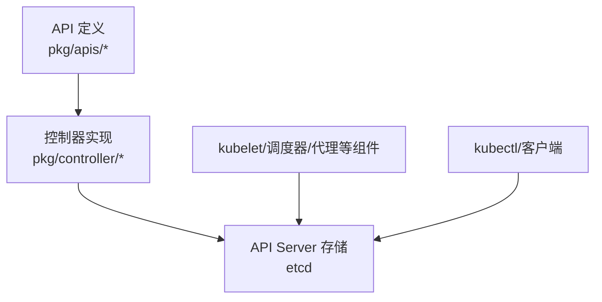
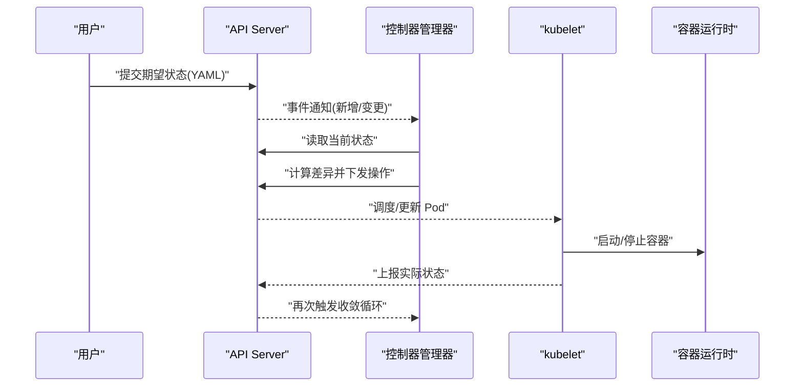
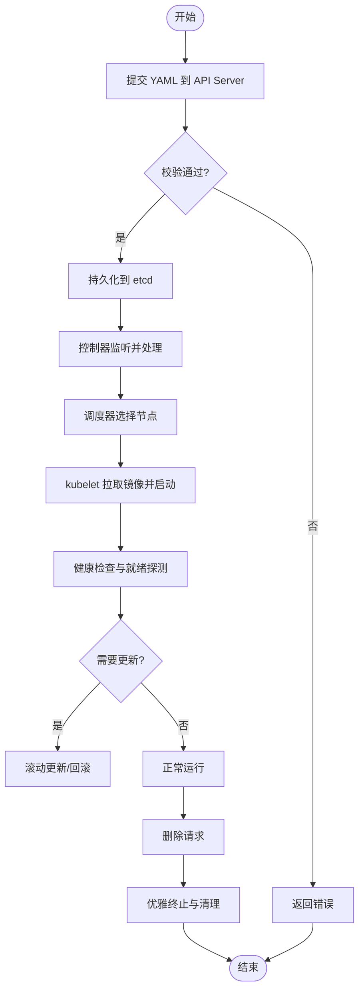
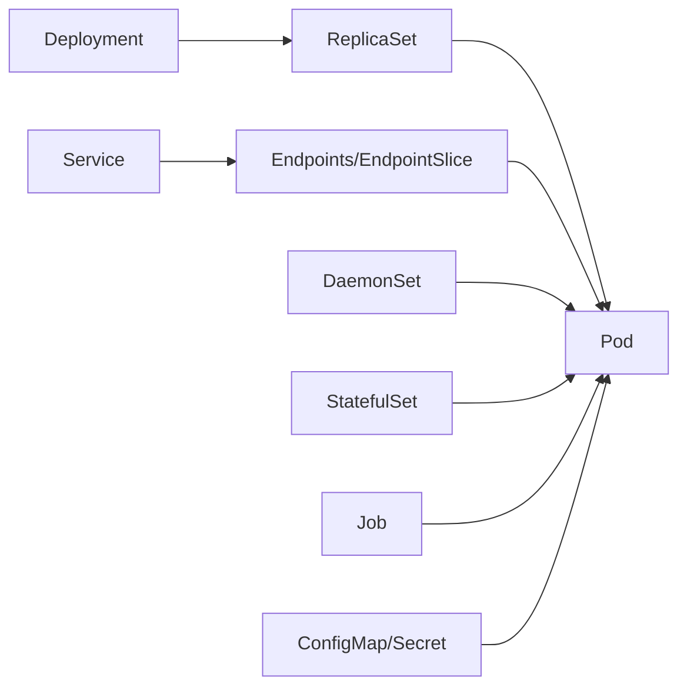

# 核心概念

<cite>
**本文引用的文件**   
- [README.md](file://README.md)
- [doc.go](file://pkg/apis/core/v1/doc.go)
- [doc.go](file://pkg/apis/apps/v1/doc.go)
</cite>

## 目录
1. [简介](#简介)
2. [项目结构](#项目结构)
3. [核心组件](#核心组件)
4. [架构总览](#架构总览)
5. [详细组件分析](#详细组件分析)
6. [依赖分析](#依赖分析)
7. [性能考虑](#性能考虑)
8. [故障排查指南](#故障排查指南)
9. [结论](#结论)
10. [附录](#附录)

## 简介
本章节面向初学者与进阶用户，系统化梳理 Kubernetes 的核心概念与资源模型，包括 Pod、Service、Deployment、StatefulSet、DaemonSet、Job、ConfigMap、Secret 等关键对象；解释命名空间（Namespace）的资源隔离机制、标签（Labels）与选择器（Selectors）的组织方式、注解（Annotations）的元数据管理能力；阐述控制器模式的工作原理与期望状态/实际状态的收敛过程；并提供丰富的 YAML 配置示例路径、生命周期管理要点、版本兼容性说明以及常见使用模式的实战案例。

## 项目结构
Kubernetes 仓库采用“API 定义 + 控制器实现 + 工具链”的分层组织方式：
- API 定义位于 pkg/apis 与 staging/src/k8s.io/api 下，按组与版本划分（如 core/v1、apps/v1、batch/v1）。
- 控制器实现位于 pkg/controller 与 cmd/kube-controller-manager 下，分别对应不同资源类型的控制循环。
- 文档与示例散落在 docs、hack/testdata 等目录中，便于参考与验证。



[本节为概览性描述，不直接分析具体文件，故无“章节来源”]

## 核心组件
- Pod：最小可部署的计算单元，封装一个或多个容器、存储卷、网络 IP 及运行选项。
- Service：为 Pod 提供稳定的网络入口与负载均衡能力，支持 ClusterIP、NodePort、LoadBalancer 等类型。
- Deployment：声明式地管理无状态副本集，支持滚动更新、回滚与扩缩容。
- StatefulSet：管理有状态应用，保证 Pod 的有序部署与稳定网络标识、持久化存储绑定。
- DaemonSet：确保每个（或特定）节点上运行一个 Pod 副本，常用于日志采集、监控代理。
- Job/CronJob：执行一次性任务或周期性任务，完成后自动清理。
- ConfigMap/Secret：将配置与敏感信息从镜像中解耦，以键值或文件形式注入到 Pod。
- Namespace：逻辑隔离集群资源，配合 RBAC 实现多租户与权限边界。
- Labels/Selectors：通过键值对为资源打标签，控制器与服务发现基于选择器进行匹配与管理。
- Annotations：非标识用途的任意元数据，供工具链、平台扩展记录上下文信息。

[本节为概念性概述，不直接分析具体文件，故无“章节来源”]

## 架构总览
Kubernetes 的控制面由 API Server、etcd、Scheduler、Controller Manager 等组成，工作节点由 kubelet、容器运行时、kube-proxy 等构成。控制器持续读取期望状态（YAML/声明），对比实际状态（API Server 中的当前状态），并通过 API Server 驱动系统收敛。

```mermaid
graph TB
subgraph "控制面"
APIServer["API Server"]
ETCD["etcd"]
CM["Controller Manager"]
SCHED["Scheduler"]
end
subgraph "工作节点"
Kubelet["kubelet"]
Proxy["kube-proxy"]
Runtime["容器运行时"]
end
User["用户/CI/CD"] --> APIServer
APIServer < --> ETCD
CM --> APIServer
SCHED --> APIServer
Kubelet --> APIServer
Proxy --> APIServer
Kubelet --> Runtime
```

[本节为概念性架构图，未映射到具体源码文件，故无“图表来源”]

## 详细组件分析

### 控制器模式与状态收敛
- 期望状态：用户通过 YAML 提交到 API Server 的声明。
- 实际状态：API Server 中持久化的当前状态。
- 控制器循环：监听差异事件，计算所需动作（创建/更新/删除），调用 API Server 修正实际状态，直至与期望一致。
- 典型控制器：Deployment→ReplicaSet→Pod；StatefulSet→Pod；DaemonSet→Pod；Job→Pod；Service→Endpoints/EndpointSlice；Ingress→后端规则等。



[本节为通用流程示意，未映射到具体源码文件，故无“图表来源”]

### 命名空间（Namespace）与资源隔离
- 作用域：大多数资源属于某个命名空间，默认是 default。
- 隔离维度：名称唯一性在命名空间内生效；跨命名空间访问需显式引用。
- 结合 RBAC：通过 Role/ClusterRole 与 RoleBinding/ClusterRoleBinding 实现细粒度权限控制。
- 最佳实践：按团队/环境/业务划分命名空间，统一前缀与标签策略。

[本节为概念性内容，不直接分析具体文件，故无“章节来源”]

### 标签（Labels）与选择器（Selectors）
- 标签：键值对形式的轻量级分类标记，用于资源分组与筛选。
- 选择器：控制器与服务发现根据标签表达式匹配目标集合。
- 常用场景：Deployment.selector.matchLabels、Service.selector、Ingress/NetworkPolicy 的关联。
- 注意事项：避免过度碎片化标签；保持标签语义清晰且稳定。

[本节为概念性内容，不直接分析具体文件，故无“章节来源”]

### 注解（Annotations）
- 用途：存储非标识用途的元数据，如发布版本、变更记录、外部系统集成信息等。
- 特点：不参与选择器匹配，容量较大，适合附加上下文。
- 建议：遵循约定命名空间（如 app.kubernetes.io/*），避免写入敏感信息。

[本节为概念性内容，不直接分析具体文件，故无“章节来源”]

### 资源对象详解与 YAML 示例路径

#### Pod
- 角色：承载容器及其运行环境的原子单位。
- 关键字段：metadata、spec.containers[]、spec.volumes[]、spec.restartPolicy、spec.scheduling 等。
- 示例路径：
  - [pod.yaml](file://hack/testdata/pod.yaml)
  - [pod-with-probes.yaml](file://hack/testdata/pod-with-metadata-and-probes.yaml)
  - [pod-restricted-localhost.yaml](file://hack/testdata/pod-restricted-localhost.yaml)
  - [pod-run-as-non-root.yaml](file://hack/testdata/pod-run-as-non-root.yaml)

**章节来源**
- [pod.yaml](file://hack/testdata/pod.yaml)
- [pod-with-metadata-and-probes.yaml](file://hack/testdata/pod-with-metadata-and-probes.yaml)
- [pod-restricted-localhost.yaml](file://hack/testdata/pod-restricted-localhost.yaml)
- [pod-run-as-non-root.yaml](file://hack/testdata/pod-run-as-non-root.yaml)

#### Service
- 角色：为 Pod 提供稳定的网络端点与负载均衡。
- 关键字段：spec.type、spec.ports[]、spec.selector、spec.clusterIP、spec.externalTrafficPolicy 等。
- 示例路径：
  - [kubernetes-service.yaml](file://hack/testdata/kubernetes-service.yaml)
  - [service-revision1.yaml](file://hack/testdata/service-revision1.yaml)
  - [service-revision2.yaml](file://hack/testdata/service-revision2.yaml)

**章节来源**
- [kubernetes-service.yaml](file://hack/testdata/kubernetes-service.yaml)
- [service-revision1.yaml](file://hack/testdata/service-revision1.yaml)
- [service-revision2.yaml](file://hack/testdata/service-revision2.yaml)

#### Deployment
- 角色：管理无状态应用的副本集，支持滚动更新与回滚。
- 关键字段：spec.replicas、spec.strategy、spec.selector、spec.template、revisionHistoryLimit 等。
- 示例路径：
  - [deployment-label-change1.yaml](file://hack/testdata/deployment-label-change1.yaml)
  - [deployment-label-change2.yaml](file://hack/testdata/deployment-label-change2.yaml)
  - [deployment-label-change3.yaml](file://hack/testdata/deployment-label-change3.yaml)
  - [deployment-multicontainer.yaml](file://hack/testdata/deployment-multicontainer.yaml)
  - [deployment-multicontainer-resources.yaml](file://hack/testdata/deployment-multicontainer-resources.yaml)
  - [deployment-revision1.yaml](file://hack/testdata/deployment-revision1.yaml)
  - [deployment-revision2.yaml](file://hack/testdata/deployment-revision2.yaml)
  - [deployment-with-UnixUserID.yaml](file://hack/testdata/deployment-with-UnixUserID.yaml)
  - [invalid-deployment-unknown-and-duplicate-fields.yaml](file://hack/testdata/invalid-deployment-unknown-and-duplicate-fields.yaml)
  - [scale-deploy-1.yaml](file://hack/testdata/scale-deploy-1.yaml)
  - [scale-deploy-2.yaml](file://hack/testdata/scale-deploy-2.yaml)
  - [scale-deploy-3.yaml](file://hack/testdata/scale-deploy-3.yaml)

**章节来源**
- [deployment-label-change1.yaml](file://hack/testdata/deployment-label-change1.yaml)
- [deployment-label-change2.yaml](file://hack/testdata/deployment-label-change2.yaml)
- [deployment-label-change3.yaml](file://hack/testdata/deployment-label-change3.yaml)
- [deployment-multicontainer.yaml](file://hack/testdata/deployment-multicontainer.yaml)
- [deployment-multicontainer-resources.yaml](file://hack/testdata/deployment-multicontainer-resources.yaml)
- [deployment-revision1.yaml](file://hack/testdata/deployment-revision1.yaml)
- [deployment-revision2.yaml](file://hack/testdata/deployment-revision2.yaml)
- [deployment-with-UnixUserID.yaml](file://hack/testdata/deployment-with-UnixUserID.yaml)
- [invalid-deployment-unknown-and-duplicate-fields.yaml](file://hack/testdata/invalid-deployment-unknown-and-duplicate-fields.yaml)
- [scale-deploy-1.yaml](file://hack/testdata/scale-deploy-1.yaml)
- [scale-deploy-2.yaml](file://hack/testdata/scale-deploy-2.yaml)
- [scale-deploy-3.yaml](file://hack/testdata/scale-deploy-3.yaml)

#### StatefulSet
- 角色：管理有状态应用，保证稳定网络标识与持久化存储。
- 关键字段：spec.replicas、spec.serviceName、spec.volumeClaimTemplates、updateStrategy、selector、template 等。
- 示例路径：
  - [rollingupdate-statefulset.yaml](file://hack/testdata/rollingupdate-statefulset.yaml)
  - [rollingupdate-statefulset-rv2.yaml](file://hack/testdata/rollingupdate-statefulset-rv2.yaml)

**章节来源**
- [rollingupdate-statefulset.yaml](file://hack/testdata/rollingupdate-statefulset.yaml)
- [rollingupdate-statefulset-rv2.yaml](file://hack/testdata/rollingupdate-statefulset-rv2.yaml)

#### DaemonSet
- 角色：在每个（或特定）节点上运行一个 Pod 副本。
- 关键字段：spec.selector、spec.template、updateStrategy、nodeSelector/tolerations 等。
- 示例路径：
  - [rollingupdate-daemonset.yaml](file://hack/testdata/rollingupdate-daemonset.yaml)
  - [rollingupdate-daemonset-rv2.yaml](file://hack/testdata/rollingupdate-daemonset-rv2.yaml)

**章节来源**
- [rollingupdate-daemonset.yaml](file://hack/testdata/rollingupdate-daemonset.yaml)
- [rollingupdate-daemonset-rv2.yaml](file://hack/testdata/rollingupdate-daemonset-rv2.yaml)

#### Job / CronJob
- 角色：执行一次性任务或周期性任务。
- 关键字段：spec.parallelism、spec.completions、spec.backoffLimit、spec.activeDeadlineSeconds、spec.template、CronJob 的 spec.schedule 等。
- 示例路径：
  - [job 相关示例可在 batch/v1 测试用例与 e2e 中找到，此处以仓库根 README 作为入口指引](file://README.md)

**章节来源**
- [README.md](file://README.md)

#### ConfigMap / Secret
- 角色：将配置与敏感信息从镜像中解耦，以环境变量或卷挂载方式注入。
- 关键字段：data/binaryData（ConfigMap）、type/data（Secret）、volumeMounts/envFrom 等。
- 示例路径：
  - [configmap.yaml](file://hack/testdata/configmap.yaml)
  - [secret.yaml](file://hack/testdata/secret.yaml)

**章节来源**
- [configmap.yaml](file://hack/testdata/configmap.yaml)
- [secret.yaml](file://hack/testdata/secret.yaml)

### 版本兼容性与 API 演进
- API 组与版本：core/v1、apps/v1、batch/v1 等，各版本间存在弃用与迁移策略。
- 生成代码与转换：通过注释指令生成默认值、校验与转换逻辑，保障向后兼容。
- 参考文件：
  - [core/v1 doc.go](file://pkg/apis/core/v1/doc.go)
  - [apps/v1 doc.go](file://pkg/apis/apps/v1/doc.go)

**章节来源**
- [doc.go](file://pkg/apis/core/v1/doc.go)
- [doc.go](file://pkg/apis/apps/v1/doc.go)

### 资源生命周期管理
- 创建阶段：用户提交 YAML → API Server 校验与持久化 → 控制器感知并创建下游资源。
- 运行阶段：调度器选择节点 → kubelet 拉取镜像并启动容器 → 探针与健康检查维护就绪/存活状态。
- 更新阶段：滚动更新策略控制批次与失败回滚；历史版本保留与清理。
- 删除阶段：级联删除（OwnerReferences/GarbageCollector）、优雅终止（terminationGracePeriodSeconds）、最终清理（Finalizers）。



[本节为通用流程图，未映射到具体源码文件，故无“图表来源”]

### 常见使用模式与实战案例
- 无状态 Web 服务：Deployment + Service + Ingress，结合 HPA 自动扩缩容。
- 有状态数据库：StatefulSet + PVC + Headless Service，配合备份与恢复策略。
- 日志/监控采集：DaemonSet + ConfigMap/Secret，集中收集与告警。
- 批处理任务：Job/CronJob + ConfigMap/Secret，参数化与重试策略。
- 多容器 Pod：Sidecar/Init Container 模式，职责分离与共享存储。

[本节为概念性内容，不直接分析具体文件，故无“章节来源”]

## 依赖分析
- 组件耦合：控制器与 API Server 强耦合；kubelet 与容器运行时耦合；kube-proxy 与网络插件耦合。
- 间接依赖：Service 依赖 Endpoint/EndpointSlice；Ingress 依赖后端 Service；HPA 依赖 Metrics Server。
- 外部集成：云厂商 LB/Ingress 控制器、CSI 存储插件、认证/授权插件等。



[本节为概念性依赖图，未映射到具体源码文件，故无“图表来源”]

## 性能考虑
- 合理设置资源请求与限制，避免节点过载与抖动。
- 使用就绪探针减少流量转发至未就绪 Pod。
- 控制副本数与滚动更新批次，平衡可用性与更新速度。
- 利用水平/垂直自动扩缩容应对负载波动。
- 优化镜像体积与拉取策略，缩短启动时延。

[本节为通用指导，不直接分析具体文件，故无“章节来源”]

## 故障排查指南
- 查看事件与状态：kubectl describe/get events，关注 Warning 事件与条件变化。
- 定位 Pod 问题：kubectl logs、exec、describe，检查容器退出码与探针失败原因。
- 网络连通性：验证 Service/Endpoint/EndpointSlice 一致性，检查 NetworkPolicy 与 CNI 插件。
- 存储问题：确认 PV/PVC 绑定状态、StorageClass 与 CSI 插件健康。
- 控制器异常：查看控制器日志与队列积压情况，确认 RBAC 与准入策略。

[本节为通用指导，不直接分析具体文件，故无“章节来源”]

## 结论
Kubernetes 通过声明式 API 与控制器模式，将复杂分布式系统的编排抽象为“期望状态与实际状态的收敛”。掌握核心资源对象、命名空间隔离、标签与选择器、注解元数据，以及控制器工作原理，是高效使用 Kubernetes 的关键。结合仓库中的 YAML 示例与官方文档，可以快速构建生产可用的应用拓扑与运维体系。

[本节为总结性内容，不直接分析具体文件，故无“章节来源”]

## 附录
- 快速上手与开发指引：参见仓库根 README 提供的入门链接与社区资源。
- 更多示例与测试数据：参考 hack/testdata 下的各类 YAML 文件，覆盖常见场景与边界用例。

**章节来源**
- [README.md](file://README.md)