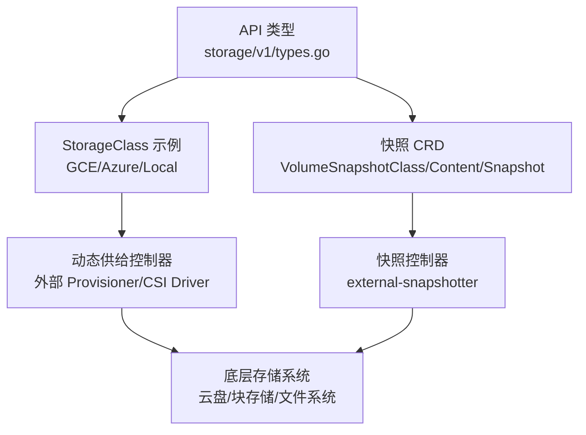
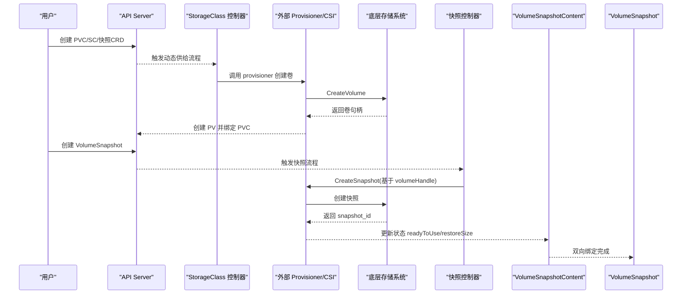
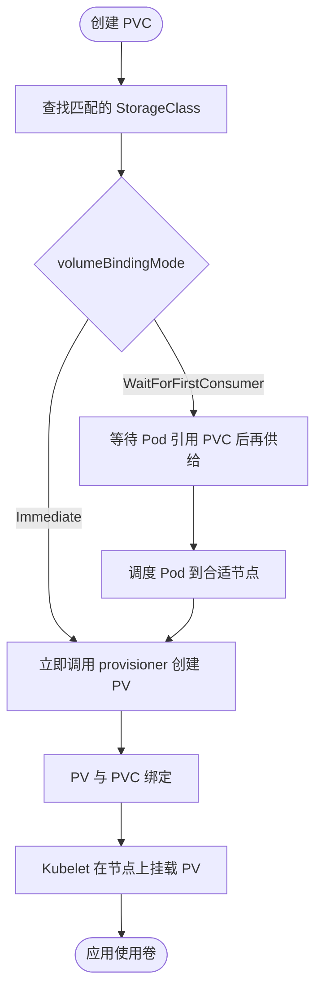
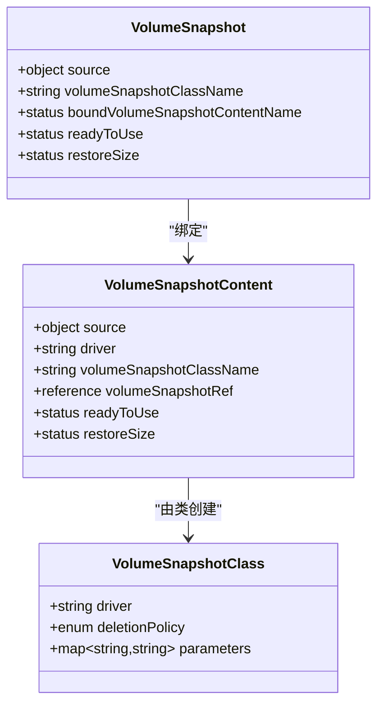
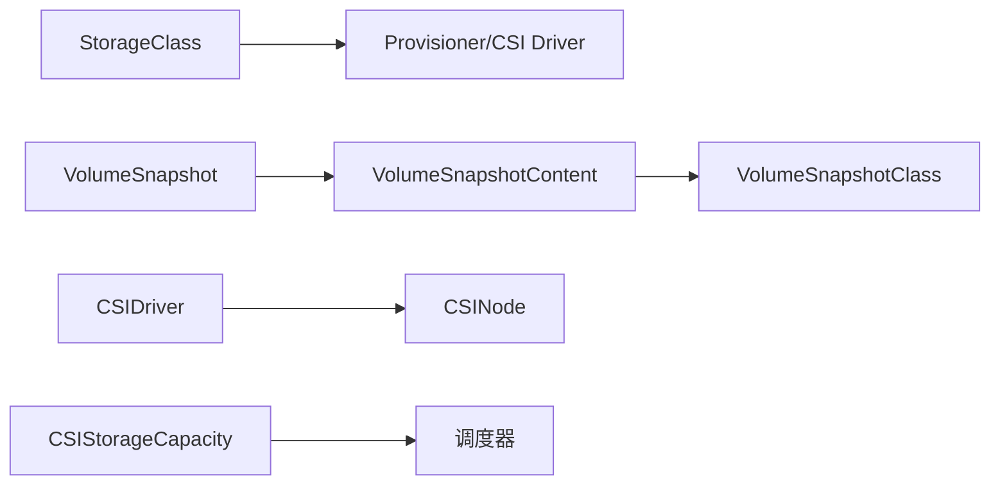

# 存储资源

<cite>
**本文引用的文件**   
- [types.go](file://staging/src/k8s.io/api/storage/v1/types.go)
- [default.yaml（GCE）](file://cluster/addons/storage-class/gce/default.yaml)
- [default.yaml（Azure）](file://cluster/addons/storage-class/azure/default.yaml)
- [default.yaml（本地 host-path）](file://cluster/addons/storage-class/local/default.yaml)
- [snapshot.storage.k8s.io_volumesnapshotclasses.yaml](file://cluster/addons/volumesnapshots/crd/snapshot.storage.k8s.io_volumesnapshotclasses.yaml)
- [snapshot.storage.k8s.io_volumesnapshotcontents.yaml](file://cluster/addons/volumesnapshots/crd/snapshot.storage.k8s.io_volumesnapshotcontents.yaml)
- [snapshot.storage.k8s.io_volumesnapshots.yaml](file://cluster/addons/volumesnapshots/crd/snapshot.storage.k8s.io_volumesnapshots.yaml)
</cite>

## 目录
1. [简介](#简介)
2. [项目结构](#项目结构)
3. [核心组件](#核心组件)
4. [架构总览](#架构总览)
5. [详细组件分析](#详细组件分析)
6. [依赖关系分析](#依赖关系分析)
7. [性能与容量规划](#性能与容量规划)
8. [故障恢复与生命周期管理](#故障恢复与生命周期管理)
9. [结论](#结论)
10. [附录：YAML 配置示例路径](#附录yaml-配置示例路径)

## 简介
本文件面向 Kubernetes 存储资源，系统性阐述 PersistentVolume、PersistentVolumeClaim、StorageClass、VolumeSnapshot 等资源的定义、用途与配置方式；解释动态供给机制、存储类参数、数据持久化策略；并提供丰富的 YAML 配置示例路径，覆盖本地存储、云存储集成、快照备份与恢复场景。同时给出性能调优建议、容量规划方法与故障恢复策略，帮助读者在生产环境中安全、高效地使用存储能力。

## 项目结构
仓库中与存储相关的核心内容分布在以下位置：
- API 类型定义：storage/v1 的 StorageClass、CSIDriver、CSINode、CSIStorageCapacity、VolumeAttachment 等
- 存储类默认示例：cluster/addons/storage-class 下 GCE、Azure、本地 host-path 的默认 StorageClass
- 卷快照 CRD：cluster/addons/volumesnapshots/crd 下的 VolumeSnapshotClass、VolumeSnapshotContent、VolumeSnapshot 的 CRD 定义

图表来源
- [types.go:30-121](file://staging/src/k8s.io/api/storage/v1/types.go#L30-L121)
- [default.yaml（GCE）:1-13](file://cluster/addons/storage-class/gce/default.yaml#L1-L13)
- [default.yaml（Azure）:1-10](file://cluster/addons/storage-class/azure/default.yaml#L1-L10)
- [default.yaml（本地 host-path）:1-11](file://cluster/addons/storage-class/local/default.yaml#L1-L11)
- [snapshot.storage.k8s.io_volumesnapshotclasses.yaml:1-146](file://cluster/addons/volumesnapshots/crd/snapshot.storage.k8s.io_volumesnapshotclasses.yaml#L1-L146)
- [snapshot.storage.k8s.io_volumesnapshotcontents.yaml:1-460](file://cluster/addons/volumesnapshots/crd/snapshot.storage.k8s.io_volumesnapshotcontents.yaml#L1-L460)
- [snapshot.storage.k8s.io_volumesnapshots.yaml:1-354](file://cluster/addons/volumesnapshots/crd/snapshot.storage.k8s.io_volumesnapshots.yaml#L1-L354)

章节来源
- [types.go:30-121](file://staging/src/k8s.io/api/storage/v1/types.go#L30-L121)
- [default.yaml（GCE）:1-13](file://cluster/addons/storage-class/gce/default.yaml#L1-L13)
- [default.yaml（Azure）:1-10](file://cluster/addons/storage-class/azure/default.yaml#L1-L10)
- [default.yaml（本地 host-path）:1-11](file://cluster/addons/storage-class/local/default.yaml#L1-L11)
- [snapshot.storage.k8s.io_volumesnapshotclasses.yaml:1-146](file://cluster/addons/volumesnapshots/crd/snapshot.storage.k8s.io_volumesnapshotclasses.yaml#L1-L146)
- [snapshot.storage.k8s.io_volumesnapshotcontents.yaml:1-460](file://cluster/addons/volumesnapshots/crd/snapshot.storage.k8s.io_volumesnapshotcontents.yaml#L1-L460)
- [snapshot.storage.k8s.io_volumesnapshots.yaml:1-354](file://cluster/addons/volumesnapshots/crd/snapshot.storage.k8s.io_volumesnapshots.yaml#L1-L354)

## 核心组件
本节聚焦于存储相关核心对象及其关键字段与作用域，结合仓库中的类型定义与示例进行说明。

- StorageClass
  - 作用域：集群级（非命名空间）
  - 关键属性：provisioner、parameters、reclaimPolicy、mountOptions、allowVolumeExpansion、volumeBindingMode、allowedTopologies
  - 绑定模式：Immediate（默认）、WaitForFirstConsumer
  - 参考实现：[types.go:30-121](file://staging/src/k8s.io/api/storage/v1/types.go#L30-L121)

- CSIDriver / CSINode / CSIStorageCapacity
  - CSIDriver：描述 CSI 驱动能力（如 attachRequired、podInfoOnMount、volumeLifecycleModes、storageCapacity、fsGroupPolicy、tokenRequests、requiresRepublish、seLinuxMount、nodeAllocatableUpdatePeriodSeconds、serviceAccountTokenInSecrets、preventPodSchedulingIfMissing）
  - CSINode：节点上已注册的 CSI 驱动信息（drivers、topologyKeys、allocatable）
  - CSIStorageCapacity：按拓扑上报可用容量，供调度器做容量感知调度
  - 参考实现：[types.go:260-782](file://staging/src/k8s.io/api/storage/v1/types.go#L260-L782)

- VolumeAttachment
  - 记录将 PV 挂载到节点的意图与状态（attacher、source、nodeName、attached、attachError/detachError）
  - 参考实现：[types.go:129-253](file://staging/src/k8s.io/api/storage/v1/types.go#L129-L253)

- 快照相关 CRD
  - VolumeSnapshotClass：指定快照创建参数与删除策略（driver、deletionPolicy、parameters），集群级
  - VolumeSnapshotContent：底层“磁盘”快照的对象表示，支持动态或预置快照，包含 source（volumeHandle/snapshotHandle）、deletionPolicy、driver、volumeSnapshotRef 等
  - VolumeSnapshot：用户请求创建快照或绑定已有快照，包含 source（persistentVolumeClaimName 或 volumeSnapshotContentName）、volumeSnapshotClassName
  - 参考实现：
    - [snapshot.storage.k8s.io_volumesnapshotclasses.yaml:1-146](file://cluster/addons/volumesnapshots/crd/snapshot.storage.k8s.io_volumesnapshotclasses.yaml#L1-L146)
    - [snapshot.storage.k8s.io_volumesnapshotcontents.yaml:1-460](file://cluster/addons/volumesnapshots/crd/snapshot.storage.k8s.io_volumesnapshotcontents.yaml#L1-L460)
    - [snapshot.storage.k8s.io_volumesnapshots.yaml:1-354](file://cluster/addons/volumesnapshots/crd/snapshot.storage.k8s.io_volumesnapshots.yaml#L1-L354)

章节来源
- [types.go:30-121](file://staging/src/k8s.io/api/storage/v1/types.go#L30-L121)
- [types.go:129-253](file://staging/src/k8s.io/api/storage/v1/types.go#L129-L253)
- [types.go:260-782](file://staging/src/k8s.io/api/storage/v1/types.go#L260-L782)
- [snapshot.storage.k8s.io_volumesnapshotclasses.yaml:1-146](file://cluster/addons/volumesnapshots/crd/snapshot.storage.k8s.io_volumesnapshotclasses.yaml#L1-L146)
- [snapshot.storage.k8s.io_volumesnapshotcontents.yaml:1-460](file://cluster/addons/volumesnapshots/crd/snapshot.storage.k8s.io_volumesnapshotcontents.yaml#L1-L460)
- [snapshot.storage.k8s.io_volumesnapshots.yaml:1-354](file://cluster/addons/volumesnapshots/crd/snapshot.storage.k8s.io_volumesnapshots.yaml#L1-L354)

## 架构总览
Kubernetes 存储生态围绕“声明式资源 + 控制器 + 外部驱动”的模式运行：
- 用户通过 PVC/SC/快照 CRD 声明期望
- 控制面控制器（Provisioner/Attach/Detach/Snapshot Controller）协调状态
- CSI 驱动对接底层存储系统完成实际 I/O 操作

图表来源
- [types.go:30-121](file://staging/src/k8s.io/api/storage/v1/types.go#L30-L121)
- [snapshot.storage.k8s.io_volumesnapshotclasses.yaml:1-146](file://cluster/addons/volumesnapshots/crd/snapshot.storage.k8s.io_volumesnapshotclasses.yaml#L1-L146)
- [snapshot.storage.k8s.io_volumesnapshotcontents.yaml:1-460](file://cluster/addons/volumesnapshots/crd/snapshot.storage.k8s.io_volumesnapshotcontents.yaml#L1-L460)
- [snapshot.storage.k8s.io_volumesnapshots.yaml:1-354](file://cluster/addons/volumesnapshots/crd/snapshot.storage.k8s.io_volumesnapshots.yaml#L1-L354)

## 详细组件分析

### StorageClass 与动态供给
- 字段要点
  - provisioner：指定供给器名称（例如 kubernetes.io/gce-pd、kubernetes.io/azure-disk、kubernetes.io/host-path）
  - parameters：供给器特定参数（如云盘类型、IOPS 等级等）
  - reclaimPolicy：PVC 删除后 PV 的处理策略（Delete/Retain）
  - mountOptions：挂载选项（如只读、软挂载等）
  - allowVolumeExpansion：是否允许扩容
  - volumeBindingMode：Immediate 或 WaitForFirstConsumer
  - allowedTopologies：限制可供给的拓扑范围
- 示例路径
  - GCE 默认 StorageClass：[default.yaml（GCE）:1-13](file://cluster/addons/storage-class/gce/default.yaml#L1-L13)
  - Azure 默认 StorageClass：[default.yaml（Azure）:1-10](file://cluster/addons/storage-class/azure/default.yaml#L1-L10)
  - 本地 host-path 默认 StorageClass：[default.yaml（本地 host-path）:1-11](file://cluster/addons/storage-class/local/default.yaml#L1-L11)

图表来源
- [types.go:30-121](file://staging/src/k8s.io/api/storage/v1/types.go#L30-L121)
- [default.yaml（GCE）:1-13](file://cluster/addons/storage-class/gce/default.yaml#L1-L13)
- [default.yaml（Azure）:1-10](file://cluster/addons/storage-class/azure/default.yaml#L1-L10)
- [default.yaml（本地 host-path）:1-11](file://cluster/addons/storage-class/local/default.yaml#L1-L11)

章节来源
- [types.go:30-121](file://staging/src/k8s.io/api/storage/v1/types.go#L30-L121)
- [default.yaml（GCE）:1-13](file://cluster/addons/storage-class/gce/default.yaml#L1-L13)
- [default.yaml（Azure）:1-10](file://cluster/addons/storage-class/azure/default.yaml#L1-L10)
- [default.yaml（本地 host-path）:1-11](file://cluster/addons/storage-class/local/default.yaml#L1-L11)

### 快照体系：VolumeSnapshotClass / Content / Snapshot
- VolumeSnapshotClass
  - driver：处理快照的 CSI 驱动名
  - deletionPolicy：Delete 或 Retain（决定绑定的 VolumeSnapshot 删除时，物理快照是否保留）
  - parameters：驱动特定的快照参数
  - 参考：[snapshot.storage.k8s.io_volumesnapshotclasses.yaml:1-146](file://cluster/addons/volumesnapshots/crd/snapshot.storage.k8s.io_volumesnapshotclasses.yaml#L1-L146)

- VolumeSnapshotContent
  - source：动态快照（volumeHandle）或预置快照（snapshotHandle）
  - deletionPolicy：与 Class 一致，控制删除行为
  - driver：CSI 驱动名
  - volumeSnapshotRef：与 VolumeSnapshot 的双向绑定引用
  - status：readyToUse、restoreSize、creationTime、snapshotHandle 等
  - 参考：[snapshot.storage.k8s.io_volumesnapshotcontents.yaml:1-460](file://cluster/addons/volumesnapshots/crd/snapshot.storage.k8s.io_volumesnapshotcontents.yaml#L1-L460)

- VolumeSnapshot
  - source：persistentVolumeClaimName 或 volumeSnapshotContentName（二选一）
  - volumeSnapshotClassName：可选，未设置时使用默认类
  - status：boundVolumeSnapshotContentName、readyToUse、restoreSize、creationTime 等
  - 参考：[snapshot.storage.k8s.io_volumesnapshots.yaml:1-354](file://cluster/addons/volumesnapshots/crd/snapshot.storage.k8s.io_volumesnapshots.yaml#L1-L354)

图表来源
- [snapshot.storage.k8s.io_volumesnapshotclasses.yaml:1-146](file://cluster/addons/volumesnapshots/crd/snapshot.storage.k8s.io_volumesnapshotclasses.yaml#L1-L146)
- [snapshot.storage.k8s.io_volumesnapshotcontents.yaml:1-460](file://cluster/addons/volumesnapshots/crd/snapshot.storage.k8s.io_volumesnapshotcontents.yaml#L1-L460)
- [snapshot.storage.k8s.io_volumesnapshots.yaml:1-354](file://cluster/addons/volumesnapshots/crd/snapshot.storage.k8s.io_volumesnapshots.yaml#L1-L354)

章节来源
- [snapshot.storage.k8s.io_volumesnapshotclasses.yaml:1-146](file://cluster/addons/volumesnapshots/crd/snapshot.storage.k8s.io_volumesnapshotclasses.yaml#L1-L146)
- [snapshot.storage.k8s.io_volumesnapshotcontents.yaml:1-460](file://cluster/addons/volumesnapshots/crd/snapshot.storage.k8s.io_volumesnapshotcontents.yaml#L1-L460)
- [snapshot.storage.k8s.io_volumesnapshots.yaml:1-354](file://cluster/addons/volumesnapshots/crd/snapshot.storage.k8s.io_volumesnapshots.yaml#L1-L354)

### CSI 驱动与容量感知
- CSIDriver
  - storageCapacity：启用后，调度器会考虑 CSIStorageCapacity 的容量信息
  - podInfoOnMount：是否传递 Pod 信息给驱动
  - fsGroupPolicy：权限与所有权变更策略
  - tokenRequests：为驱动提供 ServiceAccount Token
  - requiresRepublish：周期性重新发布以反映挂载变化
  - seLinuxMount：SELinux 上下文挂载支持
  - nodeAllocatableUpdatePeriodSeconds：节点可分配容量更新周期
  - serviceAccountTokenInSecrets：敏感 Token 通过 Secrets 字段传递
  - preventPodSchedulingIfMissing：缺失驱动时阻止 Pod 调度
  - 参考：[types.go:260-509](file://staging/src/k8s.io/api/storage/v1/types.go#L260-L509)

- CSINode
  - drivers：节点上的驱动列表（name、nodeID、topologyKeys、allocatable）
  - 参考：[types.go:586-679](file://staging/src/k8s.io/api/storage/v1/types.go#L586-L679)

- CSIStorageCapacity
  - nodeTopology：容量可用的节点拓扑
  - storageClassName：关联的 StorageClass
  - capacity/maximumVolumeSize：可用容量与最大卷大小
  - 参考：[types.go:685-782](file://staging/src/k8s.io/api/storage/v1/types.go#L685-L782)

章节来源
- [types.go:260-509](file://staging/src/k8s.io/api/storage/v1/types.go#L260-L509)
- [types.go:586-679](file://staging/src/k8s.io/api/storage/v1/types.go#L586-L679)
- [types.go:685-782](file://staging/src/k8s.io/api/storage/v1/types.go#L685-L782)

## 依赖关系分析
- StorageClass 与 Provisioner/CSI 驱动耦合：provisioner 字段决定具体实现
- VolumeSnapshot 与 VolumeSnapshotContent 双向绑定：需校验双方互相引用
- CSIDriver 与 CSINode：驱动注册与节点能力上报
- CSIStorageCapacity 与调度器：容量感知调度依赖该对象

图表来源
- [types.go:30-121](file://staging/src/k8s.io/api/storage/v1/types.go#L30-L121)
- [snapshot.storage.k8s.io_volumesnapshotclasses.yaml:1-146](file://cluster/addons/volumesnapshots/crd/snapshot.storage.k8s.io_volumesnapshotclasses.yaml#L1-L146)
- [snapshot.storage.k8s.io_volumesnapshotcontents.yaml:1-460](file://cluster/addons/volumesnapshots/crd/snapshot.storage.k8s.io_volumesnapshotcontents.yaml#L1-L460)
- [snapshot.storage.k8s.io_volumesnapshots.yaml:1-354](file://cluster/addons/volumesnapshots/crd/snapshot.storage.k8s.io_volumesnapshots.yaml#L1-L354)
- [types.go:260-782](file://staging/src/k8s.io/api/storage/v1/types.go#L260-L782)

章节来源
- [types.go:30-121](file://staging/src/k8s.io/api/storage/v1/types.go#L30-L121)
- [types.go:260-782](file://staging/src/k8s.io/api/storage/v1/types.go#L260-L782)
- [snapshot.storage.k8s.io_volumesnapshotclasses.yaml:1-146](file://cluster/addons/volumesnapshots/crd/snapshot.storage.k8s.io_volumesnapshotclasses.yaml#L1-L146)
- [snapshot.storage.k8s.io_volumesnapshotcontents.yaml:1-460](file://cluster/addons/volumesnapshots/crd/snapshot.storage.k8s.io_volumesnapshotcontents.yaml#L1-L460)
- [snapshot.storage.k8s.io_volumesnapshots.yaml:1-354](file://cluster/addons/volumesnapshots/crd/snapshot.storage.k8s.io_volumesnapshots.yaml#L1-L354)

## 性能与容量规划
- 选择合适存储类
  - 根据 IOPS/吞吐需求选择云盘类型或本地 SSD（示例见各平台 default.yaml）
  - 使用 WaitForFirstConsumer 提升拓扑亲和性与可用性
- 容量感知调度
  - 启用 CSIDriverSpec.StorageCapacity 并结合 CSIStorageCapacity 上报，避免超卖
- 扩缩容策略
  - 开启 allowVolumeExpansion，配合后端支持的在线扩容
- 挂载与权限
  - 合理设置 fsGroupPolicy 与 mountOptions，减少启动开销与权限问题
- 监控与指标
  - 关注 VolumeAttachment 错误、CSIStorageCapacity 容量变化、快照 readyToUse 状态

[本节为通用指导，不直接分析具体文件]

## 故障恢复与生命周期管理
- 动态供给失败
  - 检查 StorageClass.provisioner 与 parameters 是否正确
  - 查看 VolumeAttachment 的 attachError/detachError 定位挂载问题
  - 参考：[types.go:129-253](file://staging/src/k8s.io/api/storage/v1/types.go#L129-L253)

- 快照异常
  - 确认 VolumeSnapshotClass.deletionPolicy 是否符合预期
  - 检查 VolumeSnapshotContent.status.readyToUse 与 error 字段
  - 参考：
    - [snapshot.storage.k8s.io_volumesnapshotclasses.yaml:1-146](file://cluster/addons/volumesnapshots/crd/snapshot.storage.k8s.io_volumesnapshotclasses.yaml#L1-L146)
    - [snapshot.storage.k8s.io_volumesnapshotcontents.yaml:1-460](file://cluster/addons/volumesnapshots/crd/snapshot.storage.k8s.io_volumesnapshotcontents.yaml#L1-L460)
    - [snapshot.storage.k8s.io_volumesnapshots.yaml:1-354](file://cluster/addons/volumesnapshots/crd/snapshot.storage.k8s.io_volumesnapshots.yaml#L1-L354)

- 数据迁移
  - 使用快照作为中间态：从快照创建新 PVC，再迁移数据至目标存储类
  - 利用 CSI 驱动的跨存储迁移能力（取决于驱动实现）

章节来源
- [types.go:129-253](file://staging/src/k8s.io/api/storage/v1/types.go#L129-L253)
- [snapshot.storage.k8s.io_volumesnapshotclasses.yaml:1-146](file://cluster/addons/volumesnapshots/crd/snapshot.storage.k8s.io_volumesnapshotclasses.yaml#L1-L146)
- [snapshot.storage.k8s.io_volumesnapshotcontents.yaml:1-460](file://cluster/addons/volumesnapshots/crd/snapshot.storage.k8s.io_volumesnapshotcontents.yaml#L1-L460)
- [snapshot.storage.k8s.io_volumesnapshots.yaml:1-354](file://cluster/addons/volumesnapshots/crd/snapshot.storage.k8s.io_volumesnapshots.yaml#L1-L354)

## 结论
通过 StorageClass 的动态供给与 CSI 生态，Kubernetes 提供了灵活且可扩展的存储抽象；借助快照 CRD，可实现一致的备份与恢复能力。生产环境应结合容量感知调度、合理的回收策略与完善的监控告警，确保数据可靠性与性能稳定。

[本节为总结性内容，不直接分析具体文件]

## 附录：YAML 配置示例路径
- 云存储（GCE PD）
  - [default.yaml（GCE）:1-13](file://cluster/addons/storage-class/gce/default.yaml#L1-L13)
- 云存储（Azure Disk）
  - [default.yaml（Azure）:1-10](file://cluster/addons/storage-class/azure/default.yaml#L1-L10)
- 本地存储（host-path）
  - [default.yaml（本地 host-path）:1-11](file://cluster/addons/storage-class/local/default.yaml#L1-L11)
- 快照类（VolumeSnapshotClass）
  - [snapshot.storage.k8s.io_volumesnapshotclasses.yaml:1-146](file://cluster/addons/volumesnapshots/crd/snapshot.storage.k8s.io_volumesnapshotclasses.yaml#L1-L146)
- 快照内容（VolumeSnapshotContent）
  - [snapshot.storage.k8s.io_volumesnapshotcontents.yaml:1-460](file://cluster/addons/volumesnapshots/crd/snapshot.storage.k8s.io_volumesnapshotcontents.yaml#L1-L460)
- 快照（VolumeSnapshot）
  - [snapshot.storage.k8s.io_volumesnapshots.yaml:1-354](file://cluster/addons/volumesnapshots/crd/snapshot.storage.k8s.io_volumesnapshots.yaml#L1-L354)