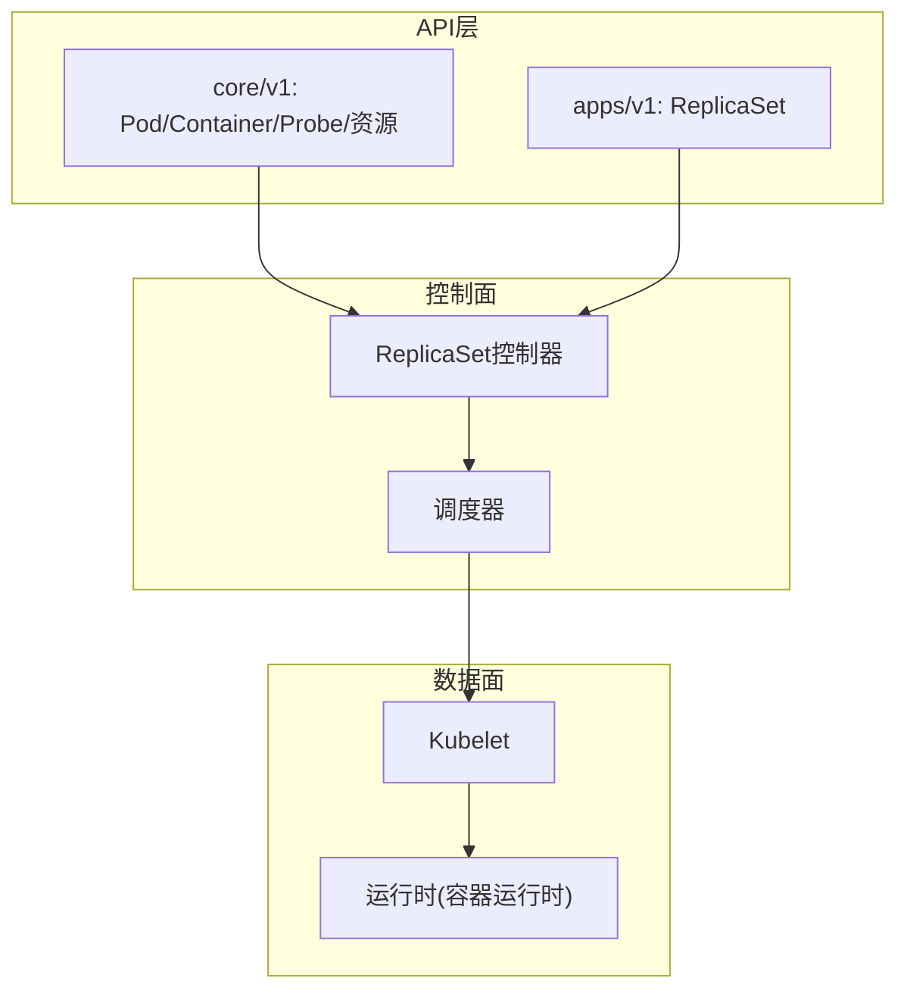
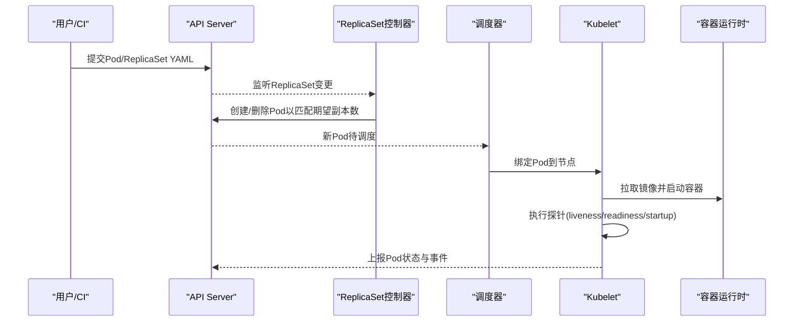
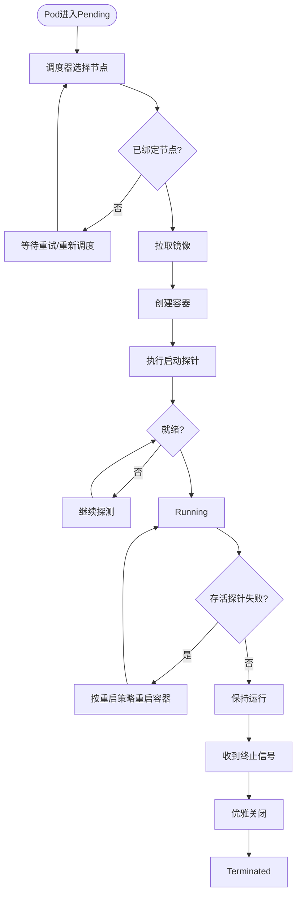
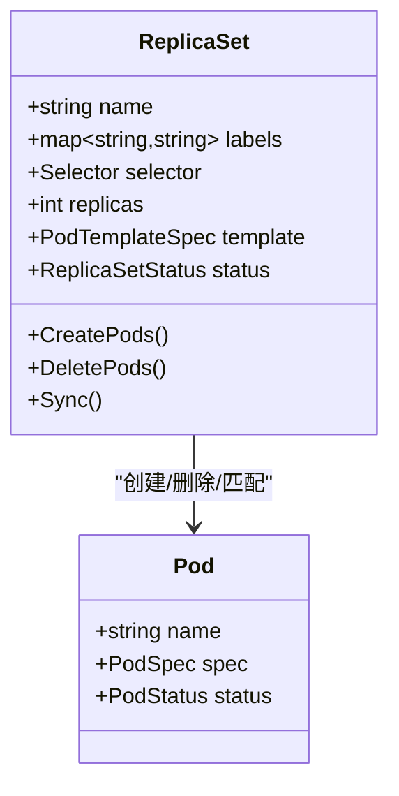
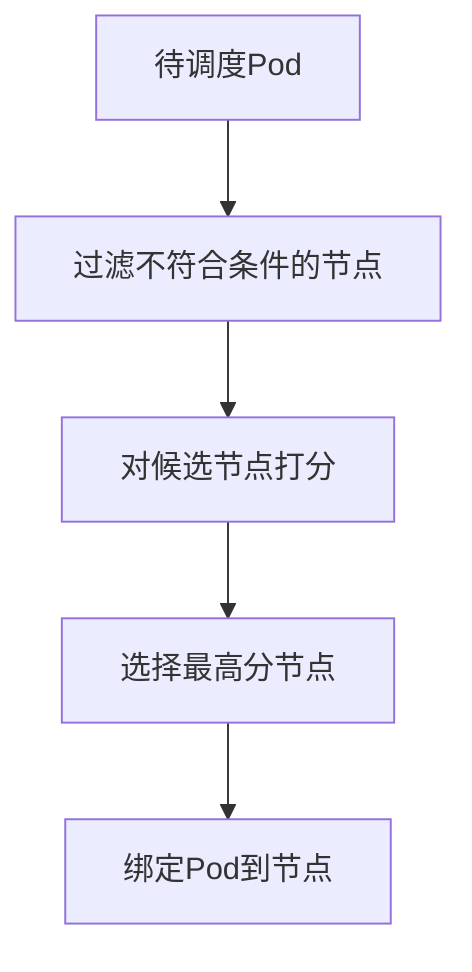
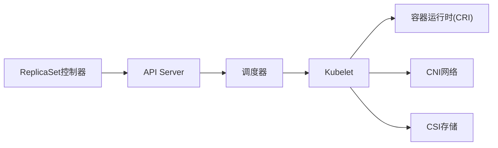

# 基础工作负载

<cite>
**本文引用的文件**   
- [pkg/controller/replicaset/replica_set.go](file://pkg/controller/replicaset/replica_set.go)
- [staging/src/k8s.io/api/core/v1/types.go](file://staging/src/k8s.io/api/core/v1/types.go)
- [staging/src/k8s.io/api/apps/v1/types.go](file://staging/src/k8s.io/api/apps/v1/types.go)
- [pkg/scheduler/scheduler.go](file://pkg/scheduler/scheduler.go)
- [pkg/kubelet/kubelet_pods.go](file://pkg/kubelet/kubelet_pods.go)
- [pkg/probe/probe.go](file://pkg/probe/probe.go)
- [hack/testdata/pod.yaml](file://hack/testdata/pod.yaml)
- [hack/testdata/frontend-replicaset.yaml](file://hack/testdata/frontend-replicaset.yaml)
</cite>

## 目录
1. [简介](#简介)
2. [项目结构](#项目结构)
3. [核心组件](#核心组件)
4. [架构总览](#架构总览)
5. [详细组件分析](#详细组件分析)
6. [依赖关系分析](#依赖关系分析)
7. [性能考量](#性能考量)
8. [故障排查指南](#故障排查指南)
9. [结论](#结论)
10. [附录](#附录)

## 简介
本章节面向Kubernetes基础工作负载资源，聚焦Pod与ReplicaSet的核心概念、定义结构与配置方式。内容涵盖：
- Pod作为最小部署单元的特性：容器定义、生命周期管理、健康检查探针、资源限制与调度策略
- ReplicaSet的副本管理机制：期望状态维护、自动扩缩容、滚动更新与故障恢复
- 丰富的YAML使用场景示例（单容器应用、多容器协作、资源隔离等）
- Pod生命周期状态转换、重启策略、亲和性调度与最佳实践
- 基础工作负载之间的依赖关系与管理模式

## 项目结构
围绕Pod与ReplicaSet的实现，仓库中与本主题密切相关的代码与样例分布如下：
- API类型定义：core/v1与apps/v1中定义了Pod、Container、Probe、ResourceRequirements、ReplicaSet等核心对象
- 控制器实现：replicaset控制器负责维持副本数与期望状态
- 调度器：负责将Pod调度到合适的节点
- Kubelet：在节点上执行Pod生命周期管理、探针探测、资源隔离等
- 测试样例：包含Pod与ReplicaSet的YAML示例，便于理解字段用法

图表来源
- [staging/src/k8s.io/api/core/v1/types.go](file://staging/src/k8s.io/api/core/v1/types.go)
- [staging/src/k8s.io/api/apps/v1/types.go](file://staging/src/k8s.io/api/apps/v1/types.go)
- [pkg/controller/replicaset/replica_set.go](file://pkg/controller/replicaset/replica_set.go)
- [pkg/scheduler/scheduler.go](file://pkg/scheduler/scheduler.go)
- [pkg/kubelet/kubelet_pods.go](file://pkg/kubelet/kubelet_pods.go)

章节来源
- [staging/src/k8s.io/api/core/v1/types.go](file://staging/src/k8s.io/api/core/v1/types.go)
- [staging/src/k8s.io/api/apps/v1/types.go](file://staging/src/k8s.io/api/apps/v1/types.go)
- [pkg/controller/replicaset/replica_set.go](file://pkg/controller/replicaset/replica_set.go)
- [pkg/scheduler/scheduler.go](file://pkg/scheduler/scheduler.go)
- [pkg/kubelet/kubelet_pods.go](file://pkg/kubelet/kubelet_pods.go)

## 核心组件
本节从“概念—数据结构—行为”三个维度梳理Pod与ReplicaSet。

- Pod
  - 概念：最小可部署的计算单元，封装一个或多个紧密耦合的容器、存储卷、网络IP及生命周期选项
  - 关键数据结构要点
    - 容器列表、镜像、命令与参数、环境变量、端口、卷挂载、安全上下文
    - 资源请求与限制（CPU、内存等），用于调度与QoS评估
    - 健康检查探针（liveness/readiness/startup），HTTP/TCP/gRPC/Exec
    - 启动与终止钩子、重启策略、退出码处理
    - 亲和性与反亲和性、容忍度与污点、拓扑约束
  - 行为要点
    - 由调度器选择节点，Kubelet拉取镜像并创建容器
    - 探针驱动就绪/存活判定，影响服务发现与重启决策
    - 事件与状态上报至API Server

- ReplicaSet
  - 概念：确保指定数量的Pod副本处于运行状态，提供声明式副本管理与基本自愈能力
  - 关键数据结构要点
    - 标签选择器（selector）、模板（podTemplateSpec）、期望副本数（replicas）
    - 状态字段：当前副本数、就绪副本数、失败副本数、观察版本等
  - 行为要点
    - 对比实际与期望，增删Pod以收敛
    - 支持滚动更新（通过替换模板或配合Deployment）
    - 与HPA联动实现弹性伸缩

章节来源
- [staging/src/k8s.io/api/core/v1/types.go](file://staging/src/k8s.io/api/core/v1/types.go)
- [staging/src/k8s.io/api/apps/v1/types.go](file://staging/src/k8s.io/api/apps/v1/types.go)

## 架构总览
下图展示从用户提交到Pod运行的端到端流程，以及ReplicaSet如何参与副本管理。

图表来源
- [pkg/controller/replicaset/replica_set.go](file://pkg/controller/replicaset/replica_set.go)
- [pkg/scheduler/scheduler.go](file://pkg/scheduler/scheduler.go)
- [pkg/kubelet/kubelet_pods.go](file://pkg/kubelet/kubelet_pods.go)
- [pkg/probe/probe.go](file://pkg/probe/probe.go)

## 详细组件分析

### Pod：最小部署单元
- 容器定义
  - 镜像、入口命令与参数、环境变量、端口暴露、卷挂载、安全上下文
  - 多容器共享Pod网络与存储，适合Sidecar/Adapter/Proxy等协作模式
- 生命周期管理
  - 启动阶段：初始化容器→主容器启动→启动探针成功
  - 运行阶段：存活探针决定是否需要重启；就绪探针决定是否加入Service流量
  - 终止阶段：优雅关闭信号、终止宽限期、强制终止
- 健康检查探针
  - HTTP/TCP/gRPC/Exec四种类型，支持初始延迟、间隔、超时、失败阈值
  - 就绪探针常用于滚动更新与蓝绿发布中的流量切换
- 资源限制与QoS
  - requests/limits决定调度优先级与OOM优先级
  - QoS等级：Guaranteed/Burstable/BestEffort
- 调度策略
  - 节点选择器、亲和/反亲和、拓扑分布、容忍度与污点、资源需求
- 典型YAML场景
  - 单容器应用：仅一个业务容器
  - 多容器协作：业务+日志采集/代理
  - 资源隔离：不同QoS与资源配额

图表来源
- [pkg/kubelet/kubelet_pods.go](file://pkg/kubelet/kubelet_pods.go)
- [pkg/probe/probe.go](file://pkg/probe/probe.go)

章节来源
- [staging/src/k8s.io/api/core/v1/types.go](file://staging/src/k8s.io/api/core/v1/types.go)
- [pkg/kubelet/kubelet_pods.go](file://pkg/kubelet/kubelet_pods.go)
- [pkg/probe/probe.go](file://pkg/probe/probe.go)

### ReplicaSet：副本管理
- 期望状态维护
  - 通过标签选择器匹配Pod集合，比较replicas与实际数量，进行增删
- 自动扩缩容
  - 与HPA集成时，根据指标调整replicas
- 滚动更新
  - 通过更新模板触发新RS创建，逐步替换旧Pod
- 故障恢复
  - 监控Pod状态，异常则重建以满足期望副本数

图表来源
- [staging/src/k8s.io/api/apps/v1/types.go](file://staging/src/k8s.io/api/apps/v1/types.go)
- [pkg/controller/replicaset/replica_set.go](file://pkg/controller/replicaset/replica_set.go)

章节来源
- [staging/src/k8s.io/api/apps/v1/types.go](file://staging/src/k8s.io/api/apps/v1/types.go)
- [pkg/controller/replicaset/replica_set.go](file://pkg/controller/replicaset/replica_set.go)

### 调度与亲和性
- 调度关键点
  - 基于资源需求、节点标签、污点/容忍、拓扑域与自定义插件
- 亲和性/反亲和性
  - 节点级与Pod级两种，支持硬规则与软权重
- 拓扑分布
  - 结合拓扑键与最大每拓扑实例数提升可用性

图表来源
- [pkg/scheduler/scheduler.go](file://pkg/scheduler/scheduler.go)

章节来源
- [pkg/scheduler/scheduler.go](file://pkg/scheduler/scheduler.go)
- [staging/src/k8s.io/api/core/v1/types.go](file://staging/src/k8s.io/api/core/v1/types.go)

## 依赖关系分析
- 组件耦合
  - ReplicaSet控制器依赖API Server与调度器，间接依赖Kubelet
  - Kubelet依赖容器运行时与探针子系统
- 外部依赖
  - 容器运行时（如containerd/CRI-O）
  - 网络插件（CNI）与存储插件（CSI）
- 接口契约
  - API Server作为唯一事实源，控制器与调度器通过watch/list同步状态
  - Kubelet通过CRI与kubelet API与系统交互

图表来源
- [pkg/controller/replicaset/replica_set.go](file://pkg/controller/replicaset/replica_set.go)
- [pkg/scheduler/scheduler.go](file://pkg/scheduler/scheduler.go)
- [pkg/kubelet/kubelet_pods.go](file://pkg/kubelet/kubelet_pods.go)

章节来源
- [pkg/controller/replicaset/replica_set.go](file://pkg/controller/replicaset/replica_set.go)
- [pkg/scheduler/scheduler.go](file://pkg/scheduler/scheduler.go)
- [pkg/kubelet/kubelet_pods.go](file://pkg/kubelet/kubelet_pods.go)

## 性能考量
- 合理设置资源requests/limits，避免过度预留导致调度抖动
- 使用就绪探针减少滚动更新期间的流量中断
- 利用亲和/反亲和与拓扑分布提高可用性与负载均衡
- 控制探针频率与超时，降低Kubelet与API压力
- 为高吞吐工作负载选择合适的QoS等级，避免被优先驱逐

## 故障排查指南
- Pod无法调度
  - 检查资源不足、节点污点/容忍、亲和/反亲和规则是否过严
- 容器频繁重启
  - 查看liveness探针与退出码，确认应用启动逻辑与资源限制
- 服务不可达
  - 检查readiness探针与Service Endpoints，确认Pod是否Ready
- 滚动更新卡住
  - 关注新旧Pod状态、探针结果与事件，必要时回滚或调整策略

章节来源
- [pkg/kubelet/kubelet_pods.go](file://pkg/kubelet/kubelet_pods.go)
- [pkg/probe/probe.go](file://pkg/probe/probe.go)

## 结论
Pod与ReplicaSet构成了Kubernetes最基础的工作负载模型。通过声明式的API与控制器循环，集群能够自动收敛到期望状态，并在调度、健康检查、资源隔离等方面提供稳定保障。配合亲和性、探针与资源策略，可在保证可用性的同时获得良好的性能表现。

## 附录

### YAML配置示例与参考路径
以下为常见使用场景的YAML示例路径，可直接参考其字段组织与组合方式：
- 单容器应用
  - [示例路径](file://hack/testdata/pod.yaml)
- 多容器协作（Sidecar/Adapter等）
  - 参考同一文件中多容器编排方式
- 资源隔离与QoS
  - 在同一文件中设置requests/limits与securityContext
- ReplicaSet示例
  - [示例路径](file://hack/testdata/frontend-replicaset.yaml)

章节来源
- [hack/testdata/pod.yaml](file://hack/testdata/pod.yaml)
- [hack/testdata/frontend-replicaset.yaml](file://hack/testdata/frontend-replicaset.yaml)