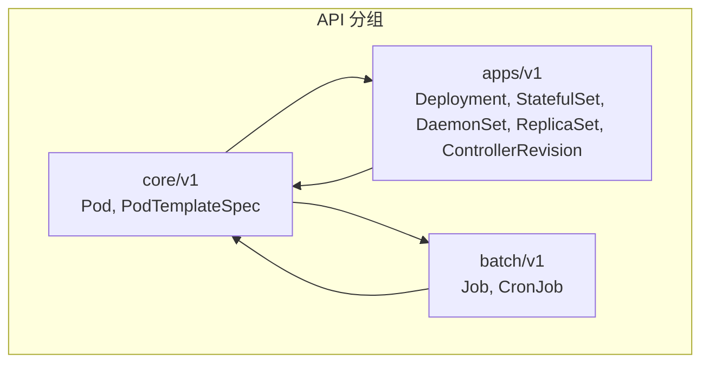
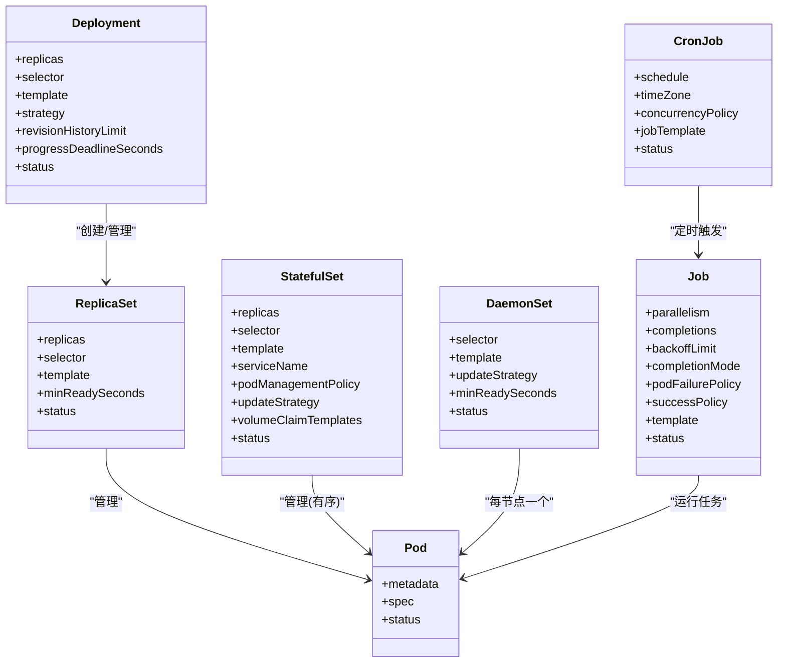
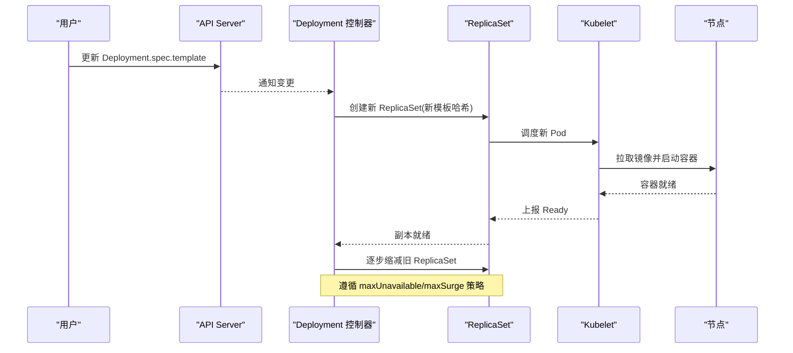
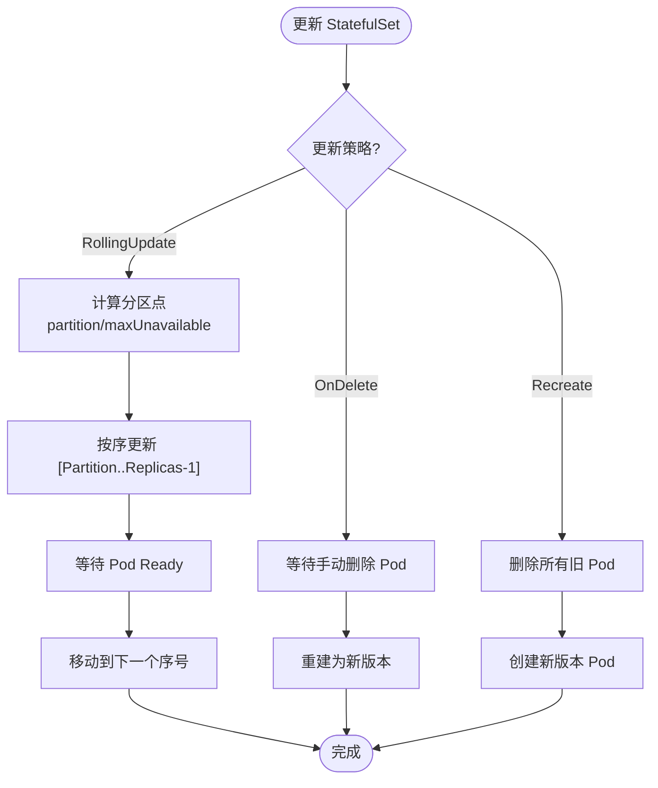
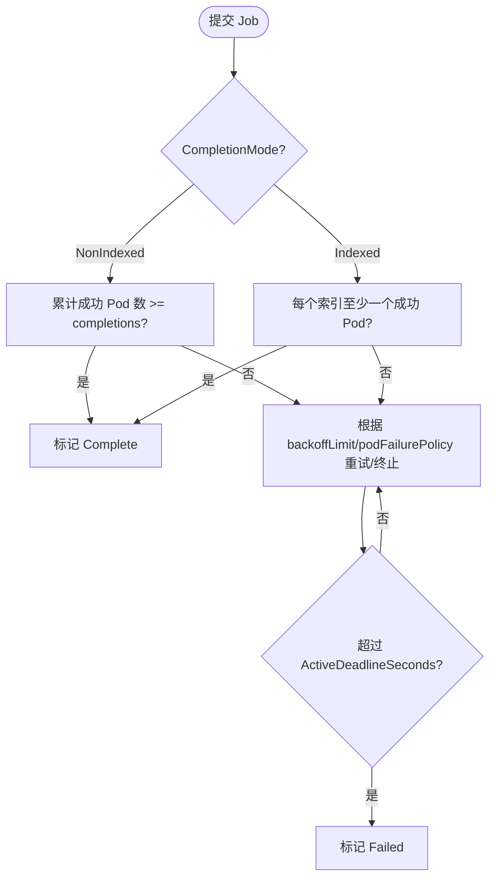
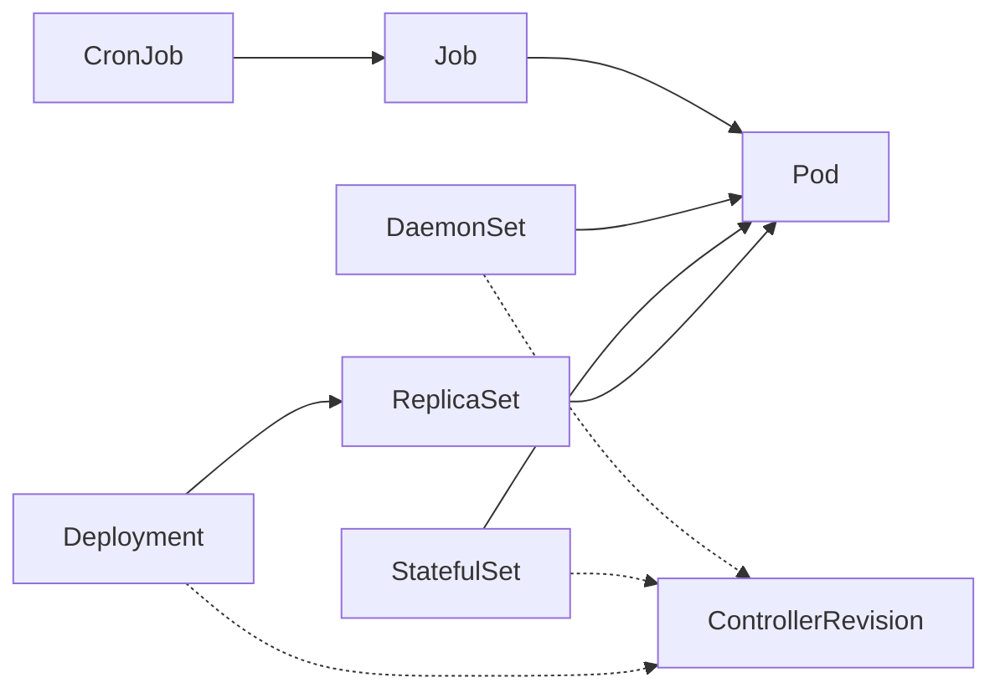

# 工作负载资源

<cite>
**本文引用的文件**   
- [staging/src/k8s.io/api/core/v1/types.go](file://staging/src/k8s.io/api/core/v1/types.go)
- [staging/src/k8s.io/api/apps/v1/types.go](file://staging/src/k8s.io/api/apps/v1/types.go)
- [staging/src/k8s.io/api/batch/v1/types.go](file://staging/src/k8s.io/api/batch/v1/types.go)
</cite>

## 目录
1. [简介](#简介)
2. [项目结构](#项目结构)
3. [核心组件](#核心组件)
4. [架构总览](#架构总览)
5. [详细组件分析](#详细组件分析)
6. [依赖关系分析](#依赖关系分析)
7. [性能与可用性考量](#性能与可用性考量)
8. [故障排查指南](#故障排查指南)
9. [结论](#结论)
10. [附录：YAML 配置要点与示例路径](#附录yaml-配置要点与示例路径)

## 简介
本文件面向 Kubernetes 工作负载资源的定义、用途与配置方式，覆盖 Pod、Deployment、StatefulSet、DaemonSet、ReplicaSet、Job、CronJob 等核心对象。文档从 API 类型定义出发，解释字段结构、生命周期状态转换、副本管理策略与滚动更新机制，并给出调度策略、健康检查、资源限制与最佳实践建议。同时梳理工作负载之间的依赖关系与级联操作（如 Deployment -> ReplicaSet -> Pod）。

## 项目结构
Kubernetes 的工作负载 API 定义位于 staging 模块的 api 包中：
- core/v1：Pod 及其模板、基础条件等
- apps/v1：Deployment、StatefulSet、DaemonSet、ReplicaSet、ControllerRevision
- batch/v1：Job、CronJob

图表来源
- [staging/src/k8s.io/api/core/v1/types.go:5490-5513](file://staging/src/k8s.io/api/core/v1/types.go#L5490-L5513)
- [staging/src/k8s.io/api/apps/v1/types.go:396-413](file://staging/src/k8s.io/api/apps/v1/types.go#L396-L413)
- [staging/src/k8s.io/api/batch/v1/types.go:68-86](file://staging/src/k8s.io/api/batch/v1/types.go#L68-L86)

章节来源
- [staging/src/k8s.io/api/core/v1/types.go:5490-5513](file://staging/src/k8s.io/api/core/v1/types.go#L5490-L5513)
- [staging/src/k8s.io/api/apps/v1/types.go:396-413](file://staging/src/k8s.io/api/apps/v1/types.go#L396-L413)
- [staging/src/k8s.io/api/batch/v1/types.go:68-86](file://staging/src/k8s.io/api/batch/v1/types.go#L68-L86)

## 核心组件
本节概述各工作负载的职责与关键能力：
- Pod：最小可部署单元，承载一个或多个容器，具备网络、存储、安全上下文等。
- ReplicaSet：确保指定数量的 Pod 副本运行，作为 Deployment 的基础构建块。
- Deployment：声明式无状态应用升级，支持滚动更新、回滚、暂停/恢复。
- StatefulSet：有状态应用，提供稳定网络标识与持久化卷绑定，有序扩缩容与更新。
- DaemonSet：在每个（或匹配）节点上运行一个 Pod 副本，适合日志采集、监控代理等。
- Job：一次性任务执行，支持并行、失败重试、完成计数、索引模式等。
- CronJob：基于时间表的周期性触发 Job，支持并发策略、历史保留等。

章节来源
- [staging/src/k8s.io/api/core/v1/types.go:5490-5513](file://staging/src/k8s.io/api/core/v1/types.go#L5490-L5513)
- [staging/src/k8s.io/api/apps/v1/types.go:866-936](file://staging/src/k8s.io/api/apps/v1/types.go#L866-L936)
- [staging/src/k8s.io/api/apps/v1/types.go:396-461](file://staging/src/k8s.io/api/apps/v1/types.go#L396-L461)
- [staging/src/k8s.io/api/apps/v1/types.go:51-297](file://staging/src/k8s.io/api/apps/v1/types.go#L51-L297)
- [staging/src/k8s.io/api/apps/v1/types.go:814-835](file://staging/src/k8s.io/api/apps/v1/types.go#L814-L835)
- [staging/src/k8s.io/api/batch/v1/types.go:68-477](file://staging/src/k8s.io/api/batch/v1/types.go#L68-L477)
- [staging/src/k8s.io/api/batch/v1/types.go:678-765](file://staging/src/k8s.io/api/batch/v1/types.go#L678-L765)

## 架构总览
工作负载控制器通过标签选择器与 Pod 模板协调期望状态与实际状态，驱动 Pod 的创建、删除与更新。典型层级关系如下：
- Deployment 管理多个 ReplicaSet（按模板哈希区分），每个 ReplicaSet 管理一组 Pod
- StatefulSet 直接管理具有稳定身份与存储绑定的 Pod
- DaemonSet 在节点维度保证每个目标节点存在一个 Pod
- Job/CronJob 以“任务”为中心，控制 Pod 的生命周期直至完成

图表来源
- [staging/src/k8s.io/api/apps/v1/types.go:396-461](file://staging/src/k8s.io/api/apps/v1/types.go#L396-L461)
- [staging/src/k8s.io/api/apps/v1/types.go:866-936](file://staging/src/k8s.io/api/apps/v1/types.go#L866-L936)
- [staging/src/k8s.io/api/apps/v1/types.go:51-297](file://staging/src/k8s.io/api/apps/v1/types.go#L51-L297)
- [staging/src/k8s.io/api/apps/v1/types.go:814-835](file://staging/src/k8s.io/api/apps/v1/types.go#L814-L835)
- [staging/src/k8s.io/api/batch/v1/types.go:68-477](file://staging/src/k8s.io/api/batch/v1/types.go#L68-L477)
- [staging/src/k8s.io/api/batch/v1/types.go:678-765](file://staging/src/k8s.io/api/batch/v1/types.go#L678-L765)
- [staging/src/k8s.io/api/core/v1/types.go:5490-5513](file://staging/src/k8s.io/api/core/v1/types.go#L5490-L5513)

## 详细组件分析

### Pod
- 职责：描述单个或多个容器的运行环境，包括镜像、端口、环境变量、探针、存储挂载、安全上下文、亲和性/反亲和性等。
- 关键字段
  - spec：容器列表、重启策略、探针、资源请求/限制、卷、网络、主机名等
  - status：阶段、容器状态、事件等
- 生命周期状态转换（概念）
  - Pending -> Running -> Succeeded/Failed
  - 受探针、重启策略、驱逐、节点问题影响
- 健康检查
  - livenessProbe/readinessProbe/startupProbe 决定存活、就绪与启动探测
- 调度策略
  - nodeSelector、affinity/anti-affinity、tolerations、topologySpreadConstraints 等
- 资源限制
  - requests/limits 影响调度与 QoS 等级

章节来源
- [staging/src/k8s.io/api/core/v1/types.go:5490-5513](file://staging/src/k8s.io/api/core/v1/types.go#L5490-L5513)

### ReplicaSet
- 职责：确保指定数量的 Pod 副本处于运行状态，是 Deployment 的基础构件。
- 关键字段
  - replicas：期望副本数
  - selector：标签选择器，必须与 Pod 模板一致
  - template：Pod 模板
  - minReadySeconds：可用判定等待时间
- 状态字段
  - replicas/readyReplicas/availableReplicas/fullyLabeledReplicas/conditions
- 副本管理
  - 当实际副本少于期望时创建新 Pod；过多则删除旧 Pod
- 与 Deployment 的关系
  - Deployment 通过不同模板哈希生成新的 ReplicaSet，实现滚动更新与回滚

章节来源
- [staging/src/k8s.io/api/apps/v1/types.go:866-936](file://staging/src/k8s.io/api/apps/v1/types.go#L866-L936)
- [staging/src/k8s.io/api/apps/v1/types.go:938-1003](file://staging/src/k8s.io/api/apps/v1/types.go#L938-L1003)

### Deployment
- 职责：声明式无状态应用的版本管理与滚动更新。
- 关键字段
  - replicas、selector、template
  - strategy：Recreate 或 RollingUpdate（含 maxUnavailable/maxSurge）
  - revisionHistoryLimit：保留的历史版本数量
  - progressDeadlineSeconds：进度超时阈值
  - paused：是否暂停更新
- 滚动更新机制
  - 创建新 ReplicaSet（带新模板哈希），逐步将流量从旧 ReplicaSet 迁移到新 ReplicaSet
  - 通过 maxUnavailable 控制不可用上限，maxSurge 控制超出期望的上限
- 状态与条件
  - Available、Progressing、ReplicaFailure 等条件反映整体可用性、推进与错误
- 回滚
  - 借助历史 ReplicaSet 进行回滚

图表来源
- [staging/src/k8s.io/api/apps/v1/types.go:396-461](file://staging/src/k8s.io/api/apps/v1/types.go#L396-L461)
- [staging/src/k8s.io/api/apps/v1/types.go:470-524](file://staging/src/k8s.io/api/apps/v1/types.go#L470-L524)
- [staging/src/k8s.io/api/apps/v1/types.go:526-612](file://staging/src/k8s.io/api/apps/v1/types.go#L526-L612)

章节来源
- [staging/src/k8s.io/api/apps/v1/types.go:396-461](file://staging/src/k8s.io/api/apps/v1/types.go#L396-L461)
- [staging/src/k8s.io/api/apps/v1/types.go:470-524](file://staging/src/k8s.io/api/apps/v1/types.go#L470-L524)
- [staging/src/k8s.io/api/apps/v1/types.go:526-612](file://staging/src/k8s.io/api/apps/v1/types.go#L526-L612)

### StatefulSet
- 职责：为有状态应用提供稳定的网络标识与持久化存储绑定，支持有序扩缩容与更新。
- 关键字段
  - replicas、selector、template、serviceName、podManagementPolicy、updateStrategy、volumeClaimTemplates、revisionHistoryLimit、minReadySeconds、persistentVolumeClaimRetentionPolicy、ordinals
- 更新策略
  - RollingUpdate：按序更新，支持 partition 与 maxUnavailable
  - OnDelete：手动删除 Pod 后重建
  - Recreate（特性门控）：全部删除后再创建新版本
- 卷策略
  - VolumeClaimTemplates 为每个 Pod 创建 PVC，删除/缩容时可配置 Retain/Delete
- 编号与命名
  - 默认从 0 开始，可通过 ordinals.start 调整起始索引

图表来源
- [staging/src/k8s.io/api/apps/v1/types.go:51-297](file://staging/src/k8s.io/api/apps/v1/types.go#L51-L297)
- [staging/src/k8s.io/api/apps/v1/types.go:127-146](file://staging/src/k8s.io/api/apps/v1/types.go#L127-L146)
- [staging/src/k8s.io/api/apps/v1/types.go:166-182](file://staging/src/k8s.io/api/apps/v1/types.go#L166-L182)

章节来源
- [staging/src/k8s.io/api/apps/v1/types.go:51-297](file://staging/src/k8s.io/api/apps/v1/types.go#L51-L297)

### DaemonSet
- 职责：在每个（或匹配）节点上运行一个 Pod 副本，适用于守护进程类工作负载。
- 关键字段
  - selector、template、updateStrategy（RollingUpdate/OnDelete）、minReadySeconds、revisionHistoryLimit
- 滚动更新
  - 支持 maxUnavailable 与 maxSurge，按节点逐个替换
- 状态指标
  - currentNumberScheduled/desiredNumberScheduled/numberReady/updatedNumberScheduled 等

章节来源
- [staging/src/k8s.io/api/apps/v1/types.go:814-835](file://staging/src/k8s.io/api/apps/v1/types.go#L814-L835)
- [staging/src/k8s.io/api/apps/v1/types.go:628-729](file://staging/src/k8s.io/api/apps/v1/types.go#L628-L729)
- [staging/src/k8s.io/api/apps/v1/types.go:731-785](file://staging/src/k8s.io/api/apps/v1/types.go#L731-L785)

### Job
- 职责：表示一次性任务，支持并行执行、失败重试、完成计数、索引模式等。
- 关键字段
  - parallelism、completions、activeDeadlineSeconds、backoffLimit、backoffLimitPerIndex、maxFailedIndexes、completionMode、podFailurePolicy、successPolicy、podReplacementPolicy、ttlSecondsAfterFinished、suspend、managedBy、template
- 完成模式
  - NonIndexed：任意 completions 个成功即完成
  - Indexed：每个索引对应一个 Pod，需全部索引完成
- 失败策略
  - podFailurePolicy：根据退出码或 Pod 条件决定 FailJob/FailIndex/Ignore/Count
  - successPolicy：允许提前满足成功条件（仅 Indexed）
- 状态与条件
  - Complete/Failed/Suspended/FailureTarget/SuccessCriteriaMet 等

图表来源
- [staging/src/k8s.io/api/batch/v1/types.go:303-477](file://staging/src/k8s.io/api/batch/v1/types.go#L303-L477)
- [staging/src/k8s.io/api/batch/v1/types.go:479-658](file://staging/src/k8s.io/api/batch/v1/types.go#L479-L658)

章节来源
- [staging/src/k8s.io/api/batch/v1/types.go:68-477](file://staging/src/k8s.io/api/batch/v1/types.go#L68-L477)
- [staging/src/k8s.io/api/batch/v1/types.go:479-658](file://staging/src/k8s.io/api/batch/v1/types.go#L479-L658)

### CronJob
- 职责：基于时间表周期性触发 Job，支持并发策略、时区、历史保留等。
- 关键字段
  - schedule、timeZone、startingDeadlineSeconds、concurrencyPolicy（Allow/Forbid/Replace）、suspend、jobTemplate、successfulJobsHistoryLimit、failedJobsHistoryLimit
- 并发策略
  - Allow：允许并发运行
  - Forbid：禁止并发，跳过下一次直到上一次完成
  - Replace：取消当前运行并替换为新 Job
- 状态
  - active、lastScheduleTime、lastSuccessfulTime

章节来源
- [staging/src/k8s.io/api/batch/v1/types.go:678-765](file://staging/src/k8s.io/api/batch/v1/types.go#L678-L765)
- [staging/src/k8s.io/api/batch/v1/types.go:786-800](file://staging/src/k8s.io/api/batch/v1/types.go#L786-L800)

## 依赖关系分析
- 组合关系
  - Deployment 组合 ReplicaSet，ReplicaSet 组合 Pod
  - StatefulSet/DaemonSet 直接组合 Pod
  - CronJob 组合 Job，Job 组合 Pod
- 选择器与模板
  - 所有控制器均依赖 label selector 与 PodTemplateSpec 来识别与管理 Pod
- 版本与回滚
  - Deployment/StatefulSet/DaemonSet 使用 ControllerRevision 记录版本快照，支持回滚

图表来源
- [staging/src/k8s.io/api/apps/v1/types.go:1009-1047](file://staging/src/k8s.io/api/apps/v1/types.go#L1009-L1047)
- [staging/src/k8s.io/api/apps/v1/types.go:396-461](file://staging/src/k8s.io/api/apps/v1/types.go#L396-L461)
- [staging/src/k8s.io/api/apps/v1/types.go:866-936](file://staging/src/k8s.io/api/apps/v1/types.go#L866-L936)
- [staging/src/k8s.io/api/apps/v1/types.go:814-835](file://staging/src/k8s.io/api/apps/v1/types.go#L814-L835)
- [staging/src/k8s.io/api/batch/v1/types.go:678-765](file://staging/src/k8s.io/api/batch/v1/types.go#L678-L765)
- [staging/src/k8s.io/api/batch/v1/types.go:68-477](file://staging/src/k8s.io/api/batch/v1/types.go#L68-L477)

章节来源
- [staging/src/k8s.io/api/apps/v1/types.go:1009-1047](file://staging/src/k8s.io/api/apps/v1/types.go#L1009-L1047)
- [staging/src/k8s.io/api/apps/v1/types.go:396-461](file://staging/src/k8s.io/api/apps/v1/types.go#L396-L461)
- [staging/src/k8s.io/api/apps/v1/types.go:866-936](file://staging/src/k8s.io/api/apps/v1/types.go#L866-L936)
- [staging/src/k8s.io/api/apps/v1/types.go:814-835](file://staging/src/k8s.io/api/apps/v1/types.go#L814-L835)
- [staging/src/k8s.io/api/batch/v1/types.go:678-765](file://staging/src/k8s.io/api/batch/v1/types.go#L678-L765)
- [staging/src/k8s.io/api/batch/v1/types.go:68-477](file://staging/src/k8s.io/api/batch/v1/types.go#L68-L477)

## 性能与可用性考量
- 滚动更新参数
  - Deployment：合理设置 maxUnavailable 与 maxSurge，避免资源抖动与服务中断
  - StatefulSet：谨慎使用 maxUnavailable 与 OrderedReady，结合 minReadySeconds 保障数据一致性
  - DaemonSet：maxUnavailable 与 maxSurge 控制节点级更新节奏
- 副本与容量规划
  - 依据业务峰值与 SLA 设定副本数，预留扩容空间
- 健康检查与就绪
  - 配置合适的 readinessProbe 与 startupProbe，避免过早纳入服务发现
- 资源请求与限制
  - 明确 requests/limits，提升调度质量与 QoS 稳定性
- 失败与重试
  - Job 使用 podFailurePolicy 与 backoffLimit 精细控制重试行为，避免雪崩

[本节为通用指导，不直接分析具体文件]

## 故障排查指南
- 查看控制器状态与条件
  - Deployment：Available/Progressing/ReplicaFailure
  - StatefulSet：Conditions 包含 Progressing 等
  - DaemonSet：NumberReady/NumberUnavailable 等
  - Job：Complete/Failed/Suspended/FailureTarget/SuccessCriteriaMet
- 常见原因定位
  - 标签选择器不匹配导致无法创建 Pod
  - 资源不足/配额限制导致调度失败
  - 探针失败导致不可用或反复重启
  - 滚动更新卡住：检查 maxUnavailable/maxSurge、minReadySeconds、进度超时
- 诊断步骤
  - 查看控制器 Conditions 与事件
  - 检查关联的 ReplicaSet/Job 状态
  - 查看 Pod 事件与日志，确认探针与退出码

章节来源
- [staging/src/k8s.io/api/apps/v1/types.go:526-612](file://staging/src/k8s.io/api/apps/v1/types.go#L526-L612)
- [staging/src/k8s.io/api/apps/v1/types.go:347-372](file://staging/src/k8s.io/api/apps/v1/types.go#L347-L372)
- [staging/src/k8s.io/api/apps/v1/types.go:731-785](file://staging/src/k8s.io/api/apps/v1/types.go#L731-L785)
- [staging/src/k8s.io/api/batch/v1/types.go:602-658](file://staging/src/k8s.io/api/batch/v1/types.go#L602-L658)

## 结论
Kubernetes 工作负载资源通过声明式 API 与控制器闭环，实现了从期望到实际的自动收敛。选择合适的负载类型与参数，配合健康检查、资源限制与滚动更新策略，可在高可用前提下实现平滑演进与高效运维。对有状态与批处理场景，StatefulSet 与 Job/CronJob 提供了强大的治理能力。

[本节为总结性内容，不直接分析具体文件]

## 附录：YAML 配置要点与示例路径
以下为常用场景的配置要点与参考位置（不包含具体 YAML 内容）：
- 无状态应用部署（Deployment）
  - 关注 replicas、selector、template、strategy（RollingUpdate 的 maxUnavailable/maxSurge）、revisionHistoryLimit、progressDeadlineSeconds
  - 参考：[staging/src/k8s.io/api/apps/v1/types.go:396-461](file://staging/src/k8s.io/api/apps/v1/types.go#L396-L461)、[staging/src/k8s.io/api/apps/v1/types.go:470-524](file://staging/src/k8s.io/api/apps/v1/types.go#L470-L524)
- 有状态服务管理（StatefulSet）
  - 关注 serviceName、podManagementPolicy、updateStrategy（RollingUpdate/OnDelete/Recreate）、volumeClaimTemplates、persistentVolumeClaimRetentionPolicy、ordinals
  - 参考：[staging/src/k8s.io/api/apps/v1/types.go:51-297](file://staging/src/k8s.io/api/apps/v1/types.go#L51-L297)
- 守护进程（DaemonSet）
  - 关注 updateStrategy（RollingUpdate/OnDelete）、maxUnavailable/maxSurge、minReadySeconds
  - 参考：[staging/src/k8s.io/api/apps/v1/types.go:628-729](file://staging/src/k8s.io/api/apps/v1/types.go#L628-L729)
- 批量任务（Job）
  - 关注 parallelism/completions、completionMode（NonIndexed/Indexed）、podFailurePolicy、successPolicy、backoffLimit/backoffLimitPerIndex、ttlSecondsAfterFinished
  - 参考：[staging/src/k8s.io/api/batch/v1/types.go:303-477](file://staging/src/k8s.io/api/batch/v1/types.go#L303-L477)
- 定时任务（CronJob）
  - 关注 schedule/timeZone、concurrencyPolicy、jobTemplate、历史保留策略
  - 参考：[staging/src/k8s.io/api/batch/v1/types.go:714-765](file://staging/src/k8s.io/api/batch/v1/types.go#L714-L765)
- Pod 健康检查与资源限制
  - 关注 liveness/readiness/startup 探针、requests/limits、nodeSelector/affinity/tolerations
  - 参考：[staging/src/k8s.io/api/core/v1/types.go:5490-5513](file://staging/src/k8s.io/api/core/v1/types.go#L5490-L5513)

章节来源
- [staging/src/k8s.io/api/apps/v1/types.go:396-461](file://staging/src/k8s.io/api/apps/v1/types.go#L396-L461)
- [staging/src/k8s.io/api/apps/v1/types.go:470-524](file://staging/src/k8s.io/api/apps/v1/types.go#L470-L524)
- [staging/src/k8s.io/api/apps/v1/types.go:51-297](file://staging/src/k8s.io/api/apps/v1/types.go#L51-L297)
- [staging/src/k8s.io/api/apps/v1/types.go:628-729](file://staging/src/k8s.io/api/apps/v1/types.go#L628-L729)
- [staging/src/k8s.io/api/batch/v1/types.go:303-477](file://staging/src/k8s.io/api/batch/v1/types.go#L303-L477)
- [staging/src/k8s.io/api/batch/v1/types.go:714-765](file://staging/src/k8s.io/api/batch/v1/types.go#L714-L765)
- [staging/src/k8s.io/api/core/v1/types.go:5490-5513](file://staging/src/k8s.io/api/core/v1/types.go#L5490-L5513)