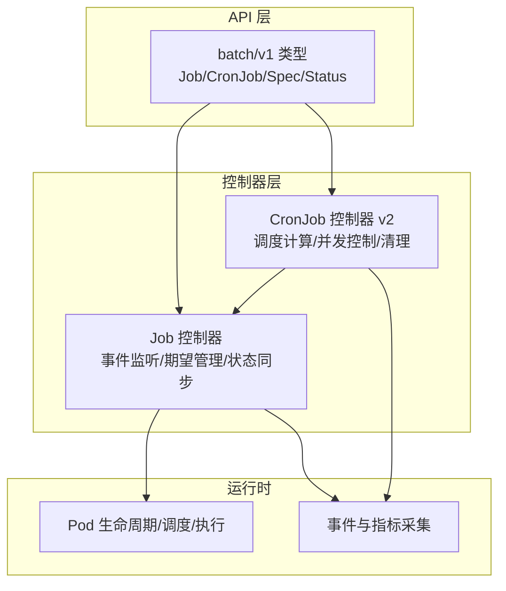
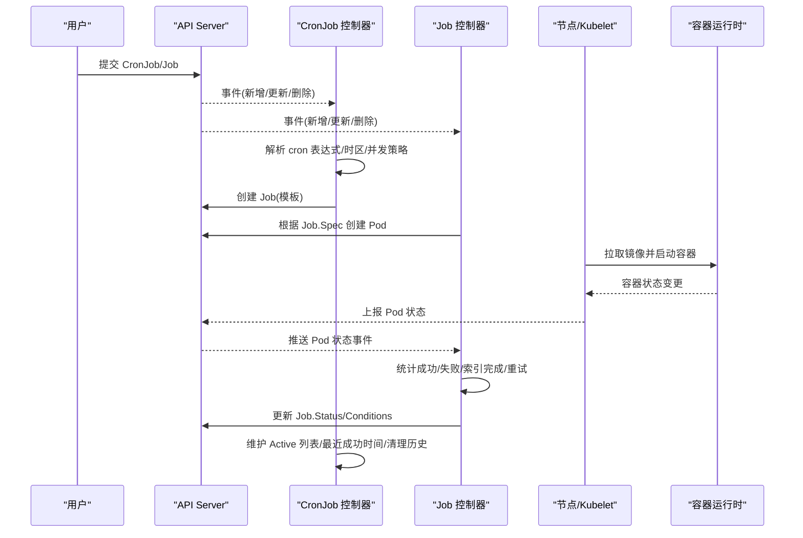
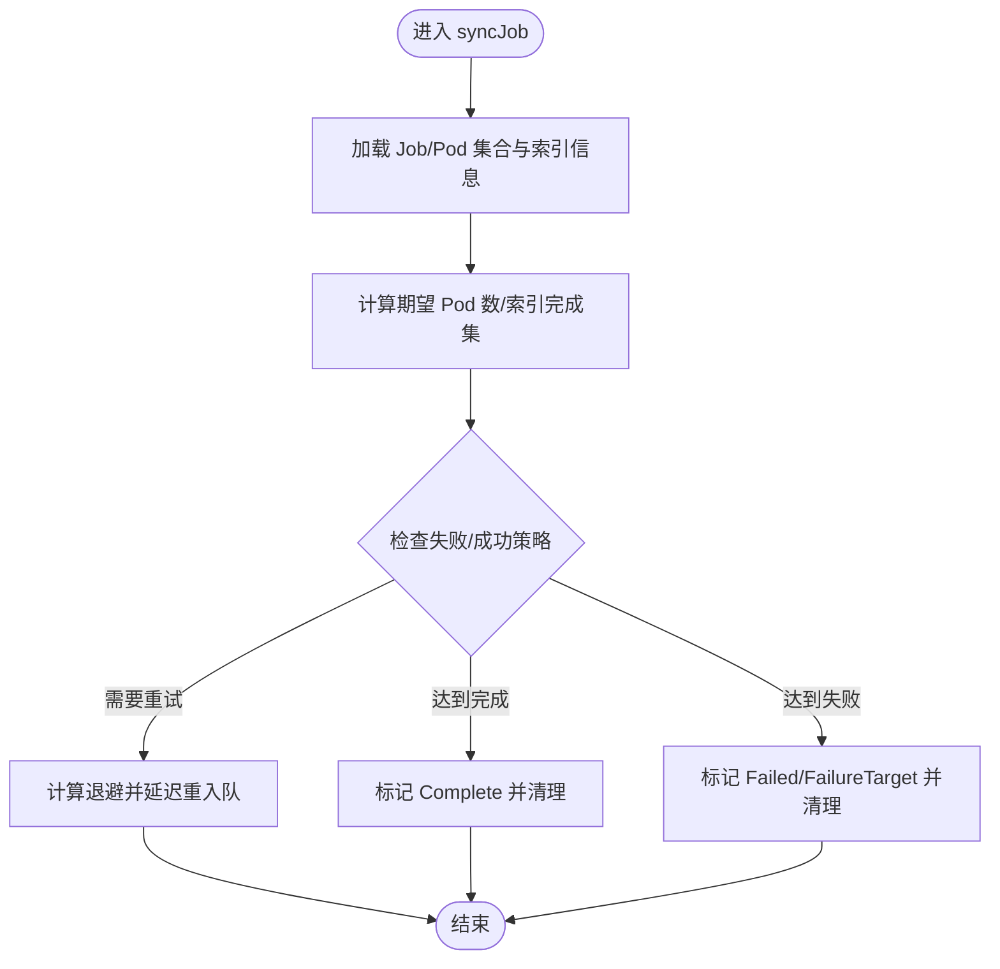
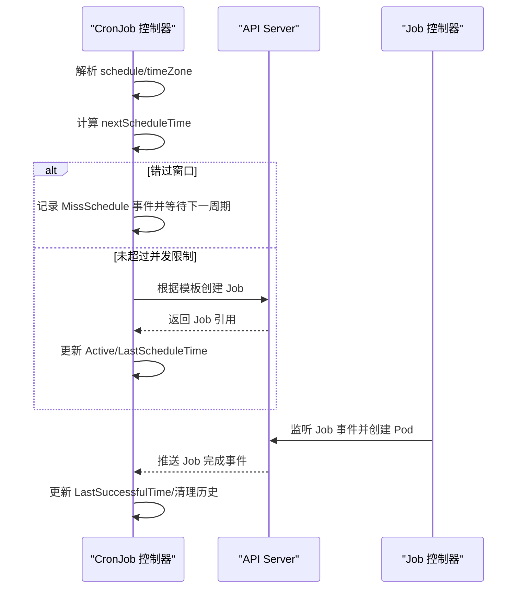
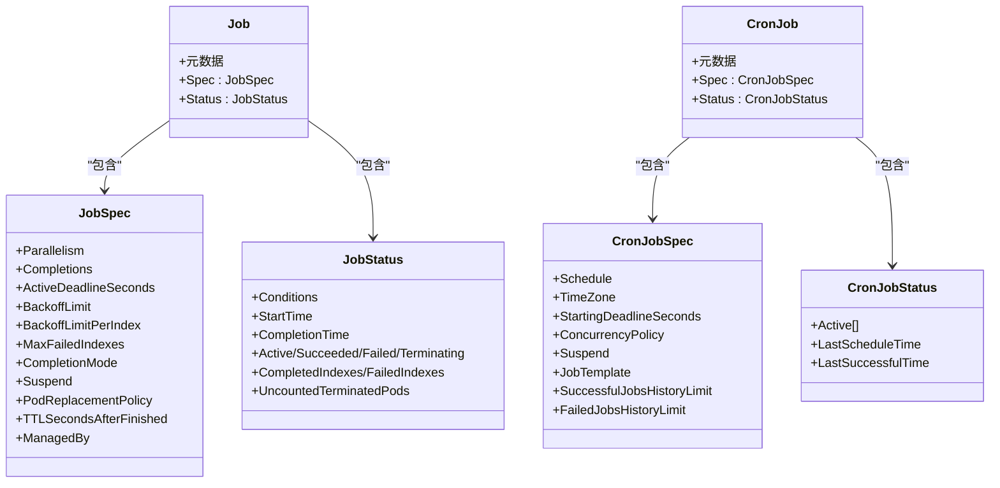
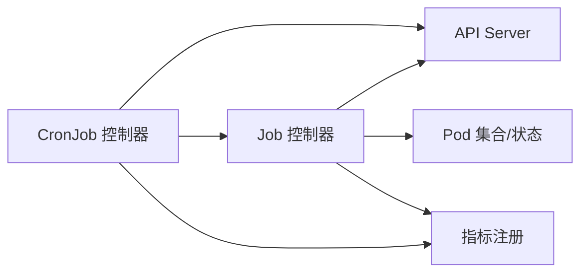

# 批处理工作负载

<cite>
**本文引用的文件**   
- [types.go](file://pkg/apis/batch/types.go)
- [job_controller.go](file://pkg/controller/job/job_controller.go)
- [metrics.go](file://pkg/controller/job/metrics/metrics.go)
- [cronjob_controllerv2.go](file://pkg/controller/cronjob/cronjob_controllerv2.go)
- [job.yaml](file://test/fixtures/doc-yaml/user-guide/job.yaml)
</cite>

## 目录
1. [简介](#简介)
2. [项目结构](#项目结构)
3. [核心组件](#核心组件)
4. [架构总览](#架构总览)
5. [详细组件分析](#详细组件分析)
6. [依赖关系分析](#依赖关系分析)
7. [性能与可观测性](#性能与可观测性)
8. [故障排查指南](#故障排查指南)
9. [结论](#结论)
10. [附录：YAML 配置示例与最佳实践](#附录yaml-配置示例与最佳实践)

## 简介
本文件面向 Kubernetes 批处理工作负载，聚焦 Job 与 CronJob 的设计理念、能力边界与生产实践。内容涵盖：
- Job 的批量任务执行：任务定义、并行度控制、重试与退避、完成条件、索引式任务（Indexed）、失败策略与成功策略、资源清理等。
- CronJob 的定时调度：cron 表达式与时区、并发控制、错过窗口处理、历史保留与清理策略。
- 监控与日志：控制器指标、事件与状态字段的使用建议。
- 资源调度与系统交互：Pod 生命周期、最终一致性保障、与调度器/存储的协作。
- 典型场景与 YAML 配置路径指引（不直接粘贴代码，提供源码路径以便查阅）。

## 项目结构
Kubernetes 中批处理相关 API 与控制器位于以下位置：
- API 类型定义：pkg/apis/batch/types.go
- Job 控制器实现：pkg/controller/job/job_controller.go
- Job 控制器指标：pkg/controller/job/metrics/metrics.go
- CronJob 控制器实现：pkg/controller/cronjob/cronjob_controllerv2.go
- 文档示例（Job）：test/fixtures/doc-yaml/user-guide/job.yaml

图表来源
- [types.go:62-78](file://pkg/apis/batch/types.go#L62-L78)
- [types.go:634-750](file://pkg/apis/batch/types.go#L634-L750)
- [job_controller.go:89-155](file://pkg/controller/job/job_controller.go#L89-L155)
- [cronjob_controllerv2.go:64-86](file://pkg/controller/cronjob/cronjob_controllerv2.go#L64-L86)

章节来源
- [types.go:62-78](file://pkg/apis/batch/types.go#L62-L78)
- [types.go:634-750](file://pkg/apis/batch/types.go#L634-L750)
- [job_controller.go:89-155](file://pkg/controller/job/job_controller.go#L89-L155)
- [cronjob_controllerv2.go:64-86](file://pkg/controller/cronjob/cronjob_controllerv2.go#L64-L86)

## 核心组件
- Job 控制器
  - 职责：监听 Job/Pod 事件，维护 Pod 副本与期望一致，统计完成/失败计数，更新 Job 状态与条件，支持索引式任务、失败策略、成功策略、TTL 清理等。
  - 关键机制：Informer + WorkQueue、期望跟踪（Expectations）、指数退避、孤儿 Pod 清理队列、可选 Workload/PodGroup 集成。
- CronJob 控制器 v2
  - 职责：基于 cron 表达式计算下次触发时间，按并发策略创建/替换/跳过 Job，维护 Active 列表与最近成功时间，清理历史 Job。
  - 关键机制：DelayingQueue、按 UID 索引查找子 Job、时区校验、错过窗口记录、历史保留限制。

章节来源
- [job_controller.go:89-155](file://pkg/controller/job/job_controller.go#L89-L155)
- [cronjob_controllerv2.go:64-86](file://pkg/controller/cronjob/cronjob_controllerv2.go#L64-L86)

## 架构总览
Job/CronJob 的整体运行流程如下：

图表来源
- [cronjob_controllerv2.go:448-696](file://pkg/controller/cronjob/cronjob_controllerv2.go#L448-L696)
- [job_controller.go:272-322](file://pkg/controller/job/job_controller.go#L272-L322)

## 详细组件分析

### Job 控制器深度解析
- 事件驱动与队列
  - 监听 Job/Pod 事件，入队到带速率限制的队列；对 Pod 事件采用批量合并延迟同步，降低频繁写状态开销。
- 期望管理与幂等性
  - 使用 Expectations 跟踪预期的 Pod 创建/删除数量，避免竞态导致的误判；支持 finalizer 跟踪以精确统计终止 Pod。
- 状态同步与条件
  - 依据 Parallelism/Completions/CompletionMode 计算目标 Pod 数，结合 SuccessPolicy/PodFailurePolicy 判定完成或失败，设置 Complete/Failed/FailureTarget 等条件。
- 索引式任务与回退
  - Indexed 模式为每个 Pod 分配 completion index，支持 per-index 回退上限 MaxFailedIndexes/BackoffLimitPerIndex，以及忽略/计数/失败索引等策略。
- 资源清理
  - TTLSecondsAfterFinished 自动删除已完成 Job；Orphan 队列清理残留 finalizer。

图表来源
- [job_controller.go:272-322](file://pkg/controller/job/job_controller.go#L272-L322)
- [job_controller.go:574-625](file://pkg/controller/job/job_controller.go#L574-L625)
- [job_controller.go:672-716](file://pkg/controller/job/job_controller.go#L672-L716)

章节来源
- [job_controller.go:89-155](file://pkg/controller/job/job_controller.go#L89-L155)
- [job_controller.go:272-322](file://pkg/controller/job/job_controller.go#L272-L322)
- [job_controller.go:574-625](file://pkg/controller/job/job_controller.go#L574-L625)
- [job_controller.go:672-716](file://pkg/controller/job/job_controller.go#L672-L716)

### CronJob 控制器 v2 深度解析
- 调度计算
  - 解析 cron 表达式与时区，计算下一次触发时间；若错过 StartingDeadlineSeconds，则记录未触发事件并等待下一周期。
- 并发控制
  - Allow：允许并行；Forbid：若已有活跃 Job 则跳过本次；Replace：取消当前运行中的 Job 再创建新 Job。
- 状态维护与清理
  - 维护 Active 列表、LastScheduleTime、LastSuccessfulTime；按 SuccessfulJobsHistoryLimit/FailedJobsHistoryLimit 清理最旧的历史 Job。
- 健壮性
  - 通过 ControllerRef 与 UID 索引确保父子关系正确；对“丢失”的活跃 Job 进行主动探测与修复。

图表来源
- [cronjob_controllerv2.go:448-696](file://pkg/controller/cronjob/cronjob_controllerv2.go#L448-L696)
- [cronjob_controllerv2.go:704-767](file://pkg/controller/cronjob/cronjob_controllerv2.go#L704-L767)

章节来源
- [cronjob_controllerv2.go:64-86](file://pkg/controller/cronjob/cronjob_controllerv2.go#L64-L86)
- [cronjob_controllerv2.go:448-696](file://pkg/controller/cronjob/cronjob_controllerv2.go#L448-L696)
- [cronjob_controllerv2.go:704-767](file://pkg/controller/cronjob/cronjob_controllerv2.go#L704-L767)

### 数据模型与关系

图表来源
- [types.go:62-78](file://pkg/apis/batch/types.go#L62-L78)
- [types.go:305-472](file://pkg/apis/batch/types.go#L305-L472)
- [types.go:474-579](file://pkg/apis/batch/types.go#L474-L579)
- [types.go:634-750](file://pkg/apis/batch/types.go#L634-L750)

## 依赖关系分析
- Job 控制器依赖
  - Informers：Job、Pod、可选 Workload/PodGroup
  - Clientset：读写 Pod/Job/Event
  - 工具：workqueue、record、clock、consistency store
- CronJob 控制器依赖
  - Informers：Job、CronJob
  - Clientset：读写 Job/CronJob/Event
  - 工具：workqueue、parsers（cron 解析）、time

图表来源
- [job_controller.go:272-322](file://pkg/controller/job/job_controller.go#L272-L322)
- [cronjob_controllerv2.go:117-154](file://pkg/controller/cronjob/cronjob_controllerv2.go#L117-L154)
- [metrics.go:216-231](file://pkg/controller/job/metrics/metrics.go#L216-L231)

章节来源
- [job_controller.go:272-322](file://pkg/controller/job/job_controller.go#L272-L322)
- [cronjob_controllerv2.go:117-154](file://pkg/controller/cronjob/cronjob_controllerv2.go#L117-L154)
- [metrics.go:216-231](file://pkg/controller/job/metrics/metrics.go#L216-L231)

## 性能与可观测性
- 指标（Job 控制器）
  - job_sync_duration_seconds：同步耗时分布（按完成模式/结果/动作）
  - job_syncs_total：同步次数
  - jobs_finished_total：完成原因分布（如 CompletionsReached、BackoffLimitExceeded、SuccessPolicy 等）
  - job_pods_finished_total：被最终化器完整跟踪的 Pod 完成数
  - pod_failures_handled_by_failure_policy_total：按策略动作分类的失败处理计数
  - terminated_pods_tracking_finalizer_total：finalizer 添加/删除计数
  - job_finished_indexes_total：索引完成计数（perIndex/global）
  - job_pods_creation_total：按原因与结果统计的 Pod 创建计数
  - stale_sync_skips_total：因 watch 缓存陈旧跳过的同步次数
- 事件与状态
  - CronJob：UnparseableSchedule/MissSchedule/JobAlreadyActive/SuccessfulCreate 等事件
  - Job：Complete/Failed/FailureTarget 条件与 Reason/Message 辅助诊断

章节来源
- [metrics.go:29-175](file://pkg/controller/job/metrics/metrics.go#L29-L175)
- [cronjob_controllerv2.go:541-585](file://pkg/controller/cronjob/cronjob_controllerv2.go#L541-L585)

## 故障排查指南
- CronJob 未触发
  - 检查 Schedule 是否合法、TimeZone 是否有效；关注 UnparseableSchedule/InvalidSchedule/UnknownTimeZone 事件。
  - 确认未处于 Suspend 状态；查看 LastScheduleTime 与 NextSchedule 计算逻辑。
- 错过执行窗口
  - 若超过 StartingDeadlineSeconds，将记录 MissSchedule 事件并等待下一周期。
- 并发冲突
  - Forbid：存在活跃 Job 会跳过本次；Replace：会删除正在运行的 Job 后新建。
- Job 长时间未完成
  - 检查 Parallelism/Completions/CompletionMode 与索引完成集；观察 FailureTarget 条件与失败策略规则匹配情况。
  - 关注 backoffLimit/backoffLimitPerIndex/maxFailedIndexes 是否导致提前失败。
- 资源泄漏与孤儿 Pod
  - 控制器维护 Orphan 队列清理残留 finalizer；必要时手动检查并清理。

章节来源
- [cronjob_controllerv2.go:541-585](file://pkg/controller/cronjob/cronjob_controllerv2.go#L541-L585)
- [job_controller.go:672-716](file://pkg/controller/job/job_controller.go#L672-L716)

## 结论
- Job 适合一次性或可重复执行的批处理任务，具备完善的并行、重试、失败/成功策略与索引式处理能力。
- CronJob 提供可靠的定时调度能力，配合并发控制与历史清理策略，适用于周期性数据处理、备份、报表生成等场景。
- 在生产环境中，应结合指标与事件进行可观测性建设，并通过合理的资源配额、超时与清理策略保障集群稳定性。

## 附录：YAML 配置示例与最佳实践
说明：本节提供配置要点与示例路径，不直接粘贴代码。请根据实际场景调整字段值。

- 基础 Job（单 Pod 执行一次）
  - 参考示例路径：[job.yaml](file://test/fixtures/doc-yaml/user-guide/job.yaml)
  - 关键点：restartPolicy=Never 或 OnFailure；合理设置 resources.requests/limits；如需重试，配置 backoffLimit。
- 并行与完成条件
  - 关键字段：spec.parallelism、spec.completions、spec.completionMode
  - 非索引模式：当成功 Pod 数达到 completions 即完成。
  - 索引模式：每个 Pod 有独立 completion index，便于分片处理。
- 失败与成功策略
  - 失败策略：spec.podFailurePolicy（FailJob/FailIndex/Ignore/Count），结合 onExitCodes/onPodConditions 精细控制。
  - 成功策略：spec.successPolicy（按索引集合或最小成功数提前完成）。
- 重试与回退
  - 全局回退：spec.backoffLimit
  - 索引级回退：spec.backoffLimitPerIndex（仅 Indexed 且 restartPolicy=Never）
  - 最大失败索引：spec.maxFailedIndexes
- 生命周期与清理
  - 活动截止时间：spec.activeDeadlineSeconds
  - 完成后自动删除：spec.ttlSecondsAfterFinished
  - 暂停/恢复：spec.suspend
- CronJob 定时任务
  - 调度表达式：spec.schedule（遵循 cron 语法）
  - 时区：spec.timeZone（推荐显式指定）
  - 错过窗口：spec.startingDeadlineSeconds
  - 并发策略：spec.concurrencyPolicy（Allow/Forbid/Replace）
  - 历史保留：spec.successfulJobsHistoryLimit / spec.failedJobsHistoryLimit
- 典型场景建议
  - 数据处理任务：使用 Indexed 模式 + successPolicy 提前完成；结合 podFailurePolicy 忽略瞬时错误。
  - 备份作业：设置 activeDeadlineSeconds 与 ttlSecondsAfterFinished；使用 Replace 并发策略避免堆积。
  - 定期报告生成：固定 schedule 与 timeZone；开启 metrics 与事件告警，监控 LastSuccessfulTime。

章节来源
- [job.yaml:1-16](file://test/fixtures/doc-yaml/user-guide/job.yaml#L1-L16)
- [types.go:305-472](file://pkg/apis/batch/types.go#L305-L472)
- [types.go:634-750](file://pkg/apis/batch/types.go#L634-L750)