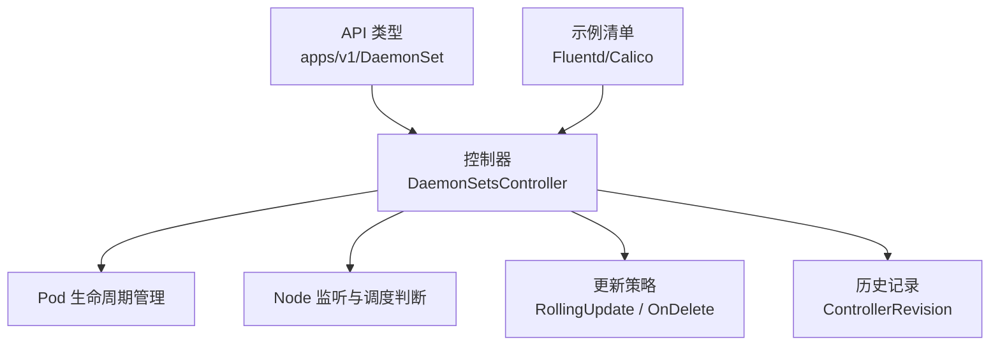
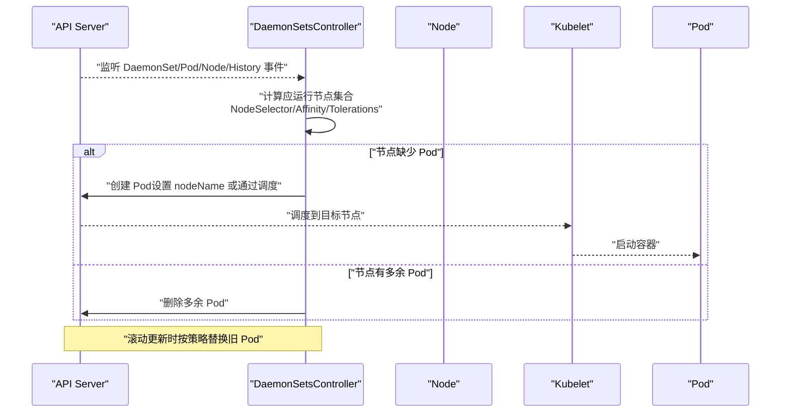
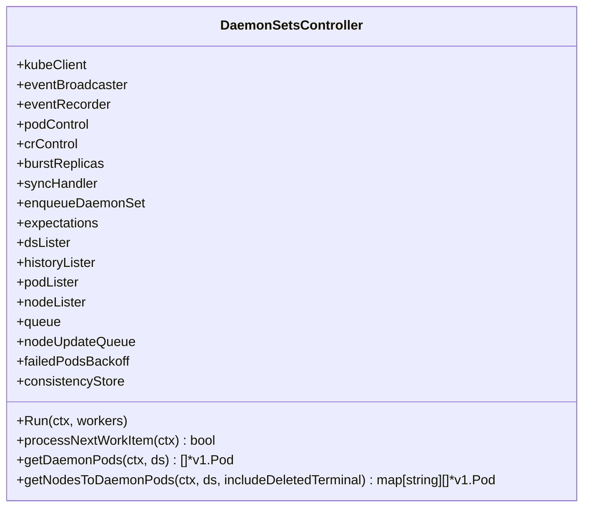
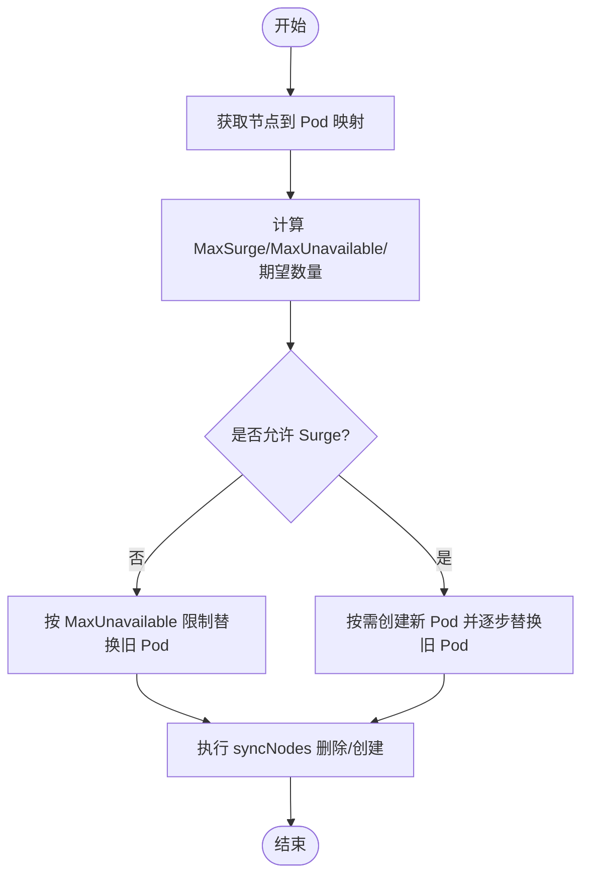
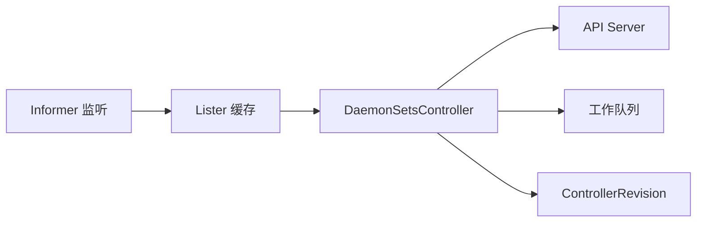

# DaemonSet

<cite>
**本文引用的文件**   
- [daemon_controller.go](file://pkg/controller/daemon/daemon_controller.go)
- [update.go](file://pkg/controller/daemon/update.go)
- [types.go](file://staging/src/k8s.io/api/apps/v1/types.go)
- [kubernetes-internals-deep-dive.md](file://docs/kubernetes-internals-deep-dive.md)
- [fluentd-gcp-ds.yaml](file://cluster/addons/fluentd-gcp/fluentd-gcp-ds.yaml)
- [calico-node-daemonset.yaml](file://cluster/addons/calico-policy-controller/calico-node-daemonset.yaml)
</cite>

## 目录
1. [简介](#简介)
2. [项目结构](#项目结构)
3. [核心组件](#核心组件)
4. [架构总览](#架构总览)
5. [详细组件分析](#详细组件分析)
6. [依赖关系分析](#依赖关系分析)
7. [性能考虑](#性能考虑)
8. [故障排查指南](#故障排查指南)
9. [结论](#结论)
10. [附录](#附录)

## 简介
DaemonSet 是 Kubernetes 中用于在节点级别部署应用的控制器，确保集群中的每个（或选定的）节点上运行一个 Pod 副本。其典型用途包括日志采集、监控代理、网络插件等系统级工作负载。当新增节点时自动部署，节点删除时自动清理；支持滚动更新与历史版本管理，便于安全升级与回滚。

## 项目结构
本仓库中与 DaemonSet 实现相关的关键位置：
- API 类型定义：apps/v1 的 DaemonSet 资源模型
- 控制器实现：DaemonSetsController 及其更新策略逻辑
- 内部文档：对 DaemonSet 机制的高层说明
- 示例清单：Fluentd、Calico 等以 DaemonSet 形式部署的组件

图表来源
- [types.go:815-835](file://staging/src/k8s.io/api/apps/v1/types.go#L815-L835)
- [daemon_controller.go:101-155](file://pkg/controller/daemon/daemon_controller.go#L101-L155)
- [update.go:44-260](file://pkg/controller/daemon/update.go#L44-L260)

章节来源
- [kubernetes-internals-deep-dive.md:536-575](file://docs/kubernetes-internals-deep-dive.md#L536-L575)

## 核心组件
- DaemonSet 资源对象：描述期望状态（选择器、模板、更新策略、历史保留等）
- DaemonSetsController：监听 DaemonSet、Pod、Node、ControllerRevision 变更，维护实际状态与期望状态一致
- 更新策略：支持 RollingUpdate（含 MaxSurge/MaxUnavailable）与 OnDelete
- 历史记录：通过 ControllerRevision 保存模板快照，支持回滚

章节来源
- [types.go:815-835](file://staging/src/k8s.io/api/apps/v1/types.go#L815-L835)
- [daemon_controller.go:101-155](file://pkg/controller/daemon/daemon_controller.go#L101-L155)
- [update.go:290-390](file://pkg/controller/daemon/update.go#L290-L390)

## 架构总览
DaemonSet 控制面由控制器驱动，基于 Informer 机制监听资源变化，并通过工作队列异步处理同步逻辑。

图表来源
- [daemon_controller.go:224-291](file://pkg/controller/daemon/daemon_controller.go#L224-L291)
- [kubernetes-internals-deep-dive.md:536-575](file://docs/kubernetes-internals-deep-dive.md#L536-L575)

## 详细组件分析

### DaemonSetsController 类图

图表来源
- [daemon_controller.go:101-155](file://pkg/controller/daemon/daemon_controller.go#L101-L155)

章节来源
- [daemon_controller.go:101-155](file://pkg/controller/daemon/daemon_controller.go#L101-L155)

### 滚动更新流程（RollingUpdate）

图表来源
- [update.go:44-260](file://pkg/controller/daemon/update.go#L44-L260)

章节来源
- [update.go:44-260](file://pkg/controller/daemon/update.go#L44-L260)

### 节点选择与亲和性
- NodeSelector：通过标签精确匹配节点
- Affinity/Anti-Affinity：使用节点亲和/反亲和规则进行更灵活的调度
- Tolerations：容忍污点，使 Pod 可调度到被标记的节点
- 控制器侧会依据 NodeShouldRunDaemonPod 判定节点是否应运行该 DaemonSet 的 Pod

章节来源
- [daemon_controller.go:727-755](file://pkg/controller/daemon/daemon_controller.go#L727-L755)
- [kubernetes-internals-deep-dive.md:536-575](file://docs/kubernetes-internals-deep-dive.md#L536-L575)

### 更新策略与配置
- RollingUpdate：支持 MaxSurge 与 MaxUnavailable 控制滚动节奏
- OnDelete：仅在新版本 DaemonSet 创建后，手动删除旧 Pod 才会触发更新
- 历史记录：ControllerRevision 保存模板快照，支持回滚与去重

章节来源
- [update.go:290-390](file://pkg/controller/daemon/update.go#L290-L390)
- [update.go:582-618](file://pkg/controller/daemon/update.go#L582-L618)

### YAML 配置示例与场景

- 日志收集器（Fluentd）
  - 关键特性：hostNetwork、hostPath 挂载、livenessProbe、tolerations、nodeSelector
  - 参考路径：[fluentd-gcp-ds.yaml](file://cluster/addons/fluentd-gcp/fluentd-gcp-ds.yaml)

- 网络插件（Calico）
  - 关键特性：liveness/readiness 探针、tolerations、nodeSelector
  - 参考路径：[calico-node-daemonset.yaml](file://cluster/addons/calico-policy-controller/calico-node-daemonset.yaml)

- 监控代理（Prometheus Node Exporter）
  - 建议配置：暴露端口、资源限制、健康检查、容忍污点
  - 参考模式：参见上述 DaemonSet 清单中的探针与 tolerations 用法

- 其他常见组件（如 Flannel、CoreDNS NodeLocal DNS）
  - 参考模式：hostNetwork、hostPath、tolerations、nodeSelector、探针

章节来源
- [fluentd-gcp-ds.yaml:1-118](file://cluster/addons/fluentd-gcp/fluentd-gcp-ds.yaml#L1-L118)
- [calico-node-daemonset.yaml:122-130](file://cluster/addons/calico-policy-controller/calico-node-daemonset.yaml#L122-L130)

## 依赖关系分析
- 控制器依赖 Informers 监听 DaemonSet、Pod、Node、ControllerRevision
- 通过 Lister 缓存读取数据，降低 API Server 压力
- 使用 Expectations 避免风暴式创建/删除
- 使用 Backoff 对失败 Pod 的重试进行退避

图表来源
- [daemon_controller.go:224-291](file://pkg/controller/daemon/daemon_controller.go#L224-L291)

章节来源
- [daemon_controller.go:224-291](file://pkg/controller/daemon/daemon_controller.go#L224-L291)

## 性能考虑
- 合理设置 MaxSurge 与 MaxUnavailable，平衡可用性与更新速度
- 为系统级 DaemonSet 设置 priorityClassName 与 tolerations，确保抢占与调度
- 使用 hostPath 与 hostNetwork 时注意资源隔离与安全边界
- 健康检查需保守配置，避免误杀导致频繁重建
- 利用 MinReadySeconds 控制 Pod 就绪等待时间，减少滚动期间的抖动

## 故障排查指南
- 查看事件：关注 FailedPlacement、FailedDaemonPod、SucceededDaemonPod 等事件原因
- 检查节点适配：确认 NodeSelector/Affinity/Tolerations 是否与节点标签/污点匹配
- 观察滚动进度：对比新旧 Pod 的哈希与状态，确认是否符合预期
- 健康检查问题：核查 liveness/readiness 探针命令与阈值
- 资源不足：检查节点 CPU/内存/磁盘容量，必要时调整资源请求与限制
- 历史版本：核对 ControllerRevision 与当前模板一致性，必要时回滚

章节来源
- [daemon_controller.go:75-85](file://pkg/controller/daemon/daemon_controller.go#L75-L85)
- [update.go:44-260](file://pkg/controller/daemon/update.go#L44-L260)

## 结论
DaemonSet 为节点级应用提供了稳定、可控的部署方式。结合节点选择、亲和与容忍策略，可实现精准调度；通过滚动更新与历史记录，保障升级与回滚的安全性。在生产环境中，建议配合完善的健康检查、资源限制与监控告警，以获得高可用的系统级服务。

## 附录
- 最佳实践
  - 明确选择器与标签规范，避免多控制器冲突
  - 为关键组件启用 critical pod 注解与优先级类
  - 谨慎使用 hostPath，做好权限与容量规划
  - 定期清理历史版本，避免存储膨胀
- 常见问题
  - 节点无法调度：检查污点与容忍、亲和规则与标签
  - 滚动卡住：评估 MaxSurge/MaxUnavailable 与健康检查阈值
  - 资源争用：调整资源请求/限制与 QoS 等级