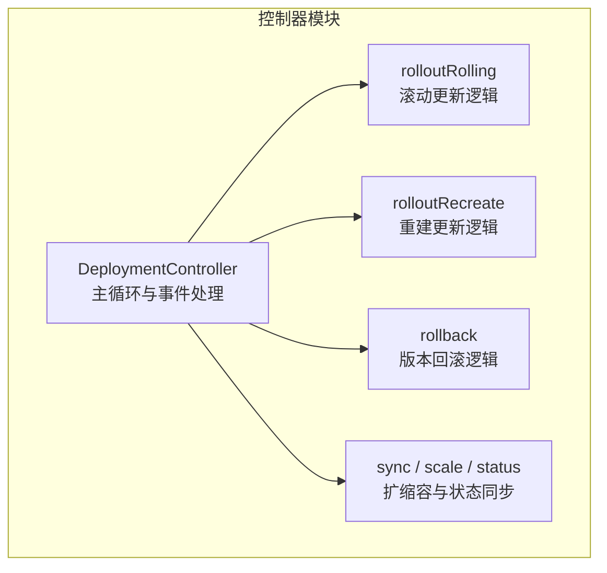
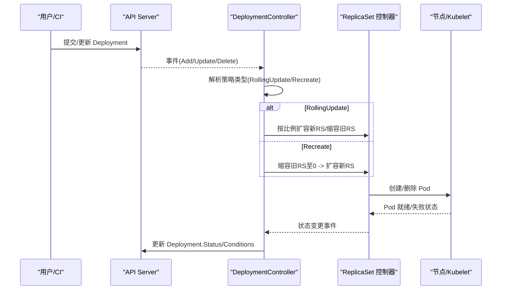
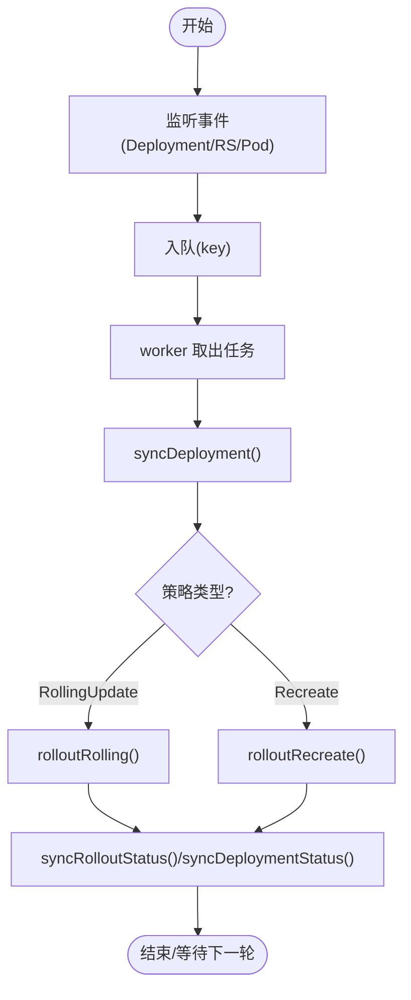
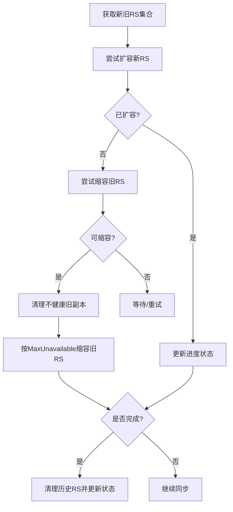
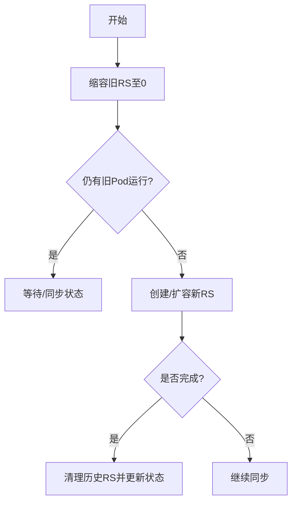
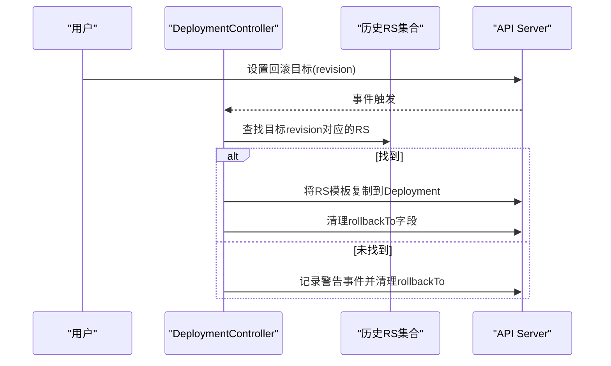
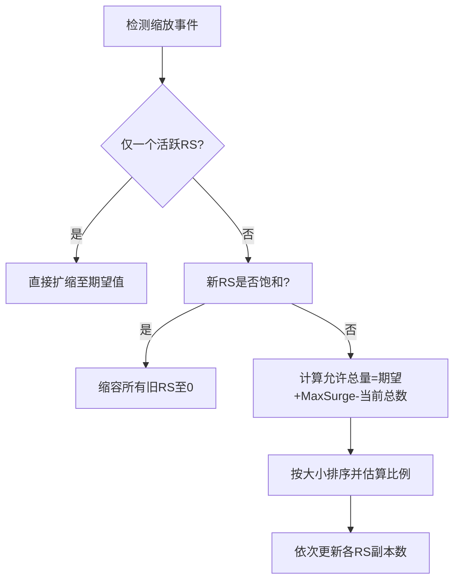
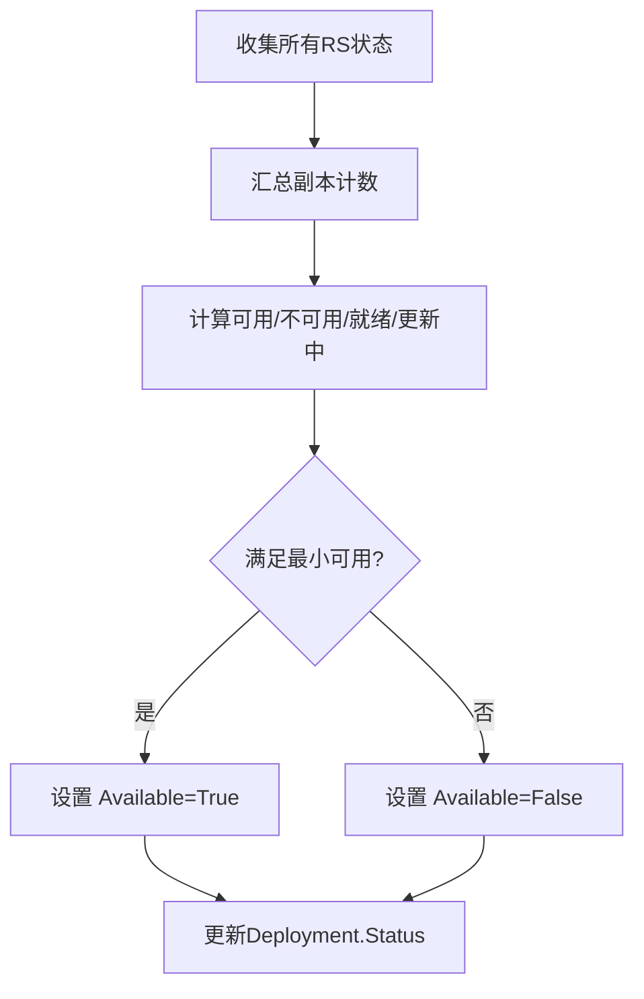
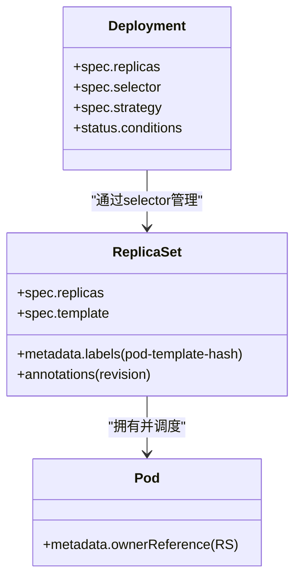
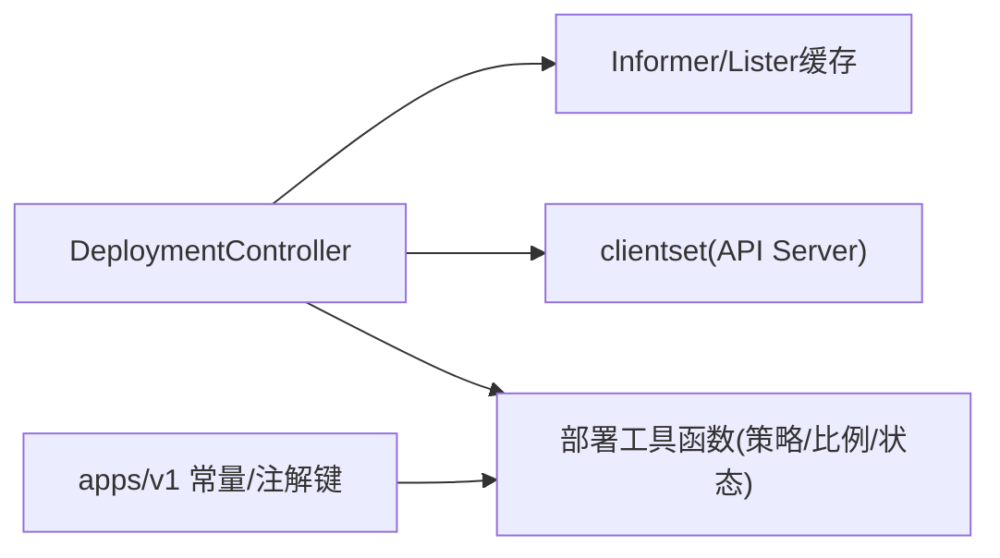

# Deployment

<cite>
**本文引用的文件**   
- [deployment_controller.go](file://pkg/controller/deployment/deployment_controller.go)
- [rolling.go](file://pkg/controller/deployment/rolling.go)
- [recreate.go](file://pkg/controller/deployment/recreate.go)
- [rollback.go](file://pkg/controller/deployment/rollback.go)
- [sync.go](file://pkg/controller/deployment/sync.go)
- [types.go](file://staging/src/k8s.io/api/apps/v1/types.go)
</cite>

## 目录
1. [简介](#简介)
2. [项目结构](#项目结构)
3. [核心组件](#核心组件)
4. [架构总览](#架构总览)
5. [详细组件分析](#详细组件分析)
6. [依赖关系分析](#依赖关系分析)
7. [性能与可用性考量](#性能与可用性考量)
8. [故障排查指南](#故障排查指南)
9. [结论](#结论)
10. [附录：YAML 配置要点与示例路径](#附录yaml-配置要点与示例路径)

## 简介
本文件面向 Kubernetes 的 Deployment 资源，系统性阐述其设计理念、无状态应用管理能力、滚动更新策略、版本回滚、副本管理与发布控制。文档基于源码实现进行解析，覆盖 spec 关键配置项（如 replicas、strategy、selector 等）、RollingUpdate 与 Recreate 两种策略的差异与适用场景、滚动参数（maxSurge、maxUnavailable）与健康检查配合方式、与 ReplicaSet 的关系及版本管理机制，并提供最佳实践与常见问题解决方案。

## 项目结构
Deployment 的核心控制器位于 pkg/controller/deployment 下，主要职责包括：
- 监听 Deployment、ReplicaSet、Pod 事件并进入工作队列
- 根据策略执行滚动或重建更新
- 管理版本历史与回滚
- 维护 Deployment 状态与条件

**图示来源** 
- [deployment_controller.go:170-200](file://pkg/controller/deployment/deployment_controller.go#L170-L200)
- [rolling.go:31-66](file://pkg/controller/deployment/rolling.go#L31-L66)
- [recreate.go:29-75](file://pkg/controller/deployment/recreate.go#L29-L75)
- [rollback.go:32-71](file://pkg/controller/deployment/rollback.go#L32-L71)
- [sync.go:57-77](file://pkg/controller/deployment/sync.go#L57-L77)

**章节来源**
- [deployment_controller.go:170-200](file://pkg/controller/deployment/deployment_controller.go#L170-L200)

## 核心组件
- DeploymentController：负责监听、入队、调度与协调 Deployment 与其管理的 ReplicaSet/Pod 的状态收敛。
- 滚动更新器（rolloutRolling）：按 maxSurge/maxUnavailable 逐步扩缩新旧副本集，保证可用性与进度。
- 重建更新器（rolloutRecreate）：先全部停止旧 Pod，再创建新 Pod，确保零并发。
- 回滚器（rollback）：依据 revision 将模板恢复到指定历史版本。
- 同步与扩缩容（sync/scale）：处理暂停、缩放事件、比例扩缩、清理历史副本集与状态计算。

**章节来源**
- [deployment_controller.go:65-101](file://pkg/controller/deployment/deployment_controller.go#L65-L101)
- [rolling.go:31-66](file://pkg/controller/deployment/rolling.go#L31-L66)
- [recreate.go:29-75](file://pkg/controller/deployment/recreate.go#L29-L75)
- [rollback.go:32-71](file://pkg/controller/deployment/rollback.go#L32-L71)
- [sync.go:57-77](file://pkg/controller/deployment/sync.go#L57-L77)

## 架构总览
Deployment 通过控制器循环监听 API 对象变化，选择策略分支执行更新流程，最终收敛到期望状态。

**图示来源** 
- [deployment_controller.go:572-661](file://pkg/controller/deployment/deployment_controller.go#L572-L661)
- [rolling.go:31-66](file://pkg/controller/deployment/rolling.go#L31-L66)
- [recreate.go:29-75](file://pkg/controller/deployment/recreate.go#L29-L75)
- [sync.go:479-532](file://pkg/controller/deployment/sync.go#L479-L532)

## 详细组件分析

### 控制器主流程与事件驱动
- 启动多个 worker 从队列取任务，调用 syncHandler 执行同步。
- 监听 Deployment/ReplicaSet/Pod 事件，按 ControllerRef 关联到对应 Deployment。
- 对 Recreate 策略，Pod 删除时触发重新评估，确保旧 Pod 全部终止后再推进。

**图示来源** 
- [deployment_controller.go:170-200](file://pkg/controller/deployment/deployment_controller.go#L170-L200)
- [deployment_controller.go:572-661](file://pkg/controller/deployment/deployment_controller.go#L572-L661)
- [recreate.go:29-75](file://pkg/controller/deployment/recreate.go#L29-L75)
- [rolling.go:31-66](file://pkg/controller/deployment/rolling.go#L31-L66)
- [sync.go:479-532](file://pkg/controller/deployment/sync.go#L479-L532)

**章节来源**
- [deployment_controller.go:170-200](file://pkg/controller/deployment/deployment_controller.go#L170-L200)
- [deployment_controller.go:572-661](file://pkg/controller/deployment/deployment_controller.go#L572-L661)

### 滚动更新（RollingUpdate）
- 优先扩容新 ReplicaSet，再在满足最小可用性的前提下缩容旧副本集。
- 使用 MaxUnavailable 限制不可用上限；结合 MaxSurge 允许临时超出期望副本数。
- 自动清理不健康旧副本，避免阻塞滚动。

**图示来源** 
- [rolling.go:31-66](file://pkg/controller/deployment/rolling.go#L31-L66)
- [rolling.go:86-152](file://pkg/controller/deployment/rolling.go#L86-L152)
- [rolling.go:191-235](file://pkg/controller/deployment/rolling.go#L191-L235)
- [sync.go:307-400](file://pkg/controller/deployment/sync.go#L307-L400)

**章节来源**
- [rolling.go:31-66](file://pkg/controller/deployment/rolling.go#L31-L66)
- [rolling.go:86-152](file://pkg/controller/deployment/rolling.go#L86-L152)
- [rolling.go:191-235](file://pkg/controller/deployment/rolling.go#L191-L235)
- [sync.go:307-400](file://pkg/controller/deployment/sync.go#L307-L400)

### 重建更新（Recreate）
- 先将所有旧副本集缩容至 0，确认无旧 Pod 运行后，再创建并扩容新副本集。
- 适合有强一致性要求、不能容忍新旧版本并存的应用。

**图示来源** 
- [recreate.go:29-75](file://pkg/controller/deployment/recreate.go#L29-L75)
- [recreate.go:77-96](file://pkg/controller/deployment/recreate.go#L77-L96)
- [recreate.go:98-126](file://pkg/controller/deployment/recreate.go#L98-L126)
- [recreate.go:128-133](file://pkg/controller/deployment/recreate.go#L128-L133)

**章节来源**
- [recreate.go:29-75](file://pkg/controller/deployment/recreate.go#L29-L75)
- [recreate.go:77-96](file://pkg/controller/deployment/recreate.go#L77-L96)
- [recreate.go:98-126](file://pkg/controller/deployment/recreate.go#L98-L126)
- [recreate.go:128-133](file://pkg/controller/deployment/recreate.go#L128-L133)

### 版本回滚（Rollback）
- 支持回退到指定 revision 或最近一次有效版本。
- 回滚时将目标 RS 的模板复制回 Deployment，并清理 rollbackTo 标记。

**图示来源** 
- [rollback.go:32-71](file://pkg/controller/deployment/rollback.go#L32-L71)
- [rollback.go:73-102](file://pkg/controller/deployment/rollback.go#L73-L102)
- [rollback.go:112-121](file://pkg/controller/deployment/rollback.go#L112-L121)

**章节来源**
- [rollback.go:32-71](file://pkg/controller/deployment/rollback.go#L32-L71)
- [rollback.go:73-102](file://pkg/controller/deployment/rollback.go#L73-L102)
- [rollback.go:112-121](file://pkg/controller/deployment/rollback.go#L112-L121)

### 扩缩容与比例分配（scale）
- 当存在活跃 RS 且新 RS 未饱和时，按“比例”在所有活跃 RS 间分配扩缩容量，降低风险。
- 支持 MaxSurge 带来的额外容量，用于平滑过渡。

**图示来源** 
- [sync.go:307-400](file://pkg/controller/deployment/sync.go#L307-L400)

**章节来源**
- [sync.go:307-400](file://pkg/controller/deployment/sync.go#L307-L400)

### 状态计算与条件
- 计算 Ready/Available/Unavailable/Updated 等指标，并维护 Progressing/Available 条件。
- 暂停/恢复时会写入相应条件，避免误报超时。

**图示来源** 
- [sync.go:479-532](file://pkg/controller/deployment/sync.go#L479-L532)
- [sync.go:79-111](file://pkg/controller/deployment/sync.go#L79-L111)

**章节来源**
- [sync.go:479-532](file://pkg/controller/deployment/sync.go#L479-L532)
- [sync.go:79-111](file://pkg/controller/deployment/sync.go#L79-L111)

### 与 ReplicaSet 的关系与版本机制
- 每个 Deployment 通过 label selector 管理一组 ReplicaSet。
- 新版本由 PodTemplateSpec 的哈希生成唯一名称，并递增 revision 注解。
- 控制器会回收超过 RevisionHistoryLimit 的历史副本集。

**图示来源** 
- [sync.go:146-300](file://pkg/controller/deployment/sync.go#L146-L300)
- [sync.go:441-476](file://pkg/controller/deployment/sync.go#L441-L476)
- [types.go:26-33](file://staging/src/k8s.io/api/apps/v1/types.go#L26-L33)

**章节来源**
- [sync.go:146-300](file://pkg/controller/deployment/sync.go#L146-L300)
- [sync.go:441-476](file://pkg/controller/deployment/sync.go#L441-L476)
- [types.go:26-33](file://staging/src/k8s.io/api/apps/v1/types.go#L26-L33)

## 依赖关系分析
- DeploymentController 依赖 Informer/Lister 缓存 Deployment/RS/Pod 数据，并通过 clientset 执行写操作。
- 滚动/重建/回滚逻辑均复用统一的扩缩容与状态同步能力。
- 常量与注解键定义来自 apps/v1 types。

**图示来源** 
- [deployment_controller.go:104-168](file://pkg/controller/deployment/deployment_controller.go#L104-L168)
- [types.go:26-33](file://staging/src/k8s.io/api/apps/v1/types.go#L26-L33)

**章节来源**
- [deployment_controller.go:104-168](file://pkg/controller/deployment/deployment_controller.go#L104-L168)
- [types.go:26-33](file://staging/src/k8s.io/api/apps/v1/types.go#L26-L33)

## 性能与可用性考量
- 合理设置 maxSurge 与 maxUnavailable，平衡吞吐与可用性。
- 为容器配置就绪/存活探针，使控制器能准确判断 Pod 可用性。
- 谨慎调整 minReadySeconds，避免过早判定就绪导致流量切入不稳定实例。
- 控制 RevisionHistoryLimit，避免过多历史副本占用资源。
- 对于大副本规模，建议分批次灰度发布，结合水平扩展与限流策略。

[本节为通用指导，无需代码引用]

## 故障排查指南
- 查看 Deployment 状态与条件：关注 Progressing/Available 原因与消息。
- 检查相关 ReplicaSet 的副本与事件，确认是否因健康检查失败被反复重启。
- 若处于 Recreate 模式，确认旧 Pod 是否已全部终止。
- 回滚失败时，检查是否存在目标 revision 的 RS，以及模板是否一致。
- 观察事件记录（Events），定位扩缩容、创建失败、超时等根因。

**章节来源**
- [sync.go:479-532](file://pkg/controller/deployment/sync.go#L479-L532)
- [rollback.go:104-110](file://pkg/controller/deployment/rollback.go#L104-L110)

## 结论
Deployment 以 ReplicaSet 为执行单元，提供声明式的无状态应用管理能力。通过 RollingUpdate 与 Recreate 两种策略，结合 maxSurge/maxUnavailable、健康检查与版本历史，实现安全可控的持续交付。理解其内部流程与关键参数，有助于在生产环境稳定高效地发布与回滚服务。

[本节为总结性内容，无需代码引用]

## 附录：YAML 配置要点与示例路径
- 关键字段说明
  - replicas：期望副本数
  - strategy：更新策略（RollingUpdate/Recreate）
    - rollingUpdate.maxSurge：允许超出的最大副本数（绝对值或百分比）
    - rollingUpdate.maxUnavailable：更新期间最多不可用副本数（绝对值或百分比）
  - selector：标签选择器，必须与 PodTemplate 的 labels 匹配
  - template：Pod 模板，包含容器镜像、探针、资源请求/限制等
  - revisionHistoryLimit：保留的历史副本集数量
  - progressDeadlineSeconds：滚动进度超时时间
  - paused：是否暂停更新（便于分批发布）
- 健康检查
  - readinessProbe：就绪探针，影响可用副本统计
  - livenessProbe：存活探针，异常时会被重启
- 资源优化
  - requests/limits：合理设置 CPU/内存，提升调度质量与稳定性
  - topologySpreadConstraints/nodeSelector/tolerations：控制分布与亲和性
- 示例参考路径（仓库内测试用例与样例）
  - 多容器与资源示例：[test/testdata/deployment-multicontainer-resources.yaml](file://test/testdata/deployment-multicontainer-resources.yaml)
  - 多容器示例：[test/testdata/deployment-multicontainer.yaml](file://test/testdata/deployment-multicontainer.yaml)
  - 版本回滚示例 v1：[test/testdata/deployment-revision1.yaml](file://test/testdata/deployment-revision1.yaml)
  - 版本回滚示例 v2：[test/testdata/deployment-revision2.yaml](file://test/testdata/deployment-revision2.yaml)
  - 带探针的 Pod 示例（可用于 Deployment 模板）：[test/testdata/pod-with-probes.yaml](file://test/testdata/pod-with-probes.yaml)

[本节为指引性内容，具体 YAML 内容请参见上述文件路径]