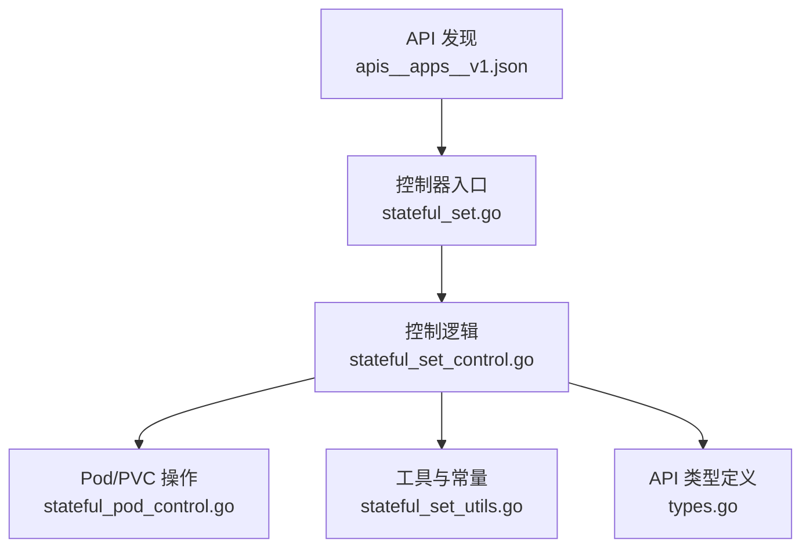
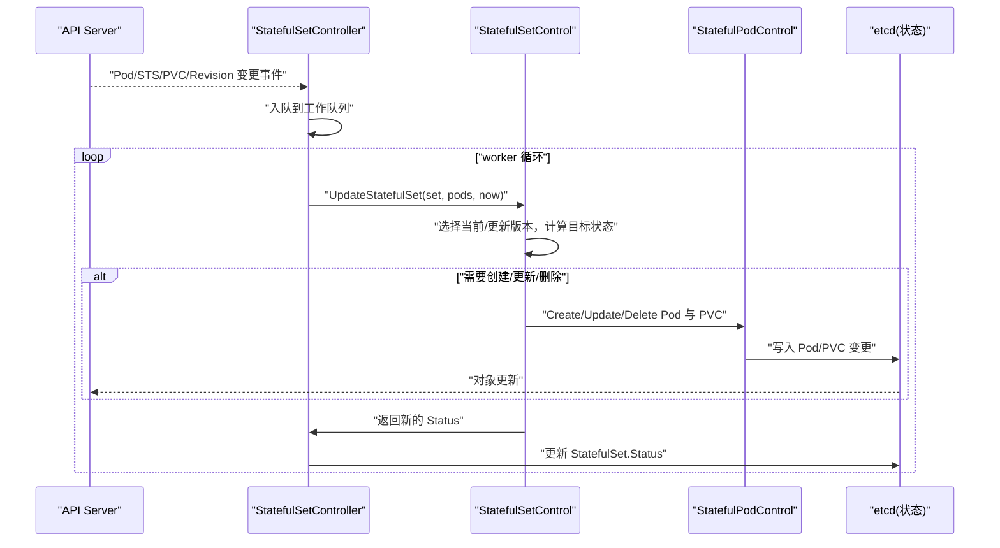
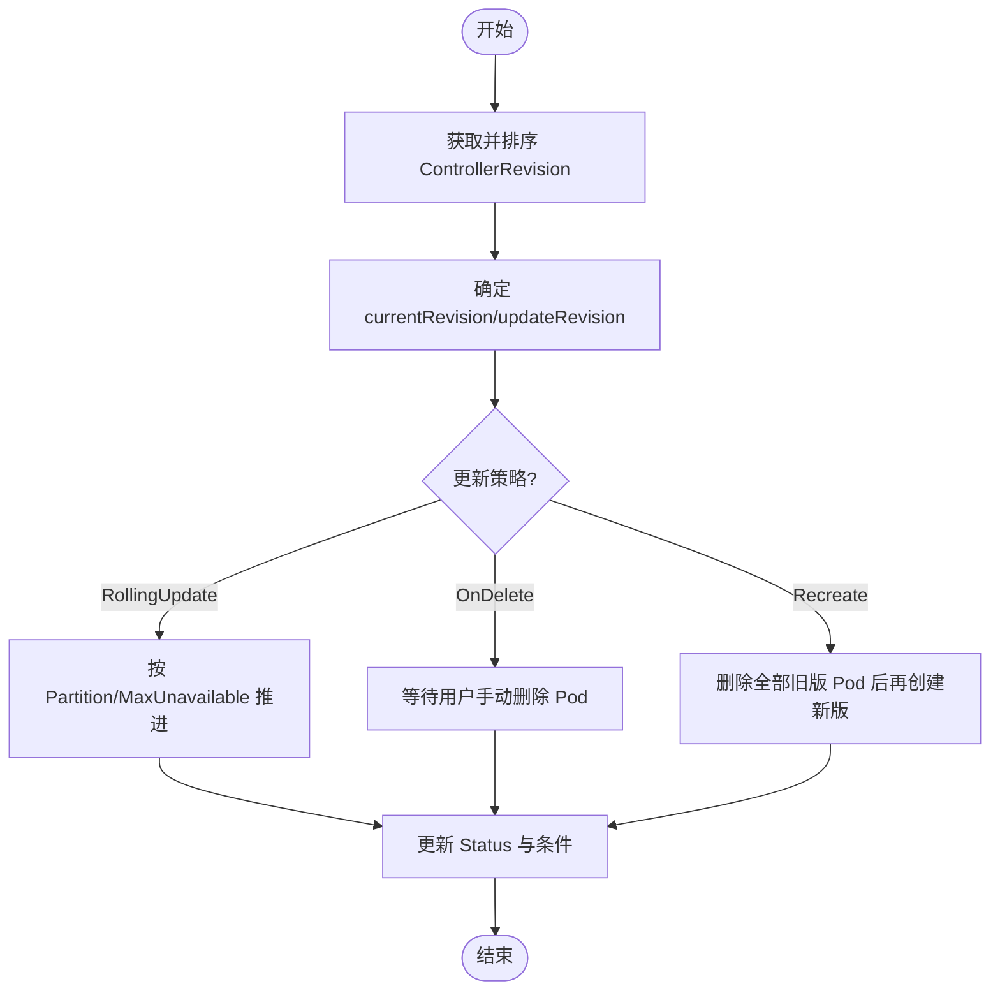
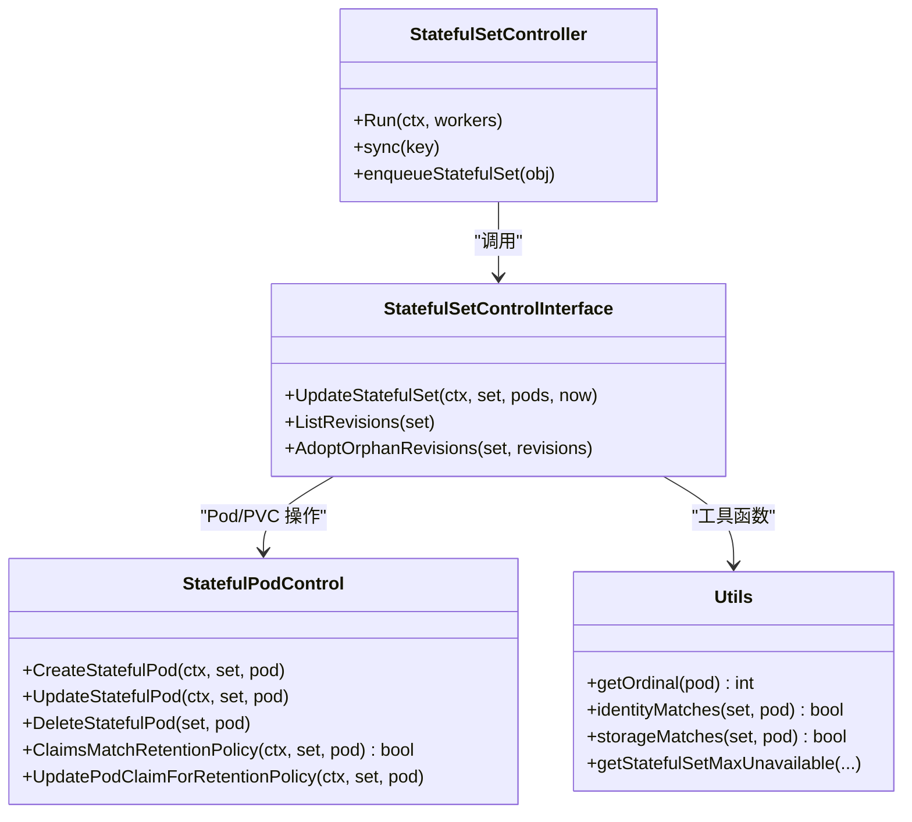
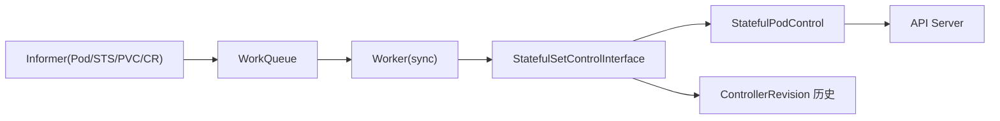

# StatefulSet

<cite>
**本文引用的文件**   
- [apis__apps__v1.json](file://api/discovery/apis__apps__v1.json)
- [stateful_set.go](file://pkg/controller/statefulset/stateful_set.go)
- [stateful_set_control.go](file://pkg/controller/statefulset/stateful_set_control.go)
- [stateful_pod_control.go](file://pkg/controller/statefulset/stateful_pod_control.go)
- [stateful_set_utils.go](file://pkg/controller/statefulset/stateful_set_utils.go)
- [types.go](file://pkg/apis/apps/types.go)
</cite>

## 目录
1. [简介](#简介)
2. [项目结构](#项目结构)
3. [核心组件](#核心组件)
4. [架构总览](#架构总览)
5. [详细组件分析](#详细组件分析)
6. [依赖关系分析](#依赖关系分析)
7. [性能与扩展性](#性能与扩展性)
8. [故障排查指南](#故障排查指南)
9. [结论](#结论)
10. [附录：配置与实践](#附录配置与实践)

## 简介
StatefulSet 是 Kubernetes 中用于管理有状态应用的控制器，提供稳定网络标识、稳定持久化存储、有序部署与扩展等关键能力。其设计目标是让每个 Pod 具备可识别、可预测且稳定的身份，并将该身份与持久化卷绑定，从而满足数据库、消息队列等有状态工作负载的需求。

## 项目结构
本仓库中与 StatefulSet 实现相关的关键代码位于以下位置：
- API 类型定义：pkg/apis/apps/types.go
- 控制器主循环与事件处理：pkg/controller/statefulset/stateful_set.go
- 更新策略与副本编排逻辑：pkg/controller/statefulset/stateful_set_control.go
- Pod/PVC 生命周期与一致性保障：pkg/controller/statefulset/stateful_pod_control.go
- 工具函数（命名/索引/标签/条件等）：pkg/controller/statefulset/stateful_set_utils.go
- API 发现清单（含 statefulsets 资源）：api/discovery/apis__apps__v1.json

图表来源
- [apis__apps__v1.json:152-197](file://api/discovery/apis__apps__v1.json#L152-L197)
- [stateful_set.go:112-222](file://pkg/controller/statefulset/stateful_set.go#L112-L222)
- [stateful_set_control.go:84-111](file://pkg/controller/statefulset/stateful_set_control.go#L84-L111)
- [stateful_pod_control.go:56-76](file://pkg/controller/statefulset/stateful_pod_control.go#L56-L76)
- [stateful_set_utils.go:43-53](file://pkg/controller/statefulset/stateful_set_utils.go#L43-L53)
- [types.go:28-48](file://pkg/apis/apps/types.go#L28-L48)

章节来源
- [apis__apps__v1.json:152-197](file://api/discovery/apis__apps__v1.json#L152-L197)
- [stateful_set.go:112-222](file://pkg/controller/statefulset/stateful_set.go#L112-L222)

## 核心组件
- StatefulSetController：负责监听 StatefulSet、Pod、PVC、ControllerRevision 的变化，维护工作队列并驱动同步。
- StatefulSetControlInterface：封装更新与版本历史管理，协调滚动更新、分区更新、删除等待等策略。
- StatefulPodControl：负责创建/更新/删除 Pod 和 PVC，确保身份一致性与存储匹配，并记录事件。
- 工具层：提供命名规则、索引计算、标签注入、条件设置、最大不可用数计算等。

章节来源
- [stateful_set.go:65-95](file://pkg/controller/statefulset/stateful_set.go#L65-L95)
- [stateful_set_control.go:47-74](file://pkg/controller/statefulset/stateful_set_control.go#L47-L74)
- [stateful_pod_control.go:56-76](file://pkg/controller/statefulset/stateful_pod_control.go#L56-L76)
- [stateful_set_utils.go:43-53](file://pkg/controller/statefulset/stateful_set_utils.go#L43-L53)

## 架构总览
StatefulSet 的控制器通过 Informer 机制监听对象变化，将需要处理的 StatefulSet 入队；worker 从队列取出任务，调用控制逻辑进行“期望 vs 实际”的收敛，包括：
- 创建缺失的 Pod 与 PVC
- 按序或并行地更新/删除 Pod
- 根据最小可用数与 MinReadySeconds 推进进度
- 维护 ControllerRevision 历史与清理

图表来源
- [stateful_set.go:224-253](file://pkg/controller/statefulset/stateful_set.go#L224-L253)
- [stateful_set_control.go:84-111](file://pkg/controller/statefulset/stateful_set_control.go#L84-L111)
- [stateful_pod_control.go:154-173](file://pkg/controller/statefulset/stateful_pod_control.go#L154-L173)

## 详细组件分析

### 控制器主循环与事件处理
- 启动时注册事件处理器，监听 Pod、StatefulSet、PVC、ControllerRevision 的变化，并根据 ControllerRef 或标签选择器将对应 StatefulSet 入队。
- worker 从队列取任务，执行 sync -> syncStatefulSet -> UpdateStatefulSet，最终更新 Status。

章节来源
- [stateful_set.go:181-222](file://pkg/controller/statefulset/stateful_set.go#L181-L222)
- [stateful_set.go:524-579](file://pkg/controller/statefulset/stateful_set.go#L524-L579)

### 更新策略与版本历史
- RollingUpdate：默认策略，支持 Partition 分区与 MaxUnavailable 控制；按序或并行推进更新。
- OnDelete：不自动滚动，仅手动删除 Pod 后重建。
- Recreate：需启用特性门控，先删除旧版所有 Pod，再创建新版。
- 版本历史：使用 ControllerRevision 保存补丁，支持回滚与碰撞计数避免。

图表来源
- [stateful_set_control.go:84-111](file://pkg/controller/statefulset/stateful_set_control.go#L84-L111)
- [stateful_set_control.go:555-770](file://pkg/controller/statefulset/stateful_set_control.go#L555-L770)
- [stateful_set_utils.go:694-710](file://pkg/controller/statefulset/stateful_set_utils.go#L694-L710)

章节来源
- [stateful_set_control.go:84-111](file://pkg/controller/statefulset/stateful_set_control.go#L84-L111)
- [stateful_set_control.go:555-770](file://pkg/controller/statefulset/stateful_set_control.go#L555-L770)
- [stateful_set_utils.go:694-710](file://pkg/controller/statefulset/stateful_set_utils.go#L694-L710)

### Pod 与 PVC 生命周期管理
- 创建顺序：先为 Pod 创建所需的 PVC，再创建 Pod；Pending 阶段会触发缺失 PVC 的创建。
- 身份一致性：确保 Pod 名称、主机名、子域名、标签与 StatefulSet 规范一致。
- 存储一致性：确保 Pod 的 Volume 引用与 VolumeClaimTemplates 生成的 PVC 名称一致。
- 保留策略：根据 PersistentVolumeClaimRetentionPolicy 动态调整 PVC 的 OwnerReference，以决定缩容或删除时的行为。

图表来源
- [stateful_set.go:65-95](file://pkg/controller/statefulset/stateful_set.go#L65-L95)
- [stateful_set_control.go:47-74](file://pkg/controller/statefulset/stateful_set_control.go#L47-L74)
- [stateful_pod_control.go:56-76](file://pkg/controller/statefulset/stateful_pod_control.go#L56-L76)
- [stateful_set_utils.go:137-167](file://pkg/controller/statefulset/stateful_set_utils.go#L137-L167)

章节来源
- [stateful_pod_control.go:154-173](file://pkg/controller/statefulset/stateful_pod_control.go#L154-L173)
- [stateful_pod_control.go:249-303](file://pkg/controller/statefulset/stateful_pod_control.go#L249-L303)
- [stateful_set_utils.go:137-167](file://pkg/controller/statefulset/stateful_set_utils.go#L137-L167)

### 稳定网络标识与持久化存储
- 稳定网络标识：Pod 名称遵循 <sts-name>-<ordinal>，结合 headless Service 的 subdomain 形成稳定 DNS 记录。
- 稳定持久化存储：VolumeClaimTemplates 为每个 Pod 生成唯一命名的 PVC，并与 Pod 一一对应。

章节来源
- [stateful_set_utils.go:119-129](file://pkg/controller/statefulset/stateful_set_utils.go#L119-L129)
- [stateful_set_utils.go:420-444](file://pkg/controller/statefulset/stateful_set_utils.go#L420-L444)
- [types.go:198-214](file://pkg/apis/apps/types.go#L198-L214)

### 有序部署与扩展（OrderedReady 与 Parallel）
- OrderedReady：按序创建/删除，前一个就绪/终止后才继续下一个；适合强一致性的有状态服务。
- Parallel：并行创建/删除，提升扩缩容速度，但可能带来短暂不一致风险。

章节来源
- [types.go:50-63](file://pkg/apis/apps/types.go#L50-L63)
- [stateful_set_utils.go:500-503](file://pkg/controller/statefulset/stateful_set_utils.go#L500-L503)

### 更新策略详解（RollingUpdate、OnDelete、Recreate）
- RollingUpdate：支持 Partition 与 MaxUnavailable；在有序模式下仍受最小可用约束。
- OnDelete：不自动滚动，仅当用户删除 Pod 后重建。
- Recreate：需启用特性门控，保证新旧版本不同时运行。

章节来源
- [types.go:75-122](file://pkg/apis/apps/types.go#L75-L122)
- [stateful_set_control.go:555-770](file://pkg/controller/statefulset/stateful_set_control.go#L555-L770)

## 依赖关系分析
- StatefulSetController 依赖多个 Informer（Pod、StatefulSet、PVC、ControllerRevision），并通过 workqueue 解耦事件处理。
- StatefulSetControlInterface 抽象了更新与版本历史管理，内部组合 StatefulPodControl 与历史接口。
- StatefulPodControl 通过 clientset 与 listers 读写 API 对象，并使用一致性存储记录写操作。

图表来源
- [stateful_set.go:112-222](file://pkg/controller/statefulset/stateful_set.go#L112-L222)
- [stateful_set_control.go:47-74](file://pkg/controller/statefulset/stateful_set_control.go#L47-L74)
- [stateful_pod_control.go:78-84](file://pkg/controller/statefulset/stateful_pod_control.go#L78-L84)

章节来源
- [stateful_set.go:112-222](file://pkg/controller/statefulset/stateful_set.go#L112-L222)
- [stateful_set_control.go:47-74](file://pkg/controller/statefulset/stateful_set_control.go#L47-L74)

## 性能与扩展性
- 慢启动批处理：在并行模式下采用慢启动批量并发，逐步增大批次大小，上限受 MaxBatchSize 限制，降低 API 压力。
- MaxUnavailable：在开启特性门控后可按绝对值或百分比控制更新期间不可用副本数，提高吞吐同时保障可用性。
- 一致性存储：记录写操作时间戳，避免由于缓存未同步导致的重复处理。

章节来源
- [stateful_set_control.go:334-364](file://pkg/controller/statefulset/stateful_set_control.go#L334-L364)
- [stateful_set_utils.go:694-710](file://pkg/controller/statefulset/stateful_set_utils.go#L694-L710)
- [stateful_set.go:131-155](file://pkg/controller/statefulset/stateful_set.go#L131-L155)

## 故障排查指南
- 查看事件：控制器对 Pod/PVC 的创建、更新、删除均会记录事件，便于定位失败原因。
- 检查状态：关注 StatefulSet.Status 中的 Replicas、ReadyReplicas、AvailableReplicas、CurrentReplicas、UpdatedReplicas 以及 Conditions。
- 常见错误：
  - PVC 创建失败或处于删除中：检查 StorageClass、PV 容量与访问模式是否满足需求。
  - 身份不一致：确认 Pod 名称、标签与 StatefulSet 规范一致。
  - 更新卡住：检查 MinReadySeconds、MaxUnavailable 与 Pod 健康探针。

章节来源
- [stateful_pod_control.go:331-362](file://pkg/controller/statefulset/stateful_pod_control.go#L331-L362)
- [stateful_set_utils.go:712-763](file://pkg/controller/statefulset/stateful_set_utils.go#L712-L763)

## 结论
StatefulSet 通过稳定网络标识、稳定持久化存储、有序部署与扩展、以及灵活的更新策略，为有状态应用提供了可靠的编排基础。配合合理的扩缩容策略、存储保留策略与监控告警，可在生产环境中安全高效地运行数据库、消息队列等关键服务。

## 附录：配置与实践

### 关键配置项速查
- 稳定网络标识
  - spec.serviceName：headless Service 名称，用于生成稳定 DNS 记录
  - spec.template.spec.subdomain：通常由控制器自动设置
- 稳定持久化存储
  - spec.volumeClaimTemplates[]：声明 PVC 模板，控制器会为每个 Pod 生成唯一 PVC
  - spec.persistentVolumeClaimRetentionPolicy.whenDeleted / whenScaled：控制 PVC 在删除或缩容时的保留策略
- 有序部署与扩展
  - spec.podManagementPolicy：OrderedReady 或 Parallel
- 更新策略
  - spec.updateStrategy.type：RollingUpdate、OnDelete、Recreate
  - spec.updateStrategy.rollingUpdate.partition：分区更新起点
  - spec.updateStrategy.rollingUpdate.maxUnavailable：最大不可用副本数（需特性门控）
- 其他
  - spec.replicas：副本数
  - spec.selector：选择器（默认与模板标签一致）
  - spec.revisionHistoryLimit：保留的历史版本数量
  - spec.minReadySeconds：最小可用秒数
  - spec.ordinals.start：起始序号（默认 0）

章节来源
- [types.go:173-258](file://pkg/apis/apps/types.go#L173-L258)
- [types.go:124-156](file://pkg/apis/apps/types.go#L124-L156)
- [types.go:50-63](file://pkg/apis/apps/types.go#L50-L63)
- [types.go:75-122](file://pkg/apis/apps/types.go#L75-L122)

### 典型 YAML 示例（路径引用）
- 数据库集群（如 MySQL/PostgreSQL）
  - 参考示例清单路径：[test/e2e/framework/statefulset/rest.go:47-48](file://test/e2e/framework/statefulset/rest.go#L47-L48)
- Zookeeper 有状态示例（测试镜像安装说明）
  - 参考说明路径：[test/images/pets/zookeeper-installer/README.md:1-11](file://test/images/pets/zookeeper-installer/README.md#L1-L11)

注意：以上为仓库内现有示例与清单的引用路径，具体字段可根据业务需求调整。

### 存储卷管理与最佳实践
- 使用合适的 StorageClass 与 PV 后端，确保多副本跨节点/跨可用区分布。
- 合理设置 persistentVolumeClaimRetentionPolicy：
  - Retain on delete/scale：数据更安全，适合数据库
  - Delete on scale：节省空间，适合临时中间件
- 使用 Headless Service 暴露稳定 DNS，客户端直接连接 Pod 地址。

章节来源
- [stateful_set_utils.go:169-179](file://pkg/controller/statefulset/stateful_set_utils.go#L169-L179)
- [stateful_set_utils.go:420-444](file://pkg/controller/statefulset/stateful_set_utils.go#L420-L444)

### 扩容与缩容操作建议
- 有序模式（OrderedReady）：扩缩容更可控，但耗时较长；适合强一致场景。
- 并行模式（Parallel）：扩缩容更快，但需应用自身具备幂等与快速恢复能力。
- 使用 partition 进行灰度发布，逐步扩大更新范围。

章节来源
- [types.go:50-63](file://pkg/apis/apps/types.go#L50-L63)
- [stateful_set_control.go:555-770](file://pkg/controller/statefulset/stateful_set_control.go#L555-L770)

### 故障排查清单
- 查看事件：kubectl describe statefulset <name> 与 kubectl get events --field-selector involvedObject.name=<name>
- 检查 Pod 状态与日志：kubectl get pods -l app=<app> && kubectl logs <pod>
- 检查 PVC/PV 绑定：kubectl get pvc -l app=<app> && kubectl describe pvc <pvc>
- 验证 DNS：在 Pod 内解析 <pod-name>.<service-name>.<namespace>.svc.cluster.local

章节来源
- [stateful_pod_control.go:331-362](file://pkg/controller/statefulset/stateful_pod_control.go#L331-L362)
- [stateful_set_utils.go:712-763](file://pkg/controller/statefulset/stateful_set_utils.go#L712-L763)