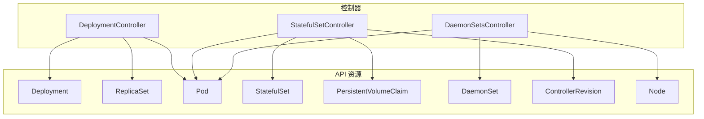
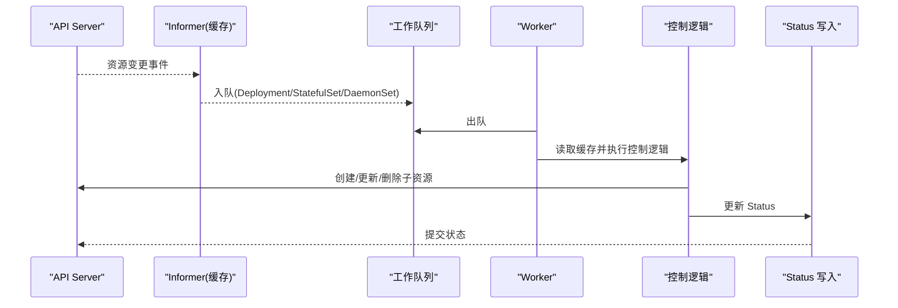
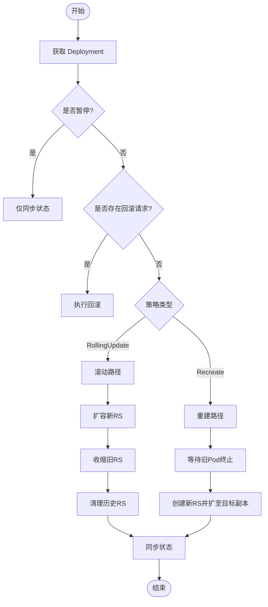
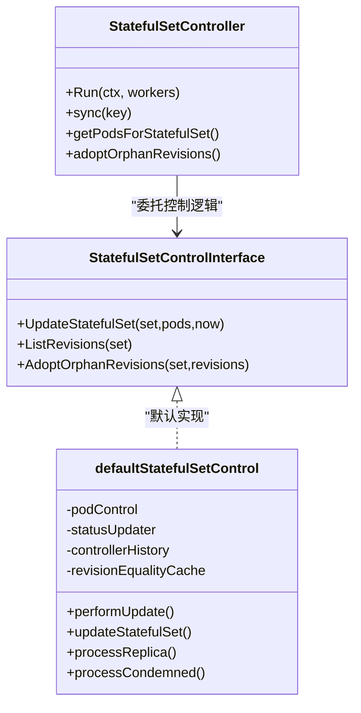
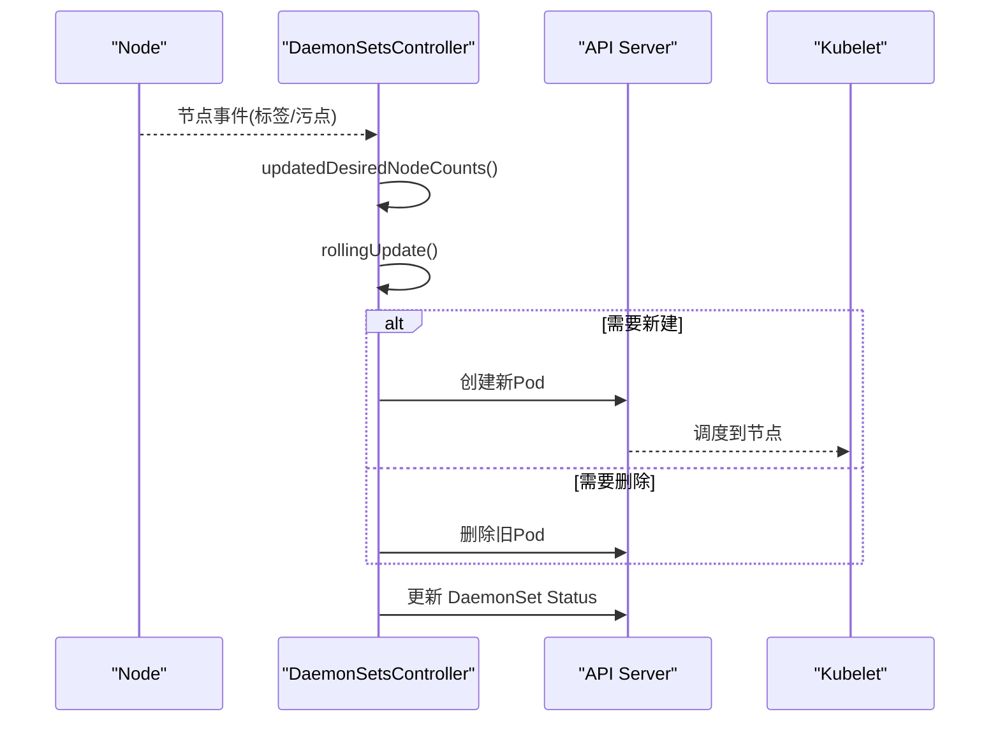
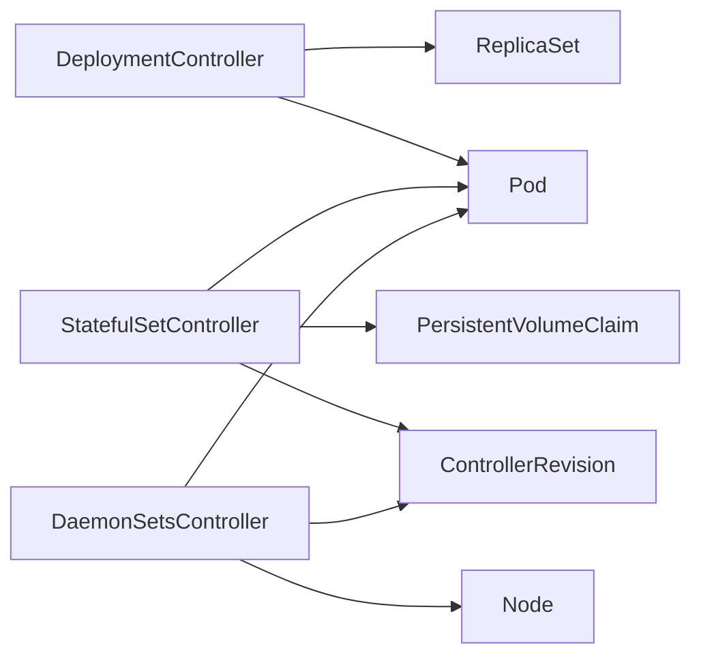

# 高级工作负载

<cite>
**本文引用的文件**   
- [apis__apps__v1.json](file://api/discovery/apis__apps__v1.json)
- [deployment_controller.go](file://pkg/controller/deployment/deployment_controller.go)
- [rolling.go](file://pkg/controller/deployment/rolling.go)
- [stateful_set.go](file://pkg/controller/statefulset/stateful_set.go)
- [stateful_set_control.go](file://pkg/controller/statefulset/stateful_set_control.go)
- [daemon_controller.go](file://pkg/controller/daemon/daemon_controller.go)
- [update.go](file://pkg/controller/daemon/update.go)
</cite>

## 目录
1. [简介](#简介)
2. [项目结构](#项目结构)
3. [核心组件](#核心组件)
4. [架构总览](#架构总览)
5. [详细组件分析](#详细组件分析)
6. [依赖关系分析](#依赖关系分析)
7. [性能与可扩展性](#性能与可扩展性)
8. [故障排查指南](#故障排查指南)
9. [结论](#结论)
10. [附录：YAML 配置要点与最佳实践](#附录yaml-配置要点与最佳实践)

## 简介
本文件面向 Kubernetes 高级工作负载资源，围绕 Deployment、StatefulSet 和 DaemonSet 的设计理念与实现机制进行深入解析。重点覆盖：
- Deployment 的无状态应用管理能力：滚动更新策略、版本回滚、副本管理与发布控制
- StatefulSet 的有状态服务管理特性：稳定网络标识、持久化存储、有序部署与扩展
- DaemonSet 的节点级应用部署模式：节点选择、自动发现与更新策略
同时提供滚动更新配置、健康检查设置、资源优化与故障排查建议，并总结高级工作负载的状态管理机制与最佳实践。

## 项目结构
Kubernetes 控制器管理器中，三大工作负载分别由独立控制器实现，遵循“事件驱动 + 共享缓存 + 工作队列”的经典模式：
- Deployment 控制器：监听 Deployment、ReplicaSet、Pod 变化，协调新旧 ReplicaSet 的扩缩容与清理，支持滚动与重建两种策略
- StatefulSet 控制器：基于序号（ordinal）与 ControllerRevision 管理 Pod 生命周期与 PVC，支持单调递增更新与分区更新
- DaemonSet 控制器：为每个符合条件的节点调度一个 Pod，支持滚动更新与 Surge/Unavailable 约束

图表来源
- [deployment_controller.go:104-168](file://pkg/controller/deployment/deployment_controller.go#L104-L168)
- [stateful_set.go:113-222](file://pkg/controller/statefulset/stateful_set.go#L113-L222)
- [daemon_controller.go:158-291](file://pkg/controller/daemon/daemon_controller.go#L158-L291)

章节来源
- [apis__apps__v1.json:1-200](file://api/discovery/apis__apps__v1.json#L1-L200)

## 核心组件
- Deployment 控制器
  - 职责：同步 Deployment 与其管理的 ReplicaSet/Pod；实现滚动/重建策略；处理暂停、回滚、进度与清理
  - 关键流程：事件入队 → 获取目标对象 → 选择策略 → 扩缩容旧/新RS → 清理历史 → 同步状态
- StatefulSet 控制器
  - 职责：按序号创建/更新/删除 Pod；维护 PVC 与 ControllerRevision；保证单调更新或分区更新
  - 关键流程：收集当前/更新版本 → 计算副本状态 → 按序处理存活副本与待淘汰副本 → 更新状态
- DaemonSet 控制器
  - 职责：为每个满足条件的节点运行一个 Pod；支持滚动更新与 Surge/Unavailable 约束；维护历史快照
  - 关键流程：节点列表与期望数 → 计算可 Surge/不可用上限 → 决定新增/删除节点上的 Pod → 同步状态

章节来源
- [deployment_controller.go:572-661](file://pkg/controller/deployment/deployment_controller.go#L572-L661)
- [stateful_set.go:524-610](file://pkg/controller/statefulset/stateful_set.go#L524-L610)
- [daemon_controller.go:356-390](file://pkg/controller/daemon/daemon_controller.go#L356-L390)

## 架构总览
三个控制器均采用相同的高层架构：Informer 监听 API Server 变更，将事件放入带退避的工作队列；Worker 从队列取任务，读取本地缓存，调用控制逻辑对集群状态进行收敛，并写回 Status。

图表来源
- [deployment_controller.go:170-199](file://pkg/controller/deployment/deployment_controller.go#L170-L199)
- [stateful_set.go:224-253](file://pkg/controller/statefulset/stateful_set.go#L224-L253)
- [daemon_controller.go:356-390](file://pkg/controller/daemon/daemon_controller.go#L356-L390)

## 详细组件分析

### Deployment 控制器：无状态应用的滚动与回滚
- 设计理念
  - 通过 ReplicaSet 抽象 Pod 模板版本，Deployment 负责在多个版本间平滑过渡
  - 支持 RollingUpdate 与 Recreate 两种策略；支持暂停与回滚
- 关键实现
  - 事件处理：监听 Deployment/ReplicaSet/Pod 变化，统一入队
  - 策略分发：根据 Strategy.Type 进入滚动或重建路径
  - 滚动更新：先扩容新 RS，再收缩旧 RS，受 MaxSurge/MaxUnavailable 约束
  - 回滚：当存在 RollbackTo 时优先执行回滚
- 复杂度与性能
  - 主要开销在于 List/Get ReplicaSet 与 Pod 聚合统计；使用索引器加速按 Owner 查找
  - 错误重试采用指数退避，避免雪崩

图表来源
- [deployment_controller.go:572-661](file://pkg/controller/deployment/deployment_controller.go#L572-L661)
- [rolling.go:31-66](file://pkg/controller/deployment/rolling.go#L31-L66)

章节来源
- [deployment_controller.go:104-168](file://pkg/controller/deployment/deployment_controller.go#L104-L168)
- [deployment_controller.go:572-661](file://pkg/controller/deployment/deployment_controller.go#L572-L661)
- [rolling.go:31-66](file://pkg/controller/deployment/rolling.go#L31-L66)
- [rolling.go:86-152](file://pkg/controller/deployment/rolling.go#L86-L152)

### StatefulSet 控制器：有状态服务的有序与幂等
- 设计理念
  - 以序号（ordinal）为唯一标识，确保每个实例具有稳定的网络标识与持久化存储
  - 通过 ControllerRevision 记录版本演进，支持单调递增更新与分区更新
- 关键实现
  - 版本管理：生成/比较/裁剪 ControllerRevision，保持历史限制
  - 副本处理：按序创建/更新/删除 Pod；在单调模式下严格等待前驱就绪
  - 存储一致性：Pending 阶段触发缺失 PVC 创建；更新前校验身份与存储匹配
- 复杂度与性能
  - 批量操作采用慢启动批处理，限制并发度，降低 API 压力
  - 使用一致性存储跟踪最近写入，避免陈旧状态导致的误判

图表来源
- [stateful_set.go:66-95](file://pkg/controller/statefulset/stateful_set.go#L66-L95)
- [stateful_set_control.go:47-82](file://pkg/controller/statefulset/stateful_set_control.go#L47-L82)

章节来源
- [stateful_set.go:113-222](file://pkg/controller/statefulset/stateful_set.go#L113-L222)
- [stateful_set.go:524-610](file://pkg/controller/statefulset/stateful_set.go#L524-L610)
- [stateful_set_control.go:84-111](file://pkg/controller/statefulset/stateful_set_control.go#L84-L111)
- [stateful_set_control.go:555-770](file://pkg/controller/statefulset/stateful_set_control.go#L555-L770)

### DaemonSet 控制器：节点级应用的自动发现与滚动
- 设计理念
  - 在每个符合调度约束的节点上运行一个 Pod，随节点动态增减
  - 支持滚动更新，结合 MaxSurge 与 MaxUnavailable 保障可用性与吞吐
- 关键实现
  - 节点监听：节点标签/污点变化触发重新计算期望集合
  - 滚动更新：按节点维度对比新旧 Pod，决定是否新建/删除
  - 历史管理：为每次模板变更创建 ControllerRevision，并按限制清理
- 复杂度与性能
  - 使用 Expectations 机制避免重复创建/删除风暴
  - 失败 Pod 退避与 GC，防止频繁重试导致抖动

图表来源
- [daemon_controller.go:727-755](file://pkg/controller/daemon/daemon_controller.go#L727-L755)
- [update.go:44-260](file://pkg/controller/daemon/update.go#L44-L260)

章节来源
- [daemon_controller.go:158-291](file://pkg/controller/daemon/daemon_controller.go#L158-L291)
- [daemon_controller.go:356-390](file://pkg/controller/daemon/daemon_controller.go#L356-L390)
- [update.go:44-260](file://pkg/controller/daemon/update.go#L44-L260)
- [update.go:293-390](file://pkg/controller/daemon/update.go#L293-L390)

## 依赖关系分析
- 外部依赖
  - Informer/Lister：用于高效缓存与查询 Deployment/ReplicaSet/StatefulSet/DaemonSet/Pod/Node/ControllerRevision/PVC
  - WorkQueue：带退避的任务队列，保证错误重试与速率限制
  - EventBroadcaster/Recorder：事件广播与记录
- 内部耦合
  - Deployment 强依赖 ReplicaSet 与 Pod；通过 ControllerRef 建立所有权关系
  - StatefulSet 强依赖 Pod、PVC、ControllerRevision；通过序号与版本约束一致性
  - DaemonSet 强依赖 Pod、Node、ControllerRevision；通过节点选择与模板哈希驱动更新

图表来源
- [deployment_controller.go:104-168](file://pkg/controller/deployment/deployment_controller.go#L104-L168)
- [stateful_set.go:113-222](file://pkg/controller/statefulset/stateful_set.go#L113-L222)
- [daemon_controller.go:158-291](file://pkg/controller/daemon/daemon_controller.go#L158-L291)

章节来源
- [apis__apps__v1.json:1-200](file://api/discovery/apis__apps__v1.json#L1-L200)

## 性能与可扩展性
- 并发与限流
  - 多 Worker 并行处理不同 key；同一 key 串行执行，避免竞态
  - 指数退避与最大重试次数，抑制瞬时错误风暴
- 批量与慢启动
  - StatefulSet 使用慢启动批处理，逐步提升并发度，保护 API Server
- 缓存与索引
  - 使用 Indexer 按 Owner/NodeName 快速检索，减少全量 List
- 一致性保障
  - 可选的一致性存储跟踪最近写入，避免陈旧状态导致的误判

[本节为通用指导，不直接分析具体文件]

## 故障排查指南
- Deployment
  - 现象：滚动卡住或超时
    - 检查 MaxUnavailable/MaxSurge 配置是否过严
    - 查看新 RS 的可用副本与 Pod 事件，确认健康检查是否通过
    - 若处于暂停状态，需恢复后再继续
  - 参考位置
    - [deployment_controller.go:572-661](file://pkg/controller/deployment/deployment_controller.go#L572-L661)
    - [rolling.go:86-152](file://pkg/controller/deployment/rolling.go#L86-L152)
- StatefulSet
  - 现象：Pod 无法就绪或更新停滞
    - 检查 MinReadySeconds 与 Pod 就绪条件
    - 确认 PVC 是否已创建且绑定成功
    - 观察单调模式下的前驱 Pod 是否 Running & Available
  - 参考位置
    - [stateful_set_control.go:421-509](file://pkg/controller/statefulset/stateful_set_control.go#L421-L509)
    - [stateful_set_control.go:555-770](file://pkg/controller/statefulset/stateful_set_control.go#L555-L770)
- DaemonSet
  - 现象：节点未调度 Pod 或更新不生效
    - 检查节点标签/污点是否符合选择器
    - 查看 MaxSurge/MaxUnavailable 是否导致阻塞
    - 关注失败 Pod 的退避与 GC 行为
  - 参考位置
    - [daemon_controller.go:727-755](file://pkg/controller/daemon/daemon_controller.go#L727-L755)
    - [update.go:44-260](file://pkg/controller/daemon/update.go#L44-L260)

章节来源
- [deployment_controller.go:572-661](file://pkg/controller/deployment/deployment_controller.go#L572-L661)
- [rolling.go:86-152](file://pkg/controller/deployment/rolling.go#L86-L152)
- [stateful_set_control.go:421-509](file://pkg/controller/statefulset/stateful_set_control.go#L421-L509)
- [stateful_set_control.go:555-770](file://pkg/controller/statefulset/stateful_set_control.go#L555-L770)
- [daemon_controller.go:727-755](file://pkg/controller/daemon/daemon_controller.go#L727-L755)
- [update.go:44-260](file://pkg/controller/daemon/update.go#L44-L260)

## 结论
- Deployment 适合无状态服务，通过 ReplicaSet 与滚动策略实现安全发布与快速回滚
- StatefulSet 适合有状态服务，借助序号、PVC 与版本历史保证稳定性与可观测性
- DaemonSet 适合节点级守护进程，自动跟随节点生命周期，配合滚动更新保障可用性
- 三者均基于事件驱动与一致性状态机，具备完善的错误重试、限流与可观测能力

[本节为总结性内容，不直接分析具体文件]

## 附录：YAML 配置要点与最佳实践
- Deployment
  - 滚动更新：设置 strategy.rollingUpdate.maxSurge 与 maxUnavailable，合理平衡可用性与速度
  - 健康检查：定义 readinessProbe 与 livenessProbe，确保流量只路由到就绪实例
  - 回滚：保留足够 revisionHistoryLimit，便于快速回滚
  - 参考位置
    - [apis__apps__v1.json:61-78](file://api/discovery/apis__apps__v1.json#L61-L78)
- StatefulSet
  - 稳定标识：使用 serviceName 与 headless Service 暴露稳定 DNS
  - 持久化：为每个 Pod 声明 PVC，确保数据不丢失
  - 更新策略：谨慎使用 Partition 与 Monotonic 模式，避免大规模抖动
  - 参考位置
    - [apis__apps__v1.json:155-173](file://api/discovery/apis__apps__v1.json#L155-L173)
- DaemonSet
  - 节点选择：通过 nodeSelector/tolerations 精确控制运行节点
  - 滚动更新：设置 maxUnavailable 与 maxSurge，必要时允许短暂不可用
  - 参考位置
    - [apis__apps__v1.json:27-44](file://api/discovery/apis__apps__v1.json#L27-L44)

章节来源
- [apis__apps__v1.json:1-200](file://api/discovery/apis__apps__v1.json#L1-L200)