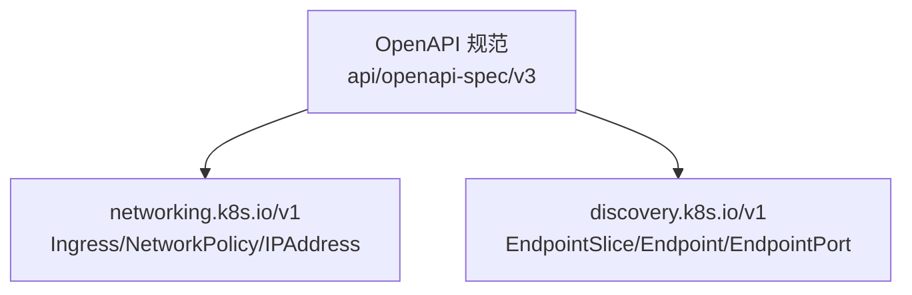
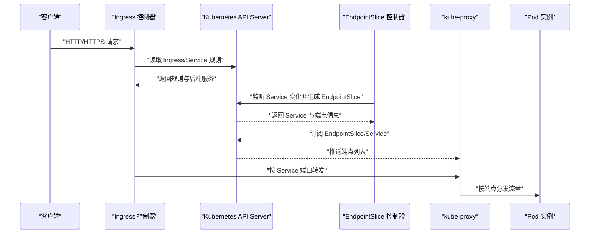
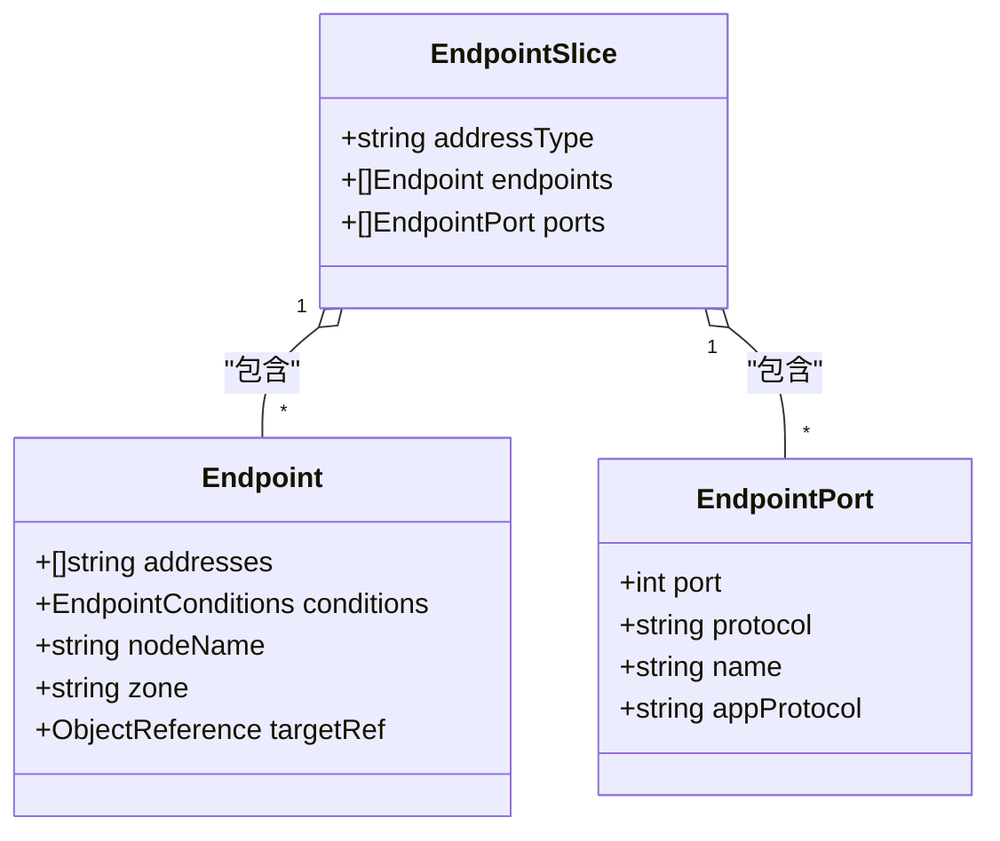
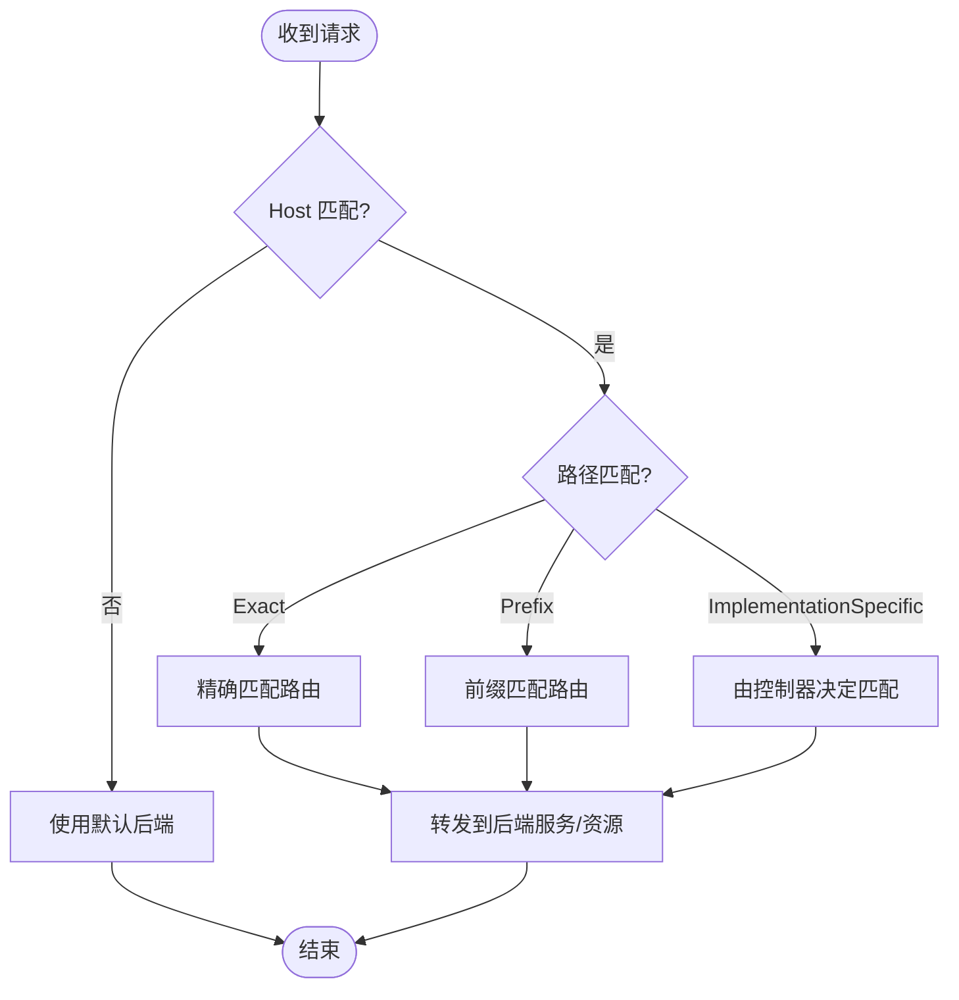
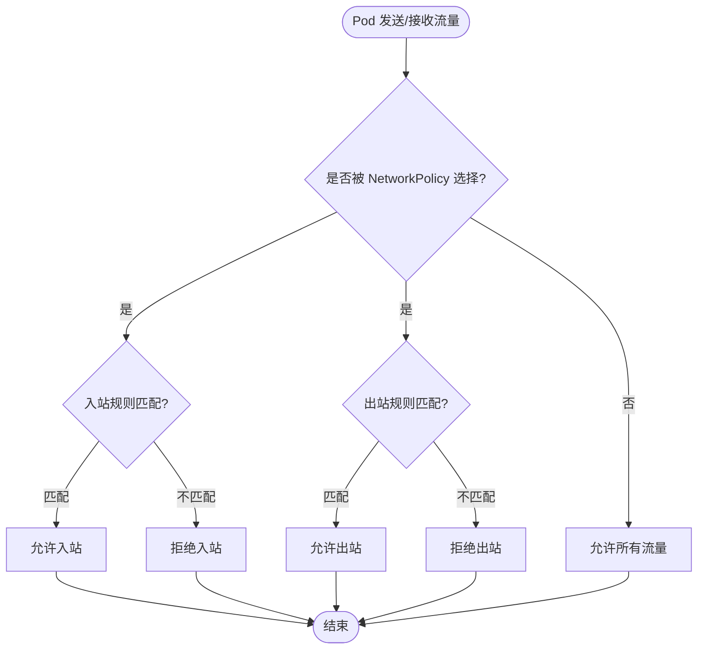
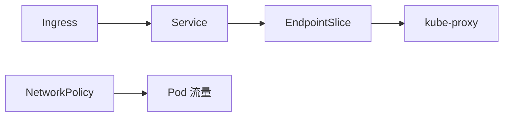

# 服务发现与网络资源

<cite>
**本文引用的文件**   
- [README.md](file://README.md)
- [apis__networking.k8s.io__v1_openapi.json](file://api/openapi-spec/v3/apis__networking.k8s.io__v1_openapi.json)
- [apis__discovery.k8s.io__v1_openapi.json](file://api/openapi-spec/v3/apis__discovery.k8s.io__v1_openapi.json)
</cite>

## 目录
1. [简介](#简介)
2. [项目结构](#项目结构)
3. [核心组件](#核心组件)
4. [架构总览](#架构总览)
5. [详细组件分析](#详细组件分析)
6. [依赖关系分析](#依赖关系分析)
7. [性能考虑](#性能考虑)
8. [故障排查指南](#故障排查指南)
9. [结论](#结论)
10. [附录](#附录)

## 简介
本文件面向 Kubernetes 服务发现与网络相关资源的定义、用途与配置方式，重点覆盖以下资源：Service、Endpoint、EndpointSlice、Ingress、NetworkPolicy。文档从 API 规范出发，解释字段结构、流量分发机制、负载均衡策略与安全控制规则，并提供不同 Service 类型的比较、网络性能优化建议以及版本演进与兼容性注意事项。

## 项目结构
仓库根目录包含 OpenAPI 规范定义，其中与网络与服务发现相关的核心 schema 位于 v3 目录下：
- networking.k8s.io/v1：Ingress、IngressClass、NetworkPolicy、IPAddress 等
- discovery.k8s.io/v1：EndpointSlice、Endpoint、EndpointPort 等

这些 OpenAPI 文件是理解资源字段、约束与行为的基础来源。

**图表来源** 
- [apis__networking.k8s.io__v1_openapi.json](file://api/openapi-spec/v3/apis__networking.k8s.io__v1_openapi.json)
- [apis__discovery.k8s.io__v1_openapi.json](file://api/openapi-spec/v3/apis__discovery.k8s.io__v1_openapi.json)

**章节来源**
- [README.md:1-101](file://README.md#L1-L101)

## 核心组件
本节基于 OpenAPI 规范，梳理各网络资源的职责与关键字段。

- Endpoint（discovery.k8s.io/v1）
  - 表示一个逻辑后端，包含地址、条件（ready/serving/terminating）、节点名、区域、目标引用等
  - 用于描述单个端点的状态与拓扑信息
- EndpointSlice（discovery.k8s.io/v1）
  - 一组服务端点的集合，支持按地址类型（IPv4/IPv6/FQDN）分片，每个切片最多包含若干端点与端口
  - 通过标签 kubernetes.io/service-name 关联到 Service
- Ingress（networking.k8s.io/v1）
  - 入站连接规则集合，将外部请求路由到后端服务或自定义资源
  - 支持主机匹配、路径匹配、TLS 终止、默认后端、IngressClass 选择
- NetworkPolicy（networking.k8s.io/v1）
  - 对 Pod 的入站/出站流量进行白名单式控制
  - 支持基于 IPBlock、命名空间选择器、Pod 选择器的对端定义，以及端口与协议限制

上述资源在集群中协同工作：Service 通过 EndpointSlice 暴露后端；Ingress 将外部流量引入 Service；NetworkPolicy 对跨 Pod 的通信进行安全隔离。

**章节来源**
- [apis__discovery.k8s.io__v1_openapi.json:39-217](file://api/openapi-spec/v3/apis__discovery.k8s.io__v1_openapi.json#L39-L217)
- [apis__networking.k8s.io__v1_openapi.json:194-596](file://api/openapi-spec/v3/apis__networking.k8s.io__v1_openapi.json#L194-L596)
- [apis__networking.k8s.io__v1_openapi.json:597-800](file://api/openapi-spec/v3/apis__networking.k8s.io__v1_openapi.json#L597-L800)

## 架构总览
下图展示了服务发现与网络入口的整体流程：客户端通过 Ingress 进入集群，由 IngressController 根据规则转发到 Service，再由 kube-proxy 基于 EndpointSlice 将流量分发到具体 Pod。

**图表来源** 
- [apis__networking.k8s.io__v1_openapi.json:194-596](file://api/openapi-spec/v3/apis__networking.k8s.io__v1_openapi.json#L194-L596)
- [apis__discovery.k8s.io__v1_openapi.json:164-217](file://api/openapi-spec/v3/apis__discovery.k8s.io__v1_openapi.json#L164-L217)

## 详细组件分析

### EndpointSlice 与 Endpoint
- EndpointSlice 提供高效的分片化端点集合，避免单对象过大导致性能问题
- Endpoint 包含 ready/serving/terminating 条件，便于健康检查与优雅下线
- EndpointPort 支持应用协议提示（如 h2c/ws/wss），帮助实现更丰富的行为

**图表来源** 
- [apis__discovery.k8s.io__v1_openapi.json:164-217](file://api/openapi-spec/v3/apis__discovery.k8s.io__v1_openapi.json#L164-L217)
- [apis__discovery.k8s.io__v1_openapi.json:39-163](file://api/openapi-spec/v3/apis__discovery.k8s.io__v1_openapi.json#L39-L163)

**章节来源**
- [apis__discovery.k8s.io__v1_openapi.json:39-217](file://api/openapi-spec/v3/apis__discovery.k8s.io__v1_openapi.json#L39-L217)

### Ingress 与 IngressClass
- Ingress 定义主机与路径规则，将请求路由到后端服务或自定义资源
- IngressClass 指定由哪个控制器处理该 Ingress，支持默认类与参数扩展
- HTTPIngressPath 支持 Exact/Prefix/ImplementationSpecific 三种路径匹配策略

**图表来源** 
- [apis__networking.k8s.io__v1_openapi.json:29-72](file://api/openapi-spec/v3/apis__networking.k8s.io__v1_openapi.json#L29-L72)
- [apis__networking.k8s.io__v1_openapi.json:242-263](file://api/openapi-spec/v3/apis__networking.k8s.io__v1_openapi.json#L242-L263)
- [apis__networking.k8s.io__v1_openapi.json:264-392](file://api/openapi-spec/v3/apis__networking.k8s.io__v1_openapi.json#L264-L392)

**章节来源**
- [apis__networking.k8s.io__v1_openapi.json:194-596](file://api/openapi-spec/v3/apis__networking.k8s.io__v1_openapi.json#L194-L596)

### NetworkPolicy 安全控制
- 通过 podSelector 选择受控 Pod
- ingress/egress 规则分别控制入站与出站流量
- 对端可基于 IPBlock、namespaceSelector、podSelector 组合定义
- 端口与协议可在规则中限定

**图表来源** 
- [apis__networking.k8s.io__v1_openapi.json:597-800](file://api/openapi-spec/v3/apis__networking.k8s.io__v1_openapi.json#L597-L800)

**章节来源**
- [apis__networking.k8s.io__v1_openapi.json:597-800](file://api/openapi-spec/v3/apis__networking.k8s.io__v1_openapi.json#L597-L800)

### Service 类型比较（ClusterIP、NodePort、LoadBalancer、ExternalName）
- ClusterIP：仅在集群内部可达，适合服务间通信
- NodePort：在每个节点上暴露固定端口，适合测试与临时访问
- LoadBalancer：借助云提供商创建外部负载均衡器，适合对外暴露服务
- ExternalName：将服务映射为外部 DNS 名称，适合代理外部系统

说明：以上比较基于通用 Kubernetes 概念与常见实践，结合本仓库提供的网络资源能力（如 Ingress 与 EndpointSlice）进行补充。

[本节为概念性内容，未直接分析具体源码文件]

## 依赖关系分析
- Ingress 依赖 Service 作为后端，并通过 IngressClass 绑定控制器
- EndpointSlice 由控制器根据 Service 生成，供 kube-proxy 消费
- NetworkPolicy 独立于 Service/EndpointSlice，作用于 Pod 级别的流量控制

**图表来源** 
- [apis__networking.k8s.io__v1_openapi.json:242-263](file://api/openapi-spec/v3/apis__networking.k8s.io__v1_openapi.json#L242-L263)
- [apis__discovery.k8s.io__v1_openapi.json:164-217](file://api/openapi-spec/v3/apis__discovery.k8s.io__v1_openapi.json#L164-L217)

**章节来源**
- [apis__networking.k8s.io__v1_openapi.json:194-596](file://api/openapi-spec/v3/apis__networking.k8s.io__v1_openapi.json#L194-L596)
- [apis__discovery.k8s.io__v1_openapi.json:164-217](file://api/openapi-spec/v3/apis__discovery.k8s.io__v1_openapi.json#L164-L217)

## 性能考虑
- 使用 EndpointSlice 替代传统 Endpoint，减少大对象带来的序列化与传输开销
- 合理设置 Ingress 的路径匹配策略，避免过度复杂的规则导致匹配延迟
- 利用 NetworkPolicy 的精准选择器与端口限制，降低不必要的流量处理
- 对于高并发场景，优先采用 LoadBalancer 或高性能 Ingress 控制器，并结合多副本与水平扩展

[本节为一般性指导，未直接分析具体源码文件]

## 故障排查指南
- Ingress 无法访问
  - 检查 IngressClass 是否正确绑定控制器
  - 确认 Ingress 规则中的 host/path 与后端 Service 端口一致
  - 查看 Ingress 状态中的 loadBalancer 字段以定位外部接入问题
- EndpointSlice 无端点
  - 确认 Service 的 selector 是否匹配 Pod 标签
  - 检查 Pod 的 ready 条件与 Endpoint 的 serving/ready 状态
  - 验证 EndpointSlice 的 addressType 与网络栈（IPv4/IPv6）一致性
- NetworkPolicy 阻断流量
  - 核对 podSelector 是否命中目标 Pod
  - 检查 from/to 的对端选择器与 IPBlock 范围
  - 确认端口与协议是否在规则中显式允许

**章节来源**
- [apis__networking.k8s.io__v1_openapi.json:564-578](file://api/openapi-spec/v3/apis__networking.k8s.io__v1_openapi.json#L564-L578)
- [apis__discovery.k8s.io__v1_openapi.json:100-117](file://api/openapi-spec/v3/apis__discovery.k8s.io__v1_openapi.json#L100-L117)
- [apis__networking.k8s.io__v1_openapi.json:720-772](file://api/openapi-spec/v3/apis__networking.k8s.io__v1_openapi.json#L720-L772)

## 结论
通过 EndpointSlice 的高效分片、Ingress 的灵活路由与 NetworkPolicy 的安全控制，Kubernetes 提供了完善的服务发现与网络能力。在实际部署中，应结合业务需求选择合适的 Service 类型与网络策略，关注性能与安全性平衡，并遵循版本演进的最佳实践。

[本节为总结性内容，未直接分析具体源码文件]

## 附录
- 版本演进与兼容性
  - EndpointSlice 逐步替代 Endpoint，提升大规模集群下的可扩展性
  - IngressClass 取代注解方式，提供更清晰的控制器绑定与参数扩展
  - NetworkPolicy 持续增强，支持更多对端与端口范围表达
- YAML 配置示例参考
  - 内部服务访问：使用 ClusterIP Service 与 EndpointSlice
  - 外部流量入口：使用 Ingress 与 IngressClass 指向 Service
  - 网络安全隔离：使用 NetworkPolicy 限制跨 Pod 的入站/出站流量

[本节为概念性内容，未直接分析具体源码文件]