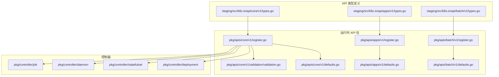
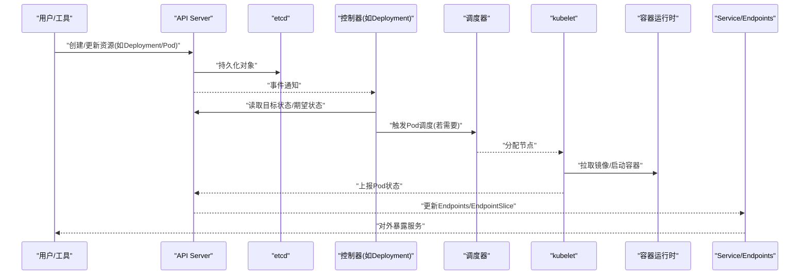
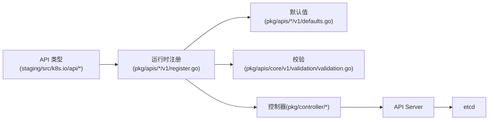

# 资源对象详解

<cite>
**本文引用的文件**   
- [pkg/apis/core/v1/doc.go](file://pkg/apis/core/v1/doc.go)
- [pkg/apis/core/v1/register.go](file://pkg/apis/core/v1/register.go)
- [pkg/apis/core/v1/defaults.go](file://pkg/apis/core/v1/defaults.go)
- [pkg/apis/core/v1/validation/validation.go](file://pkg/apis/core/v1/validation/validation.go)
- [pkg/apis/apps/v1/doc.go](file://pkg/apis/apps/v1/doc.go)
- [pkg/apis/apps/v1/register.go](file://pkg/apis/apps/v1/register.go)
- [pkg/apis/apps/v1/defaults.go](file://pkg/apis/apps/v1/defaults.go)
- [pkg/apis/batch/v1/doc.go](file://pkg/apis/batch/v1/doc.go)
- [pkg/apis/batch/v1/register.go](file://pkg/apis/batch/v1/register.go)
- [pkg/apis/batch/v1/defaults.go](file://pkg/apis/batch/v1/defaults.go)
- [staging/src/k8s.io/api/core/v1/types.go](file://staging/src/k8s.io/api/core/v1/types.go)
- [staging/src/k8s.io/api/apps/v1/types.go](file://staging/src/k8s.io/api/apps/v1/types.go)
- [staging/src/k8s.io/api/batch/v1/types.go](file://staging/src/k8s.io/api/batch/v1/types.go)
- [staging/src/k8s.io/api/core/v1/pod_types.go](file://staging/src/k8s.io/api/core/v1/pod_types.go)
- [staging/src/k8s.io/api/core/v1/service_types.go](file://staging/src/k8s.io/api/core/v1/service_types.go)
- [staging/src/k8s.io/api/core/v1/configmap_types.go](file://staging/src/k8s.io/api/core/v1/configmap_types.go)
- [staging/src/k8s.io/api/core/v1/secret_types.go](file://staging/src/k8s.io/api/core/v1/secret_types.go)
- [staging/src/k8s.io/api/apps/v1/deployment_types.go](file://staging/src/k8s.io/api/apps/v1/deployment_types.go)
- [staging/src/k8s.io/api/apps/v1/statefulset_types.go](file://staging/src/k8s.io/api/apps/v1/statefulset_types.go)
- [staging/src/k8s.io/api/apps/v1/daemonset_types.go](file://staging/src/k8s.io/api/apps/v1/daemonset_types.go)
- [staging/src/k8s.io/api/batch/v1/job_types.go](file://staging/src/k8s.io/api/batch/v1/job_types.go)
- [staging/src/k8s.io/api/core/v1/objectreference_types.go](file://staging/src/k8s.io/api/core/v1/objectreference_types.go)
- [staging/src/k8s.io/api/core/v1/garbagecollector_types.go](file://staging/src/k8s.io/api/core/v1/garbagecollector_types.go)
</cite>

## 目录
1. [简介](#简介)
2. [项目结构](#项目结构)
3. [核心组件](#核心组件)
4. [架构总览](#架构总览)
5. [详细组件分析](#详细组件分析)
6. [依赖关系分析](#依赖关系分析)
7. [性能考虑](#性能考虑)
8. [故障排查指南](#故障排查指南)
9. [结论](#结论)
10. [附录](#附录)

## 简介
本文件面向Kubernetes核心资源对象，系统性梳理Pod、Service、Deployment、StatefulSet、DaemonSet、Job、ConfigMap、Secret等对象的定义、用途与配置方式。文档从API类型定义、控制器实现、生命周期状态转换、引用与级联删除机制、版本兼容性、性能考量与故障排查等方面展开，并提供丰富的YAML使用场景与最佳实践指引（以“代码片段路径”形式给出示例位置）。

## 项目结构
Kubernetes将核心API类型集中在staging模块中，运行时通过pkg/apis进行注册、默认值填充与校验；各控制器位于pkg/controller下，负责协调实际集群状态。

图示来源
- [pkg/apis/core/v1/register.go](file://pkg/apis/core/v1/register.go)
- [pkg/apis/apps/v1/register.go](file://pkg/apis/apps/v1/register.go)
- [pkg/apis/batch/v1/register.go](file://pkg/apis/batch/v1/register.go)
- [pkg/apis/core/v1/defaults.go](file://pkg/apis/core/v1/defaults.go)
- [pkg/apis/apps/v1/defaults.go](file://pkg/apis/apps/v1/defaults.go)
- [pkg/apis/batch/v1/defaults.go](file://pkg/apis/batch/v1/defaults.go)
- [pkg/apis/core/v1/validation/validation.go](file://pkg/apis/core/v1/validation/validation.go)
- [staging/src/k8s.io/api/core/v1/types.go](file://staging/src/k8s.io/api/core/v1/types.go)
- [staging/src/k8s.io/api/apps/v1/types.go](file://staging/src/k8s.io/api/apps/v1/types.go)
- [staging/src/k8s.io/api/batch/v1/types.go](file://staging/src/k8s.io/api/batch/v1/types.go)

章节来源
- [pkg/apis/core/v1/doc.go](file://pkg/apis/core/v1/doc.go)
- [pkg/apis/apps/v1/doc.go](file://pkg/apis/apps/v1/doc.go)
- [pkg/apis/batch/v1/doc.go](file://pkg/apis/batch/v1/doc.go)

## 核心组件
本节聚焦以下核心资源：
- Pod：最小可部署的计算单元，封装容器及其运行环境。
- Service：为Pod提供稳定的网络访问入口与负载均衡。
- Deployment：无状态工作负载的声明式管理，支持滚动更新与回滚。
- StatefulSet：有状态工作负载的管理，保证稳定网络标识与持久化存储绑定。
- DaemonSet：在每个节点（或选择节点）上运行一个Pod副本。
- Job/CronJob：执行一次性任务或周期性任务。
- ConfigMap/Secret：非敏感与敏感配置数据载体。

章节来源
- [staging/src/k8s.io/api/core/v1/pod_types.go](file://staging/src/k8s.io/api/core/v1/pod_types.go)
- [staging/src/k8s.io/api/core/v1/service_types.go](file://staging/src/k8s.io/api/core/v1/service_types.go)
- [staging/src/k8s.io/api/apps/v1/deployment_types.go](file://staging/src/k8s.io/api/apps/v1/deployment_types.go)
- [staging/src/k8s.io/api/apps/v1/statefulset_types.go](file://staging/src/k8s.io/api/apps/v1/statefulset_types.go)
- [staging/src/k8s.io/api/apps/v1/daemonset_types.go](file://staging/src/k8s.io/api/apps/v1/daemonset_types.go)
- [staging/src/k8s.io/api/batch/v1/job_types.go](file://staging/src/k8s.io/api/batch/v1/job_types.go)
- [staging/src/k8s.io/api/core/v1/configmap_types.go](file://staging/src/k8s.io/api/core/v1/configmap_types.go)
- [staging/src/k8s.io/api/core/v1/secret_types.go](file://staging/src/k8s.io/api/core/v1/secret_types.go)

## 架构总览
下图展示典型工作负载从声明到落地的关键流程：用户提交资源 -> API Server接收并持久化 -> 控制器监听变化 -> 调度器分配节点 -> kubelet在节点上创建容器 -> 服务发现暴露。

图示来源
- [pkg/apis/core/v1/register.go](file://pkg/apis/core/v1/register.go)
- [pkg/apis/apps/v1/register.go](file://pkg/apis/apps/v1/register.go)
- [pkg/controller/deployment](file://pkg/controller/deployment)
- [pkg/controller/statefulset](file://pkg/controller/statefulset)
- [pkg/controller/daemon](file://pkg/controller/daemon)
- [pkg/controller/job](file://pkg/controller/job)

## 详细组件分析

### Pod
- 定义与用途
  - 最小部署单元，包含一个或多个容器、共享存储卷和网络命名空间。
- 关键字段
  - metadata、spec.containers[]、spec.volumes[]、spec.restartPolicy、spec.schedulerName、spec.tolerations[]、spec.affinity{}、status.phase/status.conditions[]等。
- 生命周期与状态
  - Phase：Pending → Running → Succeeded/Failed；条件Conditions反映Ready、ContainersReady、Initialized等。
- 依赖关系
  - 依赖Node、Volume、ImagePullSecret、ConfigMap/Secret、ServiceAccount等。
- 常见模式与示例
  - 单容器应用、多容器Sidecar、Init Container、探针（liveness/readiness/startup）、资源请求与限制、亲和性与污点容忍。
- 最佳实践
  - 明确资源请求/限制；合理设置探针；避免热路径频繁重建；使用优雅终止；为关键路径配置PDB。
- 版本兼容
  - v1 core API，字段演进遵循向后兼容策略。

章节来源
- [staging/src/k8s.io/api/core/v1/pod_types.go](file://staging/src/k8s.io/api/core/v1/pod_types.go)
- [staging/src/k8s.io/api/core/v1/types.go](file://staging/src/k8s.io/api/core/v1/types.go)
- [pkg/apis/core/v1/defaults.go](file://pkg/apis/core/v1/defaults.go)
- [pkg/apis/core/v1/validation/validation.go](file://pkg/apis/core/v1/validation/validation.go)

### Service
- 定义与用途
  - 为一组Pod提供稳定的IP/DNS与负载均衡，支持ClusterIP、NodePort、LoadBalancer、ExternalName等类型。
- 关键字段
  - spec.selector、spec.ports[]、spec.type、spec.sessionAffinity、spec.externalTrafficPolicy、spec.ipFamilyPolicy等。
- 关联关系
  - 通过selector匹配Pod标签，动态维护Endpoints/EndpointSlice。
- 常见模式与示例
  - 内部微服务访问、外部暴露、头部/会话保持、IPv4/IPv6双栈。
- 最佳实践
  - 使用精确selector；谨慎使用NodePort；结合Ingress/网关；关注流量模型与跨域。
- 版本兼容
  - v1 core API，新增特性随版本逐步启用。

章节来源
- [staging/src/k8s.io/api/core/v1/service_types.go](file://staging/src/k8s.io/api/core/v1/service_types.go)
- [staging/src/k8s.io/api/core/v1/types.go](file://staging/src/k8s.io/api/core/v1/types.go)

### Deployment
- 定义与用途
  - 管理无状态副本集，支持滚动更新、扩缩容与回滚。
- 关键字段
  - spec.selector、spec.template(Pod模板)、spec.strategy(滚动更新/Recreate)、spec.revisionHistoryLimit、spec.paused、status.conditions[]等。
- 控制器行为
  - 创建/管理ReplicaSet；跟踪RollingUpdate进度；保留历史版本以便回滚。
- 常见模式与示例
  - 灰度发布、蓝绿发布（借助多Deployment+Service切换）、金丝雀发布（借助权重/多副本）。
- 最佳实践
  - 合理设置滚动参数(maxUnavailable/maxSurge)；配合探针与PDB；控制历史版本数量。
- 版本兼容
  - apps/v1，废弃旧版apps/v1beta1等。

章节来源
- [staging/src/k8s.io/api/apps/v1/deployment_types.go](file://staging/src/k8s.io/api/apps/v1/deployment_types.go)
- [staging/src/k8s.io/api/apps/v1/types.go](file://staging/src/k8s.io/api/apps/v1/types.go)
- [pkg/apis/apps/v1/register.go](file://pkg/apis/apps/v1/register.go)
- [pkg/apis/apps/v1/defaults.go](file://pkg/apis/apps/v1/defaults.go)

### StatefulSet
- 定义与用途
  - 管理有状态应用，提供稳定网络标识与持久化存储绑定。
- 关键字段
  - spec.replicas、spec.serviceName、spec.volumeClaimTemplates[]、spec.updateStrategy、spec.podManagementPolicy等。
- 稳定性特征
  - 有序部署/扩缩容；稳定Pod名称与DNS；独立持久卷绑定。
- 常见模式与示例
  - 数据库集群、消息队列、分布式存储节点。
- 最佳实践
  - 设计幂等初始化逻辑；合理设置updateStrategy；监控磁盘I/O与备份恢复。
- 版本兼容
  - apps/v1。

章节来源
- [staging/src/k8s.io/api/apps/v1/statefulset_types.go](file://staging/src/k8s.io/api/apps/v1/statefulset_types.go)
- [staging/src/k8s.io/api/apps/v1/types.go](file://staging/src/k8s.io/api/apps/v1/types.go)

### DaemonSet
- 定义与用途
  - 确保每个节点（或按选择器）运行一个Pod副本，常用于日志采集、监控代理、网络插件。
- 关键字段
  - spec.selector、spec.template、spec.updateStrategy、spec.nodeSelector、spec.tolerations[]等。
- 常见模式与示例
  - 节点侧Agent、系统守护进程。
- 最佳实践
  - 使用nodeSelector/tolerations精准投放；注意资源隔离与升级策略。
- 版本兼容
  - apps/v1。

章节来源
- [staging/src/k8s.io/api/apps/v1/daemonset_types.go](file://staging/src/k8s.io/api/apps/v1/daemonset_types.go)
- [staging/src/k8s.io/api/apps/v1/types.go](file://staging/src/k8s.io/api/apps/v1/types.go)

### Job
- 定义与用途
  - 执行一次性任务，成功完成后不再重启；CronJob用于周期性调度。
- 关键字段
  - spec.template(Pod模板)、spec.completions、spec.parallelism、spec.backoffLimit、spec.activeDeadlineSeconds、spec.suspend、status.conditions[]等。
- 常见模式与示例
  - 批处理、数据迁移、定时清理任务。
- 最佳实践
  - 设置合理的重试与超时；使用initContainer准备环境；利用TTLAfterFinished自动清理。
- 版本兼容
  - batch/v1。

章节来源
- [staging/src/k8s.io/api/batch/v1/job_types.go](file://staging/src/k8s.io/api/batch/v1/job_types.go)
- [staging/src/k8s.io/api/batch/v1/types.go](file://staging/src/k8s.io/api/batch/v1/types.go)
- [pkg/apis/batch/v1/register.go](file://pkg/apis/batch/v1/register.go)
- [pkg/apis/batch/v1/defaults.go](file://pkg/apis/batch/v1/defaults.go)

### ConfigMap
- 定义与用途
  - 存储非敏感配置键值对，供Pod以环境变量或挂载卷方式使用。
- 关键字段
  - data、binaryData、immutable（只读优化）。
- 常见模式与示例
  - 应用配置中心、脚本注入、环境变量覆盖。
- 最佳实践
  - 大体积配置优先使用卷挂载；敏感信息放入Secret；合理使用immutable提升性能。
- 版本兼容
  - v1 core API。

章节来源
- [staging/src/k8s.io/api/core/v1/configmap_types.go](file://staging/src/k8s.io/api/core/v1/configmap_types.go)
- [staging/src/k8s.io/api/core/v1/types.go](file://staging/src/k8s.io/api/core/v1/types.go)

### Secret
- 定义与用途
  - 存储敏感信息（如密钥、证书），以base64编码存储，建议开启加密存储。
- 关键字段
  - type、data、stringData、immutable。
- 常见模式与示例
  - 数据库密码、TLS证书、镜像仓库凭据。
- 最佳实践
  - 启用etcd静态加密；限制RBAC访问；定期轮换；避免在日志中泄露。
- 版本兼容
  - v1 core API。

章节来源
- [staging/src/k8s.io/api/core/v1/secret_types.go](file://staging/src/k8s.io/api/core/v1/secret_types.go)
- [staging/src/k8s.io/api/core/v1/types.go](file://staging/src/k8s.io/api/core/v1/types.go)

### 引用关系与级联删除
- 引用关系
  - Pod通过spec.nodeName、spec.volumes、spec.imagePullSecrets、spec.serviceAccountName等引用其他对象；Service通过spec.selector匹配Pod标签；Workload控制器通过OwnerReference建立父子关系。
- 级联删除
  - 当父对象被删除时，子对象可按策略自动回收（如删除Deployment会级联删除其管理的Pod/ReplicaSet）。
- 相关类型
  - OwnerReference、ObjectReference、GarbageCollector策略。

章节来源
- [staging/src/k8s.io/api/core/v1/objectreference_types.go](file://staging/src/k8s.io/api/core/v1/objectreference_types.go)
- [staging/src/k8s.io/api/core/v1/garbagecollector_types.go](file://staging/src/k8s.io/api/core/v1/garbagecollector_types.go)

## 依赖关系分析
- API层
  - staging/src/k8s.io/api/* 定义所有资源对象的结构与枚举。
- 运行时API包
  - pkg/apis/*/v1 负责注册、默认值、校验与转换。
- 控制器层
  - pkg/controller/* 监听API变更，驱动期望状态与实际状态一致。
- 组件交互
  - API Server ↔ etcd；控制器 ↔ API Server；调度器 ↔ API Server；kubelet ↔ API Server。

图示来源
- [staging/src/k8s.io/api/core/v1/types.go](file://staging/src/k8s.io/api/core/v1/types.go)
- [staging/src/k8s.io/api/apps/v1/types.go](file://staging/src/k8s.io/api/apps/v1/types.go)
- [staging/src/k8s.io/api/batch/v1/types.go](file://staging/src/k8s.io/api/batch/v1/types.go)
- [pkg/apis/core/v1/register.go](file://pkg/apis/core/v1/register.go)
- [pkg/apis/apps/v1/register.go](file://pkg/apis/apps/v1/register.go)
- [pkg/apis/batch/v1/register.go](file://pkg/apis/batch/v1/register.go)
- [pkg/apis/core/v1/defaults.go](file://pkg/apis/core/v1/defaults.go)
- [pkg/apis/apps/v1/defaults.go](file://pkg/apis/apps/v1/defaults.go)
- [pkg/apis/batch/v1/defaults.go](file://pkg/apis/batch/v1/defaults.go)
- [pkg/apis/core/v1/validation/validation.go](file://pkg/apis/core/v1/validation/validation.go)

章节来源
- [pkg/apis/core/v1/register.go](file://pkg/apis/core/v1/register.go)
- [pkg/apis/apps/v1/register.go](file://pkg/apis/apps/v1/register.go)
- [pkg/apis/batch/v1/register.go](file://pkg/apis/batch/v1/register.go)

## 性能考虑
- 资源配额与限制
  - 为容器设置requests/limits，避免争用与抖动；结合HPA/VPA进行弹性伸缩。
- 探针与就绪性
  - 合理配置readiness/liveness探针，减少无效流量与重启风暴。
- 滚动更新策略
  - 调整maxUnavailable/maxSurge平衡可用性与更新速度；配合PDB保障最低可用副本。
- 存储与I/O
  - 有状态工作负载选择合适的StorageClass与PV；避免热点盘；监控IOPS与延迟。
- 网络与服务
  - 使用EndpointSlice提高大规模服务发现性能；谨慎使用NodePort；结合Ingress/网关优化。
- 配置与Secret
  - 大配置使用卷挂载而非环境变量；启用immutable减少不必要的同步开销。

[本节为通用指导，不直接分析具体文件]

## 故障排查指南
- Pod无法调度
  - 检查节点资源不足、污点/容忍、亲和/反亲和、拓扑约束；查看Events与描述信息。
- Pod反复重启
  - 检查探针失败原因、OOM、镜像拉取失败、权限与配置错误；查看容器日志与退出码。
- Service不可达
  - 确认selector匹配、Endpoints/EndpointSlice正常、网络策略未阻断；验证端口与协议。
- Deployment更新卡住
  - 检查滚动策略、探针、PDB、资源不足；查看Revision与历史版本。
- StatefulSet扩容异常
  - 检查PV/PVC绑定、存储类可用性、Pod命名与顺序、更新策略。
- Job失败或重复执行
  - 检查completions/parallelism、backoffLimit、activeDeadlineSeconds、TTLAfterFinished。
- ConfigMap/Secret未生效
  - 确认挂载路径与文件名、只读属性、更新传播；敏感信息是否被正确注入。

章节来源
- [pkg/apis/core/v1/validation/validation.go](file://pkg/apis/core/v1/validation/validation.go)
- [staging/src/k8s.io/api/core/v1/pod_types.go](file://staging/src/k8s.io/api/core/v1/pod_types.go)
- [staging/src/k8s.io/api/core/v1/service_types.go](file://staging/src/k8s.io/api/core/v1/service_types.go)
- [staging/src/k8s.io/api/apps/v1/deployment_types.go](file://staging/src/k8s.io/api/apps/v1/deployment_types.go)
- [staging/src/k8s.io/api/apps/v1/statefulset_types.go](file://staging/src/k8s.io/api/apps/v1/statefulset_types.go)
- [staging/src/k8s.io/api/batch/v1/job_types.go](file://staging/src/k8s.io/api/batch/v1/job_types.go)

## 结论
通过对核心资源对象的API定义、控制器行为、生命周期与引用关系的深入解析，可以构建更稳健的应用编排方案。建议在设计与运维中重视资源边界、可观测性与可恢复性，并结合版本特性与平台能力持续优化。

[本节为总结性内容，不直接分析具体文件]

## 附录
- YAML示例路径（仅列出路径，不包含具体内容）
  - Pod示例：[testdata/exemplar_pod.yaml](file://pkg/apis/core/v1/testdata/exemplar_pod.yaml)
  - Service示例：[hack/testdata/kubernetes-service.yaml](file://hack/testdata/kubernetes-service.yaml)
  - Deployment示例：[hack/testdata/multi-resource-yaml.yaml](file://hack/testdata/multi-resource-yaml.yaml)
  - StatefulSet示例：[hack/testdata/rollingupdate-statefulset.yaml](file://hack/testdata/rollingupdate-statefulset.yaml)
  - DaemonSet示例：[hack/testdata/rollingupdate-daemonset.yaml](file://hack/testdata/rollingupdate-daemonset.yaml)
  - Job示例：[hack/testdata/multi-resource-yaml.yaml](file://hack/testdata/multi-resource-yaml.yaml)
  - ConfigMap示例：[hack/testdata/configmap.yaml](file://hack/testdata/configmap.yaml)
  - Secret示例：[hack/testdata/secret.yaml](file://hack/testdata/secret.yaml)

章节来源
- [pkg/apis/core/v1/testdata/exemplar_pod.yaml](file://pkg/apis/core/v1/testdata/exemplar_pod.yaml)
- [hack/testdata/kubernetes-service.yaml](file://hack/testdata/kubernetes-service.yaml)
- [hack/testdata/multi-resource-yaml.yaml](file://hack/testdata/multi-resource-yaml.yaml)
- [hack/testdata/rollingupdate-statefulset.yaml](file://hack/testdata/rollingupdate-statefulset.yaml)
- [hack/testdata/rollingupdate-daemonset.yaml](file://hack/testdata/rollingupdate-daemonset.yaml)
- [hack/testdata/configmap.yaml](file://hack/testdata/configmap.yaml)
- [hack/testdata/secret.yaml](file://hack/testdata/secret.yaml)