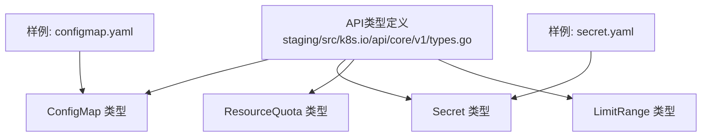
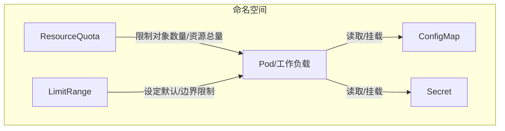
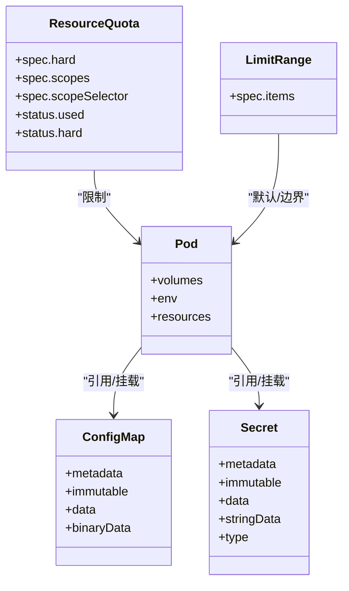

# 配置管理资源

<cite>
**本文引用的文件**   
- [staging/src/k8s.io/api/core/v1/types.go](file://staging/src/k8s.io/api/core/v1/types.go)
- [hack/testdata/configmap.yaml](file://hack/testdata/configmap.yaml)
- [hack/testdata/secret.yaml](file://hack/testdata/secret.yaml)
- [test/fixtures/doc-yaml/user-guide/configmap/configmap.yaml](file://test/fixtures/doc-yaml/user-guide/configmap/configmap.yaml)
- [test/fixtures/doc-yaml/user-guide/secrets/secret.yaml](file://test/fixtures/doc-yaml/user-guide/secrets/secret.yaml)
</cite>

## 目录
1. [简介](#简介)
2. [项目结构](#项目结构)
3. [核心组件](#核心组件)
4. [架构总览](#架构总览)
5. [详细组件分析](#详细组件分析)
6. [依赖关系分析](#依赖关系分析)
7. [性能与容量规划](#性能与容量规划)
8. [故障排查指南](#故障排查指南)
9. [结论](#结论)
10. [附录：YAML示例路径](#附录yaml示例路径)

## 简介
本文件面向Kubernetes用户与平台工程师，系统化阐述以下配置与管理资源的定义、用途与配置方式：ConfigMap、Secret、ResourceQuota、LimitRange。内容覆盖字段结构、数据挂载机制、安全存储策略、资源限制规则、热更新机制、环境变量注入方式、最佳安全实践以及生命周期管理与版本控制策略。文档以仓库中的API类型定义与测试样例为依据，确保信息准确可追溯。

## 项目结构
围绕配置管理资源，仓库中关键位置包括：
- API类型定义：位于 staging/src/k8s.io/api/core/v1/types.go，集中定义了 ConfigMap、Secret、ResourceQuota、LimitRange 及其关联的枚举、常量与列表类型。
- YAML样例：位于 hack/testdata 与 test/fixtures/doc-yaml，提供最小可用的配置示例，便于快速上手与验证。

图表来源
- [staging/src/k8s.io/api/core/v1/types.go:7750-7949](file://staging/src/k8s.io/api/core/v1/types.go#L7750-L7949)
- [staging/src/k8s.io/api/core/v1/types.go:7964-8143](file://staging/src/k8s.io/api/core/v1/types.go#L7964-L8143)
- [hack/testdata/configmap.yaml:1-7](file://hack/testdata/configmap.yaml#L1-L7)
- [hack/testdata/secret.yaml:1-8](file://hack/testdata/secret.yaml#L1-L8)

章节来源
- [staging/src/k8s.io/api/core/v1/types.go:7750-7949](file://staging/src/k8s.io/api/core/v1/types.go#L7750-L7949)
- [staging/src/k8s.io/api/core/v1/types.go:7964-8143](file://staging/src/k8s.io/api/core/v1/types.go#L7964-L8143)
- [hack/testdata/configmap.yaml:1-7](file://hack/testdata/configmap.yaml#L1-L7)
- [hack/testdata/secret.yaml:1-8](file://hack/testdata/secret.yaml#L1-L8)

## 核心组件
本节聚焦四类核心配置与管理资源，说明其职责与典型使用场景。

- ConfigMap
  - 用途：为Pod提供非敏感的配置数据（键值对或二进制数据）。
  - 特点：支持不可变模式；Data与BinaryData键集合互斥；可通过Volume或环境变量注入。
- Secret
  - 用途：安全地保存敏感信息（如密码、密钥、证书等）。
  - 特点：支持多种内置类型（Opaque、TLS、Docker相关、BasicAuth、SSH等）；支持不可变模式；大小上限受MaxSecretSize约束。
- ResourceQuota
  - 用途：在命名空间维度设置聚合资源配额（如对象数量、CPU/内存请求与限制、存储等），并跟踪Used状态。
  - 特点：支持Scopes与ScopeSelector进行细粒度过滤；通过Status暴露已用与硬限制。
- LimitRange
  - 用途：在命名空间维度为容器和Pod设定默认请求/限制、最大/最小值等限制。
  - 特点：按资源种类（如CPU、Memory、EphemeralStorage等）分别定义上下限与默认值。

章节来源
- [staging/src/k8s.io/api/core/v1/types.go:7750-7949](file://staging/src/k8s.io/api/core/v1/types.go#L7750-L7949)
- [staging/src/k8s.io/api/core/v1/types.go:7964-8143](file://staging/src/k8s.io/api/core/v1/types.go#L7964-L8143)

## 架构总览
下图展示四类资源在集群中的角色与相互关系：应用Pod通过Volume或环境变量消费ConfigMap/Secret；命名空间管理员通过ResourceQuota与LimitRange约束该命名空间的资源使用。

图表来源
- [staging/src/k8s.io/api/core/v1/types.go:7750-7949](file://staging/src/k8s.io/api/core/v1/types.go#L7750-L7949)
- [staging/src/k8s.io/api/core/v1/types.go:7964-8143](file://staging/src/k8s.io/api/core/v1/types.go#L7964-L8143)

## 详细组件分析

### ConfigMap
- 字段要点
  - metadata：标准元数据。
  - immutable：是否不可变，开启后仅允许修改元数据。
  - data：文本键值对；key需符合规范；与binaryData键不重叠。
  - binaryData：二进制键值对；键同样需符合规范；与data键不重叠。
- 数据挂载与注入
  - Volume挂载：将ConfigMap作为卷挂载到容器路径，支持子路径映射与可选的默认模式。
  - 环境变量：通过env/envFrom引用ConfigMap的键，注意仅data键可用于环境变量注入。
- 热更新
  - 通过Volume挂载时，若底层文件系统支持，更新ConfigMap后可在容器内观察到变更（具体行为取决于kubelet与挂载实现）。
- 安全与最佳实践
  - 非敏感配置优先使用ConfigMap；避免存放敏感信息。
  - 需要稳定性时可启用immutable，防止运行时被意外修改。
- 示例参考
  - 最小可用样例：[configmap.yaml:1-7](file://hack/testdata/configmap.yaml#L1-L7)
  - 文档样例：[user-guide/configmap/configmap.yaml:1-8](file://test/fixtures/doc-yaml/user-guide/configmap/configmap.yaml#L1-L8)

章节来源
- [staging/src/k8s.io/api/core/v1/types.go:8109-8143](file://staging/src/k8s.io/api/core/v1/types.go#L8109-L8143)
- [hack/testdata/configmap.yaml:1-7](file://hack/testdata/configmap.yaml#L1-L7)
- [test/fixtures/doc-yaml/user-guide/configmap/configmap.yaml:1-8](file://test/fixtures/doc-yaml/user-guide/configmap/configmap.yaml#L1-L8)

### Secret
- 字段要点
  - metadata：标准元数据。
  - immutable：是否不可变。
  - data：base64编码的二进制值；keys需符合规范。
  - stringData：写入友好的字符串键值对，写入时合并至data，读取时不输出。
  - type：用于程序化处理的类型标识，常见类型包括Opaque、TLS、Docker相关、BasicAuth、SSH等。
  - MaxSecretSize：Secret总大小上限常量。
- 内置类型与键约定
  - Opaque：任意用户自定义数据。
  - kubernetes.io/tls：要求tls.crt与tls.key。
  - kubernetes.io/dockerconfigjson：要求.dockerconfigjson。
  - kubernetes.io/dockercfg：要求.dockercfg。
  - kubernetes.io/basic-auth：至少包含username或password。
  - kubernetes.io/ssh-auth：要求ssh-privatekey。
  - kubernetes.io/service-account-token：包含token及必要注解。
- 安全存储策略
  - 建议结合etcd加密存储、RBAC最小权限、审计日志与外部密钥管理系统集成。
  - 使用immutable减少运行时篡改风险。
- 数据挂载与注入
  - Volume挂载：将Secret作为卷挂载，支持子路径映射与可选的默认模式。
  - 环境变量：通过env/envFrom引用Secret的键。
- 热更新
  - 通过Volume挂载时，更新Secret后通常可在容器内观察到变更（具体行为取决于kubelet与挂载实现）。
- 示例参考
  - 最小可用样例：[secret.yaml:1-8](file://hack/testdata/secret.yaml#L1-L8)
  - 文档样例：[user-guide/secrets/secret.yaml:1-8](file://test/fixtures/doc-yaml/user-guide/secrets/secret.yaml#L1-L8)

章节来源
- [staging/src/k8s.io/api/core/v1/types.go:7964-8087](file://staging/src/k8s.io/api/core/v1/types.go#L7964-L8087)
- [hack/testdata/secret.yaml:1-8](file://hack/testdata/secret.yaml#L1-L8)
- [test/fixtures/doc-yaml/user-guide/secrets/secret.yaml:1-8](file://test/fixtures/doc-yaml/user-guide/secrets/secret.yaml#L1-L8)

### ResourceQuota
- 字段要点
  - spec.hard：各资源名称的硬限制集合（如pods、secrets、requests.cpu、limits.memory等）。
  - spec.scopes：基于Pod属性的过滤器集合（如Terminating、BestEffort、PriorityClass等）。
  - spec.scopeSelector：更灵活的表达式选择器，与scopes共同生效（AND语义）。
  - status.used/status.hard：当前用量与硬限制。
- 作用范围
  - 命名空间级别生效，影响该命名空间内创建/更新的资源对象。
- 典型用法
  - 限制对象数量：如pods、secrets、configmaps、persistentvolumeclaims等。
  - 限制计算资源：如requests.cpu、limits.memory、requests.storage、requests.ephemeral-storage等。
- 示例参考
  - 参考API定义中的资源名常量与枚举，构建合适的hard与scopes组合。

章节来源
- [staging/src/k8s.io/api/core/v1/types.go:7829-7941](file://staging/src/k8s.io/api/core/v1/types.go#L7829-L7941)
- [staging/src/k8s.io/api/core/v1/types.go:7780-7827](file://staging/src/k8s.io/api/core/v1/types.go#L7780-L7827)

### LimitRange
- 字段要点
  - spec.items：针对不同对象类型（Container/Pod/等）定义默认请求/限制、最大值/最小值等。
  - 支持的资源名：如CPU、Memory、EphemeralStorage等，见资源名常量。
- 作用范围
  - 命名空间级别生效，为未显式声明请求/限制的容器或Pod提供默认值与边界约束。
- 典型用法
  - 为所有容器设置默认requests/limits。
  - 限制单个容器或Pod的最大/最小资源使用。
- 示例参考
  - 参考API定义中的资源名常量与LimitRangeSpec/LimitRangeItem结构，按需配置。

章节来源
- [staging/src/k8s.io/api/core/v1/types.go:7750-7778](file://staging/src/k8s.io/api/core/v1/types.go#L7750-L7778)
- [staging/src/k8s.io/api/core/v1/types.go:7780-7827](file://staging/src/k8s.io/api/core/v1/types.go#L7780-L7827)

## 依赖关系分析
四类资源之间的耦合度较低，主要依赖关系体现在：
- Pod对工作负载配置（ConfigMap/Secret）的引用。
- 命名空间控制器对ResourceQuota与LimitRange的执行与校验。
- 资源名常量在各处复用，保证一致性。

图表来源
- [staging/src/k8s.io/api/core/v1/types.go:7750-7949](file://staging/src/k8s.io/api/core/v1/types.go#L7750-L7949)
- [staging/src/k8s.io/api/core/v1/types.go:7964-8143](file://staging/src/k8s.io/api/core/v1/types.go#L7964-L8143)

## 性能与容量规划
- Secret大小限制
  - 总大小受MaxSecretSize约束，应避免在Secret中存放大体积数据。
- ResourceQuota与LimitRange协同
  - 先通过LimitRange设定合理的默认与边界，再通过ResourceQuota在命名空间层面做总量控制，避免单租户独占资源。
- 监控与观测
  - 关注ResourceQuota.status.used，及时扩容或优化资源申请。
  - 对频繁更新的ConfigMap/Secret，评估kubelet同步频率与容器重启策略的影响。

章节来源
- [staging/src/k8s.io/api/core/v1/types.go:8002](file://staging/src/k8s.io/api/core/v1/types.go#L8002)
- [staging/src/k8s.io/api/core/v1/types.go:7908-7941](file://staging/src/k8s.io/api/core/v1/types.go#L7908-L7941)

## 故障排查指南
- 无法创建对象（超出配额）
  - 检查ResourceQuota.spec.hard与status.used，确认是否达到限制。
- 容器无法启动（缺少配置）
  - 核对Pod中对ConfigMap/Secret的引用名称、键名与挂载路径是否正确。
- 配置未生效
  - 确认是否通过Volume挂载且底层支持热更新；或通过环境变量注入时是否使用了正确的键。
- 安全访问失败
  - 检查RBAC权限、Secret类型与键是否符合约定（如TLS、Docker、BasicAuth等）。

章节来源
- [staging/src/k8s.io/api/core/v1/types.go:7908-7941](file://staging/src/k8s.io/api/core/v1/types.go#L7908-L7941)
- [staging/src/k8s.io/api/core/v1/types.go:7964-8087](file://staging/src/k8s.io/api/core/v1/types.go#L7964-L8087)

## 结论
ConfigMap与Secret是应用配置的两大基石，前者承载非敏感配置，后者负责敏感信息管理；ResourceQuota与LimitRange则从命名空间维度保障资源使用的公平性与可控性。通过合理配置与遵循最佳实践，可实现稳定、安全、可观测的配置管理与资源治理体系。

## 附录：YAML示例路径
- ConfigMap最小样例：[configmap.yaml:1-7](file://hack/testdata/configmap.yaml#L1-L7)
- Secret最小样例：[secret.yaml:1-8](file://hack/testdata/secret.yaml#L1-L8)
- 文档级ConfigMap样例：[user-guide/configmap/configmap.yaml:1-8](file://test/fixtures/doc-yaml/user-guide/configmap/configmap.yaml#L1-L8)
- 文档级Secret样例：[user-guide/secrets/secret.yaml:1-8](file://test/fixtures/doc-yaml/user-guide/secrets/secret.yaml#L1-L8)