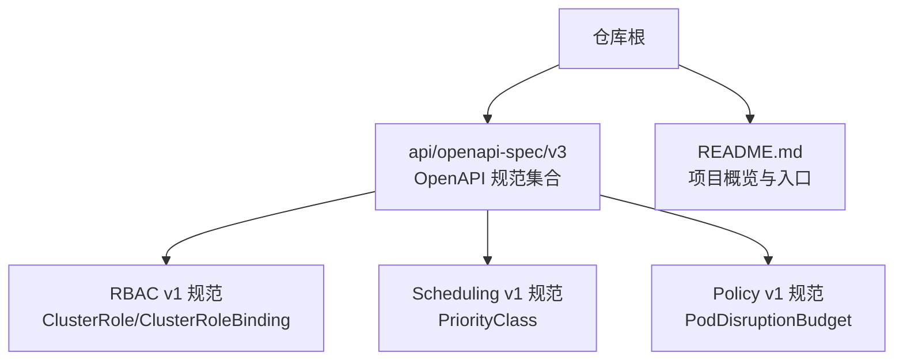
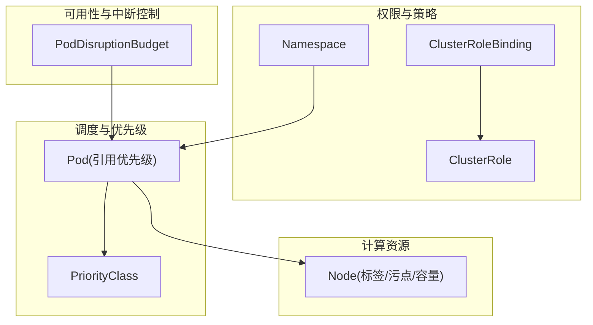
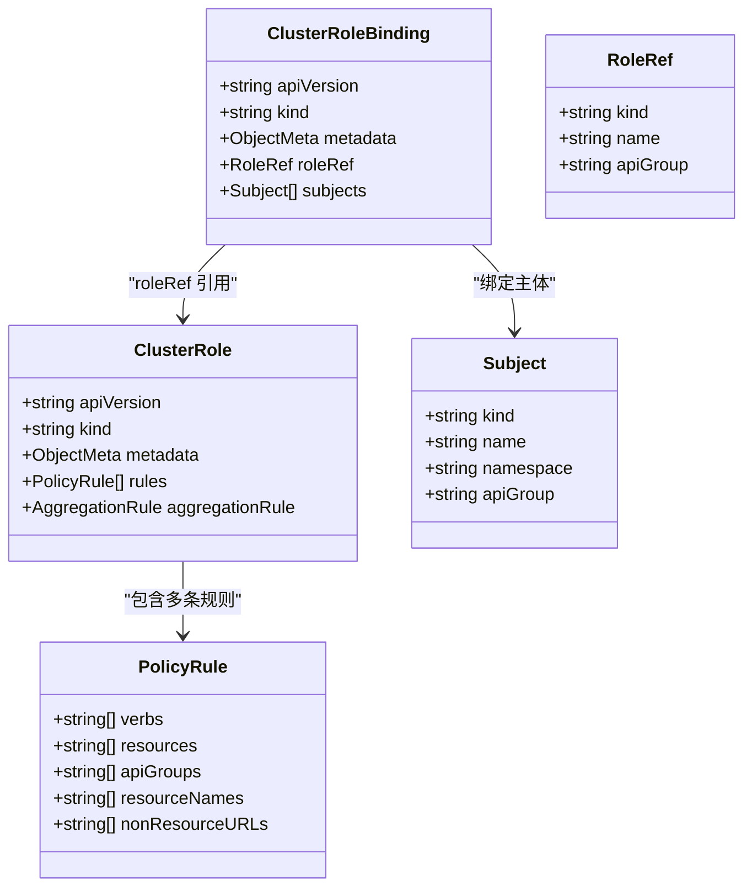
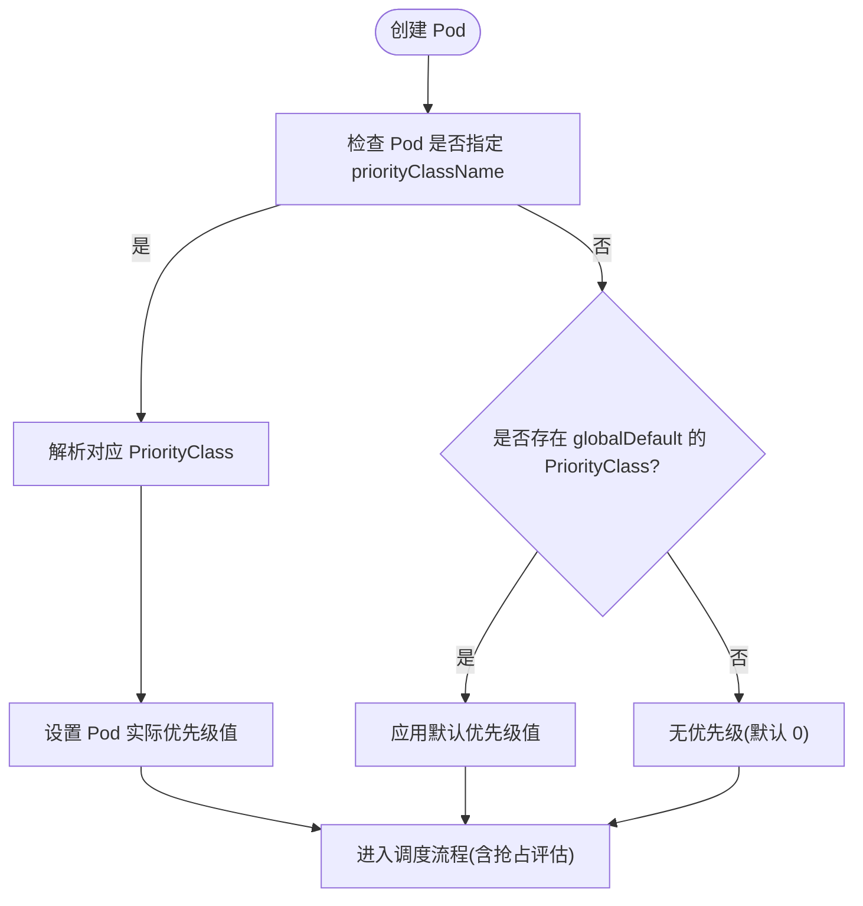
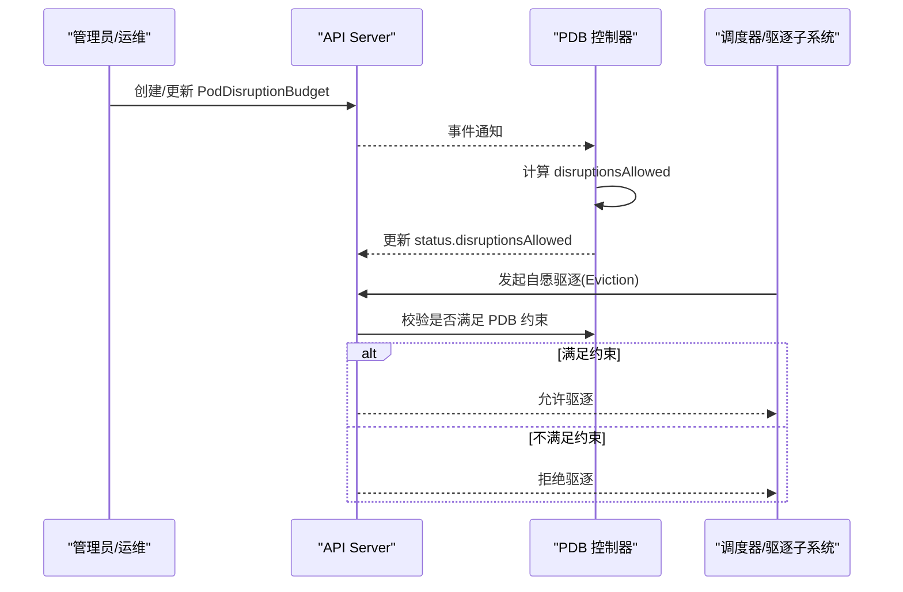
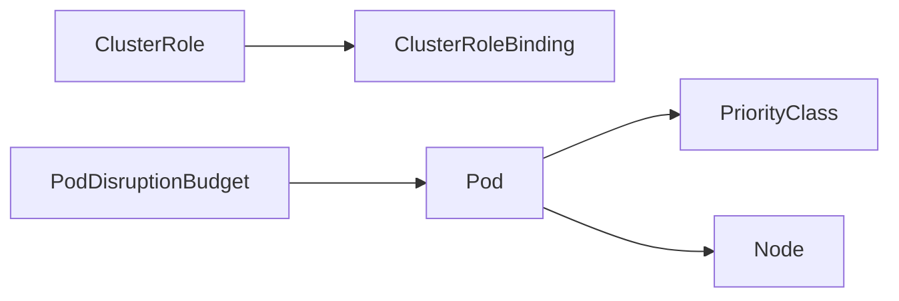

# 集群管理资源

<cite>
**本文引用的文件**   
- [README.md](file://README.md)
- [apis__rbac.authorization.k8s.io__v1_openapi.json](file://api/openapi-spec/v3/apis__rbac.authorization.k8s.io__v1_openapi.json)
- [apis__scheduling.k8s.io__v1_openapi.json](file://api/openapi-spec/v3/apis__scheduling.k8s.io__v1_openapi.json)
- [apis__policy__v1_openapi.json](file://api/openapi-spec/v3/apis__policy__v1_openapi.json)
</cite>

## 目录
1. [简介](#简介)
2. [项目结构](#项目结构)
3. [核心组件](#核心组件)
4. [架构总览](#架构总览)
5. [详细组件分析](#详细组件分析)
6. [依赖关系分析](#依赖关系分析)
7. [性能与扩展性考虑](#性能与扩展性考虑)
8. [故障排查指南](#故障排查指南)
9. [结论](#结论)
10. [附录：配置示例清单](#附录配置示例清单)

## 简介
本文件面向 Kubernetes 集群管理员与平台工程师，系统性阐述以下集群级别资源的定义、用途与配置要点：Node、Namespace、ClusterRole、ClusterRoleBinding、PriorityClass、PodDisruptionBudget。文档基于仓库内 OpenAPI 规范与源码组织进行解读，重点覆盖字段结构、权限控制模型、节点管理与调度优先级机制，并提供多租户隔离、节点亲和性、Pod 中断预算等场景化实践建议与排障指引。

## 项目结构
Kubernetes 仓库采用按功能域划分的模块化结构，API 对象定义通过 OpenAPI 规范集中暴露，便于客户端生成与一致性校验。本次文档聚焦于以下与集群管理密切相关的 API 组与对象：
- core（命名空间、节点等）
- rbac.authorization.k8s.io（角色与绑定）
- scheduling.k8s.io（调度优先级）
- policy（Pod 中断预算）

图表来源
- [README.md:1-101](file://README.md#L1-L101)
- [apis__rbac.authorization.k8s.io__v1_openapi.json:1-800](file://api/openapi-spec/v3/apis__rbac.authorization.k8s.io__v1_openapi.json#L1-L800)
- [apis__scheduling.k8s.io__v1_openapi.json:1-800](file://api/openapi-spec/v3/apis__scheduling.k8s.io__v1_openapi.json#L1-L800)
- [apis__policy__v1_openapi.json:1-800](file://api/openapi-spec/v3/apis__policy__v1_openapi.json#L1-L800)

章节来源
- [README.md:1-101](file://README.md#L1-L101)

## 核心组件
本节从 API 规范出发，梳理各集群级资源的关键字段与作用域，帮助读者快速建立概念模型。

- Node（节点）
  - 作用域：集群级
  - 关键能力：描述节点资源容量、条件状态、标签与污点；用于调度器选择与亲和/反亲和决策
  - 典型字段：metadata、spec（如 taints）、status（如 conditions、capacity、allocatable）
  - 参考路径：core API 的 Node 类型定义（在仓库中由 core 相关 OpenAPI 文件提供）

- Namespace（命名空间）
  - 作用域：集群级
  - 关键能力：为资源提供逻辑隔离边界；配合 RBAC 实现多租户访问控制
  - 典型字段：metadata、spec（如 finalizers）
  - 参考路径：core API 的 Namespace 类型定义

- ClusterRole / ClusterRoleBinding（集群角色与绑定）
  - 作用域：集群级
  - 关键能力：定义跨命名空间的权限规则与主体绑定
  - 关键字段：
    - ClusterRole：rules（PolicyRule 列表），可选 aggregationRule
    - ClusterRoleBinding：roleRef（指向 ClusterRole），subjects（User/Group/ServiceAccount）
  - 参考路径：[apis__rbac.authorization.k8s.io__v1_openapi.json:1-800](file://api/openapi-spec/v3/apis__rbac.authorization.k8s.io__v1_openapi.json#L1-L800)

- PriorityClass（调度优先级类）
  - 作用域：集群级
  - 关键能力：为 Pod 提供全局优先级值与抢占策略
  - 关键字段：value、preemptionPolicy、globalDefault、description
  - 参考路径：[apis__scheduling.k8s.io__v1_openapi.json:1-800](file://api/openapi-spec/v3/apis__scheduling.k8s.io__v1_openapi.json#L1-L800)

- PodDisruptionBudget（Pod 中断预算）
  - 作用域：命名空间级
  - 关键能力：限制自愿驱逐数量，保障服务可用性
  - 关键字段：spec.selector、spec.minAvailable/spec.maxUnavailable、spec.unhealthyPodEvictionPolicy；status.disruptionsAllowed 等
  - 参考路径：[apis__policy__v1_openapi.json:1-800](file://api/openapi-spec/v3/apis__policy__v1_openapi.json#L1-L800)

章节来源
- [apis__rbac.authorization.k8s.io__v1_openapi.json:1-800](file://api/openapi-spec/v3/apis__rbac.authorization.k8s.io__v1_openapi.json#L1-L800)
- [apis__scheduling.k8s.io__v1_openapi.json:1-800](file://api/openapi-spec/v3/apis__scheduling.k8s.io__v1_openapi.json#L1-L800)
- [apis__policy__v1_openapi.json:1-800](file://api/openapi-spec/v3/apis__policy__v1_openapi.json#L1-L800)

## 架构总览
下图展示集群管理资源在系统内的层次与交互关系：RBAC 决定“谁可以做什么”，PriorityClass 影响“何时被调度”，PDB 约束“如何优雅地减少副本”，Node/Namespace 提供“在哪里运行”和“在哪个逻辑域运行”。

图表来源
- [apis__rbac.authorization.k8s.io__v1_openapi.json:1-800](file://api/openapi-spec/v3/apis__rbac.authorization.k8s.io__v1_openapi.json#L1-L800)
- [apis__scheduling.k8s.io__v1_openapi.json:1-800](file://api/openapi-spec/v3/apis__scheduling.k8s.io__v1_openapi.json#L1-L800)
- [apis__policy__v1_openapi.json:1-800](file://api/openapi-spec/v3/apis__policy__v1_openapi.json#L1-L800)

## 详细组件分析

### RBAC：ClusterRole 与 ClusterRoleBinding
- 设计要点
  - ClusterRole 是逻辑化的权限集合，可包含对 API 资源与非资源 URL 的访问规则
  - ClusterRoleBinding 将 ClusterRole 绑定到用户、组或服务账号，作用域为集群
  - 支持聚合规则（aggregationRule）以动态组合多个角色的权限
- 关键字段
  - PolicyRule：verbs、resources、apiGroups、resourceNames、nonResourceURLs
  - RoleRef：kind、name、apiGroup
  - Subject：kind（User/Group/ServiceAccount）、name、namespace（仅适用于非命名空间对象时不应设置）
- 权限模型
  - 先认证后授权；Authorizer 根据 Subject 与 RoleRef 解析最终权限
  - 非资源 URL 仅在集群级角色中生效
- 最佳实践
  - 最小权限原则；使用精确 verbs/resources/apiGroups
  - 避免滥用 wildcard；优先使用 resourceNames 做细粒度白名单
  - 使用聚合规则维护通用角色族

图表来源
- [apis__rbac.authorization.k8s.io__v1_openapi.json:1-800](file://api/openapi-spec/v3/apis__rbac.authorization.k8s.io__v1_openapi.json#L1-L800)

章节来源
- [apis__rbac.authorization.k8s.io__v1_openapi.json:1-800](file://api/openapi-spec/v3/apis__rbac.authorization.k8s.io__v1_openapi.json#L1-L800)

### 调度优先级：PriorityClass
- 设计要点
  - 为 Pod 提供全局优先级值，影响调度顺序与抢占行为
  - 支持默认优先级类（globalDefault）与抢占策略（preemptionPolicy）
- 关键字段
  - value：整型优先级值
  - preemptionPolicy：Never 或 PreemptLowerPriority
  - globalDefault：是否作为未指定优先级的 Pod 的默认值
  - description：说明文本
- 使用方式
  - 在 Pod.spec.priorityClassName 中引用
  - 结合节点资源压力与调度器抢占策略提升关键工作负载的调度成功率

图表来源
- [apis__scheduling.k8s.io__v1_openapi.json:1-800](file://api/openapi-spec/v3/apis__scheduling.k8s.io__v1_openapi.json#L1-L800)

章节来源
- [apis__scheduling.k8s.io__v1_openapi.json:1-800](file://api/openapi-spec/v3/apis__scheduling.k8s.io__v1_openapi.json#L1-L800)

### 可用性保障：PodDisruptionBudget
- 设计要点
  - 限制自愿驱逐数量，确保业务在节点维护、滚动升级等场景下的可用性
  - 支持两种互斥策略：minAvailable 与 maxUnavailable
  - 支持 unhealthyPodEvictionPolicy 控制不健康 Pod 的驱逐策略
- 关键字段
  - spec.selector：匹配受保护的 Pod 集合
  - spec.minAvailable 或 spec.maxUnavailable：二选一
  - spec.unhealthyPodEvictionPolicy：IfHealthyBudget 或 AlwaysAllow
  - status.disruptionsAllowed：当前允许的最大中断数
- 控制器行为
  - 当满足 PDB 约束时才允许自愿驱逐；否则拒绝 Eviction 请求
  - 状态中包含期望健康数、当前健康数、已处理驱逐信息等

图表来源
- [apis__policy__v1_openapi.json:1-800](file://api/openapi-spec/v3/apis__policy__v1_openapi.json#L1-L800)

章节来源
- [apis__policy__v1_openapi.json:1-800](file://api/openapi-spec/v3/apis__policy__v1_openapi.json#L1-L800)

### 节点与命名空间：Node 与 Namespace
- Node
  - 通过标签与污点表达节点属性与约束；调度器据此进行亲和/反亲和与容忍度匹配
  - 通过 capacity/allocatable 表达资源上限与可分配量
  - 通过 conditions 表达节点健康状态（Ready、MemoryPressure 等）
- Namespace
  - 提供逻辑隔离边界，配合 RBAC 实现多租户访问控制
  - 可作为 PDB、配额等资源的作用域

章节来源
- [README.md:1-101](file://README.md#L1-L101)

## 依赖关系分析
- 组件耦合
  - ClusterRoleBinding 强依赖 ClusterRole（roleRef 不可变）
  - Pod 依赖 PriorityClass（若未指定则回退至 globalDefault）
  - PDB 依赖 selector 匹配的 Pod 集合，并受其 status 驱动
- 外部依赖
  - Authorizer 依据 RBAC 规则执行授权决策
  - 调度器读取 Node 的 taints/labels/capacity 与 Pod 的优先级进行调度与抢占
  - 驱逐子系统在执行自愿驱逐前需通过 PDB 校验

图表来源
- [apis__rbac.authorization.k8s.io__v1_openapi.json:1-800](file://api/openapi-spec/v3/apis__rbac.authorization.k8s.io__v1_openapi.json#L1-L800)
- [apis__scheduling.k8s.io__v1_openapi.json:1-800](file://api/openapi-spec/v3/apis__scheduling.k8s.io__v1_openapi.json#L1-L800)
- [apis__policy__v1_openapi.json:1-800](file://api/openapi-spec/v3/apis__policy__v1_openapi.json#L1-L800)

## 性能与扩展性考虑
- RBAC
  - 避免过度宽泛的规则与大量聚合链，降低授权决策开销
  - 合理使用 resourceNames 缩小匹配范围
- 调度与优先级
  - 合理设置优先级梯度，避免过多高优先级 Pod 导致低优先级任务饥饿
  - 谨慎启用抢占，评估对整体吞吐的影响
- PDB
  - 针对有状态服务设置更严格的 minAvailable，对无状态服务可采用 maxUnavailable
  - 关注 status.disruptionsAllowed 与 expectedPods/currentHealthy 指标，及时调整策略
- 节点管理
  - 利用污点与容忍度隔离不同工作负载；通过标签细化亲和策略
  - 监控 capacity/allocatable 变化，及时扩缩容

## 故障排查指南
- RBAC 授权失败
  - 检查 ClusterRole 的 rules 是否覆盖所需 verbs/resources/apiGroups
  - 确认 ClusterRoleBinding 的 subjects 是否正确且未被其他策略覆盖
  - 对于非资源 URL，确保仅在集群级角色中配置
- 调度问题
  - 核对 Pod 的 priorityClassName 与对应 PriorityClass 的 value/preemptionPolicy
  - 检查目标节点的 taints/labels 与 Pod 的 tolerations/nodeSelector/affinity 是否匹配
  - 观察节点 conditions 与资源压力，必要时扩容或调整优先级
- PDB 阻止驱逐
  - 查看 status.disruptionsAllowed 是否为 0，以及 expectedPods/currentHealthy 是否达到期望
  - 调整 minAvailable/maxUnavailable 或 unhealthyPodEvictionPolicy
  - 验证 selector 是否正确匹配目标 Pod

章节来源
- [apis__rbac.authorization.k8s.io__v1_openapi.json:1-800](file://api/openapi-spec/v3/apis__rbac.authorization.k8s.io__v1_openapi.json#L1-L800)
- [apis__scheduling.k8s.io__v1_openapi.json:1-800](file://api/openapi-spec/v3/apis__scheduling.k8s.io__v1_openapi.json#L1-L800)
- [apis__policy__v1_openapi.json:1-800](file://api/openapi-spec/v3/apis__policy__v1_openapi.json#L1-L800)

## 结论
通过合理运用 Node、Namespace、ClusterRole/ClusterRoleBinding、PriorityClass 与 PodDisruptionBudget，可以在多租户隔离、精细化权限控制、弹性调度与高可用保障等方面构建稳健的集群治理体系。建议在变更过程中遵循最小权限、渐进式灰度与持续观测的原则，并结合监控与告警闭环优化策略。

## 附录：配置示例清单
以下为常见场景的配置思路与字段要点（不直接粘贴 YAML 内容，请根据字段说明自行编写）：
- 多租户隔离
  - 为每个团队创建独立 Namespace
  - 使用 ClusterRole 定义只读/读写等基础角色，并通过 ClusterRoleBinding 绑定到团队 ServiceAccount
  - 在 Namespace 内使用 Role/RoleBinding 进一步收敛权限
- 节点亲和性配置
  - 在 Node 上打标签（如 topology.kubernetes.io/zone、gpu=true）
  - 在 Pod 中使用 nodeSelector、nodeAffinity、podAntiAffinity 与 tolerations 进行调度约束
- Pod 中断预算设置
  - 对有状态服务：设置较高的 minAvailable 或较小的 maxUnavailable
  - 对无状态服务：根据副本规模与服务 SLA 设置合适的 maxUnavailable
  - 关注 status.disruptionsAllowed 与 expectedPods/currentHealthy 指标
- 调度优先级与抢占
  - 定义多个 PriorityClass（如 critical、high、low），并为关键工作负载设置更高 value
  - 根据业务容忍度选择 preemptionPolicy（通常使用 PreemptLowerPriority）
  - 在 Pod 中指定 priorityClassName 以生效