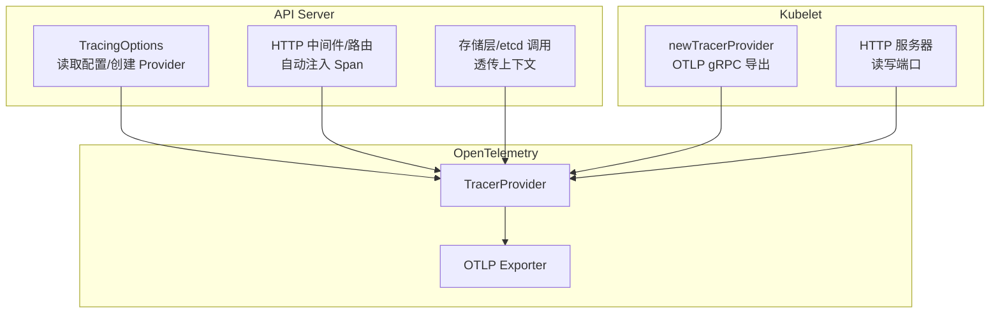
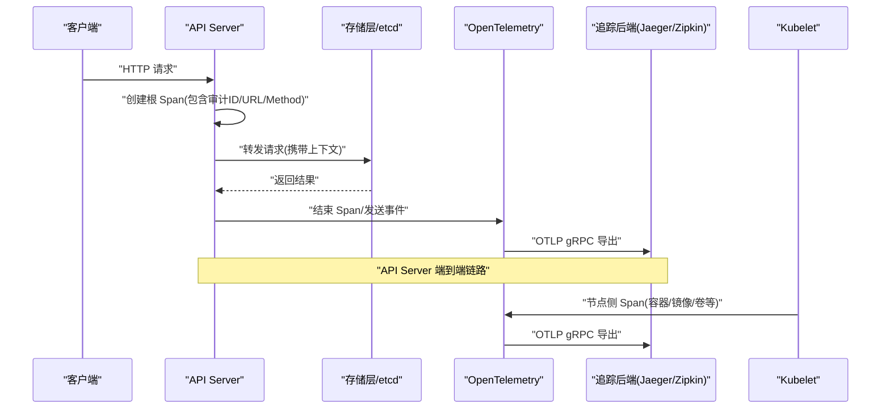
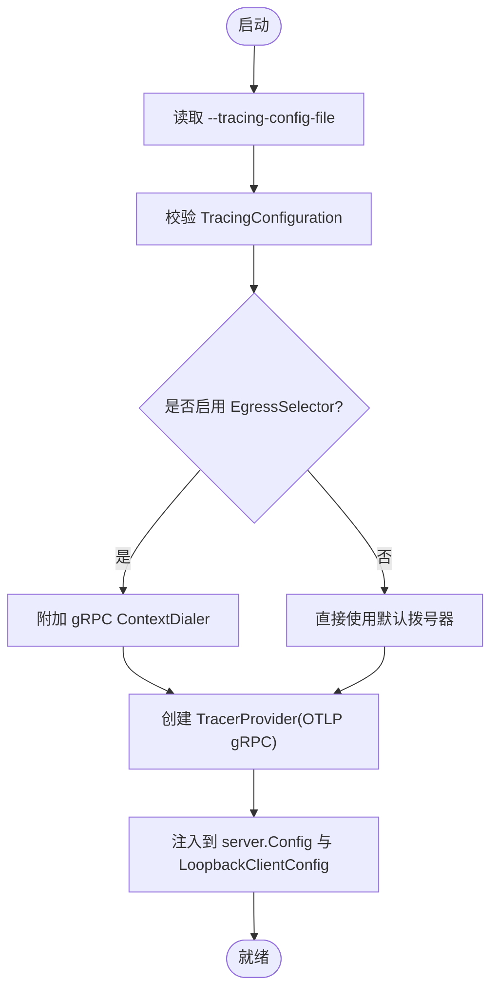
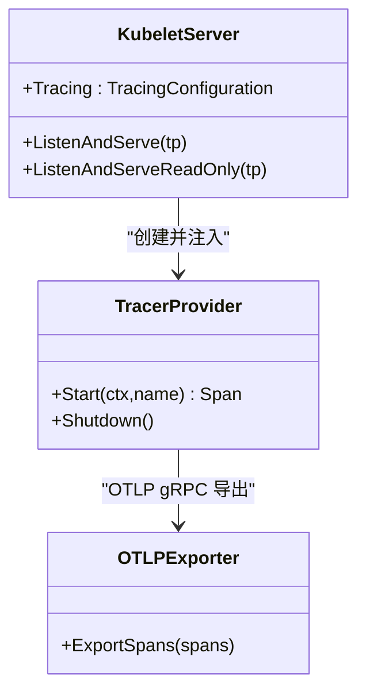
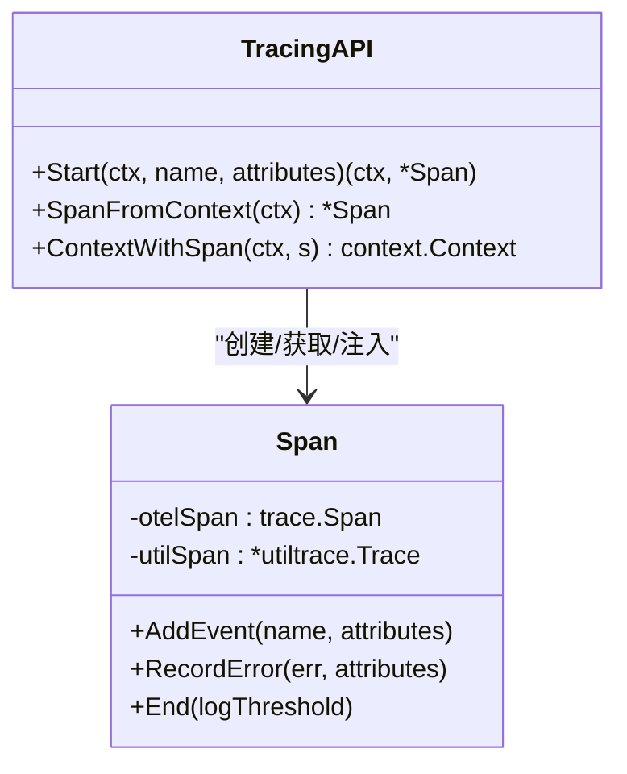
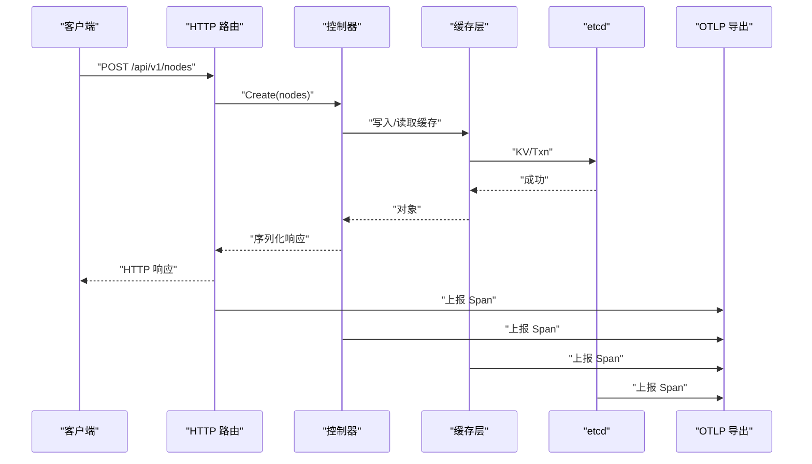
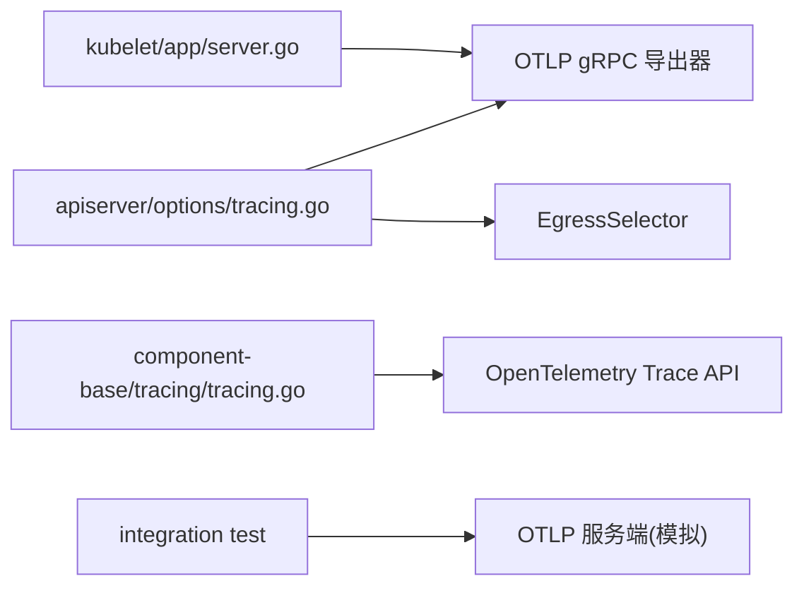

# 分布式追踪

<cite>
**本文引用的文件**   
- [tracing.go](file://staging/src/k8s.io/component-base/tracing/tracing.go)
- [tracing.go](file://staging/src/k8s.io/apiserver/pkg/server/options/tracing.go)
- [server.go](file://cmd/kubelet/app/server.go)
- [tracing_test.go](file://test/integration/apiserver/tracing/tracing_test.go)
</cite>

## 目录
1. [简介](#简介)
2. [项目结构](#项目结构)
3. [核心组件](#核心组件)
4. [架构总览](#架构总览)
5. [详细组件分析](#详细组件分析)
6. [依赖关系分析](#依赖关系分析)
7. [性能考量](#性能考量)
8. [故障排查指南](#故障排查指南)
9. [结论](#结论)
10. [附录](#附录)

## 简介
本技术文档聚焦于 Kubernetes 的分布式追踪能力，围绕 OpenTelemetry 集成、追踪数据收集与导出、API 请求链路追踪、控制器执行跟踪、节点操作审计等主题展开。文档基于仓库中的实际实现与测试用例，提供可操作的部署与配置建议（含 Jaeger、Zipkin 等后端），并解释采样策略、性能开销控制、上下文传播与跨服务关联分析方法，以及常见性能问题的定位技巧与调试工具使用指南。

## 项目结构
Kubernetes 在多个组件中集成了 OpenTelemetry：
- API Server：通过命令行参数加载追踪配置文件，初始化 TracerProvider，并将 TracerProvider 注入到内部 HTTP 客户端与存储层。
- Kubelet：支持通过配置创建 OTLP gRPC 导出器，将节点侧的追踪数据发送到远端后端。
- 通用 tracing 库：封装了 Span 生命周期管理，兼容 k8s.io/utils/trace，便于平滑迁移至 OpenTelemetry。
- 集成测试：验证 API Server 的追踪链路完整性，包括认证、EgressSelector、加密存储等场景。

图表来源
- [tracing.go:84-131](file://staging/src/k8s.io/apiserver/pkg/server/options/tracing.go#L84-L131)
- [server.go:1420-1434](file://cmd/kubelet/app/server.go#L1420-L1434)
- [tracing.go:31-99](file://staging/src/k8s.io/component-base/tracing/tracing.go#L31-L99)

章节来源
- [tracing.go:84-131](file://staging/src/k8s.io/apiserver/pkg/server/options/tracing.go#L84-L131)
- [server.go:1420-1434](file://cmd/kubelet/app/server.go#L1420-L1434)
- [tracing.go:31-99](file://staging/src/k8s.io/component-base/tracing/tracing.go#L31-L99)

## 核心组件
- 通用 Span 封装（component-base/tracing）
  - 提供 Start/SpanFromContext/ContextWithSpan 等方法，同时维护 OpenTelemetry Span 与 k8s.io/utils/trace Span，确保向后兼容与渐进迁移。
  - 支持事件记录、错误记录、长耗时日志阈值输出。
- API Server 追踪选项（apiserver/options/tracing）
  - 通过 --tracing-config-file 指定配置，解析为 TracingConfiguration，创建 OTLP gRPC 导出器，设置 ServiceName/ServiceInstanceID 等资源属性。
  - 可选地结合 EgressSelector 控制出站网络路径。
  - 将 TracerProvider 注入到 LoopbackClientConfig，使内部调用也能被追踪。
- Kubelet 追踪提供者（kubelet/app/server）
  - 根据 KubeletConfiguration.Tracing 创建 TracerProvider，默认使用 OTLP gRPC 导出器，并设置资源属性（如服务名、实例 ID）。
  - 将 TracerProvider 传入 HTTP 服务器的读写端口监听方法，以便对请求进行追踪。

章节来源
- [tracing.go:31-99](file://staging/src/k8s.io/component-base/tracing/tracing.go#L31-L99)
- [tracing.go:84-131](file://staging/src/k8s.io/apiserver/pkg/server/options/tracing.go#L84-L131)
- [server.go:1420-1434](file://cmd/kubelet/app/server.go#L1420-L1434)

## 架构总览
下图展示了从客户端请求进入 API Server，到存储层写入 etcd，再到 OTLP 导出的完整链路；同时展示 Kubelet 作为节点代理的独立追踪出口。

图表来源
- [tracing_test.go:326-496](file://test/integration/apiserver/tracing/tracing_test.go#L326-L496)
- [tracing.go:100-131](file://staging/src/k8s.io/apiserver/pkg/server/options/tracing.go#L100-L131)
- [server.go:1420-1434](file://cmd/kubelet/app/server.go#L1420-L1434)

## 详细组件分析

### API Server 追踪配置与导出
- 配置入口
  - 通过 --tracing-config-file 指定 YAML/JSON 格式的 TracingConfiguration。
  - 校验通过后，构造 OTLP gRPC 导出器，必要时使用 EgressSelector 的 ControlPlane 网络拨号器。
  - 设置资源属性 ServiceName 与 ServiceInstanceID，创建 TracerProvider 并注入到 server.Config。
- 内部调用追踪
  - 将 TracerProvider 包装到 LoopbackClientConfig，使得内部 REST 调用也具备追踪上下文。
- 典型 Span 与事件
  - 测试覆盖了 HTTP 路由级 Span、控制器处理 Span、存储层 Span（cacher、etcd KV/Txn）、序列化响应等阶段，并附带审计 ID、协议、媒体类型等属性。

图表来源
- [tracing.go:84-131](file://staging/src/k8s.io/apiserver/pkg/server/options/tracing.go#L84-L131)

章节来源
- [tracing.go:84-131](file://staging/src/k8s.io/apiserver/pkg/server/options/tracing.go#L84-L131)
- [tracing_test.go:326-496](file://test/integration/apiserver/tracing/tracing_test.go#L326-L496)

### Kubelet 追踪提供者
- 创建流程
  - 根据 KubeletConfiguration.Tracing 构建 TracerProvider，默认使用 OTLP gRPC 导出器。
  - 设置资源属性（例如服务名、实例标识），用于区分不同节点上的追踪数据。
- 使用方式
  - 将 TracerProvider 传入 kubelet 的 ListenAndServe 与 ListenAndServeReadOnly，实现对读写端口的请求追踪。
- 无追踪模式
  - 当未启用追踪时，返回 noop TracerProvider，避免额外开销。

图表来源
- [server.go:1420-1434](file://cmd/kubelet/app/server.go#L1420-L1434)

章节来源
- [server.go:1420-1434](file://cmd/kubelet/app/server.go#L1420-L1434)

### 通用 Span 封装（兼容 utils/trace）
- 设计要点
  - Start 会在已有上下文的 OpenTelemetry Span 基础上创建子 Span，若没有则退化为空操作。
  - 同时创建 utiltrace Span，保持与旧版追踪系统的兼容。
  - AddEvent/RecordError/End 等方法同步更新两个系统的事件与状态。
- 上下文传播
  - SpanFromContext/ContextWithSpan 提供获取与注入 Span 的能力，确保跨函数/跨包调用链路的连续性。

图表来源
- [tracing.go:31-99](file://staging/src/k8s.io/component-base/tracing/tracing.go#L31-L99)

章节来源
- [tracing.go:31-99](file://staging/src/k8s.io/component-base/tracing/tracing.go#L31-L99)

### API 请求链路追踪（示例）
- 覆盖范围
  - HTTP 路由级 Span（包含 URL、Method、User-Agent、Audit-ID 等属性）。
  - 控制器处理 Span（Get/Create/List/Watch 等）。
  - 存储层 Span（cacher.GetList/cacher.Watch、etcdserverpb.KV/Range 或 Txn）。
  - 序列化响应 Span（包含媒体类型、编码器信息）。
- 认证与审计
  - 测试验证了未认证请求不会生成匹配 Trace，体现安全边界。
  - Audit-ID 贯穿各层 Span，便于与审计日志关联。

图表来源
- [tracing_test.go:380-496](file://test/integration/apiserver/tracing/tracing_test.go#L380-L496)

章节来源
- [tracing_test.go:380-496](file://test/integration/apiserver/tracing/tracing_test.go#L380-L496)

## 依赖关系分析
- 组件耦合
  - API Server 的 TracingOptions 依赖 OTLP gRPC 导出器与 EgressSelector，负责创建 TracerProvider 并注入到内部 HTTP 客户端。
  - Kubelet 的 newTracerProvider 依赖 KubeletConfiguration.Tracing，创建 TracerProvider 并注入到 HTTP 服务器。
  - 通用 tracing 库解耦具体后端，向上提供统一的 Span 接口。
- 外部依赖
  - OpenTelemetry SDK/Trace API、OTLP gRPC 导出器、semconv 资源语义约定。
  - 测试依赖 grpc 与 OTLP proto，模拟后端接收 Span。

图表来源
- [tracing.go:100-131](file://staging/src/k8s.io/apiserver/pkg/server/options/tracing.go#L100-L131)
- [server.go:1420-1434](file://cmd/kubelet/app/server.go#L1420-L1434)
- [tracing.go:31-99](file://staging/src/k8s.io/component-base/tracing/tracing.go#L31-L99)
- [tracing_test.go:326-496](file://test/integration/apiserver/tracing/tracing_test.go#L326-L496)

章节来源
- [tracing.go:100-131](file://staging/src/k8s.io/apiserver/pkg/server/options/tracing.go#L100-L131)
- [server.go:1420-1434](file://cmd/kubelet/app/server.go#L1420-L1434)
- [tracing.go:31-99](file://staging/src/k8s.io/component-base/tracing/tracing.go#L31-L99)
- [tracing_test.go:326-496](file://test/integration/apiserver/tracing/tracing_test.go#L326-L496)

## 性能考量
- 采样策略
  - 建议在应用层或网关层统一控制采样率，避免全量上报导致带宽与存储压力。
  - 对于关键路径（如写操作、异常路径）提高采样比例，读操作可降低采样率。
- 开销控制
  - 避免在高频热点路径添加过多 Span 与事件，仅保留必要的关键点。
  - 合理设置长耗时阈值，减少不必要的日志输出。
- 数据导出
  - 使用批量导出与连接复用，降低网络开销。
  - 针对高吞吐环境，考虑本地缓冲与异步导出。

[本节为通用指导，不直接分析具体文件]

## 故障排查指南
- 常见问题定位
  - 未生成 Trace：检查是否启用了追踪配置，确认 --tracing-config-file 指向有效文件。
  - 未认证请求无 Trace：参考集成测试，未认证的请求不应产生匹配的 Trace。
  - 无法连接后端：检查 OTLP 地址、网络连通性与证书配置；若启用 EgressSelector，确认 ControlPlane 拨号器可用。
- 调试工具
  - 使用 otelhttp.NewTransport 包裹 HTTP 客户端以注入上下文（见集成测试）。
  - 借助审计 ID 与 Span 属性（如 url.path、audit-id、rpc.system.name）关联日志与追踪。
  - 在关键路径增加 AddEvent/RecordError，辅助定位问题。

章节来源
- [tracing_test.go:261-324](file://test/integration/apiserver/tracing/tracing_test.go#L261-L324)
- [tracing_test.go:326-496](file://test/integration/apiserver/tracing/tracing_test.go#L326-L496)

## 结论
Kubernetes 通过 OpenTelemetry 实现了跨组件的分布式追踪能力。API Server 与 Kubelet 均支持 OTLP gRPC 导出，配合通用 Span 封装与上下文传播机制，能够覆盖从 HTTP 入口到存储层的完整链路。通过合理的采样策略与导出配置，可在保证可观测性的同时控制性能开销。集成测试提供了端到端的验证样例，有助于快速落地与排障。

[本节为总结性内容，不直接分析具体文件]

## 附录

### 配置项速查（API Server）
- 命令行参数
  - --tracing-config-file：追踪配置文件路径
- 配置文件关键字段（TracingConfiguration）
  - endpoint：OTLP 后端地址
  - sampling：采样策略（由后端或应用层决定）
  - resource：服务名、实例 ID 等属性

章节来源
- [tracing.go:74-82](file://staging/src/k8s.io/apiserver/pkg/server/options/tracing.go#L74-L82)
- [tracing.go:116-121](file://staging/src/k8s.io/apiserver/pkg/server/options/tracing.go#L116-L121)

### 配置项速查（Kubelet）
- 配置来源
  - KubeletConfiguration.Tracing：定义 OTLP 导出目标与资源属性
- 运行时注入
  - TracerProvider 注入到 ListenAndServe 与 ListenAndServeReadOnly

章节来源
- [server.go:1420-1434](file://cmd/kubelet/app/server.go#L1420-L1434)

### 追踪后端部署建议（Jaeger/Zipkin）
- 选择 OTLP 兼容的后端（Jaeger Collector、Zipkin OTLP Receiver）。
- 配置正确的 endpoint 与必要的鉴权/TLS。
- 在高吞吐环境下，启用批处理与压缩以减少带宽占用。

[本节为通用指导，不直接分析具体文件]